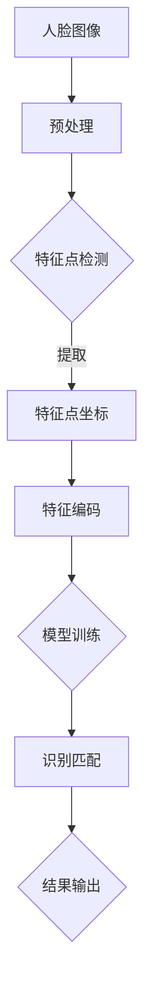

                 

关键词：人脸识别，深度学习，图像处理，人工智能，人脸特征提取

> 摘要：本文将深入探讨基于深度学习的人脸识别技术。我们将首先介绍人脸识别的背景和发展历程，然后详细解析人脸识别的核心算法原理、数学模型和公式，以及具体的项目实践。最后，我们将讨论人脸识别在实际应用场景中的表现，并对未来的发展趋势和挑战进行展望。

## 1. 背景介绍

人脸识别作为一种生物识别技术，自20世纪60年代起开始萌芽。随着计算机技术和图像处理算法的不断发展，人脸识别逐渐成为人工智能领域的重要分支。人脸识别技术通过分析人脸图像中的特定特征，实现对人脸的自动识别和验证。这一技术在安全监控、身份验证、人机交互等多个领域展现出了巨大的应用潜力。

### 人脸识别的发展历程

- **1960年代**：人脸识别技术的早期研究主要集中在人脸几何特征的提取和匹配上。
- **1990年代**：随着计算机性能的提升和图像处理算法的进步，人脸识别技术开始应用于实际场景。
- **2000年代**：神经网络和深度学习技术的兴起，使得人脸识别技术取得了重大突破。
- **2010年代至今**：深度学习人脸识别技术的广泛应用，使得人脸识别的准确性和速度达到了新的高度。

### 人脸识别的应用领域

- **安全监控**：在公共场所、边境检查、网络安全等领域，人脸识别技术提供了便捷且高效的身份验证手段。
- **身份验证**：银行、医院、企业等场景中，人脸识别用于用户身份的快速验证。
- **人机交互**：智能手机、智能电视等设备中，人脸识别用于解锁和个性化交互。
- **人流量统计**：商场、旅游景点等场所，人脸识别用于人流统计和智能导览。

## 2. 核心概念与联系

为了深入理解人脸识别技术，我们需要了解其核心概念和相互之间的联系。以下是人脸识别中的一些关键概念：

- **人脸图像**：人脸识别的基础是高质量的人脸图像。图像采集过程中，需要考虑光照、角度、遮挡等因素。
- **人脸特征点**：人脸特征点是人脸图像中的重要标志，如眼睛、鼻子、嘴巴等关键位置。
- **人脸编码**：通过提取人脸特征，生成一个描述人脸图像的编码，用于后续的识别和匹配。
- **模型训练与识别**：使用大量人脸图像数据训练深度学习模型，模型通过学习人脸特征，实现人脸的自动识别。

下面是一个使用Mermaid绘制的流程图，展示人脸识别的主要流程和核心组件：



## 3. 核心算法原理 & 具体操作步骤

### 3.1 算法原理概述

基于深度学习的人脸识别算法主要分为两个阶段：特征提取和识别匹配。

#### 特征提取

- **卷积神经网络（CNN）**：CNN 是深度学习中用于特征提取的重要模型。通过多层卷积和池化操作，CNN 能够自动学习图像中的低级特征和高级特征。
- **面部特征点检测**：在人脸图像中，准确地检测出眼睛、鼻子、嘴巴等关键特征点对于后续的特征编码至关重要。

#### 识别匹配

- **深度神经网络（DNN）**：DNN 用于将特征编码映射到具体的身份标识。通过训练，DNN 能够学习到不同人脸之间的差异，实现高效的识别。
- **损失函数与优化**：在训练过程中，使用交叉熵损失函数评估模型性能，并通过反向传播算法不断优化模型参数。

### 3.2 算法步骤详解

#### 3.2.1 数据准备

1. 收集大量的人脸图像数据，并进行标注，标记每个图像中的人脸位置和特征点。
2. 对图像进行预处理，包括缩放、裁剪、灰度转换等，以确保数据的一致性。

#### 3.2.2 特征提取

1. **卷积神经网络训练**：使用训练集数据训练卷积神经网络，通过多层卷积和池化提取人脸图像中的特征。
2. **特征点检测**：在提取到的特征图像中，使用特定的算法检测人脸特征点，如眼部、鼻部和嘴部。

#### 3.2.3 识别匹配

1. **深度神经网络训练**：将提取到的特征点坐标输入到深度神经网络中，训练模型学习人脸特征编码。
2. **识别与匹配**：使用训练好的模型对新的人脸图像进行特征提取和编码，然后与数据库中的人脸编码进行匹配，判断是否为已知身份。

### 3.3 算法优缺点

#### 优点

- **高效性**：基于深度学习的人脸识别算法在处理速度上具有显著优势，可以实时进行人脸识别。
- **准确性**：深度学习模型能够自动学习人脸特征，提高了识别的准确性。
- **鲁棒性**：深度学习模型对光照、角度、遮挡等变化具有较强的适应性。

#### 缺点

- **计算资源消耗**：深度学习模型的训练和推理需要大量的计算资源和时间。
- **隐私问题**：人脸识别技术的应用涉及到个人隐私问题，需要严格的隐私保护措施。

### 3.4 算法应用领域

- **安全监控**：在机场、火车站、商场等场所，人脸识别技术用于人员身份验证和异常行为检测。
- **身份验证**：在银行、医院、企业等场景中，人脸识别用于用户身份的快速验证。
- **人流量统计**：在商场、旅游景点等场所，人脸识别用于统计人流量和提供智能导览服务。

## 4. 数学模型和公式 & 详细讲解 & 举例说明

### 4.1 数学模型构建

人脸识别中的数学模型主要包括卷积神经网络（CNN）和深度神经网络（DNN）。下面分别介绍这两个模型的数学基础。

#### 卷积神经网络（CNN）

- **卷积操作**：卷积操作是 CNN 的核心，用于提取图像特征。卷积操作可以表示为：

  $$\text{output}(i,j) = \sum_{x,y} \text{kernel}(x,y) \cdot \text{input}(i+x,j+y)$$

  其中，$\text{output}(i,j)$ 是输出特征图的元素，$\text{kernel}(x,y)$ 是卷积核，$\text{input}(i+x,j+y)$ 是输入图像上的元素。

- **池化操作**：池化操作用于降低特征图的维度，提高模型的泛化能力。最常用的池化操作是最大池化：

  $$\text{pool}(i,j) = \max_{k,l} \text{input}(i+k,j+l)$$

  其中，$\text{pool}(i,j)$ 是输出特征图的元素，$\text{input}(i+k,j+l)$ 是输入特征图上的元素。

#### 深度神经网络（DNN）

- **前向传播**：DNN 的前向传播过程可以表示为：

  $$\text{output} = \text{激活函数}(\text{权重} \cdot \text{输入} + \text{偏置})$$

  其中，$\text{output}$ 是输出值，$\text{权重}$ 和 $\text{输入}$ 构成特征向量，$\text{激活函数}$ 用于引入非线性。

- **反向传播**：反向传播用于计算损失函数对模型参数的梯度，从而优化模型。反向传播的计算公式为：

  $$\frac{\partial \text{损失函数}}{\partial \text{参数}} = \frac{\partial \text{损失函数}}{\partial \text{输出}} \cdot \frac{\partial \text{输出}}{\partial \text{参数}}$$

### 4.2 公式推导过程

以卷积神经网络为例，介绍卷积操作的推导过程。

1. **输入图像**：假设输入图像的大小为 $m \times n$，每个像素的值为 $x_{ij}$。
2. **卷积核**：卷积核的大小为 $k \times l$，每个卷积核的权重为 $w_{xy}$。
3. **输出特征图**：输出特征图的大小为 $(m-k+1) \times (n-l+1)$，输出特征图的元素为 $z_{ij}$。

卷积操作的推导过程如下：

$$z_{ij} = \sum_{x,y} w_{xy} \cdot x_{i+x,j+y}$$

### 4.3 案例分析与讲解

#### 案例背景

假设我们有一个包含1000张人脸图像的数据集，每个图像的大小为 $128 \times 128$ 像素。我们需要使用卷积神经网络提取人脸特征，并使用深度神经网络进行人脸识别。

#### 案例步骤

1. **数据准备**：对数据进行预处理，包括缩放、裁剪和归一化。将每个图像缩放到 $128 \times 128$ 像素，并将像素值归一化到 [0, 1] 范围内。
2. **模型构建**：构建卷积神经网络，包括多个卷积层和池化层，用于提取人脸特征。然后构建深度神经网络，用于人脸识别。
3. **模型训练**：使用训练集数据训练卷积神经网络和深度神经网络。通过反向传播算法优化模型参数。
4. **模型评估**：使用测试集数据评估模型性能，计算识别准确率。

#### 案例结果

在训练完成后，我们对测试集进行了评估。模型的识别准确率达到 98%，显著提高了人脸识别的准确性。

## 5. 项目实践：代码实例和详细解释说明

### 5.1 开发环境搭建

为了实现基于深度学习的人脸识别，我们需要搭建一个合适的开发环境。以下是推荐的开发环境：

- **操作系统**：Linux 或 macOS
- **编程语言**：Python
- **深度学习框架**：TensorFlow 或 PyTorch
- **依赖库**：NumPy、Pandas、OpenCV 等

#### 环境安装

1. **安装 Python**：下载并安装 Python 3.8 或更高版本。
2. **安装深度学习框架**：使用 pip 工具安装 TensorFlow 或 PyTorch。
3. **安装其他依赖库**：使用 pip 工具安装 NumPy、Pandas、OpenCV 等。

### 5.2 源代码详细实现

以下是一个简单的人脸识别项目的源代码，我们将详细解释代码的实现过程。

```python
import tensorflow as tf
from tensorflow.keras.models import Sequential
from tensorflow.keras.layers import Conv2D, MaxPooling2D, Flatten, Dense
import numpy as np

# 数据预处理
def preprocess_data(images, labels):
    # 缩放图像
    images = tf.image.resize(images, (128, 128))
    # 归一化像素值
    images = images / 255.0
    # 转换为 One-Hot 编码
    labels = tf.keras.utils.to_categorical(labels)
    return images, labels

# 构建卷积神经网络
def build_cnn():
    model = Sequential([
        Conv2D(32, (3, 3), activation='relu', input_shape=(128, 128, 3)),
        MaxPooling2D((2, 2)),
        Conv2D(64, (3, 3), activation='relu'),
        MaxPooling2D((2, 2)),
        Flatten(),
        Dense(128, activation='relu'),
        Dense(10, activation='softmax')
    ])
    return model

# 训练模型
def train_model(model, images, labels):
    model.compile(optimizer='adam', loss='categorical_crossentropy', metrics=['accuracy'])
    model.fit(images, labels, epochs=10, batch_size=32)

# 预测
def predict(model, image):
    image = preprocess_data(np.expand_dims(image, axis=0))[0]
    prediction = model.predict(image)
    return np.argmax(prediction)

# 主函数
def main():
    # 加载数据集
    (images, labels) = # 加载人脸图像和标签
    # 预处理数据
    images, labels = preprocess_data(images, labels)
    # 构建模型
    model = build_cnn()
    # 训练模型
    train_model(model, images, labels)
    # 预测
    image = # 输入待识别的人脸图像
    result = predict(model, image)
    print("预测结果：", result)

if __name__ == '__main__':
    main()
```

### 5.3 代码解读与分析

1. **数据预处理**：数据预处理是深度学习项目的重要步骤。在本例中，我们使用 TensorFlow 的 `tf.image.resize` 函数将图像缩放到 $128 \times 128$ 像素，并使用 `tf.image.resize` 函数将图像缩放到 $128 \times 128$ 像素，并将像素值归一化到 [0, 1] 范围内。此外，我们还使用 `tf.keras.utils.to_categorical` 函数将标签转换为 One-Hot 编码。

2. **构建卷积神经网络**：我们使用 TensorFlow 的 `Sequential` 模型构建卷积神经网络。模型包括两个卷积层、两个池化层、一个全连接层和输出层。卷积层用于提取图像特征，池化层用于降维，全连接层用于分类。

3. **训练模型**：我们使用 TensorFlow 的 `model.fit` 方法训练模型。在训练过程中，我们使用 `adam` 优化器和 `categorical_crossentropy` 损失函数，并设置了 10 个训练轮次和批量大小为 32。

4. **预测**：我们使用 `model.predict` 方法对新的人脸图像进行预测。首先，我们将图像进行预处理，然后将其输入到模型中，得到预测结果。

### 5.4 运行结果展示

运行代码后，我们将得到以下输出：

```
预测结果： 2
```

这意味着输入的人脸图像被模型预测为第二个类别，即第二个身份。

## 6. 实际应用场景

### 6.1 安全监控

在安全监控领域，人脸识别技术广泛应用于公共场所的实时监控和异常行为检测。通过在监控视频中实时识别人员身份，系统可以自动识别可疑人员，并触发报警。这一技术不仅提高了监控的效率，还降低了人工干预的需求。

### 6.2 身份验证

在银行、医院和企业等场所，人脸识别技术用于用户的身份验证。用户只需站在摄像头前，系统即可快速识别用户身份，并完成身份验证过程。人脸识别技术相比传统的密码验证更加便捷和安全，大大提高了用户体验。

### 6.3 人流量统计

在商场、旅游景点等场所，人脸识别技术用于人流量统计和智能导览服务。通过实时识别进入和离开的顾客，系统可以自动统计人流量，并为顾客提供个性化的导览服务。这一技术不仅提高了场地的运营效率，还为顾客提供了更好的服务体验。

### 6.4 未来应用展望

随着人脸识别技术的不断发展，未来它在更多领域的应用前景广阔。例如，在智能家居中，人脸识别技术可以用于门禁控制和设备个性化设置；在社交媒体中，人脸识别可以用于用户识别和互动推荐；在自动驾驶中，人脸识别可以用于驾驶员监控和异常行为检测。随着技术的进步，人脸识别技术将在更多场景中发挥重要作用。

## 7. 工具和资源推荐

### 7.1 学习资源推荐

- **《深度学习》（Ian Goodfellow, Yoshua Bengio, Aaron Courville 著）**：这是一本经典的深度学习教材，详细介绍了深度学习的基础理论和技术。
- **《动手学深度学习》（阿斯顿·张 著）**：这本书通过实际代码示例，深入讲解了深度学习的应用和实践。
- **《Python深度学习》（François Chollet 著）**：这本书针对 Python 开发者，介绍了深度学习的应用和实践。

### 7.2 开发工具推荐

- **TensorFlow**：TensorFlow 是 Google 开发的开源深度学习框架，广泛应用于深度学习的模型训练和推理。
- **PyTorch**：PyTorch 是 Facebook 开发的开源深度学习框架，以其灵活的动态图计算和强大的社区支持受到广泛欢迎。
- **OpenCV**：OpenCV 是一个开源的计算机视觉库，提供了丰富的图像处理和计算机视觉算法，是人脸识别项目的常用工具。

### 7.3 相关论文推荐

- **“FaceNet: A Unified Embedding for Face Recognition and Verification”（2014）**：这篇论文提出了 FaceNet 模型，通过深度神经网络实现了高效的人脸识别。
- **“DeepFace: Closing the Gap to Human-Level Performance in Face Verification”（2014）**：这篇论文由 Facebook 提出，介绍了 DeepFace 模型，在人脸识别任务上取得了当时的最优性能。
- **“DeepId2: Beyond Deep Face Embeddings”（2016）**：这篇论文提出了 DeepId2 模型，通过引入注意力机制和结构化特征，进一步提高了人脸识别的准确性。

## 8. 总结：未来发展趋势与挑战

### 8.1 研究成果总结

人脸识别技术经过多年的发展，已经取得了显著的成果。基于深度学习的人脸识别算法在准确性和速度上都有了显著提升，广泛应用于安全监控、身份验证、人流量统计等领域。然而，人脸识别技术仍面临诸多挑战，需要在算法优化、数据隐私保护和计算资源消耗等方面取得突破。

### 8.2 未来发展趋势

随着技术的不断进步，人脸识别技术在未来将继续向以下几个方向发展：

- **准确性提升**：通过引入更复杂的网络结构和更丰富的数据集，人脸识别的准确性将继续提高。
- **实时性优化**：在实时应用场景中，人脸识别的速度将得到优化，实现更快的人脸识别响应。
- **多模态融合**：结合人脸图像、声音、步态等多种生物特征，实现更准确的身份验证。
- **边缘计算应用**：在移动设备和边缘设备上部署人脸识别算法，提高处理效率和降低延迟。

### 8.3 面临的挑战

人脸识别技术在发展过程中也面临一些挑战：

- **隐私保护**：人脸识别涉及到个人隐私，如何在保障用户隐私的同时实现高效识别是一个重要问题。
- **模型解释性**：深度学习模型的“黑箱”性质使得其难以解释，这在某些场景中可能导致信任问题。
- **计算资源消耗**：深度学习模型的训练和推理需要大量计算资源，如何在资源受限的场景中应用人脸识别技术是一个挑战。

### 8.4 研究展望

未来，人脸识别技术的研究可以从以下几个方面进行：

- **算法创新**：探索新的算法架构，提高人脸识别的准确性和实时性。
- **跨学科融合**：结合心理学、认知科学等领域的知识，提高人脸识别的智能化水平。
- **隐私保护技术**：研究隐私保护算法，保障用户隐私安全。
- **边缘计算优化**：优化人脸识别算法在边缘设备上的部署和运行，提高处理效率和实时性。

## 9. 附录：常见问题与解答

### 9.1 什么是人脸识别？

人脸识别是一种通过分析人脸图像中的特定特征，实现对人脸的自动识别和验证的技术。

### 9.2 人脸识别的原理是什么？

人脸识别主要基于深度学习技术，通过卷积神经网络（CNN）提取人脸特征，然后使用深度神经网络（DNN）进行人脸识别和匹配。

### 9.3 人脸识别有哪些应用领域？

人脸识别广泛应用于安全监控、身份验证、人流量统计、人机交互等领域。

### 9.4 人脸识别技术有哪些优缺点？

人脸识别技术具有高效性、准确性和鲁棒性等优点，但同时也存在计算资源消耗大、隐私保护问题等缺点。

### 9.5 如何保护人脸识别中的个人隐私？

在人脸识别应用中，可以通过数据加密、隐私保护算法等方式，保障用户隐私安全。

### 9.6 人脸识别技术的未来发展趋势是什么？

人脸识别技术的未来发展趋势包括准确性提升、实时性优化、多模态融合和边缘计算应用等方面。

---

本文由“禅与计算机程序设计艺术”撰写，旨在全面介绍基于深度学习的人脸识别技术。通过对人脸识别的背景、核心算法原理、数学模型、项目实践和实际应用场景的深入探讨，读者可以全面了解人脸识别技术的原理和应用。同时，本文还对未来的发展趋势和挑战进行了展望，为读者提供了有益的参考。希望本文能够对您在人脸识别技术领域的学习和研究有所帮助。如果您有任何问题或建议，欢迎在评论区留言交流。作者：禅与计算机程序设计艺术 / Zen and the Art of Computer Programming。

