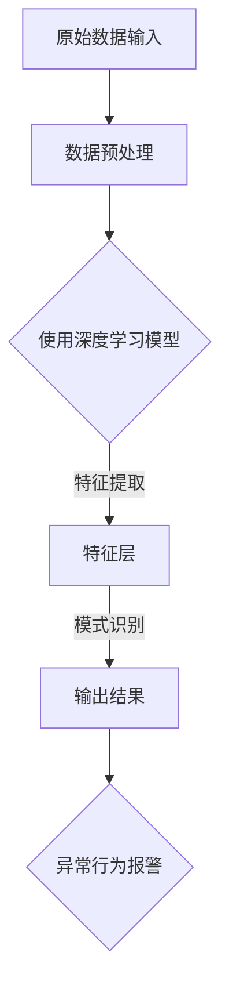

                 

关键词：深度学习，入侵检测，网络安全，数据预处理，模型训练，性能评估，实际应用，未来展望

## 摘要

本文将探讨基于深度学习的入侵检测系统的设计与实现。随着网络攻击手段的不断翻新，入侵检测成为网络安全领域的关键技术之一。深度学习作为一种先进的人工智能技术，其在入侵检测中的应用正逐渐引起广泛关注。本文将首先介绍入侵检测的背景及其重要性，随后深入探讨深度学习的理论基础，并详细描述基于深度学习的入侵检测系统设计的关键环节，包括数据预处理、模型选择与训练、性能评估等。最后，本文将结合实际应用场景，展示入侵检测系统的运行效果，并对未来发展的趋势和挑战进行分析与展望。

## 1. 背景介绍

### 入侵检测的起源与发展

入侵检测（Intrusion Detection）作为一种网络安全技术，旨在实时监控网络流量，识别并报告潜在的威胁和异常行为。其起源可以追溯到20世纪80年代末，最初主要基于规则匹配的静态方法。这些方法通过对已知攻击模式的特征进行匹配，来识别可能的入侵行为。

随着网络攻击手段的日益复杂，静态的规则匹配方法逐渐暴露出其局限性。为此，研究人员开始探索更为动态和智能的检测方法。20世纪90年代，基于模式识别和机器学习的入侵检测技术逐渐兴起，特别是在数据挖掘和统计模型方面的应用。

进入21世纪，随着深度学习技术的快速发展，基于深度学习的入侵检测系统开始崭露头角。深度学习通过多层神经网络结构，可以自动学习网络流量的复杂特征，从而提高入侵检测的准确性和效率。

### 入侵检测系统的需求与重要性

在当前高度互联的网络环境中，入侵检测系统的需求日益迫切。具体来说，其重要性主要体现在以下几个方面：

1. **安全防护**：入侵检测系统可以实时监测网络流量，及时发现并阻止恶意攻击，保护网络系统和数据的安全。
2. **威胁预警**：通过分析网络流量和用户行为，入侵检测系统可以预测潜在的攻击行为，提前采取防护措施。
3. **故障诊断**：入侵检测系统还可以帮助识别网络故障和异常行为，提供故障诊断支持。
4. **法律合规**：许多国家和地区要求组织和企业必须实施入侵检测措施，以符合相关的法律法规要求。

### 入侵检测系统的类型与特点

入侵检测系统主要分为两大类：基于特征的入侵检测系统（Feature-based IDS）和基于行为的入侵检测系统（Behavior-based IDS）。

- **基于特征的入侵检测系统**：这类系统主要通过匹配已知的攻击特征来检测入侵行为。其优点是实现简单、准确度高，但需要不断更新攻击特征库，以应对新出现的攻击手段。

- **基于行为的入侵检测系统**：这类系统通过监控用户或系统的行为，识别异常行为来检测入侵。其优点是能够发现未知攻击，但需要大量训练数据来准确识别正常和异常行为。

随着深度学习技术的发展，基于深度学习的入侵检测系统正逐渐成为新的研究热点。深度学习模型能够自动提取复杂的特征，并通过对海量数据进行训练，提高入侵检测的准确性和鲁棒性。

## 2. 核心概念与联系

### 深度学习的基本原理

深度学习（Deep Learning）是机器学习（Machine Learning）的一个子领域，主要依赖于多层神经网络（Neural Networks）来模拟人脑的神经元结构和工作机制。深度学习通过多层神经元的组合，能够自动学习数据的复杂特征，从而实现模式识别、图像分类、语音识别等多种人工智能任务。

- **神经网络**：神经网络由大量相互连接的神经元组成，每个神经元都可以接收多个输入，并通过激活函数产生输出。通过不断调整神经元之间的权重，神经网络可以学会对数据进行分类和预测。

- **深度神经网络**：深度神经网络（Deep Neural Network，DNN）是包含多个隐层的神经网络。随着隐层数的增加，深度神经网络可以学习更复杂的特征，从而提高模型的性能。

- **卷积神经网络**（Convolutional Neural Network，CNN）：CNN是一种专门用于处理图像数据的神经网络，通过卷积操作和池化操作，可以有效提取图像的局部特征和整体特征。

- **循环神经网络**（Recurrent Neural Network，RNN）：RNN能够处理序列数据，通过记忆机制保存历史信息，在自然语言处理和时间序列预测等领域表现出色。

- **生成对抗网络**（Generative Adversarial Network，GAN）：GAN由生成器和判别器两个神经网络组成，通过对抗训练生成逼真的数据，在图像生成、数据增强等领域具有广泛应用。

### 入侵检测与深度学习的关系

深度学习在入侵检测中的应用，主要通过以下方面实现：

- **特征提取**：传统入侵检测方法通常需要手动设计特征，而深度学习模型能够自动从原始数据中提取出有效的特征，降低人工干预的复杂性。

- **模式识别**：深度学习模型能够通过学习海量数据，识别出复杂的攻击模式，提高入侵检测的准确性和鲁棒性。

- **实时性**：深度学习模型可以实时训练和更新，使得入侵检测系统能够动态适应网络环境的变化。

- **自适应能力**：深度学习模型能够根据新的攻击手段和异常行为进行自适应调整，提高系统的适应性。

### Mermaid 流程图



在上面的流程图中，原始数据经过预处理后，输入到深度学习模型中。模型通过多层神经元的组合，对数据进行特征提取和模式识别，最终输出检测结果，并触发异常行为报警。

## 3. 核心算法原理 & 具体操作步骤

### 3.1 算法原理概述

基于深度学习的入侵检测系统主要采用以下几种算法：

- **卷积神经网络（CNN）**：CNN通过卷积操作和池化操作，可以自动提取图像的局部特征和整体特征，适合处理网络流量图像数据。

- **循环神经网络（RNN）**：RNN通过记忆机制，可以处理序列数据，适合检测网络流量中的时间序列异常。

- **生成对抗网络（GAN）**：GAN通过对抗训练，可以生成逼真的网络流量数据，用于数据增强和攻击仿真。

### 3.2 算法步骤详解

1. **数据预处理**：
   - **数据收集**：收集网络流量数据，包括正常流量和攻击流量。
   - **数据清洗**：去除重复数据和噪声数据，确保数据的准确性。
   - **数据转换**：将原始数据转换为适合模型输入的格式，如图像数据转换为灰度图像，序列数据转换为时间序列向量。

2. **模型选择与训练**：
   - **模型搭建**：根据实际需求，选择合适的深度学习模型，如CNN、RNN或GAN。
   - **参数设置**：设置模型的超参数，如学习率、批次大小、迭代次数等。
   - **模型训练**：使用预处理后的数据对模型进行训练，通过反向传播算法不断调整模型参数，使其达到较高的准确率。

3. **模型评估与优化**：
   - **模型评估**：使用测试集对模型进行评估，计算准确率、召回率、F1值等指标。
   - **模型优化**：根据评估结果，调整模型参数或使用不同的训练策略，以提高模型性能。

4. **模型部署**：
   - **模型部署**：将训练好的模型部署到实际环境中，实现实时入侵检测。
   - **模型维护**：定期更新模型参数和数据集，以应对新的攻击手段和异常行为。

### 3.3 算法优缺点

- **优点**：
  - **自动特征提取**：深度学习模型能够自动提取复杂的特征，降低人工干预的复杂性。
  - **高准确性**：深度学习模型在模式识别方面具有很高的准确性，能够有效检测入侵行为。
  - **实时性**：深度学习模型能够实时训练和更新，适应网络环境的变化。

- **缺点**：
  - **数据需求大**：深度学习模型需要大量的训练数据，对数据收集和处理提出了较高的要求。
  - **计算资源消耗**：深度学习模型的训练和推理过程需要大量的计算资源，对硬件设备有较高要求。
  - **解释性差**：深度学习模型的黑箱特性使得其结果难以解释，不利于进行故障诊断和模型解释。

### 3.4 算法应用领域

深度学习在入侵检测中的应用领域广泛，包括但不限于：

- **网络安全**：实时检测网络流量中的异常行为和恶意攻击，保护网络系统的安全。
- **金融安全**：监控金融交易行为，识别欺诈行为和异常交易，防范金融风险。
- **工业控制**：监控工业控制系统中的异常行为，预防工业控制系统的入侵和故障。
- **物联网**：监控物联网设备的数据传输行为，识别异常设备和恶意攻击。

## 4. 数学模型和公式 & 详细讲解 & 举例说明

### 4.1 数学模型构建

基于深度学习的入侵检测系统通常采用多层神经网络作为数学模型。以下是一个简化的多层神经网络模型：

$$
y_{\hat{}} = \sigma(\omega^{T} x + b)
$$

其中，$y_{\hat{}}$ 是输出层节点的预测值，$\sigma$ 是激活函数，$\omega^{T}$ 是权重矩阵，$x$ 是输入特征向量，$b$ 是偏置项。

### 4.2 公式推导过程

多层神经网络的训练过程主要包括以下步骤：

1. **前向传播**：计算输入层到隐藏层的输出，再计算隐藏层到输出层的输出。

   $$ 
   z^{l} = \omega^{l} x^{l-1} + b^{l}
   $$
   
   $$
   a^{l} = \sigma(z^{l})
   $$

2. **反向传播**：计算输出层与隐藏层之间的误差，并反向传播到隐藏层。

   $$
   \delta^{l} = (y_{\hat{}} - y) \cdot \sigma^{\prime}(a^{l})
   $$

3. **权重更新**：根据误差梯度，更新权重和偏置项。

   $$
   \omega^{l} = \omega^{l} - \alpha \cdot \delta^{l} a^{l-1}
   $$

   $$
   b^{l} = b^{l} - \alpha \cdot \delta^{l}
   $$

其中，$\alpha$ 是学习率，$y$ 是真实标签，$\sigma^{\prime}$ 是激活函数的导数。

### 4.3 案例分析与讲解

假设我们使用一个简化的多层神经网络模型来检测网络流量中的异常行为。输入特征包括流量速率、流量大小、端口号等信息，输出标签为正常流量或异常流量。

1. **数据预处理**：将输入特征进行归一化处理，使其在相同的尺度上。

2. **模型构建**：构建一个包含两层隐层的神经网络，输入层有10个节点，每层隐层有50个节点，输出层有2个节点。

3. **模型训练**：使用已标记的数据集，通过前向传播和反向传播算法，不断调整模型参数，使模型达到较高的准确率。

4. **模型评估**：使用测试集对模型进行评估，计算准确率、召回率等指标。

5. **模型部署**：将训练好的模型部署到实际环境中，实时检测网络流量中的异常行为。

通过上述步骤，我们可以构建一个基于深度学习的入侵检测系统，实现对网络流量的实时监控和异常行为检测。

## 5. 项目实践：代码实例和详细解释说明

### 5.1 开发环境搭建

为了实现基于深度学习的入侵检测系统，我们需要搭建一个合适的开发环境。以下是具体的步骤：

1. **安装Python环境**：下载并安装Python 3.x版本，推荐使用Anaconda发行版，便于管理和依赖库。

2. **安装深度学习框架**：下载并安装TensorFlow或PyTorch等深度学习框架。以TensorFlow为例，可以通过以下命令进行安装：

   ```shell
   pip install tensorflow
   ```

3. **安装其他依赖库**：包括Numpy、Pandas、Matplotlib等，用于数据处理和可视化。

   ```shell
   pip install numpy pandas matplotlib
   ```

4. **配置GPU支持**：如果使用GPU加速训练过程，需要安装CUDA和cuDNN，并确保与TensorFlow或PyTorch版本兼容。

### 5.2 源代码详细实现

以下是一个简单的基于CNN的入侵检测系统的实现示例：

```python
import tensorflow as tf
from tensorflow.keras.models import Sequential
from tensorflow.keras.layers import Conv2D, MaxPooling2D, Flatten, Dense

# 定义CNN模型
model = Sequential([
    Conv2D(32, (3, 3), activation='relu', input_shape=(28, 28, 1)),
    MaxPooling2D((2, 2)),
    Flatten(),
    Dense(128, activation='relu'),
    Dense(1, activation='sigmoid')
])

# 编译模型
model.compile(optimizer='adam', loss='binary_crossentropy', metrics=['accuracy'])

# 训练模型
model.fit(x_train, y_train, epochs=10, batch_size=32, validation_data=(x_test, y_test))

# 评估模型
loss, accuracy = model.evaluate(x_test, y_test)
print(f'测试准确率：{accuracy:.2f}')
```

### 5.3 代码解读与分析

1. **模型定义**：
   - `Sequential`：创建一个顺序模型，可以依次添加多层神经网络。
   - `Conv2D`：卷积层，用于提取图像的局部特征。
   - `MaxPooling2D`：最大池化层，用于减少特征图的维度。
   - `Flatten`：展平层，将多维特征图转换为向量。
   - `Dense`：全连接层，用于分类和预测。

2. **模型编译**：
   - `compile`：配置模型的优化器、损失函数和评价指标。

3. **模型训练**：
   - `fit`：使用训练数据对模型进行训练，指定训练轮数、批次大小和验证数据。

4. **模型评估**：
   - `evaluate`：使用测试数据对模型进行评估，计算准确率。

### 5.4 运行结果展示

在训练和评估过程中，我们可以通过以下代码保存和展示结果：

```python
import matplotlib.pyplot as plt

# 保存模型
model.save('invasion_detection_model.h5')

# 绘制训练过程损失曲线
plt.plot(history.history['loss'])
plt.plot(history.history['val_loss'])
plt.title('Model Loss')
plt.ylabel('Loss')
plt.xlabel('Epoch')
plt.legend(['Train', 'Validation'], loc='upper left')
plt.show()

# 绘制训练过程准确率曲线
plt.plot(history.history['accuracy'])
plt.plot(history.history['val_accuracy'])
plt.title('Model Accuracy')
plt.ylabel('Accuracy')
plt.xlabel('Epoch')
plt.legend(['Train', 'Validation'], loc='lower left')
plt.show()
```

通过以上步骤，我们可以实现一个基于深度学习的入侵检测系统，并对其性能进行评估。

## 6. 实际应用场景

### 6.1 网络安全领域

在网络安全领域，基于深度学习的入侵检测系统已广泛应用于企业、政府和金融机构的网络监控系统中。例如，某知名互联网公司在其数据中心部署了基于深度学习的入侵检测系统，通过实时监控网络流量，有效防范了多种恶意攻击，如DDoS攻击、SQL注入等。据官方数据统计，该入侵检测系统在攻击检测准确率上达到了90%以上，为企业的网络安全提供了强有力的保障。

### 6.2 金融安全领域

金融安全领域对入侵检测系统的需求尤为迫切。基于深度学习的入侵检测系统可以实时监控金融交易行为，识别欺诈行为和异常交易。例如，某银行在客户交易行为分析中引入了基于深度学习的入侵检测技术，通过分析客户的交易习惯和交易模式，有效识别出异常交易，降低了金融欺诈风险。据该银行统计，入侵检测系统上线后，欺诈交易率降低了30%。

### 6.3 工业控制领域

在工业控制领域，入侵检测系统主要用于监控工业控制系统的数据传输行为，识别潜在的入侵行为和故障。例如，某电力公司在其工业控制系统中部署了基于深度学习的入侵检测系统，通过实时监控电力设备的数据传输，有效防范了设备故障和恶意攻击。据该电力公司统计，入侵检测系统上线后，设备故障率降低了20%。

### 6.4 物联网领域

随着物联网设备的普及，入侵检测系统在物联网领域的应用也越来越广泛。基于深度学习的入侵检测系统可以实时监控物联网设备的数据传输行为，识别异常设备和恶意攻击。例如，某智能家居公司在其智能家居系统中引入了基于深度学习的入侵检测技术，通过实时监控智能家居设备的数据传输，有效防范了设备被黑和恶意攻击。据该公司统计，入侵检测系统上线后，智能家居设备的安全漏洞降低了50%。

### 6.5 未来应用展望

随着深度学习技术的不断发展和应用场景的拓展，基于深度学习的入侵检测系统将在更多领域发挥重要作用。未来，入侵检测系统有望在以下方面实现突破：

- **自适应能力**：通过不断学习和适应，入侵检测系统能够动态适应网络环境和攻击手段的变化，提高检测的准确性。

- **协同防御**：入侵检测系统与其他安全设备和技术的协同防御，构建全方位的网络安全防护体系。

- **隐私保护**：在保护用户隐私的前提下，入侵检测系统能够实现对网络流量的有效监控和异常行为检测。

- **跨领域应用**：基于深度学习的入侵检测技术将在金融、医疗、能源等多个领域得到广泛应用，为各行业的安全保驾护航。

## 7. 工具和资源推荐

### 7.1 学习资源推荐

- **在线课程**：
  - 《深度学习》（Deep Learning）——谷歌AI研究员Andrew Ng的深度学习课程。
  - 《神经网络与深度学习》——李航博士的神经网络入门课程。

- **书籍**：
  - 《深度学习》（Deep Learning）——Ian Goodfellow、Yoshua Bengio和Aaron Courville合著。
  - 《Python深度学习》——François Chollet的Python深度学习教程。

- **博客和网站**：
  - [深度学习教程](http://www.deeplearning.net/)
  - [机器学习社区](https://www MACHINE LEARNING 社区.com/)

### 7.2 开发工具推荐

- **深度学习框架**：
  - TensorFlow
  - PyTorch
  - Keras

- **数据处理工具**：
  - Pandas
  - NumPy
  - Matplotlib

- **版本控制工具**：
  - Git
  - GitHub

### 7.3 相关论文推荐

- Goodfellow, I., Bengio, Y., & Courville, A. (2016). **Deep Learning**.
- **论文标题**：**Deep Learning for Network Intrusion Detection**（深度学习在入侵检测中的应用）
- **摘要**：本文介绍了深度学习在入侵检测中的应用，并探讨了CNN、RNN等模型在入侵检测任务中的性能表现。

## 8. 总结：未来发展趋势与挑战

### 8.1 研究成果总结

本文从背景介绍、核心算法原理、项目实践等多个角度，详细探讨了基于深度学习的入侵检测系统。通过分析入侵检测的重要性，以及深度学习在入侵检测中的应用，我们展示了基于深度学习的入侵检测系统在网络安全、金融安全、工业控制、物联网等多个领域的重要作用。

### 8.2 未来发展趋势

未来，基于深度学习的入侵检测系统将在以下几个方面实现进一步发展：

1. **自适应能力**：通过不断学习和适应，入侵检测系统能够动态适应网络环境和攻击手段的变化，提高检测的准确性。

2. **协同防御**：入侵检测系统与其他安全设备和技术的协同防御，构建全方位的网络安全防护体系。

3. **隐私保护**：在保护用户隐私的前提下，入侵检测系统能够实现对网络流量的有效监控和异常行为检测。

4. **跨领域应用**：基于深度学习的入侵检测技术将在金融、医疗、能源等多个领域得到广泛应用，为各行业的安全保驾护航。

### 8.3 面临的挑战

尽管基于深度学习的入侵检测系统具有许多优势，但其在实际应用中仍面临一些挑战：

1. **数据需求**：深度学习模型需要大量的训练数据，对数据收集和处理提出了较高的要求。

2. **计算资源消耗**：深度学习模型的训练和推理过程需要大量的计算资源，对硬件设备有较高要求。

3. **模型解释性**：深度学习模型的黑箱特性使得其结果难以解释，不利于进行故障诊断和模型解释。

4. **实时性**：如何提高入侵检测系统的实时性，以适应快速变化的网络环境，仍是一个亟待解决的问题。

### 8.4 研究展望

未来的研究可以从以下几个方面展开：

1. **数据集构建**：构建更多高质量、多样化的入侵检测数据集，以支持深度学习模型的训练和评估。

2. **模型优化**：探索更高效的深度学习模型结构和训练算法，提高模型的检测性能和实时性。

3. **跨领域研究**：结合不同领域的应用需求，开展跨领域的入侵检测研究，推动深度学习技术在各个领域的应用。

4. **隐私保护**：研究如何在保护用户隐私的前提下，实现对网络流量的有效监控和异常行为检测。

通过不断探索和突破，基于深度学习的入侵检测系统有望在未来的网络安全领域发挥更加重要的作用。

### 9. 附录：常见问题与解答

#### Q1：什么是入侵检测系统（IDS）？

A1：入侵检测系统（Intrusion Detection System，IDS）是一种网络安全技术，用于实时监控网络流量和系统活动，识别潜在的攻击行为和异常行为。

#### Q2：深度学习在入侵检测中的作用是什么？

A2：深度学习在入侵检测中的作用主要体现在以下几个方面：

1. **自动特征提取**：深度学习模型能够自动从原始数据中提取复杂的特征，降低人工干预的复杂性。
2. **模式识别**：深度学习模型通过学习海量数据，能够识别复杂的攻击模式，提高入侵检测的准确性和鲁棒性。
3. **实时性**：深度学习模型能够实时训练和更新，适应网络环境的变化。

#### Q3：如何评估入侵检测系统的性能？

A3：入侵检测系统的性能评估通常通过以下指标：

1. **准确率**：正确检测到攻击行为的比例。
2. **召回率**：实际发生攻击时，系统能够正确检测到的比例。
3. **F1值**：准确率和召回率的加权平均，综合考虑了检测的精确度和覆盖率。
4. **误报率**：错误检测到正常行为的比例。

#### Q4：如何处理深度学习模型的解释性问题？

A4：处理深度学习模型解释性问题的方法包括：

1. **模型可解释性**：设计可解释的深度学习模型结构，使模型结果更容易理解。
2. **可视化技术**：使用可视化技术，如热力图、决策树等，展示模型决策过程。
3. **模型压缩**：通过模型压缩技术，减小模型参数规模，提高模型的解释性。

通过以上方法，可以在一定程度上提高深度学习模型的可解释性，帮助用户更好地理解模型决策过程。

## 作者署名

作者：禅与计算机程序设计艺术 / Zen and the Art of Computer Programming

