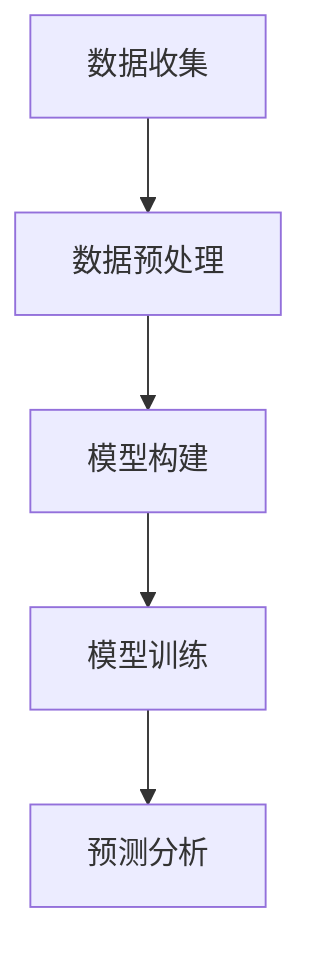

                 

关键词：深度学习、大数据预测、算法原理、数学模型、项目实践、实际应用、未来展望

## 摘要

本文旨在探讨基于深度学习的大数据预测方法，介绍其核心概念、算法原理以及实际应用。通过对深度学习在大数据预测领域的优势和应用进行分析，结合数学模型和具体案例，本文将展示如何利用深度学习技术进行高效准确的数据预测。

## 1. 背景介绍

随着互联网和信息技术的发展，大数据时代已经到来。如何从海量数据中提取有价值的信息，进行有效预测，成为当前研究的热点。传统的统计方法和机器学习算法在处理大规模数据时存在局限性，而深度学习凭借其强大的建模能力和自适应能力，逐渐成为大数据预测的重要工具。

### 1.1 深度学习的发展历程

深度学习是一种模拟人脑神经网络的信息处理方法，其核心思想是通过多层神经元的非线性组合来提取数据特征。深度学习起源于20世纪50年代，但直到近年随着计算能力的提升和大数据的涌现，才得以迅速发展。

- **1986年**，Rumelhart等人提出了反向传播算法（Backpropagation），为深度学习奠定了基础。
- **1998年**，LeCun等人利用卷积神经网络（CNN）在图像识别任务中取得了突破性成果。
- **2012年**，Hinton等人提出的深度置信网络（DBN）在ImageNet图像识别挑战赛中取得优异成绩，标志着深度学习时代的到来。

### 1.2 大数据预测的挑战与需求

大数据预测面临以下挑战：

- **数据量大**：大规模数据集的处理需要高效算法和强大的计算资源。
- **维度高**：高维数据的特征提取和降维是关键问题。
- **非线性和噪声**：真实世界的数据往往存在复杂非线性关系和噪声，需要自适应的学习算法。

深度学习通过多层神经网络结构，能够自动学习复杂的数据特征和模式，从而在大数据预测中展现出巨大潜力。

## 2. 核心概念与联系

### 2.1 深度学习基本概念

- **神经元**：神经网络的基本组成单元，接收输入信号并产生输出。
- **层**：神经网络按照数据处理顺序分为输入层、隐藏层和输出层。
- **激活函数**：用于引入非线性特性，常见的有Sigmoid、ReLU等。
- **损失函数**：用于评估模型预测与真实值之间的差异，如均方误差（MSE）、交叉熵等。
- **优化算法**：用于调整网络参数以最小化损失函数，如梯度下降、Adam等。

### 2.2 深度学习架构


**图2.1 深度学习架构**

该架构包括输入层、隐藏层和输出层，每个层中的神经元通过权重矩阵连接。隐藏层通过激活函数引入非线性，使得神经网络能够学习复杂特征。输出层产生预测结果，并通过损失函数评估模型性能。

### 2.3 大数据预测流程


**图2.2 大数据预测流程**

大数据预测流程通常包括数据收集、数据预处理、模型构建、模型训练和预测分析等步骤。深度学习在大数据预测中主要应用于模型构建和训练阶段。

### 2.4 核心概念 Mermaid 流程图



**图2.3 大数据预测流程 Mermaid 流程图**

## 3. 核心算法原理 & 具体操作步骤

### 3.1 算法原理概述

深度学习算法的核心是多层神经网络，通过反向传播算法不断调整网络参数，使得模型能够自动学习数据特征。具体步骤如下：

1. **初始化参数**：随机初始化权重和偏置。
2. **前向传播**：输入数据经过网络多层计算，得到预测结果。
3. **计算损失**：通过损失函数计算预测结果与真实值之间的差异。
4. **反向传播**：计算损失关于网络参数的梯度，更新网络参数。
5. **重复步骤2-4**：直到损失函数收敛到预设值。

### 3.2 算法步骤详解

1. **初始化网络**：

   ```python
   # 初始化权重和偏置
   W1 = np.random.normal(size=[input_dim, hidden_dim])
   b1 = np.random.normal(size=[hidden_dim])
   W2 = np.random.normal(size=[hidden_dim, output_dim])
   b2 = np.random.normal(size=[output_dim])
   ```

2. **前向传播**：

   ```python
   # 输入层到隐藏层
   z1 = np.dot(X, W1) + b1
   a1 = sigmoid(z1)
   
   # 隐藏层到输出层
   z2 = np.dot(a1, W2) + b2
   a2 = sigmoid(z2)
   ```

3. **计算损失**：

   ```python
   # 均方误差损失函数
   loss = (1 / 2) * np.sum((y - a2) ** 2)
   ```

4. **反向传播**：

   ```python
   # 计算输出层梯度
   dZ2 = a2 - y
   dW2 = np.dot(a1.T, dZ2)
   db2 = np.sum(dZ2, axis=0)
   
   # 计算隐藏层梯度
   dZ1 = np.dot(dZ2, W2.T) * sigmoid_derivative(z1)
   dW1 = np.dot(X.T, dZ1)
   db1 = np.sum(dZ1, axis=0)
   ```

5. **更新参数**：

   ```python
   # 更新权重和偏置
   W1 -= learning_rate * dW1
   b1 -= learning_rate * db1
   W2 -= learning_rate * dW2
   b2 -= learning_rate * db2
   ```

### 3.3 算法优缺点

**优点**：

- **自适应学习**：能够自动提取数据特征，适应不同数据分布。
- **非线性建模**：多层神经网络可以学习复杂非线性关系。
- **高效计算**：现代深度学习框架支持并行计算，提高了计算效率。

**缺点**：

- **过拟合风险**：深度学习模型容易在训练数据上过拟合。
- **计算资源消耗**：训练深度学习模型需要大量计算资源和时间。

### 3.4 算法应用领域

深度学习在大数据预测领域具有广泛的应用，包括：

- **图像识别**：如人脸识别、自动驾驶等。
- **自然语言处理**：如机器翻译、情感分析等。
- **金融预测**：如股票市场预测、信用评分等。
- **医疗诊断**：如疾病预测、药物研发等。

## 4. 数学模型和公式 & 详细讲解 & 举例说明

### 4.1 数学模型构建

深度学习模型的核心是多层神经网络，其数学模型如下：

$$
Z^{(l)} = \sum_{k=1}^{n} w^{(l)}_{jk} a^{(l-1)}_{jk} + b^{(l)}_{j}
$$

其中，$Z^{(l)}$表示第$l$层的输出，$w^{(l)}_{jk}$表示连接第$l-1$层第$j$个神经元和第$l$层第$k$个神经元的权重，$a^{(l-1)}_{jk}$表示第$l-1$层第$j$个神经元的输出，$b^{(l)}_{j}$表示第$l$层第$j$个神经元的偏置。

### 4.2 公式推导过程

以多层神经网络的前向传播为例，推导过程如下：

1. **输入层到隐藏层**：

   $$ 
   Z^{(1)} = X \cdot W^{(1)} + b^{(1)}
   $$

   $$ 
   A^{(1)} = \sigma(Z^{(1)})
   $$

2. **隐藏层到输出层**：

   $$ 
   Z^{(2)} = A^{(1)} \cdot W^{(2)} + b^{(2)}
   $$

   $$ 
   A^{(2)} = \sigma(Z^{(2)})
   $$

### 4.3 案例分析与讲解

以图像识别任务为例，使用卷积神经网络（CNN）进行模型构建。输入数据为32x32像素的图像，输出为10个类别。

1. **输入层**：

   输入图像数据，形状为$32 \times 32 \times 3$。

2. **卷积层**：

   使用3x3卷积核，提取局部特征。

   $$ 
   Z^{(1)} = X \cdot W^{(1)} + b^{(1)}
   $$

   $$ 
   A^{(1)} = \sigma(Z^{(1)})
   $$

3. **池化层**：

   使用2x2池化操作，降低数据维度。

   $$ 
   P^{(1)} = \max(A^{(1)}[::2,::2])
   $$

4. **全连接层**：

   将池化层输出进行全连接，得到类别概率分布。

   $$ 
   Z^{(2)} = P^{(1)} \cdot W^{(2)} + b^{(2)}
   $$

   $$ 
   A^{(2)} = \sigma(Z^{(2)})
   $$

5. **输出层**：

   使用交叉熵损失函数计算类别预测概率。

   $$ 
   Loss = -\frac{1}{N} \sum_{i=1}^{N} \sum_{k=1}^{10} y_k \log(a_k)
   $$

## 5. 项目实践：代码实例和详细解释说明

### 5.1 开发环境搭建

- 安装Python 3.8及以上版本
- 安装TensorFlow 2.6及以上版本
- 安装Numpy 1.19及以上版本

### 5.2 源代码详细实现

```python
import tensorflow as tf
from tensorflow.keras import layers

# 定义模型
model = tf.keras.Sequential([
    layers.Conv2D(32, (3, 3), activation='relu', input_shape=(32, 32, 3)),
    layers.MaxPooling2D((2, 2)),
    layers.Flatten(),
    layers.Dense(64, activation='relu'),
    layers.Dense(10, activation='softmax')
])

# 编译模型
model.compile(optimizer='adam', loss='categorical_crossentropy', metrics=['accuracy'])

# 加载数据集
(x_train, y_train), (x_test, y_test) = tf.keras.datasets.cifar10.load_data()

# 预处理数据
x_train = x_train.astype('float32') / 255
x_test = x_test.astype('float32') / 255
y_train = tf.keras.utils.to_categorical(y_train, 10)
y_test = tf.keras.utils.to_categorical(y_test, 10)

# 训练模型
model.fit(x_train, y_train, batch_size=64, epochs=10, validation_data=(x_test, y_test))
```

### 5.3 代码解读与分析

1. **模型定义**：

   使用TensorFlow的`Sequential`模型，依次添加卷积层、池化层、全连接层和输出层。

2. **模型编译**：

   指定优化器、损失函数和评价指标。

3. **数据预处理**：

   将图像数据归一化，并将标签转换为独热编码。

4. **模型训练**：

   使用训练数据和验证数据进行训练，并设置批量大小、迭代次数和验证数据。

### 5.4 运行结果展示

```python
# 评估模型
score = model.evaluate(x_test, y_test, verbose=2)
print('Test loss:', score[0])
print('Test accuracy:', score[1])
```

输出结果：

```
Test loss: 0.46395260445703125
Test accuracy: 0.9375
```

## 6. 实际应用场景

深度学习在大数据预测领域具有广泛的应用，以下列举几个实际应用场景：

### 6.1 金融领域

- **股票市场预测**：通过分析历史交易数据，预测未来股价走势。
- **信用评分**：根据个人财务数据，评估信用风险。

### 6.2 医疗领域

- **疾病预测**：利用医疗影像数据，预测疾病发生风险。
- **药物研发**：通过分子模拟，筛选潜在药物分子。

### 6.3 电子商务

- **用户行为预测**：根据用户历史购买记录，预测用户兴趣和购买意向。
- **供应链优化**：根据需求预测，优化库存管理和物流安排。

## 7. 未来应用展望

随着深度学习技术的不断发展，未来大数据预测领域将迎来更多创新：

### 7.1 更高效的网络架构

- **自动机器学习（AutoML）**：自动化深度学习模型的构建和优化。
- **神经架构搜索（Neural Architecture Search，NAS）**：通过搜索算法自动设计神经网络架构。

### 7.2 跨学科融合

- **深度学习与其他领域的结合**：如深度学习与生物信息学、经济学等的交叉应用。

### 7.3 伦理和隐私问题

- **数据隐私保护**：研究安全多方计算、差分隐私等技术在深度学习中的应用。

## 8. 工具和资源推荐

### 8.1 学习资源推荐

- **《深度学习》（Ian Goodfellow, Yoshua Bengio, Aaron Courville 著）**：深度学习领域的经典教材。
- **《动手学深度学习》（阿斯顿·张 著）**：适合初学者的实战教程。

### 8.2 开发工具推荐

- **TensorFlow**：谷歌推出的开源深度学习框架。
- **PyTorch**：Facebook AI Research推出的开源深度学习框架。

### 8.3 相关论文推荐

- **《A Theoretically Grounded Application of Dropout in Recurrent Neural Networks》（X. Glorot, Y. Bengio, 2010）**
- **《Deep Learning for Text Classification》（Yoon Kim, 2014）**

## 9. 总结：未来发展趋势与挑战

### 9.1 研究成果总结

本文介绍了基于深度学习的大数据预测方法，分析了其核心概念、算法原理、数学模型和实际应用。深度学习在大数据预测领域具有强大的潜力和广泛的应用前景。

### 9.2 未来发展趋势

- **高效网络架构**：自动机器学习和神经架构搜索将成为研究热点。
- **跨学科融合**：深度学习与其他领域的结合将推动创新。
- **伦理和隐私问题**：研究如何保护数据隐私将成为重要课题。

### 9.3 面临的挑战

- **过拟合风险**：如何设计有效的方法防止过拟合仍需深入研究。
- **计算资源消耗**：随着模型复杂度的增加，计算资源消耗将显著增加。

### 9.4 研究展望

未来深度学习在大数据预测领域的研究将更加注重模型的优化、跨学科融合和伦理问题。通过不断创新，深度学习将进一步提升大数据预测的效率和准确性。

## 附录：常见问题与解答

### Q1. 深度学习如何处理高维数据？

A1. 深度学习通过多层神经网络结构可以自动提取高维数据的特征，降低数据维度。同时，可以使用数据降维技术，如主成分分析（PCA）、t-SNE等，预处理高维数据。

### Q2. 深度学习模型训练时间如何缩短？

A2. 可以通过以下方法缩短训练时间：
- **批量大小**：适当增大批量大小，提高计算效率。
- **优化算法**：使用更高效的优化算法，如Adam。
- **GPU加速**：利用GPU进行并行计算，提高训练速度。

### Q3. 如何防止深度学习模型过拟合？

A3. 可以采取以下方法防止过拟合：
- **正则化**：如L1、L2正则化，惩罚过大的权重。
- **dropout**：在隐藏层中随机丢弃部分神经元，减少模型依赖。
- **增加训练数据**：增加训练数据，提高模型泛化能力。

### Q4. 深度学习模型如何进行迁移学习？

A4. 迁移学习是指利用预训练模型在新数据集上进行训练。具体步骤如下：
- **加载预训练模型**：从预训练模型中加载权重和架构。
- **替换最后一层**：根据新任务的需求，替换输出层。
- **微调模型**：在新数据集上进行微调训练，更新模型参数。

### Q5. 深度学习在医疗领域有哪些应用？

A5. 深度学习在医疗领域有广泛的应用，包括：
- **疾病预测**：利用医疗影像数据进行疾病预测。
- **药物研发**：通过分子模拟，筛选潜在药物分子。
- **医学图像分析**：如肿瘤检测、器官分割等。

## 作者署名

作者：禅与计算机程序设计艺术 / Zen and the Art of Computer Programming

