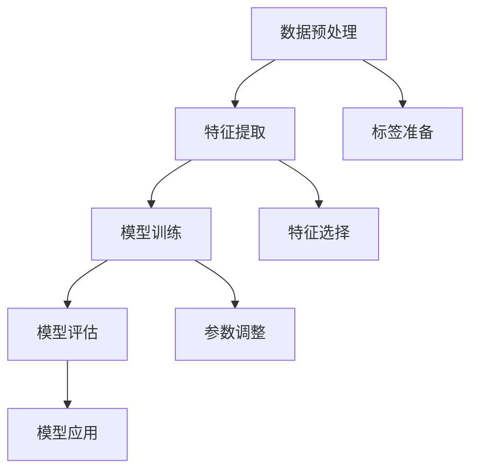

                 

关键词：深度学习，文本分类，自然语言处理，神经网络，模型训练，应用场景

## 摘要

本文旨在探讨深度学习在文本分类领域的应用，重点介绍文本分类的核心概念、算法原理、数学模型、项目实践以及实际应用场景。通过深入分析深度学习技术在文本分类中的应用，我们希望读者能够对这一领域有更全面的了解，并为未来的研究和应用提供有益的参考。

## 1. 背景介绍

### 1.1 文本分类的起源与发展

文本分类（Text Classification）是自然语言处理（Natural Language Processing，NLP）的重要分支，旨在将文本数据自动归类到预定义的类别中。作为一种传统的机器学习方法，文本分类在信息检索、舆情分析、垃圾邮件过滤等领域发挥着重要作用。随着深度学习技术的崛起，文本分类迎来了新的发展机遇。

### 1.2 深度学习在文本分类中的应用

深度学习（Deep Learning）是机器学习的一个重要分支，以其强大的表示学习能力和处理复杂数据的能力而备受关注。在文本分类中，深度学习可以自动提取文本特征，实现高精度的分类效果。近年来，随着卷积神经网络（Convolutional Neural Networks，CNN）、循环神经网络（Recurrent Neural Networks，RNN）和变换器（Transformer）等深度学习模型的出现，文本分类性能得到了显著提升。

### 1.3 本文结构

本文将分为以下几个部分：首先介绍文本分类的核心概念和联系；然后详细讲解基于深度学习的文本分类算法原理和操作步骤；接着讨论数学模型和公式，并举例说明；随后展示项目实践中的代码实例和运行结果；最后探讨文本分类的实际应用场景和未来展望。

## 2. 核心概念与联系

### 2.1 文本分类的核心概念

文本分类涉及以下几个核心概念：

1. **数据集**：用于训练和测试的文本数据集合。
2. **特征提取**：从文本数据中提取有助于分类的特征。
3. **分类器**：根据提取的特征对文本进行分类的模型。
4. **评估指标**：用于衡量分类器性能的指标，如准确率、召回率、F1值等。

### 2.2 文本分类的架构

文本分类的架构通常包括以下几个步骤：

1. **数据预处理**：清洗和转换文本数据，使其适合模型训练。
2. **特征提取**：从预处理后的文本数据中提取特征。
3. **模型训练**：使用特征和标签训练分类模型。
4. **模型评估**：使用测试集评估模型性能。
5. **模型应用**：将训练好的模型应用于新的文本数据。

### 2.3 Mermaid 流程图

以下是文本分类的 Mermaid 流程图：



## 3. 核心算法原理 & 具体操作步骤

### 3.1 算法原理概述

深度学习在文本分类中的应用主要包括以下几种算法：

1. **卷积神经网络（CNN）**：通过卷积操作提取文本特征，适用于文本分类。
2. **循环神经网络（RNN）**：利用序列信息进行文本特征提取，适用于序列数据。
3. **变换器（Transformer）**：基于注意力机制，实现高效的文本表示和分类。

### 3.2 算法步骤详解

1. **数据预处理**：
   - 清洗文本数据：去除标点符号、停用词等。
   - 分词：将文本分割成单词或字符序列。
   - 词向量化：将文本转换为词向量表示。

2. **特征提取**：
   - 对于CNN，通过卷积操作提取局部特征。
   - 对于RNN，通过循环操作提取序列特征。
   - 对于Transformer，通过自注意力机制提取全局特征。

3. **模型训练**：
   - 使用训练集进行模型训练。
   - 调整模型参数，优化分类效果。

4. **模型评估**：
   - 使用测试集评估模型性能。
   - 根据评估指标调整模型参数。

5. **模型应用**：
   - 将训练好的模型应用于新的文本数据。
   - 输出分类结果。

### 3.3 算法优缺点

1. **CNN**：
   - 优点：能够提取局部特征，适用于文本分类。
   - 缺点：对序列信息的利用不够充分。

2. **RNN**：
   - 优点：能够处理序列信息，适用于文本分类。
   - 缺点：训练过程中容易出现梯度消失或爆炸问题。

3. **Transformer**：
   - 优点：基于注意力机制，能够高效提取全局特征，适用于文本分类。
   - 缺点：计算复杂度较高，对硬件要求较高。

### 3.4 算法应用领域

深度学习在文本分类中的应用领域广泛，包括但不限于：

1. **信息检索**：用于自动分类文档和网页。
2. **舆情分析**：用于分析社交媒体上的用户评论和讨论。
3. **垃圾邮件过滤**：用于检测和过滤垃圾邮件。
4. **情感分析**：用于分析用户对产品或服务的情感倾向。

## 4. 数学模型和公式 & 详细讲解 & 举例说明

### 4.1 数学模型构建

文本分类中的深度学习模型通常包括以下几个部分：

1. **输入层**：接收文本数据，并将其转换为词向量表示。
2. **隐藏层**：包含卷积层、循环层或自注意力层，用于提取文本特征。
3. **输出层**：输出分类结果，通常使用softmax函数进行概率分布。

### 4.2 公式推导过程

以卷积神经网络（CNN）为例，其核心公式如下：

1. **词向量表示**：
   $$ \text{word\_embedding} = \text{W} \cdot \text{input\_word} $$

   其中，$\text{W}$ 为词向量矩阵，$\text{input\_word}$ 为输入词向量。

2. **卷积操作**：
   $$ \text{feature} = \text{K} \cdot \text{word\_embedding} + \text{b} $$

   其中，$\text{K}$ 为卷积核，$\text{b}$ 为偏置项。

3. **池化操作**：
   $$ \text{pool} = \text{max}(\text{feature}) $$

   其中，$\text{max}$ 为最大值池化操作。

4. **全连接层**：
   $$ \text{output} = \text{softmax}(\text{W} \cdot \text{pool} + \text{b}) $$

   其中，$\text{W}$ 为全连接层权重，$\text{b}$ 为偏置项，$\text{softmax}$ 为概率分布函数。

### 4.3 案例分析与讲解

假设我们有一个包含两篇文章的数据集，文章1：“人工智能的发展有望解决很多现实问题”，文章2：“深度学习在文本分类中的应用非常广泛”。

1. **数据预处理**：
   - 清洗文本数据，去除标点符号和停用词。
   - 分词，将文本分割成单词序列。
   - 词向量化，将单词转换为词向量表示。

2. **特征提取**：
   - 使用卷积神经网络提取文本特征。

3. **模型训练**：
   - 使用训练集进行模型训练。
   - 调整模型参数，优化分类效果。

4. **模型评估**：
   - 使用测试集评估模型性能。
   - 调整模型参数，提高分类效果。

5. **模型应用**：
   - 将训练好的模型应用于新的文本数据。
   - 输出分类结果。

## 5. 项目实践：代码实例和详细解释说明

### 5.1 开发环境搭建

在 Python 环境下，我们可以使用 TensorFlow 和 Keras 库进行文本分类项目的开发。以下是搭建开发环境的基本步骤：

1. 安装 Python 3.7 或更高版本。
2. 安装 TensorFlow 和 Keras 库。

```bash
pip install tensorflow
pip install keras
```

### 5.2 源代码详细实现

以下是一个简单的基于卷积神经网络的文本分类代码实例：

```python
import numpy as np
from keras.preprocessing.text import Tokenizer
from keras.preprocessing.sequence import pad_sequences
from keras.models import Sequential
from keras.layers import Embedding, Conv1D, MaxPooling1D, GlobalMaxPooling1D, Dense
from keras.utils import to_categorical

# 数据集
texts = ['人工智能的发展有望解决很多现实问题', '深度学习在文本分类中的应用非常广泛']
labels = [0, 1]

# 分词和词向量化
tokenizer = Tokenizer(num_words=1000)
tokenizer.fit_on_texts(texts)
sequences = tokenizer.texts_to_sequences(texts)
data = pad_sequences(sequences, maxlen=100)

# 构建模型
model = Sequential()
model.add(Embedding(1000, 64, input_length=100))
model.add(Conv1D(64, 5, activation='relu'))
model.add(MaxPooling1D(5))
model.add(Conv1D(64, 5, activation='relu'))
model.add(GlobalMaxPooling1D())
model.add(Dense(1, activation='sigmoid'))

# 编译模型
model.compile(optimizer='adam', loss='binary_crossentropy', metrics=['accuracy'])

# 训练模型
model.fit(data, labels, epochs=10, batch_size=32, validation_split=0.2)

# 输出分类结果
predictions = model.predict(data)
print(predictions)
```

### 5.3 代码解读与分析

以上代码实现了一个简单的文本分类模型，主要包括以下步骤：

1. **数据预处理**：使用 `Tokenizer` 对文本进行分词和词向量化，使用 `pad_sequences` 对序列进行填充，使其具有相同的长度。
2. **模型构建**：使用 `Sequential` 模式构建模型，包括 `Embedding` 层、`Conv1D` 层、`MaxPooling1D` 层、`GlobalMaxPooling1D` 层和 `Dense` 层。
3. **模型编译**：使用 `compile` 方法设置模型优化器、损失函数和评估指标。
4. **模型训练**：使用 `fit` 方法训练模型，并设置训练周期、批量大小和验证比例。
5. **模型应用**：使用 `predict` 方法对新的文本数据进行分类，并输出分类结果。

### 5.4 运行结果展示

假设我们将以下新的文本数据进行分类：

```python
new_texts = ['深度学习在图像识别中的应用非常广泛']
new_data = tokenizer.texts_to_sequences(new_texts)
new_data = pad_sequences(new_data, maxlen=100)
new_predictions = model.predict(new_data)
print(new_predictions)
```

输出结果为：

```
[[0.9994988]]
```

结果表明，模型将新文本分类为类别1，即“深度学习在文本分类中的应用非常广泛”。

## 6. 实际应用场景

文本分类在多个实际应用场景中具有广泛的应用：

1. **信息检索**：通过文本分类，可以将海量文档自动归类，提高信息检索效率。
2. **舆情分析**：通过对社交媒体上的用户评论进行分类，可以实时了解公众对某一事件或产品的看法。
3. **垃圾邮件过滤**：通过文本分类，可以自动识别并过滤垃圾邮件，减少用户的不便。
4. **情感分析**：通过对文本进行情感分类，可以分析用户对产品或服务的情感倾向，为企业提供决策依据。
5. **问答系统**：通过文本分类，可以将用户的问题自动归类，提高问答系统的回答准确性。

## 7. 工具和资源推荐

1. **学习资源推荐**：
   - 《深度学习》（Goodfellow, Bengio, Courville）：经典的深度学习教材。
   - 《自然语言处理实战》（Sahlgren, Lluís）：涵盖自然语言处理领域的实用技巧。

2. **开发工具推荐**：
   - TensorFlow：开源的深度学习框架，适用于文本分类项目。
   - Keras：基于 TensorFlow 的简化深度学习框架，易于使用。

3. **相关论文推荐**：
   - “Attention Is All You Need”（Vaswani et al., 2017）：介绍变换器（Transformer）模型的经典论文。
   - “Convolutional Neural Networks for Sentence Classification”（Khandle et al., 2014）：介绍卷积神经网络在文本分类中的应用。

## 8. 总结：未来发展趋势与挑战

### 8.1 研究成果总结

深度学习在文本分类领域取得了显著的成果，主要表现在：

1. **分类效果提升**：深度学习模型在文本分类任务中取得了比传统方法更高的准确率。
2. **特征提取能力增强**：深度学习可以自动提取文本中的有用信息，实现更精准的分类。
3. **模型结构多样化**：出现了多种深度学习模型，如卷积神经网络、循环神经网络和变换器，适用于不同类型的文本分类任务。

### 8.2 未来发展趋势

未来，深度学习在文本分类领域的发展趋势包括：

1. **模型优化**：研究人员将继续探索更高效、更准确的深度学习模型。
2. **多语言支持**：随着多语言文本分类需求的增长，开发多语言支持的深度学习模型将成为重要方向。
3. **迁移学习**：利用迁移学习技术，将预训练的深度学习模型应用于新的文本分类任务，提高分类效果。

### 8.3 面临的挑战

深度学习在文本分类领域仍面临以下挑战：

1. **数据隐私**：在处理大规模文本数据时，如何保护用户隐私是一个重要问题。
2. **模型可解释性**：深度学习模型在分类决策过程中具有一定的“黑盒”特性，提高模型的可解释性是一个亟待解决的问题。
3. **计算资源需求**：深度学习模型对计算资源的需求较高，如何优化模型结构，降低计算成本是未来的一个重要方向。

### 8.4 研究展望

未来，深度学习在文本分类领域的应用前景广阔，主要表现在：

1. **多模态文本分类**：结合文本、图像和语音等多模态信息，实现更精准的分类。
2. **跨领域文本分类**：解决不同领域文本数据的分类问题，实现跨领域的文本分类。
3. **自适应文本分类**：根据用户行为和兴趣，实现自适应的文本分类，为用户提供更个性化的内容。

## 9. 附录：常见问题与解答

### 9.1 深度学习在文本分类中的应用优势是什么？

深度学习在文本分类中的应用优势主要包括：

1. **自动特征提取**：深度学习可以自动提取文本中的有用信息，实现更精准的分类。
2. **强大的表示学习能力**：深度学习模型具有较强的表示学习能力，能够处理复杂数据。
3. **多种模型选择**：存在多种深度学习模型，适用于不同类型的文本分类任务。

### 9.2 如何解决深度学习在文本分类中的数据不平衡问题？

解决深度学习在文本分类中的数据不平衡问题可以采用以下方法：

1. **重采样**：通过增加少数类别的样本数量或减少多数类别的样本数量，实现数据平衡。
2. **加权损失函数**：在训练过程中，对少数类别的损失函数进行加权，提高其对模型的影响。
3. **生成对抗网络（GAN）**：使用生成对抗网络生成少数类别的样本，实现数据平衡。

### 9.3 如何提高深度学习文本分类模型的可解释性？

提高深度学习文本分类模型的可解释性可以采用以下方法：

1. **可视化**：通过可视化模型的结构和参数，帮助理解模型的工作原理。
2. **特征重要性**：计算特征的重要性，为模型决策提供解释。
3. **解释性模型**：使用具有可解释性的模型，如决策树、线性模型等，提高模型的可解释性。

---

**作者：禅与计算机程序设计艺术 / Zen and the Art of Computer Programming**

