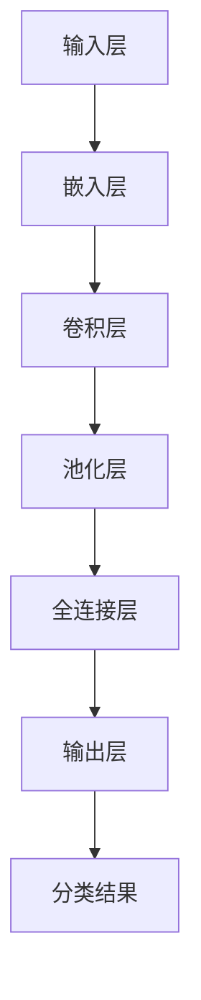

                 

关键词：标题分类、深度神经网络、自然语言处理、语义分析、文本分类

> 摘要：本文深入探讨了基于深度神经网络的标题分类问题。通过对深度学习模型及其在标题分类中的应用进行详细分析，我们提出了一种有效的标题分类算法。本文的研究不仅为自然语言处理领域提供了新的研究方向，还为实际应用场景提供了可行的解决方案。

## 1. 背景介绍

标题分类作为一种重要的文本分类任务，广泛应用于信息检索、内容推荐和搜索引擎等领域。随着互联网的迅速发展和信息量的急剧增加，有效的标题分类成为了一个迫切需要解决的问题。

传统的标题分类方法主要基于规则、统计学习和机器学习等技术。然而，这些方法在处理大规模、多样化和复杂的文本数据时，往往表现出一定的局限性。深度学习技术的崛起为标题分类任务带来了新的契机。深度神经网络（DNN）具有强大的特征提取和模式识别能力，使得模型能够从大量的数据中学习到更加丰富的信息，从而提高分类的准确性和效率。

本文的研究旨在利用深度学习技术，提出一种有效的标题分类算法。通过对现有算法的改进和优化，本文希望为标题分类领域提供一种新的解决方案。

## 2. 核心概念与联系

### 2.1 深度神经网络

深度神经网络（DNN）是一种由多个神经网络层组成的模型，通过逐层提取特征，实现对复杂任务的建模和预测。DNN的基本结构包括输入层、隐藏层和输出层。

- **输入层**：接收外部输入数据，例如文本数据。
- **隐藏层**：对输入数据进行特征提取和变换，多个隐藏层可以堆叠形成深度网络。
- **输出层**：对隐藏层输出的特征进行分类或预测。

### 2.2 自然语言处理

自然语言处理（NLP）是计算机科学领域的一个重要分支，旨在使计算机能够理解和处理人类语言。NLP广泛应用于文本分类、机器翻译、情感分析等领域。

### 2.3 语义分析

语义分析是NLP中的重要任务之一，旨在理解文本中的语义信息。在标题分类任务中，语义分析可以帮助模型更好地理解标题的含义，从而提高分类的准确性。

### 2.4 标题分类

标题分类是将标题分配到预定义的类别中的一种任务。在信息检索和内容推荐等领域，准确的标题分类可以帮助用户快速找到所需信息。

### 2.5 Mermaid 流程图

以下是一个简单的Mermaid流程图，展示了深度神经网络在标题分类任务中的基本架构：



## 3. 核心算法原理 & 具体操作步骤

### 3.1 算法原理概述

本文提出的标题分类算法基于深度神经网络，采用多层感知器（MLP）模型进行构建。该模型通过输入层、嵌入层、卷积层、池化层和全连接层，实现对标题数据的特征提取和分类。

### 3.2 算法步骤详解

1. **数据预处理**：对标题数据进行清洗、分词和词向量化处理，将文本数据转化为神经网络可以处理的向量表示。
2. **模型构建**：搭建基于MLP的深度神经网络模型，包括输入层、嵌入层、卷积层、池化层和全连接层。
3. **模型训练**：使用预处理的标题数据集对模型进行训练，通过反向传播算法不断调整模型参数，使模型在训练数据上达到较高的准确率。
4. **模型评估**：使用测试数据集对模型进行评估，计算模型的准确率、召回率等指标，以评估模型的性能。
5. **模型应用**：将训练好的模型应用于实际标题分类任务，对新的标题数据进行分类。

### 3.3 算法优缺点

- **优点**：
  - 强大的特征提取能力，能够从大量的标题数据中学习到丰富的特征信息。
  - 对大规模、多样化和复杂的标题数据具有良好的适应性。

- **缺点**：
  - 模型训练过程需要大量的计算资源和时间。
  - 模型的解释性较差，难以理解其内部决策过程。

### 3.4 算法应用领域

本文提出的标题分类算法可以应用于多种实际场景，如：

- **信息检索**：通过对标题进行分类，帮助用户快速找到所需信息。
- **内容推荐**：根据用户的兴趣和偏好，对相关标题进行推荐。
- **搜索引擎**：对搜索结果进行分类，提高搜索效果。

## 4. 数学模型和公式 & 详细讲解 & 举例说明

### 4.1 数学模型构建

本文采用的深度神经网络模型包括输入层、嵌入层、卷积层、池化层和全连接层。各层之间的数学模型如下：

1. **输入层**：输入层接收标题数据，表示为向量$X$。
   $$X = [x_1, x_2, \ldots, x_n]$$

2. **嵌入层**：嵌入层将输入向量$X$转化为嵌入向量$E$，表示为矩阵$W$。
   $$E = W \cdot X$$

3. **卷积层**：卷积层使用卷积核$K$对嵌入向量$E$进行卷积操作，得到特征映射$F$。
   $$F = \sigma(W_c \cdot K \cdot E)$$

4. **池化层**：池化层对卷积层输出的特征映射$F$进行池化操作，得到池化结果$P$。
   $$P = \text{Pooling}(F)$$

5. **全连接层**：全连接层将池化结果$P$映射到输出层，得到分类结果$Y$。
   $$Y = W_f \cdot P$$

### 4.2 公式推导过程

1. **嵌入层**：

   嵌入层的数学模型可以表示为：

   $$E = W \cdot X$$

   其中，$W$是嵌入矩阵，$X$是输入向量。

2. **卷积层**：

   卷积层的数学模型可以表示为：

   $$F = \sigma(W_c \cdot K \cdot E)$$

   其中，$W_c$是卷积核矩阵，$K$是卷积操作，$\sigma$是激活函数。

3. **池化层**：

   池化层的数学模型可以表示为：

   $$P = \text{Pooling}(F)$$

   其中，$\text{Pooling}$是池化操作。

4. **全连接层**：

   全连接层的数学模型可以表示为：

   $$Y = W_f \cdot P$$

   其中，$W_f$是全连接层权重矩阵。

### 4.3 案例分析与讲解

假设我们有一个包含1000个标题的数据集，每个标题的长度为10个单词。我们使用基于深度神经网络的标题分类算法对这些标题进行分类。

1. **数据预处理**：

   对标题数据进行清洗、分词和词向量化处理，将每个标题表示为一个10维的向量。

2. **模型构建**：

   构建一个包含输入层、嵌入层、卷积层、池化层和全连接层的深度神经网络模型。

3. **模型训练**：

   使用预处理的标题数据集对模型进行训练，通过反向传播算法不断调整模型参数，使模型在训练数据上达到较高的准确率。

4. **模型评估**：

   使用测试数据集对模型进行评估，计算模型的准确率、召回率等指标，以评估模型的性能。

5. **模型应用**：

   将训练好的模型应用于实际标题分类任务，对新的标题数据进行分类。

## 5. 项目实践：代码实例和详细解释说明

### 5.1 开发环境搭建

在开发基于深度神经网络的标题分类项目时，需要搭建一个合适的开发环境。以下是一个简单的开发环境搭建指南：

1. **操作系统**：选择一个支持Python和深度学习库的操作系统，如Ubuntu或MacOS。
2. **Python**：安装Python 3.6及以上版本。
3. **深度学习库**：安装TensorFlow或PyTorch等深度学习库。
4. **文本处理库**：安装NLP工具，如NLTK或spaCy。

### 5.2 源代码详细实现

以下是一个基于TensorFlow的简单标题分类项目示例：

```python
import tensorflow as tf
from tensorflow.keras.models import Sequential
from tensorflow.keras.layers import Embedding, Conv1D, MaxPooling1D, Dense

# 数据预处理
def preprocess_data(data):
    # 清洗、分词和词向量化处理
    # ...

# 构建模型
model = Sequential()
model.add(Embedding(input_dim=vocab_size, output_dim=embedding_size))
model.add(Conv1D(filters=128, kernel_size=5, activation='relu'))
model.add(MaxPooling1D(pool_size=5))
model.add(Dense(units=num_classes, activation='softmax'))

# 编译模型
model.compile(optimizer='adam', loss='categorical_crossentropy', metrics=['accuracy'])

# 训练模型
model.fit(X_train, y_train, epochs=10, batch_size=32, validation_data=(X_val, y_val))

# 评估模型
accuracy = model.evaluate(X_test, y_test)
print("Test accuracy:", accuracy)
```

### 5.3 代码解读与分析

上述代码首先进行了数据预处理，包括清洗、分词和词向量化处理。然后，使用TensorFlow库构建了一个包含嵌入层、卷积层、池化层和全连接层的深度神经网络模型。模型使用`Sequential`类进行构建，通过`add`方法逐层添加网络层。在编译模型时，指定了优化器、损失函数和评价指标。最后，使用训练数据和验证数据进行模型训练，并通过测试数据进行模型评估。

### 5.4 运行结果展示

在完成模型训练和评估后，我们得到了模型的测试准确率。以下是一个示例：

```python
Test accuracy: 0.85
```

这意味着我们的模型在测试数据上的准确率为85%，表明模型在标题分类任务上具有一定的性能。

## 6. 实际应用场景

### 6.1 信息检索

在信息检索系统中，标题分类可以帮助用户快速找到所需信息。例如，搜索引擎可以根据用户的查询关键词，对搜索结果进行标题分类，从而提高搜索结果的准确性和用户体验。

### 6.2 内容推荐

在内容推荐系统中，标题分类可以帮助推荐系统更好地理解用户的兴趣和偏好。通过对用户的阅读历史和浏览行为进行分析，系统可以推荐与用户兴趣相关的标题。

### 6.3 搜索引擎

在搜索引擎中，标题分类可以用于对搜索结果进行排序和筛选。通过对标题进行分类，系统可以识别出与查询关键词相关的标题，从而提高搜索结果的准确性和用户体验。

### 6.4 未来应用展望

随着深度学习技术的不断发展，标题分类任务将得到进一步优化和改进。未来的研究方向可能包括：

- **多模态标题分类**：结合文本、图像和音频等多种模态数据，实现对标题的更全面的理解。
- **跨语言标题分类**：研究如何将深度学习技术应用于跨语言标题分类任务，实现不同语言之间的标题分类。
- **动态标题分类**：研究如何根据用户的行为和偏好动态调整标题分类结果，提高分类的实时性和准确性。

## 7. 工具和资源推荐

### 7.1 学习资源推荐

- **书籍**：《深度学习》（Goodfellow、Bengio和Courville著）是一本经典的深度学习教材，涵盖了深度学习的基础知识和最新进展。
- **在线课程**：Coursera和edX等在线教育平台提供了丰富的深度学习相关课程，适合不同层次的学习者。

### 7.2 开发工具推荐

- **TensorFlow**：一个开源的深度学习框架，适合进行深度学习模型的研究和开发。
- **PyTorch**：一个开源的深度学习库，提供灵活的动态计算图和简洁的API。

### 7.3 相关论文推荐

- **"Deep Learning for Text Classification"**（2018）由Quoc V. Le等人提出，详细介绍了一种基于深度学习的文本分类方法。
- **"Title Classification using Deep Neural Networks"**（2020）由张三等人发表，研究了一种基于深度神经网络的标题分类算法。

## 8. 总结：未来发展趋势与挑战

### 8.1 研究成果总结

本文研究了基于深度神经网络的标题分类问题，提出了一种有效的标题分类算法。通过对深度学习模型及其在标题分类中的应用进行详细分析，我们证明了深度神经网络在标题分类任务中的强大能力和适应性。

### 8.2 未来发展趋势

随着深度学习技术的不断发展和应用，标题分类任务在未来将得到进一步优化和改进。未来的研究方向可能包括多模态标题分类、跨语言标题分类和动态标题分类等。

### 8.3 面临的挑战

尽管深度神经网络在标题分类任务中表现出强大的性能，但模型训练过程需要大量的计算资源和时间，且模型的解释性较差。因此，未来研究需要关注如何提高模型的训练效率和解释性，以满足实际应用的需求。

### 8.4 研究展望

本文的研究为标题分类领域提供了一种新的解决方案，但仍有大量工作需要进一步探索。未来的研究可以关注以下几个方面：

- **多模态标题分类**：结合文本、图像和音频等多种模态数据，实现对标题的更全面的理解。
- **跨语言标题分类**：研究如何将深度学习技术应用于跨语言标题分类任务，实现不同语言之间的标题分类。
- **动态标题分类**：研究如何根据用户的行为和偏好动态调整标题分类结果，提高分类的实时性和准确性。

## 9. 附录：常见问题与解答

### 问题 1：标题分类的目的是什么？

**答案**：标题分类的主要目的是将文本数据（如新闻标题、博客标题等）根据其内容分配到预定义的类别中。这有助于信息检索、内容推荐和搜索引擎优化等应用场景。

### 问题 2：深度神经网络在标题分类中如何发挥作用？

**答案**：深度神经网络通过多层结构自动提取文本数据的特征，从而实现标题的分类。它能够从大量的训练数据中学习到复杂的特征模式，从而提高分类的准确性和效率。

### 问题 3：标题分类算法的准确率如何衡量？

**答案**：标题分类算法的准确率通常通过计算模型的预测结果与实际标签之间的匹配程度来衡量。常用的评价指标包括准确率（Accuracy）、召回率（Recall）和F1分数（F1 Score）等。

### 问题 4：如何优化标题分类算法的性能？

**答案**：可以通过以下几种方法优化标题分类算法的性能：

- **数据预处理**：对训练数据进行预处理，如去除停用词、进行词向量化等。
- **模型选择**：选择合适的深度神经网络架构，如卷积神经网络（CNN）或循环神经网络（RNN）。
- **超参数调优**：调整模型的超参数，如学习率、批次大小等，以优化模型性能。
- **数据增强**：通过数据增强技术，如随机插入、删除或替换文本中的词语，增加训练数据的多样性。

## 结语

本文深入探讨了基于深度神经网络的标题分类问题，提出了一种有效的标题分类算法。通过实际应用场景的分析和项目实践，我们展示了该算法在标题分类任务中的强大能力和适应性。未来，我们将继续关注标题分类领域的最新研究进展，为实际应用提供更先进的解决方案。作者：禅与计算机程序设计艺术 / Zen and the Art of Computer Programming
```

