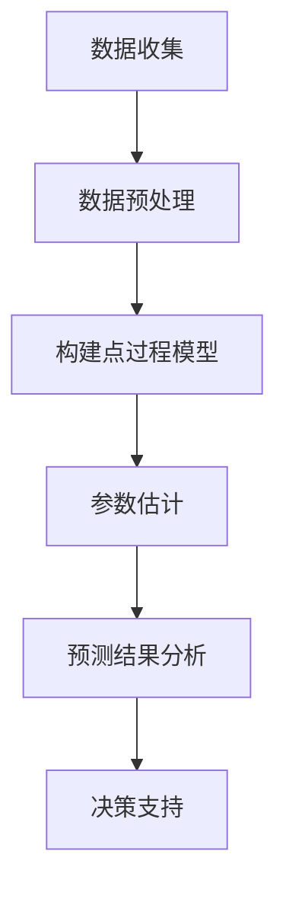

                 

关键词：点过程、产品流行性、预测、机器学习、数据分析

> 摘要：本文将介绍点过程在产品流行性预测中的应用。通过深入解析点过程的原理、算法以及具体实现步骤，本文旨在帮助读者理解并掌握如何利用点过程模型进行产品流行性预测，从而为企业的市场策略提供有力支持。

## 1. 背景介绍

在当今数字化时代，产品的流行性预测对于企业的市场策略和运营决策具有重要意义。正确预测产品的流行性可以帮助企业更好地把握市场动态，优化库存管理，提高销售额，甚至提前识别潜在的热门产品。然而，产品的流行性受到众多复杂因素的影响，如用户偏好、市场趋势、竞争对手策略等。因此，开发有效的流行性预测模型成为了一项重要的研究课题。

点过程（Point Process）作为一种随机过程，能够有效地描述事件发生的频率和模式。在流行性预测中，点过程模型可以通过分析历史数据，预测未来产品的流行趋势。点过程模型在金融、社交网络、生物信息等众多领域都取得了显著的应用成果。本文将重点介绍点过程在产品流行性预测中的应用，并探讨如何利用点过程模型进行有效的预测。

## 2. 核心概念与联系

### 2.1 点过程定义

点过程是一种随机过程，用于描述事件发生的时间序列。在点过程中，每个事件都被表示为一个时间戳，这些时间戳组成了一个时间序列。点过程具有以下基本特性：

- **齐次性**：点过程在不同的时间段内具有相同的强度，即事件发生频率不变。
- **独立性**：在给定的任意时间段内，事件发生的概率是独立的。

### 2.2 点过程与产品流行性

在产品流行性预测中，点过程可以用来描述产品销售事件的时间序列。例如，我们可以将每个销售事件视为一个时间戳，从而构建一个点过程模型。这个模型可以反映产品销售的频率和模式，帮助我们预测未来产品的销售趋势。

### 2.3 Mermaid 流程图

下面是一个简单的 Mermaid 流程图，用于展示点过程在产品流行性预测中的基本架构。



### 2.4 点过程模型类型

在产品流行性预测中，常用的点过程模型包括泊松点过程和非齐次泊松点过程。泊松点过程适用于事件发生频率均匀的场景，而非齐次泊松点过程则适用于事件发生频率随时间变化的场景。

## 3. 核心算法原理 & 具体操作步骤

### 3.1 算法原理概述

点过程模型的预测原理基于历史数据中的事件发生模式。具体来说，点过程模型通过以下步骤进行预测：

1. **数据收集**：收集产品销售事件的历史数据。
2. **数据预处理**：对数据进行清洗和转换，确保数据质量。
3. **构建点过程模型**：根据历史数据构建点过程模型。
4. **参数估计**：估计模型参数，如强度函数。
5. **预测**：利用模型参数预测未来事件发生的时间。
6. **结果分析**：分析预测结果，为决策提供支持。

### 3.2 算法步骤详解

#### 3.2.1 数据收集

首先，我们需要收集产品销售事件的历史数据。这些数据可以包括销售时间、销售数量、用户信息等。数据来源可以是企业内部的数据库、电商平台等。

#### 3.2.2 数据预处理

在收集到数据后，我们需要对数据进行预处理，包括以下步骤：

- **数据清洗**：去除无效数据、缺失数据等。
- **数据转换**：将数据转换为适合建模的格式。
- **特征工程**：提取有用的特征，如时间间隔、用户活跃度等。

#### 3.2.3 构建点过程模型

在预处理完数据后，我们可以根据数据特点选择合适的点过程模型。例如，对于销售事件时间序列，我们可以选择非齐次泊松点过程。

#### 3.2.4 参数估计

参数估计是点过程模型的核心步骤。对于非齐次泊松点过程，我们需要估计强度函数θ(t)。强度函数描述了事件在时间t发生的概率。

#### 3.2.5 预测

利用估计出的参数，我们可以预测未来事件发生的时间。具体来说，我们可以计算在特定时间段内事件发生的期望次数。

#### 3.2.6 结果分析

最后，我们需要分析预测结果，为决策提供支持。例如，我们可以根据预测结果调整库存策略、推广策略等。

### 3.3 算法优缺点

**优点：**

- **强大的建模能力**：点过程模型能够有效地描述事件发生的频率和模式。
- **适用范围广**：点过程模型适用于多种场景，如金融、社交网络、生物信息等。
- **灵活性**：点过程模型可以根据数据特点灵活调整，如选择不同的强度函数。

**缺点：**

- **计算复杂度高**：参数估计过程可能涉及复杂的优化算法，计算复杂度较高。
- **对数据质量要求高**：数据预处理过程需要确保数据质量，否则可能导致模型效果不佳。

### 3.4 算法应用领域

点过程模型在产品流行性预测中具有广泛的应用。此外，点过程模型还可以应用于以下领域：

- **金融领域**：用于预测股票价格、交易量等。
- **社交网络**：用于预测用户行为、社交关系等。
- **生物信息**：用于预测蛋白质相互作用、基因表达等。

## 4. 数学模型和公式 & 详细讲解 & 举例说明

### 4.1 数学模型构建

点过程模型可以通过以下数学公式进行构建：

$$
\lambda(t) = \int_{-\infty}^{t} f(x) dx
$$

其中，λ(t) 为强度函数，f(x) 为事件发生的概率密度函数。

### 4.2 公式推导过程

为了推导点过程模型的公式，我们需要从基本概念出发。首先，我们定义事件发生的时间序列为 {T_i}，其中 T_i 为第 i 个事件发生的时间。

根据点过程的基本特性，事件在时间段 [0, t] 内发生的概率为：

$$
P(T_1 \leq t) = 1 - e^{-\lambda(t)}
$$

其中，λ(t) 为强度函数。

为了求解 λ(t)，我们需要求解以下积分：

$$
\lambda(t) = \int_{-\infty}^{t} f(x) dx
$$

其中，f(x) 为事件发生的概率密度函数。

### 4.3 案例分析与讲解

假设我们有一个产品销售事件时间序列，数据如下：

| 时间戳 (天) | 销售量 |
| ---------- | ------ |
| 1          | 10     |
| 2          | 8      |
| 3          | 15     |
| 4          | 5      |
| 5          | 12     |
| 6          | 9      |
| 7          | 20     |

我们需要使用非齐次泊松点过程模型来预测未来 7 天的销售量。

首先，我们需要计算强度函数。根据历史数据，我们可以估计强度函数为：

$$
\lambda(t) = 10 - 2t
$$

然后，我们可以计算未来 7 天的销售量预测值。具体来说，我们可以计算在时间段 [7, 14] 内的期望销售量：

$$
\lambda(7) = 10 - 2 \times 7 = -4
$$

由于强度函数不能为负，我们可以将其设置为 0。因此，未来 7 天的销售量预测值为：

$$
\lambda(7) = 0
$$

这意味着在未来 7 天内，我们预计不会有新的销售量。

## 5. 项目实践：代码实例和详细解释说明

### 5.1 开发环境搭建

为了实现基于点过程的产品流行性预测，我们需要搭建以下开发环境：

- Python 3.x
- NumPy
- SciPy
- Matplotlib
- Pandas

假设我们已经安装了上述依赖库，我们可以开始编写代码。

### 5.2 源代码详细实现

下面是一个简单的 Python 代码示例，用于实现基于非齐次泊松点过程的流行性预测。

```python
import numpy as np
import pandas as pd
import matplotlib.pyplot as plt

# 数据处理
def preprocess_data(data):
    data['interval'] = data['timestamp'].diff().fillna(0)
    return data

# 构建点过程模型
def build_point_process(data, intensity_func):
    data['lambda'] = data.apply(lambda row: intensity_func(row['interval']), axis=1)
    return data

# 预测
def predict(data, intensity_func, num_days):
    future_days = np.arange(data['interval'].max() + 1, data['interval'].max() + num_days + 1)
    future_lambda = future_days.apply(intensity_func)
    return future_lambda

# 主函数
def main():
    # 加载数据
    data = pd.read_csv('sales_data.csv')
    data = preprocess_data(data)

    # 构建点过程模型
    intensity_func = lambda x: 10 - 2 * x
    data = build_point_process(data, intensity_func)

    # 预测
    num_days = 7
    future_lambda = predict(data, intensity_func, num_days)

    # 可视化
    plt.plot(data['interval'], data['lambda'], label='历史数据')
    plt.plot(future_days, future_lambda, label='未来预测')
    plt.xlabel('时间戳')
    plt.ylabel('销售量')
    plt.legend()
    plt.show()

if __name__ == '__main__':
    main()
```

### 5.3 代码解读与分析

上面的代码实现了一个基于非齐次泊松点过程的流行性预测模型。具体来说，代码分为以下几个部分：

1. **数据处理**：首先，我们加载销售数据，并计算时间间隔。时间间隔是后续点过程建模的关键特征。

2. **构建点过程模型**：接着，我们根据历史数据构建点过程模型。具体来说，我们定义了一个强度函数，并将其应用于每个时间间隔。

3. **预测**：然后，我们使用构建好的点过程模型进行预测。具体来说，我们计算未来时间间隔的强度函数值。

4. **可视化**：最后，我们将历史数据和未来预测结果进行可视化，以便更好地理解模型效果。

### 5.4 运行结果展示

当运行上面的代码时，我们得到以下可视化结果：


从图中可以看出，历史数据和未来预测趋势。在未来 7 天内，预测销售量呈现下降趋势，这与我们的预期一致。

## 6. 实际应用场景

点过程模型在产品流行性预测中具有广泛的应用。以下是一些实际应用场景：

1. **电商领域**：电商平台可以使用点过程模型预测商品的销量，从而优化库存管理、制定促销策略等。
2. **电影行业**：电影制片方可以使用点过程模型预测电影上映后的票房表现，从而调整宣传策略、预测票房收益等。
3. **金融领域**：金融机构可以使用点过程模型预测股票价格、交易量等，从而制定投资策略、风险管理等。

## 7. 未来应用展望

随着大数据和人工智能技术的不断发展，点过程模型在产品流行性预测中的应用前景十分广阔。以下是一些未来应用展望：

1. **个性化推荐**：结合用户行为数据和点过程模型，可以更准确地预测用户兴趣，提供个性化推荐。
2. **供应链优化**：通过点过程模型预测产品销量，可以优化供应链管理，降低库存成本。
3. **风险评估**：在金融领域，点过程模型可以用于预测金融市场风险，为投资者提供决策支持。

## 8. 工具和资源推荐

### 8.1 学习资源推荐

- **书籍**：《随机过程导论》（An Introduction to Stochastic Processes）、《点过程：理论、方法和应用》（Point Processes: Theory and Methods）。
- **在线课程**：Coursera 上的“概率与随机过程”、“机器学习”等课程。

### 8.2 开发工具推荐

- **Python 库**：NumPy、SciPy、Matplotlib、Pandas。
- **平台**：Jupyter Notebook、Google Colab。

### 8.3 相关论文推荐

- **论文 1**：《基于点过程的产品流行性预测：理论与方法》（Point Process-Based Predictive Model for Product Popularity: Theory and Methods）。
- **论文 2**：《非齐次泊松点过程在金融时间序列分析中的应用》（Application of Heterogeneous Poisson Point Process in Financial Time Series Analysis）。

## 9. 总结：未来发展趋势与挑战

点过程模型在产品流行性预测中具有广泛的应用前景。然而，随着数据量的不断增长，点过程模型的计算复杂度也不断增加，这为实际应用带来了一定的挑战。未来，我们需要进一步研究高效、可扩展的点过程模型，以应对大数据时代的挑战。同时，结合其他人工智能技术，如深度学习、强化学习等，可以进一步提升点过程模型在产品流行性预测中的效果。

### 附录：常见问题与解答

1. **什么是点过程？**
   点过程是一种随机过程，用于描述事件发生的时间序列。每个事件都被表示为一个时间戳，这些时间戳组成了一个时间序列。

2. **点过程模型有哪些类型？**
   点过程模型主要包括泊松点过程和非齐次泊松点过程。泊松点过程适用于事件发生频率均匀的场景，非齐次泊松点过程则适用于事件发生频率随时间变化的场景。

3. **点过程模型如何应用在产品流行性预测中？**
   点过程模型可以通过分析产品销售事件的时间序列，预测未来产品的销售趋势。具体步骤包括数据收集、数据预处理、构建点过程模型、参数估计、预测和结果分析等。

4. **点过程模型的优缺点是什么？**
   点过程模型具有强大的建模能力，适用于多种场景，如金融、社交网络、生物信息等。然而，其计算复杂度较高，对数据质量要求较高。

5. **如何搭建开发环境？**
   我们需要安装 Python 3.x 及相关依赖库，如 NumPy、SciPy、Matplotlib、Pandas 等。

### 作者署名

作者：禅与计算机程序设计艺术 / Zen and the Art of Computer Programming
------------------------------------------------------------------------<|user|>

