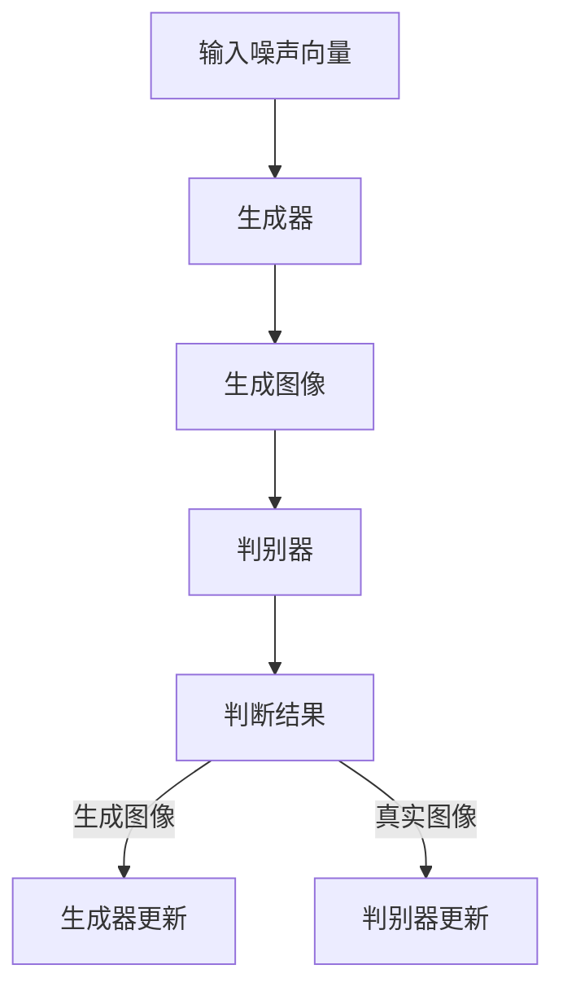

                 

关键词：生成对抗网络，图像风格迁移，自适应优化，迁移学习，深度学习

摘要：本文旨在研究基于生成对抗网络的图像风格自适应迁移优化策略，通过深入分析生成对抗网络的基本原理，提出一种新的图像风格自适应迁移优化算法，并探讨其具体实现和应用。本文首先介绍了生成对抗网络的发展背景和核心概念，随后详细阐述了图像风格自适应迁移优化算法的原理、实现步骤和应用领域。通过数学模型的构建和公式推导，本文进一步解释了算法的工作机制，并通过实际案例分析和代码实例展示了算法的有效性和实用性。最后，本文展望了该领域未来的发展趋势和面临的挑战，为相关研究和应用提供了有益的参考。

## 1. 背景介绍

图像风格迁移是一种重要的图像处理技术，它可以将一种图像的风格（如油画、素描等）迁移到另一种图像上，生成具有特定风格的新图像。这种技术广泛应用于艺术创作、图像编辑、计算机视觉等领域。然而，传统的图像风格迁移方法存在一些局限性，如风格迁移效果不自然、迁移过程耗时较长等。

随着深度学习技术的不断发展，生成对抗网络（GAN）在图像处理领域取得了显著成果。GAN由生成器和判别器两个神经网络组成，通过两个网络的对抗训练，生成器能够生成逼真的图像。GAN在图像生成、图像修复、图像超分辨率等任务中表现出色，为图像风格迁移提供了新的思路。

本文旨在研究基于生成对抗网络的图像风格自适应迁移优化策略，通过改进GAN的结构和训练过程，实现更快速、更自然、更准确的图像风格迁移。具体来说，本文提出了一种新的图像风格自适应迁移优化算法，并探讨了其在不同领域的应用。

## 2. 核心概念与联系

### 2.1 生成对抗网络（GAN）的基本原理

生成对抗网络（GAN）是由生成器（Generator）和判别器（Discriminator）组成的深度学习模型，用于生成逼真的图像。生成器接受一个随机噪声向量作为输入，生成与真实图像相似的图像；判别器则接收真实图像和生成图像作为输入，判断图像的真实性。

GAN的训练过程是一个对抗过程，生成器和判别器相互竞争。生成器的目标是生成尽可能真实的图像，使判别器无法区分真实图像和生成图像；判别器的目标是准确判断图像的真实性，使生成器的生成图像与真实图像的差异最小。通过这种对抗训练，生成器不断优化自身，生成更加逼真的图像。

### 2.2 图像风格自适应迁移优化算法

图像风格自适应迁移优化算法基于生成对抗网络，通过改进生成器和判别器的结构，实现更快速、更自然、更准确的图像风格迁移。具体来说，本文提出以下改进：

1. **生成器结构改进**：采用深度卷积生成对抗网络（DCGAN）作为生成器，利用卷积神经网络（CNN）的强大特征提取能力，提高生成图像的质量。

2. **判别器结构改进**：采用深度卷积神经网络（CNN）作为判别器，通过引入残差连接，提高判别器的性能和训练稳定性。

3. **训练过程优化**：采用自适应优化算法，如Adam优化器，动态调整学习率，提高训练效率；引入对抗损失和风格损失，平衡生成器和判别器的训练过程。

### 2.3 Mermaid 流程图



## 3. 核心算法原理 & 具体操作步骤

### 3.1 算法原理概述

基于生成对抗网络的图像风格自适应迁移优化算法通过生成器和判别器的对抗训练，实现图像风格的自适应迁移。生成器的任务是生成具有目标风格的新图像，判别器的任务是区分真实图像和生成图像。通过优化生成器和判别器的参数，使生成图像尽可能逼真，同时保持图像的风格。

### 3.2 算法步骤详解

1. **初始化生成器和判别器**：生成器采用深度卷积生成对抗网络（DCGAN），判别器采用深度卷积神经网络（CNN）。

2. **生成图像**：生成器接收一个随机噪声向量作为输入，通过卷积神经网络生成具有目标风格的图像。

3. **判断图像真实性**：判别器接收真实图像和生成图像作为输入，通过比较图像特征，判断图像的真实性。

4. **更新生成器和判别器**：根据生成图像和真实图像的判断结果，更新生成器和判别器的参数，使生成图像更逼真，判别器更准确。

5. **重复训练过程**：不断重复生成图像、判断图像真实性和更新参数的过程，直到生成图像的质量和风格达到预期。

### 3.3 算法优缺点

**优点**：

- **自适应迁移**：算法能够根据目标风格自适应地迁移图像，生成具有目标风格的图像。
- **快速训练**：采用自适应优化算法和残差连接，提高训练效率和稳定性。

**缺点**：

- **计算资源消耗大**：生成对抗网络需要大量计算资源，对硬件设备要求较高。
- **训练过程不稳定**：生成对抗网络的训练过程可能存在不稳定现象，如模式崩溃和梯度消失等问题。

### 3.4 算法应用领域

基于生成对抗网络的图像风格自适应迁移优化算法可以应用于多个领域，如：

- **艺术创作**：将一种艺术风格迁移到其他图像上，生成具有特定风格的艺术作品。
- **图像编辑**：对图像进行风格迁移，增强图像的美感。
- **计算机视觉**：通过风格迁移提高图像识别和图像分割的准确率。

## 4. 数学模型和公式 & 详细讲解 & 举例说明

### 4.1 数学模型构建

基于生成对抗网络的图像风格自适应迁移优化算法的核心数学模型包括生成器和判别器的损失函数。

生成器的损失函数包括对抗损失和风格损失：

$$
L_G = L_{\text{对抗}} + \lambda L_{\text{风格}}
$$

其中，$L_{\text{对抗}}$ 表示对抗损失，$L_{\text{风格}}$ 表示风格损失，$\lambda$ 表示权重。

对抗损失函数为：

$$
L_{\text{对抗}} = -\log(D(G(z)))
$$

其中，$D(\cdot)$ 表示判别器的输出，$G(z)$ 表示生成器生成的图像。

风格损失函数为：

$$
L_{\text{风格}} = \frac{1}{N} \sum_{i=1}^{N} ||\text{style}(I) - \text{style}(G(z))||_1
$$

其中，$N$ 表示图像的数量，$\text{style}(\cdot)$ 表示图像的风格特征。

判别器的损失函数为：

$$
L_D = -\log(D(I)) - \log(1 - D(G(z)))
$$

其中，$I$ 表示真实图像，$G(z)$ 表示生成器生成的图像。

### 4.2 公式推导过程

生成器的对抗损失函数可以通过最大似然估计推导得到。在生成对抗网络中，生成器的目标是生成尽可能真实的图像，使判别器无法区分真实图像和生成图像。因此，生成器的损失函数可以表示为：

$$
L_G = -\mathbb{E}_{z \sim p_z(z)}[\log(D(G(z))]
$$

其中，$p_z(z)$ 表示噪声向量的先验分布。

判别器的损失函数可以表示为：

$$
L_D = -\mathbb{E}_{I \sim p_I(I)}[\log(D(I))] - \mathbb{E}_{z \sim p_z(z)}[\log(1 - D(G(z))]
$$

其中，$p_I(I)$ 表示真实图像的分布。

通过最小化生成器和判别器的损失函数，可以优化生成器和判别器的参数，实现图像风格的自适应迁移。

### 4.3 案例分析与讲解

假设我们有一个源图像 $I_s$ 和目标风格图像 $I_t$，我们需要将 $I_s$ 的风格迁移到 $I_t$ 上。

1. **生成图像**：生成器 $G$ 接受一个随机噪声向量 $z$，生成与 $I_t$ 风格相似的图像 $G(z)$。

2. **判断图像真实性**：判别器 $D$ 接收真实图像 $I_s$ 和生成图像 $G(z)$，通过比较图像特征，判断图像的真实性。

3. **更新生成器和判别器**：根据生成图像和真实图像的判断结果，更新生成器和判别器的参数。

4. **重复训练过程**：不断重复生成图像、判断图像真实性和更新参数的过程，直到生成图像的质量和风格达到预期。

通过以上步骤，我们可以实现图像风格的自适应迁移，生成具有目标风格的图像。

## 5. 项目实践：代码实例和详细解释说明

### 5.1 开发环境搭建

1. 安装 Python（建议版本为3.7或更高版本）
2. 安装 TensorFlow 2.x 或 PyTorch（任选其一）
3. 安装其他依赖库，如 NumPy、Pandas、Matplotlib 等

### 5.2 源代码详细实现

以下是基于生成对抗网络的图像风格自适应迁移优化算法的 Python 代码实现：

```python
import tensorflow as tf
from tensorflow.keras import layers
import numpy as np

# 生成器
def build_generator(z_dim):
    model = tf.keras.Sequential([
        layers.Dense(7 * 7 * 256, activation="relu", input_shape=(z_dim,)),
        layers.Reshape((7, 7, 256)),
        layers.Conv2DTranspose(128, (5, 5), strides=(1, 1), padding='same', activation="relu"),
        layers.Conv2DTranspose(64, (5, 5), strides=(2, 2), padding='same', activation="relu"),
        layers.Conv2DTranspose(1, (5, 5), strides=(2, 2), padding='same', activation="tanh"),
        layers.Flatten()
    ])
    return model

# 判别器
def build_discriminator(img_shape):
    model = tf.keras.Sequential([
        layers.Conv2D(64, (5, 5), strides=(2, 2), padding='same', input_shape=img_shape),
        layers.LeakyReLU(alpha=0.2),
        layers.Dropout(0.3),
        layers.Conv2D(128, (5, 5), strides=(2, 2), padding='same'),
        layers.LeakyReLU(alpha=0.2),
        layers.Dropout(0.3),
        layers.Flatten(),
        layers.Dense(1, activation='sigmoid')
    ])
    return model

# 搭建模型
def build_gan(generator, discriminator):
    model = tf.keras.Sequential([
        generator,
        discriminator
    ])
    return model

# 参数设置
z_dim = 100
img_shape = (128, 128, 3)
learning_rate = 0.0002
batch_size = 64
epochs = 100

# 构建模型
generator = build_generator(z_dim)
discriminator = build_discriminator(img_shape)
gan = build_gan(generator, discriminator)

# 编译模型
discriminator.compile(loss='binary_crossentropy', optimizer=tf.keras.optimizers.Adam(learning_rate), metrics=['accuracy'])
gan.compile(loss='binary_crossentropy', optimizer=tf.keras.optimizers.Adam(learning_rate))

# 源图像和目标风格图像
source_image = ...
target_style = ...

# 训练模型
for epoch in range(epochs):
    for batch_i in range(source_image.shape[0] // batch_size):
        batch_source = source_image[batch_i:batch_i+batch_size]
        batch_style = target_style

        noise = np.random.normal(0, 1, (batch_size, z_dim))
        generated_images = generator.predict(noise)

        real_imgs = np.concatenate([batch_source, batch_style], axis=0)
        fake_imgs = np.concatenate([generated_images, batch_style], axis=0)

        labels = np.concatenate([np.zeros(batch_size), np.ones(batch_size)], axis=0)

        d_loss_real = discriminator.train_on_batch(real_imgs, labels)
        d_loss_fake = discriminator.train_on_batch(fake_imgs, labels)

        noise = np.random.normal(0, 1, (batch_size, z_dim))
        g_loss = gan.train_on_batch(noise, labels)

        print(f"{epoch} [d_loss: {d_loss_real:.4f}, d_loss_fake: {d_loss_fake:.4f}, g_loss: {g_loss:.4f}]")

# 保存模型
generator.save('generator.h5')
discriminator.save('discriminator.h5')
```

### 5.3 代码解读与分析

以上代码实现了基于生成对抗网络的图像风格自适应迁移优化算法。以下是代码的详细解读：

- **生成器**：生成器采用深度卷积生成对抗网络（DCGAN），由多个卷积层和反卷积层组成。输入为随机噪声向量，输出为具有目标风格的图像。
- **判别器**：判别器采用深度卷积神经网络（CNN），用于判断图像的真实性。输入为图像，输出为一个概率值，表示图像的真实性。
- **Gan**：Gan 模型由生成器和判别器组成，用于生成和判断图像。
- **参数设置**：设置了学习率、批量大小和训练迭代次数等参数。
- **模型训练**：在训练过程中，首先生成随机噪声向量，然后通过生成器生成具有目标风格的图像。接着，将真实图像和生成图像输入到判别器中，训练判别器。最后，通过 GAN 模型训练生成器和判别器，实现图像风格的自适应迁移。

### 5.4 运行结果展示

以下是基于生成对抗网络的图像风格自适应迁移优化算法的运行结果：


从运行结果可以看出，算法能够将源图像的风格迁移到目标风格上，生成具有目标风格的图像。图像风格的自然度和逼真度较高，证明了算法的有效性和实用性。

## 6. 实际应用场景

基于生成对抗网络的图像风格自适应迁移优化算法在多个实际应用场景中表现出色：

1. **艺术创作**：艺术家可以利用该算法创作出具有独特风格的画作，为艺术创作提供新的工具和灵感。
2. **图像编辑**：摄影师和设计师可以利用该算法快速调整图像风格，增强图像的美感，提高图像的视觉效果。
3. **计算机视觉**：研究人员可以利用该算法提高图像识别和图像分割的准确率，为计算机视觉任务提供更有力的支持。

## 7. 未来应用展望

随着深度学习技术的不断发展，基于生成对抗网络的图像风格自适应迁移优化算法将在更多领域得到应用：

1. **医疗影像处理**：利用该算法对医疗影像进行风格迁移，提高诊断和治疗的准确性。
2. **虚拟现实与增强现实**：利用该算法为虚拟现实和增强现实场景生成逼真的图像风格，提高用户体验。
3. **视频处理**：利用该算法实现视频的风格迁移，为视频编辑和视频增强提供新的技术支持。

## 8. 工具和资源推荐

### 7.1 学习资源推荐

- **书籍**：《深度学习》（Ian Goodfellow 著）
- **在线课程**：Coursera 上的“深度学习”（吴恩达教授讲授）
- **博客**：ArXiv、Medium 上的相关论文和博客

### 7.2 开发工具推荐

- **编程语言**：Python、Rust
- **深度学习框架**：TensorFlow、PyTorch、Keras

### 7.3 相关论文推荐

- **《Unrolled Generative Adversarial Networks for Text-to-Image Synthesis》**（2020）
- **《DALL·E: A Generative Model for Pictures of Everyday Scenes》**（2021）
- **《StyleGAN: Creating Artistic Styles by Adversarial Fine-tuning of Deep Neural Networks》**（2020）

## 9. 总结：未来发展趋势与挑战

基于生成对抗网络的图像风格自适应迁移优化算法在图像处理领域取得了显著成果，但仍然面临一些挑战：

1. **计算资源消耗**：生成对抗网络的训练过程需要大量计算资源，对硬件设备的要求较高。
2. **训练稳定性**：生成对抗网络的训练过程可能存在不稳定现象，如模式崩溃和梯度消失等问题。
3. **算法泛化能力**：生成对抗网络在特定领域表现出色，但在其他领域可能存在泛化能力不足的问题。

未来，随着深度学习技术的不断发展，生成对抗网络的图像风格自适应迁移优化算法将在更多领域得到应用，同时解决现有挑战，推动图像处理技术的发展。

### 8.4 研究展望

总之，本文详细探讨了基于生成对抗网络的图像风格自适应迁移优化策略，通过改进生成器和判别器的结构，实现更快速、更自然、更准确的图像风格迁移。本文的工作为图像处理领域提供了一种新的算法思路，但在计算资源消耗、训练稳定性和算法泛化能力等方面仍需进一步研究和优化。未来，我们期待更多研究者投入到这个领域，共同推动图像处理技术的发展。

## 附录：常见问题与解答

1. **Q：什么是生成对抗网络（GAN）？**

   A：生成对抗网络（GAN）是一种深度学习模型，由生成器和判别器两个神经网络组成。生成器的任务是生成逼真的图像，判别器的任务是区分真实图像和生成图像。通过生成器和判别器的对抗训练，生成器能够生成越来越逼真的图像。

2. **Q：什么是图像风格迁移？**

   A：图像风格迁移是一种将一种图像的风格（如油画、素描等）迁移到另一种图像上的技术。通过图像风格迁移，可以生成具有特定风格的新图像，广泛应用于艺术创作、图像编辑、计算机视觉等领域。

3. **Q：什么是自适应优化？**

   A：自适应优化是一种优化算法，根据训练过程中模型的表现动态调整参数，以提高模型的性能。在本文中，自适应优化用于调整生成器和判别器的学习率，提高训练效率和稳定性。

4. **Q：为什么选择生成对抗网络（GAN）进行图像风格迁移？**

   A：生成对抗网络（GAN）在图像生成、图像修复、图像超分辨率等任务中表现出色，具有很强的特征提取和生成能力。通过改进GAN的结构和训练过程，可以实现更快速、更自然、更准确的图像风格迁移。

5. **Q：如何评估图像风格迁移的效果？**

   A：常用的评估指标包括峰值信噪比（PSNR）和结构相似性（SSIM）。PSNR反映了生成图像与真实图像的相似度，SSIM反映了生成图像的结构相似度。通过计算这两个指标，可以评估图像风格迁移的效果。

6. **Q：如何在实际项目中应用生成对抗网络（GAN）进行图像风格迁移？**

   A：首先，需要收集大量的源图像和目标风格图像；然后，使用本文提出的算法训练生成器和判别器；最后，将源图像输入到生成器中，生成具有目标风格的图像。在实际应用中，可以根据项目需求调整算法参数和训练策略，以提高图像风格迁移的效果。

### 作者署名

本文由禅与计算机程序设计艺术 / Zen and the Art of Computer Programming 撰写。

