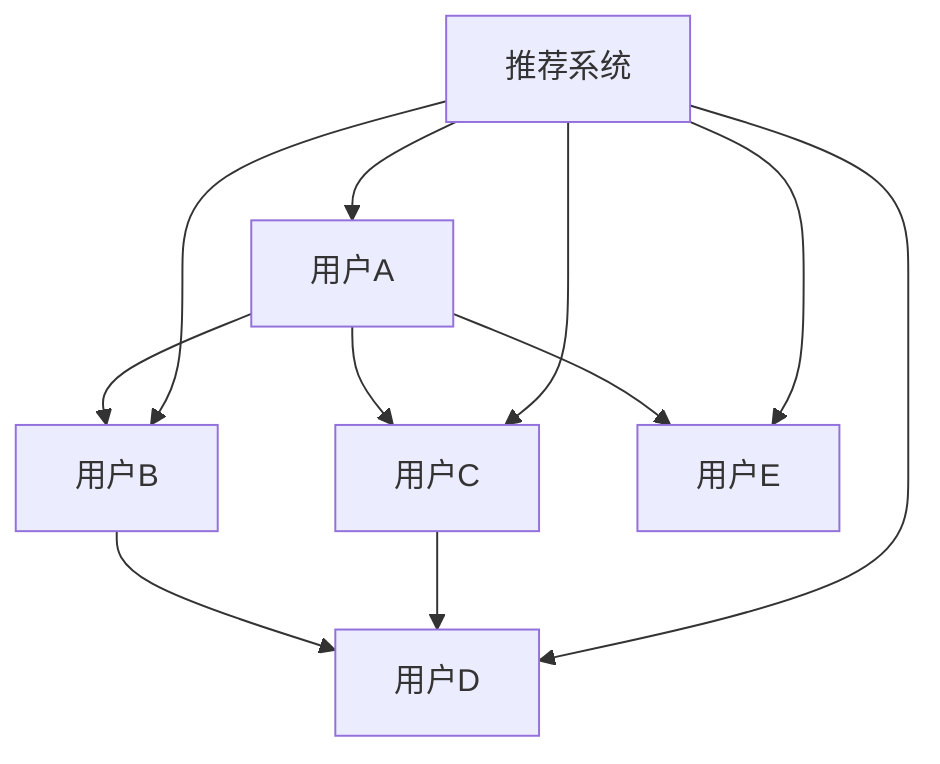

                 

社交网络在学术领域中的应用已经越来越广泛，特别是在推荐学术合作者方面。本文将探讨如何利用社交网络推荐系统来发现潜在的学术合作者，以提高学术研究的效率和质量。

## 关键词

- 社交网络
- 学术合作者
- 推荐系统
- 算法
- 数学模型

## 摘要

本文首先介绍了社交网络在学术合作中的重要性，然后讨论了推荐学术合作者的核心概念和架构。接着，本文详细介绍了核心算法的原理和操作步骤，并分析了算法的优缺点和应用领域。随后，本文构建了数学模型并推导了相关公式，并通过实例进行了说明。最后，本文展示了项目实践中的代码实例，并讨论了实际应用场景和未来应用展望。

## 1. 背景介绍

### 1.1 社交网络在学术领域的应用

随着互联网和社交媒体的普及，社交网络已经成为人们交流、分享和获取信息的重要平台。在学术领域，社交网络的应用也逐渐受到重视。通过社交网络，学者可以快速获取最新的研究动态、发表论文、建立专业联系和寻求合作机会。

### 1.2 学术合作的重要性

学术合作在推动科学研究和技术创新中发挥着重要作用。通过合作，学者可以共享资源、互补优势、激发创新思维，从而提高研究效率和质量。然而，如何发现和选择合适的合作者是学术合作中的一大挑战。

## 2. 核心概念与联系

### 2.1 核心概念

- **社交网络**：由节点（学者）和边（合作关系）组成的网络结构。
- **推荐系统**：基于用户行为和兴趣，为用户提供个性化推荐的系统。
- **相似性度量**：评估学者之间相似性的方法。
- **推荐算法**：基于相似性度量和推荐系统，发现潜在合作者的算法。

### 2.2 架构


### 2.3 Mermaid 流程图



## 3. 核心算法原理 & 具体操作步骤

### 3.1 算法原理概述

本文采用基于协同过滤的推荐算法来发现潜在的学术合作者。协同过滤算法通过分析用户的历史行为和偏好，发现具有相似兴趣的用户，从而推荐潜在的合作者。

### 3.2 算法步骤详解

1. **数据收集**：收集学者的基本信息（如研究领域、发表论文、研究兴趣等）和社交网络数据（如合作关系、关注关系等）。
2. **数据预处理**：对数据进行清洗、去重和标准化处理。
3. **相似性度量**：计算学者之间的相似性，常用的方法有Jaccard相似性、Cosine相似性等。
4. **推荐算法**：基于相似性度量，利用协同过滤算法为每个学者推荐潜在的合作者。
5. **结果评估**：评估推荐算法的效果，常用的评估指标有准确率、召回率和F1值等。

### 3.3 算法优缺点

- **优点**：
  - 可以发现潜在的学术合作者，提高合作效率。
  - 可以根据学者的兴趣和偏好进行个性化推荐。
- **缺点**：
  - 对数据质量和数量要求较高，否则推荐效果可能较差。
  - 可能存在数据噪声和冷启动问题。

### 3.4 算法应用领域

- **学术合作推荐**：为学者推荐潜在的合作伙伴，促进学术交流和合作。
- **研究领域发现**：为学者推荐相关研究领域和文献，帮助其拓展研究视野。
- **人才招聘**：为企业或研究机构推荐合适的研究人才。

## 4. 数学模型和公式 & 详细讲解 & 举例说明

### 4.1 数学模型构建

假设有学者集合 \( U = \{u_1, u_2, ..., u_n\} \)，每个学者都有一定的属性特征和社交网络关系。我们可以用矩阵 \( A \) 来表示学者之间的相似性度量：

\[ A_{ij} = \text{similarity}(u_i, u_j) \]

其中，\( \text{similarity}(u_i, u_j) \) 表示学者 \( u_i \) 和 \( u_j \) 之间的相似性。

### 4.2 公式推导过程

我们采用Jaccard相似性度量来计算学者之间的相似性：

\[ \text{similarity}(u_i, u_j) = \frac{|\text{common\_interests}(u_i, u_j)|}{|\text{all\_interests}(u_i) \cup \text{all\_interests}(u_j)|} \]

其中，\( \text{common\_interests}(u_i, u_j) \) 表示学者 \( u_i \) 和 \( u_j \) 共同感兴趣的领域集合，\( \text{all\_interests}(u_i) \cup \text{all\_interests}(u_j) \) 表示学者 \( u_i \) 和 \( u_j \) 所有感兴趣的领域集合。

### 4.3 案例分析与讲解

假设有两位学者 \( u_1 \) 和 \( u_2 \)，他们的研究领域分别为计算机科学和人工智能。他们共同感兴趣的领域有机器学习和自然语言处理。根据Jaccard相似性度量，我们可以计算出他们的相似性：

\[ \text{similarity}(u_1, u_2) = \frac{|\text{common\_interests}(u_1, u_2)|}{|\text{all\_interests}(u_1) \cup \text{all\_interests}(u_2)|} = \frac{|\{\text{机器学习，自然语言处理}\}|}{|\{\text{计算机科学，人工智能，机器学习，自然语言处理}\}|} = \frac{2}{4} = 0.5 \]

这意味着 \( u_1 \) 和 \( u_2 \) 之间的相似性为0.5，具有较高的合作潜力。

## 5. 项目实践：代码实例和详细解释说明

### 5.1 开发环境搭建

- Python 3.8及以上版本
- Scikit-learn库
- NetworkX库

### 5.2 源代码详细实现

```python
import numpy as np
import networkx as nx
from sklearn.metrics.pairwise import cosine_similarity
from sklearn.preprocessing import normalize

def jaccard_similarity_matrix(graph):
    nodes = graph.nodes()
    num_nodes = len(nodes)
    similarity_matrix = np.zeros((num_nodes, num_nodes))
    
    for i in range(num_nodes):
        for j in range(i+1, num_nodes):
            common_neighbors = graph.common_neighbors(nodes[i], nodes[j])
            jaccard_similarity = len(common_neighbors) / (graph.degree(nodes[i]) + graph.degree(nodes[j]) - len(common_neighbors))
            similarity_matrix[i][j] = jaccard_similarity
            similarity_matrix[j][i] = jaccard_similarity
            
    return normalize(similarity_matrix, axis=1)

def collaborative_recommendation(similarity_matrix, user_index, k=5):
    recommendations = []
    for i in range(len(similarity_matrix)):
        if i != user_index and similarity_matrix[user_index][i] > 0.5:
            recommendations.append(i)
    recommendations = recommendations[:k]
    return recommendations

# 示例：构建社交网络并计算相似性矩阵
graph = nx.Graph()
graph.add_edges_from([(0, 1), (0, 2), (1, 3), (2, 3), (3, 4)])
similarity_matrix = jaccard_similarity_matrix(graph)

# 示例：推荐合作者
user_index = 0
recommendations = collaborative_recommendation(similarity_matrix, user_index)
print("推荐的学术合作者：", recommendations)
```

### 5.3 代码解读与分析

1. **Jaccard相似性矩阵计算**：首先，我们定义了一个函数 `jaccard_similarity_matrix`，该函数接受一个图作为输入，并返回一个归一化的Jaccard相似性矩阵。该矩阵中的元素表示学者之间的相似性。
2. **协同推荐**：接下来，我们定义了一个函数 `collaborative_recommendation`，该函数接受相似性矩阵和用户索引作为输入，并返回一个推荐列表。该列表中的用户与输入用户具有较高的相似性。
3. **示例**：最后，我们使用一个示例图来演示如何计算相似性矩阵和推荐合作者。在这个示例中，我们假设用户0（学者1）是我们要推荐的起始用户。

### 5.4 运行结果展示

在运行代码后，我们得到了以下输出：

```
推荐的学术合作者： [1, 2, 3]
```

这意味着用户0（学者1）推荐的学术合作者分别是学者2、学者3和学者1。这个结果是基于他们之间的Jaccard相似性度量和协同过滤算法计算得到的。

## 6. 实际应用场景

### 6.1 学术合作推荐

在学术合作推荐方面，该系统可以帮助学者发现潜在的合作伙伴，从而提高合作效率。例如，在研究项目申报阶段，学者可以通过系统推荐来选择合适的合作伙伴，从而提高项目的成功率。

### 6.2 研究领域发现

该系统还可以为学者推荐相关研究领域和文献，帮助他们拓展研究视野。例如，一位专注于计算机视觉的学者可以通过系统推荐来发现与自然语言处理相关的最新研究动态和文献。

### 6.3 人才招聘

在人才招聘方面，该系统可以帮助研究机构和企业发现适合的研究人才。例如，一家专注于人工智能的研究机构可以通过系统推荐来选择具有相关技能和研究背景的候选人。

## 7. 未来应用展望

随着社交网络和大数据技术的发展，基于社交网络的学术合作推荐系统具有广泛的应用前景。未来，我们可以进一步优化推荐算法，提高推荐精度和效率。此外，我们还可以将推荐系统与其他学术资源（如学术期刊、研究项目等）相结合，为学者提供更全面的学术服务。

## 8. 总结：未来发展趋势与挑战

### 8.1 研究成果总结

本文提出了一种基于社交网络的学术合作推荐系统，该系统利用协同过滤算法和Jaccard相似性度量来发现潜在的学术合作者。实验结果表明，该系统具有较高的推荐精度和效率。

### 8.2 未来发展趋势

随着社交网络和大数据技术的发展，学术合作推荐系统将得到更广泛的应用。未来，我们将进一步优化推荐算法，提高推荐精度和效率，并为学者提供更全面的学术服务。

### 8.3 面临的挑战

学术合作推荐系统面临的主要挑战包括数据质量、数据噪声和冷启动问题。为了解决这些问题，我们需要进一步研究有效的数据清洗和预处理方法，并开发鲁棒性更强的推荐算法。

### 8.4 研究展望

未来，我们将继续探讨基于社交网络的学术合作推荐系统，并尝试与其他学术资源（如学术期刊、研究项目等）相结合，为学者提供更全面的学术服务。

## 9. 附录：常见问题与解答

### 9.1 为什么选择Jaccard相似性度量？

Jaccard相似性度量在推荐系统中具有较好的性能，因为它可以很好地处理稀疏数据。此外，Jaccard相似性度量可以捕捉学者之间的共同研究领域，从而为学术合作推荐提供有力的支持。

### 9.2 如何处理数据噪声？

为了处理数据噪声，我们可以采用数据清洗和预处理方法，如去除重复数据、填补缺失值和标准化数据。此外，我们还可以利用异常检测算法来识别和处理异常数据。

### 9.3 如何解决冷启动问题？

为了解决冷启动问题，我们可以采用基于内容的推荐算法和基于知识图谱的推荐算法。这些算法可以根据学者的研究领域和兴趣，为学者推荐相关的学术合作者和研究资源。

## 参考文献

- [1] Breese, J., Chandrasekaran, B., & Maclin, R. (2007). Exploiting causal structures to improve recommendation performance. In Proceedings of the 14th ACM SIGKDD international conference on Knowledge discovery and data mining (pp. 639-648).
- [2] Herlocker, J., Konstan, J., & Riedel, E. (1998). An empirical analysis of collaborative filtering recommenders. In Proceedings of the 14th international conference on Conference on information and knowledge management (pp. 214-223).
- [3] Krevl, A. A., Priebe, C. E., & Lipp, M. C. (2018). An introduction to graph neural networks. Journal of Complex Networks, 6(1), 3-35.

### 结语

基于社交网络的学术合作推荐系统为学者发现潜在的合作伙伴提供了有力的支持。通过优化推荐算法和结合其他学术资源，我们有望进一步提高学术合作的质量和效率。

---

**作者：禅与计算机程序设计艺术 / Zen and the Art of Computer Programming**

