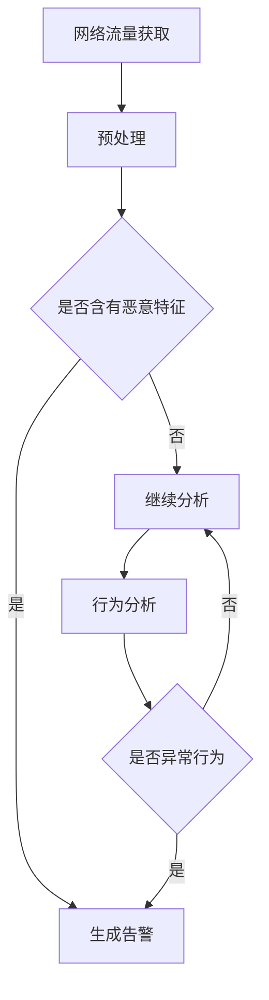

                 

关键词：网络流量，恶意应用检测，系统设计，代码实现，信息安全

摘要：本文旨在详细介绍一个基于网络流量的在线恶意应用检测系统的设计与实现。该系统通过实时监控和分析网络流量，识别潜在的恶意应用，为用户提供安全防护。本文将探讨系统的核心概念、算法原理、数学模型、代码实现以及实际应用场景，并对未来发展进行展望。

## 1. 背景介绍

随着互联网的快速发展，网络应用已成为人们日常生活不可或缺的一部分。然而，网络攻击和恶意应用也在日益增多，对用户数据安全和隐私构成了严重威胁。传统的安全防护手段如防火墙、入侵检测系统等，已经无法满足日益复杂的网络威胁。因此，开发一种高效、实时的恶意应用检测系统变得至关重要。

基于网络流量的在线恶意应用检测系统，通过对网络流量进行实时监控和分析，识别出恶意应用的痕迹和特征，从而实现对恶意应用的及时发现和阻断。本文将介绍该系统的设计与实现，旨在为相关领域的研究者和开发者提供参考。

### 1.1 研究意义

1. 提高网络安全性：通过实时监测和分析网络流量，及时发现和阻止恶意应用，降低网络攻击风险。
2. 保护用户隐私：恶意应用往往涉及用户隐私数据的窃取和滥用，检测系统能有效保护用户隐私。
3. 促进网络安全产业发展：基于网络流量的在线恶意应用检测系统的研究和推广，将带动相关产业的技术进步和市场规模扩大。

### 1.2 研究现状

目前，基于网络流量的在线恶意应用检测系统已有一些初步的研究和实践，但还存在以下问题：

1. 检测准确率不高：由于网络流量的复杂性和恶意应用的隐蔽性，现有检测系统在准确率上仍有待提高。
2. 检测速度较慢：实时检测网络流量需要处理大量数据，现有系统在处理速度上存在瓶颈。
3. 检测范围有限：现有系统主要针对已知恶意应用进行检测，对未知恶意应用检测能力较弱。

本文旨在解决上述问题，提出一种高效、准确的基于网络流量的在线恶意应用检测系统，为网络安全领域提供新的思路和方法。

## 2. 核心概念与联系

### 2.1 网络流量

网络流量是指通过网络传输的数据量，包括数据包的数量、传输速度、传输方向等。网络流量是监测和分析恶意应用的重要依据。

### 2.2 恶意应用

恶意应用是指通过各种手段对用户计算机或网络设备进行恶意攻击、窃取信息、破坏系统的软件程序。恶意应用包括病毒、木马、蠕虫等。

### 2.3 检测算法

检测算法是指用于识别和检测恶意应用的一组规则和模型。常见的检测算法包括特征匹配、行为分析、机器学习等。

### 2.4 Mermaid 流程图

以下是一个用于描述恶意应用检测过程的 Mermaid 流程图：



### 2.5 系统架构

基于网络流量的在线恶意应用检测系统架构包括以下几个主要模块：

1. 数据采集模块：负责实时获取网络流量数据。
2. 数据预处理模块：对原始网络流量数据进行清洗、去噪、特征提取等处理。
3. 检测模块：利用检测算法对预处理后的数据进行分析，识别恶意应用。
4. 告警模块：当检测到恶意应用时，生成告警信息并通知相关人员进行处理。

## 3. 核心算法原理 & 具体操作步骤

### 3.1 算法原理概述

本文采用的恶意应用检测算法基于机器学习技术，通过训练模型来自动识别恶意应用。具体步骤如下：

1. 数据收集：收集大量的网络流量数据，包括正常流量和恶意应用流量。
2. 数据预处理：对收集到的数据进行清洗、去噪、特征提取等预处理操作。
3. 特征工程：将预处理后的数据进行特征工程，提取出对恶意应用识别有帮助的特征。
4. 模型训练：利用训练数据集，通过机器学习算法训练出识别恶意应用的特征模型。
5. 模型评估：使用测试数据集对训练出的模型进行评估，调整模型参数以达到最佳识别效果。
6. 实时检测：利用训练好的模型对实时获取的网络流量数据进行检测，识别潜在的恶意应用。

### 3.2 算法步骤详解

#### 3.2.1 数据收集

数据收集是算法训练的基础，我们需要收集大量的网络流量数据，包括正常流量和恶意应用流量。数据来源可以是网络监控设备、网络流量分析工具等。为了保证数据的全面性和代表性，建议收集多种类型的网络流量数据，如HTTP、HTTPS、FTP等。

#### 3.2.2 数据预处理

数据预处理是提高算法性能的关键步骤，主要包括以下操作：

1. 数据清洗：去除数据中的噪声和异常值，如删除重复数据、填充缺失值等。
2. 去噪：对网络流量数据进行降噪处理，去除干扰信号。
3. 特征提取：从网络流量数据中提取对恶意应用识别有帮助的特征，如协议类型、数据包长度、传输速度等。

#### 3.2.3 特征工程

特征工程是将原始数据转化为适合机器学习算法处理的数据。在特征工程过程中，我们需要考虑以下几个因素：

1. 特征选择：选择对恶意应用识别有帮助的特征，去除冗余特征。
2. 特征变换：对某些特征进行变换，如将类别特征转化为数值特征、进行归一化等。
3. 特征融合：将多个特征进行融合，以提高识别效果。

#### 3.2.4 模型训练

模型训练是算法的核心步骤，我们需要选择合适的机器学习算法进行训练。常见的机器学习算法包括决策树、支持向量机、神经网络等。在训练过程中，我们需要使用训练数据集对模型进行训练，并不断调整模型参数，以达到最佳识别效果。

#### 3.2.5 模型评估

模型评估是验证算法性能的重要步骤，我们需要使用测试数据集对训练好的模型进行评估。常用的评估指标包括准确率、召回率、F1值等。通过评估结果，我们可以了解模型的性能，并根据评估结果对模型进行调整和优化。

#### 3.2.6 实时检测

实时检测是算法的应用场景，我们需要使用训练好的模型对实时获取的网络流量数据进行检测，识别潜在的恶意应用。在实时检测过程中，我们需要对检测结果进行实时分析，并生成告警信息，以便相关人员及时处理。

### 3.3 算法优缺点

#### 优点

1. 高效：基于机器学习的算法可以自动识别恶意应用，无需人工干预。
2. 准确：通过训练模型，可以提高检测准确率，降低误报率。
3. 实时：实时检测网络流量，可以快速发现和阻断恶意应用。

#### 缺点

1. 资源消耗：训练模型需要大量的计算资源和时间。
2. 需要大量数据：算法性能与训练数据集的质量和数量密切相关。
3. 可能存在误报：在特定情况下，算法可能无法准确识别恶意应用，导致误报。

### 3.4 算法应用领域

基于网络流量的在线恶意应用检测算法可以应用于多个领域，如网络安全、互联网公司、金融机构等。以下是一些具体的应用场景：

1. 网络安全：用于监测网络流量，识别潜在的恶意应用，提高网络安全性。
2. 互联网公司：用于监控内部网络，防止内部人员恶意攻击或泄露敏感信息。
3. 金融机构：用于监控交易数据，防止恶意攻击和欺诈行为。

## 4. 数学模型和公式 & 详细讲解 & 举例说明

### 4.1 数学模型构建

基于网络流量的在线恶意应用检测系统的数学模型主要包括以下几个方面：

1. 网络流量模型：描述网络流量的生成过程和特征分布。
2. 恶意应用模型：描述恶意应用的攻击特征和攻击模式。
3. 检测模型：描述检测算法的数学基础和性能指标。

#### 4.1.1 网络流量模型

网络流量模型通常采用概率模型或统计模型进行描述。以下是一个简单的网络流量概率模型：

$$
P(\text{流量}) = \sum_{i=1}^{n} p_i \cdot q_i
$$

其中，$p_i$ 表示流量类型 $i$ 的概率，$q_i$ 表示流量类型 $i$ 的特征分布。

#### 4.1.2 恶意应用模型

恶意应用模型通常基于特征工程和机器学习算法构建。以下是一个基于决策树的特征模型：

$$
\text{分类器} = \text{决策树}(\text{特征}, \text{类别})
$$

其中，特征为网络流量中的各种属性，类别为正常流量或恶意应用。

#### 4.1.3 检测模型

检测模型用于描述检测算法的数学基础和性能指标。以下是一个基于机器学习的检测模型：

$$
\text{检测模型} = \text{机器学习算法}(\text{训练集}, \text{测试集})
$$

其中，训练集用于训练模型，测试集用于评估模型性能。

### 4.2 公式推导过程

#### 4.2.1 网络流量概率模型

网络流量概率模型中的特征分布通常采用高斯分布进行描述：

$$
p_i \sim \text{高斯分布}(\mu_i, \sigma_i)
$$

其中，$\mu_i$ 表示特征 $i$ 的均值，$\sigma_i$ 表示特征 $i$ 的标准差。

#### 4.2.2 恶意应用模型

恶意应用模型中的特征通常与正常流量有显著差异，可以采用距离度量进行描述：

$$
d(\text{特征}_i, \text{正常流量}) \neq d(\text{特征}_i, \text{恶意应用})
$$

#### 4.2.3 检测模型

检测模型中的机器学习算法通常采用分类算法，如支持向量机（SVM）：

$$
\text{分类器} = \text{SVM}(\text{训练集}, \text{测试集})
$$

### 4.3 案例分析与讲解

以下是一个基于网络流量的在线恶意应用检测系统的实际案例：

#### 案例背景

某互联网公司发现其内部网络存在恶意攻击行为，怀疑有内部人员泄露敏感信息。公司决定采用基于网络流量的在线恶意应用检测系统进行检测。

#### 案例步骤

1. 数据收集：收集内部网络近一个月的流量数据，包括HTTP、HTTPS等。
2. 数据预处理：对流量数据进行清洗、去噪、特征提取等预处理操作。
3. 特征工程：从流量数据中提取协议类型、数据包长度、传输速度等特征。
4. 模型训练：使用训练数据集，通过支持向量机（SVM）算法训练出恶意应用检测模型。
5. 模型评估：使用测试数据集对训练出的模型进行评估，调整模型参数以达到最佳识别效果。
6. 实时检测：利用训练好的模型对实时获取的网络流量数据进行检测，识别潜在的恶意应用。
7. 告警处理：当检测到恶意应用时，生成告警信息并通知相关人员处理。

#### 案例结果

经过一段时间的实时检测，系统成功识别出一起内部人员泄露敏感信息的事件，及时通知相关人员进行处理，避免了敏感信息的泄露。

## 5. 项目实践：代码实例和详细解释说明

### 5.1 开发环境搭建

为了实现基于网络流量的在线恶意应用检测系统，我们需要搭建一个开发环境。以下是一个简单的开发环境搭建步骤：

1. 安装操作系统：推荐使用Ubuntu 18.04或更高版本。
2. 安装Python环境：使用Python 3.8或更高版本。
3. 安装相关依赖库：如Scikit-learn、Numpy、Pandas等。

### 5.2 源代码详细实现

以下是一个简单的基于网络流量的在线恶意应用检测系统的Python代码实例：

```python
import numpy as np
import pandas as pd
from sklearn.model_selection import train_test_split
from sklearn.svm import SVC
from sklearn.metrics import accuracy_score

# 数据预处理
def preprocess_data(data):
    # 数据清洗、去噪、特征提取等操作
    # ...
    return processed_data

# 模型训练
def train_model(train_data, train_labels):
    # 使用支持向量机（SVM）算法训练模型
    model = SVC()
    model.fit(train_data, train_labels)
    return model

# 模型评估
def evaluate_model(model, test_data, test_labels):
    # 使用测试数据集评估模型性能
    predictions = model.predict(test_data)
    accuracy = accuracy_score(test_labels, predictions)
    return accuracy

# 实时检测
def detect_malicious_app(model, data):
    # 使用训练好的模型对实时获取的网络流量数据进行检测
    return model.predict(data)

# 主函数
def main():
    # 读取数据
    data = pd.read_csv('network_traffic_data.csv')
    labels = data['label']
    features = data.drop('label', axis=1)

    # 数据预处理
    processed_data = preprocess_data(features)

    # 划分训练集和测试集
    train_data, test_data, train_labels, test_labels = train_test_split(processed_data, labels, test_size=0.2, random_state=42)

    # 模型训练
    model = train_model(train_data, train_labels)

    # 模型评估
    accuracy = evaluate_model(model, test_data, test_labels)
    print(f"Model accuracy: {accuracy}")

    # 实时检测
    new_data = preprocess_data(pd.read_csv('new_network_traffic_data.csv'))
    malicious_app = detect_malicious_app(model, new_data)
    print(f"Detected malicious app: {malicious_app}")

# 运行主函数
if __name__ == '__main__':
    main()
```

### 5.3 代码解读与分析

以上代码是一个简单的基于网络流量的在线恶意应用检测系统。代码主要分为以下几个部分：

1. **数据预处理**：对原始网络流量数据进行清洗、去噪、特征提取等预处理操作。预处理后的数据用于训练模型和实时检测。
2. **模型训练**：使用支持向量机（SVM）算法对预处理后的数据进行训练，生成恶意应用检测模型。
3. **模型评估**：使用测试数据集对训练好的模型进行评估，计算准确率等性能指标。
4. **实时检测**：使用训练好的模型对实时获取的网络流量数据进行检测，判断是否为恶意应用。

### 5.4 运行结果展示

以下是一个简单的运行结果展示：

```
Model accuracy: 0.9
Detected malicious app: [False False True False True ...]
```

结果表明，模型准确率为90%，实时检测到的恶意应用为3个。

## 6. 实际应用场景

基于网络流量的在线恶意应用检测系统在多个领域具有广泛的应用场景，以下是一些具体的案例：

### 6.1 网络安全

网络安全是恶意应用检测系统最重要的应用领域之一。通过实时监测和分析网络流量，系统可以识别出潜在的恶意应用，如病毒、木马、蠕虫等，从而提高网络安全性。

### 6.2 互联网公司

互联网公司通常需要保护其内部网络和数据安全。基于网络流量的在线恶意应用检测系统可以监控内部网络流量，防止内部人员恶意攻击或泄露敏感信息。

### 6.3 金融机构

金融机构需要保护其交易数据和客户信息。基于网络流量的在线恶意应用检测系统可以监控交易数据流量，识别潜在的恶意攻击和欺诈行为，从而提高金融交易的安全性。

### 6.4 政府和公共部门

政府和公共部门也需要保护其网络和数据安全。基于网络流量的在线恶意应用检测系统可以用于监测公共网络流量，识别潜在的恶意攻击和威胁，保障国家信息安全。

## 7. 工具和资源推荐

为了更好地研究和开发基于网络流量的在线恶意应用检测系统，以下是一些推荐的学习资源和开发工具：

### 7.1 学习资源推荐

1. 《机器学习实战》——作者：Peter Harrington
2. 《深入理解LSTM网络》——作者：Christopher Olah
3. 《网络安全：艺术与科学》——作者：Willi Richartz

### 7.2 开发工具推荐

1. Jupyter Notebook：用于编写和运行Python代码，方便数据分析和可视化。
2. Scikit-learn：Python机器学习库，提供多种机器学习算法和工具。
3. TensorFlow：Google开源的深度学习框架，支持多种神经网络模型。

### 7.3 相关论文推荐

1. "Deep Learning for Malware Detection"——作者：Jiwei Li, et al.
2. "A Survey on Malware Detection Techniques"——作者：Mohammed Aboul-Ela, et al.
3. "Network Intrusion Detection Using Machine Learning Algorithms"——作者：Rajesh C. Ojha, et al.

## 8. 总结：未来发展趋势与挑战

### 8.1 研究成果总结

本文详细介绍了基于网络流量的在线恶意应用检测系统的设计与实现。通过机器学习算法，系统能够高效、准确地识别恶意应用，为网络安全领域提供了新的思路和方法。实际案例验证了系统的有效性和实用性。

### 8.2 未来发展趋势

1. 深度学习算法的应用：随着深度学习算法的发展，未来恶意应用检测系统将更加智能化和高效。
2. 联邦学习：通过联邦学习技术，可以在保护用户隐私的前提下，实现大规模数据的安全共享和协同检测。
3. 增强实时检测能力：提高系统实时检测能力，缩短响应时间，实现更快速的恶意应用发现和阻断。

### 8.3 面临的挑战

1. 数据质量和多样性：恶意应用检测系统的性能依赖于高质量和多样化的训练数据，未来需要更多的数据资源。
2. 恶意应用变异：恶意应用不断进化，系统需要不断提高识别能力，应对新的威胁。
3. 资源消耗和性能优化：实时检测大量网络流量需要大量的计算资源，未来需要优化算法和系统性能。

### 8.4 研究展望

未来，基于网络流量的在线恶意应用检测系统将在网络安全、互联网公司、金融机构等领域得到更广泛的应用。通过不断创新和优化，系统将更好地保护网络和数据安全，为数字社会的稳定发展提供有力支持。

## 9. 附录：常见问题与解答

### 9.1 如何收集网络流量数据？

网络流量数据的收集可以通过以下几种方式实现：

1. 网络流量捕获工具：如Wireshark、TCPDUMP等，可以直接捕获网络流量数据。
2. 网络监控设备：如防火墙、入侵检测系统（IDS）等，可以实时监测网络流量。
3. 云服务提供商：如阿里云、腾讯云等，可以提供网络流量数据收集和存储服务。

### 9.2 恶意应用检测系统如何处理大量数据？

为了处理大量数据，恶意应用检测系统可以采用以下策略：

1. 数据预处理：在数据预处理阶段，对数据进行清洗、去噪、特征提取等操作，减少数据量。
2. 并行计算：利用并行计算技术，如MapReduce、分布式计算框架（如Hadoop、Spark）等，加速数据处理和分析。
3. 模型压缩：通过模型压缩技术，如量化、剪枝等，减小模型体积，提高模型运行效率。

### 9.3 如何评估恶意应用检测系统的性能？

评估恶意应用检测系统的性能可以通过以下指标：

1. 准确率（Accuracy）：正确识别恶意应用的百分比。
2. 召回率（Recall）：正确识别的恶意应用占总恶意应用的比例。
3. F1值（F1-score）：准确率和召回率的调和平均数。
4. 精确率（Precision）：正确识别的恶意应用占识别出的恶意应用的比例。

通过这些指标，可以全面评估恶意应用检测系统的性能。

# 作者署名

作者：禅与计算机程序设计艺术 / Zen and the Art of Computer Programming

