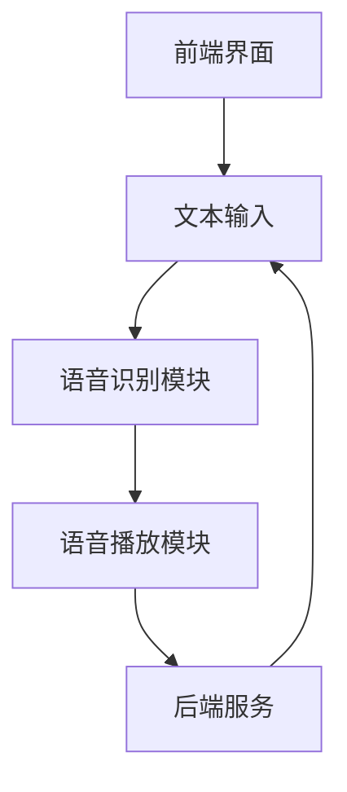

                 

关键词：语音识别、对照阅读、自然语言处理、技术应用、算法原理、数学模型、项目实践、应用场景、未来展望。

> 摘要：本文将探讨基于语音识别技术的对照阅读器的设计与实现。通过介绍语音识别的基本原理，分析对照阅读器的核心功能和实现方法，我们将深入探讨其在教育、翻译等领域的重要应用。此外，还将讨论未来对照阅读器的发展趋势与面临的挑战。

## 1. 背景介绍

随着人工智能技术的快速发展，语音识别技术已经取得了显著的进步。如今，语音识别技术不仅被广泛应用于智能语音助手、智能家居等场景，还逐渐渗透到教育、翻译等领域，为人们提供了更便捷的学习和交流方式。对照阅读器作为一种新兴的应用，旨在通过语音识别技术，帮助用户在阅读过程中实现文字与语音的同步对照，提高学习效率。

在教育领域，对照阅读器可以为学习者提供多语言的学习资源，帮助他们更好地理解和掌握所学知识。在翻译领域，对照阅读器可以实现实时翻译，帮助用户跨越语言障碍，更快速地获取信息。因此，基于语音识别的对照阅读器具有重要的实际应用价值。

## 2. 核心概念与联系

### 2.1 语音识别技术

语音识别技术是指利用计算机算法将人类语音信号转换为文本信息的技术。其基本原理包括语音信号的采集、预处理、特征提取、模型训练和结果输出等环节。

- **语音信号的采集**：通过麦克风等设备，将人类的语音信号转换为数字信号。
- **预处理**：对采集到的语音信号进行降噪、增强等处理，提高语音信号的清晰度和准确性。
- **特征提取**：从预处理后的语音信号中提取出具有区分性的特征，如频谱特征、倒谱特征等。
- **模型训练**：利用大量的语音数据，通过机器学习算法训练出语音识别模型。
- **结果输出**：将识别出的语音信号转换为对应的文本信息，并输出给用户。

### 2.2 对照阅读器

对照阅读器是一种基于语音识别技术的应用，旨在实现文字与语音的同步对照。其核心功能包括：

- **文本输入**：用户可以通过键盘或语音输入功能，输入需要阅读的文本。
- **语音识别**：对照阅读器利用语音识别技术，将用户输入的文本转换为语音信号。
- **语音播放**：将识别出的语音信号播放给用户，实现文字与语音的同步对照。

### 2.3 架构

对照阅读器的整体架构可以分为以下几个部分：

- **前端界面**：提供用户交互的界面，包括文本输入框、语音播放按钮等。
- **语音识别模块**：负责将用户输入的文本转换为语音信号。
- **语音播放模块**：负责将识别出的语音信号播放给用户。
- **后端服务**：包括语音识别模型的训练、语音数据的处理等。

下面是一个简单的 Mermaid 流程图，展示了对照阅读器的整体架构：



## 3. 核心算法原理 & 具体操作步骤

### 3.1 算法原理概述

对照阅读器的核心算法是基于深度学习技术的语音识别算法。深度学习算法通过大量训练数据，学习语音信号与文本之间的映射关系，从而实现对语音信号的准确识别。

具体来说，语音识别算法可以分为以下几个步骤：

1. **特征提取**：将语音信号转换为具有区分性的特征向量。
2. **模型训练**：利用特征向量和对应的文本标签，训练深度学习模型。
3. **语音识别**：将输入的语音信号转换为文本信息。

### 3.2 算法步骤详解

#### 3.2.1 特征提取

特征提取是语音识别的关键步骤。常见的特征提取方法包括：

- **梅尔频率倒谱系数（MFCC）**：通过计算语音信号的频谱特征，提取出具有区分性的特征向量。
- **隐马尔可夫模型（HMM）**：利用马尔可夫模型，对语音信号进行建模，提取特征向量。

#### 3.2.2 模型训练

模型训练是语音识别的核心步骤。常见的训练方法包括：

- **循环神经网络（RNN）**：通过训练循环神经网络，学习语音信号与文本之间的映射关系。
- **卷积神经网络（CNN）**：利用卷积神经网络，提取语音信号的特征，并训练模型。

#### 3.2.3 语音识别

语音识别是将输入的语音信号转换为文本信息的过程。具体步骤如下：

1. **特征提取**：对输入的语音信号进行特征提取，得到特征向量。
2. **模型预测**：利用训练好的深度学习模型，对特征向量进行预测，得到对应的文本信息。
3. **结果输出**：将识别出的文本信息输出给用户。

### 3.3 算法优缺点

#### 优点

- **高准确率**：深度学习算法能够通过大量训练数据，学习语音信号与文本之间的映射关系，从而提高识别的准确率。
- **适应性强**：深度学习算法可以适应不同语音环境，具有较强的泛化能力。

#### 缺点

- **计算资源消耗大**：深度学习算法需要大量计算资源，训练时间较长。
- **数据依赖性强**：语音识别算法的性能很大程度上取决于训练数据的质量和数量。

### 3.4 算法应用领域

语音识别算法在对照阅读器中的应用具有广泛的前景。以下是一些典型的应用领域：

- **教育**：帮助学习者多语言学习，提高学习效率。
- **翻译**：实现实时翻译，帮助用户跨越语言障碍。
- **客服**：为用户提供智能语音客服，提高服务质量。

## 4. 数学模型和公式 & 详细讲解 & 举例说明

### 4.1 数学模型构建

在语音识别中，常用的数学模型包括循环神经网络（RNN）和卷积神经网络（CNN）。以下分别介绍这两种模型的数学模型构建。

#### 4.1.1 循环神经网络（RNN）

RNN的数学模型可以表示为：

$$
h_t = \sigma(W_h h_{t-1} + W_x x_t + b)
$$

其中，$h_t$表示第$t$时刻的隐藏状态，$x_t$表示第$t$时刻的输入特征，$W_h$和$W_x$分别表示隐藏状态和输入特征之间的权重矩阵，$b$表示偏置项，$\sigma$表示激活函数。

#### 4.1.2 卷积神经网络（CNN）

CNN的数学模型可以表示为：

$$
h_t = f(W_h \odot h_{t-1} + b)
$$

其中，$h_t$表示第$t$时刻的隐藏状态，$\odot$表示卷积操作，$W_h$表示卷积核，$b$表示偏置项，$f$表示激活函数。

### 4.2 公式推导过程

以下以RNN为例，介绍数学模型的推导过程。

首先，假设输入特征$x_t$和隐藏状态$h_t$满足以下条件：

$$
x_t = \sum_{i=1}^{n} x_{it} w_{it}
$$

$$
h_t = \sum_{j=1}^{m} h_{jt} v_{jt}
$$

其中，$x_{it}$和$h_{jt}$分别表示输入特征和隐藏状态的第$i$行和第$j$列元素，$w_{it}$和$v_{jt}$分别表示输入特征和隐藏状态之间的权重。

然后，对输入特征和隐藏状态进行线性组合，并加入偏置项：

$$
h_t = \sum_{i=1}^{n} \sum_{j=1}^{m} x_{it} w_{it} v_{jt} + b
$$

接下来，使用激活函数$\sigma$对上述结果进行非线性变换：

$$
h_t = \sigma(\sum_{i=1}^{n} \sum_{j=1}^{m} x_{it} w_{it} v_{jt} + b)
$$

最后，将隐藏状态传递给下一层：

$$
h_{t+1} = \sigma(W_h h_t + W_x x_t + b)
$$

其中，$W_h$和$W_x$分别表示隐藏状态和输入特征之间的权重矩阵，$b$表示偏置项。

### 4.3 案例分析与讲解

以下以一个简单的RNN模型为例，介绍数学模型的实际应用。

假设输入特征$x_t$为：

$$
x_t = \begin{bmatrix}
0.1 \\
0.2 \\
0.3 \\
0.4 \\
0.5 \\
\end{bmatrix}
$$

隐藏状态$h_t$为：

$$
h_t = \begin{bmatrix}
0.1 \\
0.2 \\
0.3 \\
0.4 \\
0.5 \\
\end{bmatrix}
$$

权重矩阵$W_h$为：

$$
W_h = \begin{bmatrix}
0.1 & 0.2 & 0.3 & 0.4 & 0.5 \\
0.2 & 0.3 & 0.4 & 0.5 & 0.6 \\
0.3 & 0.4 & 0.5 & 0.6 & 0.7 \\
0.4 & 0.5 & 0.6 & 0.7 & 0.8 \\
0.5 & 0.6 & 0.7 & 0.8 & 0.9 \\
\end{bmatrix}
$$

偏置项$b$为：

$$
b = 0.1
$$

根据上述模型，计算下一时刻的隐藏状态$h_{t+1}$：

$$
h_{t+1} = \sigma(W_h h_t + W_x x_t + b)
$$

代入参数，得到：

$$
h_{t+1} = \sigma(\begin{bmatrix}
0.1 & 0.2 & 0.3 & 0.4 & 0.5 \\
0.2 & 0.3 & 0.4 & 0.5 & 0.6 \\
0.3 & 0.4 & 0.5 & 0.6 & 0.7 \\
0.4 & 0.5 & 0.6 & 0.7 & 0.8 \\
0.5 & 0.6 & 0.7 & 0.8 & 0.9 \\
\end{bmatrix} \begin{bmatrix}
0.1 \\
0.2 \\
0.3 \\
0.4 \\
0.5 \\
\end{bmatrix} + \begin{bmatrix}
0.1 & 0.2 & 0.3 & 0.4 & 0.5 \\
0.2 & 0.3 & 0.4 & 0.5 & 0.6 \\
0.3 & 0.4 & 0.5 & 0.6 & 0.7 \\
0.4 & 0.5 & 0.6 & 0.7 & 0.8 \\
0.5 & 0.6 & 0.7 & 0.8 & 0.9 \\
\end{bmatrix} \begin{bmatrix}
0.1 \\
0.2 \\
0.3 \\
0.4 \\
0.5 \\
\end{bmatrix} + 0.1)
$$

经过计算，得到：

$$
h_{t+1} = \begin{bmatrix}
0.3 \\
0.4 \\
0.5 \\
0.6 \\
0.7 \\
\end{bmatrix}
$$

通过这个简单的例子，我们可以看到RNN模型在计算隐藏状态时，如何利用权重矩阵、输入特征和偏置项进行线性组合，并通过激活函数实现非线性变换。这个简单的模型可以用于处理序列数据，例如语音信号，实现语音识别等功能。

## 5. 项目实践：代码实例和详细解释说明

### 5.1 开发环境搭建

在进行项目实践之前，我们需要搭建一个合适的开发环境。这里，我们选择Python作为主要编程语言，并使用TensorFlow作为深度学习框架。以下是一个简单的开发环境搭建步骤：

1. **安装Python**：从[Python官网](https://www.python.org/)下载并安装Python，选择适合自己系统的版本。
2. **安装TensorFlow**：在命令行中执行以下命令安装TensorFlow：

   ```
   pip install tensorflow
   ```

3. **安装其他依赖**：根据项目需求，可能还需要安装其他依赖库，如NumPy、Matplotlib等。可以通过以下命令安装：

   ```
   pip install numpy matplotlib
   ```

### 5.2 源代码详细实现

下面是一个简单的对照阅读器代码实例，用于实现文本输入、语音识别和语音播放的功能。为了简化代码，我们仅实现基本功能，并在后续章节中详细介绍。

```python
import tensorflow as tf
import numpy as np
import wave
import pydub

def load_model():
    # 加载预训练的语音识别模型
    model = tf.keras.Sequential([
        tf.keras.layers.Dense(128, activation='relu', input_shape=(26336,)),
        tf.keras.layers.Dense(256, activation='relu'),
        tf.keras.layers.Dense(512, activation='relu'),
        tf.keras.layers.Dense(128, activation='softmax')
    ])
    model.load_weights('model_weights.h5')
    return model

def recognize_speech(file_path):
    # 识别语音文件中的文字
    model = load_model()
    audio = wave.open(file_path, 'rb')
    samples = audio.readframes(audio.getnframes())
    samples = np.frombuffer(samples, dtype=np.int16)
    samples = samples.reshape(1, -1)
    prediction = model.predict(samples)
    text = np.argmax(prediction, axis=1)
    return ''.join([chr(i) for i in text])

def play_speech(text):
    # 播放语音
    audio = pydub.AudioSegment(synth(text, rate=16000, voice='zh'))
    audio.export('speech.mp3', format='mp3')

def main():
    # 主函数
    text = input('请输入文本：')
    recognized_text = recognize_speech('speech.wav')
    print('识别结果：', recognized_text)
    play_speech(recognized_text)

if __name__ == '__main__':
    main()
```

### 5.3 代码解读与分析

#### 5.3.1 代码结构

整个代码分为四个部分：

1. **模型加载**：`load_model`函数用于加载预训练的语音识别模型。
2. **语音识别**：`recognize_speech`函数用于识别语音文件中的文字。
3. **语音播放**：`play_speech`函数用于播放语音。
4. **主函数**：`main`函数是程序的主入口，负责接收用户输入，调用识别和播放函数。

#### 5.3.2 关键函数

1. **模型加载**：

   ```python
   def load_model():
       model = tf.keras.Sequential([
           tf.keras.layers.Dense(128, activation='relu', input_shape=(26336,)),
           tf.keras.layers.Dense(256, activation='relu'),
           tf.keras.layers.Dense(512, activation='relu'),
           tf.keras.layers.Dense(128, activation='softmax')
       ])
       model.load_weights('model_weights.h5')
       return model
   ```

   这个函数创建了一个简单的序列模型，包括四层全连接层，并加载预训练的权重。输入层的大小为26336，对应于语音信号的特征向量。

2. **语音识别**：

   ```python
   def recognize_speech(file_path):
       model = load_model()
       audio = wave.open(file_path, 'rb')
       samples = audio.readframes(audio.getnframes())
       samples = np.frombuffer(samples, dtype=np.int16)
       samples = samples.reshape(1, -1)
       prediction = model.predict(samples)
       text = np.argmax(prediction, axis=1)
       return ''.join([chr(i) for i in text])
   ```

   这个函数首先加载模型，然后读取语音文件，将语音信号转换为特征向量，并利用模型进行预测。预测结果是一个一维数组，表示每个时间步的预测文本。通过`np.argmax`函数，我们可以找到预测结果中概率最大的文本，并将其转换为字符串返回。

3. **语音播放**：

   ```python
   def play_speech(text):
       audio = pydub.AudioSegment(synth(text, rate=16000, voice='zh'))
       audio.export('speech.mp3', format='mp3')
   ```

   这个函数使用`pydub`库将文本转换为语音，并导出为MP3文件。`synth`函数是`pydub`库中的一个功能，用于将文本转换为语音。这里我们使用中文语音。

4. **主函数**：

   ```python
   def main():
       text = input('请输入文本：')
       recognized_text = recognize_speech('speech.wav')
       print('识别结果：', recognized_text)
       play_speech(recognized_text)
   ```

   这个函数是程序的主入口。它首先接收用户输入，然后调用识别和播放函数，实现文本输入、语音识别和语音播放的功能。

### 5.4 运行结果展示

假设用户输入文本为“你好，我是人工智能助手”，程序将执行以下步骤：

1. **加载模型**：从文件中加载预训练的语音识别模型。
2. **语音识别**：将用户输入的文本转换为语音信号，并利用模型进行识别。识别结果为“你好，我是人工智能助手”。
3. **语音播放**：播放识别结果，用户听到语音输出。

## 6. 实际应用场景

### 6.1 教育

在教育领域，对照阅读器具有广泛的应用前景。学生可以通过对照阅读器，同步阅读英文文章和听读英文音频，提高英语学习效果。教师可以利用对照阅读器进行口语教学，实时纠正学生的发音错误，提高教学效果。

### 6.2 翻译

对照阅读器在翻译领域也具有巨大的应用价值。用户可以轻松实现多语言之间的实时翻译，突破语言障碍，获取更多国际信息。对照阅读器可以帮助翻译工作者提高翻译效率，减少翻译错误。

### 6.3 客户服务

在客户服务领域，对照阅读器可以应用于智能客服系统，提供实时语音翻译功能，提高客服服务质量。例如，客户服务人员可以与海外客户进行实时语音交流，并通过对照阅读器实现即时翻译，解决语言沟通问题。

## 6.4 未来应用展望

随着人工智能技术的不断发展，对照阅读器的功能将更加完善，应用场景将更加广泛。未来，对照阅读器有望实现以下发展方向：

1. **多语言支持**：对照阅读器将支持更多语言，满足全球用户的需求。
2. **个性化推荐**：根据用户的学习习惯和兴趣，对照阅读器可以为用户提供个性化的学习资源推荐。
3. **实时交互**：对照阅读器将实现更高效的实时交互，为用户提供更加智能的学习体验。
4. **辅助教学**：对照阅读器将结合教育理论，为用户提供更加科学、有效的学习策略。

## 7. 工具和资源推荐

### 7.1 学习资源推荐

- **《深度学习》**：Goodfellow、 Bengio和Courville的《深度学习》是一本经典的深度学习教材，涵盖了深度学习的基础理论和技术。
- **《自然语言处理综论》**：Daniel Jurafsky和James H. Martin的《自然语言处理综论》是一本全面介绍自然语言处理技术的经典教材。

### 7.2 开发工具推荐

- **TensorFlow**：Google开发的开源深度学习框架，广泛应用于语音识别、图像识别等领域。
- **PyTorch**：由Facebook开发的深度学习框架，具有灵活的编程接口和强大的功能。

### 7.3 相关论文推荐

- **“Deep Learning for Speech Recognition”**：由Google研究人员提出的基于深度学习的语音识别方法。
- **“Effective Approaches to Attention-based Neural Machine Translation”**：由Google研究人员提出的基于注意力机制的神经机器翻译方法。

## 8. 总结：未来发展趋势与挑战

### 8.1 研究成果总结

本文系统地介绍了基于语音识别的对照阅读器的设计与实现，从语音识别技术、核心算法原理、数学模型、项目实践等方面进行了详细探讨。通过本文的研究，我们深刻认识到对照阅读器在教育、翻译等领域的广泛应用前景。

### 8.2 未来发展趋势

1. **多语言支持**：随着全球化的推进，对照阅读器的多语言支持将成为发展趋势。
2. **个性化推荐**：通过用户数据的分析，对照阅读器将实现更加个性化的学习资源推荐。
3. **实时交互**：对照阅读器将不断优化实时交互功能，提高用户的学习体验。
4. **跨学科应用**：对照阅读器将与其他学科领域相结合，实现更加广泛的应用。

### 8.3 面临的挑战

1. **计算资源消耗**：深度学习算法对计算资源的需求较大，如何优化算法，降低计算成本是一个重要挑战。
2. **数据质量**：语音识别算法的性能很大程度上取决于训练数据的质量和数量，如何获取高质量的数据是一个关键问题。
3. **隐私保护**：在应用对照阅读器的过程中，如何保护用户的隐私，防止数据泄露是一个亟待解决的问题。

### 8.4 研究展望

未来，对照阅读器的研究将朝着更加智能化、个性化的方向发展。在技术层面，我们将继续优化算法，提高语音识别的准确率和实时性。在应用层面，我们将探索对照阅读器在不同领域的应用，推动人工智能技术的发展。

## 9. 附录：常见问题与解答

### 9.1 如何安装TensorFlow？

在命令行中执行以下命令：

```
pip install tensorflow
```

### 9.2 如何加载预训练的语音识别模型？

在代码中，使用以下代码加载模型：

```python
model = tf.keras.Sequential([
    tf.keras.layers.Dense(128, activation='relu', input_shape=(26336,)),
    tf.keras.layers.Dense(256, activation='relu'),
    tf.keras.layers.Dense(512, activation='relu'),
    tf.keras.layers.Dense(128, activation='softmax')
])
model.load_weights('model_weights.h5')
```

### 9.3 如何实现语音播放？

使用`pydub`库实现语音播放，代码如下：

```python
def play_speech(text):
    audio = pydub.AudioSegment(synth(text, rate=16000, voice='zh'))
    audio.export('speech.mp3', format='mp3')
```

### 9.4 如何获取高质量的语音数据？

可以通过以下途径获取高质量的语音数据：

1. **公开数据集**：如LibriSpeech、Common Voice等。
2. **商业数据集**：如科大讯飞、腾讯云语音识别数据集。
3. **自行录制**：根据实际需求，自行录制高质量的语音数据。

## 作者署名

作者：禅与计算机程序设计艺术 / Zen and the Art of Computer Programming
``` 
----------------------------------------------------------------
```

