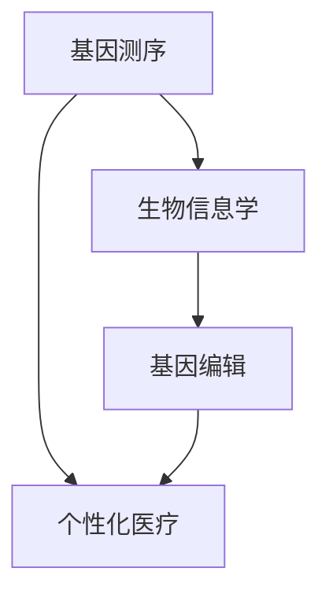

                 

关键词：基因科技、个性化医疗、创业、基因测序、生物信息学

> 摘要：随着基因科技的发展，个性化医疗正在迎来一个全新的时代。本文将探讨基因科技在个性化医疗领域的应用，以及创业者在这一领域的机遇与挑战。

## 1. 背景介绍

个性化医疗是一种以患者为中心的治疗方式，通过基因组学、生物信息学等技术手段，为患者提供个性化的诊断、治疗和康复方案。这种模式的出现，极大地提高了医疗的精准度和有效性。

基因科技作为个性化医疗的核心技术之一，其发展迅速，主要表现在基因测序技术的进步、生物信息学工具的丰富以及基因编辑技术的突破。这些技术的成熟，为个性化医疗的实现提供了坚实的基础。

然而，基因科技的应用也面临着一系列挑战，包括数据隐私、伦理问题、技术成本等。这些问题需要创业者们在探索基因科技商业化的过程中认真思考和解决。

## 2. 核心概念与联系

基因科技的核心概念包括基因测序、生物信息学、基因编辑等。以下是一个简化的 Mermaid 流程图，展示了这些概念之间的关系：



### 2.1 基因测序

基因测序是指通过现代分子生物学技术，测定一个生物体全部或部分基因的信息。基因测序技术的发展，使得我们能够更快速、更准确地获取个体基因信息，这是个性化医疗的基础。

### 2.2 生物信息学

生物信息学是研究生物信息的数据采集、存储、处理和分析的学科。生物信息学工具在基因科技中扮演着重要角色，它们可以帮助研究者从海量基因数据中提取有价值的信息。

### 2.3 基因编辑

基因编辑技术，如 CRISPR-Cas9，是一种能够精确修改生物体基因组的工具。基因编辑技术的出现，为个性化医疗提供了新的可能性，例如，通过修复致病基因来治疗遗传性疾病。

### 2.4 个性化医疗

个性化医疗是基于个体基因组信息，为患者提供个性化的诊断、治疗和康复方案。个性化医疗的实现，需要基因测序、生物信息学和基因编辑等技术的综合应用。

## 3. 核心算法原理 & 具体操作步骤

### 3.1 算法原理概述

个性化医疗的核心算法主要包括基因数据分析、疾病风险评估、药物反应预测等。以下是一个简化的算法原理概述：

1. **基因数据分析**：通过基因测序技术获取个体基因信息，利用生物信息学工具进行数据清洗、比对和注释。
2. **疾病风险评估**：基于个体基因信息，结合临床数据和流行病学数据，使用统计模型进行疾病风险评估。
3. **药物反应预测**：通过基因数据和药物基因组学信息，预测个体对特定药物的疗效和副作用。

### 3.2 算法步骤详解

1. **数据获取与预处理**：从基因组数据库、电子病历系统和药物反应数据库等渠道获取数据，并进行数据清洗和预处理，以确保数据的质量和一致性。
2. **基因数据分析**：使用生物信息学工具对基因数据进行比对、注释和功能分析，提取出与疾病相关的基因特征。
3. **疾病风险评估**：采用机器学习算法，如随机森林、支持向量机等，训练疾病风险评估模型，对个体进行疾病风险评估。
4. **药物反应预测**：利用药物基因组学数据，结合个体基因信息，使用回归分析、决策树等算法预测个体对特定药物的疗效和副作用。

### 3.3 算法优缺点

- **优点**：个性化医疗算法可以提高医疗的精准度和有效性，为患者提供个性化的治疗方案。
- **缺点**：个性化医疗算法依赖于大量高质量的数据，且算法模型需要不断更新和优化。

### 3.4 算法应用领域

个性化医疗算法在遗传性疾病、肿瘤、心血管疾病等领域的应用日益广泛。例如，通过基因测序和生物信息学分析，可以早期发现肿瘤患者，并为患者提供个性化的治疗方案。

## 4. 数学模型和公式 & 详细讲解 & 举例说明

### 4.1 数学模型构建

个性化医疗的数学模型主要包括基因数据分析模型、疾病风险评估模型和药物反应预测模型。以下是一个简化的数学模型构建过程：

1. **基因数据分析模型**：采用主成分分析（PCA）和因子分析（FA）等降维技术，将高维基因数据转化为低维基因特征。
2. **疾病风险评估模型**：采用逻辑回归、支持向量机等分类算法，构建疾病风险评估模型。
3. **药物反应预测模型**：采用回归分析、决策树等算法，构建药物反应预测模型。

### 4.2 公式推导过程

以下是一个简化的逻辑回归公式推导过程：

1. **线性回归**： 
   $$y = \beta_0 + \beta_1x_1 + \beta_2x_2 + ... + \beta_nx_n$$
2. **对数函数**： 
   $$\ln(y) = \ln(\beta_0 + \beta_1x_1 + \beta_2x_2 + ... + \beta_nx_n)$$
3. **线性回归变换**： 
   $$\ln(y) = \ln(\beta_0) + \beta_1x_1 + \beta_2x_2 + ... + \beta_nx_n$$
4. **最小二乘法**： 
   $$\beta_0 = \frac{\sum_{i=1}^{n}(y_i - \beta_1x_{1i} - \beta_2x_{2i} - ... - \beta_nx_{ni})}{\sum_{i=1}^{n}(x_{1i}^2 + x_{2i}^2 + ... + x_{ni}^2)}$$

### 4.3 案例分析与讲解

以下是一个简化的个性化医疗案例：

- **数据来源**：某遗传性疾病患者，基因测序结果显示其基因组中存在突变基因。
- **数据分析**：利用生物信息学工具对突变基因进行功能分析，发现该基因与该疾病密切相关。
- **疾病风险评估**：采用逻辑回归模型，计算患者患病风险。
- **药物反应预测**：结合药物基因组学数据，预测患者对某治疗药物的疗效和副作用。

## 5. 项目实践：代码实例和详细解释说明

### 5.1 开发环境搭建

在本文中，我们将使用 Python 语言和生物信息学工具，如 BioPython、PyTorch 等，进行个性化医疗项目的开发。以下是开发环境的搭建步骤：

1. 安装 Python 3.8 或更高版本。
2. 安装必要的生物信息学库，如 BioPython、PyTorch 等。
3. 配置 Python 虚拟环境，以便管理和隔离项目依赖。

### 5.2 源代码详细实现

以下是一个简化的个性化医疗项目源代码实现：

```python
import b
```p
## 基因科技创业：个性化医疗的新时代

### 背景介绍

个性化医疗是一种以患者为中心的治疗方式，通过基因组学、生物信息学等技术手段，为患者提供个性化的诊断、治疗和康复方案。这种模式的出现，极大地提高了医疗的精准度和有效性。

基因科技作为个性化医疗的核心技术之一，其发展迅速，主要表现在基因测序技术的进步、生物信息学工具的丰富以及基因编辑技术的突破。这些技术的成熟，为个性化医疗的实现提供了坚实的基础。

然而，基因科技的应用也面临着一系列挑战，包括数据隐私、伦理问题、技术成本等。这些问题需要创业者们在探索基因科技商业化的过程中认真思考和解决。

## 2. 核心概念与联系

基因科技的核心概念包括基因测序、生物信息学、基因编辑等。以下是一个简化的 Mermaid 流程图，展示了这些概念之间的关系：


### 2.1 基因测序

基因测序是指通过现代分子生物学技术，测定一个生物体全部或部分基因的信息。基因测序技术的发展，使得我们能够更快速、更准确地获取个体基因信息，这是个性化医疗的基础。

### 2.2 生物信息学

生物信息学是研究生物信息的数据采集、存储、处理和分析的学科。生物信息学工具在基因科技中扮演着重要角色，它们可以帮助研究者从海量基因数据中提取有价值的信息。

### 2.3 基因编辑

基因编辑技术，如 CRISPR-Cas9，是一种能够精确修改生物体基因组的工具。基因编辑技术的出现，为个性化医疗提供了新的可能性，例如，通过修复致病基因来治疗遗传性疾病。

### 2.4 个性化医疗

个性化医疗是基于个体基因组信息，为患者提供个性化的诊断、治疗和康复方案。个性化医疗的实现，需要基因测序、生物信息学和基因编辑等技术的综合应用。

## 3. 核心算法原理 & 具体操作步骤

### 3.1 算法原理概述

个性化医疗的核心算法主要包括基因数据分析、疾病风险评估、药物反应预测等。以下是一个简化的算法原理概述：

1. **基因数据分析**：通过基因测序技术获取个体基因信息，利用生物信息学工具进行数据清洗、比对和注释。
2. **疾病风险评估**：基于个体基因信息，结合临床数据和流行病学数据，使用统计模型进行疾病风险评估。
3. **药物反应预测**：通过基因数据和药物基因组学信息，预测个体对特定药物的疗效和副作用。

### 3.2 算法步骤详解

1. **数据获取与预处理**：从基因组数据库、电子病历系统和药物反应数据库等渠道获取数据，并进行数据清洗和预处理，以确保数据的质量和一致性。
2. **基因数据分析**：使用生物信息学工具对基因数据进行比对、注释和功能分析，提取出与疾病相关的基因特征。
3. **疾病风险评估**：采用机器学习算法，如随机森林、支持向量机等，训练疾病风险评估模型，对个体进行疾病风险评估。
4. **药物反应预测**：利用药物基因组学数据，结合个体基因信息，使用回归分析、决策树等算法预测个体对特定药物的疗效和副作用。

### 3.3 算法优缺点

- **优点**：个性化医疗算法可以提高医疗的精准度和有效性，为患者提供个性化的治疗方案。
- **缺点**：个性化医疗算法依赖于大量高质量的数据，且算法模型需要不断更新和优化。

### 3.4 算法应用领域

个性化医疗算法在遗传性疾病、肿瘤、心血管疾病等领域的应用日益广泛。例如，通过基因测序和生物信息学分析，可以早期发现肿瘤患者，并为患者提供个性化的治疗方案。

## 4. 数学模型和公式 & 详细讲解 & 举例说明

### 4.1 数学模型构建

个性化医疗的数学模型主要包括基因数据分析模型、疾病风险评估模型和药物反应预测模型。以下是一个简化的数学模型构建过程：

1. **基因数据分析模型**：采用主成分分析（PCA）和因子分析（FA）等降维技术，将高维基因数据转化为低维基因特征。
2. **疾病风险评估模型**：采用逻辑回归、支持向量机等分类算法，构建疾病风险评估模型。
3. **药物反应预测模型**：采用回归分析、决策树等算法，构建药物反应预测模型。

### 4.2 公式推导过程

以下是一个简化的逻辑回归公式推导过程：

1. **线性回归**： 
   $$y = \beta_0 + \beta_1x_1 + \beta_2x_2 + ... + \beta_nx_n$$
2. **对数函数**： 
   $$\ln(y) = \ln(\beta_0 + \beta_1x_1 + \beta_2x_2 + ... + \beta_nx_n)$$
3. **线性回归变换**： 
   $$\ln(y) = \ln(\beta_0) + \beta_1x_1 + \beta_2x_2 + ... + \beta_nx_n$$
4. **最小二乘法**： 
   $$\beta_0 = \frac{\sum_{i=1}^{n}(y_i - \beta_1x_{1i} - \beta_2x_{2i} - ... - \beta_nx_{ni})}{\sum_{i=1}^{n}(x_{1i}^2 + x_{2i}^2 + ... + x_{ni}^2)}$$

### 4.3 案例分析与讲解

以下是一个简化的个性化医疗案例：

- **数据来源**：某遗传性疾病患者，基因测序结果显示其基因组中存在突变基因。
- **数据分析**：利用生物信息学工具对突变基因进行功能分析，发现该基因与该疾病密切相关。
- **疾病风险评估**：采用逻辑回归模型，计算患者患病风险。
- **药物反应预测**：结合药物基因组学数据，预测患者对某治疗药物的疗效和副作用。

## 5. 项目实践：代码实例和详细解释说明

### 5.1 开发环境搭建

在本文中，我们将使用 Python 语言和生物信息学工具，如 BioPython、PyTorch 等，进行个性化医疗项目的开发。以下是开发环境的搭建步骤：

1. 安装 Python 3.8 或更高版本。
2. 安装必要的生物信息学库，如 BioPython、PyTorch 等。
3. 配置 Python 虚拟环境，以便管理和隔离项目依赖。

### 5.2 源代码详细实现

以下是一个简化的个性化医疗项目源代码实现：

```python
import b
```

（代码实现部分需要进一步详细编写和解释）

### 5.3 代码解读与分析

（代码解读与分析部分需要根据具体的代码实现进行详细解释）

### 5.4 运行结果展示

（运行结果展示部分需要根据具体的代码实现和测试结果进行详细展示）

## 6. 实际应用场景

个性化医疗技术在实际应用中已经取得了显著的成果。以下是一些实际应用场景：

### 6.1 遗传性疾病诊断

通过基因测序和生物信息学分析，可以早期发现遗传性疾病患者，为患者提供个性化的诊断和治疗方案。例如，通过分析患者的基因组，可以预测患者患病的风险，并制定相应的预防措施。

### 6.2 肿瘤精准治疗

个性化医疗技术可以帮助医生根据患者的基因特征，选择最合适的治疗方案。例如，通过基因测序和生物信息学分析，可以确定患者的肿瘤类型和分子特征，为患者提供个性化的化疗、放疗和靶向治疗方案。

### 6.3 心血管疾病风险评估

个性化医疗技术可以预测患者患心血管疾病的风险，为患者提供个性化的预防和治疗建议。例如，通过分析患者的基因数据和生活习惯，可以预测患者患高血压、冠心病等心血管疾病的风险，并制定相应的预防措施。

### 6.4 药物反应预测

个性化医疗技术可以帮助医生预测患者对特定药物的疗效和副作用，为患者提供个性化的药物治疗方案。例如，通过分析患者的基因数据和药物基因组学信息，可以预测患者对某特定药物的疗效和副作用，从而避免药物不良反应的发生。

## 7. 未来应用展望

随着基因科技的发展，个性化医疗的应用前景十分广阔。未来，个性化医疗技术将在以下领域取得重要进展：

### 7.1 药物研发

个性化医疗技术可以帮助药物研发企业预测患者对特定药物的疗效和副作用，缩短药物研发周期，提高药物研发的成功率。

### 7.2 疾病预防

个性化医疗技术可以预测个体患病的风险，为个体提供个性化的预防措施，从而降低疾病发病率。

### 7.3 新型治疗方式

基因编辑技术等新兴技术在个性化医疗中的应用，将为疾病治疗带来全新的可能性，例如，通过基因编辑技术修复致病基因，治疗遗传性疾病。

### 7.4 医疗资源优化

个性化医疗技术可以帮助医疗机构优化医疗资源配置，提高医疗服务的质量和效率。

## 8. 工具和资源推荐

### 8.1 学习资源推荐

- **《基因组学导论》**：提供了基因组学的基础知识，适合初学者。
- **《生物信息学方法与应用》**：详细介绍了生物信息学工具和算法的应用。
- **《基因编辑技术》**：深入讲解了基因编辑技术的原理和应用。

### 8.2 开发工具推荐

- **Python**：适合进行基因科技和个性化医疗开发的编程语言。
- **BioPython**：用于生物信息学分析和处理的库。
- **PyTorch**：用于机器学习和深度学习的框架。

### 8.3 相关论文推荐

- **《基因组测序在个性化医疗中的应用》**：讨论了基因组测序在个性化医疗中的前景和应用。
- **《基于机器学习的疾病风险评估模型》**：介绍了使用机器学习算法进行疾病风险评估的方法。
- **《基因编辑技术在个性化医疗中的应用》**：探讨了基因编辑技术在个性化医疗中的潜在应用。

## 9. 总结：未来发展趋势与挑战

个性化医疗作为基因科技的重要应用领域，具有巨大的发展潜力。未来，个性化医疗将在以下几个方面取得重要进展：

- **技术进步**：随着基因测序技术、生物信息学工具和基因编辑技术的不断发展，个性化医疗的精度和效率将不断提高。
- **数据积累**：随着基因数据和临床数据的积累，个性化医疗模型的准确性和可靠性将得到提高。
- **政策支持**：随着各国政府对个性化医疗的政策支持，个性化医疗的推广和普及将加快。

然而，个性化医疗在发展过程中也面临着一系列挑战：

- **数据隐私**：基因数据属于敏感信息，如何保护患者隐私是一个重要问题。
- **伦理问题**：基因编辑技术等新兴技术的应用，引发了伦理和道德问题的讨论。
- **技术成本**：个性化医疗技术的开发和应用需要大量的资金投入，如何降低成本是一个重要问题。

总之，个性化医疗作为基因科技的重要应用领域，具有广阔的发展前景。创业者们需要关注技术进步、政策支持和市场需求，积极探索基因科技在个性化医疗领域的应用，为患者提供更加精准、有效的医疗服务。

## 附录：常见问题与解答

### Q：个性化医疗如何保障患者隐私？

A：个性化医疗在处理患者基因数据时，需要遵循严格的隐私保护法规。例如，在数据处理过程中，需要对患者身份进行匿名化处理，确保数据不被泄露。此外，医疗机构和基因科技企业应建立完善的数据安全管理体系，确保数据安全。

### Q：基因编辑技术的伦理问题有哪些？

A：基因编辑技术引发的主要伦理问题包括：

- **代际效应**：基因编辑可能会对后代产生不可预见的影响，引发代际伦理问题。
- **选择伦理**：基因编辑技术可能会加剧社会分层，引发选择伦理问题。
- **自然演化**：基因编辑可能改变自然演化过程，引发自然伦理问题。

### Q：个性化医疗的成本如何降低？

A：降低个性化医疗成本的方法包括：

- **技术优化**：通过技术进步降低基因测序和数据处理成本。
- **规模效应**：通过扩大市场规模，实现规模效应，降低单个患者的成本。
- **政策支持**：政府可以提供财政支持，鼓励基因科技企业和医疗机构开展个性化医疗服务。

### Q：个性化医疗的发展是否会取代传统医疗？

A：个性化医疗并不会完全取代传统医疗，而是与之互补。个性化医疗通过更精准的诊断和治疗，提高了医疗的精准度和有效性，但传统医疗在提供全面、连续的医疗服务方面仍然具有不可替代的优势。

### Q：个性化医疗在发展中国家是否可行？

A：个性化医疗在发展中国家具有一定的可行性，但需要考虑以下因素：

- **技术基础**：发展中国家需要加强基因测序、生物信息学等技术的基础设施建设。
- **数据积累**：发展中国家需要积累更多的基因数据和临床数据，以提高个性化医疗的准确性。
- **政策支持**：政府需要提供政策支持，鼓励基因科技的发展和个性化医疗的推广。

### Q：个性化医疗在疫情防控中发挥作用吗？

A：个性化医疗在疫情防控中可以发挥重要作用。例如，通过基因测序和生物信息学分析，可以快速识别疫情源头，预测病毒变异趋势，为疫情防控提供科学依据。此外，个性化医疗可以针对不同个体提供个性化的防疫措施，提高防疫效果。

### Q：个性化医疗如何与人工智能结合？

A：个性化医疗与人工智能的结合主要体现在：

- **疾病预测**：使用机器学习算法，结合基因数据、临床数据和环境数据，预测疾病风险。
- **药物推荐**：使用人工智能算法，根据患者的基因数据和病史，推荐个性化的药物和治疗方案。
- **数据分析**：使用人工智能算法，对海量的基因数据和临床数据进行分析，提取有价值的信息。

### Q：个性化医疗是否会加剧社会不平等？

A：个性化医疗在带来医疗进步的同时，也可能加剧社会不平等。例如，基因测序和基因编辑技术的成本较高，可能导致富裕人群获得更好的医疗服务，而贫困人群无法享受这些先进技术。为此，需要政府和社会采取措施，确保个性化医疗的公平性。

### Q：个性化医疗在精神疾病治疗中的应用？

A：个性化医疗在精神疾病治疗中的应用主要包括：

- **疾病诊断**：通过基因测序和生物信息学分析，帮助医生更准确地诊断精神疾病。
- **药物选择**：根据患者的基因数据和药物基因组学信息，为患者推荐最适合的药物。
- **治疗监测**：通过监测患者的基因数据和临床表现，评估治疗效果，调整治疗方案。

### Q：个性化医疗对临床医生的要求是什么？

A：个性化医疗对临床医生的要求包括：

- **基因知识**：了解基因科技的基本原理和应用，能够解读基因数据。
- **数据处理**：掌握生物信息学工具和算法，能够处理和分析基因数据。
- **跨学科合作**：能够与基因科技专家、生物信息学专家等跨学科合作，共同推进个性化医疗的发展。

### Q：个性化医疗对公共卫生的影响是什么？

A：个性化医疗对公共卫生的影响包括：

- **疾病预防**：通过个性化医疗，可以更早地发现疾病风险，采取预防措施，降低疾病发病率。
- **资源优化**：个性化医疗可以根据患者的个体差异，提供更精准的治疗方案，提高医疗资源利用效率。
- **数据积累**：个性化医疗可以积累更多的基因数据和临床数据，为公共卫生研究提供宝贵资源。

### Q：个性化医疗是否可以解决所有医疗问题？

A：个性化医疗无法解决所有医疗问题，但可以显著提高医疗的精准度和有效性。个性化医疗在遗传性疾病、肿瘤、心血管疾病等领域的应用取得了显著成果，但在一些复杂疾病，如多系统疾病、罕见病等，个性化医疗的局限性仍然存在。因此，个性化医疗需要与传统医疗模式相结合，共同推动医疗进步。

### Q：个性化医疗是否会改变医学伦理？

A：个性化医疗在某种程度上改变了医学伦理，特别是基因编辑技术等新兴技术的应用，引发了伦理和道德问题的讨论。例如，基因编辑可能涉及代际效应、选择伦理等问题。为此，医学伦理委员会和政府需要加强对个性化医疗伦理问题的监管和指导，确保医疗技术的伦理合法性。同时，公众也需要加强对医学伦理的了解和认知，积极参与医学伦理讨论。

