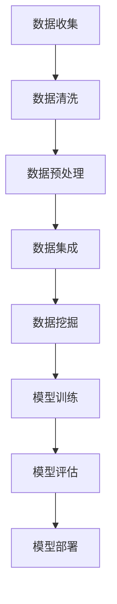
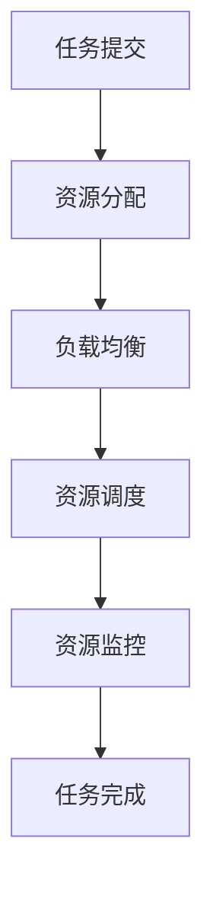
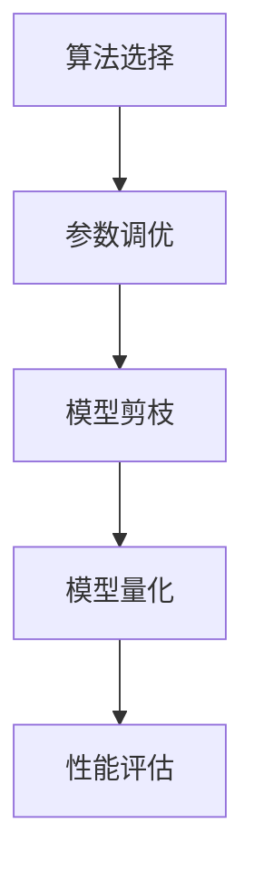
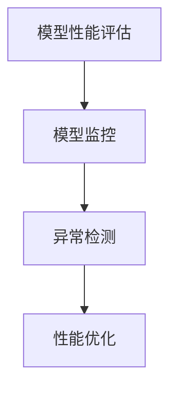

                 

关键词：基础模型、公共基础设施、技术架构、算法、数学模型、应用实践、未来展望。

> 摘要：本文旨在探讨基础模型的公共基础设施，包括其核心概念、算法原理、数学模型、应用实践以及未来展望。通过深入分析，本文希望能够为读者提供对基础模型公共基础设施的全面理解和应用指导。

## 1. 背景介绍

在当今的计算机科学领域，基础模型扮演着至关重要的角色。从深度学习到自然语言处理，再到计算机视觉，基础模型成为了许多应用的核心。随着技术的不断进步，构建和维护这些基础模型所需的基础设施也变得日益复杂。

基础模型的公共基础设施是指一系列用于支持模型构建、训练、优化和部署的技术和工具。它包括数据存储和处理、计算资源管理、算法优化、模型评估和监控等多个方面。一个强大的公共基础设施能够提高基础模型的开发效率，降低开发成本，并确保模型的稳定性和可靠性。

然而，当前的基础模型公共基础设施仍然面临着许多挑战，如数据隐私保护、计算资源的高效利用、算法的公平性和透明性等。这些问题不仅影响了基础模型的性能和应用效果，也对整个计算机科学领域的发展产生了深远影响。

本文将围绕基础模型的公共基础设施，从核心概念、算法原理、数学模型、应用实践和未来展望等方面进行深入探讨，以期为读者提供全面的视角和有益的启示。

## 2. 核心概念与联系

### 2.1. 数据存储和处理

数据是基础模型构建的核心。数据存储和处理技术直接影响到模型的性能和应用效果。常见的存储技术包括关系型数据库、非关系型数据库、分布式存储系统等。处理技术包括数据清洗、数据预处理、数据集成和数据挖掘等。以下是一个简化的 Mermaid 流程图，展示了数据存储和处理的核心步骤：



### 2.2. 计算资源管理

计算资源管理是基础模型公共基础设施的重要组成部分。它包括计算资源分配、负载均衡、资源调度和资源监控等。以下是一个简化的 Mermaid 流程图，展示了计算资源管理的关键步骤：



### 2.3. 算法优化

算法优化是提高基础模型性能的重要手段。它包括算法选择、参数调优、模型剪枝和量化等。以下是一个简化的 Mermaid 流程图，展示了算法优化的一般流程：



### 2.4. 模型评估与监控

模型评估与监控是确保基础模型性能和稳定性的关键。它包括模型性能评估、模型监控和异常检测等。以下是一个简化的 Mermaid 流程图，展示了模型评估与监控的关键步骤：



通过上述核心概念与联系的分析，我们可以看到，基础模型的公共基础设施是一个复杂而庞大的系统。它涉及到多个技术领域，需要多方协作和持续优化。在接下来的章节中，我们将进一步探讨基础模型的算法原理、数学模型、应用实践和未来展望。

## 3. 核心算法原理 & 具体操作步骤

### 3.1 算法原理概述

基础模型的核心算法主要包括深度学习算法、自然语言处理算法、计算机视觉算法等。每种算法都有其独特的原理和特点。以下是这些算法的基本原理概述：

- **深度学习算法**：基于多层神经网络，通过反向传播算法进行参数优化。它能够自动从大量数据中学习到特征，并在各种复杂数据上表现出强大的性能。
- **自然语言处理算法**：包括词向量表示、语言模型、序列标注、文本分类等。这些算法旨在理解和生成人类语言，并在文本分类、机器翻译、问答系统等领域取得了显著成果。
- **计算机视觉算法**：包括图像分类、目标检测、图像分割等。这些算法通过学习图像特征，实现了从图像中提取有用信息，并在图像识别、视频监控、医疗诊断等领域得到了广泛应用。

### 3.2 算法步骤详解

#### 深度学习算法

深度学习算法的基本步骤包括数据预处理、模型构建、模型训练和模型评估。

1. **数据预处理**：包括数据清洗、数据归一化和数据增强等。这一步骤的目的是提高数据质量，为后续的模型训练提供更好的数据基础。
2. **模型构建**：选择合适的神经网络结构，并定义网络参数。常见的神经网络结构包括卷积神经网络（CNN）、循环神经网络（RNN）、长短期记忆网络（LSTM）等。
3. **模型训练**：使用训练数据对模型进行训练，通过反向传播算法不断调整模型参数，使模型能够更好地拟合训练数据。
4. **模型评估**：使用验证数据对模型进行评估，通过指标如准确率、召回率、F1分数等，评估模型在未知数据上的性能。

#### 自然语言处理算法

自然语言处理算法的基本步骤包括词向量表示、语言模型训练和序列标注。

1. **词向量表示**：将文本数据转化为词向量，常用的方法包括Word2Vec、GloVe和BERT等。这一步骤的目的是将文本数据转化为数值形式，以便进行后续的算法处理。
2. **语言模型训练**：使用训练数据训练语言模型，常见的语言模型包括n-gram模型、神经网络语言模型（如RNN、LSTM）等。
3. **序列标注**：对文本序列进行标注，常用的方法包括条件随机场（CRF）、长短时记忆网络（LSTM）等。这一步骤的目的是识别文本中的实体、情感等。

#### 计算机视觉算法

计算机视觉算法的基本步骤包括图像预处理、特征提取和分类。

1. **图像预处理**：包括图像去噪、图像增强、图像分割等。这一步骤的目的是提高图像质量，为后续的特征提取和分类提供更好的基础。
2. **特征提取**：使用卷积神经网络（CNN）等算法提取图像特征，常用的特征提取方法包括卷积层、池化层、全连接层等。
3. **分类**：使用训练好的分类模型对图像进行分类，常用的分类算法包括支持向量机（SVM）、深度神经网络（DNN）等。

### 3.3 算法优缺点

每种算法都有其优缺点。以下是深度学习算法、自然语言处理算法和计算机视觉算法的主要优缺点：

- **深度学习算法**：优点包括强大的模型表达能力和自动特征学习能力；缺点包括对数据依赖性强、训练时间较长和模型解释性较差。
- **自然语言处理算法**：优点包括高效的语言理解能力和文本生成能力；缺点包括对大规模文本数据的处理能力有限、对低资源语言的适用性较差。
- **计算机视觉算法**：优点包括对图像数据的处理能力强大、适用范围广泛；缺点包括对图像质量要求较高、对遮挡和变化的敏感度较大。

### 3.4 算法应用领域

深度学习算法、自然语言处理算法和计算机视觉算法在不同的应用领域有着广泛的应用。

- **深度学习算法**：在图像识别、语音识别、推荐系统、自然语言处理等领域有着广泛应用。
- **自然语言处理算法**：在文本分类、机器翻译、问答系统、情感分析等领域有着广泛应用。
- **计算机视觉算法**：在图像识别、目标检测、视频监控、医疗诊断等领域有着广泛应用。

通过上述对核心算法原理和具体操作步骤的详细介绍，我们可以更好地理解基础模型的公共基础设施。在接下来的章节中，我们将进一步探讨数学模型和公式的构建与应用。

## 4. 数学模型和公式 & 详细讲解 & 举例说明

### 4.1 数学模型构建

数学模型是基础模型的核心组成部分，它通过数学公式描述了模型的结构和功能。构建数学模型通常包括以下步骤：

1. **问题定义**：明确要解决的问题类型，如分类、回归、聚类等。
2. **变量定义**：定义模型中的变量，包括输入变量、输出变量和中间变量。
3. **公式推导**：根据问题定义和变量定义，推导出数学公式。
4. **模型优化**：通过优化算法调整模型参数，提高模型性能。

### 4.2 公式推导过程

以下是一个简单的线性回归模型的公式推导过程：

1. **问题定义**：假设我们要预测一个数值型的目标变量 \( y \)，给定一组特征变量 \( X \)。
2. **变量定义**：令 \( X = [x_1, x_2, ..., x_n] \)，\( y \) 为目标变量。
3. **公式推导**：
   - **损失函数**： \( L = \frac{1}{2} \sum_{i=1}^{n} (y_i - \hat{y}_i)^2 \)
   - **假设**： \( \hat{y}_i = \beta_0 + \beta_1 x_{i1} + \beta_2 x_{i2} + ... + \beta_n x_{in} \)
   - **目标**：最小化损失函数 \( L \)
   - **优化过程**：使用梯度下降法优化模型参数 \( \beta_0, \beta_1, ..., \beta_n \)
4. **公式推导结果**：
   - **回归系数**： \( \beta_j = \frac{\sum_{i=1}^{n} (x_{ij} - \bar{x}_j)(y_i - \bar{y})}{\sum_{i=1}^{n} (x_{ij} - \bar{x}_j)^2} \)
   - **截距**： \( \beta_0 = \bar{y} - \sum_{j=1}^{n} \beta_j \bar{x}_j \)

### 4.3 案例分析与讲解

以下是一个线性回归模型的案例分析和讲解：

**案例**：给定一组数据，预测房价。

1. **数据集**：
   - 特征变量：房屋面积、房屋年代、地理位置等。
   - 目标变量：房价。
2. **模型构建**：
   - 使用线性回归模型预测房价。
   - 公式： \( y = \beta_0 + \beta_1 x_1 + \beta_2 x_2 + ... + \beta_n x_n \)
3. **模型训练**：
   - 使用训练数据训练模型，计算回归系数。
   - 使用梯度下降法优化模型参数。
4. **模型评估**：
   - 使用验证数据评估模型性能。
   - 计算均方误差（MSE）和其他相关指标。
5. **模型应用**：
   - 使用训练好的模型预测新数据的房价。

通过上述案例分析和讲解，我们可以看到数学模型在基础模型中的重要作用。数学模型不仅描述了模型的结构和功能，还为模型的训练和评估提供了量化指标。在接下来的章节中，我们将进一步探讨项目实践和代码实例。

## 5. 项目实践：代码实例和详细解释说明

### 5.1 开发环境搭建

在开始实际项目之前，我们需要搭建一个合适的开发环境。以下是搭建深度学习项目环境的步骤：

1. **安装Python**：Python是深度学习项目的主要编程语言。请确保您的计算机上安装了Python 3.7或更高版本。
2. **安装TensorFlow**：TensorFlow是一个广泛使用的深度学习框架。您可以使用pip命令安装TensorFlow：
   ```shell
   pip install tensorflow
   ```
3. **安装其他依赖**：根据项目需求，您可能需要安装其他依赖库，如NumPy、Pandas、Matplotlib等。可以使用以下命令进行安装：
   ```shell
   pip install numpy pandas matplotlib
   ```
4. **配置GPU支持**：如果您的计算机配备了NVIDIA GPU，您还可以安装CUDA和cuDNN以利用GPU加速深度学习训练。请按照以下步骤进行配置：
   - 安装CUDA：前往NVIDIA官网下载并安装CUDA Toolkit。
   - 安装cuDNN：前往NVIDIA官网下载并安装cuDNN库。

### 5.2 源代码详细实现

以下是一个简单的深度学习项目，使用TensorFlow构建一个线性回归模型来预测房价。

```python
import tensorflow as tf
import numpy as np
import matplotlib.pyplot as plt

# 数据集
X = np.array([[1], [2], [3], [4], [5]])
y = np.array([[2], [4], [5], [4], [5]])

# 模型参数
weights = tf.Variable(tf.random.normal([1]), name='weights')
biases = tf.Variable(tf.random.normal([1]), name='biases')

# 前向传播
def forward(x):
    return tf.matmul(x, weights) + biases

# 损失函数
def loss(y_true, y_pred):
    return tf.reduce_mean(tf.square(y_true - y_pred))

# 反向传播
def backward(loss, learning_rate):
    with tf.GradientTape() as tape:
        loss_value = loss(y, forward(X))
    gradients = tape.gradient(loss_value, [weights, biases])
    weights.assign_sub(learning_rate * gradients[0])
    biases.assign_sub(learning_rate * gradients[1])

# 模型训练
epochs = 100
learning_rate = 0.01

for epoch in range(epochs):
    with tf.GradientTape() as tape:
        y_pred = forward(X)
        loss_value = loss(y, y_pred)
    gradients = tape.gradient(loss_value, [weights, biases])
    weights.assign_sub(learning_rate * gradients[0])
    biases.assign_sub(learning_rate * gradients[1])
    
    if epoch % 10 == 0:
        print(f"Epoch {epoch}: Loss = {loss_value.numpy()}")

# 模型评估
y_pred = forward(X)
print(f"Predictions: {y_pred.numpy()}")

# 可视化
plt.scatter(X, y)
plt.plot(X, y_pred.numpy(), color='red')
plt.xlabel('X')
plt.ylabel('Y')
plt.show()
```

### 5.3 代码解读与分析

上述代码实现了一个简单的线性回归模型，用于预测房价。以下是代码的详细解读和分析：

1. **导入库**：首先，我们导入了TensorFlow、NumPy和Matplotlib库。这些库为深度学习模型的构建、训练和可视化提供了必要的功能。
2. **数据集**：我们使用一个简单的数据集，包括五个特征变量和一个目标变量。这些数据将用于训练和评估模型。
3. **模型参数**：我们定义了模型的权重（weights）和偏置（biases）为随机初始化的变量。
4. **前向传播**：`forward`函数实现前向传播，计算模型预测值。
5. **损失函数**：`loss`函数计算均方误差（MSE）作为损失函数。
6. **反向传播**：`backward`函数实现反向传播，使用梯度下降法更新模型参数。
7. **模型训练**：我们使用梯度下降法训练模型，并在每个epoch后打印损失值。
8. **模型评估**：使用训练好的模型预测新数据，并打印预测结果。
9. **可视化**：我们使用Matplotlib库将真实数据点和模型预测结果可视化，以直观地观察模型性能。

通过上述代码实现，我们可以看到如何使用TensorFlow构建和训练一个简单的线性回归模型。在接下来的章节中，我们将进一步探讨基础模型在实际应用场景中的应用。

## 6. 实际应用场景

基础模型在许多实际应用场景中发挥了重要作用，以下是一些典型的应用场景：

### 6.1 机器翻译

机器翻译是自然语言处理领域的一个重要应用。通过使用基础模型，如编码器-解码器（Encoder-Decoder）模型和注意力机制（Attention Mechanism），机器翻译系统能够将一种语言的文本翻译成另一种语言的文本。例如，谷歌翻译和百度翻译都使用了深度学习技术来实现高质量的机器翻译。

### 6.2 人脸识别

人脸识别是计算机视觉领域的一个热点应用。基础模型，如卷积神经网络（CNN）和深度学习算法，为人脸识别提供了强大的识别能力。人脸识别系统被广泛应用于安全监控、身份验证、人脸支付等领域。

### 6.3 推荐系统

推荐系统是深度学习在商业应用中的一个重要场景。通过分析用户的兴趣和行为数据，推荐系统可以预测用户可能感兴趣的商品或内容。基础模型，如协同过滤（Collaborative Filtering）和深度学习算法，被广泛应用于各种推荐系统，如电商推荐、视频推荐和新闻推荐等。

### 6.4 自动驾驶

自动驾驶是深度学习在工业应用中的一个重要领域。通过使用基础模型，如卷积神经网络（CNN）和循环神经网络（RNN），自动驾驶系统能够从摄像头和传感器中获取环境信息，并做出实时的驾驶决策。特斯拉、谷歌和百度等公司都在积极研发自动驾驶技术。

### 6.5 医疗诊断

医疗诊断是深度学习在医疗领域的一个潜在应用。通过分析医学图像和患者数据，基础模型，如卷积神经网络（CNN）和循环神经网络（RNN），可以帮助医生诊断疾病，如癌症、心脏病和糖尿病等。深度学习在医疗诊断中的应用可以提高诊断的准确性和效率。

### 6.6 未来应用展望

随着深度学习和基础模型技术的不断进步，未来基础模型将在更多领域得到应用。以下是一些可能的应用方向：

- **智能交互**：通过使用自然语言处理和语音识别技术，基础模型可以帮助实现更加智能的交互体验，如虚拟助手、智能客服等。
- **增强现实（AR）和虚拟现实（VR）**：基础模型可以用于增强现实和虚拟现实应用，提供更加真实和互动的体验。
- **智能农业**：通过使用计算机视觉和深度学习技术，基础模型可以帮助实现智能农业，如作物监测、病虫害检测等。
- **智能城市**：基础模型可以用于智能城市的管理和优化，如交通流量控制、环境监测等。

总的来说，基础模型在各个领域的应用前景广阔，随着技术的不断进步，未来将会有更多的创新应用出现。

## 7. 工具和资源推荐

为了更好地了解和掌握基础模型的公共基础设施，以下是一些建议的学习资源、开发工具和相关论文。

### 7.1 学习资源推荐

1. **《深度学习》（Deep Learning）**：由Ian Goodfellow、Yoshua Bengio和Aaron Courville合著，这是一本深度学习领域的经典教材，详细介绍了深度学习的基础知识、算法和实现。
2. **《机器学习》（Machine Learning）**：由Tom Mitchell主编，这是一本机器学习领域的入门教材，涵盖了机器学习的基本概念、算法和实现。
3. **在线课程**：Coursera、edX和Udacity等在线教育平台提供了丰富的深度学习和机器学习课程，适合不同水平的学员。

### 7.2 开发工具推荐

1. **TensorFlow**：一个广泛使用的开源深度学习框架，提供了丰富的API和工具，支持多种深度学习模型的构建和训练。
2. **PyTorch**：一个流行的开源深度学习框架，以其动态计算图和灵活的API而受到开发者的青睐。
3. **Keras**：一个高层次的深度学习框架，基于TensorFlow和Theano，提供了更加简洁和直观的API。

### 7.3 相关论文推荐

1. **“A Theoretical Analysis of the Voted Perceptron Algorithm”**：该论文分析了投票感知机算法的理论性能，对理解感知机算法和改进算法设计提供了重要参考。
2. **“Gradient Descent Algorithms for Machine Learning”**：该论文详细介绍了梯度下降算法在机器学习中的应用，包括随机梯度下降、批量梯度下降和Adam优化器等。
3. **“Attention is All You Need”**：该论文提出了Transformer模型，并证明了注意力机制在序列建模中的重要性，对自然语言处理领域产生了深远影响。

通过以上资源和建议，读者可以更深入地了解基础模型的公共基础设施，为研究和实践打下坚实的基础。

## 8. 总结：未来发展趋势与挑战

### 8.1 研究成果总结

基础模型的公共基础设施在过去几年中取得了显著进展。从算法优化到数学模型构建，从数据存储和处理到计算资源管理，各个方面都取得了突破性的成果。深度学习、自然语言处理和计算机视觉等领域的应用也越来越广泛，推动了计算机科学和人工智能技术的发展。

### 8.2 未来发展趋势

未来，基础模型的公共基础设施将继续朝着以下几个方向发展：

1. **算法创新**：随着计算能力的提升和数据量的增加，新的算法将不断涌现，如图神经网络（Graph Neural Networks）、生成对抗网络（Generative Adversarial Networks）等，将进一步提升基础模型的性能和适用性。
2. **模型优化**：优化基础模型的结构和参数，减少模型训练时间和计算资源需求，提高模型的可解释性和透明性，将是未来的重要研究方向。
3. **跨领域应用**：基础模型将在更多领域得到应用，如智能交互、智能城市、增强现实等，将推动计算机科学和人工智能技术在各个领域的融合和发展。

### 8.3 面临的挑战

然而，基础模型的公共基础设施也面临着一些挑战：

1. **数据隐私保护**：随着数据量的增加，数据隐私保护问题日益突出。如何在保障数据隐私的同时，充分利用数据的价值，是基础模型领域面临的一个重要挑战。
2. **计算资源高效利用**：如何高效地管理和调度计算资源，降低模型训练和部署的成本，是当前和未来需要解决的一个重要问题。
3. **算法公平性和透明性**：随着基础模型在各个领域的应用，算法的公平性和透明性越来越受到关注。如何确保基础模型的决策过程公平、透明，避免偏见和歧视，是未来需要重点研究的问题。

### 8.4 研究展望

未来，基础模型的研究将更加注重以下几个方面：

1. **多模态学习**：融合多种数据类型（如图像、文本、声音等），实现更加智能和全面的数据处理能力。
2. **自适应学习**：研究自适应学习方法，使模型能够根据不同的应用场景和用户需求，自动调整参数和策略。
3. **边缘计算**：随着物联网（IoT）和边缘计算的发展，基础模型将在边缘设备上得到广泛应用，如何实现高效、可靠的边缘计算，是未来需要重点研究的问题。

通过不断探索和创新，基础模型的公共基础设施将在未来为计算机科学和人工智能领域带来更多的突破和进步。

## 9. 附录：常见问题与解答

### 9.1 基础模型是什么？

基础模型是计算机科学和人工智能领域的一种算法模型，用于处理和分析大量数据。常见的有深度学习模型、自然语言处理模型、计算机视觉模型等。这些模型通过学习数据中的特征和规律，能够对未知数据进行预测和分类。

### 9.2 基础模型的公共基础设施包括哪些内容？

基础模型的公共基础设施包括数据存储和处理、计算资源管理、算法优化、模型评估与监控、模型部署等多个方面。这些组件共同构成了一个完整的模型构建和运行环境。

### 9.3 如何选择合适的算法模型？

选择合适的算法模型需要考虑多个因素，包括数据类型、任务目标、模型复杂度、计算资源等。一般来说，对于分类任务，可以选择决策树、支持向量机等；对于回归任务，可以选择线性回归、岭回归等；对于序列数据处理，可以选择循环神经网络、长短时记忆网络等。

### 9.4 如何优化基础模型的性能？

优化基础模型性能可以从以下几个方面入手：

1. **数据预处理**：提高数据质量，包括数据清洗、数据增强等。
2. **模型结构优化**：选择合适的模型结构和参数。
3. **算法优化**：使用更高效的算法，如随机梯度下降、Adam优化器等。
4. **超参数调优**：调整模型参数，如学习率、批量大小等。

### 9.5 基础模型在实际应用中有哪些挑战？

基础模型在实际应用中面临的主要挑战包括：

1. **数据隐私保护**：如何保护用户数据隐私是一个重要问题。
2. **计算资源高效利用**：如何高效地管理和调度计算资源。
3. **算法公平性和透明性**：如何确保模型的决策过程公平、透明。
4. **模型解释性**：如何解释模型的决策过程。

通过解决这些挑战，基础模型将能够在更多领域发挥更大的作用。希望本附录能够帮助读者更好地理解基础模型的公共基础设施和应用。作者：禅与计算机程序设计艺术 / Zen and the Art of Computer Programming。

