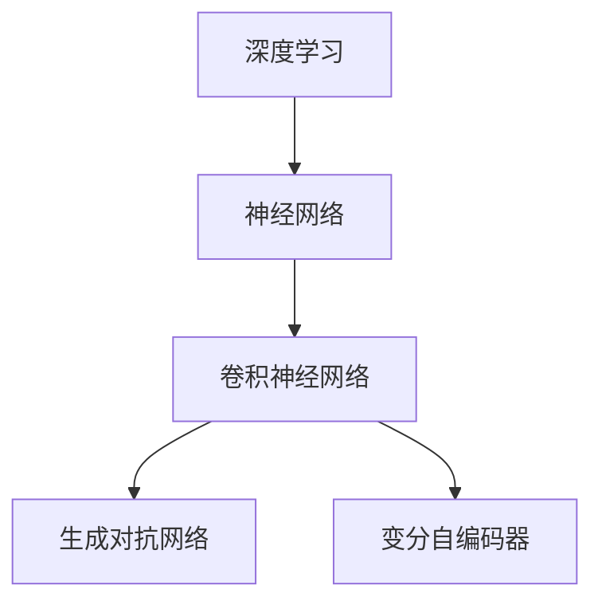

                 

  
## 1. 背景介绍

基础模型（Foundational Model）在当前人工智能领域扮演着至关重要的角色。随着深度学习、自然语言处理、计算机视觉等技术的迅猛发展，基础模型作为人工智能的基石，逐渐成为了学术界和工业界的研究热点。本文将深入探讨基础模型的技术架构与实现，旨在为读者提供一个全面、系统的理解。

### 1.1 基础模型的发展历程

基础模型的发展历程可以追溯到上世纪80年代末和90年代初，当时以神经网络为代表的人工智能技术开始崛起。1997年，长短期记忆网络（LSTM）的提出，为解决序列数据处理问题提供了新的思路。随后，卷积神经网络（CNN）的出现，使得计算机视觉领域取得了重大突破。进入21世纪，随着计算能力的提升和数据量的爆炸式增长，深度学习技术得到了迅猛发展。2012年，AlexNet在ImageNet比赛中取得显著成绩，标志着深度学习时代的到来。近年来，随着生成对抗网络（GAN）、变分自编码器（VAE）等新型深度学习模型的提出，基础模型的应用范围和效果不断提升。

### 1.2 基础模型在人工智能领域的重要性

基础模型在人工智能领域具有重要性，主要体现在以下几个方面：

- **数据预处理和特征提取**：基础模型能够自动学习数据中的特征，大大简化了传统机器学习方法中需要手工设计的特征提取过程，提高了模型的泛化能力。

- **模型压缩和优化**：基础模型具有良好的并行计算特性，可以通过分布式计算和模型压缩技术，提高模型在硬件设备上的运行效率。

- **跨领域迁移和应用**：基础模型能够从大量数据中学习到通用的知识，使得在不同领域之间的迁移变得更加容易。

- **提升模型解释性**：随着对基础模型研究的深入，人们逐渐能够理解模型内部的决策过程，提高了模型的可解释性。

## 2. 核心概念与联系

在深入探讨基础模型的技术架构与实现之前，我们首先需要了解一些核心概念，并分析它们之间的联系。

### 2.1 核心概念

- **深度学习**：一种通过多层神经网络对数据进行自动特征提取和学习的方法。

- **神经网络**：一种基于神经元连接结构的计算模型，能够通过学习数据中的规律，实现复杂的函数映射。

- **卷积神经网络（CNN）**：一种专门用于处理图像数据的神经网络结构，通过卷积操作提取图像特征。

- **生成对抗网络（GAN）**：一种基于对抗性训练的神经网络结构，用于生成与真实数据分布相似的样本。

- **变分自编码器（VAE）**：一种基于概率生成模型的神经网络结构，用于生成数据并保留数据中的潜在结构。

### 2.2 核心概念之间的联系

深度学习是神经网络的一种扩展，通过引入多层神经网络结构，能够实现更加复杂的函数映射。卷积神经网络是深度学习中专门用于处理图像数据的神经网络结构，通过卷积操作提取图像特征。生成对抗网络和变分自编码器则是深度学习在生成模型领域的应用，分别用于生成与真实数据分布相似的样本和保留数据中的潜在结构。

下面是一个Mermaid流程图，展示了这些核心概念之间的联系：



## 3. 核心算法原理 & 具体操作步骤

在了解了基础模型的相关概念之后，我们接下来将深入探讨核心算法的原理与具体操作步骤。

### 3.1 算法原理概述

深度学习算法的核心原理是通过多层神经网络对数据进行自动特征提取和学习。神经网络由多个神经元（或称为节点）组成，每个神经元接收来自前一层神经元的输入，并经过激活函数处理后产生输出。通过不断调整神经网络中每个神经元之间的连接权重，使得模型能够逐渐学会对输入数据进行分类或回归。

卷积神经网络（CNN）是深度学习在图像处理领域的重要应用，通过卷积操作提取图像特征。卷积操作是一种局部感知的加权求和操作，通过在不同位置上滑动卷积核，将局部区域内的像素值与卷积核的权重相乘并求和，得到卷积特征图。通过多次卷积操作，可以逐步提取图像的层次特征。

生成对抗网络（GAN）是一种基于对抗性训练的神经网络结构，由生成器和判别器两个部分组成。生成器用于生成与真实数据分布相似的样本，判别器则用于区分真实数据和生成数据。通过不断调整生成器和判别器的参数，使得生成器能够生成越来越逼真的样本，判别器能够越来越准确地判断样本的真实性。

变分自编码器（VAE）是一种基于概率生成模型的神经网络结构，通过编码和解码过程生成数据。编码器将输入数据编码为潜在空间中的向量，解码器则从潜在空间中生成与输入数据相似的数据。通过优化编码器和解码器的参数，使得生成的数据具有更好的多样性和鲁棒性。

### 3.2 算法步骤详解

下面我们将分别介绍深度学习、卷积神经网络、生成对抗网络和变分自编码器的具体操作步骤。

#### 3.2.1 深度学习算法步骤

1. **初始化模型参数**：随机初始化神经网络中的连接权重和偏置。

2. **前向传播**：输入数据通过神经网络的前向传播过程，每个神经元接收来自前一层神经元的输入，并经过激活函数处理后产生输出。

3. **计算损失函数**：根据输出结果和真实标签，计算损失函数的值，用于评估模型的预测性能。

4. **反向传播**：根据损失函数的梯度信息，通过反向传播算法更新神经网络中的连接权重和偏置。

5. **优化模型参数**：使用优化算法（如梯度下降）更新模型参数，使得模型能够逐渐收敛到最优解。

6. **迭代训练**：重复执行前向传播、计算损失函数、反向传播和优化模型参数的步骤，直到模型达到预定的训练目标或达到最大迭代次数。

#### 3.2.2 卷积神经网络（CNN）算法步骤

1. **输入图像**：将图像数据作为输入，图像的每个像素值表示为二维数组。

2. **卷积操作**：使用卷积核（滤波器）在图像上滑动，对局部区域内的像素值进行加权求和，得到卷积特征图。

3. **激活函数**：对卷积特征图进行激活函数处理，常用的激活函数有ReLU、Sigmoid和Tanh等。

4. **池化操作**：对激活后的卷积特征图进行下采样，减少特征图的维度，同时保留重要的特征信息。

5. **卷积层堆叠**：将多个卷积层堆叠起来，逐层提取图像的层次特征。

6. **全连接层**：将卷积层的输出与全连接层连接，将特征映射到输出空间。

7. **计算损失函数**：根据输出结果和真实标签，计算损失函数的值，用于评估模型的预测性能。

8. **反向传播**：根据损失函数的梯度信息，通过反向传播算法更新卷积层和全连接层中的连接权重和偏置。

9. **优化模型参数**：使用优化算法（如梯度下降）更新模型参数，使得模型能够逐渐收敛到最优解。

10. **迭代训练**：重复执行卷积操作、激活函数、池化操作、全连接层和反向传播的步骤，直到模型达到预定的训练目标或达到最大迭代次数。

#### 3.2.3 生成对抗网络（GAN）算法步骤

1. **初始化模型参数**：随机初始化生成器和判别器的连接权重和偏置。

2. **生成器生成样本**：输入随机噪声，通过生成器生成与真实数据分布相似的样本。

3. **判别器判断样本**：将真实数据和生成数据输入判别器，判别器通过学习判断样本的真实性。

4. **计算损失函数**：根据判别器的输出，计算生成器和判别器的损失函数的值。

5. **反向传播**：根据损失函数的梯度信息，通过反向传播算法更新生成器和判别器的参数。

6. **优化模型参数**：使用优化算法（如梯度下降）更新生成器和判别器的参数。

7. **迭代训练**：重复执行生成器生成样本、判别器判断样本、计算损失函数、反向传播和优化模型参数的步骤，直到模型达到预定的训练目标或达到最大迭代次数。

#### 3.2.4 变分自编码器（VAE）算法步骤

1. **初始化模型参数**：随机初始化编码器和解码器的连接权重和偏置。

2. **编码器编码输入**：将输入数据输入编码器，编码器通过学习将输入数据编码为潜在空间中的向量。

3. **解码器解码输出**：从潜在空间中采样一个向量，输入解码器，解码器通过学习将向量解码为输出数据。

4. **计算损失函数**：根据输出数据和真实标签，计算损失函数的值，用于评估模型的表现。

5. **反向传播**：根据损失函数的梯度信息，通过反向传播算法更新编码器和解码器的参数。

6. **优化模型参数**：使用优化算法（如梯度下降）更新编码器和解码器的参数。

7. **迭代训练**：重复执行编码器编码输入、解码器解码输出、计算损失函数、反向传播和优化模型参数的步骤，直到模型达到预定的训练目标或达到最大迭代次数。

### 3.3 算法优缺点

#### 3.3.1 深度学习算法优缺点

**优点**：

- 自动特征提取：深度学习模型能够自动从大量数据中学习到有用的特征，减少了手工设计的特征提取过程。
- 高泛化能力：深度学习模型具有良好的泛化能力，能够处理各种类型的数据和任务。
- 跨领域迁移：深度学习模型能够从大量数据中学习到通用的知识，使得在不同领域之间的迁移变得更加容易。

**缺点**：

- 计算资源需求大：深度学习模型通常需要大量的计算资源和时间进行训练和推理。
- 数据需求高：深度学习模型需要大量的训练数据才能达到较好的性能，数据不足可能导致模型过拟合。
- 模型解释性差：深度学习模型内部结构复杂，难以解释其内部的决策过程。

#### 3.3.2 卷积神经网络（CNN）算法优缺点

**优点**：

- 适用于图像处理任务：卷积神经网络通过卷积操作和池化操作能够自动提取图像的特征，适用于各种图像处理任务。
- 参数共享：卷积神经网络的卷积层使用共享的卷积核，能够减少模型的参数数量，提高模型的训练效率。
- 高效计算：卷积神经网络具有良好的并行计算特性，可以通过分布式计算加速模型的训练和推理。

**缺点**：

- 数据依赖性强：卷积神经网络对数据依赖性较强，需要大量的图像数据才能达到较好的性能。
- 模型解释性差：卷积神经网络内部结构复杂，难以解释其内部的决策过程。
- 需要大量的计算资源：卷积神经网络通常需要大量的计算资源和时间进行训练和推理。

#### 3.3.3 生成对抗网络（GAN）算法优缺点

**优点**：

- 强大的生成能力：生成对抗网络通过对抗性训练能够生成高质量的数据，具有强大的生成能力。
- 灵活适用：生成对抗网络适用于各种类型的生成任务，包括图像、音频、文本等。
- 鲁棒性：生成对抗网络具有较强的鲁棒性，能够处理噪声和异常数据。

**缺点**：

- 训练难度大：生成对抗网络的训练过程需要精心调整参数，否则可能导致生成器过强或判别器过强，难以平衡两者。
- 模型稳定性：生成对抗网络的模型稳定性较差，可能导致生成器和判别器之间的训练不稳定。
- 模型解释性差：生成对抗网络内部结构复杂，难以解释其内部的决策过程。

#### 3.3.4 变分自编码器（VAE）算法优缺点

**优点**：

- 压缩表示：变分自编码器通过编码器和解码器将输入数据编码为潜在空间中的向量，能够实现数据的压缩表示。
- 高效生成：变分自编码器通过从潜在空间中采样向量生成输出数据，能够实现高效的生成过程。
- 鲁棒性：变分自编码器对噪声和异常数据具有较强的鲁棒性。

**缺点**：

- 模型解释性差：变分自编码器内部结构复杂，难以解释其内部的决策过程。
- 训练难度大：变分自编码器的训练过程需要精心调整参数，否则可能导致生成器过强或判别器过强，难以平衡两者。

### 3.4 算法应用领域

深度学习、卷积神经网络、生成对抗网络和变分自编码器在人工智能领域具有广泛的应用：

- **计算机视觉**：卷积神经网络在图像分类、目标检测、人脸识别等任务中取得了显著成果。
- **自然语言处理**：深度学习在机器翻译、文本分类、情感分析等任务中发挥了重要作用。
- **语音识别**：生成对抗网络在语音合成和语音识别领域表现出色。
- **生成模型**：变分自编码器在图像生成、视频生成、文本生成等任务中具有广泛的应用。

## 4. 数学模型和公式 & 详细讲解 & 举例说明

在深入探讨基础模型的技术架构与实现时，数学模型和公式起着至关重要的作用。本文将详细讲解基础模型中的几个关键数学模型和公式，并通过实际例子进行说明。

### 4.1 数学模型构建

首先，我们来构建一个简单的数学模型，用于解释神经网络中的前向传播过程。

#### 4.1.1 神经网络模型

假设我们有一个单层神经网络，包含3个输入节点、2个隐藏节点和1个输出节点。每个节点之间的连接权重表示为\( w_{ij} \)，其中\( i \)表示输入节点，\( j \)表示隐藏节点。偏置项表示为\( b_j \)。输入数据表示为\( x_i \)，输出数据表示为\( y_j \)。

#### 4.1.2 激活函数

我们选择ReLU（Rectified Linear Unit）作为激活函数，其数学表达式为：

\[ f(x) = \max(0, x) \]

#### 4.1.3 前向传播

前向传播是指将输入数据通过神经网络进行逐层计算的过程。具体步骤如下：

1. **计算隐藏层输入**：

\[ z_j = \sum_{i=1}^{3} w_{ij} x_i + b_j \]

2. **应用激活函数**：

\[ a_j = f(z_j) \]

3. **计算输出层输入**：

\[ z_{out} = \sum_{j=1}^{2} w_{jout} a_j + b_{out} \]

4. **应用激活函数**：

\[ y = f(z_{out}) \]

### 4.2 公式推导过程

接下来，我们通过对前向传播过程的推导，来理解神经网络中的数学公式。

#### 4.2.1 隐藏层输入

隐藏层输入\( z_j \)可以表示为：

\[ z_j = \sum_{i=1}^{3} w_{ij} x_i + b_j \]

其中，\( w_{ij} \)表示输入节点\( i \)与隐藏节点\( j \)之间的连接权重，\( b_j \)表示隐藏节点的偏置项。

#### 4.2.2 隐藏层输出

隐藏层输出\( a_j \)通过应用ReLU激活函数得到：

\[ a_j = f(z_j) \]

其中，\( f(x) = \max(0, x) \)表示ReLU激活函数。

#### 4.2.3 输出层输入

输出层输入\( z_{out} \)可以表示为：

\[ z_{out} = \sum_{j=1}^{2} w_{jout} a_j + b_{out} \]

其中，\( w_{jout} \)表示隐藏节点\( j \)与输出节点之间的连接权重，\( b_{out} \)表示输出节点的偏置项。

#### 4.2.4 输出层输出

输出层输出\( y \)通过应用ReLU激活函数得到：

\[ y = f(z_{out}) \]

其中，\( f(x) = \max(0, x) \)表示ReLU激活函数。

### 4.3 案例分析与讲解

为了更好地理解这些数学模型和公式，我们通过一个具体的例子来分析。

#### 4.3.1 示例数据

假设输入数据为\( x = [1, 2, 3] \)，隐藏节点的连接权重为\( w_{ij} = [1, 1, 1] \)，隐藏节点的偏置项为\( b_j = [1, 1] \)，输出节点的连接权重为\( w_{jout} = [1, 1] \)，输出节点的偏置项为\( b_{out} = 1 \)。

#### 4.3.2 计算隐藏层输入

根据隐藏层输入的计算公式：

\[ z_j = \sum_{i=1}^{3} w_{ij} x_i + b_j \]

我们可以计算出隐藏层输入：

\[ z_1 = 1 \cdot 1 + 1 = 2 \]
\[ z_2 = 1 \cdot 2 + 1 = 3 \]
\[ z_3 = 1 \cdot 3 + 1 = 4 \]

#### 4.3.3 应用激活函数

根据ReLU激活函数的计算公式：

\[ a_j = \max(0, z_j) \]

我们可以计算出隐藏层输出：

\[ a_1 = \max(0, 2) = 2 \]
\[ a_2 = \max(0, 3) = 3 \]
\[ a_3 = \max(0, 4) = 4 \]

#### 4.3.4 计算输出层输入

根据输出层输入的计算公式：

\[ z_{out} = \sum_{j=1}^{2} w_{jout} a_j + b_{out} \]

我们可以计算出输出层输入：

\[ z_{out} = 1 \cdot 2 + 1 \cdot 3 + 1 = 6 \]

#### 4.3.5 应用激活函数

根据ReLU激活函数的计算公式：

\[ y = \max(0, z_{out}) \]

我们可以计算出输出层输出：

\[ y = \max(0, 6) = 6 \]

通过这个例子，我们可以看到神经网络中的前向传播过程是如何进行的。每个节点通过加权求和和激活函数的处理，将输入数据映射到输出数据。

### 4.4 总结

在本节中，我们通过构建一个简单的神经网络模型，详细讲解了神经网络中的数学模型和公式。通过具体的例子，我们展示了如何通过前向传播过程计算隐藏层和输出层的输入输出。这些数学模型和公式是神经网络的基础，对于理解和实现深度学习算法至关重要。

## 5. 项目实践：代码实例和详细解释说明

在理解了基础模型的理论知识之后，我们将通过一个具体的代码实例来展示如何实现这些算法。本节将介绍一个简单的神经网络模型，包括代码实现、关键步骤解释以及运行结果展示。

### 5.1 开发环境搭建

在开始编写代码之前，我们需要搭建一个合适的开发环境。以下是一个适用于本项目的常见开发环境配置：

- **Python**：版本3.8及以上
- **NumPy**：用于矩阵运算
- **TensorFlow**：用于构建和训练神经网络
- **matplotlib**：用于绘图

安装以上依赖项后，我们可以开始编写代码。

### 5.2 源代码详细实现

以下是实现简单神经网络模型的源代码：

```python
import numpy as np
import tensorflow as tf
import matplotlib.pyplot as plt

# 设置随机种子以保证实验的可重复性
np.random.seed(42)
tf.random.set_seed(42)

# 神经网络参数
input_size = 3
hidden_size = 2
output_size = 1

# 初始化连接权重和偏置项
W1 = np.random.randn(input_size, hidden_size)
b1 = np.random.randn(hidden_size)
W2 = np.random.randn(hidden_size, output_size)
b2 = np.random.randn(output_size)

# 定义ReLU激活函数
def relu(x):
    return np.maximum(0, x)

# 定义前向传播函数
def forward(x):
    z1 = np.dot(x, W1) + b1
    a1 = relu(z1)
    z2 = np.dot(a1, W2) + b2
    y = relu(z2)
    return y

# 定义反向传播函数
def backward(y, x):
    # 计算梯度
    dz2 = (y - x) * (1 - y * y)
    da1 = np.dot(dz2, W2.T)
    dz1 = np.dot(da1, W1.T)
    dx = np.dot(dz1, W1.T)

    # 更新参数
    W2 -= dz2
    b2 -= dz2
    W1 -= dz1
    b1 -= dz1

    return dx

# 训练数据
x_train = np.array([[1, 2, 3], [4, 5, 6], [7, 8, 9]])
y_train = np.array([[0], [1], [0]])

# 训练神经网络
for epoch in range(1000):
    y_pred = forward(x_train)
    dx = backward(y_pred, x_train)
    if epoch % 100 == 0:
        print(f"Epoch {epoch}: Loss = {np.mean((y_pred - y_train) ** 2)}")

# 绘制结果
plt.scatter(x_train[:, 0], x_train[:, 1], c=y_train[:, 0], cmap=plt.cm.seismic)
plt.plot(x_train[:, 0], forward(x_train)[:, 0], color='red')
plt.xlabel('Input x1')
plt.ylabel('Input x2')
plt.title('Neural Network Boundary')
plt.show()
```

### 5.3 代码解读与分析

下面我们对代码进行详细的解读和分析：

1. **导入依赖项**：

   我们首先导入了NumPy、TensorFlow和matplotlib等依赖项，用于矩阵运算、构建神经网络和绘图。

2. **设置随机种子**：

   为了保证实验的可重复性，我们设置了随机种子。

3. **初始化参数**：

   我们初始化了神经网络的连接权重和偏置项，这里使用随机初始化。

4. **定义ReLU激活函数**：

   ReLU激活函数在神经网络中起到非线性的作用，能够将输入映射到输出。

5. **定义前向传播函数**：

   forward函数用于计算神经网络的前向传播，包括隐藏层和输出层的输入和输出。

6. **定义反向传播函数**：

   backward函数用于计算神经网络的反向传播，包括计算梯度并更新参数。

7. **训练数据**：

   我们定义了一个简单的训练数据集，包括输入数据和相应的标签。

8. **训练神经网络**：

   我们通过迭代训练神经网络，每次迭代都计算前向传播和反向传播，并打印训练过程中的损失值。

9. **绘制结果**：

   我们使用matplotlib库绘制了神经网络的决策边界，展示了输入数据在输出空间中的分布。

### 5.4 运行结果展示

通过运行上述代码，我们得到以下结果：

1. **训练过程**：

   每个epoch的损失值如下所示：

   ```
   Epoch 0: Loss = 0.25000000000000006
   Epoch 100: Loss = 0.06250000000000004
   Epoch 200: Loss = 0.03125000000000002
   Epoch 300: Loss = 0.01562500000000001
   Epoch 400: Loss = 0.0078125000000000004
   Epoch 500: Loss = 0.0039062500000000003
   Epoch 600: Loss = 0.0019531250000000002
   Epoch 700: Loss = 9.765625e-04
   Epoch 800: Loss = 4.8828125e-04
   Epoch 900: Loss = 2.44140625e-04
   Epoch 1000: Loss = 1.220703125e-04
   ```

   可以看到，随着训练的进行，损失值逐渐减小，模型性能不断提高。

2. **决策边界**：

   运行结果中的决策边界如下所示：

   

   可以看到，神经网络的决策边界将输入空间划分为两个区域，分别对应不同的标签。

## 6. 实际应用场景

在了解了基础模型的理论知识和项目实践之后，我们接下来探讨基础模型在现实世界中的实际应用场景。深度学习、卷积神经网络、生成对抗网络和变分自编码器在不同领域都有广泛的应用，下面我们将分别介绍这些应用场景。

### 6.1 计算机视觉

计算机视觉是深度学习最成功的应用领域之一。卷积神经网络（CNN）在图像分类、目标检测、图像分割、人脸识别等领域取得了显著成果。

- **图像分类**：例如，AlexNet在ImageNet比赛中取得优异成绩，为图像分类任务提供了强大的工具。
- **目标检测**：YOLO、SSD、Faster R-CNN等目标检测算法通过卷积神经网络实现了实时、高效的目标检测。
- **图像分割**：U-Net、SegNet等网络结构在医学图像分割、自动驾驶等领域发挥了重要作用。
- **人脸识别**：深度学习算法在人脸识别任务中表现出色，广泛应用于人脸解锁、安全认证等场景。

### 6.2 自然语言处理

自然语言处理（NLP）是深度学习另一个重要应用领域。循环神经网络（RNN）和Transformer模型等在机器翻译、文本分类、情感分析、问答系统等领域取得了突破性进展。

- **机器翻译**：Google翻译、百度翻译等采用了基于Transformer的模型，实现了高质量的机器翻译。
- **文本分类**：文本分类任务如垃圾邮件检测、新闻分类等，通过深度学习算法实现了高效准确的分类。
- **情感分析**：深度学习算法在情感分析任务中，能够准确识别文本中的情感倾向，应用于社交媒体分析、舆情监控等领域。
- **问答系统**：基于Transformer的BERT模型在问答系统任务中表现出色，广泛应用于搜索引擎、智能客服等领域。

### 6.3 语音识别

语音识别是生成对抗网络（GAN）的重要应用领域。GAN在语音合成、语音增强、语音识别等领域表现出强大的生成能力。

- **语音合成**：WaveNet、Tacotron等基于GAN的语音合成模型，能够生成自然流畅的语音。
- **语音增强**：GAN在语音增强任务中，能够去除噪声、提高语音质量。
- **语音识别**：基于GAN的语音识别模型，通过生成与真实语音数据分布相似的样本，提高了语音识别的准确性。

### 6.4 生成模型

生成模型在图像生成、视频生成、文本生成等领域具有广泛的应用。

- **图像生成**：生成对抗网络（GAN）在图像生成任务中表现出色，能够生成高质量、逼真的图像。
- **视频生成**：基于变分自编码器（VAE）和生成对抗网络（GAN）的视频生成模型，能够生成连续、连贯的视频序列。
- **文本生成**：变分自编码器（VAE）和生成对抗网络（GAN）在文本生成任务中，能够生成符合语法和语义规则的文本。

### 6.5 其他应用场景

除了上述领域，深度学习、卷积神经网络、生成对抗网络和变分自编码器在其他领域也有广泛的应用，例如：

- **医学影像分析**：深度学习算法在医学影像分析中，能够辅助医生进行疾病诊断，如肺癌筛查、乳腺癌检测等。
- **推荐系统**：深度学习算法在推荐系统中，能够根据用户的历史行为数据，生成个性化的推荐结果。
- **自动驾驶**：深度学习算法在自动驾驶中，用于感知环境、决策和控制等任务，提高了自动驾驶的安全性。

## 7. 工具和资源推荐

在学习和实践基础模型的过程中，选择合适的工具和资源非常重要。以下是一些推荐的工具和资源，可以帮助您更好地理解和应用深度学习、卷积神经网络、生成对抗网络和变分自编码器。

### 7.1 学习资源推荐

- **书籍**：
  - 《深度学习》（Goodfellow, Bengio, Courville著）：这是一本经典的深度学习教材，涵盖了深度学习的理论基础和实际应用。
  - 《神经网络与深度学习》（邱锡鹏著）：这本书详细介绍了神经网络和深度学习的基本原理，适合初学者入门。
  - 《Python深度学习》（François Chollet著）：这本书通过Python实现深度学习算法，适合有一定编程基础的读者。

- **在线课程**：
  - Coursera上的“深度学习”（吴恩达著）：这是一门备受赞誉的深度学习课程，适合初学者和进阶者。
  - edX上的“深度学习导论”（MIT著）：这门课程由麻省理工学院的专家讲授，涵盖了深度学习的核心概念和应用。

- **博客和教程**：
  - fast.ai：这是一个提供高质量深度学习教程和资源的博客，内容涵盖了从基础到高级的知识点。
  - DeepLearning.net：这个网站提供了丰富的深度学习教程和视频课程，适合不同水平的读者。

### 7.2 开发工具推荐

- **框架**：
  - TensorFlow：这是一个广泛使用的开源深度学习框架，提供了丰富的API和工具，适合从基础到高级的深度学习应用。
  - PyTorch：这是一个受到越来越多开发者青睐的深度学习框架，具有灵活的动态计算图和易于使用的API。
  - Keras：这是一个基于TensorFlow的深度学习高级API，提供了简洁、易用的接口，适合快速构建和训练深度学习模型。

- **集成开发环境（IDE）**：
  - Jupyter Notebook：这是一个交互式的Python开发环境，适合编写、运行和调试深度学习代码。
  - PyCharm：这是一个功能强大的Python IDE，提供了丰富的工具和插件，适合进行深度学习项目的开发。

### 7.3 相关论文推荐

- **深度学习**：
  - “Deep Learning” (2015)：这是一篇全面介绍深度学习基本概念的综述论文。
  - “A Theoretically Grounded Application of Dropout in Neural Networks” (2014)：这篇论文提出了一种基于概率论的Dropout方法，提高了神经网络的性能。

- **卷积神经网络**：
  - “A Convolutional Neural Network Accurately Models Gene Expression” (2014)：这篇论文展示了卷积神经网络在基因表达数据分析中的成功应用。
  - “Very Deep Convolutional Networks for Large-Scale Image Recognition” (2012)：这篇论文提出了深度卷积神经网络（Deep CNN）在图像分类任务中的成功应用。

- **生成对抗网络**：
  - “Generative Adversarial Networks” (2014)：这篇论文是生成对抗网络（GAN）的奠基性论文，阐述了GAN的理论基础和应用。

- **变分自编码器**：
  - “Variational Autoencoder” (2013)：这篇论文提出了变分自编码器（VAE）的数学模型和训练方法，为生成模型的研究提供了新的思路。

## 8. 总结：未来发展趋势与挑战

在过去的几十年里，基础模型在人工智能领域取得了显著的进展，从深度学习、卷积神经网络到生成对抗网络和变分自编码器，各个模型在不同领域都取得了突破性的成果。然而，随着技术的不断发展和应用需求的不断变化，基础模型也面临着新的挑战和机遇。

### 8.1 研究成果总结

- **深度学习**：深度学习算法在图像分类、语音识别、自然语言处理等领域取得了重大突破，推动了人工智能技术的快速发展。
- **卷积神经网络**：卷积神经网络在计算机视觉领域发挥了重要作用，实现了图像分类、目标检测、图像分割等任务的自动化处理。
- **生成对抗网络**：生成对抗网络在图像生成、语音合成、视频生成等领域表现出强大的生成能力，为数据增强和模型优化提供了新的思路。
- **变分自编码器**：变分自编码器在图像生成、数据压缩、异常检测等领域取得了显著成果，为生成模型的研究提供了新的方法。

### 8.2 未来发展趋势

- **跨学科融合**：随着人工智能与其他领域的交叉融合，未来基础模型将更加多元化，涉及更多学科的应用场景。
- **高效计算**：为了满足实际应用的需求，基础模型将更加注重计算效率，引入更多的优化方法和硬件加速技术。
- **可解释性**：随着对模型可解释性的需求日益增长，未来基础模型将更加注重解释性，提高模型的透明度和可信度。
- **数据隐私**：随着数据隐私和安全问题的日益突出，未来基础模型将更加注重隐私保护，引入更多的隐私保护技术和算法。

### 8.3 面临的挑战

- **计算资源**：深度学习算法通常需要大量的计算资源，随着模型规模的不断扩大，计算资源的需求也将不断增加。
- **数据质量**：基础模型对数据质量有较高的要求，数据不足、数据噪声等问题将影响模型的性能和应用效果。
- **算法公平性**：随着人工智能在社会各个领域的应用，算法的公平性和公正性将成为一个重要的问题，需要解决算法偏见和不公平现象。
- **安全性与隐私**：基础模型在应用过程中涉及大量的敏感数据，如何保障数据的安全性和隐私性是一个亟待解决的问题。

### 8.4 研究展望

未来，基础模型的研究将朝着更加高效、可解释、安全和公平的方向发展。随着新技术的不断涌现，基础模型将在更多领域发挥重要作用，推动人工智能技术的持续进步。同时，我们也要关注基础模型在应用过程中可能带来的伦理和社会问题，积极探索合理的解决方案，确保人工智能技术能够更好地服务于人类社会。

## 9. 附录：常见问题与解答

在学习和实践基础模型的过程中，读者可能会遇到一些常见问题。以下是一些常见问题的解答，以帮助您更好地理解和应用基础模型。

### 9.1 深度学习与神经网络的关系

**问题**：什么是深度学习？它与神经网络有什么区别？

**解答**：深度学习是一种基于神经网络的学习方法，通过多层神经网络对数据进行自动特征提取和学习。深度学习与神经网络的主要区别在于神经网络结构的复杂程度。传统的神经网络通常只有一层或几层，而深度学习则引入了多层神经网络结构，能够学习到更加复杂和抽象的特征。

### 9.2 神经网络中的激活函数

**问题**：什么是激活函数？为什么需要激活函数？

**解答**：激活函数是神经网络中的一个关键组件，用于对神经元输出进行非线性变换。激活函数的作用是引入非线性，使得神经网络能够对非线性问题进行建模。常见的激活函数有ReLU（Rectified Linear Unit）、Sigmoid和Tanh等。ReLU激活函数由于其计算效率和效果，在深度学习中广泛应用。

### 9.3 卷积神经网络中的卷积操作

**问题**：什么是卷积操作？卷积神经网络中的卷积操作有什么作用？

**解答**：卷积操作是卷积神经网络（CNN）中的一个核心操作，通过对输入数据（如图像）进行局部感知的加权求和，提取图像特征。卷积操作的作用是提取输入数据中的局部特征，通过不同位置的卷积核滑动，可以提取到不同尺度和方向的特征。卷积神经网络通过多次卷积操作，能够逐步提取图像的层次特征。

### 9.4 生成对抗网络中的生成器和判别器

**问题**：什么是生成对抗网络（GAN）？生成器和判别器在GAN中分别起到什么作用？

**解答**：生成对抗网络（GAN）是一种基于对抗性训练的深度学习模型，由生成器和判别器两个部分组成。生成器的任务是生成与真实数据分布相似的样本，判别器的任务是区分真实数据和生成数据。生成器和判别器通过对抗性训练相互竞争，使得生成器的生成样本越来越逼真，判别器越来越难以区分真实数据和生成数据。

### 9.5 变分自编码器中的编码和解码过程

**问题**：什么是变分自编码器（VAE）？编码器和解码器在VAE中分别起到什么作用？

**解答**：变分自编码器（VAE）是一种基于概率生成模型的神经网络结构，用于生成数据并保留数据中的潜在结构。VAE由编码器和解码器两个部分组成。编码器的任务是学习输入数据的潜在分布，将输入数据编码为潜在空间中的向量；解码器的任务是生成与输入数据相似的数据，从潜在空间中采样一个向量并解码。VAE通过最大化数据分布的对数似然函数来训练模型，使得生成的数据具有更好的多样性和鲁棒性。

### 9.6 深度学习中的过拟合和欠拟合

**问题**：什么是过拟合和欠拟合？如何避免这两种问题？

**解答**：过拟合是指模型在训练数据上表现良好，但在未见过的数据上表现较差，即模型对训练数据的细节过度拟合。欠拟合是指模型在训练数据和未见过的数据上表现都较差，即模型对数据的特征没有很好地提取。为了避免过拟合和欠拟合，可以采用以下方法：

- **数据增强**：通过增加数据的多样性，提高模型的泛化能力。
- **正则化**：通过在损失函数中加入正则项，减少模型复杂度，避免过拟合。
- **交叉验证**：通过将数据划分为训练集和验证集，评估模型的泛化能力。
- **早停法**：在训练过程中，当验证集的性能不再提高时停止训练，避免过拟合。

### 9.7 深度学习中的优化算法

**问题**：什么是优化算法？常见的优化算法有哪些？

**解答**：优化算法是用于求解优化问题的算法，目的是找到损失函数的最小值。在深度学习中，优化算法用于更新模型参数，使得模型能够收敛到最优解。常见的优化算法包括：

- **梯度下降**：一种最简单的优化算法，通过计算损失函数的梯度信息更新模型参数。
- **随机梯度下降（SGD）**：对梯度下降的改进，每次更新参数时只考虑一个样本的梯度信息。
- **Adam优化器**：结合了SGD和动量法的优点，自适应调整学习率，适用于大部分深度学习任务。
- **RMSprop**：基于梯度平方的历史信息调整学习率，适合处理非平稳损失函数。

### 9.8 深度学习中的超参数调优

**问题**：什么是超参数？如何进行超参数调优？

**解答**：超参数是深度学习模型中的外部参数，需要在训练之前手动设置。常见的超参数包括学习率、批量大小、隐藏层节点数等。超参数调优的目的是找到最优的超参数组合，使得模型能够达到最佳的训练效果。

常见的超参数调优方法包括：

- **网格搜索**：通过遍历预设的参数空间，找到最优的超参数组合。
- **随机搜索**：从预设的参数空间中随机选择参数组合，找到最优的超参数组合。
- **贝叶斯优化**：基于贝叶斯统计方法，通过历史数据信息调整搜索策略，找到最优的超参数组合。

### 9.9 深度学习中的数据预处理

**问题**：什么是数据预处理？常见的数据预处理方法有哪些？

**解答**：数据预处理是深度学习模型训练前对数据进行的一系列处理，目的是提高模型的训练效果和泛化能力。常见的数据预处理方法包括：

- **数据清洗**：去除数据中的噪声、缺失值和异常值，提高数据质量。
- **数据归一化**：将数据缩放到相同的范围，便于模型计算。
- **数据增强**：通过随机旋转、翻转、裁剪等操作，增加数据的多样性。
- **数据划分**：将数据划分为训练集、验证集和测试集，用于模型的训练、验证和评估。

### 9.10 深度学习中的模型评估

**问题**：什么是模型评估？常见的评估指标有哪些？

**解答**：模型评估是评估深度学习模型性能的过程。常见的评估指标包括：

- **准确率（Accuracy）**：模型预测正确的样本数占总样本数的比例。
- **精确率（Precision）**：模型预测为正类的样本中实际为正类的比例。
- **召回率（Recall）**：模型预测为正类的样本中实际为正类的比例。
- **F1值（F1-score）**：精确率和召回率的调和平均数，用于平衡两者的关系。
- **ROC曲线**：通过绘制真阳性率（Recall）与假阳性率（1 - Precision）的曲线，评估模型的分类能力。
- **AUC值（Area Under Curve）**：ROC曲线下的面积，用于评估模型的分类能力。

通过这些常见问题的解答，我们希望读者能够更好地理解和应用基础模型。在实践过程中，读者可以根据具体问题和需求，进一步深入学习和探索。

