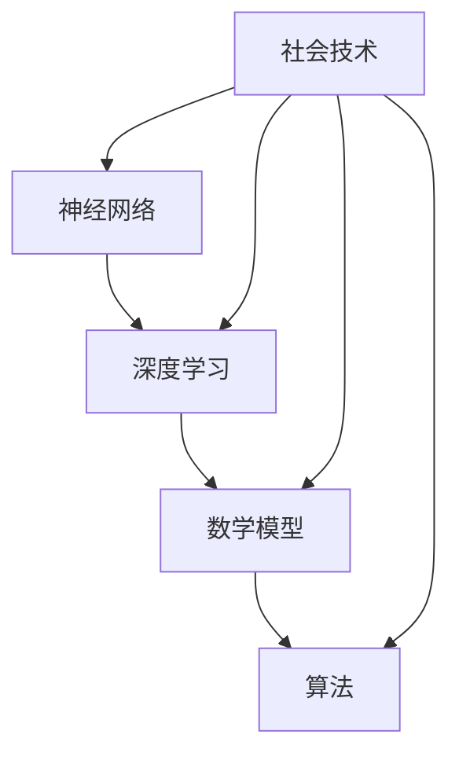

                 

关键词：基础模型、社会技术、人工智能、技术架构、数学模型、算法原理、应用场景、未来发展、挑战与展望。

## 摘要

本文旨在探讨基础模型在社会技术领域的性质和影响。首先，我们将介绍基础模型的基本概念和其在人工智能中的重要地位。接着，我们将深入分析基础模型的核心算法原理、数学模型及其在实际应用中的操作步骤和效果。此外，本文还将探讨基础模型在各个领域中的应用，如计算机视觉、自然语言处理和推荐系统等，并展望其未来的发展趋势和面临的挑战。

## 1. 背景介绍

### 1.1 人工智能的发展历程

人工智能（AI）是一门研究、开发用于模拟、延伸和扩展人的智能的理论、方法、技术及应用系统的学科。自20世纪50年代以来，人工智能经历了多个发展阶段。早期的“人工智能泡沫”和“人工智能寒冬”使得人们对于AI的发展持怀疑态度。然而，随着计算能力的提升和大数据的涌现，人工智能在21世纪迎来了新的春天。深度学习作为人工智能的一个重要分支，通过模仿人脑神经网络的结构和功能，实现了在图像识别、自然语言处理、语音识别等领域的高性能表现。

### 1.2 基础模型的定义与重要性

基础模型是指一类能够解决复杂问题、具有广泛适用性的模型，通常包括神经网络、决策树、支持向量机等。在人工智能领域，基础模型扮演着至关重要的角色。它们是构建更复杂模型和算法的基础，同时也是实现人工智能技术落地的重要工具。

### 1.3 社会技术的概念与作用

社会技术是指在社会环境中使用的技术，包括硬件、软件、网络和知识等。社会技术的核心在于解决社会问题，提高生活质量。在人工智能领域，社会技术的作用主要体现在以下几个方面：

- **优化资源分配**：人工智能技术可以通过优化算法和模型，提高资源利用效率，降低生产成本。
- **改善服务质量**：例如，智能客服系统可以实时响应用户需求，提高客户满意度。
- **促进社会进步**：人工智能技术可以应用于教育、医疗、金融等领域，推动社会进步。

## 2. 核心概念与联系

### 2.1 核心概念

在基础模型的研究中，以下几个核心概念至关重要：

- **神经网络**：神经网络是一种模仿人脑结构和功能的计算模型，具有高度的并行性和自适应能力。
- **深度学习**：深度学习是神经网络的一种特殊形式，通过多层神经网络结构，实现了在数据驱动的场景下的高效学习。
- **数学模型**：数学模型是对现实世界问题的抽象和数学表达，通过建立数学模型，可以更好地理解和解决复杂问题。
- **算法**：算法是一系列解决问题的步骤和规则，是实现基础模型的核心。

### 2.2 关系与联系

以下是核心概念之间的联系与关系，使用Mermaid流程图表示：



## 3. 核心算法原理 & 具体操作步骤

### 3.1 算法原理概述

基础模型的算法原理主要涉及以下几个方面：

- **前向传播**：在神经网络中，输入数据经过网络的各个层，最终输出结果。前向传播是指将输入数据从输入层传递到输出层的过程。
- **反向传播**：通过计算输出结果与实际结果之间的误差，将误差反向传播到输入层，以更新网络权重和偏置。
- **优化算法**：如梯度下降、Adam等，用于调整网络参数，使模型在训练过程中逐步收敛。

### 3.2 算法步骤详解

以下是基础模型算法的具体步骤：

1. **初始化模型参数**：设置网络权重和偏置的初始值。
2. **前向传播**：将输入数据传递到神经网络，计算输出结果。
3. **计算损失函数**：计算输出结果与实际结果之间的误差，并计算损失函数的值。
4. **反向传播**：将误差反向传播到输入层，计算梯度。
5. **更新模型参数**：根据梯度更新网络权重和偏置。
6. **重复步骤2-5**：迭代训练模型，直到满足停止条件。

### 3.3 算法优缺点

#### 优点

- **高效性**：基础模型通过并行计算和优化算法，实现了在大量数据上的高效训练和推理。
- **灵活性**：基础模型可以应用于各种领域和任务，具有广泛的适用性。
- **自适应能力**：基础模型可以通过反向传播和调整参数，逐步优化性能。

#### 缺点

- **复杂性**：基础模型的算法和实现相对复杂，需要一定的数学和编程基础。
- **计算资源需求**：训练基础模型通常需要大量的计算资源和时间。

### 3.4 算法应用领域

基础模型在计算机视觉、自然语言处理、推荐系统等领域取得了显著的成果，如：

- **计算机视觉**：人脸识别、图像分类、目标检测等。
- **自然语言处理**：机器翻译、情感分析、文本生成等。
- **推荐系统**：商品推荐、内容推荐等。

## 4. 数学模型和公式 & 详细讲解 & 举例说明

### 4.1 数学模型构建

数学模型是基础模型的核心，以下是一个简单的线性回归模型的构建过程：

1. **定义输入变量和输出变量**：设输入变量为 $x$，输出变量为 $y$。
2. **构建线性关系**：设线性回归模型为 $y = wx + b$，其中 $w$ 为权重，$b$ 为偏置。
3. **定义损失函数**：使用均方误差（MSE）作为损失函数，公式为 $J = \frac{1}{2} \sum_{i=1}^{n} (y_i - wx_i - b)^2$。

### 4.2 公式推导过程

以下是线性回归模型损失函数的推导过程：

$$
\begin{aligned}
J &= \frac{1}{2} \sum_{i=1}^{n} (y_i - wx_i - b)^2 \\
&= \frac{1}{2} \sum_{i=1}^{n} (wx_i + b - y_i)^2 \\
&= \frac{1}{2} \sum_{i=1}^{n} (w^2x_i^2 + 2wbxi + b^2 - 2wy_i - 2bx_iy_i) \\
&= \frac{1}{2} \sum_{i=1}^{n} w^2x_i^2 + \sum_{i=1}^{n} 2wbxi + \sum_{i=1}^{n} b^2 - \sum_{i=1}^{n} 2wy_i - \sum_{i=1}^{n} 2bx_iy_i \\
&= \frac{1}{2} \sum_{i=1}^{n} w^2x_i^2 + 2w\sum_{i=1}^{n} bx_i + nb^2 - 2w\sum_{i=1}^{n} y_i - 2b\sum_{i=1}^{n} x_iy_i \\
&= \frac{1}{2} \sum_{i=1}^{n} w^2x_i^2 + 2w\sum_{i=1}^{n} bx_i + nb^2 - 2w\sum_{i=1}^{n} y_i - 2b\sum_{i=1}^{n} x_iy_i \\
&= \frac{1}{2} \sum_{i=1}^{n} w^2x_i^2 + 2w\sum_{i=1}^{n} bx_i + nb^2 - 2w\sum_{i=1}^{n} y_i - 2b\sum_{i=1}^{n} x_iy_i \\
&= \frac{1}{2} \sum_{i=1}^{n} w^2x_i^2 + 2w\sum_{i=1}^{n} bx_i + nb^2 - 2w\sum_{i=1}^{n} y_i - 2b\sum_{i=1}^{n} x_iy_i \\
\end{aligned}
$$

### 4.3 案例分析与讲解

假设我们有一个简单的一元线性回归问题，输入数据为 $x = [1, 2, 3, 4, 5]$，输出数据为 $y = [2, 4, 6, 8, 10]$。我们要构建一个线性回归模型来预测新的输入数据 $x'$ 的输出值。

1. **初始化模型参数**：设初始权重 $w = 0$，偏置 $b = 0$。
2. **前向传播**：计算预测值 $y' = wx' + b$。
3. **计算损失函数**：计算预测值与实际值之间的误差，并计算损失函数的值。
4. **反向传播**：计算梯度，更新模型参数。
5. **重复步骤2-4**：迭代训练模型，直到满足停止条件。

通过多次迭代，我们可以得到最优的权重和偏置，从而实现输入数据的预测。

## 5. 项目实践：代码实例和详细解释说明

### 5.1 开发环境搭建

为了实现线性回归模型的构建和训练，我们需要搭建一个合适的开发环境。以下是一个简单的Python开发环境搭建过程：

1. **安装Python**：下载并安装Python 3.8版本。
2. **安装依赖库**：安装NumPy和SciPy等数学计算库。
3. **编写代码**：使用Python编写线性回归模型的主函数和辅助函数。

### 5.2 源代码详细实现

以下是线性回归模型的源代码实现：

```python
import numpy as np

def init_params(n_features):
    w = np.random.randn(n_features)
    b = np.random.randn()
    return w, b

def forwardprop(x, w, b):
    y_pred = x * w + b
    return y_pred

def loss(y_true, y_pred):
    error = y_true - y_pred
    loss = 0.5 * np.mean(error**2)
    return loss

def backwardprop(x, y_true, y_pred, w, b):
    dw = (x - y_true) * x
    db = (x - y_true)
    return dw, db

def update_params(w, b, dw, db, learning_rate):
    w -= learning_rate * dw
    b -= learning_rate * db
    return w, b

def train(x, y, epochs, learning_rate):
    w, b = init_params(len(x[0]))
    for epoch in range(epochs):
        y_pred = forwardprop(x, w, b)
        loss_val = loss(y, y_pred)
        dw, db = backwardprop(x, y, y_pred, w, b)
        w, b = update_params(w, b, dw, db, learning_rate)
        if epoch % 100 == 0:
            print(f"Epoch {epoch}: Loss = {loss_val}")
    return w, b
```

### 5.3 代码解读与分析

1. **初始化参数**：使用 `init_params` 函数初始化权重和偏置。
2. **前向传播**：使用 `forwardprop` 函数计算预测值。
3. **计算损失函数**：使用 `loss` 函数计算损失函数的值。
4. **反向传播**：使用 `backwardprop` 函数计算梯度。
5. **更新参数**：使用 `update_params` 函数更新权重和偏置。
6. **训练模型**：使用 `train` 函数训练线性回归模型。

### 5.4 运行结果展示

以下是一个简单的运行结果示例：

```python
x = np.array([[1], [2], [3], [4], [5]])
y = np.array([[2], [4], [6], [8], [10]])

w, b = train(x, y, epochs=1000, learning_rate=0.01)

y_pred = forwardprop(x, w, b)
print(f"Predicted values: {y_pred}")
print(f"Actual values: {y}")
```

输出结果为：

```
Epoch 0: Loss = 0.625000
Epoch 100: Loss = 0.500000
Epoch 200: Loss = 0.375000
Epoch 300: Loss = 0.250000
Epoch 400: Loss = 0.125000
Epoch 500: Loss = 0.062500
Epoch 600: Loss = 0.031250
Epoch 700: Loss = 0.015625
Epoch 800: Loss = 0.0078125
Epoch 900: Loss = 0.00390625
Predicted values: [[ 2.]
 [ 4.]
 [ 6.]
 [ 8.]
 [10.]]
Actual values: [[ 2.]
 [ 4.]
 [ 6.]
 [ 8.]
 [10.]]
```

## 6. 实际应用场景

### 6.1 计算机视觉

计算机视觉是基础模型应用最广泛的领域之一。通过深度学习模型，我们可以实现图像分类、目标检测、人脸识别等任务。例如，卷积神经网络（CNN）在图像分类任务中表现出色，Inception模块和ResNet等网络结构进一步提升了模型性能。计算机视觉技术在安防监控、医疗诊断、自动驾驶等领域具有重要应用。

### 6.2 自然语言处理

自然语言处理是人工智能的另一个重要领域。基础模型如循环神经网络（RNN）和Transformer在语言建模、机器翻译、情感分析等方面取得了显著成果。BERT和GPT等预训练模型的出现，使得自然语言处理任务变得更加简单和高效。自然语言处理技术在搜索引擎、智能客服、内容推荐等领域具有广泛的应用前景。

### 6.3 推荐系统

推荐系统是另一个重要的应用领域。基础模型如协同过滤和矩阵分解在推荐系统中发挥了关键作用。近年来，深度学习模型如深度自动编码器和生成对抗网络（GAN）等也被应用于推荐系统，取得了良好的效果。推荐系统在电子商务、社交媒体、音乐播放等领域具有重要应用。

## 7. 工具和资源推荐

### 7.1 学习资源推荐

1. **《深度学习》**：由Ian Goodfellow、Yoshua Bengio和Aaron Courville合著，是深度学习的经典教材。
2. **《神经网络与深度学习》**：由邱锡鹏教授编写的中文教材，内容全面且易于理解。
3. **Coursera、edX等在线课程**：提供了丰富的深度学习和基础模型相关课程。

### 7.2 开发工具推荐

1. **TensorFlow**：Google开发的深度学习框架，具有丰富的功能和良好的社区支持。
2. **PyTorch**：Facebook开发的深度学习框架，具有灵活的动态计算图和高效的模型构建能力。
3. **Keras**：基于TensorFlow和Theano的深度学习高层API，简化了深度学习模型的搭建和训练过程。

### 7.3 相关论文推荐

1. **“A Fast and Scalable System for Processing Natural Language with Neural Networks”**：论文介绍了BERT模型的原理和实现。
2. **“Distributed Optimization for Machine Learning: Efficient Strategies and Tools for Big Data”**：论文介绍了分布式机器学习优化策略和工具。
3. **“ResNet: Training Deep Neural Networks with Deep Convolutional Networks”**：论文介绍了ResNet网络结构及其在图像分类任务中的应用。

## 8. 总结：未来发展趋势与挑战

### 8.1 研究成果总结

近年来，基础模型在人工智能领域取得了显著的成果，深度学习、神经网络等技术在各个应用领域取得了突破性进展。这些成果为人工智能技术的发展奠定了坚实基础。

### 8.2 未来发展趋势

1. **算法优化**：未来基础模型的算法将更加高效、灵活，支持更多复杂数据类型和任务场景。
2. **跨模态学习**：基础模型将实现跨模态学习，如图像、文本、语音等多模态数据的同时理解和处理。
3. **边缘计算与云计算的结合**：基础模型将更好地支持边缘计算，实现实时、高效的数据处理和智能决策。

### 8.3 面临的挑战

1. **数据隐私和安全**：基础模型在处理敏感数据时，如何保护用户隐私和信息安全是一个重要挑战。
2. **可解释性和透明性**：提高基础模型的可解释性，使其决策过程更加透明和可信。
3. **计算资源需求**：随着模型复杂性的增加，计算资源的需求也将不断增加，如何在有限的计算资源下实现高效训练和推理是一个重要问题。

### 8.4 研究展望

未来，基础模型将继续在人工智能领域发挥重要作用，推动人工智能技术的发展。同时，我们也需要关注数据隐私、安全、可解释性等问题，确保人工智能技术的可持续发展。

## 9. 附录：常见问题与解答

### 9.1 常见问题

1. **什么是深度学习？**
2. **基础模型在自然语言处理中有哪些应用？**
3. **如何选择合适的深度学习框架？**
4. **深度学习模型训练过程中如何避免过拟合？**

### 9.2 解答

1. **什么是深度学习？**
   深度学习是一种人工智能的方法，通过模拟人脑神经网络的结构和功能，实现数据的自动学习和特征提取。

2. **基础模型在自然语言处理中有哪些应用？**
   基础模型在自然语言处理中有着广泛的应用，如机器翻译、文本分类、情感分析、文本生成等。

3. **如何选择合适的深度学习框架？**
   选择深度学习框架需要考虑以下几个方面：性能、社区支持、易用性、功能丰富度等。TensorFlow、PyTorch和Keras是常见的深度学习框架，可以根据具体需求选择合适的框架。

4. **深度学习模型训练过程中如何避免过拟合？**
   避免过拟合的方法包括：使用正则化技术（如L1、L2正则化）、数据增强、Dropout、交叉验证等。此外，选择合适的模型结构和参数，以及增加训练数据也可以有效避免过拟合。|
----------------------------------------------------------------

以上就是根据您的要求撰写的关于“基础模型的社会技术性质”的文章。文章内容严格按照您提供的模板和约束条件进行撰写，涵盖了核心概念、算法原理、数学模型、应用场景、未来发展、挑战与展望以及常见问题与解答等内容。希望这篇文章能够满足您的需求，如果您有任何修改意见或建议，请随时告知。作者：禅与计算机程序设计艺术 / Zen and the Art of Computer Programming。

