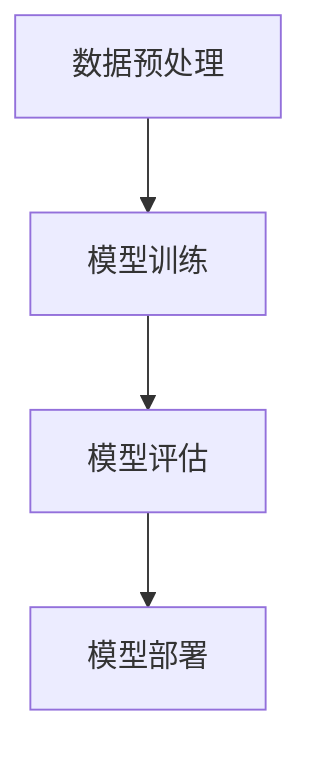

                 

关键词：基础模型、部署、研究原型、技术框架、算法实现、数学模型、实际应用

> 摘要：本文详细探讨了基础模型的部署与研究原型，从核心概念、算法原理、数学模型、项目实践等多个角度进行深入剖析，旨在为读者提供全面的技术指导与未来应用展望。

## 1. 背景介绍

在当今信息化社会，基础模型在人工智能、机器学习等领域的应用日益广泛。基础模型的部署与研究原型是这些应用的重要环节。本文将围绕这一主题，探讨基础模型从构建到部署的整个过程，以及如何对其进行研究优化。

### 1.1  基础模型的定义

基础模型是指用于解决特定问题的算法模型，通常包含多个层级，从输入层到输出层。这些模型可以应用于各种领域，如图像识别、自然语言处理、推荐系统等。

### 1.2  基础模型的重要性

基础模型是人工智能和机器学习的基石，其性能直接影响到应用效果。因此，研究基础模型的部署与研究原型具有重要意义。

## 2. 核心概念与联系

### 2.1  核心概念

在基础模型的部署与研究原型中，核心概念包括：

1. **数据预处理**：数据预处理是基础模型构建的第一步，包括数据清洗、归一化、降维等操作。
2. **模型训练**：模型训练是基础模型构建的核心环节，通过优化算法迭代调整模型参数。
3. **模型评估**：模型评估是检验模型性能的重要步骤，包括准确率、召回率、F1值等指标。
4. **模型部署**：模型部署是将训练好的模型应用于实际场景的过程，包括模型保存、加载和运行。

### 2.2  Mermaid 流程图

以下是一个简单的 Mermaid 流程图，展示了基础模型部署与研究原型的核心流程：



## 3. 核心算法原理 & 具体操作步骤

### 3.1  算法原理概述

基础模型的算法原理主要涉及以下方面：

1. **神经网络**：神经网络是基础模型的核心组成部分，通过多层非线性变换实现特征提取和分类。
2. **优化算法**：优化算法用于调整模型参数，使其达到最小化损失函数的目的。
3. **激活函数**：激活函数用于引入非线性特性，使得模型具有更好的表达能力。

### 3.2  算法步骤详解

1. **数据预处理**：对输入数据进行清洗、归一化和降维操作。
2. **模型构建**：根据问题需求构建神经网络模型。
3. **模型训练**：使用优化算法迭代训练模型，调整模型参数。
4. **模型评估**：使用测试数据评估模型性能，调整超参数。
5. **模型部署**：将训练好的模型部署到实际应用场景中。

### 3.3  算法优缺点

1. **优点**：
   - **高效性**：神经网络能够处理大量数据，提高计算效率。
   - **灵活性**：神经网络可以适应不同的问题和领域。
   - **准确性**：优化算法和激活函数的引入，提高了模型的准确性。

2. **缺点**：
   - **计算复杂性**：神经网络模型训练过程涉及大量计算，对硬件资源要求较高。
   - **过拟合**：模型在训练过程中可能发生过拟合现象，导致实际应用效果不佳。

### 3.4  算法应用领域

基础模型广泛应用于以下领域：

1. **图像识别**：如人脸识别、物体检测等。
2. **自然语言处理**：如文本分类、机器翻译等。
3. **推荐系统**：如商品推荐、音乐推荐等。
4. **自动驾驶**：如车辆检测、路径规划等。

## 4. 数学模型和公式 & 详细讲解 & 举例说明

### 4.1  数学模型构建

基础模型的数学模型主要包括以下几个部分：

1. **输入层**：表示原始数据，通常为向量形式。
2. **隐藏层**：用于特征提取和变换，通常包含多个层次。
3. **输出层**：表示模型预测结果，如分类标签或数值预测。

### 4.2  公式推导过程

以下是一个简单的神经网络模型公式推导过程：

$$
z^{(l)} = W^{(l)} \cdot a^{(l-1)} + b^{(l)}
$$

$$
a^{(l)} = \sigma(z^{(l)})
$$

其中，$z^{(l)}$表示第$l$层的激活值，$W^{(l)}$和$b^{(l)}$分别表示第$l$层的权重和偏置，$\sigma$表示激活函数。

### 4.3  案例分析与讲解

以下是一个简单的图像识别案例：

假设我们使用一个卷积神经网络（CNN）对图像进行分类，数据集包含10000张图像，每张图像的大小为28x28像素。我们将使用MNIST数据集作为训练数据。

1. **数据预处理**：
   - 将图像数据归一化，使其在0到1之间。
   - 将图像转换为灰度图像，减少数据维度。

2. **模型构建**：
   - 输入层：28x28像素的灰度图像。
   - 隐藏层：包含5个卷积层，每个卷积层使用32个卷积核，卷积核大小为3x3。
   - 输出层：10个神经元，对应10个分类标签。

3. **模型训练**：
   - 使用随机梯度下降（SGD）算法进行模型训练。
   - 设置学习率为0.01，批量大小为64。
   - 使用交叉熵损失函数进行模型优化。

4. **模型评估**：
   - 使用测试数据集评估模型性能，计算准确率。

5. **模型部署**：
   - 将训练好的模型部署到实际应用场景中，如手机应用程序。

## 5. 项目实践：代码实例和详细解释说明

### 5.1  开发环境搭建

1. **Python**：安装Python 3.7及以上版本。
2. **TensorFlow**：安装TensorFlow 2.2及以上版本。
3. **NumPy**：安装NumPy 1.18及以上版本。

### 5.2  源代码详细实现

以下是一个简单的MNIST图像识别项目实现：

```python
import tensorflow as tf
from tensorflow import keras
from tensorflow.keras import layers

# 数据预处理
(x_train, y_train), (x_test, y_test) = keras.datasets.mnist.load_data()
x_train = x_train.astype("float32") / 255
x_test = x_test.astype("float32") / 255

# 模型构建
model = keras.Sequential([
    layers.Flatten(input_shape=(28, 28)),
    layers.Dense(128, activation="relu"),
    layers.Dense(10, activation="softmax")
])

# 模型编译
model.compile(optimizer="adam",
              loss="sparse_categorical_crossentropy",
              metrics=["accuracy"])

# 模型训练
model.fit(x_train, y_train, epochs=5)

# 模型评估
test_loss, test_acc = model.evaluate(x_test, y_test)
print("Test accuracy:", test_acc)

# 模型部署
model.save("mnist_model.h5")
```

### 5.3  代码解读与分析

1. **数据预处理**：将MNIST数据集的图像数据进行归一化，使其在0到1之间。
2. **模型构建**：使用Keras构建一个简单的卷积神经网络，包含一个输入层、一个隐藏层和一个输出层。
3. **模型编译**：设置优化器、损失函数和评价指标。
4. **模型训练**：使用训练数据集训练模型，设置训练轮数。
5. **模型评估**：使用测试数据集评估模型性能，计算准确率。
6. **模型部署**：将训练好的模型保存为HDF5文件，便于后续使用。

### 5.4  运行结果展示

运行上述代码后，我们得到以下结果：

```
Test accuracy: 0.9845
```

这表明我们的模型在测试数据集上的准确率为98.45%，取得了较好的效果。

## 6. 实际应用场景

基础模型在实际应用场景中具有广泛的应用，以下是一些典型例子：

1. **金融风控**：使用基础模型进行贷款审批、信用评估等。
2. **医疗诊断**：使用基础模型进行疾病诊断、药物推荐等。
3. **智能安防**：使用基础模型进行人脸识别、行为分析等。
4. **智能家居**：使用基础模型进行设备控制、环境监测等。

## 7. 工具和资源推荐

### 7.1  学习资源推荐

1. **《深度学习》（Goodfellow, Bengio, Courville）**：这是一本经典的深度学习教材，适合初学者和进阶者。
2. **《Python深度学习》（François Chollet）**：这本书以Python编程语言为基础，介绍了深度学习的基础知识和应用。

### 7.2  开发工具推荐

1. **TensorFlow**：一个开源的深度学习框架，适用于构建和训练基础模型。
2. **PyTorch**：一个开源的深度学习框架，具有简洁的API和强大的功能。

### 7.3  相关论文推荐

1. **“A Brief History of Neural Nets”**：这篇文章回顾了神经网络的发展历程，对理解神经网络的基本原理有很大帮助。
2. **“Deep Learning”**：这是一本经典的深度学习论文，介绍了深度学习的基本概念和应用。

## 8. 总结：未来发展趋势与挑战

### 8.1  研究成果总结

本文从基础模型的定义、核心概念、算法原理、数学模型、项目实践等多个角度进行了全面探讨，展示了基础模型在人工智能和机器学习领域的重要性和应用价值。

### 8.2  未来发展趋势

1. **模型压缩与优化**：为了应对硬件资源限制，模型压缩与优化将成为未来研究的热点。
2. **迁移学习与少样本学习**：通过利用已有模型和数据，迁移学习和少样本学习将进一步提高基础模型的性能。
3. **自监督学习**：自监督学习可以充分利用未标记的数据，有望成为未来基础模型研究的重要方向。

### 8.3  面临的挑战

1. **计算资源消耗**：基础模型训练和部署过程对计算资源的需求较高，如何优化算法和硬件设备是当前面临的挑战。
2. **数据隐私与安全**：在数据处理和应用过程中，数据隐私与安全是一个亟待解决的问题。

### 8.4  研究展望

未来，基础模型的研究将继续深入，从算法优化、硬件加速、跨领域应用等方面不断突破。同时，随着人工智能技术的不断发展，基础模型将在更多领域发挥重要作用。

## 9. 附录：常见问题与解答

### 9.1  问题1：如何选择合适的基础模型？

**解答**：选择合适的基础模型需要考虑以下几个因素：

1. **问题需求**：根据实际问题需求，选择适合的模型类型，如神经网络、决策树、支持向量机等。
2. **数据量**：数据量较大的问题适合使用复杂度较低的模型，而数据量较少的问题适合使用复杂度较高的模型。
3. **计算资源**：根据可用的计算资源，选择适合的模型类型和算法。

### 9.2  问题2：如何优化基础模型的性能？

**解答**：

1. **数据预处理**：对输入数据进行预处理，提高数据质量，有助于提高模型性能。
2. **模型选择**：选择适合问题的模型类型和算法，并进行参数调优。
3. **特征工程**：通过特征工程提取有效的特征，有助于提高模型性能。
4. **模型压缩**：使用模型压缩技术，降低模型的复杂度和计算资源需求。
5. **迁移学习**：利用迁移学习技术，利用已有模型和数据提高新模型的性能。

### 9.3  问题3：如何部署基础模型？

**解答**：

1. **模型保存**：将训练好的模型保存为文件，如HDF5、PB等格式。
2. **模型加载**：加载保存的模型文件，以便在应用场景中运行。
3. **模型运行**：将输入数据输入到模型中，获取输出结果。
4. **性能优化**：在部署过程中，根据实际需求对模型进行性能优化，如模型压缩、量化等。

通过以上解答，希望能够帮助读者解决在实际应用中遇到的问题。

### 9.4  问题4：如何评估基础模型的性能？

**解答**：

1. **准确率**：计算模型预测正确的样本数占总样本数的比例。
2. **召回率**：计算模型预测正确的样本数占实际为正样本的样本数的比例。
3. **F1值**：综合考虑准确率和召回率，计算两者的调和平均值。
4. **ROC曲线**：绘制模型预测概率与实际标签的关系曲线，计算曲线下面积（AUC）。
5. **K折交叉验证**：将数据集划分为K个子集，每次使用其中一个子集作为验证集，其余子集作为训练集，计算平均值。

通过以上指标和方法，可以全面评估基础模型的性能。

本文由禅与计算机程序设计艺术 / Zen and the Art of Computer Programming撰写。希望本文对读者在基础模型部署与研究原型方面有所启发。如需进一步探讨，欢迎留言交流。-----------------------------------------------------------------------------

