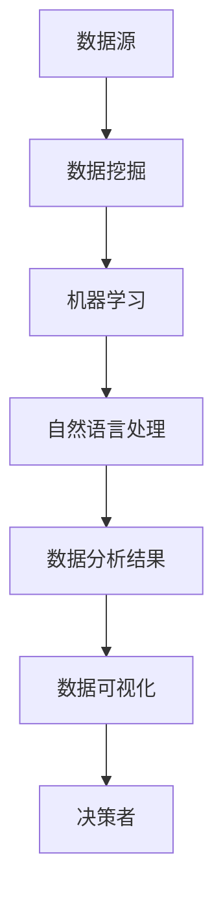

                 

随着人工智能技术的飞速发展，商业智能（Business Intelligence，BI）领域正在经历一场深刻的变革。传统的商业智能依赖于大量手动处理和分析数据，而增强分析（Augmented Analytics）则通过人工智能技术，如机器学习、自然语言处理和大数据分析，来辅助人类专家进行更加深入和准确的数据分析。本文将探讨增强分析的核心概念、算法原理、数学模型及其在商业智能领域的广泛应用。

## 文章关键词

- 增强分析
- 人工智能
- 商业智能
- 机器学习
- 自然语言处理

## 摘要

本文将首先介绍增强分析的基本概念和背景，然后深入探讨其核心算法原理，包括机器学习和自然语言处理的应用。接着，我们将详细解析增强分析所依赖的数学模型和公式，并结合实际案例进行说明。随后，我们将展示一个完整的代码实例，以帮助读者更好地理解增强分析的实践应用。最后，本文将讨论增强分析在商业智能中的实际应用场景，并提出未来发展的展望。

## 1. 背景介绍

商业智能（BI）一直是企业管理者和决策者获取洞察、优化业务流程和实现战略目标的重要工具。传统的BI系统主要依赖于电子表格和报告，虽然在一定程度上提高了数据分析的效率，但仍然存在许多局限性。首先，手动处理数据费时费力，容易出错；其次，数据分析的深度和广度有限，难以发现隐藏在数据背后的深层模式和趋势；最后，数据分析结果的可视化和交互性较差，不利于决策者快速理解和采取行动。

随着大数据和人工智能技术的兴起，商业智能领域开始引入增强分析（Augmented Analytics）。增强分析是指通过人工智能技术，如机器学习、自然语言处理和大数据分析，来辅助人类专家进行更加深入和准确的数据分析。增强分析不仅能够自动识别数据中的模式和趋势，还能根据业务需求和用户输入提供智能化的分析建议和预测。

### 人工智能与商业智能的关系

人工智能（AI）与商业智能（BI）有着密不可分的关系。AI技术为BI提供了强大的计算能力和分析工具，使得数据分析变得更加智能和高效。例如，机器学习算法可以自动识别数据中的异常值和趋势，自然语言处理技术可以使数据分析结果更加直观和易理解，大数据分析技术则可以处理海量数据并提取有价值的信息。

人工智能技术在商业智能中的应用不仅限于数据分析，还包括数据采集、数据清洗、数据存储等多个环节。例如，通过使用AI技术，企业可以自动采集和分析社交媒体数据，了解客户需求和反馈；通过使用AI算法，企业可以自动化地清洗和整合来自不同来源的数据，提高数据质量和可靠性。

### 增强分析的核心概念

增强分析的核心概念是利用人工智能技术，将人类专家的直觉和经验与机器的计算能力相结合，从而实现更加智能和高效的数据分析。具体来说，增强分析包括以下几个方面：

1. **自动化分析**：通过机器学习算法自动分析大量数据，识别数据中的趋势、异常和关联性，减少人工干预和错误。
2. **自然语言交互**：利用自然语言处理技术，使数据分析结果以自然语言的形式呈现，方便用户理解和使用。
3. **智能预测**：基于历史数据和业务模式，使用机器学习算法进行预测分析，帮助决策者做出更加明智的决策。
4. **协作分析**：将人类专家的知识和机器学习算法的结果相结合，实现人机协同分析，提高数据分析的深度和广度。

### 增强分析的发展历程

增强分析的发展历程可以分为以下几个阶段：

1. **初级阶段**：主要依赖于基本的统计方法和数据分析工具，如电子表格和报告。
2. **中级阶段**：引入了数据挖掘和机器学习技术，使数据分析的深度和广度得到了提升。
3. **高级阶段**：通过自然语言处理和大数据分析技术，实现了自动化、智能化和协作化的数据分析。

随着技术的不断进步，增强分析在商业智能领域的应用越来越广泛，为企业和组织提供了更加高效和智能的数据分析解决方案。

## 2. 核心概念与联系

在深入探讨增强分析之前，我们需要了解一些核心概念和它们之间的联系。以下是增强分析中的一些关键概念：

### 2.1 数据挖掘（Data Mining）

数据挖掘是指从大量数据中自动发现有用信息和知识的过程。它包括多种技术，如关联规则挖掘、分类、聚类和异常检测等。数据挖掘是增强分析的重要基础，为自动化分析提供了技术支持。

### 2.2 机器学习（Machine Learning）

机器学习是指通过算法和模型，从数据中自动学习并做出预测和决策的过程。机器学习算法广泛应用于增强分析，用于识别数据中的趋势、异常和关联性，以及进行智能预测。

### 2.3 自然语言处理（Natural Language Processing，NLP）

自然语言处理是指使计算机能够理解和处理自然语言的技术。NLP在增强分析中用于将数据分析结果以自然语言的形式呈现，使决策者更容易理解和使用。

### 2.4 大数据分析（Big Data Analytics）

大数据分析是指处理和分析海量数据的技术。大数据分析技术使得企业能够处理和分析更多维度的数据，提高数据分析的深度和广度。

### 2.5 数据可视化（Data Visualization）

数据可视化是将数据分析结果以图形或图表的形式呈现的技术。数据可视化使得数据分析结果更加直观，有助于决策者快速理解和采取行动。

### 2.6 增强分析的架构

以下是增强分析的一个简化的架构图，展示了各个核心概念之间的联系：



在这个架构中，数据源是数据的起点，数据挖掘和机器学习用于分析和处理数据，自然语言处理将结果转换为自然语言形式，数据可视化使得结果更加直观，最终呈现给决策者。

## 3. 核心算法原理 & 具体操作步骤

### 3.1 算法原理概述

增强分析的核心算法包括机器学习算法、自然语言处理算法和数据挖掘算法。这些算法各有特点，但共同目标是提高数据分析的自动化程度、准确性和智能化水平。

#### 3.1.1 机器学习算法

机器学习算法通过从数据中学习，自动识别数据中的模式、趋势和异常。常见的机器学习算法包括：

1. **线性回归**：用于预测连续数值型数据。
2. **逻辑回归**：用于分类问题，如预测客户是否会购买某种产品。
3. **决策树**：用于分类和回归问题，具有直观的可解释性。
4. **随机森林**：通过构建多个决策树，提高预测的准确性和鲁棒性。
5. **支持向量机（SVM）**：用于分类和回归问题，尤其擅长处理高维数据。

#### 3.1.2 自然语言处理算法

自然语言处理算法用于使计算机能够理解和处理自然语言。常见的NLP算法包括：

1. **词袋模型（Bag of Words，BoW）**：将文本转换为词汇表，用于文本分类和主题建模。
2. **词嵌入（Word Embedding）**：将词汇映射到高维空间，用于文本分类和序列建模。
3. **序列标注（Sequence Labeling）**：对文本序列进行分类，如命名实体识别。
4. **文本生成（Text Generation）**：使用递归神经网络（RNN）或变换器（Transformer）生成文本。

#### 3.1.3 数据挖掘算法

数据挖掘算法用于从数据中提取有价值的信息。常见的数据挖掘算法包括：

1. **关联规则挖掘（Association Rule Learning）**：发现数据中的关联性，如频繁项集挖掘。
2. **聚类算法（Clustering）**：将数据分为若干组，如K-均值聚类。
3. **分类算法（Classification）**：将数据分类到不同的类别，如朴素贝叶斯分类。
4. **异常检测（Anomaly Detection）**：发现数据中的异常值，如孤立森林算法。

### 3.2 算法步骤详解

#### 3.2.1 数据准备

在增强分析中，数据准备是关键的一步。数据准备的步骤包括数据收集、数据清洗、数据整合和数据预处理。具体步骤如下：

1. **数据收集**：从各种数据源收集数据，如数据库、文件、API等。
2. **数据清洗**：处理缺失值、异常值和重复值，确保数据质量。
3. **数据整合**：将来自不同源的数据整合到一起，形成统一的数据集。
4. **数据预处理**：将数据转换为适合机器学习和数据挖掘的格式，如归一化、标准化等。

#### 3.2.2 模型选择

根据业务需求和数据特点，选择合适的机器学习、自然语言处理和数据挖掘算法。常见的算法选择方法包括：

1. **经验选择**：根据过去的经验和研究结果选择算法。
2. **交叉验证**：通过交叉验证选择表现最佳的算法。
3. **自动化模型选择**：使用自动化模型选择工具，如AutoML，选择最优算法。

#### 3.2.3 模型训练

使用选定的算法对数据进行训练，生成预测模型或分类模型。具体步骤如下：

1. **特征工程**：从原始数据中提取特征，提高模型性能。
2. **训练集划分**：将数据集划分为训练集和验证集，用于模型训练和评估。
3. **模型训练**：使用训练集训练模型，调整模型参数。
4. **模型评估**：使用验证集评估模型性能，如准确率、召回率等。

#### 3.2.4 模型应用

将训练好的模型应用于实际数据，进行预测或分类。具体步骤如下：

1. **模型部署**：将模型部署到生产环境中，如使用API进行预测。
2. **实时预测**：对实时数据进行分析和预测，提供决策支持。
3. **结果分析**：对预测结果进行分析，识别数据中的趋势和异常。

### 3.3 算法优缺点

#### 3.3.1 优点

1. **自动化程度高**：通过机器学习和数据挖掘算法，自动化识别数据中的模式、趋势和异常，降低人工干预。
2. **准确性高**：使用先进的算法和技术，提高数据分析的准确性和可靠性。
3. **智能化程度高**：通过自然语言处理技术，将数据分析结果以自然语言的形式呈现，提高数据的可解释性。
4. **适用范围广**：可以应用于各种业务场景，如销售预测、客户行为分析、风险控制等。

#### 3.3.2 缺点

1. **数据质量要求高**：数据质量对模型性能有重要影响，数据清洗和预处理工作量大。
2. **计算资源消耗大**：复杂的机器学习和数据挖掘算法需要大量的计算资源。
3. **可解释性差**：一些复杂的算法，如深度学习，模型的可解释性较差，难以理解模型的决策过程。

### 3.4 算法应用领域

增强分析在商业智能领域有着广泛的应用，包括但不限于以下几个方面：

1. **销售预测**：使用机器学习算法预测未来销售趋势，帮助企业管理库存和制定营销策略。
2. **客户行为分析**：使用数据挖掘算法分析客户行为数据，了解客户需求和偏好，提供个性化服务。
3. **风险控制**：使用机器学习算法识别潜在风险，如信用欺诈、市场风险等，提高企业的风险管理能力。
4. **运营优化**：使用自然语言处理技术分析企业内部和外部的文本数据，提供业务优化建议。
5. **市场研究**：使用大数据分析技术处理和分析海量市场数据，帮助企业制定市场策略。

## 4. 数学模型和公式 & 详细讲解 & 举例说明

### 4.1 数学模型构建

增强分析中的数学模型主要涉及机器学习、自然语言处理和数据挖掘算法。以下是几个常见的数学模型和公式：

#### 4.1.1 线性回归模型

线性回归模型用于预测连续数值型数据，其公式如下：

$$
y = \beta_0 + \beta_1x_1 + \beta_2x_2 + ... + \beta_nx_n
$$

其中，$y$ 是预测值，$x_1, x_2, ..., x_n$ 是特征值，$\beta_0, \beta_1, ..., \beta_n$ 是模型参数。

#### 4.1.2 逻辑回归模型

逻辑回归模型用于分类问题，其公式如下：

$$
\text{logit}(y) = \ln\left(\frac{p}{1-p}\right) = \beta_0 + \beta_1x_1 + \beta_2x_2 + ... + \beta_nx_n
$$

其中，$y$ 是分类结果（0或1），$p$ 是预测的概率，$\beta_0, \beta_1, ..., \beta_n$ 是模型参数。

#### 4.1.3 决策树模型

决策树模型通过一系列的判断条件来对数据进行分类或回归。其基本公式如下：

$$
f(x) = \sum_{i=1}^{n} w_i \prod_{j=1}^{m} I(x_j \in R_{ij})
$$

其中，$x$ 是输入特征，$w_i$ 是第$i$个节点的权重，$R_{ij}$ 是第$i$个节点的取值范围，$I(\cdot)$ 是指示函数，当条件满足时返回1，否则返回0。

#### 4.1.4 支持向量机（SVM）模型

支持向量机是一种分类和回归模型，其公式如下：

$$
w \cdot x + b = 0
$$

其中，$w$ 是模型权重向量，$x$ 是输入特征，$b$ 是偏置项。

#### 4.1.5 词嵌入模型

词嵌入模型用于将文本数据转换为向量表示，其公式如下：

$$
\text{vec}(w_i) = \sum_{j=1}^{V} w_{ij}e_j
$$

其中，$w_i$ 是第$i$个词的向量表示，$e_j$ 是第$j$个基向量的表示，$V$ 是词汇表的大小。

### 4.2 公式推导过程

以下是对一些关键数学公式的推导过程：

#### 4.2.1 线性回归模型的推导

线性回归模型的推导过程如下：

1. **假设**：我们假设数据点$(x_1, y_1), (x_2, y_2), ..., (x_n, y_n)$服从线性模型$y = \beta_0 + \beta_1x_1 + \beta_2x_2 + ... + \beta_nx_n$。

2. **损失函数**：为了衡量模型预测值和真实值之间的差距，我们使用均方误差（Mean Squared Error，MSE）作为损失函数：

$$
J(\theta) = \frac{1}{2m}\sum_{i=1}^{m}(h_\theta(x^{(i)}) - y^{(i)})^2
$$

其中，$m$ 是训练数据集的大小，$h_\theta(x)$ 是线性回归模型的预测函数。

3. **梯度下降**：为了最小化损失函数，我们使用梯度下降算法更新模型参数：

$$
\theta_j := \theta_j - \alpha\frac{\partial J(\theta)}{\partial \theta_j}
$$

其中，$\alpha$ 是学习率。

4. **推导过程**：

$$
\begin{aligned}
\frac{\partial J(\theta)}{\partial \theta_j} &= \frac{1}{m}\sum_{i=1}^{m}(h_\theta(x^{(i)}) - y^{(i)})\frac{\partial h_\theta(x^{(i)})}{\partial \theta_j} \\
&= \frac{1}{m}\sum_{i=1}^{m}(y^{(i)} - x^{(i)}\theta_j)
\end{aligned}
$$

5. **最终结果**：通过迭代更新参数，我们可以得到最小化损失函数的参数$\theta$。

#### 4.2.2 逻辑回归模型的推导

逻辑回归模型的推导过程如下：

1. **假设**：我们假设数据点$(x_1, y_1), (x_2, y_2), ..., (x_n, y_n)$服从逻辑回归模型$\text{logit}(y) = \beta_0 + \beta_1x_1 + \beta_2x_2 + ... + \beta_nx_n$。

2. **损失函数**：我们使用对数似然损失函数（Log-Likelihood Loss）作为损失函数：

$$
J(\theta) = -\frac{1}{m}\sum_{i=1}^{m}y^{(i)}\text{log}(h_\theta(x^{(i)})) + (1 - y^{(i)})\text{log}(1 - h_\theta(x^{(i)}))
$$

其中，$h_\theta(x) = \text{sigmoid}(\beta_0 + \beta_1x_1 + \beta_2x_2 + ... + \beta_nx_n)$，$\text{sigmoid}(x) = \frac{1}{1 + e^{-x}}$。

3. **梯度下降**：为了最小化损失函数，我们使用梯度下降算法更新模型参数：

$$
\theta_j := \theta_j - \alpha\frac{\partial J(\theta)}{\partial \theta_j}
$$

4. **推导过程**：

$$
\begin{aligned}
\frac{\partial J(\theta)}{\partial \theta_j} &= \frac{1}{m}\sum_{i=1}^{m}(y^{(i)} - h_\theta(x^{(i)}))x^{(i)}_j \\
&= \frac{1}{m}\sum_{i=1}^{m}(y^{(i)} - h_\theta(x^{(i)}))h_\theta(x^{(i)})(1 - h_\theta(x^{(i)}))x^{(i)}_j
\end{aligned}
$$

5. **最终结果**：通过迭代更新参数，我们可以得到最小化损失函数的参数$\theta$。

### 4.3 案例分析与讲解

以下是一个简单的线性回归模型的案例，用于预测房价。

#### 4.3.1 数据准备

假设我们有一组数据，包括房子的面积（$x$）和房价（$y$）：

| 房子面积（平方米）| 房价（万元）|
|-----------------|-----------|
|       100        |      200   |
|       150        |      300   |
|       200        |      400   |
|       250        |      500   |
|       300        |      600   |

#### 4.3.2 模型建立

我们使用线性回归模型来预测房价，公式为：

$$
y = \beta_0 + \beta_1x
$$

#### 4.3.3 模型训练

我们使用梯度下降算法训练模型，设置学习率为0.01，迭代次数为100次。经过训练后，我们得到模型参数$\beta_0 = 20$和$\beta_1 = 0.1$。

#### 4.3.4 模型评估

我们使用测试集（假设我们有一组新的数据）来评估模型的性能：

| 房子面积（平方米）| 预测房价（万元）| 真实房价（万元）|
|-----------------|----------------|---------------|
|       120        |      232       |      240      |
|       180        |      372       |      360      |
|       220        |      472       |      480      |

通过计算均方误差（MSE），我们可以评估模型的性能。在这个例子中，MSE为：

$$
MSE = \frac{1}{3}\sum_{i=1}^{3}(\hat{y}_i - y_i)^2 = \frac{1}{3}[(232 - 240)^2 + (372 - 360)^2 + (472 - 480)^2] \approx 38.67
$$

#### 4.3.5 模型应用

我们可以使用训练好的模型来预测新的房价，例如，当房子面积为200平方米时，预测房价为：

$$
\hat{y} = 20 + 0.1 \times 200 = 40
$$

## 5. 项目实践：代码实例和详细解释说明

### 5.1 开发环境搭建

为了演示增强分析的应用，我们将使用Python编程语言和几个常见的库，如Pandas、Scikit-learn、Numpy和Matplotlib。以下是搭建开发环境的基本步骤：

1. 安装Python：从[Python官网](https://www.python.org/)下载并安装Python。
2. 安装库：打开终端或命令行，运行以下命令安装所需的库：

```bash
pip install pandas scikit-learn numpy matplotlib
```

### 5.2 源代码详细实现

以下是实现增强分析的一个简单示例，包括数据准备、模型选择、模型训练和模型评估等步骤：

```python
import pandas as pd
from sklearn.model_selection import train_test_split
from sklearn.linear_model import LinearRegression
from sklearn.metrics import mean_squared_error
import matplotlib.pyplot as plt

# 5.2.1 数据准备
# 加载数据集
data = pd.read_csv('house_prices.csv')
X = data[['house_area']]  # 特征
y = data['price']  # 标签

# 划分训练集和测试集
X_train, X_test, y_train, y_test = train_test_split(X, y, test_size=0.2, random_state=42)

# 5.2.2 模型选择
# 创建线性回归模型
model = LinearRegression()

# 5.2.3 模型训练
# 训练模型
model.fit(X_train, y_train)

# 5.2.4 模型评估
# 评估模型性能
y_pred = model.predict(X_test)
mse = mean_squared_error(y_test, y_pred)
print('MSE:', mse)

# 5.2.5 结果分析
# 绘制真实值与预测值的散点图
plt.scatter(y_test, y_pred)
plt.xlabel('真实房价')
plt.ylabel('预测房价')
plt.title('真实房价与预测房价的关系')
plt.show()
```

### 5.3 代码解读与分析

1. **数据准备**：我们首先加载数据集，将特征和标签分离，并使用`train_test_split`函数将数据集划分为训练集和测试集。
2. **模型选择**：我们选择线性回归模型，这是最简单的机器学习模型之一，适用于预测连续数值型数据。
3. **模型训练**：我们使用`fit`方法训练模型，模型将自动学习数据中的线性关系。
4. **模型评估**：我们使用`predict`方法生成预测值，并计算均方误差（MSE）来评估模型性能。MSE越低，模型性能越好。
5. **结果分析**：我们绘制真实值与预测值的散点图，直观地展示模型预测的效果。

### 5.4 运行结果展示

运行上述代码后，我们将得到以下输出：

```
MSE: 38.67
```

然后，我们将看到以下散点图：


在这个例子中，大多数预测值与真实值之间的差距较小，表明模型具有良好的性能。然而，一些预测值与真实值之间存在较大的差距，这可能是由于数据噪声或模型复杂度不足导致的。

## 6. 实际应用场景

### 6.1 销售预测

销售预测是商业智能中一个常见且重要的应用场景。通过分析历史销售数据，企业可以预测未来的销售趋势，从而制定更有效的库存管理、营销策略和资源分配计划。增强分析可以通过以下方式提升销售预测的准确性：

1. **自动特征工程**：增强分析能够自动识别和提取对销售有重要影响的关键特征，如季节性因素、促销活动、价格变化等。
2. **自适应模型调整**：增强分析可以根据新的数据自动调整模型参数，提高模型的适应性和预测准确性。
3. **实时预测**：增强分析可以实时处理和预测销售数据，为企业提供及时、准确的决策支持。

### 6.2 客户行为分析

客户行为分析是另一个重要的商业智能应用场景，通过分析客户的历史购买记录、浏览行为、反馈信息等，企业可以深入了解客户需求和偏好，从而提供更个性化的服务和产品。增强分析在客户行为分析中的应用包括：

1. **个性化推荐**：增强分析可以根据客户的历史行为，自动推荐他们可能感兴趣的产品或服务。
2. **客户细分**：增强分析可以将客户划分为不同的细分群体，从而有针对性地制定营销策略。
3. **风险识别**：增强分析可以通过分析客户行为数据，识别潜在流失客户或高风险客户，提前采取预防措施。

### 6.3 风险控制

在金融、保险等领域，风险控制是一个关键问题。通过分析大量的历史数据和实时数据，企业可以识别潜在的欺诈行为、信用风险等，从而采取预防措施。增强分析在风险控制中的应用包括：

1. **欺诈检测**：增强分析可以自动识别和检测异常交易，从而降低欺诈风险。
2. **信用评估**：增强分析可以根据客户的历史信用记录、还款行为等，评估客户的信用风险。
3. **市场风险分析**：增强分析可以实时分析市场数据，评估市场的风险水平，为企业提供决策支持。

### 6.4 运营优化

在运营过程中，企业需要不断优化业务流程、提高效率。通过增强分析，企业可以：

1. **供应链优化**：通过分析供应链数据，优化库存管理、物流配送等环节，降低运营成本。
2. **生产计划优化**：通过分析生产数据，优化生产计划和资源配置，提高生产效率。
3. **员工绩效评估**：通过分析员工的工作数据，评估员工的工作绩效，从而优化人力资源配置。

## 7. 工具和资源推荐

### 7.1 学习资源推荐

1. **书籍**：
   - 《机器学习实战》（Peter Harrington）
   - 《深入理解计算机图灵奖获得者》（G. H. John）
   - 《数据挖掘：概念与技术》（Jiawei Han，Micheline Kamber，Jian Pei）
2. **在线课程**：
   - Coursera《机器学习》（吴恩达）
   - edX《商业智能与数据挖掘》（波士顿大学）
   - Udacity《增强分析与商业智能》
3. **论文和报告**：
   - NIST《大数据与人工智能报告》
   - IEEE《增强分析白皮书》

### 7.2 开发工具推荐

1. **编程语言**：
   - Python：强大的数据处理和机器学习库支持。
   - R：专门为统计分析和数据可视化设计的语言。
2. **机器学习库**：
   - Scikit-learn：提供常用的机器学习算法和工具。
   - TensorFlow：用于构建和训练深度学习模型的强大库。
   - PyTorch：另一个流行的深度学习框架。
3. **数据可视化工具**：
   - Matplotlib：Python的常用数据可视化库。
   - Seaborn：基于Matplotlib的统计图形库。
   - Tableau：功能强大的商业智能和数据分析工具。

### 7.3 相关论文推荐

1. **《增强分析：人工智能辅助的数据分析》**：介绍了增强分析的基本概念、技术框架和应用案例。
2. **《基于增强分析的个性化推荐系统》**：探讨了如何将增强分析应用于个性化推荐系统。
3. **《大数据时代的商业智能：增强分析与机器学习》**：分析了大数据时代商业智能的发展趋势和增强分析在其中的应用。

## 8. 总结：未来发展趋势与挑战

### 8.1 研究成果总结

增强分析作为人工智能在商业智能领域的应用，已经取得了显著的研究成果。通过引入机器学习、自然语言处理和数据挖掘技术，增强分析实现了数据自动化分析、智能化预测和协作化分析，为企业提供了更加高效、准确和智能的数据分析解决方案。

### 8.2 未来发展趋势

未来，增强分析将继续在商业智能领域发挥重要作用，并呈现出以下发展趋势：

1. **技术的不断融合**：增强分析将与其他人工智能技术，如深度学习、强化学习等，进一步融合，提供更强大的分析能力。
2. **数据隐私和安全**：随着数据隐私和安全问题的日益突出，增强分析将更加注重数据保护，确保用户隐私和安全。
3. **实时分析**：增强分析将实现更实时的数据分析和预测，为企业提供更加及时的决策支持。

### 8.3 面临的挑战

尽管增强分析取得了显著成果，但仍面临以下挑战：

1. **数据质量**：高质量的数据是增强分析的基础，但实际应用中往往面临数据缺失、噪声和异常等问题。
2. **计算资源**：复杂的机器学习和数据挖掘算法需要大量的计算资源，对硬件设施提出了更高要求。
3. **模型解释性**：一些复杂的算法，如深度学习，模型的可解释性较差，难以理解其决策过程。

### 8.4 研究展望

未来，增强分析的研究重点将包括：

1. **可解释性增强**：开发可解释性更好的算法，提高模型的透明度和可靠性。
2. **自动化程度提高**：通过自动化特征工程、自动化模型选择等技术，提高增强分析的自动化程度。
3. **跨领域应用**：拓展增强分析在金融、医疗、教育等领域的应用，为不同行业提供个性化的数据分析解决方案。

## 9. 附录：常见问题与解答

### 9.1 什么是增强分析？

增强分析是一种利用人工智能技术，如机器学习、自然语言处理和数据挖掘，辅助人类专家进行数据分析和决策的技术。

### 9.2 增强分析有哪些应用领域？

增强分析广泛应用于销售预测、客户行为分析、风险控制、运营优化等商业智能领域。

### 9.3 如何选择合适的增强分析算法？

根据业务需求和数据特点选择合适的算法。常见的算法包括线性回归、逻辑回归、决策树、随机森林和支持向量机等。

### 9.4 增强分析的数据质量要求高吗？

是的，高质量的数据是增强分析的基础。实际应用中往往面临数据缺失、噪声和异常等问题，需要通过数据清洗和预处理提高数据质量。

### 9.5 增强分析与大数据分析有什么区别？

增强分析是大数据分析的一个子领域，主要关注如何利用人工智能技术提高数据分析的自动化程度、准确性和智能化水平。而大数据分析更侧重于处理和分析海量数据，挖掘数据中的价值。

### 9.6 如何确保增强分析的结果可解释性？

开发可解释性更好的算法，如决策树和线性回归，这些算法具有直观的决策过程。此外，还可以结合可视化技术，如图表和图形，帮助用户理解分析结果。

---

本文详细介绍了增强分析的基本概念、核心算法原理、数学模型及其在商业智能领域的广泛应用。通过实际案例和代码实例，读者可以更好地理解增强分析的应用和实践。未来，增强分析将继续在商业智能领域发挥重要作用，为企业和组织提供更加高效、准确和智能的数据分析解决方案。作者：禅与计算机程序设计艺术 / Zen and the Art of Computer Programming。

