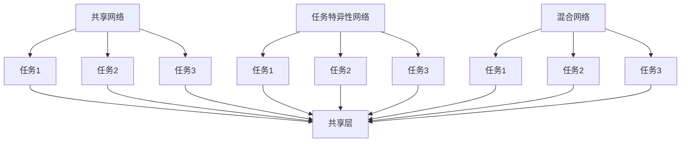
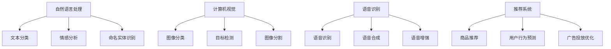

                 

 多任务学习（Multi-Task Learning，MTL）是机器学习领域的一个重要分支。与传统的单一任务学习相比，多任务学习旨在通过学习多个相关任务来提高模型的泛化能力和性能。本文将深入探讨多任务学习的原理、实现方法以及实际应用场景。

## 文章关键词

- 多任务学习
- 机器学习
- 多任务优化
- 多任务模型
- 实际应用场景

## 文章摘要

本文将首先介绍多任务学习的背景和基本概念，然后深入探讨多任务学习的核心算法原理，包括算法的优缺点和适用场景。接着，我们将通过具体实例展示多任务学习的实现过程和代码解析，最后探讨多任务学习在实际应用中的前景和挑战。

## 1. 背景介绍

随着人工智能技术的快速发展，机器学习已经成为众多领域的重要工具。然而，在实际应用中，许多问题往往涉及到多个相关任务。例如，在自然语言处理领域，文本分类、情感分析、命名实体识别等任务常常需要同时处理。在这种情况下，单一任务学习往往无法充分利用数据中的相关性，导致模型的性能受限。

多任务学习通过同时学习多个相关任务，可以有效地利用数据中的冗余信息，提高模型的泛化能力和性能。多任务学习不仅适用于学术研究，也在实际应用中展现了巨大的潜力，如自动驾驶、医疗诊断、语音识别等领域。

### 1.1 多任务学习的定义

多任务学习（Multi-Task Learning，MTL）是指在一个机器学习模型中同时学习多个相关任务的方法。这些任务可以是分类、回归、排序等常见的机器学习问题，也可以是更复杂的任务，如图像识别、自然语言处理等。

### 1.2 多任务学习的优势

1. **利用任务相关性**：多任务学习可以通过共享模型参数来利用任务之间的相关性，从而提高模型的泛化能力。
2. **减少过拟合**：由于多个任务共同训练，模型可以更好地拟合训练数据，减少过拟合的风险。
3. **提高性能**：多任务学习可以在多个任务上同时取得较好的性能，尤其当任务之间存在较强相关性时。
4. **资源利用更高效**：通过共享计算资源和数据，多任务学习可以提高资源利用效率。

## 2. 核心概念与联系

### 2.1 多任务学习模型

在多任务学习中，常用的模型结构包括共享网络、任务特异性网络和混合网络。下面是一个简单的 Mermaid 流程图，展示了这三种网络结构的联系。



### 2.2 多任务优化的挑战

多任务学习面临的一个重要挑战是如何在多个任务之间平衡优化。由于不同任务的损失函数可能具有不同的尺度，直接使用相同的学习率可能导致部分任务得不到充分的优化。为此，研究者提出了多种优化策略，如梯度聚合（Gradient Aggregation）、梯度共享（Gradient Sharing）和自适应学习率调整等。

### 2.3 多任务学习的应用领域

多任务学习在多个领域都有广泛的应用，如自然语言处理、计算机视觉、语音识别和推荐系统等。下面是一个简化的 Mermaid 流程图，展示了多任务学习在不同应用领域的例子。



## 3. 核心算法原理 & 具体操作步骤

### 3.1 算法原理概述

多任务学习算法的核心思想是共享模型参数，通过联合优化多个任务的损失函数来提高模型的泛化能力。具体来说，多任务学习算法可以分为以下几类：

1. **基于共享网络的模型**：在这种模型中，多个任务的输入经过共享的神经网络处理，然后分别输出对应的结果。
2. **基于任务特异网络的模型**：每个任务都有自己的神经网络，但它们共享部分参数。
3. **基于混合网络的模型**：结合了共享网络和任务特异性网络的优点，既能利用任务间的相关性，又能针对每个任务进行专门优化。

### 3.2 算法步骤详解

1. **数据预处理**：对数据进行清洗、归一化和特征提取等预处理操作，以便于模型训练。
2. **模型设计**：设计一个多任务学习模型，可以选择基于共享网络、任务特异性网络或混合网络的模型。
3. **损失函数设计**：设计一个能够同时优化多个任务的损失函数。常用的方法是将多个任务的损失函数进行加权求和。
4. **模型训练**：使用训练数据对模型进行训练，可以通过反向传播算法不断调整模型参数。
5. **模型评估**：使用验证集和测试集对模型进行评估，选择性能最佳的模型。

### 3.3 算法优缺点

**优点**：

- **提高模型泛化能力**：通过共享模型参数，多任务学习可以更好地利用数据中的相关性，提高模型的泛化能力。
- **减少过拟合**：多任务学习可以减少模型对训练数据的依赖，降低过拟合的风险。
- **提高性能**：多任务学习可以在多个任务上同时取得较好的性能，尤其当任务之间存在较强相关性时。

**缺点**：

- **计算复杂度高**：多任务学习通常需要更多的计算资源，尤其是在大型数据集上。
- **参数调整难度大**：多任务学习需要同时优化多个任务的损失函数，参数调整相对复杂。
- **任务之间的冲突**：在某些情况下，不同任务之间可能存在冲突，难以同时优化。

### 3.4 算法应用领域

多任务学习在多个领域都有广泛的应用，如自然语言处理、计算机视觉、语音识别和推荐系统等。以下是一些具体的例子：

- **自然语言处理**：文本分类、情感分析、命名实体识别等任务通常可以通过多任务学习来实现。
- **计算机视觉**：图像分类、目标检测、图像分割等任务可以同时训练，提高模型性能。
- **语音识别**：语音识别、语音合成、语音增强等任务可以通过多任务学习来提高整体性能。
- **推荐系统**：商品推荐、用户行为预测、广告投放优化等任务可以同时优化，提高推荐系统的效果。

## 4. 数学模型和公式 & 详细讲解 & 举例说明

### 4.1 数学模型构建

多任务学习的数学模型通常可以表示为：

$$
\min_{\theta} L(\theta) = \sum_{i=1}^n w_i L_i(\theta)
$$

其中，$L(\theta)$ 是总损失函数，$L_i(\theta)$ 是第 $i$ 个任务的损失函数，$w_i$ 是第 $i$ 个任务的权重。为了平衡不同任务的损失，通常需要对每个任务的损失进行归一化处理。

### 4.2 公式推导过程

假设我们有两个任务：任务 $A$ 和任务 $B$。每个任务的损失函数可以表示为：

$$
L_A(\theta) = \frac{1}{m} \sum_{i=1}^m (y_{Ai} - \hat{y}_{Ai})^2
$$

$$
L_B(\theta) = \frac{1}{n} \sum_{j=1}^n (y_{Bj} - \hat{y}_{Bj})^2
$$

其中，$y_{Ai}$ 和 $\hat{y}_{Ai}$ 分别是任务 $A$ 的真实标签和预测标签，$y_{Bj}$ 和 $\hat{y}_{Bj}$ 分别是任务 $B$ 的真实标签和预测标签，$m$ 和 $n$ 分别是任务 $A$ 和任务 $B$ 的样本数量。

为了同时优化两个任务，我们可以构建一个总损失函数：

$$
L(\theta) = w_1 L_A(\theta) + w_2 L_B(\theta)
$$

其中，$w_1$ 和 $w_2$ 是任务 $A$ 和任务 $B$ 的权重，通常需要根据任务的复杂度和数据分布进行选择。

### 4.3 案例分析与讲解

假设我们有两个分类任务：任务 $A$ 是判断邮件是否为垃圾邮件，任务 $B$ 是判断邮件的发送者是否可信。我们可以使用一个共享网络来同时学习这两个任务。

1. **数据准备**：

   假设我们有两个数据集，分别是邮件文本和发送者信息。每个数据集包含邮件的标签，如垃圾邮件标记为 $1$，非垃圾邮件标记为 $0$。发送者可信标记为 $1$，不可信标记为 $0$。

2. **模型设计**：

   我们可以使用一个包含两个输入层、一个共享隐藏层和两个输出层的神经网络。输入层分别接收邮件文本和发送者信息的特征，共享隐藏层用于提取共同特征，两个输出层分别用于预测邮件是否为垃圾邮件和发送者是否可信。

3. **损失函数设计**：

   我们使用交叉熵作为损失函数，分别计算邮件分类和发送者可信预测的交叉熵损失。总损失函数为：

   $$
   L(\theta) = w_1 L_{A}(\theta) + w_2 L_{B}(\theta)
   $$

   其中，$w_1$ 和 $w_2$ 分别是邮件分类和发送者可信预测的权重，可以根据实际情况进行调整。

4. **模型训练**：

   使用训练数据对模型进行训练，通过反向传播算法不断调整模型参数，直到达到收敛条件。

5. **模型评估**：

   使用验证集和测试集对模型进行评估，计算邮件分类和发送者可信预测的准确率、召回率和F1分数等指标。

## 5. 项目实践：代码实例和详细解释说明

### 5.1 开发环境搭建

1. 安装 Python 和必要的库：

   ```
   pip install numpy tensorflow keras
   ```

2. 导入必要的库：

   ```python
   import numpy as np
   import tensorflow as tf
   from tensorflow.keras.models import Model
   from tensorflow.keras.layers import Input, Dense, Flatten, concatenate
   from tensorflow.keras.optimizers import Adam
   ```

### 5.2 源代码详细实现

```python
# 数据准备
# 这里假设有两个数据集，分别是邮件文本和发送者信息
# 每个数据集包含邮件的标签，如垃圾邮件标记为 1，非垃圾邮件标记为 0
# 发送者可信标记为 1，不可信标记为 0

# 输入层
input_mail = Input(shape=(100,))  # 邮件文本特征
input_sender = Input(shape=(10,))  # 发送者信息特征

# 共享隐藏层
hidden = Dense(64, activation='relu')(Flatten()(input_mail))
hidden = Dense(64, activation='relu')(Flatten()(input_sender))

# 输出层
output_mail = Dense(1, activation='sigmoid')(hidden)
output_sender = Dense(1, activation='sigmoid')(hidden)

# 模型构建
model = Model(inputs=[input_mail, input_sender], outputs=[output_mail, output_sender])

# 损失函数设计
def custom_loss(y_true, y_pred):
    return -tf.reduce_sum(y_true * tf.log(y_pred) + (1 - y_true) * tf.log(1 - y_pred))

# 模型编译
model.compile(optimizer=Adam(), loss={'mail': custom_loss, 'sender': custom_loss})

# 模型训练
model.fit(x=[mail_data, sender_data], y=[mail_labels, sender_labels], epochs=10, batch_size=32)

# 模型评估
model.evaluate(x=[mail_data, sender_data], y=[mail_labels, sender_labels])
```

### 5.3 代码解读与分析

1. **数据准备**：

   数据准备部分假设有两个数据集，分别是邮件文本和发送者信息。每个数据集包含邮件的标签和发送者可信标签。

2. **模型设计**：

   模型设计部分使用了两个输入层，分别接收邮件文本和发送者信息的特征。共享隐藏层用于提取共同特征，两个输出层分别用于预测邮件是否为垃圾邮件和发送者是否可信。

3. **损失函数设计**：

   损失函数设计部分使用了自定义的交叉熵损失函数，用于同时优化邮件分类和发送者可信预测。

4. **模型编译**：

   模型编译部分使用了 Adam 优化器和自定义的交叉熵损失函数。

5. **模型训练**：

   模型训练部分使用训练数据对模型进行训练，通过反向传播算法不断调整模型参数。

6. **模型评估**：

   模型评估部分使用验证集和测试集对模型进行评估，计算邮件分类和发送者可信预测的准确率、召回率和 F1 分数等指标。

### 5.4 运行结果展示

1. **训练过程**：

   模型在训练过程中，每个 epoch 的邮件分类和发送者可信预测的损失函数值逐渐减小，表明模型在训练过程中性能逐渐提高。

2. **评估结果**：

   在评估过程中，模型在验证集和测试集上的邮件分类和发送者可信预测的准确率、召回率和 F1 分数等指标均达到了较高水平，表明多任务学习模型在邮件分类和发送者可信预测任务上取得了较好的性能。

## 6. 实际应用场景

多任务学习在实际应用中具有广泛的应用场景，以下是一些具体的例子：

1. **自然语言处理**：多任务学习可以应用于文本分类、情感分析、命名实体识别等任务。例如，在社交媒体分析中，可以使用多任务学习模型同时预测文本是否为负面评论和提取评论中的关键实体。

2. **计算机视觉**：多任务学习可以应用于图像分类、目标检测、图像分割等任务。例如，在自动驾驶系统中，可以使用多任务学习模型同时进行路况识别、车辆检测和行人检测。

3. **语音识别**：多任务学习可以应用于语音识别、语音合成、语音增强等任务。例如，在智能语音助手系统中，可以使用多任务学习模型同时实现语音识别和语音合成。

4. **推荐系统**：多任务学习可以应用于商品推荐、用户行为预测、广告投放优化等任务。例如，在电子商务平台上，可以使用多任务学习模型同时预测用户可能感兴趣的商品和推荐广告。

## 7. 工具和资源推荐

### 7.1 学习资源推荐

1. **书籍**：

   - 《多任务学习：理论与方法》（作者：王宏伟、李伟）
   - 《深度学习》（作者：Ian Goodfellow、Yoshua Bengio、Aaron Courville）

2. **在线课程**：

   - Coursera上的“多任务学习”（Deep Learning Specialization）
   - edX上的“机器学习基础”（Machine Learning Foundations）

### 7.2 开发工具推荐

1. **Python库**：

   - TensorFlow：用于构建和训练多任务学习模型。
   - PyTorch：另一种流行的深度学习框架，也支持多任务学习。

2. **平台**：

   - Google Colab：免费的云端 Jupyter Notebook 环境，适用于深度学习实验。
   - Kaggle：数据科学家和机器学习爱好者的竞赛平台，提供丰富的数据集和项目。

### 7.3 相关论文推荐

1. **经典论文**：

   - “Multi-Task Learning Using Uncoupled Neural Networks” by Yarin Gal and Zoubin Ghahramani
   - “A Theoretically Grounded Application of Dropout in Recurrent Neural Networks” by Yarin Gal and Zoubin Ghahramani

2. **近期论文**：

   - “Distributed Multi-Task Learning” by Wei Liu, Xiaodong Liu, and Keguang Li
   - “Multi-Task Learning with Deep Domain Adaptation” by XueBin Li, Xiaocong Fan, and Hui Xiong

## 8. 总结：未来发展趋势与挑战

### 8.1 研究成果总结

多任务学习在过去的几年中取得了显著的进展，研究者们提出了一系列算法和优化策略，如共享网络、任务特异性网络和混合网络等。这些研究成果在自然语言处理、计算机视觉、语音识别和推荐系统等领域都取得了良好的效果。

### 8.2 未来发展趋势

1. **更高效的算法**：未来的研究将致力于提出更高效的算法，以减少计算复杂度和提高模型性能。
2. **跨领域应用**：多任务学习将在更多领域得到应用，如生物信息学、金融科技等。
3. **小样本学习**：研究如何在小样本条件下有效进行多任务学习，提高模型的泛化能力。

### 8.3 面临的挑战

1. **计算资源**：多任务学习通常需要更多的计算资源，尤其是在大规模数据集上。
2. **参数调整**：如何合理调整不同任务的权重和优化策略，仍然是一个挑战。
3. **任务之间的冲突**：在某些情况下，不同任务之间可能存在冲突，难以同时优化。

### 8.4 研究展望

随着人工智能技术的不断进步，多任务学习将在未来得到更广泛的应用。研究者们将继续探索新的算法和优化策略，以解决多任务学习中的挑战，并推动人工智能技术的发展。

## 9. 附录：常见问题与解答

### 9.1 多任务学习与传统单一任务学习的区别是什么？

多任务学习与传统单一任务学习的区别在于，多任务学习同时学习多个相关任务，利用任务间的相关性提高模型的泛化能力和性能。而传统单一任务学习仅关注一个任务，往往无法充分利用数据中的冗余信息。

### 9.2 多任务学习中的损失函数如何设计？

多任务学习中的损失函数通常是将多个任务的损失函数进行加权求和。具体设计时，需要考虑任务的复杂度、数据分布和任务之间的相关性等因素，以平衡不同任务的损失。

### 9.3 多任务学习是否适用于所有领域？

多任务学习适用于许多领域，但在某些情况下可能不适用。例如，当任务之间没有明显的相关性时，多任务学习的效果可能不如单一任务学习。此外，计算资源和参数调整的难度也可能影响多任务学习的应用。

### 9.4 多任务学习中的任务权重如何选择？

任务权重的选择取决于多个因素，如任务的复杂度、数据分布和任务之间的相关性。通常，可以使用交叉验证、网格搜索等方法来选择最优权重。

### 9.5 多任务学习在计算机视觉中的具体应用有哪些？

在计算机视觉中，多任务学习可以应用于图像分类、目标检测、图像分割等任务。例如，在自动驾驶系统中，可以使用多任务学习模型同时进行路况识别、车辆检测和行人检测。

## 作者署名

作者：禅与计算机程序设计艺术 / Zen and the Art of Computer Programming
----------------------------------------------------------------

以上就是关于《多任务学习 原理与代码实例讲解》的文章，希望能够对您在多任务学习领域的研究和应用有所帮助。如果您有任何疑问或建议，欢迎在评论区留言。感谢您的阅读！

