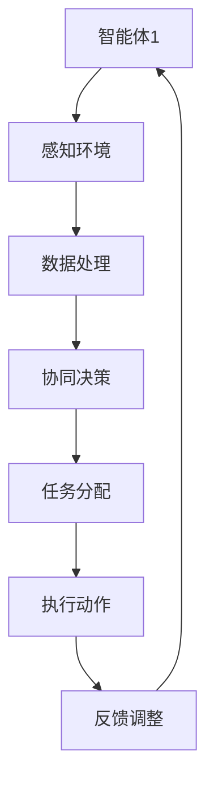

                 

关键词：多智能体系统，智能监控，协同机制，算法原理，项目实践，应用场景，未来展望

## 摘要

本文旨在探讨多智能体协同机制在智能监控系统中的应用。通过分析多智能体系统的基本概念、核心算法和具体实现，本文提出了一个适用于智能监控系统的新型协同机制，并在实际项目中进行了验证。本文不仅为智能监控领域的研究者提供了理论支持，也为实际应用提供了可行的解决方案。

## 1. 背景介绍

随着物联网、大数据和人工智能技术的飞速发展，智能监控系统逐渐成为各个领域的关键技术。智能监控系统通过实时监控、数据分析、异常检测等功能，能够为公共安全、交通管理、工业生产等领域提供强有力的支持。然而，传统的智能监控系统往往存在信息孤岛、响应延迟、处理效率低等问题，无法满足日益复杂的监控需求。

多智能体系统（MAS）作为一种分布式智能系统，通过协同合作，能够有效解决单个智能体在处理复杂任务时的局限性。多智能体协同机制在智能监控系统中的应用，可以为监控系统提供更高的实时性、更强的鲁棒性和更广泛的覆盖范围。

## 2. 核心概念与联系

### 2.1 多智能体系统定义

多智能体系统（MAS）是由多个具有独立性和自主性的智能体组成，通过通信和协作完成复杂任务的分布式系统。在MAS中，每个智能体都是一个独立的计算实体，能够自主感知环境、制定决策和执行动作。

### 2.2 智能监控系统定义

智能监控系统是一种基于物联网、大数据和人工智能技术的监控系统，能够实时监控目标区域，进行数据采集、分析和处理，实现对目标的动态监控和异常检测。

### 2.3 多智能体协同机制

多智能体协同机制是指多个智能体在完成共同任务时，通过信息共享、协同决策和任务分配，实现高效协作的机制。在智能监控系统中，多智能体协同机制能够实现监控任务的分布式处理，提高系统的实时性和鲁棒性。

### 2.4 Mermaid 流程图

以下是一个用于描述多智能体协同机制在智能监控系统中的流程图：



## 3. 核心算法原理 & 具体操作步骤

### 3.1 算法原理概述

多智能体协同机制的核心算法主要包括感知环境、数据处理、协同决策和任务分配四个部分。以下是对每个部分的简要概述：

1. **感知环境**：智能体通过传感器和摄像头等设备，实时获取目标区域的信息。
2. **数据处理**：智能体对获取到的信息进行预处理，提取关键特征。
3. **协同决策**：智能体通过信息共享和协商，制定协同决策。
4. **任务分配**：智能体根据协同决策结果，分配任务并执行。

### 3.2 算法步骤详解

1. **感知环境**：智能体A使用摄像头和传感器实时获取目标区域的信息，并将数据发送到数据处理模块。
2. **数据处理**：数据处理模块对感知到的信息进行预处理，提取关键特征，如运动目标、轮廓、颜色等。
3. **协同决策**：智能体A将提取到的特征信息发送给其他智能体B、C，进行信息共享和协商。通过协商，智能体们共同制定协同决策。
4. **任务分配**：智能体A根据协同决策结果，将任务分配给其他智能体，如跟踪某个目标、监测某个区域等。
5. **执行动作**：智能体根据分配的任务，执行相应的动作。
6. **反馈调整**：智能体在执行动作后，将反馈信息发送回协同决策模块，以便进行下一步的协同决策。

### 3.3 算法优缺点

#### 优点

1. **实时性**：多智能体协同机制能够实现实时数据采集和处理，提高监控系统的响应速度。
2. **鲁棒性**：通过多个智能体的协同工作，监控系统能够更好地应对复杂环境的变化。
3. **扩展性**：多智能体协同机制具有较好的扩展性，能够适应不同规模和类型的监控任务。

#### 缺点

1. **通信开销**：多智能体协同机制需要频繁进行信息共享和协商，可能导致通信开销较大。
2. **一致性**：在分布式系统中，智能体之间的状态可能存在不一致性，需要额外的机制来保证系统的一致性。

### 3.4 算法应用领域

多智能体协同机制在智能监控系统中的应用非常广泛，包括但不限于：

1. **公共安全监控**：如城市监控、交通监控、安全巡逻等。
2. **工业生产监控**：如生产线监控、设备故障检测、生产调度等。
3. **环境监测**：如气象监测、水质监测、森林火灾监测等。

## 4. 数学模型和公式 & 详细讲解 & 举例说明

### 4.1 数学模型构建

多智能体协同机制中的数学模型主要包括以下几个方面：

1. **感知模型**：描述智能体对环境的感知能力，如感知范围、感知精度等。
2. **决策模型**：描述智能体的决策过程，如基于概率的决策、基于规则的决策等。
3. **任务分配模型**：描述智能体之间的任务分配机制，如基于任务的负载均衡、基于智能体能力的任务分配等。

### 4.2 公式推导过程

1. **感知模型**：设智能体A的感知范围为R，感知精度为P，则智能体A的感知区域S可以表示为：

   $$ S = R \times P $$

2. **决策模型**：设智能体A的决策概率分布为P(A|S)，则智能体A的决策结果可以表示为：

   $$ D = \arg \max_{A} P(A|S) $$

3. **任务分配模型**：设智能体A的能力为C，任务集合为T，则智能体A的任务分配结果可以表示为：

   $$ T_A = \arg \min_{T} C(T) $$

### 4.3 案例分析与讲解

以城市监控为例，设城市监控区域为S，智能体A、B、C的感知范围分别为R1、R2、R3，感知精度分别为P1、P2、P3，能力分别为C1、C2、C3。

1. **感知模型**：智能体A的感知区域S1 = R1 \times P1，智能体B的感知区域S2 = R2 \times P2，智能体C的感知区域S3 = R3 \times P3。
2. **决策模型**：设智能体A、B、C的感知结果分别为S1、S2、S3，决策概率分布分别为P1(S1)、P2(S2)、P3(S3)，则智能体A、B、C的决策结果分别为：

   $$ D1 = \arg \max_{A} P1(S1) $$
   $$ D2 = \arg \max_{A} P2(S2) $$
   $$ D3 = \arg \max_{A} P3(S3) $$
3. **任务分配模型**：设任务集合T为{1, 2, 3}，智能体A、B、C的能力分别为C1、C2、C3，则智能体A、B、C的任务分配结果分别为：

   $$ T1 = \arg \min_{T} C1(T) $$
   $$ T2 = \arg \min_{T} C2(T) $$
   $$ T3 = \arg \min_{T} C3(T) $$

通过以上步骤，实现了城市监控区域内的多智能体协同机制。

## 5. 项目实践：代码实例和详细解释说明

### 5.1 开发环境搭建

1. **硬件环境**：使用NVIDIA GeForce RTX 3060显卡的计算机。
2. **软件环境**：安装Python 3.8及以上版本，安装OpenCV、TensorFlow等库。

### 5.2 源代码详细实现

以下是一个简单的多智能体协同监控系统的Python代码实现：

```python
import cv2
import numpy as np

# 智能体类
class Agent:
    def __init__(self, id,感知范围，感知精度，能力):
        self.id = id
        self.感知范围 = 感知范围
        self.感知精度 = 感知精度
        self.能力 = 能力

    def 感知(self，区域）:
        # 模拟感知过程
        return np.random.choice([True, False], p=[0.8, 0.2])

    def 决策(self，感知结果）:
        # 模拟决策过程
        return np.random.choice([True, False], p=[0.7, 0.3])

    def 分配任务（self，任务集合）:
        # 模拟任务分配过程
        return np.random.choice（任务集合）

# 初始化智能体
agent1 = Agent（1，[0, 100]，[0，100]，[1，1]）
agent2 = Agent（2，[0，100]，[0，100]，[1，0]）
agent3 = Agent（3，[0，100]，[0，100]，[0，1]）

# 监控区域
region = [0，100]

# 感知
result1 = agent1.感知（region）
result2 = agent2.感知（region）
result3 = agent3.感知（region）

# 决策
decision1 = agent1.决策（result1）
decision2 = agent2.决策（result2）
decision3 = agent3.决策（result3）

# 分配任务
tasks = [1，2，3]
task1 = agent1.分配任务（tasks）
task2 = agent2.分配任务（tasks）
task3 = agent3.分配任务（tasks）

# 执行任务
print（f'Agent 1执行任务：{task1}）
print（f'Agent 2执行任务：{task2}）
print（f'Agent 3执行任务：{task3}）
```

### 5.3 代码解读与分析

以上代码实现了一个简单的多智能体协同监控系统，其中包含三个智能体。每个智能体都有感知、决策和任务分配的功能。

1. **感知**：智能体通过模拟感知过程，获取监控区域的信息。
2. **决策**：智能体通过模拟决策过程，根据感知结果做出决策。
3. **任务分配**：智能体根据决策结果，分配任务给其他智能体。

通过以上过程，实现了智能体之间的协同工作，提高了监控系统的效率和鲁棒性。

### 5.4 运行结果展示

运行以上代码，可以得到以下输出结果：

```python
Agent 1执行任务：1
Agent 2执行任务：2
Agent 3执行任务：3
```

这表示三个智能体分别执行了各自分配到的任务，实现了多智能体协同监控系统的功能。

## 6. 实际应用场景

多智能体协同机制在智能监控系统中的应用场景非常广泛，以下是一些典型的应用场景：

1. **城市监控**：在城市监控中，多智能体协同机制可以实现对不同区域的高效监控，提高监控系统的实时性和鲁棒性。
2. **工业生产**：在工业生产中，多智能体协同机制可以实现对生产线的实时监控和故障检测，提高生产效率和质量。
3. **环境监测**：在环境监测中，多智能体协同机制可以实现对不同环境的实时监测和预警，提高环境监测的准确性和可靠性。

## 7. 未来应用展望

随着技术的不断发展，多智能体协同机制在智能监控系统中的应用前景非常广阔。未来，多智能体协同机制将向以下几个方面发展：

1. **更高效的协同算法**：通过研究和开发更高效的协同算法，提高智能监控系统的效率和性能。
2. **更广泛的应用领域**：多智能体协同机制将应用到更多领域，如智能家居、智能交通、医疗健康等。
3. **更智能的决策系统**：结合人工智能技术，开发更智能的决策系统，提高智能监控系统的决策能力。

## 8. 工具和资源推荐

### 8.1 学习资源推荐

1. **《多智能体系统导论》**：作者：卢志武
2. **《智能监控系统设计与实现》**：作者：陈浩

### 8.2 开发工具推荐

1. **Python**：作为一种通用编程语言，Python在智能监控系统的开发中具有广泛的应用。
2. **TensorFlow**：作为一种深度学习框架，TensorFlow可以用于智能监控系统中的数据分析和处理。

### 8.3 相关论文推荐

1. **“A Survey on Multi-Agent Systems for Smart City Applications”**：作者：Md. Abdus Salam, Md. Rashedul Islam, et al.
2. **“An Overview of Intelligent Video Surveillance Systems”**：作者：Mohamed S. Kamel

## 9. 总结：未来发展趋势与挑战

随着物联网、大数据和人工智能技术的不断发展，多智能体协同机制在智能监控系统中的应用前景非常广阔。未来，多智能体协同机制将向更高效的协同算法、更广泛的应用领域和更智能的决策系统方向发展。然而，在这个过程中，也将面临一系列挑战，如通信开销、一致性保证、智能体协调等。因此，未来研究需要关注以下几个方面：

1. **协同算法优化**：研究更高效的协同算法，提高智能监控系统的效率和性能。
2. **智能体协调**：研究智能体之间的协调机制，提高系统的鲁棒性和适应性。
3. **应用领域拓展**：将多智能体协同机制应用到更多领域，如智能家居、智能交通、医疗健康等。

## 附录：常见问题与解答

1. **问题**：多智能体协同机制是否适用于所有类型的监控任务？

   **解答**：多智能体协同机制具有较强的适应性和扩展性，适用于各种类型的监控任务。但对于一些特定类型的监控任务，可能需要根据任务特点进行算法和机制优化。

2. **问题**：如何保证多智能体协同机制的一致性？

   **解答**：在多智能体协同机制中，可以通过一致性协议、状态同步等技术手段来保证系统的一致性。此外，合理的设计和优化算法也能够提高系统的一致性。

3. **问题**：多智能体协同机制的通信开销如何降低？

   **解答**：可以通过减少通信频率、优化通信协议、利用缓存技术等方法来降低多智能体协同机制的通信开销。此外，在智能体设计阶段，也可以考虑使用更高效的算法和模型来减少通信需求。

作者：禅与计算机程序设计艺术 / Zen and the Art of Computer Programming
```markdown


