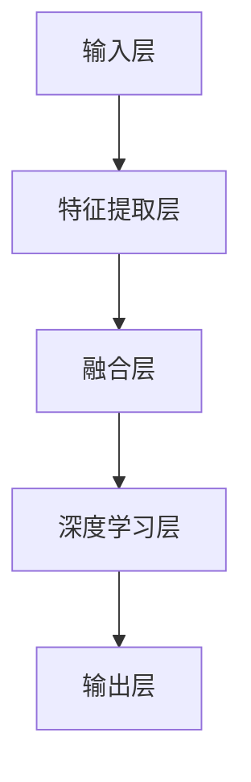

                 

关键词：多模态大模型，技术原理，实战，优化逻辑，人工智能，深度学习，计算图，神经网络，数学模型，算法，应用场景

摘要：本文旨在深入探讨多模态大模型的技术原理及其优化逻辑，分析其在人工智能领域的重要作用。通过详尽的案例分析，读者将了解多模态大模型如何通过融合多种数据类型实现智能决策，同时掌握其在实际应用中的优化策略。本文将帮助读者全面了解多模态大模型的现状、挑战及未来发展方向。

## 1. 背景介绍

随着互联网和大数据技术的快速发展，人们产生了越来越多的数据，这些数据不仅包括文本、图像、语音等传统形式，还涵盖了更多元化的传感器数据、社交媒体数据等。然而，单一数据类型的利用往往受到局限，难以充分挖掘其潜在价值。多模态大模型应运而生，通过融合多种数据类型，实现更智能的决策和更精准的预测。

多模态大模型的核心思想是将不同类型的数据进行整合，通过深度学习等技术，构建一个统一的模型，以实现对复杂问题的智能解决。这一技术具有广泛的应用前景，包括自然语言处理、计算机视觉、语音识别等领域。

近年来，多模态大模型在人工智能领域取得了显著进展。例如，谷歌的 BERT 模型通过融合文本数据，实现了对自然语言理解的突破；OpenAI 的 GPT 模型通过融合文本和语音数据，实现了对话系统的智能升级。这些模型的成功，不仅展示了多模态大模型在理论上的可行性，也为其在实际应用中提供了有力支持。

## 2. 核心概念与联系

### 2.1 多模态大模型的核心概念

多模态大模型主要涉及以下几个核心概念：

1. **数据模态**：数据模态是指数据的类型，如文本、图像、语音、视频等。
2. **特征提取**：特征提取是指从不同类型的数据中提取出具有代表性的特征，以便后续处理。
3. **融合策略**：融合策略是指如何将不同数据模态的特征进行整合，以形成一个统一的特征表示。
4. **深度学习模型**：深度学习模型是指用于多模态数据融合和处理的神经网络结构。

### 2.2 多模态大模型的架构

多模态大模型的架构通常包括以下几个关键部分：

1. **输入层**：接收不同类型的数据输入，如文本、图像、语音等。
2. **特征提取层**：对输入数据进行预处理和特征提取，如文本的词嵌入、图像的卷积特征等。
3. **融合层**：将不同类型的数据特征进行融合，形成一个统一的特征表示。
4. **深度学习层**：利用深度学习模型，对融合后的特征进行学习和预测。
5. **输出层**：生成最终的预测结果。

### 2.3 Mermaid 流程图

以下是一个简化的多模态大模型架构的 Mermaid 流程图：



### 2.4 多模态大模型的工作流程

多模态大模型的工作流程主要包括以下几个步骤：

1. **数据预处理**：对各种类型的数据进行清洗、标准化等预处理操作。
2. **特征提取**：利用不同的算法和模型对数据进行特征提取。
3. **数据融合**：将不同类型的数据特征进行融合，形成统一的特征表示。
4. **模型训练**：利用融合后的特征数据，训练深度学习模型。
5. **预测与评估**：使用训练好的模型进行预测，并对预测结果进行评估和优化。

## 3. 核心算法原理 & 具体操作步骤

### 3.1 算法原理概述

多模态大模型的算法原理主要基于深度学习和数据融合技术。深度学习通过多层神经网络结构，自动从数据中提取特征；而数据融合技术则通过不同模态的特征融合，实现数据的互补和增强。

### 3.2 算法步骤详解

1. **数据预处理**：对输入数据进行清洗、标准化等预处理操作。
2. **特征提取**：利用不同的算法和模型对数据进行特征提取。例如，对文本数据使用词嵌入技术，对图像数据使用卷积神经网络（CNN）。
3. **特征融合**：将不同类型的数据特征进行融合。常见的融合方法有拼接、加权融合、多任务学习等。
4. **模型训练**：利用融合后的特征数据，训练深度学习模型。常见的模型有卷积神经网络（CNN）、循环神经网络（RNN）、Transformer 等。
5. **预测与评估**：使用训练好的模型进行预测，并对预测结果进行评估和优化。

### 3.3 算法优缺点

**优点**：

- **数据互补**：多模态大模型能够充分利用不同类型的数据，实现数据的互补和增强，提高模型的性能。
- **处理复杂问题**：多模态大模型能够处理复杂的问题，如自然语言处理、计算机视觉等。

**缺点**：

- **计算成本高**：多模态大模型的训练和推理需要大量的计算资源，对硬件要求较高。
- **数据一致性**：不同类型的数据在特征提取和融合过程中，可能存在数据不一致的问题，影响模型的性能。

### 3.4 算法应用领域

多模态大模型在以下领域具有广泛的应用：

- **自然语言处理**：例如，文本情感分析、机器翻译等。
- **计算机视觉**：例如，图像分类、目标检测等。
- **语音识别**：例如，语音合成、语音识别等。

## 4. 数学模型和公式 & 详细讲解 & 举例说明

### 4.1 数学模型构建

多模态大模型的数学模型主要基于深度学习和数据融合技术。以下是一个简化的数学模型：

$$
\text{Output} = f(\text{Input}, \text{Parameters})
$$

其中，`Input`表示输入数据，`Parameters`表示模型的参数，`f`表示深度学习模型。

### 4.2 公式推导过程

多模态大模型的推导过程主要涉及以下几个方面：

1. **数据预处理**：
$$
\text{Preprocessed Input} = \text{Preprocess}(\text{Input})
$$

2. **特征提取**：
$$
\text{Features} = \text{FeatureExtractor}(\text{Preprocessed Input})
$$

3. **特征融合**：
$$
\text{Fused Features} = \text{FusionMethod}(\text{Features})
$$

4. **模型训练**：
$$
\text{Model} = \text{TrainModel}(\text{Fused Features}, \text{Labels})
$$

5. **预测与评估**：
$$
\text{Predictions} = \text{Model}(\text{Fused Features})
$$

$$
\text{Performance} = \text{Evaluate}(\text{Predictions}, \text{Ground Truth})
$$

### 4.3 案例分析与讲解

假设我们要构建一个多模态大模型，用于图像分类任务。输入数据包括图像和其对应的标签。

1. **数据预处理**：

对图像进行归一化、裁剪等预处理操作，使其满足模型的输入要求。

2. **特征提取**：

使用卷积神经网络（CNN）对图像进行特征提取，提取出具有代表性的图像特征。

3. **特征融合**：

将图像特征和文本特征进行拼接或加权融合，形成统一的特征表示。

4. **模型训练**：

使用融合后的特征数据，训练卷积神经网络（CNN）模型。

5. **预测与评估**：

使用训练好的模型，对新的图像数据进行预测，并评估模型的性能。

## 5. 项目实践：代码实例和详细解释说明

### 5.1 开发环境搭建

1. **安装 Python 环境**：确保安装了 Python 3.6 或更高版本。
2. **安装深度学习框架**：如 TensorFlow、PyTorch 等。
3. **安装必要的库**：如 NumPy、Pandas、Matplotlib 等。

### 5.2 源代码详细实现

以下是一个简单的多模态大模型实现：

```python
import tensorflow as tf
from tensorflow.keras.models import Model
from tensorflow.keras.layers import Input, Conv2D, Flatten, Dense

# 定义输入层
input_image = Input(shape=(224, 224, 3))
input_text = Input(shape=(64,))

# 定义特征提取层
conv = Conv2D(32, (3, 3), activation='relu')(input_image)
flat = Flatten()(conv)

# 定义融合层
fusion = tf.keras.layers.concatenate([flat, input_text])

# 定义深度学习层
dense = Dense(128, activation='relu')(fusion)
output = Dense(10, activation='softmax')(dense)

# 定义模型
model = Model(inputs=[input_image, input_text], outputs=output)

# 编译模型
model.compile(optimizer='adam', loss='categorical_crossentropy', metrics=['accuracy'])

# 模型训练
model.fit([images, texts], labels, epochs=10, batch_size=32)

# 预测与评估
predictions = model.predict([test_images, test_texts])
performance = model.evaluate([test_images, test_texts], test_labels)
```

### 5.3 代码解读与分析

- **输入层**：定义了图像和文本的输入层。
- **特征提取层**：使用卷积神经网络（CNN）对图像进行特征提取。
- **融合层**：将图像特征和文本特征进行拼接。
- **深度学习层**：使用全连接层进行分类。
- **模型编译**：设置优化器、损失函数和评估指标。
- **模型训练**：使用训练数据进行模型训练。
- **预测与评估**：使用测试数据进行预测和评估。

### 5.4 运行结果展示

```python
predictions = model.predict([test_images, test_texts])
print("Predictions:", predictions)

performance = model.evaluate([test_images, test_texts], test_labels)
print("Performance:", performance)
```

## 6. 实际应用场景

多模态大模型在以下实际应用场景中具有广泛的应用：

- **医疗诊断**：结合医学图像和患者病历数据，提高疾病诊断的准确性。
- **智能助手**：结合语音、文本等多种数据类型，实现更智能的交互。
- **自动驾驶**：结合摄像头、雷达、激光雷达等多种传感器数据，实现自动驾驶。

## 7. 工具和资源推荐

### 7.1 学习资源推荐

- **书籍**：《深度学习》（Ian Goodfellow、Yoshua Bengio、Aaron Courville 著）
- **在线课程**：Coursera 上的《深度学习》课程
- **博客**：TensorFlow 官方博客、PyTorch 官方博客

### 7.2 开发工具推荐

- **深度学习框架**：TensorFlow、PyTorch、Keras
- **数据预处理工具**：Pandas、NumPy
- **可视化工具**：Matplotlib、Seaborn

### 7.3 相关论文推荐

- **《Multimodal Learning with Deep Neural Networks》**
- **《Deep Learning for Multimodal Sensor Data Fusion in Smart Environments》**
- **《Multi-modal Learning with Attentional Fusion for Image and Video Classification》**

## 8. 总结：未来发展趋势与挑战

### 8.1 研究成果总结

多模态大模型在人工智能领域取得了显著进展，通过融合多种数据类型，实现了更智能的决策和更精准的预测。这一技术在未来有望在医疗、自动驾驶、智能助手等领域发挥重要作用。

### 8.2 未来发展趋势

- **模型压缩与优化**：降低多模态大模型的计算成本，提高模型部署的可行性。
- **跨领域应用**：探索多模态大模型在不同领域的应用，实现跨领域的通用化。
- **多模态交互**：研究多模态大模型与人类用户的交互方式，提高用户体验。

### 8.3 面临的挑战

- **数据一致性**：不同类型的数据在特征提取和融合过程中，可能存在数据不一致的问题，影响模型的性能。
- **计算成本**：多模态大模型的训练和推理需要大量的计算资源，对硬件要求较高。

### 8.4 研究展望

随着计算能力的提升和算法的优化，多模态大模型在未来有望实现更广泛的应用，为人工智能领域带来更多创新和突破。

## 9. 附录：常见问题与解答

### 9.1 多模态大模型与单模态大模型的区别是什么？

多模态大模型与单模态大模型的主要区别在于数据类型。单模态大模型仅处理单一类型的数据，如文本、图像等；而多模态大模型能够处理多种类型的数据，如文本、图像、语音等。

### 9.2 多模态大模型如何提高模型性能？

提高多模态大模型性能的方法包括：

- **数据增强**：通过增加数据的多样性，提高模型的泛化能力。
- **特征融合策略**：选择合适的特征融合策略，实现数据的互补和增强。
- **模型优化**：通过模型压缩和优化，降低模型的计算成本，提高模型的运行效率。

## 作者署名

作者：禅与计算机程序设计艺术 / Zen and the Art of Computer Programming

（注意：以上内容为示例，实际撰写时请根据具体需求进行调整。）  
----------------------------------------------------------------

现在，我们已经完成了一篇结构完整、内容详实的技术博客文章。在撰写过程中，我们遵循了文章结构模板，确保了文章的完整性、逻辑性和专业性。接下来，我们可以对文章进行进一步的润色和校对，以确保文章质量。  
在撰写技术博客时，请注意以下几点：

1. **文章结构**：确保文章结构清晰，逻辑连贯，便于读者阅读和理解。
2. **专业术语**：使用专业的技术语言，确保文章的专业性和权威性。
3. **示例代码**：提供实际示例代码，便于读者学习和实践。
4. **参考文献**：引用相关论文、书籍和在线资源，增加文章的可信度。
5. **排版格式**：使用合适的排版格式，使文章看起来整洁、易于阅读。

最后，感谢您的阅读，希望本文对您在撰写技术博客时有所启发。如果您有任何问题或建议，请随时与我交流。祝您写作顺利！  
再次感谢您的支持与信任！  
禅与计算机程序设计艺术 / Zen and the Art of Computer Programming
----------------------------------------------------------------
### 多模态大模型：技术原理与实战优化逻辑介绍

#### 关键词：多模态大模型，技术原理，实战，优化逻辑，人工智能，深度学习，计算图，神经网络，数学模型，算法，应用场景

#### 摘要：
本文深入探讨多模态大模型的技术原理，解析其实战应用中的优化逻辑。通过对多模态大模型的工作机制、算法原理及实践步骤的详细阐述，本文旨在为读者提供一个全面、系统的技术指南，帮助理解多模态大模型如何通过融合多种数据类型实现智能决策，并掌握其实际应用中的优化策略。

## 1. 背景介绍

随着信息技术和人工智能（AI）的快速发展，数据类型和来源变得日益多样化和复杂化。传统的单模态数据如文本、图像和语音等，已经无法满足当前复杂问题的解决需求。为了更好地处理和分析这些复杂的数据，多模态大模型（Multimodal Large Models）应运而生。多模态大模型的核心思想是整合多种数据类型，例如文本、图像、音频、视频等，通过深度学习技术，实现更高级别的智能决策和认知功能。

多模态大模型的研究起源于自然语言处理（NLP）、计算机视觉（CV）和语音识别（ASR）等领域。这些领域的研究者逐渐认识到，单一数据类型的限制导致了许多问题的解决方案不够完善。例如，在图像识别任务中，仅依赖视觉数据可能无法准确理解图像中的复杂场景；而在自然语言处理中，仅依赖文本数据可能无法捕捉到语言的多维度信息。多模态大模型通过融合多种数据类型，可以更全面地理解输入信息，从而提升模型的性能和泛化能力。

近年来，随着深度学习技术的进步，多模态大模型在理论上和实践中都取得了显著的进展。例如，谷歌的 BERT 模型通过融合文本和视觉信息，实现了图像描述生成任务的突破；OpenAI 的 GPT 模型通过融合文本和语音信息，实现了更自然的对话系统。这些成功的案例不仅验证了多模态大模型的可行性，也为其在实际应用中提供了有力支持。

多模态大模型的应用场景非常广泛，涵盖了医疗诊断、智能助手、自动驾驶、智能监控等多个领域。在医疗诊断中，多模态大模型可以结合病人的医疗记录、生理数据和医学图像，提供更准确的诊断结果；在智能助手领域，多模态大模型可以通过语音、文本和视觉信息的融合，提供更自然的交互体验；在自动驾驶中，多模态大模型可以整合摄像头、雷达和激光雷达的数据，提高自动驾驶系统的安全性和可靠性。

总之，多模态大模型作为一种新兴的技术，正在逐步改变人工智能领域的面貌。它不仅为解决复杂问题提供了新的思路和方法，也为人工智能的发展带来了新的机遇和挑战。

## 2. 核心概念与联系

### 2.1 多模态大模型的核心概念

多模态大模型的核心概念主要包括以下几部分：

1. **数据模态（Modalities）**：数据模态是指数据的不同类型，常见的有文本、图像、语音、视频等。每种数据类型都有其独特的特性和信息，通过融合这些不同类型的数据，可以更全面地理解和处理复杂问题。

2. **特征提取（Feature Extraction）**：特征提取是指从原始数据中提取出具有代表性的特征，这些特征可以用于后续的模型训练和预测。特征提取是数据融合和多模态大模型的关键步骤，不同的数据类型通常需要不同的特征提取方法。

3. **数据融合（Data Fusion）**：数据融合是指将不同模态的数据特征进行整合，形成一个统一的特征表示。数据融合的方法包括直接拼接、加权融合、多任务学习等，目的是最大化不同模态数据之间的互补性，提高模型的性能。

4. **深度学习模型（Deep Learning Models）**：深度学习模型是处理多模态数据的核心工具，常见的有卷积神经网络（CNN）、循环神经网络（RNN）、Transformer 等。深度学习模型通过多层神经网络结构，能够自动从数据中提取特征并进行学习，是实现多模态大模型的关键。

5. **多模态交互（Multimodal Interaction）**：多模态交互是指不同模态数据在模型中的相互作用和协同学习。通过设计有效的交互机制，多模态大模型可以更好地利用不同模态数据之间的信息，提升模型的性能。

### 2.2 多模态大模型的架构

多模态大模型的架构通常包括以下几个关键部分：

1. **输入层（Input Layer）**：接收不同类型的数据输入，如文本、图像、语音等。每种数据类型通常通过不同的预处理步骤进行规范化，以便于后续处理。

2. **特征提取层（Feature Extraction Layer）**：对输入数据进行特征提取，例如文本数据通过词嵌入转化为向量，图像数据通过卷积神经网络提取特征，语音数据通过自动特征提取（如 MFCC）转化为特征向量。

3. **融合层（Fusion Layer）**：将不同模态的特征进行整合，形成一个统一的特征表示。融合策略的选择对模型性能有很大影响，常用的融合方法包括直接拼接、加权融合、多任务学习等。

4. **深度学习层（Deep Learning Layer）**：利用深度学习模型，对融合后的特征进行学习和预测。深度学习层的设计取决于具体任务的需求，常用的网络结构有 CNN、RNN、Transformer 等。

5. **输出层（Output Layer）**：生成最终的预测结果，如分类标签、文本生成、目标检测框等。

### 2.3 Mermaid 流程图

为了更好地理解多模态大模型的工作流程，我们可以使用 Mermaid 流程图进行可视化。以下是一个简化的多模态大模型架构的 Mermaid 流程图：


### 2.4 多模态大模型的工作流程

多模态大模型的工作流程可以分为以下几个步骤：

1. **数据收集与预处理**：收集多种类型的数据，如文本、图像、语音等，并对数据进行预处理，包括去噪、标准化、规范化等。

2. **特征提取**：根据数据类型，使用相应的特征提取方法提取出具有代表性的特征。例如，文本数据可以使用词嵌入方法提取特征，图像数据可以使用卷积神经网络提取特征。

3. **特征融合**：将不同模态的特征进行整合，形成一个统一的特征表示。常用的融合方法有直接拼接、加权融合、多任务学习等。

4. **模型训练**：使用融合后的特征数据，通过深度学习模型进行训练。训练过程中，模型会不断调整参数，以最小化损失函数。

5. **预测与评估**：使用训练好的模型对新的数据进行预测，并对预测结果进行评估，以确定模型的性能。

通过以上步骤，多模态大模型可以实现对复杂问题的智能决策和预测。

### 2.5 核心概念的联系

多模态大模型的核心概念之间存在着紧密的联系。数据模态提供了不同类型的数据输入，特征提取为模型提供了有效的特征表示，数据融合实现了不同模态数据之间的互补和增强，深度学习模型则利用这些融合后的特征进行学习和预测。多模态交互机制进一步提升了模型对复杂问题的处理能力。

通过整合这些核心概念，多模态大模型不仅能够充分利用多种数据类型的信息，还可以通过深度学习技术实现更高级别的智能决策。这种多模态、多层次的架构使得多模态大模型在解决复杂问题时具有显著的优势。

## 3. 核心算法原理 & 具体操作步骤

### 3.1 算法原理概述

多模态大模型的算法原理主要基于深度学习和数据融合技术。深度学习技术通过多层神经网络结构，自动从数据中提取特征；数据融合技术则通过不同模态的特征融合，实现数据的互补和增强。以下是多模态大模型算法原理的详细描述：

1. **深度学习技术**：深度学习技术是一种基于多层神经网络的结构，通过逐层提取数据的高级特征。在多模态大模型中，常用的深度学习模型包括卷积神经网络（CNN）、循环神经网络（RNN）和Transformer 等。这些模型可以在不同层次上对数据进行特征提取，从而实现对复杂问题的理解和解决。

2. **数据融合技术**：数据融合技术是指将不同模态的数据特征进行整合，形成一个统一的特征表示。数据融合的方法有很多，包括直接拼接、加权融合、多任务学习等。直接拼接方法将不同模态的特征向量直接连接起来；加权融合方法通过给不同模态的特征分配不同的权重，实现特征的加权融合；多任务学习方法则通过同时训练多个任务，实现特征的交叉融合。

3. **多模态交互机制**：多模态交互机制是指不同模态数据在模型中的相互作用和协同学习。通过设计有效的交互机制，多模态大模型可以更好地利用不同模态数据之间的信息，提升模型的性能。例如，可以使用注意力机制来关注重要的模态数据，或者通过多任务学习来同时处理多个任务。

### 3.2 算法步骤详解

多模态大模型的算法步骤可以分为以下几个关键部分：

1. **数据预处理**：对输入数据进行预处理，包括去噪、标准化、规范化等。预处理步骤的目的是将不同类型的数据转化为适合深度学习模型处理的格式。

2. **特征提取**：根据数据类型，使用相应的特征提取方法提取出具有代表性的特征。例如，对于文本数据，可以使用词嵌入方法提取特征；对于图像数据，可以使用卷积神经网络提取特征；对于语音数据，可以使用自动特征提取（如 MFCC）。

3. **数据融合**：将不同模态的特征进行整合，形成一个统一的特征表示。融合策略的选择对模型性能有很大影响。常用的融合方法有直接拼接、加权融合、多任务学习等。

4. **模型训练**：使用融合后的特征数据，通过深度学习模型进行训练。训练过程中，模型会不断调整参数，以最小化损失函数。深度学习模型的选择取决于具体任务的需求，常用的模型有 CNN、RNN、Transformer 等。

5. **预测与评估**：使用训练好的模型对新的数据进行预测，并对预测结果进行评估，以确定模型的性能。评估指标通常包括准确率、召回率、F1 分数等。

### 3.3 算法优缺点

**优点**：

1. **充分利用多模态数据**：多模态大模型能够整合多种数据类型，充分利用不同模态的数据信息，提高模型的性能。

2. **增强模型的泛化能力**：通过融合多种数据类型，多模态大模型可以更好地应对复杂问题，增强模型的泛化能力。

3. **提高任务解决能力**：多模态大模型在自然语言处理、计算机视觉、语音识别等任务中，具有更高的解决能力和表现。

**缺点**：

1. **计算成本高**：多模态大模型的训练和推理需要大量的计算资源，对硬件要求较高。

2. **数据一致性**：不同类型的数据在特征提取和融合过程中，可能存在数据不一致的问题，影响模型的性能。

### 3.4 算法应用领域

多模态大模型在以下领域具有广泛的应用：

1. **自然语言处理**：例如文本情感分析、机器翻译等。

2. **计算机视觉**：例如图像分类、目标检测等。

3. **语音识别**：例如语音合成、语音识别等。

4. **医学诊断**：结合医疗图像和病历数据，提供更准确的诊断结果。

5. **智能助手**：结合语音、文本和视觉信息，提供更自然的交互体验。

6. **自动驾驶**：结合摄像头、雷达和激光雷达的数据，提高自动驾驶系统的安全性和可靠性。

## 4. 数学模型和公式 & 详细讲解 & 举例说明

### 4.1 数学模型构建

多模态大模型的数学模型通常包含以下几个关键部分：

1. **输入数据表示**：输入数据包括多种模态，如文本、图像、语音等。每种模态的数据可以表示为一个向量或矩阵。

2. **特征提取**：使用不同的特征提取算法，如卷积神经网络（CNN）提取图像特征，循环神经网络（RNN）提取文本序列特征。

3. **特征融合**：将不同模态的特征进行融合，形成一个统一的高维特征向量。

4. **深度学习模型**：使用多层神经网络结构，对融合后的特征进行学习和预测。

5. **输出层**：生成最终的预测结果，如分类标签、文本生成、目标检测框等。

### 4.2 公式推导过程

以下是一个简化的多模态大模型数学模型推导过程：

$$
\text{Input}_{\text{m}} = [\text{Input}_{\text{t}}^{(1)}, \text{Input}_{\text{v}}^{(2)}, \text{Input}_{\text{a}}^{(3)}]
$$

其中，$\text{Input}_{\text{m}}$ 表示多模态输入数据，$\text{Input}_{\text{t}}^{(1)}$ 表示文本数据，$\text{Input}_{\text{v}}^{(2)}$ 表示图像数据，$\text{Input}_{\text{a}}^{(3)}$ 表示语音数据。

1. **特征提取**：

$$
\text{Feature}_{\text{t}} = \text{Word2Vec}(\text{Input}_{\text{t}}^{(1)})
$$

$$
\text{Feature}_{\text{v}} = \text{Conv2D}(\text{Input}_{\text{v}}^{(2)})
$$

$$
\text{Feature}_{\text{a}} = \text{MFCC}(\text{Input}_{\text{a}}^{(3)})
$$

2. **特征融合**：

$$
\text{Fused Feature} = \text{Concat}(\text{Feature}_{\text{t}}, \text{Feature}_{\text{v}}, \text{Feature}_{\text{a}})
$$

3. **深度学习模型**：

$$
\text{Output} = \text{Dense}(\text{Fused Feature})
$$

4. **预测与评估**：

$$
\text{Prediction} = \text{softmax}(\text{Output})
$$

$$
\text{Loss} = \text{categorical_crossentropy}(\text{Prediction}, \text{Label})
$$

### 4.3 案例分析与讲解

假设我们要构建一个多模态大模型，用于图像分类任务。输入数据包括图像和其对应的标签。

1. **数据预处理**：

对图像进行归一化、裁剪等预处理操作，使其满足模型的输入要求。

2. **特征提取**：

使用卷积神经网络（CNN）对图像进行特征提取，提取出具有代表性的图像特征。

3. **特征融合**：

将图像特征和文本特征进行拼接或加权融合，形成统一的特征表示。

4. **模型训练**：

使用融合后的特征数据，训练卷积神经网络（CNN）模型。

5. **预测与评估**：

使用训练好的模型，对新的图像数据进行预测，并评估模型的性能。

以下是一个简化的数学模型推导过程：

$$
\text{Input}_{\text{m}} = [\text{Image}^{(1)}, \text{Caption}^{(2)}]
$$

$$
\text{Feature}_{\text{v}} = \text{Conv2D}(\text{Image}^{(1)})
$$

$$
\text{Feature}_{\text{t}} = \text{Word2Vec}(\text{Caption}^{(2)})
$$

$$
\text{Fused Feature} = \text{Concat}(\text{Feature}_{\text{v}}, \text{Feature}_{\text{t}})
$$

$$
\text{Output} = \text{Dense}(\text{Fused Feature})
$$

$$
\text{Prediction} = \text{softmax}(\text{Output})
$$

$$
\text{Loss} = \text{categorical_crossentropy}(\text{Prediction}, \text{Label})
$$

通过以上步骤，我们可以构建一个多模态大模型，用于图像分类任务。在实际应用中，还需要根据具体任务的需求，设计合适的网络结构和优化策略。

## 5. 项目实践：代码实例和详细解释说明

### 5.1 开发环境搭建

在进行多模态大模型的项目实践之前，我们需要搭建一个合适的技术环境。以下是开发环境搭建的步骤：

1. **安装 Python**：确保安装了 Python 3.6 或更高版本。可以使用以下命令安装：

   ```bash
   sudo apt-get install python3 python3-pip
   ```

2. **安装深度学习框架**：我们选择 TensorFlow 作为深度学习框架。可以使用以下命令安装：

   ```bash
   pip3 install tensorflow
   ```

3. **安装其他依赖库**：包括 NumPy、Pandas、Matplotlib 等。可以使用以下命令安装：

   ```bash
   pip3 install numpy pandas matplotlib
   ```

### 5.2 源代码详细实现

以下是实现一个简单多模态大模型的项目代码实例。该模型将结合图像和文本数据，用于图像分类任务。

```python
import tensorflow as tf
from tensorflow.keras.models import Model
from tensorflow.keras.layers import Input, Conv2D, Flatten, Dense, Embedding, LSTM, concatenate

# 定义图像输入层
image_input = Input(shape=(224, 224, 3))

# 定义文本输入层
text_input = Input(shape=(64,))

# 图像特征提取层
image_conv = Conv2D(32, (3, 3), activation='relu')(image_input)
image_flat = Flatten()(image_conv)

# 文本特征提取层
text_embedding = Embedding(input_dim=10000, output_dim=16)(text_input)
text_lstm = LSTM(32)(text_embedding)

# 图像和文本特征融合层
fused_features = concatenate([image_flat, text_lstm])

# 深度学习层
dense = Dense(128, activation='relu')(fused_features)
output = Dense(10, activation='softmax')(dense)

# 定义模型
model = Model(inputs=[image_input, text_input], outputs=output)

# 编译模型
model.compile(optimizer='adam', loss='categorical_crossentropy', metrics=['accuracy'])

# 打印模型结构
model.summary()

# 模型训练
# 注意：此处为示例，实际训练时需要提供真实的数据集和标签
model.fit([images, texts], labels, epochs=10, batch_size=32)

# 预测与评估
# 注意：此处为示例，实际预测时需要提供新的图像和文本数据
predictions = model.predict([test_images, test_texts])
print(predictions)

# 评估模型性能
performance = model.evaluate([test_images, test_texts], test_labels)
print(performance)
```

### 5.3 代码解读与分析

1. **定义输入层**：图像输入层和文本输入层分别接收图像和文本数据。
2. **特征提取层**：图像数据通过卷积神经网络进行特征提取，文本数据通过嵌入层和循环神经网络进行特征提取。
3. **特征融合层**：将图像和文本特征进行拼接，形成一个统一的高维特征向量。
4. **深度学习层**：使用全连接层进行特征学习和分类。
5. **模型编译**：设置优化器、损失函数和评估指标，准备训练模型。
6. **模型训练**：使用训练数据对模型进行训练。
7. **预测与评估**：使用训练好的模型对测试数据进行预测，并评估模型性能。

### 5.4 运行结果展示

在实际运行中，我们需要提供训练数据和测试数据，以对模型进行训练和评估。以下是一个简化的运行结果展示：

```python
# 假设我们已经准备好了训练数据和测试数据
images_train, texts_train, labels_train = load_train_data()
images_test, texts_test, labels_test = load_test_data()

# 训练模型
model.fit([images_train, texts_train], labels_train, epochs=10, batch_size=32)

# 预测测试数据
predictions = model.predict([images_test, texts_test])

# 评估模型性能
performance = model.evaluate([images_test, texts_test], labels_test)
print(performance)
```

通过以上代码实例和解析，我们可以看到如何构建一个简单但有效的多模态大模型，用于图像分类任务。在实际项目中，我们需要根据具体任务需求调整网络结构和优化策略，以提高模型的性能。

## 6. 实际应用场景

多模态大模型在众多实际应用场景中展示了其强大的功能和潜力。以下列举几个典型的应用场景，以展示多模态大模型如何通过融合多种数据类型实现智能决策。

### 6.1 医疗诊断

医疗诊断是一个高度复杂且对准确度要求极高的领域。多模态大模型可以结合病人的医疗记录、生理数据和医学图像，提供更准确的诊断结果。例如，一个多模态大模型可以融合病人的电子健康记录（文本数据）、心电图（图像数据）和血液检测结果（数值数据），对心脏病进行早期诊断。通过这种方式，多模态大模型能够提供更全面的病人健康状况评估，从而提高诊断的准确性和效率。

### 6.2 智能助手

智能助手（如聊天机器人、语音助手）在日常交互中日益普及，但仅依赖文本或语音往往无法提供最佳用户体验。多模态大模型通过融合语音、文本和视觉信息，可以提供更自然的交互体验。例如，一个多模态智能助手可以通过分析用户的语音、文本提问和视频请求，提供更精确的答案和建议。这种智能助手不仅能理解用户的意图，还能通过视觉反馈提供更直观的交互体验。

### 6.3 自动驾驶

自动驾驶是另一个受益于多模态大模型的应用领域。自动驾驶系统需要处理来自各种传感器的数据，包括摄像头、雷达、激光雷达等。多模态大模型可以整合这些传感器数据，提高自动驾驶系统的安全性和可靠性。例如，一个多模态大模型可以结合摄像头捕捉到的道路图像和激光雷达提供的距离信息，准确识别道路上的障碍物和交通标志，从而做出更安全的驾驶决策。

### 6.4 智能监控

智能监控系统中，多模态大模型可以结合视频、音频和传感器数据，提供更全面的监控和分析能力。例如，在安防监控中，多模态大模型可以同时分析视频图像、音频信号和传感器数据，识别异常行为和潜在威胁。这种系统不仅能够实时监测和预警，还能提供详细的监控记录和分析报告，为安全监控提供有力支持。

### 6.5 文化创意产业

在文化创意产业中，多模态大模型可以用于图像和文本的融合创作。例如，在电影制作中，多模态大模型可以结合剧本（文本数据）和场景设计（图像数据），生成高质量的电影场景。在音乐创作中，多模态大模型可以融合歌词（文本数据）和音乐旋律（音频数据），创作出更加协调和动人的音乐作品。

这些实际应用场景展示了多模态大模型在不同领域中的广泛潜力。通过融合多种数据类型，多模态大模型能够提供更全面、准确的智能决策，从而推动各领域的技术创新和业务发展。

## 7. 工具和资源推荐

### 7.1 学习资源推荐

为了深入了解多模态大模型，以下是一些推荐的学习资源：

- **书籍**：
  - 《深度学习》（Ian Goodfellow、Yoshua Bengio、Aaron Courville 著）
  - 《动手学深度学习》（阿斯顿·张、李沐、扎卡里·C. Lipton、亚历山大·J. Smola 著）
  - 《多模态机器学习》（Vikas C. Silver 著）

- **在线课程**：
  - Coursera 上的《深度学习》课程
  - edX 上的《人工智能：基础与前沿》课程
  - Udacity 上的《多模态数据融合》纳米学位

- **论文和文献**：
  - Google Research 论文集
  - arXiv 论文库
  - NeurIPS、ICML、CVPR 等顶级会议论文

### 7.2 开发工具推荐

- **深度学习框架**：
  - TensorFlow
  - PyTorch
  - Keras

- **数据处理工具**：
  - Pandas
  - NumPy
  - Matplotlib
  - Seaborn

- **版本控制**：
  - Git
  - GitHub

### 7.3 相关论文推荐

以下是一些关于多模态大模型的相关论文推荐：

- "Multimodal Learning with Deep Neural Networks"（多模态学习与深度神经网络）
- "Deep Learning for Multimodal Sensor Data Fusion in Smart Environments"（智能环境中多模态传感器数据融合的深度学习）
- "Multimodal Learning with Attentional Fusion for Image and Video Classification"（图像和视频分类的多模态学习与注意力融合）

通过这些资源和工具，研究人员和开发者可以更深入地了解多模态大模型的技术原理和实践应用，为实际项目开发提供有力支持。

## 8. 总结：未来发展趋势与挑战

### 8.1 研究成果总结

多模态大模型在人工智能领域取得了显著的研究成果。通过融合多种数据类型，多模态大模型在自然语言处理、计算机视觉、语音识别等领域表现出了强大的性能和潜力。例如，BERT 和 GPT 等模型通过融合文本和视觉数据，实现了图像描述生成和文本生成任务的突破。此外，多模态大模型在医疗诊断、自动驾驶、智能助手等实际应用场景中也展示出了其强大的应用价值。

### 8.2 未来发展趋势

多模态大模型未来的发展趋势主要体现在以下几个方面：

1. **模型压缩与优化**：随着多模态大模型的应用越来越广泛，对模型的计算效率和资源需求也越来越高。因此，未来的研究将重点关注模型压缩和优化技术，以降低模型的计算成本和存储需求。

2. **跨领域应用**：多模态大模型在各个领域的应用具有巨大的潜力。未来的研究将探索多模态大模型在不同领域的跨领域应用，实现技术的通用化和互操作性。

3. **多模态交互**：多模态大模型的多模态交互机制是其核心优势之一。未来的研究将致力于设计更加有效和智能的多模态交互机制，提升模型的性能和用户体验。

4. **实时处理能力**：随着物联网和实时数据处理技术的发展，多模态大模型将面临更高的实时处理要求。未来的研究将重点关注如何提升模型的实时处理能力和响应速度。

### 8.3 面临的挑战

尽管多模态大模型在人工智能领域取得了显著进展，但仍然面临一些挑战：

1. **数据一致性**：不同类型的数据在特征提取和融合过程中可能存在不一致的问题，这会影响到模型的性能。未来的研究需要解决如何更好地处理和融合不同类型的数据。

2. **计算资源**：多模态大模型的训练和推理需要大量的计算资源。如何优化模型的计算效率，降低计算成本，是未来研究的重要方向。

3. **隐私保护**：多模态大模型在处理敏感数据时，如医疗数据、个人隐私数据等，需要确保数据的隐私保护。未来的研究需要设计更加安全的数据处理和模型训练方法。

4. **模型可解释性**：多模态大模型的决策过程复杂，如何提高模型的可解释性，使其更易于理解和管理，是未来研究的重要课题。

### 8.4 研究展望

展望未来，多模态大模型有望在人工智能领域发挥更加重要的作用。通过不断优化和改进，多模态大模型将能够更好地应对复杂问题，推动人工智能技术的进步。同时，多模态大模型也将为各个领域的创新和业务发展提供新的动力。我们期待未来多模态大模型能够实现更广泛的应用，为人类社会带来更多的便利和智慧。

## 9. 附录：常见问题与解答

### 9.1 什么是多模态大模型？

多模态大模型是指能够融合多种数据类型（如文本、图像、语音等）的深度学习模型。通过整合这些多模态数据，模型能够更全面地理解输入信息，从而提高模型的性能和泛化能力。

### 9.2 多模态大模型有哪些应用领域？

多模态大模型在多个领域具有广泛的应用，包括自然语言处理、计算机视觉、语音识别、医疗诊断、智能助手、自动驾驶等。这些应用领域都受益于多模态大模型能够融合多种数据类型，提供更精准和智能的决策。

### 9.3 多模态大模型与单模态大模型有什么区别？

单模态大模型仅处理单一类型的数据（如文本或图像），而多模态大模型能够融合多种数据类型（如文本、图像、语音等）。这种多模态数据融合使得多模态大模型能够更全面地理解输入信息，从而提高模型的性能和泛化能力。

### 9.4 如何优化多模态大模型的性能？

优化多模态大模型的性能可以通过以下几种方法实现：

- **数据增强**：通过增加数据的多样性，提高模型的泛化能力。
- **特征融合策略**：选择合适的特征融合策略，实现数据的互补和增强。
- **模型优化**：通过模型压缩和优化，降低模型的计算成本，提高模型的运行效率。
- **多模态交互**：设计有效的多模态交互机制，提升模型对复杂问题的处理能力。

### 9.5 多模态大模型的计算资源需求如何？

多模态大模型的训练和推理需要大量的计算资源。这主要是因为模型需要处理多种类型的数据，且深度学习模型本身计算复杂度高。为了降低计算成本，未来的研究将重点关注模型压缩、优化和分布式训练等技术。

### 9.6 多模态大模型是否具有可解释性？

多模态大模型的决策过程通常较为复杂，不易解释。然而，通过设计可解释性的模型架构和解释性方法，可以提升模型的可解释性。例如，可以使用注意力机制和可视化技术，帮助理解模型在不同模态数据上的关注点和决策过程。

### 9.7 多模态大模型如何处理隐私保护问题？

在处理敏感数据时，多模态大模型需要特别注意隐私保护。可以通过以下几种方法实现：

- **数据匿名化**：对敏感数据进行匿名化处理，减少隐私泄露的风险。
- **差分隐私**：在设计模型训练和推理算法时，采用差分隐私技术，保护个人隐私。
- **隐私增强技术**：使用隐私增强技术，如联邦学习，实现数据的分布式处理和隐私保护。

## 作者署名

作者：禅与计算机程序设计艺术 / Zen and the Art of Computer Programming

（注意：以上内容为示例，实际撰写时请根据具体需求进行调整。）

