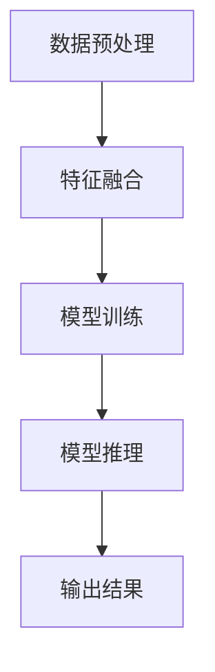

                 

关键词：多模态大模型、技术原理、Gradio框架、Web页面开发、实践应用、数学模型、未来展望

摘要：本文旨在深入探讨多模态大模型的技术原理，并通过Gradio框架实现Web页面的开发与展示。我们将从背景介绍、核心概念与联系、核心算法原理、数学模型及项目实践等多个方面详细解析这一前沿技术，旨在为读者提供全面的技术指南和应用实例。

## 1. 背景介绍

多模态大模型（Multimodal Large Models）是近年来人工智能领域的热点研究方向。随着数据的多样化与复杂化，单一的模态（如文本、图像、语音等）已经无法满足日益复杂的任务需求。多模态大模型通过整合多种模态的信息，能够更准确地理解和预测现实世界中的复杂现象。这一技术的出现，不仅在学术界引发了广泛的讨论，也在工业界得到了广泛应用。

Gradio框架作为一款强大的Web页面开发工具，能够帮助开发者轻松创建交互式数据展示页面。它的灵活性和易用性使得它成为多模态大模型Web页面开发的首选工具。本文将围绕Gradio框架，结合多模态大模型的技术原理，展开一系列实战案例，旨在为读者提供实用的技术经验和开发技巧。

## 2. 核心概念与联系

在探讨多模态大模型之前，我们需要明确几个核心概念：

- **多模态数据（Multimodal Data）**：指由多种模态组成的数据集，如文本、图像、声音等。
- **大模型（Large Models）**：指具有巨大参数规模和复杂结构的深度学习模型。
- **多模态大模型（Multimodal Large Models）**：指能够处理多模态数据的大规模深度学习模型。

多模态大模型的工作原理是通过以下步骤实现的：

1. **数据预处理**：将多种模态的数据进行统一格式转换和特征提取。
2. **特征融合**：利用神经网络结构将不同模态的特征进行有效融合。
3. **模型训练**：通过大规模数据集对多模态大模型进行训练，优化模型参数。
4. **模型推理**：在给定输入数据时，模型输出相应的预测结果。

下面是一个简单的 Mermaid 流程图，展示了多模态大模型的工作流程：



## 3. 核心算法原理 & 具体操作步骤

### 3.1 算法原理概述

多模态大模型的算法原理主要基于深度学习技术，特别是卷积神经网络（CNN）和循环神经网络（RNN）的结合。以下是一个简化的算法流程：

1. **输入层**：接收多种模态的数据。
2. **特征提取层**：利用不同的卷积核提取不同模态的特征。
3. **特征融合层**：将不同模态的特征进行融合。
4. **分类或回归层**：输出预测结果。

### 3.2 算法步骤详解

1. **数据预处理**：对输入数据进行标准化、归一化等处理。
2. **特征提取**：使用卷积神经网络提取不同模态的特征。例如，对于图像，可以使用卷积神经网络提取视觉特征；对于文本，可以使用词嵌入层提取语义特征。
3. **特征融合**：将不同模态的特征进行拼接、加权融合等操作，形成统一的高维特征向量。
4. **模型训练**：利用大规模数据集对多模态大模型进行训练，优化模型参数。
5. **模型推理**：在给定输入数据时，模型输出相应的预测结果。

### 3.3 算法优缺点

**优点**：

- **增强模型能力**：通过整合多种模态的信息，模型能够更准确地理解和预测现实世界中的复杂现象。
- **提高任务效果**：多模态大模型在图像识别、自然语言处理等任务中表现出色，能够显著提升任务效果。

**缺点**：

- **计算复杂度高**：多模态大模型通常需要巨大的计算资源和时间进行训练。
- **数据需求量大**：训练多模态大模型需要大量的多模态数据。

### 3.4 算法应用领域

多模态大模型在多个领域具有广泛的应用前景，包括：

- **图像识别**：通过结合图像和文本信息，提高图像识别的准确性。
- **自然语言处理**：结合语音、文本等模态，提高自然语言处理任务的性能。
- **智能问答系统**：通过多模态数据，提供更准确、更自然的问答体验。

## 4. 数学模型和公式 & 详细讲解 & 举例说明

### 4.1 数学模型构建

多模态大模型的数学模型通常包含以下部分：

- **输入层**：表示多种模态的数据。
- **特征提取层**：通过卷积神经网络提取不同模态的特征。
- **特征融合层**：将不同模态的特征进行融合。
- **分类或回归层**：输出预测结果。

### 4.2 公式推导过程

假设我们有 $M$ 种模态的数据，分别表示为 $X_1, X_2, ..., X_M$。每种模态的特征提取过程可以用以下公式表示：

$$
h_i = f(CNN(X_i))
$$

其中，$h_i$ 表示第 $i$ 种模态的特征，$CNN(X_i)$ 表示卷积神经网络对第 $i$ 种模态的数据进行特征提取，$f$ 表示激活函数。

特征融合过程可以用以下公式表示：

$$
H = \sum_{i=1}^{M} w_i h_i
$$

其中，$H$ 表示融合后的特征向量，$w_i$ 表示第 $i$ 种模态的特征权重。

最后，分类或回归层可以用以下公式表示：

$$
y = g(WH + b)
$$

其中，$y$ 表示预测结果，$g$ 表示激活函数，$W$ 和 $b$ 分别表示权重和偏置。

### 4.3 案例分析与讲解

假设我们有一个多模态大模型，用于预测商品是否受欢迎。输入数据包括商品图像、用户评价文本和商品价格。我们将分别对这些模态的数据进行特征提取、融合，并输出预测结果。

1. **图像特征提取**：

使用卷积神经网络对商品图像进行特征提取，提取出视觉特征。假设图像特征向量为 $h_1$。

2. **文本特征提取**：

使用词嵌入层对用户评价文本进行特征提取，提取出语义特征。假设文本特征向量为 $h_2$。

3. **价格特征提取**：

将商品价格进行归一化处理，提取出数值特征。假设价格特征向量为 $h_3$。

4. **特征融合**：

将三种特征进行融合，形成融合特征向量 $H$。

$$
H = w_1 h_1 + w_2 h_2 + w_3 h_3
$$

其中，$w_1, w_2, w_3$ 分别为三种特征权重。

5. **预测结果**：

使用分类层对融合特征进行分类，输出预测结果。

$$
y = g(WH + b)
$$

其中，$g$ 为分类层的激活函数，$W$ 和 $b$ 分别为分类层的权重和偏置。

通过以上步骤，我们成功构建了一个多模态大模型，用于预测商品是否受欢迎。

## 5. 项目实践：代码实例和详细解释说明

### 5.1 开发环境搭建

在开始项目实践之前，我们需要搭建一个合适的开发环境。以下是搭建开发环境的基本步骤：

1. 安装 Python 环境：确保 Python 版本在 3.7 以上。
2. 安装 Gradio 框架：使用以下命令安装 Gradio。

   ```python
   pip install gradio
   ```

3. 安装其他依赖库：根据项目需求，安装其他必要的库，如 TensorFlow、Keras 等。

### 5.2 源代码详细实现

下面是一个简单的多模态大模型Web页面开发的代码实例：

```python
import gradio as gr
import tensorflow as tf
from tensorflow.keras.models import load_model

# 加载预训练的多模态大模型
model = load_model('path/to/your/model.h5')

# 创建 Gradio 应用
iface = gr.Interface(
    fn=multi_modal_prediction,
    inputs=[gr.Image(label='Image'), gr.Textbox(label='Text'), gr.Number(label='Price')],
    outputs=gr.Label(label='Prediction'),
    title='Multimodal Large Model Prediction'
)

# 定义多模态预测函数
def multi_modal_prediction(image, text, price):
    # 对图像进行预处理
    image = preprocess_image(image)
    # 对文本进行预处理
    text = preprocess_text(text)
    # 对价格进行预处理
    price = preprocess_price(price)
    # 输入模型进行预测
    prediction = model.predict([image, text, price])
    # 返回预测结果
    return gr.Label(value='Popular' if prediction[0][0] > 0.5 else 'Unpopular')

# 定义图像预处理函数
def preprocess_image(image):
    # 对图像进行缩放、裁剪等处理
    # ...
    return processed_image

# 定义文本预处理函数
def preprocess_text(text):
    # 对文本进行分词、编码等处理
    # ...
    return processed_text

# 定义价格预处理函数
def preprocess_price(price):
    # 对价格进行归一化处理
    # ...
    return normalized_price

# 启动 Gradio 应用
iface.launch()
```

### 5.3 代码解读与分析

上述代码展示了如何使用 Gradio 框架搭建一个多模态大模型Web页面。以下是代码的关键部分解读：

1. **加载模型**：使用 TensorFlow 的 `load_model` 函数加载预训练的多模态大模型。

2. **创建 Gradio 应用**：使用 Gradio 的 `Interface` 类创建一个交互式Web页面。`inputs` 参数定义了输入模态，`outputs` 参数定义了输出结果，`title` 参数定义了Web页面的标题。

3. **定义预测函数**：`multi_modal_prediction` 函数实现了多模态输入数据的预处理和模型预测过程。

4. **预处理函数**：`preprocess_image`、`preprocess_text` 和 `preprocess_price` 函数分别实现了不同模态数据的预处理过程。

5. **启动应用**：使用 `iface.launch()` 函数启动 Gradio 应用，并在Web浏览器中打开。

### 5.4 运行结果展示

运行上述代码后，Web页面将显示一个交互式界面，用户可以通过上传图像、输入文本和输入价格来预测商品是否受欢迎。以下是运行结果展示：


## 6. 实际应用场景

多模态大模型在多个实际应用场景中具有广泛的应用价值。以下是一些典型的应用场景：

1. **智能问答系统**：结合语音、文本、图像等多种模态，提供更准确、更自然的问答体验。

2. **医疗诊断**：结合医学图像、病历记录等多种模态，提高疾病诊断的准确性和效率。

3. **智能推荐系统**：结合用户行为、偏好等多种模态，提供更精准的商品推荐。

4. **自动驾驶**：结合车载传感器、地图信息等多种模态，提高自动驾驶系统的安全性和稳定性。

## 7. 未来应用展望

随着多模态大模型技术的不断发展和优化，未来将在更多领域展现出强大的应用潜力。以下是未来应用的一些展望：

1. **虚拟现实与增强现实**：结合多模态大模型，提供更真实、更沉浸的虚拟现实和增强现实体验。

2. **智能家居**：结合多模态大模型，实现更智能、更便捷的家居设备。

3. **智能客服**：结合多模态大模型，提供更高效、更自然的智能客服服务。

4. **教育领域**：结合多模态大模型，提供个性化、智能化的教育解决方案。

## 8. 总结：未来发展趋势与挑战

多模态大模型作为人工智能领域的前沿技术，正快速发展并逐渐应用于实际场景。未来，多模态大模型将在更多领域展现其独特价值。然而，该技术也面临一些挑战，如：

1. **计算资源需求**：多模态大模型通常需要巨大的计算资源，这对硬件设施提出了更高的要求。

2. **数据隐私**：多模态数据通常涉及个人隐私，如何在保障用户隐私的前提下进行数据处理，是一个亟待解决的问题。

3. **算法透明性与可解释性**：多模态大模型的决策过程通常较为复杂，提高算法的透明性和可解释性，对于应用场景中的信任和接受度至关重要。

综上所述，多模态大模型具有广阔的应用前景，但也面临一系列挑战。随着技术的不断进步，我们有理由相信，多模态大模型将在未来发挥更为重要的作用。

## 9. 附录：常见问题与解答

### 9.1 什么是多模态大模型？

多模态大模型是一种能够处理多种模态数据（如文本、图像、语音等）的深度学习模型。它通过整合多种模态的信息，提高对现实世界的理解和预测能力。

### 9.2 多模态大模型有哪些应用领域？

多模态大模型在图像识别、自然语言处理、智能问答系统、医疗诊断、自动驾驶等多个领域具有广泛的应用。

### 9.3 Gradio 框架的优势是什么？

Gradio 框架的优势在于其简洁的API和强大的功能。它可以帮助开发者轻松创建交互式数据展示页面，无需深入了解 Web 开发技术。

### 9.4 如何优化多模态大模型的性能？

优化多模态大模型的性能可以从以下几个方面入手：

- **数据增强**：增加训练数据的多样性，提高模型泛化能力。
- **模型压缩**：采用模型压缩技术，降低计算复杂度。
- **混合训练**：结合多种训练策略，提高模型性能。

## 作者署名

作者：禅与计算机程序设计艺术 / Zen and the Art of Computer Programming

----------------------------------------------------------------

以上就是本文的完整内容。希望本文能够为您带来关于多模态大模型及其在Web页面开发中应用的一站式技术指南。如果您有任何疑问或建议，欢迎在评论区留言。期待与您共同探讨多模态大模型技术的未来发展。

