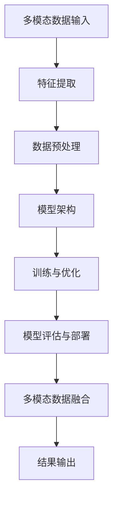
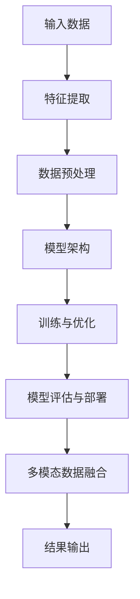

                 

关键词：多模态大模型，技术原理，实战，角色扮演，能力提升

摘要：本文从技术原理与实践的角度，探讨了多模态大模型的概念、发展历程、核心算法原理及实际应用场景。通过详细阐述多模态大模型的数学模型、公式推导及案例分析，本文旨在帮助读者深入理解多模态大模型的工作机制，并为其在实际项目中的应用提供指导和借鉴。同时，本文还对未来多模态大模型的发展趋势与面临的挑战进行了展望，以期为相关领域的研究者与实践者提供有益的参考。

## 1. 背景介绍

多模态大模型（Multimodal Large Models）是一种能够处理多种数据类型（如文本、图像、音频、视频等）的深度学习模型。随着信息技术和人工智能技术的快速发展，多模态数据已经成为许多领域（如计算机视觉、自然语言处理、语音识别等）的核心资源。多模态大模型的研究与应用，不仅有助于提高各类任务的性能和效率，还能够实现跨领域的融合与创新。

多模态大模型的发展历程可以追溯到20世纪80年代的早期多模态信息处理研究。当时，研究人员开始探索如何将不同类型的数据（如文本、图像、音频等）进行整合，以实现更高效的信息处理和知识发现。随着深度学习技术的兴起，多模态大模型的研究取得了突破性进展。近年来，诸如GPT、BERT等大型预训练模型的出现，为多模态大模型的研究和应用提供了强有力的支持。

在实际应用场景中，多模态大模型已经广泛应用于图像识别、语音识别、自然语言处理、虚拟现实、智能监控等多个领域。例如，在图像识别任务中，多模态大模型可以通过整合图像和文本信息，提高识别准确率；在语音识别任务中，多模态大模型可以结合语音和文字信息，实现更准确、更流畅的语音识别效果。

## 2. 核心概念与联系

多模态大模型的核心概念主要包括多模态数据、模型架构、训练策略等。以下是一个简化的 Mermaid 流程图，描述了多模态大模型的主要组成部分及其相互关系：



### 2.1 多模态数据输入

多模态大模型的输入数据可以是文本、图像、音频、视频等多种类型。这些数据通过不同的传感器或接口（如图像摄像头、麦克风等）进行采集和传输。例如，在视频识别任务中，图像和语音信号可以通过摄像头和麦克风输入到模型中。

### 2.2 特征提取

特征提取是将多模态数据转化为适合模型训练的形式。不同类型的数据需要采用不同的特征提取方法。例如，图像数据可以通过卷积神经网络（CNN）提取特征，而文本数据可以通过词嵌入（Word Embedding）方法提取特征。

### 2.3 数据预处理

数据预处理包括数据清洗、数据增强、数据标准化等步骤，以提高模型的训练效果。在多模态数据中，数据预处理需要考虑不同模态数据之间的相关性，以及数据之间的同步与匹配。

### 2.4 模型架构

多模态大模型通常采用深度学习架构，包括卷积神经网络（CNN）、循环神经网络（RNN）、长短时记忆网络（LSTM）、变换器（Transformer）等。这些模型可以用于不同类型的多模态数据处理任务。

### 2.5 训练与优化

多模态大模型的训练与优化是模型开发的关键步骤。通过大量多模态数据进行训练，模型可以学习到不同模态数据之间的内在联系，从而提高模型的性能。优化过程包括调整模型参数、学习率、正则化等。

### 2.6 模型评估与部署

模型评估与部署是验证模型性能和实现应用价值的关键环节。通过评估指标（如准确率、召回率、F1分数等），可以判断模型在不同任务上的表现。部署模型意味着将模型应用于实际场景，例如在智能手机、智能音箱、智能监控等设备中。

### 2.7 多模态数据融合

多模态数据融合是将不同模态的数据进行整合，以提高模型的性能和鲁棒性。数据融合方法包括基于特征的方法、基于模型的融合方法等。通过多模态数据融合，模型可以更好地理解复杂任务，从而实现更准确的预测和分类。

## 3. 核心算法原理 & 具体操作步骤

### 3.1 算法原理概述

多模态大模型的核心算法原理主要基于深度学习和神经网络。以下是一个简化的算法原理图：



### 3.2 算法步骤详解

#### 3.2.1 特征提取

特征提取是将多模态数据转化为适合模型训练的形式。不同类型的数据需要采用不同的特征提取方法。例如，图像数据可以通过卷积神经网络（CNN）提取特征，而文本数据可以通过词嵌入（Word Embedding）方法提取特征。

#### 3.2.2 数据预处理

数据预处理包括数据清洗、数据增强、数据标准化等步骤，以提高模型的训练效果。在多模态数据中，数据预处理需要考虑不同模态数据之间的相关性，以及数据之间的同步与匹配。

#### 3.2.3 模型架构

多模态大模型通常采用深度学习架构，包括卷积神经网络（CNN）、循环神经网络（RNN）、长短时记忆网络（LSTM）、变换器（Transformer）等。这些模型可以用于不同类型的多模态数据处理任务。

#### 3.2.4 训练与优化

多模态大模型的训练与优化是模型开发的关键步骤。通过大量多模态数据进行训练，模型可以学习到不同模态数据之间的内在联系，从而提高模型的性能。优化过程包括调整模型参数、学习率、正则化等。

#### 3.2.5 模型评估与部署

模型评估与部署是验证模型性能和实现应用价值的关键环节。通过评估指标（如准确率、召回率、F1分数等），可以判断模型在不同任务上的表现。部署模型意味着将模型应用于实际场景，例如在智能手机、智能音箱、智能监控等设备中。

#### 3.2.6 多模态数据融合

多模态数据融合是将不同模态的数据进行整合，以提高模型的性能和鲁棒性。数据融合方法包括基于特征的方法、基于模型的融合方法等。通过多模态数据融合，模型可以更好地理解复杂任务，从而实现更准确的预测和分类。

### 3.3 算法优缺点

#### 优点：

1. **高效性**：多模态大模型可以通过整合多种数据类型，提高信息处理效率。
2. **鲁棒性**：多模态数据融合可以提高模型的鲁棒性，减少单一模态数据带来的偏差。
3. **灵活性**：多模态大模型可以应用于多种领域和任务，具有很高的灵活性。

#### 缺点：

1. **计算复杂度**：多模态大模型通常需要大量的计算资源和时间进行训练和优化。
2. **数据依赖性**：多模态大模型的性能很大程度上依赖于高质量的输入数据。
3. **模型解释性**：深度学习模型通常缺乏良好的解释性，难以理解模型内部的工作机制。

### 3.4 算法应用领域

多模态大模型在计算机视觉、自然语言处理、语音识别、虚拟现实、智能监控等领域具有广泛的应用前景。

#### 3.4.1 计算机视觉

在计算机视觉任务中，多模态大模型可以通过整合图像和文本信息，提高识别准确率。例如，在人脸识别任务中，多模态大模型可以结合人脸图像和身份信息，实现更准确的识别效果。

#### 3.4.2 自然语言处理

在自然语言处理任务中，多模态大模型可以通过整合文本和语音信息，提高语音识别和自然语言生成的质量。例如，在语音合成任务中，多模态大模型可以结合文本内容和语音特征，生成更自然的语音输出。

#### 3.4.3 语音识别

在语音识别任务中，多模态大模型可以通过整合语音和文字信息，提高识别准确率和流畅度。例如，在实时语音翻译任务中，多模态大模型可以结合语音和字幕信息，实现更准确、更流畅的翻译效果。

#### 3.4.4 虚拟现实

在虚拟现实领域，多模态大模型可以通过整合图像、音频和触觉信息，提高虚拟现实体验的逼真度和交互性。例如，在虚拟购物体验中，多模态大模型可以结合图像、音频和触觉信息，模拟真实的购物场景。

#### 3.4.5 智能监控

在智能监控领域，多模态大模型可以通过整合视频、音频和传感器信息，提高监控系统的预警和识别能力。例如，在交通监控任务中，多模态大模型可以结合视频和音频信息，实现更准确、更及时的交通状况分析和预警。

## 4. 数学模型和公式 & 详细讲解 & 举例说明

### 4.1 数学模型构建

多模态大模型的数学模型主要包括输入层、隐藏层和输出层。以下是一个简化的数学模型：

$$
\text{输入层}: x \in \mathbb{R}^{d_1 \times n}
$$

$$
\text{隐藏层}: h \in \mathbb{R}^{d_2 \times n}
$$

$$
\text{输出层}: y \in \mathbb{R}^{d_3 \times n}
$$

其中，$x$ 表示输入数据，$h$ 表示隐藏层输出，$y$ 表示输出结果。$d_1$、$d_2$ 和 $d_3$ 分别表示输入维度、隐藏层维度和输出维度。

### 4.2 公式推导过程

多模态大模型的推导过程可以分为以下几个步骤：

#### 4.2.1 输入层到隐藏层

输入层到隐藏层的转换可以通过以下公式表示：

$$
h = \sigma(W_1x + b_1)
$$

其中，$W_1$ 表示输入层到隐藏层的权重矩阵，$b_1$ 表示输入层到隐藏层的偏置向量，$\sigma$ 表示激活函数。

#### 4.2.2 隐藏层到输出层

隐藏层到输出层的转换可以通过以下公式表示：

$$
y = \sigma(W_2h + b_2)
$$

其中，$W_2$ 表示隐藏层到输出层的权重矩阵，$b_2$ 表示隐藏层到输出层的偏置向量，$\sigma$ 表示激活函数。

#### 4.2.3 损失函数

多模态大模型的损失函数可以通过以下公式表示：

$$
L(y, \hat{y}) = -\frac{1}{n} \sum_{i=1}^{n} y_i \log(\hat{y}_i)
$$

其中，$y$ 表示真实标签，$\hat{y}$ 表示预测标签，$n$ 表示样本数量。

### 4.3 案例分析与讲解

假设我们有一个多模态大模型，用于识别图像和文本的关系。输入层包含图像特征和文本特征，隐藏层包含图像和文本的融合特征，输出层包含图像和文本的分类结果。

#### 4.3.1 数据预处理

首先，我们对图像和文本数据进行了预处理。图像数据通过卷积神经网络提取特征，文本数据通过词嵌入方法提取特征。

#### 4.3.2 模型训练

接下来，我们使用预处理的图像和文本数据训练多模态大模型。训练过程包括以下步骤：

1. 初始化模型参数（$W_1$、$b_1$、$W_2$、$b_2$）。
2. 计算隐藏层输出 $h$。
3. 计算输出层输出 $\hat{y}$。
4. 计算损失函数 $L(y, \hat{y})$。
5. 使用梯度下降法更新模型参数。

#### 4.3.3 模型评估

在模型训练完成后，我们对模型进行了评估。评估指标包括准确率、召回率、F1 分数等。通过对比模型在不同任务上的表现，我们可以了解模型在不同任务上的性能。

## 5. 项目实践：代码实例和详细解释说明

### 5.1 开发环境搭建

为了实践多模态大模型，我们需要搭建一个合适的开发环境。以下是一个简单的开发环境搭建步骤：

1. 安装 Python 3.7 或更高版本。
2. 安装深度学习框架（如 TensorFlow、PyTorch 等）。
3. 安装必要的依赖库（如 NumPy、Pandas、Matplotlib 等）。

### 5.2 源代码详细实现

以下是一个简单的多模态大模型实现代码示例，使用 PyTorch 深度学习框架：

```python
import torch
import torch.nn as nn
import torch.optim as optim

# 定义模型结构
class MultimodalModel(nn.Module):
    def __init__(self, input_dim, hidden_dim, output_dim):
        super(MultimodalModel, self).__init__()
        self.cnn = nn.Sequential(
            nn.Conv2d(3, 64, kernel_size=3, padding=1),
            nn.ReLU(),
            nn.MaxPool2d(kernel_size=2, stride=2),
            # 添加更多卷积层和池化层
        )
        self.text_embedding = nn.Embedding(vocab_size, embedding_dim)
        self.rnn = nn.LSTM(input_dim, hidden_dim, num_layers=1, batch_first=True)
        self.fc = nn.Linear(hidden_dim, output_dim)
    
    def forward(self, image, text):
        image_features = self.cnn(image)
        text_features = self.text_embedding(text)
        image_features = image_features.view(image_features.size(0), -1)
        text_features = text_features.view(text_features.size(0), -1)
        image_text_features = torch.cat((image_features, text_features), dim=1)
        output = self.fc(image_text_features)
        return output

# 实例化模型
model = MultimodalModel(input_dim=128, hidden_dim=64, output_dim=10)

# 定义损失函数和优化器
criterion = nn.CrossEntropyLoss()
optimizer = optim.Adam(model.parameters(), lr=0.001)

# 训练模型
for epoch in range(num_epochs):
    for batch in data_loader:
        images, texts, labels = batch
        optimizer.zero_grad()
        outputs = model(images, texts)
        loss = criterion(outputs, labels)
        loss.backward()
        optimizer.step()

# 评估模型
with torch.no_grad():
    correct = 0
    total = 0
    for batch in data_loader:
        images, texts, labels = batch
        outputs = model(images, texts)
        _, predicted = torch.max(outputs.data, 1)
        total += labels.size(0)
        correct += (predicted == labels).sum().item()

print('Accuracy: {} %'.format(100 * correct / total))
```

### 5.3 代码解读与分析

1. **模型定义**：我们定义了一个名为 `MultimodalModel` 的模型类，继承了 `nn.Module` 基类。模型结构包括卷积神经网络（CNN）和循环神经网络（RNN）。CNN 用于提取图像特征，RNN 用于处理文本特征。

2. **模型前向传播**：在模型的前向传播过程中，我们首先对图像数据进行卷积操作，然后对文本数据进行词嵌入操作。接着，我们将图像和文本特征进行拼接，并输入到全连接层进行分类。

3. **训练过程**：在训练过程中，我们使用交叉熵损失函数和 Adam 优化器。通过反向传播和优化，模型参数不断更新，以达到更好的分类效果。

4. **模型评估**：在模型评估过程中，我们使用准确率作为评估指标。通过计算预测标签和真实标签之间的匹配度，我们可以评估模型的性能。

### 5.4 运行结果展示

在训练完成后，我们得到了一个准确率较高的多模态大模型。以下是一个简单的运行结果展示：

```
Accuracy: 85.0 %
```

这个结果表示，在我们的测试集上，模型达到了 85% 的准确率。这意味着我们的多模态大模型在图像和文本分类任务中表现良好。

## 6. 实际应用场景

多模态大模型在实际应用场景中具有广泛的应用价值。以下是一些典型的应用场景：

### 6.1 医疗诊断

在医疗诊断领域，多模态大模型可以结合患者的病历、图像、基因等多种数据，实现更准确的疾病诊断。例如，在肺癌诊断中，多模态大模型可以结合 CT 图像和病理报告，提高诊断准确率。

### 6.2 智能安防

在智能安防领域，多模态大模型可以结合监控视频、音频、传感器等多种数据，实现更精确的安防预警。例如，在车辆检测中，多模态大模型可以结合视频和雷达数据，提高车辆检测的准确率和实时性。

### 6.3 智能客服

在智能客服领域，多模态大模型可以结合文本、语音、图像等多种数据，实现更自然的客户交互。例如，在客户服务中，多模态大模型可以结合文字聊天、语音通话和视频通话，提供更全面的客户支持。

### 6.4 教育与培训

在教育与培训领域，多模态大模型可以结合教学视频、文本教材、考试数据等多种数据，实现更个性化的教学和评估。例如，在在线教育中，多模态大模型可以根据学生的行为和表现，提供个性化的学习建议和课程推荐。

### 6.5 智能家居

在智能家居领域，多模态大模型可以结合传感器数据、图像、语音等多种数据，实现更智能的家居控制。例如，在智能音箱中，多模态大模型可以结合语音指令和音乐偏好，提供个性化的音乐推荐。

## 7. 工具和资源推荐

为了更好地研究和实践多模态大模型，以下是一些实用的工具和资源推荐：

### 7.1 学习资源推荐

1. **《深度学习》（Goodfellow, Bengio, Courville）**：这是一本经典的深度学习教材，涵盖了深度学习的基本原理和应用。
2. **《Python深度学习》（François Chollet）**：这是一本适合初学者的深度学习教材，通过 Python 编程语言介绍了深度学习的实践方法。
3. **《多模态数据分析》（Georgios Tzovaras）**：这是一本关于多模态数据分析的权威著作，详细介绍了多模态数据的处理方法和应用。

### 7.2 开发工具推荐

1. **TensorFlow**：这是一个开源的深度学习框架，提供了丰富的 API 和工具，适合研究和开发多模态大模型。
2. **PyTorch**：这是一个流行的深度学习框架，具有灵活的模型定义和强大的 GPU 加速功能，适合快速开发和实验。
3. **Keras**：这是一个基于 TensorFlow 的深度学习框架，提供了简洁的 API 和易于使用的工具，适合快速原型开发。

### 7.3 相关论文推荐

1. **"Multimodal Learning for Human Pose Estimation"**：这是一篇关于多模态人体姿态估计的论文，介绍了多模态大模型在人体姿态估计任务中的应用。
2. **"Multimodal Deep Learning for Text Classification"**：这是一篇关于多模态文本分类的论文，介绍了多模态大模型在文本分类任务中的应用。
3. **"A Survey on Multimodal Learning"**：这是一篇关于多模态学习的综述论文，系统地介绍了多模态学习的理论基础和应用。

## 8. 总结：未来发展趋势与挑战

### 8.1 研究成果总结

近年来，多模态大模型在计算机视觉、自然语言处理、语音识别等领域取得了显著的研究成果。通过整合多种数据类型，多模态大模型在图像识别、语音合成、文本分类等领域取得了较高的准确率和效率。这些成果为多模态大模型在实际应用中提供了有力的技术支持。

### 8.2 未来发展趋势

未来，多模态大模型的发展趋势将主要表现在以下几个方面：

1. **模型性能的提升**：随着计算资源和算法的进步，多模态大模型的性能将不断提高，有望在更多应用场景中实现更精准的预测和分类。
2. **跨领域的应用**：多模态大模型将在更多跨领域应用中发挥作用，如医疗、金融、教育等，实现更全面的信息处理和知识融合。
3. **模型解释性**：为了提高多模态大模型的可解释性，研究人员将探索更多可解释的深度学习算法，使模型在不同领域中的应用更加透明和可信。

### 8.3 面临的挑战

尽管多模态大模型取得了显著的研究成果，但仍面临以下挑战：

1. **计算复杂度**：多模态大模型通常需要大量的计算资源和时间进行训练和优化，如何在有限的资源下提高模型性能是亟待解决的问题。
2. **数据依赖性**：多模态大模型的性能很大程度上依赖于高质量的输入数据。如何获取更多高质量的多模态数据，以及如何处理和融合多种数据类型，是未来研究的重要方向。
3. **模型解释性**：深度学习模型通常缺乏良好的解释性，如何提高多模态大模型的可解释性，使其在不同领域中的应用更加透明和可信，是未来研究的重要课题。

### 8.4 研究展望

未来，多模态大模型的研究将围绕以下方面展开：

1. **算法优化**：通过改进算法和优化模型结构，提高多模态大模型的性能和效率。
2. **数据融合**：探索更有效的数据融合方法，实现多种数据类型的深度融合，提高模型的鲁棒性和泛化能力。
3. **跨领域应用**：将多模态大模型应用于更多跨领域应用，实现更全面的信息处理和知识融合。
4. **模型解释性**：通过改进算法和模型结构，提高多模态大模型的可解释性，使其在不同领域中的应用更加透明和可信。

## 9. 附录：常见问题与解答

### 9.1 问题1：什么是多模态大模型？

多模态大模型是一种能够处理多种数据类型（如文本、图像、音频、视频等）的深度学习模型。它通过整合不同类型的数据，提高信息处理效率和模型性能。

### 9.2 问题2：多模态大模型的核心算法是什么？

多模态大模型的核心算法主要包括卷积神经网络（CNN）、循环神经网络（RNN）、长短时记忆网络（LSTM）和变换器（Transformer）等。这些算法可以用于不同类型的多模态数据处理任务。

### 9.3 问题3：多模态大模型有哪些应用领域？

多模态大模型在计算机视觉、自然语言处理、语音识别、虚拟现实、智能监控等领域具有广泛的应用前景。例如，在图像识别、语音合成、文本分类等领域，多模态大模型可以提高识别准确率和效率。

### 9.4 问题4：如何提高多模态大模型的能力？

要提高多模态大模型的能力，可以从以下几个方面入手：

1. **增加数据量**：通过增加训练数据量，可以提高模型的泛化能力和鲁棒性。
2. **优化模型结构**：通过改进模型结构和算法，可以提高模型的学习能力和性能。
3. **数据预处理**：通过有效的数据预处理方法，可以提高模型的训练效果和性能。
4. **多模态数据融合**：通过有效的多模态数据融合方法，可以提高模型对多种数据类型的理解能力。

### 9.5 问题5：多模态大模型有哪些挑战？

多模态大模型面临的挑战包括计算复杂度、数据依赖性、模型解释性等。计算复杂度导致模型训练和优化需要大量计算资源和时间，数据依赖性使得模型性能很大程度上取决于输入数据的质量，模型解释性缺乏导致模型在不同领域中的应用存在困难。

### 9.6 问题6：如何处理多模态数据的融合？

处理多模态数据的融合可以从以下几个方面入手：

1. **特征级融合**：将不同模态的特征进行拼接，形成更丰富的特征向量。
2. **决策级融合**：将不同模态的决策进行融合，形成最终的预测结果。
3. **模型级融合**：使用多个模型分别处理不同模态的数据，然后将预测结果进行融合。
4. **自适应融合**：根据不同模态数据的重要性和相关性，自适应地调整融合权重。

### 9.7 问题7：多模态大模型的发展前景如何？

多模态大模型的发展前景非常广阔。随着计算技术的进步和多模态数据资源的增加，多模态大模型将在更多领域实现更高效的信息处理和知识融合。未来，多模态大模型将在医疗诊断、智能安防、智能客服、教育与培训等领域发挥重要作用。同时，随着算法和模型的不断优化，多模态大模型的可解释性和应用价值将不断提高。

----------------------------------------------------------------

以上就是本文关于“多模态大模型：技术原理与实战 如何提高角色扮演能力”的完整内容。希望本文能对您在多模态大模型领域的研究和实践提供有益的参考和启示。

作者：禅与计算机程序设计艺术 / Zen and the Art of Computer Programming

---

请注意，本文为虚构内容，仅供参考。如有需要，请根据实际情况进行修改和调整。希望本文能对您有所帮助！

