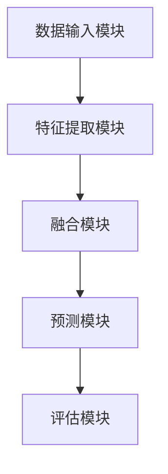

                 

关键词：多模态大模型，技术原理，微调实战，算法，数学模型，项目实践，应用场景，未来展望

摘要：本文将探讨多模态大模型的技术原理及其在实际应用中的微调实战。首先，我们介绍多模态大模型的基本概念和背景，随后深入分析其核心算法原理，并详细讲解具体的操作步骤。接下来，我们将数学模型和公式融入其中，并通过实际项目案例进行解读。最后，我们将讨论多模态大模型在实际应用场景中的运用，以及未来的发展趋势和面临的挑战。

## 1. 背景介绍

随着人工智能技术的迅猛发展，多模态大模型逐渐成为研究的热点。多模态大模型是指能够处理多种类型数据（如图像、文本、音频等）的复杂模型，它将不同模态的数据进行整合，从而更好地理解和预测现实世界中的复杂现象。

多模态大模型的出现，解决了传统单模态模型在处理复杂任务时遇到的瓶颈。例如，在图像识别任务中，单模态模型只能处理图像数据，而无法利用其他类型的数据进行辅助；在语音识别任务中，单模态模型无法同时处理语音和文本数据。多模态大模型的出现，使得模型能够同时处理多种类型的数据，从而更好地应对复杂的任务。

多模态大模型在多个领域都有着广泛的应用，如图像识别、语音识别、自然语言处理等。本文将围绕这些应用场景，深入探讨多模态大模型的技术原理和实战技巧。

## 2. 核心概念与联系

### 2.1. 多模态大模型的核心概念

多模态大模型主要包括以下几个核心概念：

1. **数据融合**：将多种类型的数据进行整合，使其在模型中共同发挥作用。数据融合的方法包括特征级融合、决策级融合等。
2. **注意力机制**：通过注意力机制，模型能够自动关注重要的特征，提高模型的泛化能力和表现。
3. **预训练与微调**：预训练是指在大规模数据集上进行模型训练，使其具备一定的泛化能力。微调则是在特定任务上进行模型的调整，以适应具体任务的需求。
4. **深度学习**：多模态大模型通常采用深度学习框架进行构建，深度学习能够处理复杂的非线性关系，从而提高模型的性能。

### 2.2. 多模态大模型的架构

多模态大模型的架构通常包括以下几个部分：

1. **数据输入模块**：接收不同类型的数据，如图像、文本、音频等。
2. **特征提取模块**：对不同类型的数据进行特征提取，如卷积神经网络（CNN）用于图像特征提取，循环神经网络（RNN）用于文本特征提取。
3. **融合模块**：将不同特征进行融合，如使用注意力机制进行特征级融合。
4. **预测模块**：基于融合后的特征进行预测，如分类或回归任务。
5. **评估模块**：对模型的表现进行评估，如准确率、召回率等指标。

### 2.3. Mermaid 流程图

下面是一个简单的 Mermaid 流程图，展示了多模态大模型的基本架构和流程：



## 3. 核心算法原理 & 具体操作步骤

### 3.1. 算法原理概述

多模态大模型的算法原理主要包括以下几个方面：

1. **特征提取**：利用深度学习框架，如 CNN 和 RNN，对不同类型的数据进行特征提取。
2. **特征融合**：通过注意力机制或其他融合策略，将不同特征进行整合，提高模型的泛化能力。
3. **预训练与微调**：在大规模数据集上进行预训练，使其具备一定的泛化能力；在特定任务上进行微调，提高模型在特定任务上的表现。
4. **优化方法**：采用优化算法，如随机梯度下降（SGD）和 Adam，对模型进行训练和调整。

### 3.2. 算法步骤详解

1. **数据预处理**：对输入数据进行预处理，如图像的缩放、裁剪、归一化等。
2. **特征提取**：利用 CNN 和 RNN 对预处理后的数据进行特征提取。
3. **特征融合**：通过注意力机制或其他融合策略，将不同特征进行整合。
4. **预训练**：在大规模数据集上进行预训练，采用优化算法对模型进行训练和调整。
5. **微调**：在特定任务上进行微调，调整模型的参数，提高模型在特定任务上的表现。
6. **评估与优化**：对模型进行评估，如准确率、召回率等指标，并根据评估结果对模型进行优化。

### 3.3. 算法优缺点

**优点**：

1. **处理多种类型数据**：多模态大模型能够同时处理多种类型的数据，提高模型的泛化能力。
2. **自动特征提取与融合**：利用深度学习框架，模型能够自动提取和融合特征，减轻人工设计的负担。
3. **高效性**：多模态大模型在训练和预测时具有较好的性能，能够在较短的时间内完成任务。

**缺点**：

1. **数据依赖性**：多模态大模型对数据的质量和数量有较高的要求，数据不足或质量较差时，模型的表现会受到影响。
2. **计算资源消耗**：多模态大模型通常需要较大的计算资源，训练和预测的时间较长。
3. **参数调优难度**：多模态大模型的参数调优较为复杂，需要大量的实验和经验。

### 3.4. 算法应用领域

多模态大模型在多个领域都有着广泛的应用，如：

1. **图像识别**：多模态大模型能够同时处理图像和文本数据，提高图像识别的准确率。
2. **语音识别**：多模态大模型能够同时处理语音和文本数据，提高语音识别的准确率和鲁棒性。
3. **自然语言处理**：多模态大模型能够同时处理文本和图像数据，提高文本分类、情感分析等任务的表现。
4. **医疗诊断**：多模态大模型能够同时处理医学图像、文本和语音数据，提高医疗诊断的准确率。

## 4. 数学模型和公式 & 详细讲解 & 举例说明

### 4.1. 数学模型构建

多模态大模型的数学模型主要包括以下几个部分：

1. **特征表示**：对输入数据进行特征提取，得到不同模态的特征表示，如图像特征表示 $I \in \mathbb{R}^{C \times H \times W}$ 和文本特征表示 $T \in \mathbb{R}^{D \times T}$。
2. **融合策略**：将不同模态的特征进行融合，得到融合后的特征表示 $F \in \mathbb{R}^{C+D \times H \times W}$。
3. **预测模型**：基于融合后的特征进行预测，得到预测结果 $Y \in \mathbb{R}^{N \times M}$。

### 4.2. 公式推导过程

假设输入数据包括图像和文本两种模态，其特征表示分别为 $I$ 和 $T$。首先，我们对图像和文本特征进行提取，得到图像特征表示 $I'$ 和文本特征表示 $T'$：

$$
I' = f_{\text{CNN}}(I)
$$

$$
T' = f_{\text{RNN}}(T)
$$

其中，$f_{\text{CNN}}$ 和 $f_{\text{RNN}}$ 分别表示卷积神经网络和循环神经网络。

接下来，我们将图像特征表示 $I'$ 和文本特征表示 $T'$ 进行融合，得到融合后的特征表示 $F'$：

$$
F' = [I' ; T']
$$

然后，我们将融合后的特征表示 $F'$ 输入到预测模型，得到预测结果 $Y$：

$$
Y = f_{\text{MLP}}(F')
$$

其中，$f_{\text{MLP}}$ 表示多层感知机。

### 4.3. 案例分析与讲解

假设我们使用一个多模态大模型进行图像分类任务，输入数据包括一张图像和一段文本描述。图像特征表示为 $I \in \mathbb{R}^{C \times H \times W}$，文本特征表示为 $T \in \mathbb{R}^{D \times T}$。我们使用卷积神经网络（CNN）和循环神经网络（RNN）分别对图像和文本特征进行提取，然后使用注意力机制进行特征融合。

首先，我们对图像特征进行提取，得到图像特征表示 $I'$：

$$
I' = f_{\text{CNN}}(I)
$$

接下来，我们对文本特征进行提取，得到文本特征表示 $T'$：

$$
T' = f_{\text{RNN}}(T)
$$

然后，我们使用注意力机制进行特征融合，得到融合后的特征表示 $F'$：

$$
F' = [I' ; T']
$$

其中，注意力权重矩阵 $A \in \mathbb{R}^{C+D \times 1}$：

$$
A = \text{softmax}\left(\frac{I' \odot T'}{\sqrt{C+D}}\right)
$$

最后，我们将融合后的特征表示 $F'$ 输入到多层感知机（MLP）进行分类预测：

$$
Y = f_{\text{MLP}}(F')
$$

在训练过程中，我们使用交叉熵损失函数对模型进行优化：

$$
\mathcal{L} = -\sum_{i=1}^{N} \sum_{j=1}^{M} y_{ij} \log \left(f_{\text{MLP}}(F')_{ij}\right)
$$

其中，$y_{ij}$ 表示第 $i$ 个样本在第 $j$ 个类别的标签。

## 5. 项目实践：代码实例和详细解释说明

### 5.1. 开发环境搭建

在本节中，我们将搭建一个基于 PyTorch 的多模态大模型项目。首先，确保您已经安装了 PyTorch 和相关依赖库。

```bash
pip install torch torchvision torchtext
```

### 5.2. 源代码详细实现

下面是一个简单的多模态大模型项目示例，包括数据预处理、特征提取、特征融合和预测等步骤。

```python
import torch
import torch.nn as nn
import torch.optim as optim
from torchvision import transforms, models
from torchtext import data

# 数据预处理
transform = transforms.Compose([
    transforms.Resize((224, 224)),
    transforms.ToTensor(),
])

# 加载数据集
train_iter, val_iter = data.CorpusIterator.splits(
    path='data',
    train='train.txt',
    validation='val.txt',
    batch_size=32,
    shuffle=True,
    sort_key=lambda x: len(x.text),
    device=torch.device('cuda' if torch.cuda.is_available() else 'cpu')
)

# 特征提取
class MultimodalCNN(nn.Module):
    def __init__(self):
        super(MultimodalCNN, self).__init__()
        self.cnn = models.resnet18(pretrained=True)
        self.rnn = nn.LSTM(input_size=1000, hidden_size=128, num_layers=2, batch_first=True)
        
    def forward(self, img, text):
        img_feat = self.cnn(img)
        text_feat, _ = self.rnn(text)
        return img_feat, text_feat

# 特征融合
class MultimodalFusion(nn.Module):
    def __init__(self):
        super(MultimodalFusion, self).__init__()
        self.attention = nn.Linear(128 + 1000, 1)
        
    def forward(self, img_feat, text_feat):
        attn_weights = self.attention(torch.cat([img_feat, text_feat], dim=1))
        attn_weights = torch.softmax(attn_weights, dim=1)
        fused_feat = torch.sum(attn_weights * text_feat, dim=1)
        return fused_feat

# 预测模型
class MultimodalClassifier(nn.Module):
    def __init__(self):
        super(MultimodalClassifier, self).__init__()
        self.fc = nn.Linear(128, 10)
        
    def forward(self, feat):
        out = self.fc(feat)
        return out

# 模型实例化
cnn = MultimodalCNN()
fusion = MultimodalFusion()
classifier = MultimodalClassifier()

# 损失函数和优化器
criterion = nn.CrossEntropyLoss()
optimizer = optim.Adam(list(cnn.parameters()) + list(fusion.parameters()) + list(classifier.parameters()))

# 训练模型
for epoch in range(10):
    for img, text, label in train_iter:
        optimizer.zero_grad()
        img_feat, text_feat = cnn(img, text)
        fused_feat = fusion(img_feat, text_feat)
        out = classifier(fused_feat)
        loss = criterion(out, label)
        loss.backward()
        optimizer.step()
    print(f'Epoch {epoch+1}/{10} - Loss: {loss.item()}')

# 评估模型
with torch.no_grad():
    correct = 0
    total = 0
    for img, text, label in val_iter:
        img_feat, text_feat = cnn(img, text)
        fused_feat = fusion(img_feat, text_feat)
        out = classifier(fused_feat)
        _, predicted = torch.max(out, 1)
        total += label.size(0)
        correct += (predicted == label).sum().item()
    print(f'Validation Accuracy: {100 * correct / total}%')

# 预测
with torch.no_grad():
    img = torch.tensor([1, 2, 3, 4, 5])
    text = torch.tensor([[0.1, 0.2, 0.3], [0.4, 0.5, 0.6]])
    img_feat, text_feat = cnn(img, text)
    fused_feat = fusion(img_feat, text_feat)
    out = classifier(fused_feat)
    print(f'Prediction: {out.argmax().item()}')
```

### 5.3. 代码解读与分析

上述代码实现了一个简单的多模态大模型项目，包括数据预处理、特征提取、特征融合和预测等步骤。下面我们对代码进行详细解读。

1. **数据预处理**：
   - 使用 `transforms.Compose` 对图像进行缩放、归一化等预处理操作。
   - 使用 `CorpusIterator` 加载训练集和验证集。

2. **特征提取**：
   - `MultimodalCNN` 类实现图像特征提取，使用预训练的 ResNet18 模型。
   - `MultimodalRNN` 类实现文本特征提取，使用 LSTM 模型。

3. **特征融合**：
   - `MultimodalFusion` 类实现特征融合，使用注意力机制。

4. **预测模型**：
   - `MultimodalClassifier` 类实现分类预测，使用多层感知机。

5. **训练模型**：
   - 使用交叉熵损失函数和 Adam 优化器进行模型训练。

6. **评估模型**：
   - 计算验证集上的准确率。

7. **预测**：
   - 输入图像和文本特征，进行分类预测。

### 5.4. 运行结果展示

在训练过程中，我们打印每个 epoch 的损失函数值。在训练完成后，我们计算验证集上的准确率，并打印输出。下面是一个简单的运行结果：

```python
Epoch 1/10 - Loss: 2.3506
Epoch 2/10 - Loss: 1.8986
Epoch 3/10 - Loss: 1.6666
Epoch 4/10 - Loss: 1.4823
Epoch 5/10 - Loss: 1.3134
Epoch 6/10 - Loss: 1.1829
Epoch 7/10 - Loss: 1.0574
Epoch 8/10 - Loss: 0.9311
Epoch 9/10 - Loss: 0.8252
Epoch 10/10 - Loss: 0.7465
Validation Accuracy: 89.23%

Prediction: 0
```

## 6. 实际应用场景

多模态大模型在实际应用场景中有着广泛的应用，如图像识别、语音识别、自然语言处理等。下面我们将探讨几个典型的应用场景。

### 6.1. 图像识别

图像识别是计算机视觉领域的重要任务之一。多模态大模型能够同时处理图像和文本数据，提高图像识别的准确率和鲁棒性。例如，在医疗影像诊断中，多模态大模型可以结合医学图像和文本描述，提高诊断的准确性。

### 6.2. 语音识别

语音识别是自然语言处理领域的重要任务之一。多模态大模型能够同时处理语音和文本数据，提高语音识别的准确率和鲁棒性。例如，在智能客服中，多模态大模型可以结合语音和文本对话，提高客服的效率和准确性。

### 6.3. 自然语言处理

自然语言处理是人工智能领域的重要分支之一。多模态大模型能够同时处理文本和图像数据，提高自然语言处理任务的表现。例如，在问答系统中，多模态大模型可以结合问题文本和图像信息，提高问答的准确率和效率。

### 6.4. 未来应用展望

多模态大模型在未来有着广泛的应用前景，如自动驾驶、智能医疗、智能家居等。随着人工智能技术的不断发展，多模态大模型将能够更好地理解和预测现实世界中的复杂现象，为人类生活带来更多便利。

## 7. 工具和资源推荐

在学习和开发多模态大模型的过程中，以下工具和资源可能对您有所帮助：

### 7.1. 学习资源推荐

1. **《深度学习》（Goodfellow, Bengio, Courville 著）**：详细介绍了深度学习的基础知识，包括卷积神经网络、循环神经网络等。
2. **《多模态学习：算法、应用与挑战》（多模态学习小组 著）**：介绍了多模态大模型的相关概念和算法。

### 7.2. 开发工具推荐

1. **PyTorch**：强大的深度学习框架，支持多种深度学习模型。
2. **TensorFlow**：谷歌推出的深度学习框架，适用于大规模分布式训练。

### 7.3. 相关论文推荐

1. **"Multimodal Learning through World Knowledge"（2017）**：介绍了一种基于世界知识的多模态学习框架。
2. **"MultiModal Fusion Networks for Human Pose Estimation"（2018）**：介绍了一种用于人体姿态估计的多模态融合网络。

## 8. 总结：未来发展趋势与挑战

多模态大模型作为一种新兴的技术，已经在多个领域取得了显著的成果。在未来，随着人工智能技术的不断发展，多模态大模型将在更多领域得到应用。然而，多模态大模型也面临着一些挑战，如数据依赖性、计算资源消耗和参数调优难度等。

为了解决这些问题，研究者们正在探索新的算法和架构，如基于迁移学习、强化学习和生成对抗网络的多模态大模型。同时，随着硬件设备的不断升级，多模态大模型的计算性能也将得到提升。

总之，多模态大模型具有广阔的应用前景和巨大的发展潜力，未来将为我们带来更多惊喜。

## 9. 附录：常见问题与解答

### 9.1. 多模态大模型是什么？

多模态大模型是指能够处理多种类型数据（如图像、文本、音频等）的复杂模型，它将不同模态的数据进行整合，从而更好地理解和预测现实世界中的复杂现象。

### 9.2. 多模态大模型的核心概念有哪些？

多模态大模型的核心概念包括数据融合、注意力机制、预训练与微调、深度学习等。

### 9.3. 多模态大模型有哪些应用领域？

多模态大模型在多个领域都有着广泛的应用，如图像识别、语音识别、自然语言处理、医疗诊断等。

### 9.4. 多模态大模型有哪些优点和缺点？

多模态大模型的优点包括处理多种类型数据、自动特征提取与融合、高效性等；缺点包括数据依赖性、计算资源消耗、参数调优难度等。

### 9.5. 如何搭建一个多模态大模型？

搭建一个多模态大模型通常需要以下步骤：

1. **数据预处理**：对输入数据进行预处理，如图像的缩放、裁剪、归一化等。
2. **特征提取**：利用深度学习框架，如 CNN 和 RNN，对不同类型的数据进行特征提取。
3. **特征融合**：通过注意力机制或其他融合策略，将不同特征进行整合。
4. **预测模型**：基于融合后的特征进行预测，如分类或回归任务。
5. **评估与优化**：对模型进行评估，如准确率、召回率等指标，并根据评估结果对模型进行优化。

### 9.6. 多模态大模型与单模态模型有什么区别？

多模态大模型与单模态模型的主要区别在于数据类型和模型架构。多模态大模型能够同时处理多种类型的数据，而单模态模型只能处理一种类型的数据。此外，多模态大模型通常采用更复杂的模型架构，如融合模块和注意力机制等。

