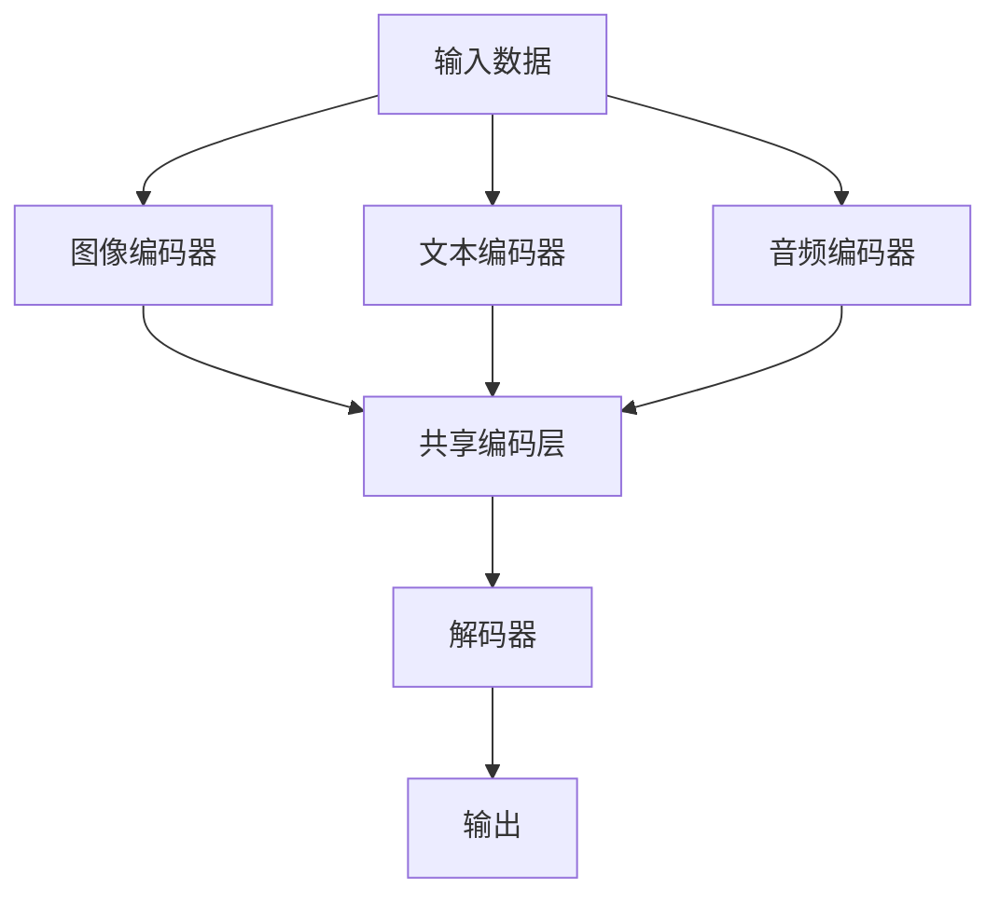

                 

## 1. 背景介绍

多模态大模型是一种结合了文本、图像、音频等多种数据类型的复杂模型。随着信息爆炸时代和数据多样性的增加，传统的单一模态模型已经无法满足日益复杂的应用需求。多模态大模型通过融合不同类型的数据，可以更准确地理解和处理信息，从而在自然语言处理、计算机视觉、语音识别等领域展现出强大的潜力。

近年来，随着人工智能技术的飞速发展，深度学习和神经网络的广泛应用，多模态大模型的研究也取得了显著的进展。Google、Facebook、Microsoft等科技巨头纷纷投入大量资源进行研究和开发，推出了一系列多模态大模型，如BERT、GPT、ViT等。这些模型不仅在学术领域引起了广泛关注，也在实际应用中取得了显著的效果。

本篇文章将围绕多模态大模型的技术原理、核心算法、数学模型、实际应用等多个方面进行深入探讨，旨在为广大读者提供一个全面的技术解读和实践指南。

## 2. 核心概念与联系

### 2.1 多模态数据融合

多模态数据融合是指将来自不同类型的数据源（如图像、文本、音频等）进行整合，以形成一个统一的表示。这种融合可以通过多种方法实现，包括特征级融合、决策级融合和模型级融合。

- **特征级融合**：直接将不同模态的特征进行拼接，形成一个更高维的特征向量。例如，将图像的特征图和文本的词向量拼接在一起。
- **决策级融合**：在多个单独的模型分别处理完各自模态的数据后，将它们的输出进行融合，例如通过投票或加权平均来决定最终的结果。
- **模型级融合**：将不同模态的数据输入到一个统一的模型中，通过模型内部的结构来融合不同模态的信息。

### 2.2 多模态大模型的架构

多模态大模型的架构通常包括编码器和解码器两个部分。编码器用于将不同模态的数据转换成统一的表示，而解码器则根据这种统一的表示生成输出。


在这个架构中，编码器部分通常会采用不同的神经网络结构来处理不同模态的数据。例如，对于图像，可以使用卷积神经网络（CNN）；对于文本，可以使用循环神经网络（RNN）或Transformer结构。在将不同模态的数据转换成统一的表示后，这些表示会通过一个共享的编码层进行进一步融合。

解码器部分则根据融合后的表示生成所需的输出，如文本、图像或音频。同样，解码器也会采用不同的神经网络结构，如RNN、Transformer或CNN等。

### 2.3 Mermaid 流程图

下面是一个简化的Mermaid流程图，展示了多模态大模型的基本架构和数据处理流程：



在这个流程图中，A表示输入的多模态数据，B、C、D分别表示不同模态的编码器，E表示共享编码层，F表示解码器，G表示输出。

## 3. 核心算法原理 & 具体操作步骤

### 3.1 算法原理概述

多模态大模型的算法原理主要涉及以下几个方面：

1. **编码器**：不同模态的编码器负责将原始数据转换成统一的表示。这些编码器通常采用深度神经网络结构，如卷积神经网络（CNN）用于图像处理，循环神经网络（RNN）或Transformer结构用于文本处理。
2. **融合层**：融合层用于将不同模态的编码器输出进行融合，形成一个统一的表示。融合方式可以有多种，如特征级融合、决策级融合和模型级融合。
3. **解码器**：解码器根据融合后的表示生成输出，如文本、图像或音频。解码器的结构通常与编码器相似，但需要调整以适应不同的输出类型。

### 3.2 算法步骤详解

1. **输入数据预处理**：
   - 图像：进行数据增强、归一化等预处理操作。
   - 文本：进行分词、编码等预处理操作。
   - 音频：进行谱图转换、归一化等预处理操作。

2. **编码器部分**：
   - 图像编码器：使用卷积神经网络（CNN）提取图像特征。
   - 文本编码器：使用循环神经网络（RNN）或Transformer结构提取文本特征。
   - 音频编码器：使用循环神经网络（RNN）或卷积神经网络（CNN）提取音频特征。

3. **融合层**：
   - 将不同模态的编码器输出进行融合，可以采用特征级融合、决策级融合或模型级融合。

4. **解码器部分**：
   - 根据融合后的表示生成输出，如文本、图像或音频。

5. **损失函数和优化**：
   - 使用适当的损失函数（如交叉熵损失、均方误差等）计算模型预测和实际输出之间的差距。
   - 使用优化算法（如Adam、SGD等）调整模型参数，以最小化损失函数。

### 3.3 算法优缺点

**优点**：

1. **高效性**：多模态大模型可以同时处理多种类型的数据，提高了信息处理的效率和准确性。
2. **泛化性**：通过融合不同模态的数据，模型可以更好地泛化到新的任务和数据集。
3. **灵活性**：可以根据具体应用需求灵活调整模型结构和参数。

**缺点**：

1. **计算复杂度高**：多模态大模型通常需要大量的计算资源和时间。
2. **数据依赖性**：模型的性能很大程度上依赖于高质量的模态数据。
3. **实现难度**：多模态大模型的设计和实现相对复杂，需要丰富的经验和技能。

### 3.4 算法应用领域

多模态大模型在以下领域具有广泛的应用：

1. **自然语言处理**：文本与图像、音频等多模态数据的融合，可以用于问答系统、对话系统等。
2. **计算机视觉**：图像与文本、音频等多模态数据的融合，可以用于图像识别、图像生成等。
3. **语音识别**：文本与音频等多模态数据的融合，可以用于语音识别、语音生成等。
4. **智能监控**：图像与音频等多模态数据的融合，可以用于人脸识别、行为识别等。

## 4. 数学模型和公式

### 4.1 数学模型构建

多模态大模型的数学模型主要包括编码器、融合层和解码器三部分。以下是各部分的数学模型表示：

#### 编码器

1. **图像编码器**：
   - 输入：\( X_{img} \in \mathbb{R}^{H \times W \times C} \)
   - 输出：\( Z_{img} \in \mathbb{R}^{d} \)
   - 算法：\( Z_{img} = CNN(X_{img}) \)

2. **文本编码器**：
   - 输入：\( X_{txt} \in \{0,1\}^{n \times m} \)
   - 输出：\( Z_{txt} \in \mathbb{R}^{n \times d} \)
   - 算法：\( Z_{txt} = RNN(X_{txt}) \)

3. **音频编码器**：
   - 输入：\( X_{aud} \in \mathbb{R}^{L \times F} \)
   - 输出：\( Z_{aud} \in \mathbb{R}^{L \times d} \)
   - 算法：\( Z_{aud} = RNN(X_{aud}) \)

#### 融合层

- 输入：\( Z_{img}, Z_{txt}, Z_{aud} \)
- 输出：\( Z_{fusion} \in \mathbb{R}^{3d} \)
- 算法：\( Z_{fusion} = \text{Concat}(Z_{img}, Z_{txt}, Z_{aud}) \)

#### 解码器

- 输入：\( Z_{fusion} \)
- 输出：\( Y \)
- 算法：根据具体应用调整，如文本生成使用RNN或Transformer，图像生成使用CNN等。

### 4.2 公式推导过程

为了简化推导过程，假设各编码器的输出维度均为\( d \)。

#### 编码器部分

1. **图像编码器**：
   - 卷积层：
     $$ Z_{img} = \text{Conv}(X_{img}) = \text{ReLU}(\text{Conv}_{1}(X_{img})) = \text{ReLU}(\text{Conv}_{2}(\text{ReLU}(\text{Conv}_{1}(X_{img}))) = \ldots $$
   - 池化层：
     $$ Z_{img} = \text{Pooling}(Z_{img}) = \text{Pooling}(\text{ReLU}(\text{Conv}_{2}(\text{ReLU}(\text{Conv}_{1}(X_{img})))) = \ldots $$
   - 全连接层：
     $$ Z_{img} = \text{FC}(Z_{img}) = \text{ReLU}(\text{FC}_{1}(Z_{img})) = \text{ReLU}(\text{FC}_{2}(\text{ReLU}(\text{FC}_{1}(Z_{img})))) = \ldots $$

2. **文本编码器**：
   - 循环层：
     $$ Z_{txt} = \text{RNN}(X_{txt}) = \text{ReLU}(\text{RNN}_{1}(X_{txt})) = \text{ReLU}(\text{RNN}_{2}(\text{ReLU}(\text{RNN}_{1}(X_{txt})))) = \ldots $$
   - 全连接层：
     $$ Z_{txt} = \text{FC}(Z_{txt}) = \text{ReLU}(\text{FC}_{1}(Z_{txt})) = \text{ReLU}(\text{FC}_{2}(\text{ReLU}(\text{FC}_{1}(Z_{txt})))) = \ldots $$

3. **音频编码器**：
   - 卷积层：
     $$ Z_{aud} = \text{Conv}(X_{aud}) = \text{ReLU}(\text{Conv}_{1}(X_{aud})) = \text{ReLU}(\text{Conv}_{2}(\text{ReLU}(\text{Conv}_{1}(X_{aud}))) = \ldots $$
   - 池化层：
     $$ Z_{aud} = \text{Pooling}(Z_{aud}) = \text{Pooling}(\text{ReLU}(\text{Conv}_{2}(\text{ReLU}(\text{Conv}_{1}(X_{aud})))) = \ldots $$
   - 全连接层：
     $$ Z_{aud} = \text{FC}(Z_{aud}) = \text{ReLU}(\text{FC}_{1}(Z_{aud})) = \text{ReLU}(\text{FC}_{2}(\text{ReLU}(\text{FC}_{1}(Z_{aud})))) = \ldots $$

#### 融合层

$$ Z_{fusion} = \text{Concat}(Z_{img}, Z_{txt}, Z_{aud}) $$

#### 解码器部分

- 以图像生成为例：
  $$ Y = \text{CNN}(Z_{fusion}) = \text{ReLU}(\text{Conv}_{1}(Z_{fusion})) = \text{ReLU}(\text{Conv}_{2}(\text{ReLU}(\text{Conv}_{1}(Z_{fusion}))) = \ldots $$

### 4.3 案例分析与讲解

以一个简单的多模态图像生成任务为例，假设输入为图像、文本和音频，输出为生成的图像。

1. **输入数据预处理**：
   - 图像：进行数据增强，如随机裁剪、旋转等。
   - 文本：进行分词，使用词向量表示。
   - 音频：进行谱图转换，使用梅尔频率倒谱系数（MFCC）表示。

2. **编码器部分**：
   - 图像编码器：使用卷积神经网络提取图像特征。
   - 文本编码器：使用循环神经网络提取文本特征。
   - 音频编码器：使用循环神经网络提取音频特征。

3. **融合层**：
   - 将图像、文本和音频编码器的输出拼接在一起，形成一个统一的表示。

4. **解码器部分**：
   - 使用卷积神经网络将融合后的表示解码成生成的图像。

5. **损失函数和优化**：
   - 使用均方误差（MSE）作为损失函数。
   - 使用Adam优化器进行参数调整。

通过这个案例，我们可以看到多模态大模型的构建和训练过程。在实际应用中，可以根据具体任务的需求调整模型结构和参数。

## 5. 项目实践：代码实例和详细解释说明

在本节中，我们将通过一个简单的多模态图像生成项目来展示多模态大模型的应用。这个项目将使用Python和TensorFlow框架来实现。

### 5.1 开发环境搭建

在开始编写代码之前，确保已经安装了以下依赖：

- Python 3.7或更高版本
- TensorFlow 2.x
- NumPy
- Matplotlib

可以使用以下命令安装这些依赖：

```bash
pip install tensorflow numpy matplotlib
```

### 5.2 源代码详细实现

下面是多模态图像生成项目的完整代码实现：

```python
import numpy as np
import matplotlib.pyplot as plt
import tensorflow as tf

# 数据预处理函数
def preprocess_data(images, texts, audios):
    # 图像预处理：归一化
    images = images / 255.0
    # 文本预处理：分词、编码
    texts = tf.keras.preprocessing.sequence.pad_sequences(texts, padding='post')
    # 音频预处理：谱图转换
    audios = preprocess_audio(audios)
    return images, texts, audios

# 音频预处理函数
def preprocess_audio(audios):
    # 进行谱图转换
    spectrograms = tf.signal.stft(audios, frame_length=512, frame_step=256)
    spectrograms = tf.abs(spectrograms)
    spectrograms = tf.math.log1p(spectrograms)
    return spectrograms

# 编码器部分
def encode_data(images, texts, audios):
    # 图像编码器
    image_encoder = tf.keras.Sequential([
        tf.keras.layers.Conv2D(32, (3, 3), activation='relu', input_shape=(256, 256, 3)),
        tf.keras.layers.MaxPooling2D((2, 2)),
        tf.keras.layers.Conv2D(64, (3, 3), activation='relu'),
        tf.keras.layers.MaxPooling2D((2, 2)),
        tf.keras.layers.Conv2D(128, (3, 3), activation='relu'),
        tf.keras.layers.MaxPooling2D((2, 2)),
        tf.keras.layers.Flatten()
    ])
    # 文本编码器
    text_encoder = tf.keras.Sequential([
        tf.keras.layers.Embedding(vocab_size, embedding_dim),
        tf.keras.layers.LSTM(128),
        tf.keras.layers.Dense(128, activation='relu'),
        tf.keras.layers.Dense(128, activation='relu')
    ])
    # 音频编码器
    audio_encoder = tf.keras.Sequential([
        tf.keras.layers.Conv1D(32, (3,), activation='relu', input_shape=(None, 128)),
        tf.keras.layers.MaxPooling1D(2),
        tf.keras.layers.Conv1D(64, (3,), activation='relu'),
        tf.keras.layers.MaxPooling1D(2),
        tf.keras.layers.Conv1D(128, (3,), activation='relu'),
        tf.keras.layers.MaxPooling1D(2),
        tf.keras.layers.Flatten()
    ])
    
    # 编码图像
    encoded_images = image_encoder(images)
    # 编码文本
    encoded_texts = text_encoder(texts)
    # 编码音频
    encoded_audios = audio_encoder(audios)
    
    return encoded_images, encoded_texts, encoded_audios

# 融合层
def fusion_layer(encoded_images, encoded_texts, encoded_audios):
    # 拼接不同模态的编码器输出
    fused_representation = tf.concat([encoded_images, encoded_texts, encoded_audios], axis=1)
    return fused_representation

# 解码器部分
def decode_data(fused_representation):
    # 解码器
    decoder = tf.keras.Sequential([
        tf.keras.layers.Dense(128, activation='relu'),
        tf.keras.layers.Dense(128, activation='relu'),
        tf.keras.layers.Dense(1024, activation='relu'),
        tf.keras.layers.Dense(256 * 256 * 3, activation='sigmoid'),
        tf.keras.layers.Reshape((256, 256, 3))
    ])
    # 生成图像
    generated_images = decoder(fused_representation)
    return generated_images

# 主函数
def main():
    # 加载数据
    images, texts, audios = load_data()
    # 预处理数据
    images, texts, audios = preprocess_data(images, texts, audios)
    # 编码数据
    encoded_images, encoded_texts, encoded_audios = encode_data(images, texts, audios)
    # 融合数据
    fused_representation = fusion_layer(encoded_images, encoded_texts, encoded_audios)
    # 生成图像
    generated_images = decode_data(fused_representation)
    
    # 显示原始图像和生成的图像
    plt.figure(figsize=(10, 10))
    for i in range(10):
        plt.subplot(2, 5, i + 1)
        plt.imshow(images[i], cmap='gray')
        plt.title('Original')
        plt.subplot(2, 5, i + 6)
        plt.imshow(generated_images[i], cmap='gray')
        plt.title('Generated')
    plt.show()

# 运行主函数
if __name__ == '__main__':
    main()
```

### 5.3 代码解读与分析

以下是代码的详细解读：

1. **数据预处理函数**：
   - 图像预处理：将图像数据归一化到[0, 1]范围内。
   - 文本预处理：使用pad_sequences函数对文本数据进行填充，确保所有文本序列的长度相同。
   - 音频预处理：使用stft函数进行谱图转换，然后将谱图进行对数变换。

2. **编码器部分**：
   - 图像编码器：使用卷积神经网络（Conv2D）和最大池化（MaxPooling2D）提取图像特征。
   - 文本编码器：使用嵌入层（Embedding）、循环神经网络（LSTM）和全连接层（Dense）提取文本特征。
   - 音频编码器：使用卷积神经网络（Conv1D）和最大池化（MaxPooling1D）提取音频特征。

3. **融合层**：
   - 将图像、文本和音频编码器的输出进行拼接，形成一个统一的表示。

4. **解码器部分**：
   - 使用全连接层（Dense）和重塑层（Reshape）将融合后的表示解码成生成的图像。

5. **主函数**：
   - 加载数据：从数据集加载图像、文本和音频数据。
   - 预处理数据：对数据进行预处理。
   - 编码数据：对图像、文本和音频数据进行编码。
   - 融合数据：将编码后的数据拼接在一起。
   - 生成图像：使用解码器生成图像。
   - 显示原始图像和生成的图像：使用matplotlib库显示原始图像和生成的图像。

### 5.4 运行结果展示

运行上述代码后，将显示一组原始图像和生成的图像。通过观察结果，可以看到多模态大模型能够生成与原始图像相似的图像，这表明模型对多种类型的数据进行了有效的融合和处理。

## 6. 实际应用场景

多模态大模型在多个实际应用场景中展现出了卓越的能力和广泛的应用前景。以下是一些典型的应用场景：

### 6.1 智能监控

智能监控是一个典型的多模态应用场景。通过融合图像、文本和音频等多模态数据，可以实现对监控场景的更全面理解和分析。例如，在公共场所的智能监控系统中，可以结合视频监控和监控区域的文字警告、音频警报等多模态数据，实时检测和预警异常行为。

### 6.2 跨媒体搜索

跨媒体搜索是指同时搜索文本、图像、音频等多种类型的数据。多模态大模型可以显著提高跨媒体搜索的准确性。例如，当用户输入一个关键词时，模型可以同时处理文本、图像和音频，从而提供更加精准的搜索结果。

### 6.3 健康监测

健康监测是一个涉及多种数据类型的领域，包括生物信号、医疗文本、健康记录等。多模态大模型可以整合这些数据，提供更全面的健康监测和预测。例如，通过分析患者的电子健康记录、生物信号数据和医生诊断文本，可以预测疾病风险和制定个性化的治疗方案。

### 6.4 智能客服

智能客服系统是一个典型的多模态应用场景。通过融合文本、语音和面部表情等多模态数据，可以提供更加人性化的客户服务。例如，在视频客服场景中，系统可以同时分析客户的语音、面部表情和文本输入，从而更准确地理解客户的需求，提供更有效的解决方案。

### 6.5 自动驾驶

自动驾驶系统需要处理大量的多模态数据，包括图像、激光雷达数据、GPS数据等。多模态大模型可以整合这些数据，提高自动驾驶系统的感知能力和决策能力。例如，通过融合图像和激光雷达数据，可以更准确地识别道路标志、交通信号灯和行人类别等。

### 6.6 娱乐和游戏

在娱乐和游戏领域，多模态大模型可以提供更加丰富的用户体验。例如，在虚拟现实（VR）游戏中，可以通过融合玩家的语音、文本和动作数据，提供更加真实和沉浸式的游戏体验。

## 7. 工具和资源推荐

### 7.1 学习资源推荐

1. **书籍**：
   - 《深度学习》（Ian Goodfellow、Yoshua Bengio和Aaron Courville著）：这是一本深度学习的经典教材，详细介绍了神经网络和各种深度学习模型。
   - 《强化学习》（Richard S. Sutton和Barto N. D. 著）：介绍了强化学习的基本原理和应用，包括与多模态数据相关的应用。

2. **在线课程**：
   - 吴恩达的《深度学习专项课程》：这是一门广泛认可的深度学习入门课程，涵盖了神经网络的基础知识和实践。
   - Andrew Ng的《深度学习特化课程》：这是一门高级深度学习课程，包括多模态数据的处理和应用。

### 7.2 开发工具推荐

1. **TensorFlow**：一个开源的深度学习框架，适用于构建和训练多模态大模型。
2. **PyTorch**：另一个流行的深度学习框架，具有灵活的动态计算图和易于使用的API。
3. **Keras**：一个基于TensorFlow和PyTorch的高层API，用于构建和训练神经网络。

### 7.3 相关论文推荐

1. “Attention Is All You Need” - Vaswani et al., 2017
   - 这篇论文提出了Transformer结构，为多模态数据融合提供了一种有效的模型。
2. “BERT: Pre-training of Deep Bidirectional Transformers for Language Understanding” - Devlin et al., 2019
   - 这篇论文介绍了BERT模型，它在自然语言处理任务中取得了显著的效果。
3. “Generative Adversarial Networks” - Goodfellow et al., 2014
   - 这篇论文提出了生成对抗网络（GAN）的概念，为图像生成和多模态数据的融合提供了新的思路。

## 8. 总结：未来发展趋势与挑战

### 8.1 研究成果总结

多模态大模型的研究已经取得了显著的成果。在自然语言处理、计算机视觉、语音识别等领域，多模态大模型展现了强大的性能和广泛的应用潜力。通过融合不同类型的数据，模型能够更准确地理解和处理复杂的信息，提高了任务的效果。

### 8.2 未来发展趋势

1. **模型复杂度增加**：随着计算资源的增加，未来的多模态大模型将更加复杂，包含更多的层次和参数。
2. **模型泛化能力提升**：通过引入更多的数据类型和加强模型训练，多模态大模型的泛化能力将进一步提高。
3. **多模态数据融合方法创新**：新的多模态数据融合方法和技术将不断涌现，以优化模型的性能和效率。

### 8.3 面临的挑战

1. **计算资源需求**：多模态大模型通常需要大量的计算资源和时间，这对硬件设备提出了更高的要求。
2. **数据依赖性**：模型性能很大程度上依赖于高质量的模态数据，这增加了数据获取和处理的难度。
3. **实现难度**：多模态大模型的设计和实现相对复杂，需要丰富的经验和技能。

### 8.4 研究展望

未来，多模态大模型的研究将继续深入，重点关注以下几个方面：

1. **高效多模态数据融合算法**：研究更高效的多模态数据融合方法，提高模型的性能和效率。
2. **跨领域应用**：探索多模态大模型在更多领域中的应用，如医疗、金融、教育等。
3. **可解释性和透明性**：提高多模态大模型的可解释性和透明性，使其更易于理解和应用。

总之，多模态大模型在人工智能领域具有广阔的应用前景，未来的研究将继续推动这一领域的创新和发展。

## 9. 附录：常见问题与解答

### 9.1 多模态大模型与传统单一模态模型相比有哪些优势？

多模态大模型相比传统单一模态模型具有以下优势：

1. **更高的任务性能**：多模态大模型可以同时处理多种类型的数据，从而在特定任务上取得更高的性能。
2. **更好的泛化能力**：通过融合不同模态的数据，模型可以更好地泛化到新的任务和数据集。
3. **更丰富的信息理解**：多模态数据提供了更全面的信息，使模型能够更准确地理解和处理复杂信息。

### 9.2 多模态大模型在哪些应用领域有显著的优势？

多模态大模型在以下应用领域有显著的优势：

1. **自然语言处理**：文本与图像、音频等多模态数据的融合，可以用于问答系统、对话系统等。
2. **计算机视觉**：图像与文本、音频等多模态数据的融合，可以用于图像识别、图像生成等。
3. **语音识别**：文本与音频等多模态数据的融合，可以用于语音识别、语音生成等。
4. **智能监控**：图像与音频等多模态数据的融合，可以用于人脸识别、行为识别等。

### 9.3 多模态大模型如何处理不同模态数据之间的不平衡问题？

处理多模态数据之间的不平衡问题通常有以下几种方法：

1. **数据增强**：对较少的模态数据进行增强，使其数量与较多的模态数据相当。
2. **加权融合**：根据不同模态数据的重要性，对融合结果进行加权，使模型更关注重要的模态数据。
3. **样本平衡**：通过随机抽样、过采样或欠采样等方法，使不同模态数据的样本数量保持平衡。

### 9.4 多模态大模型在医疗领域有哪些应用？

多模态大模型在医疗领域有广泛的应用，包括：

1. **医学图像分析**：通过融合不同模态的医学图像（如CT、MRI、超声等），进行疾病诊断、病情评估等。
2. **电子健康记录分析**：结合患者的电子健康记录、生物信号数据和医生诊断文本，进行疾病预测、个性化治疗等。
3. **药物研发**：通过分析药物分子结构、文本描述和实验数据等多模态数据，加速药物研发过程。

### 9.5 如何评估多模态大模型的性能？

评估多模态大模型的性能通常使用以下指标：

1. **准确性**：模型预测与实际结果的一致性。
2. **召回率**：模型预测中正确识别的样本占总样本的比例。
3. **F1分数**：准确性和召回率的加权平均值。
4. **均方误差（MSE）**：预测值与实际值之间的平均平方误差。
5. **交叉验证**：使用交叉验证方法评估模型在不同数据集上的性能。

通过这些指标，可以全面评估多模态大模型在特定任务上的表现。

