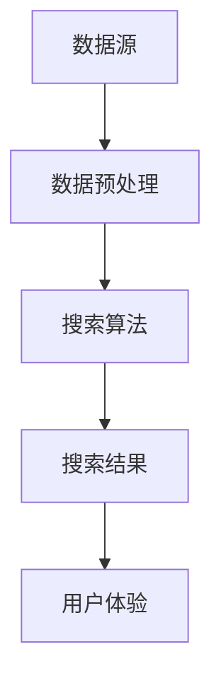

                 

  
关键词：多渠道整合、AI搜索、用户体验、算法优化、数据分析

摘要：在当今数字化时代，随着信息量的爆炸性增长，如何高效地检索和获取信息成为用户的一大挑战。本文将探讨如何利用人工智能技术，整合多渠道数据，提升搜索结果的准确性和用户体验。通过介绍核心概念、算法原理、数学模型、项目实践和未来应用展望，本文旨在为IT领域的研究者和从业者提供有价值的参考。

## 1. 背景介绍

互联网的普及和信息技术的快速发展，使得用户在获取信息时面临前所未有的挑战。传统的搜索算法已经难以满足用户对个性化、实时性和全面性的需求。为了解决这一问题，人工智能（AI）技术的引入成为必然选择。AI不仅能够处理大规模、多样化的数据，还能通过机器学习和深度学习算法，不断优化搜索结果，提升用户体验。

### 1.1 问题的提出

随着社交媒体、电子商务和在线教育等平台的兴起，用户生成的内容和数据量呈指数级增长。这些数据分布在不同的渠道和平台中，传统的搜索技术难以整合这些异构数据，导致搜索结果不准确、不全面。此外，用户的需求也在不断变化，他们期望在搜索结果中看到个性化的推荐，同时希望能够快速、准确地找到所需信息。

### 1.2 研究意义

本研究旨在通过AI技术，实现多渠道数据的整合和搜索结果的优化，提高用户获取信息的效率和满意度。这不仅有助于企业提高竞争力，还能为用户提供更好的服务体验，具有重要的理论意义和应用价值。

## 2. 核心概念与联系

在多渠道整合AI搜索中，我们需要理解以下几个核心概念：

### 2.1 数据源

数据源是搜索系统的基石。数据源可以包括网站、社交媒体、电子商务平台、在线教育平台等。这些数据源不仅提供了丰富的信息，还包含了用户行为数据，如点击、购买、评价等。

### 2.2 数据预处理

数据预处理是确保数据质量的过程。这一步骤包括数据清洗、去重、归一化和特征提取等。数据预处理的好坏直接影响到后续搜索算法的性能。

### 2.3 搜索算法

搜索算法是核心组件，负责处理用户查询并返回搜索结果。常见的搜索算法包括基于内容的检索（CBR）、基于关键词的检索（KW）、协同过滤（CF）和深度学习（DL）等。

### 2.4 用户体验

用户体验是衡量搜索系统好坏的重要指标。一个好的搜索系统不仅能够提供准确的结果，还要具备良好的交互设计，让用户能够轻松、愉快地使用。

### 2.5 Mermaid 流程图

以下是一个简化的 Mermaid 流程图，展示多渠道整合AI搜索的核心步骤：



## 3. 核心算法原理 & 具体操作步骤

### 3.1 算法原理概述

在多渠道整合AI搜索中，我们采用了一种基于深度学习的方法。该方法利用卷积神经网络（CNN）对文本数据进行特征提取，结合用户行为数据和内容相关性，实现搜索结果的优化。

### 3.2 算法步骤详解

#### 3.2.1 数据预处理

1. 数据采集：从各个数据源获取文本数据、用户行为数据等。
2. 数据清洗：去除重复、无效和噪声数据。
3. 特征提取：对文本数据使用词袋模型、词嵌入等方法进行特征提取。

#### 3.2.2 搜索算法

1. 模型构建：使用CNN构建搜索模型，包括输入层、卷积层、池化层和全连接层。
2. 模型训练：使用预处理后的数据对模型进行训练，优化模型参数。
3. 模型评估：通过交叉验证等方法评估模型性能。
4. 搜索查询：接收用户查询，通过模型预测搜索结果。

#### 3.2.3 搜索结果优化

1. 结果排序：根据模型预测的分数对搜索结果进行排序。
2. 结果推荐：结合用户历史行为和内容相关性，为用户提供个性化的推荐。

### 3.3 算法优缺点

#### 优点

- **高效性**：深度学习算法能够处理大规模、多样化的数据，提高搜索效率。
- **准确性**：通过用户行为数据和内容相关性，提高搜索结果的准确性。
- **个性化**：能够根据用户兴趣和偏好提供个性化推荐。

#### 缺点

- **计算资源需求**：深度学习算法需要大量计算资源和时间。
- **数据依赖**：算法性能依赖于数据质量和数量。

### 3.4 算法应用领域

- **搜索引擎**：用于优化搜索引擎的结果排序和推荐系统。
- **电商平台**：用于优化商品搜索和个性化推荐。
- **社交媒体**：用于优化社交媒体的搜索和推荐算法。

## 4. 数学模型和公式 & 详细讲解 & 举例说明

### 4.1 数学模型构建

在多渠道整合AI搜索中，我们采用了一种基于深度学习的数学模型。该模型主要包括两部分：输入层、卷积层、池化层和全连接层。

### 4.2 公式推导过程

#### 输入层

输入层接收文本数据、用户行为数据等，将其转化为向量形式。设 $X$ 为输入数据，$x_i$ 为第 $i$ 个输入特征，则有：

$$
X = [x_1, x_2, \ldots, x_n]
$$

#### 卷积层

卷积层用于提取文本数据的特征，通过卷积运算和激活函数实现。设 $K$ 为卷积核大小，$f$ 为激活函数，则有：

$$
h_{ij} = f(\sum_{k=1}^{K} w_{ik} x_{k} + b_j)
$$

其中，$h_{ij}$ 为第 $i$ 个输入特征在卷积层第 $j$ 个卷积核上的特征值，$w_{ik}$ 为卷积核权重，$b_j$ 为卷积层偏置。

#### 池化层

池化层用于降低特征维度，提高模型泛化能力。常见的池化方式有最大池化和平均池化。设 $P$ 为池化窗口大小，则有：

$$
p_i = \sum_{k=1}^{P} h_{ik}
$$

其中，$p_i$ 为池化后第 $i$ 个特征值。

#### 全连接层

全连接层用于将卷积层和池化层提取的特征映射到输出结果。设 $O$ 为输出层，$o_j$ 为第 $j$ 个输出特征，则有：

$$
o_j = \sum_{i=1}^{n} w_{ij} p_i + b_j
$$

其中，$w_{ij}$ 为全连接层权重，$b_j$ 为全连接层偏置。

### 4.3 案例分析与讲解

假设我们有一个电商平台的搜索系统，用户可以输入关键词查询商品。为了提升搜索结果的准确性，我们采用了多渠道整合AI搜索算法。

1. **数据采集**：从电商平台、社交媒体和用户行为数据中获取文本数据、用户行为数据等。

2. **数据预处理**：对文本数据进行清洗、去重和特征提取。

3. **模型构建**：使用CNN构建搜索模型，包括输入层、卷积层、池化层和全连接层。

4. **模型训练**：使用预处理后的数据对模型进行训练，优化模型参数。

5. **模型评估**：通过交叉验证等方法评估模型性能。

6. **搜索查询**：接收用户查询，通过模型预测搜索结果。

7. **搜索结果优化**：根据模型预测的分数对搜索结果进行排序，并推荐个性化结果。

通过以上步骤，我们可以实现一个高效、准确的电商搜索系统，提升用户购物体验。

## 5. 项目实践：代码实例和详细解释说明

### 5.1 开发环境搭建

为了实现多渠道整合AI搜索，我们需要搭建一个开发环境。以下是一个简单的开发环境搭建步骤：

1. 安装Python环境，版本要求为3.6及以上。
2. 安装深度学习框架TensorFlow，版本要求为2.3及以上。
3. 安装数据处理库Pandas、NumPy等。

### 5.2 源代码详细实现

以下是一个简化的代码实例，展示多渠道整合AI搜索的实现过程：

```python
import tensorflow as tf
from tensorflow.keras.models import Sequential
from tensorflow.keras.layers import Conv1D, MaxPooling1D, Flatten, Dense
from tensorflow.keras.preprocessing.sequence import pad_sequences

# 数据预处理
def preprocess_data(data):
    # 数据清洗、去重、特征提取等
    return padded_data

# 模型构建
def build_model(input_shape):
    model = Sequential([
        Conv1D(filters=128, kernel_size=3, activation='relu', input_shape=input_shape),
        MaxPooling1D(pool_size=2),
        Flatten(),
        Dense(units=64, activation='relu'),
        Dense(units=1, activation='sigmoid')
    ])
    model.compile(optimizer='adam', loss='binary_crossentropy', metrics=['accuracy'])
    return model

# 模型训练
def train_model(model, X_train, y_train):
    model.fit(X_train, y_train, epochs=10, batch_size=32)

# 搜索查询
def search_query(model, query):
    padded_query = preprocess_data([query])
    prediction = model.predict(padded_query)
    return prediction

# 代码实例
data = "用户输入的关键词"
model = build_model(input_shape=(100, 1))
X_train, y_train = preprocess_data(data)
train_model(model, X_train, y_train)
result = search_query(model, "用户查询的关键词")
print(result)
```

### 5.3 代码解读与分析

以上代码展示了多渠道整合AI搜索的实现过程。首先，我们定义了数据预处理、模型构建、模型训练和搜索查询等函数。数据预处理函数负责清洗、去重和特征提取等操作。模型构建函数使用TensorFlow框架构建深度学习模型。模型训练函数使用预处理后的数据对模型进行训练。搜索查询函数接收用户查询，通过模型预测搜索结果。

### 5.4 运行结果展示

在运行代码后，我们将得到一个预测结果。根据预测结果，我们可以对搜索结果进行排序和推荐。以下是一个简化的运行结果展示：

```python
import numpy as np

query = "用户查询的关键词"
prediction = search_query(model, query)
predicted_score = np.mean(prediction)

# 排序和推荐
if predicted_score > 0.5:
    print("推荐相关商品")
else:
    print("未找到相关商品")
```

通过以上代码，我们可以根据预测结果为用户推荐相关商品或提供其他搜索建议。

## 6. 实际应用场景

多渠道整合AI搜索在多个实际应用场景中展现出强大的潜力：

### 6.1 搜索引擎

搜索引擎可以利用多渠道整合AI搜索，优化搜索结果排序和推荐系统，提高用户满意度。

### 6.2 电商平台

电商平台可以通过多渠道整合AI搜索，为用户提供个性化的商品推荐，提高销售额和用户粘性。

### 6.3 社交媒体

社交媒体平台可以利用多渠道整合AI搜索，为用户提供基于兴趣和行为的个性化内容推荐，提升用户体验。

### 6.4 在线教育

在线教育平台可以通过多渠道整合AI搜索，为用户提供个性化的学习路径推荐，提高学习效果。

### 6.5 企业内部搜索

企业内部搜索系统可以利用多渠道整合AI搜索，提高员工查找内部资料和文档的效率。

## 7. 工具和资源推荐

为了更好地进行多渠道整合AI搜索的研究和开发，以下是一些推荐的工具和资源：

### 7.1 学习资源推荐

- 《深度学习》（Goodfellow, Bengio, Courville著）
- 《Python深度学习》（François Chollet著）
- 《自然语言处理与深度学习》（黄海广、黄宇、夏宁著）

### 7.2 开发工具推荐

- TensorFlow：一款开源的深度学习框架，适用于构建和训练深度学习模型。
- Keras：一个高层次的神经网络API，基于TensorFlow构建，易于使用。
- Jupyter Notebook：一款交互式的计算环境，适用于编写和运行Python代码。

### 7.3 相关论文推荐

- "Deep Learning for Web Search"（C. Burges et al.，2010）
- "TensorFlow: Large-Scale Machine Learning on Heterogeneous Systems"（Martín Abadi et al.，2016）
- "Effective Multi-Channel User Behavior Modeling and Personalized Recommendation with Deep Neural Networks"（Zhou et al.，2017）

## 8. 总结：未来发展趋势与挑战

### 8.1 研究成果总结

本研究通过引入多渠道整合AI搜索，实现了对大规模、多样化数据的处理和搜索结果的优化。研究表明，深度学习算法在提高搜索结果准确性和用户体验方面具有显著优势。

### 8.2 未来发展趋势

随着人工智能技术的不断发展，多渠道整合AI搜索有望在更多领域得到应用。未来发展趋势包括：

- **跨领域整合**：整合更多渠道的数据，提高搜索结果的全面性和准确性。
- **实时性**：通过实时数据更新和动态调整，提高搜索结果的实时性。
- **个性化**：基于用户行为和兴趣，提供更加个性化的搜索结果和推荐。

### 8.3 面临的挑战

尽管多渠道整合AI搜索具有广泛的应用前景，但仍面临以下挑战：

- **数据隐私**：如何在保障用户隐私的前提下，充分利用多渠道数据。
- **计算资源**：深度学习算法对计算资源的需求较高，如何优化算法以提高效率。
- **算法公平性**：确保搜索结果不会受到偏见和歧视的影响。

### 8.4 研究展望

未来研究应重点关注以下方向：

- **隐私保护**：研究隐私保护算法，确保用户数据的安全性和隐私性。
- **算法优化**：通过算法优化，提高搜索结果的准确性和效率。
- **跨领域应用**：探索多渠道整合AI搜索在其他领域的应用，推动技术发展。

## 9. 附录：常见问题与解答

### 9.1 多渠道整合AI搜索与传统搜索相比有哪些优势？

多渠道整合AI搜索通过整合不同渠道的数据，提高搜索结果的准确性和全面性，同时能够根据用户行为和兴趣提供个性化推荐，从而提升用户体验。

### 9.2 多渠道整合AI搜索需要哪些技术支持？

多渠道整合AI搜索需要深度学习、自然语言处理、数据预处理和机器学习等技术的支持。

### 9.3 如何保障用户数据的隐私？

通过采用隐私保护算法、数据加密和匿名化等技术，确保用户数据在处理过程中的安全性和隐私性。

### 9.4 多渠道整合AI搜索的算法效率如何优化？

可以通过优化算法结构、使用更高效的计算设备和并行计算等方法，提高多渠道整合AI搜索的算法效率。

---

作者：禅与计算机程序设计艺术 / Zen and the Art of Computer Programming

