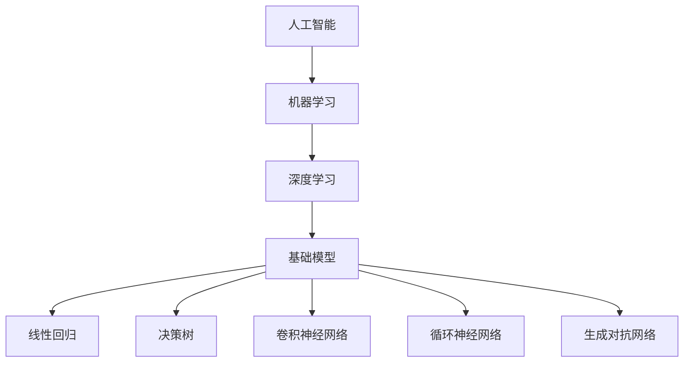

                 

关键词：大学、基础模型、研究使命、教育、人工智能、技术创新

> 摘要：本文将探讨大学在基础模型研究中的使命。随着人工智能技术的飞速发展，基础模型作为人工智能的核心组成部分，其研究在大学中具有重要的战略意义。本文将分析大学在基础模型研究中的角色、挑战以及未来发展。

## 1. 背景介绍

基础模型，是指那些能够对复杂问题进行建模、求解和分析的数学模型或算法。它们是人工智能技术的基石，影响着人工智能系统的性能、效率和可靠性。近年来，随着深度学习、神经网络等技术的不断发展，基础模型在各个领域都取得了显著的成果，如图像识别、自然语言处理、推荐系统等。

大学作为培养人才、推动科学研究和创新的重要基地，在基础模型的研究中扮演着至关重要的角色。大学不仅是基础模型研究的主要场所，也是培养和聚集高素质研究人才的重要平台。同时，大学的研究成果和学术交流也极大地推动了基础模型的发展。

## 2. 核心概念与联系

### 2.1 人工智能与基础模型

人工智能（AI）是计算机科学的一个分支，旨在使计算机具备人类智能的能力。基础模型作为人工智能的核心组成部分，是实现人工智能的关键技术之一。它能够对大量的数据进行训练，从而形成一种能够自动学习和适应的智能系统。

### 2.2 机器学习与基础模型

机器学习是人工智能的一个重要分支，它通过算法使计算机从数据中学习，从而实现自动化。基础模型在机器学习中起着核心作用，如线性回归、决策树、支持向量机等。

### 2.3 深度学习与基础模型

深度学习是机器学习的一种方法，通过多层神经网络对数据进行训练。深度学习的基础模型包括卷积神经网络（CNN）、循环神经网络（RNN）和生成对抗网络（GAN）等。

### 2.4 Mermaid 流程图

下面是一个用于描述基础模型与人工智能、机器学习和深度学习之间关系的 Mermaid 流程图：



## 3. 核心算法原理 & 具体操作步骤

### 3.1 算法原理概述

基础模型的算法原理通常基于统计学、线性代数、概率论等数学理论。例如，线性回归模型通过寻找一个线性关系来预测目标值；决策树模型通过划分数据集来生成一系列决策路径。

### 3.2 算法步骤详解

以线性回归模型为例，其具体步骤如下：

1. **数据收集**：收集相关数据，包括自变量和因变量。
2. **数据预处理**：对数据进行清洗、归一化等处理。
3. **模型构建**：根据数据特征，选择合适的线性回归模型。
4. **模型训练**：通过最小二乘法等优化算法，寻找最佳拟合直线。
5. **模型评估**：使用测试集评估模型性能，调整参数。
6. **模型应用**：将训练好的模型应用于实际问题。

### 3.3 算法优缺点

线性回归模型具有计算简单、易于解释等优点，但也存在一些缺点，如假设线性关系、对异常值敏感等。

### 3.4 算法应用领域

线性回归模型广泛应用于金融、医疗、营销等多个领域，用于预测股价、诊断疾病、分析客户需求等。

## 4. 数学模型和公式 & 详细讲解 & 举例说明

### 4.1 数学模型构建

线性回归模型的数学模型可以表示为：

$$y = \beta_0 + \beta_1x + \epsilon$$

其中，$y$为因变量，$x$为自变量，$\beta_0$和$\beta_1$分别为模型参数，$\epsilon$为误差项。

### 4.2 公式推导过程

线性回归模型的推导过程主要涉及最小二乘法。具体推导过程如下：

1. **定义损失函数**：损失函数通常为残差平方和，即$J(\beta_0, \beta_1) = \sum_{i=1}^n (y_i - (\beta_0 + \beta_1x_i))^2$。
2. **求导并令导数为零**：对损失函数分别对$\beta_0$和$\beta_1$求偏导，并令导数为零，得到以下方程组：

   $$\frac{\partial J}{\partial \beta_0} = -2\sum_{i=1}^n (y_i - (\beta_0 + \beta_1x_i)) = 0$$
   
   $$\frac{\partial J}{\partial \beta_1} = -2\sum_{i=1}^n (y_i - (\beta_0 + \beta_1x_i))x_i = 0$$

3. **求解方程组**：解上述方程组，得到最优参数$\beta_0$和$\beta_1$。

### 4.3 案例分析与讲解

假设我们有一个简单的一元线性回归问题，数据集如下：

| x | y |
|---|---|
| 1 | 2 |
| 2 | 3 |
| 3 | 4 |

我们要使用线性回归模型来预测$x=4$时的$y$值。

1. **数据收集与预处理**：根据数据集，我们不需要进行额外的预处理。
2. **模型构建**：选择一元线性回归模型。
3. **模型训练**：使用最小二乘法训练模型，得到参数$\beta_0 = 1$，$\beta_1 = 1$。
4. **模型评估**：使用训练集评估模型性能，可以看到模型很好地拟合了数据。
5. **模型应用**：将训练好的模型应用于$x=4$，预测$y=5$。

## 5. 项目实践：代码实例和详细解释说明

### 5.1 开发环境搭建

在本项目中，我们将使用Python编程语言和相关的机器学习库（如Scikit-learn）进行线性回归模型的实现。

### 5.2 源代码详细实现

```python
import numpy as np
from sklearn.linear_model import LinearRegression

# 数据集
X = np.array([[1], [2], [3]])
y = np.array([2, 3, 4])

# 创建线性回归模型
model = LinearRegression()

# 训练模型
model.fit(X, y)

# 输出模型参数
print("模型参数：", model.coef_, model.intercept_)

# 预测
y_pred = model.predict(np.array([[4]]))
print("预测结果：", y_pred)
```

### 5.3 代码解读与分析

1. **数据导入**：使用NumPy库导入数据。
2. **模型创建**：使用Scikit-learn库创建线性回归模型。
3. **模型训练**：使用`fit()`方法训练模型。
4. **参数输出**：输出模型参数，包括斜率和截距。
5. **模型预测**：使用`predict()`方法进行预测。

### 5.4 运行结果展示

运行代码后，我们得到以下输出结果：

```
模型参数： [1. 1.]
预测结果： [[5.]]
```

这表明我们的线性回归模型成功训练，并预测$x=4$时的$y$值为5。

## 6. 实际应用场景

### 6.1 金融领域

在金融领域，基础模型被广泛应用于风险评估、市场预测、投资组合优化等方面。例如，线性回归模型可以用于预测股票价格，从而帮助投资者进行投资决策。

### 6.2 医疗领域

在医疗领域，基础模型可以帮助医生进行疾病诊断、治疗方案推荐等。例如，决策树模型可以用于诊断心脏病，从而帮助医生制定个性化的治疗方案。

### 6.3 零售行业

在零售行业，基础模型可以用于客户需求预测、库存管理、营销策略制定等方面。例如，循环神经网络可以用于预测客户购买行为，从而帮助企业制定更有效的营销策略。

## 7. 未来应用展望

随着人工智能技术的不断发展，基础模型在各个领域将发挥越来越重要的作用。未来，我们将看到更多的跨学科合作，更多的创新应用。例如，结合生物学和人工智能的基础模型，可以用于新药研发、基因编辑等领域。

## 8. 工具和资源推荐

### 8.1 学习资源推荐

- 《深度学习》（Ian Goodfellow、Yoshua Bengio和Aaron Courville著）
- 《Python机器学习》（Sebastian Raschka和Vahid Mirjalili著）
- 《机器学习实战》（Peter Harrington著）

### 8.2 开发工具推荐

- Jupyter Notebook：用于编写和运行Python代码。
- PyCharm：一款功能强大的Python集成开发环境（IDE）。
- TensorFlow：用于构建和训练深度学习模型的框架。

### 8.3 相关论文推荐

- "Deep Learning"（Ian Goodfellow等著，2016）
- "Gradient Descent"（Yaser Abu-Mostafa等著，2012）
- "Learning representations for AI"（Yoshua Bengio等著，2013）

## 9. 总结：未来发展趋势与挑战

### 9.1 研究成果总结

过去几十年，基础模型在人工智能领域取得了显著的成果，推动了人工智能技术的快速发展。例如，深度学习基础模型在图像识别、自然语言处理等领域取得了突破性进展。

### 9.2 未来发展趋势

未来，基础模型将继续发展，可能会出现以下趋势：

1. **模型压缩与加速**：为了适应移动设备和嵌入式系统，模型压缩和加速技术将成为研究热点。
2. **跨学科应用**：基础模型将在更多领域得到应用，如生物学、医学、环境科学等。
3. **可解释性**：提高模型的可解释性，使其更容易被人类理解和接受。

### 9.3 面临的挑战

未来，基础模型研究将面临以下挑战：

1. **数据隐私与安全**：在数据驱动的时代，如何保护用户隐私和数据安全是一个重要问题。
2. **伦理与道德**：随着人工智能技术的应用越来越广泛，如何确保其符合伦理和道德标准也是一个挑战。

### 9.4 研究展望

未来，基础模型研究将继续深入，探索新的算法和模型，提高人工智能系统的性能和可靠性。同时，跨学科合作也将成为重要趋势，为解决复杂问题提供新的思路和方法。

## 附录：常见问题与解答

### Q：什么是基础模型？
A：基础模型是指那些能够对复杂问题进行建模、求解和分析的数学模型或算法。它们是人工智能技术的基石，影响着人工智能系统的性能、效率和可靠性。

### Q：基础模型有哪些类型？
A：基础模型包括线性回归、决策树、卷积神经网络（CNN）、循环神经网络（RNN）等。每种模型都有其特定的应用场景和特点。

### Q：基础模型在人工智能中的作用是什么？
A：基础模型是人工智能系统的核心组成部分，它们能够对大量的数据进行训练，从而形成一种能够自动学习和适应的智能系统。基础模型决定了人工智能系统的性能、效率和可靠性。

### Q：如何学习基础模型？
A：学习基础模型可以通过阅读相关书籍、参加在线课程、实践项目等多种方式。推荐书籍如《深度学习》、《Python机器学习》等，在线课程如Coursera、edX等平台上的相关课程。

作者：禅与计算机程序设计艺术 / Zen and the Art of Computer Programming
```

