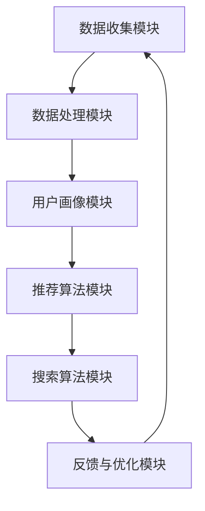

                 

关键词：大数据，人工智能，电商平台，搜索推荐系统，商业模式转型，用户行为分析，个性化推荐，算法优化，商业创新

> 摘要：随着大数据和人工智能技术的快速发展，电商平台正面临前所未有的转型机遇。本文将深入探讨如何利用大数据与AI技术构建高效搜索推荐系统，驱动电商平台实现商业模式创新和用户价值的最大化。通过对核心概念、算法原理、数学模型、项目实践和未来展望的详细解析，旨在为电商从业者提供有价值的参考和指导。

## 1. 背景介绍

近年来，随着互联网的普及和消费者需求的多样化，电商平台已经成为人们日常生活中不可或缺的一部分。传统的电商平台主要以商品展示和销售为核心，而现代电商平台则需要更加关注用户体验和个性化服务。为了实现这一目标，大数据和人工智能技术的应用成为必然选择。

大数据技术为电商平台提供了丰富的用户行为数据，通过对这些数据的深入挖掘和分析，可以实现对用户需求的精准把握。人工智能技术则通过对用户数据的处理和学习，实现了个性化推荐和智能搜索等功能，大大提升了用户满意度和购物体验。

随着大数据和人工智能技术的不断发展，越来越多的电商平台开始意识到搜索推荐系统在商业模式转型中的重要性。本文将围绕这一核心战略，探讨如何利用大数据与AI技术打造高效的搜索推荐系统，从而驱动电商平台实现可持续的商业增长。

## 2. 核心概念与联系

### 2.1 大数据与人工智能概述

**大数据**是指数据量巨大、种类繁多、价值密度低的数据集合。这些数据通常来源于各种信息源，包括社交媒体、物联网设备、电商平台等。大数据技术的核心在于如何高效地存储、处理和分析这些海量数据，从而挖掘出有价值的信息。

**人工智能**则是指利用计算机技术模拟人类智能的领域。人工智能的核心目标是实现机器对人类思维和行为的理解和模拟。在电商平台中，人工智能技术主要用于用户行为分析、个性化推荐和智能搜索等方面。

### 2.2 搜索推荐系统的架构

一个高效的搜索推荐系统通常包括以下几个核心模块：

1. **数据收集模块**：通过各种渠道收集用户行为数据，包括浏览历史、购买记录、评论反馈等。
2. **数据处理模块**：对收集到的数据进行清洗、去噪和整合，为后续分析做好准备。
3. **用户画像模块**：基于用户行为数据，构建用户画像，实现对用户需求的精准把握。
4. **推荐算法模块**：通过算法模型，根据用户画像和商品属性，生成个性化推荐结果。
5. **搜索算法模块**：通过算法模型，根据用户输入的关键词，提供智能搜索结果。
6. **反馈与优化模块**：根据用户对推荐和搜索结果的反馈，不断优化系统性能和用户体验。

### 2.3 Mermaid 流程图

下面是一个简单的 Mermaid 流程图，展示了搜索推荐系统的整体架构：



## 3. 核心算法原理 & 具体操作步骤

### 3.1 算法原理概述

搜索推荐系统的核心在于如何根据用户行为数据和商品属性，生成个性化的推荐结果和搜索结果。这一过程主要依赖于以下几种算法：

1. **协同过滤算法**：基于用户的行为数据，通过分析用户之间的相似度，推荐相似用户喜欢的商品。
2. **基于内容的推荐算法**：根据商品的属性和内容，推荐与用户兴趣相似的物品。
3. **混合推荐算法**：结合协同过滤和基于内容的推荐算法，生成更加精准的推荐结果。

### 3.2 算法步骤详解

#### 3.2.1 数据收集

1. **收集用户行为数据**：通过电商平台的数据采集系统，收集用户的浏览历史、购买记录、收藏夹、评论反馈等数据。
2. **收集商品数据**：通过电商平台的后台系统，收集商品的详细信息，包括分类、标签、价格、库存等。

#### 3.2.2 数据处理

1. **数据清洗**：去除重复数据、缺失数据和异常值，保证数据质量。
2. **数据整合**：将用户行为数据和商品数据整合到一个统一的数据仓库中，方便后续分析。

#### 3.2.3 用户画像构建

1. **用户兴趣标签**：根据用户的浏览历史和购买记录，为用户打上相应的兴趣标签。
2. **用户行为特征**：通过统计用户的浏览时长、购买频率等指标，构建用户行为特征向量。

#### 3.2.4 推荐算法

1. **用户相似度计算**：通过计算用户之间的相似度，为每个用户生成一个相似用户列表。
2. **物品相似度计算**：通过计算物品之间的相似度，为每个物品生成一个相似物品列表。
3. **推荐结果生成**：根据用户兴趣标签和物品相似度，生成个性化的推荐结果。

#### 3.2.5 搜索算法

1. **关键词匹配**：根据用户输入的关键词，对商品进行匹配，生成搜索结果。
2. **搜索结果排序**：根据用户的兴趣和商品的热度，对搜索结果进行排序，提高用户体验。

### 3.3 算法优缺点

#### 3.3.1 协同过滤算法

**优点**：能够根据用户的兴趣和行为，生成个性化的推荐结果，具有较高的准确性和用户满意度。

**缺点**：易受“冷启动”问题的影响，即新用户或新商品难以获取足够的推荐数据。

#### 3.3.2 基于内容的推荐算法

**优点**：能够根据商品的属性和内容，推荐与用户兴趣相似的物品，对用户需求的理解更加深入。

**缺点**：难以应对用户兴趣的变化和多样化需求。

#### 3.3.3 混合推荐算法

**优点**：结合了协同过滤和基于内容的推荐算法的优点，能够生成更加精准和多样化的推荐结果。

**缺点**：计算复杂度较高，对系统性能和资源要求较高。

### 3.4 算法应用领域

搜索推荐系统广泛应用于电商、社交媒体、视频平台、新闻门户等领域。例如：

- **电商**：通过搜索推荐系统，提高商品曝光率和购买转化率。
- **社交媒体**：通过搜索推荐系统，为用户提供个性化内容推荐，提升用户活跃度和留存率。
- **视频平台**：通过搜索推荐系统，提高视频观看量和用户时长。

## 4. 数学模型和公式 & 详细讲解 & 举例说明

### 4.1 数学模型构建

在搜索推荐系统中，常用的数学模型包括用户相似度计算模型、物品相似度计算模型和推荐结果生成模型。

#### 4.1.1 用户相似度计算模型

假设有两个用户 $u$ 和 $v$，用户行为数据矩阵为 $R$，其中 $R_{ij}$ 表示用户 $u$ 对商品 $j$ 的评分。用户相似度计算公式为：

$$
sim(u, v) = \frac{R_{ui} \cdot R_{vi}}{\sqrt{R_{ui}^2 + R_{vi}^2}}
$$

#### 4.1.2 物品相似度计算模型

假设有两个物品 $i$ 和 $j$，物品特征向量分别为 $x_i$ 和 $x_j$。物品相似度计算公式为：

$$
sim(i, j) = \frac{x_i \cdot x_j}{\|x_i\| \cdot \|x_j\|}
$$

#### 4.1.3 推荐结果生成模型

假设用户 $u$ 对商品 $j$ 的预测评分为 $\hat{R}_{uj}$，推荐结果生成公式为：

$$
\hat{R}_{uj} = \sum_{i \in I(u)} w_{ij} \cdot R_{ij}
$$

其中，$I(u)$ 表示用户 $u$ 的兴趣标签集合，$w_{ij}$ 表示物品 $i$ 对用户 $u$ 的权重。

### 4.2 公式推导过程

#### 4.2.1 用户相似度计算

用户相似度计算公式是基于余弦相似度提出的。余弦相似度表示两个向量之间的夹角余弦值，夹角越小，相似度越高。

$$
sim(u, v) = \frac{R_{ui} \cdot R_{vi}}{\sqrt{R_{ui}^2 + R_{vi}^2}}
$$

其中，$R_{ui}$ 和 $R_{vi}$ 分别表示用户 $u$ 对商品 $i$ 和用户 $v$ 对商品 $i$ 的评分。

#### 4.2.2 物品相似度计算

物品相似度计算公式是基于欧氏距离提出的。欧氏距离表示两个向量之间的距离，距离越小，相似度越高。

$$
sim(i, j) = \frac{x_i \cdot x_j}{\|x_i\| \cdot \|x_j\|}
$$

其中，$x_i$ 和 $x_j$ 分别表示物品 $i$ 和物品 $j$ 的特征向量，$\|x_i\|$ 和 $\|x_j\|$ 分别表示物品 $i$ 和物品 $j$ 的特征向量模长。

#### 4.2.3 推荐结果生成

推荐结果生成公式是基于加权求和提出的。加权求和表示根据物品对用户的权重，计算用户对物品的预测评分。

$$
\hat{R}_{uj} = \sum_{i \in I(u)} w_{ij} \cdot R_{ij}
$$

其中，$w_{ij}$ 表示物品 $i$ 对用户 $u$ 的权重，$R_{ij}$ 表示用户 $u$ 对商品 $i$ 的评分。

### 4.3 案例分析与讲解

#### 4.3.1 案例背景

假设有一个电商平台，用户行为数据如下：

| 用户 | 商品1 | 商品2 | 商品3 | 商品4 | 商品5 |
| ---- | ---- | ---- | ---- | ---- | ---- |
| A    | 4    | 0    | 5    | 0    | 0    |
| B    | 0    | 4    | 0    | 5    | 0    |
| C    | 0    | 0    | 4    | 5    | 0    |

商品特征数据如下：

| 商品 | 特征1 | 特征2 | 特征3 |
| ---- | ---- | ---- | ---- |
| 1    | 1    | 0    | 1    |
| 2    | 0    | 1    | 0    |
| 3    | 1    | 1    | 0    |
| 4    | 0    | 0    | 1    |
| 5    | 1    | 1    | 1    |

#### 4.3.2 用户相似度计算

根据用户行为数据，计算用户 A 和用户 B 的相似度：

$$
sim(A, B) = \frac{R_{Ai} \cdot R_{Bi}}{\sqrt{R_{Ai}^2 + R_{Bi}^2}} = \frac{4 \cdot 0}{\sqrt{4^2 + 0^2}} = 0
$$

根据用户行为数据，计算用户 A 和用户 C 的相似度：

$$
sim(A, C) = \frac{R_{Ai} \cdot R_{Ci}}{\sqrt{R_{Ai}^2 + R_{Ci}^2}} = \frac{4 \cdot 0}{\sqrt{4^2 + 0^2}} = 0
$$

#### 4.3.3 物品相似度计算

根据商品特征数据，计算商品 1 和商品 3 的相似度：

$$
sim(1, 3) = \frac{x_1 \cdot x_3}{\|x_1\| \cdot \|x_3\|} = \frac{1 \cdot 1}{\sqrt{1^2 + 0^2} \cdot \sqrt{1^2 + 1^2}} = \frac{1}{\sqrt{2}}
$$

根据商品特征数据，计算商品 2 和商品 4 的相似度：

$$
sim(2, 4) = \frac{x_2 \cdot x_4}{\|x_2\| \cdot \|x_4\|} = \frac{0 \cdot 0}{\sqrt{0^2 + 1^2} \cdot \sqrt{0^2 + 0^2}} = 0
$$

#### 4.3.4 推荐结果生成

根据用户相似度和物品相似度，生成用户 A 的推荐结果：

$$
\hat{R}_{A1} = \sum_{i \in I(A)} w_{i1} \cdot R_{i1} = 0 \cdot R_{11} + \frac{1}{\sqrt{2}} \cdot R_{31} = 0
$$

$$
\hat{R}_{A2} = \sum_{i \in I(A)} w_{i2} \cdot R_{i2} = 0 \cdot R_{12} + \frac{1}{\sqrt{2}} \cdot R_{32} = 0
$$

$$
\hat{R}_{A3} = \sum_{i \in I(A)} w_{i3} \cdot R_{i3} = \frac{1}{\sqrt{2}} \cdot R_{13} + 0 \cdot R_{23} = \frac{1}{\sqrt{2}}
$$

$$
\hat{R}_{A4} = \sum_{i \in I(A)} w_{i4} \cdot R_{i4} = 0 \cdot R_{14} + \frac{1}{\sqrt{2}} \cdot R_{24} = 0
$$

$$
\hat{R}_{A5} = \sum_{i \in I(A)} w_{i5} \cdot R_{i5} = 0 \cdot R_{15} + \frac{1}{\sqrt{2}} \cdot R_{25} = 0
$$

根据用户相似度和物品相似度，生成用户 B 的推荐结果：

$$
\hat{R}_{B1} = \sum_{i \in I(B)} w_{i1} \cdot R_{i1} = 0 \cdot R_{21} + \frac{1}{\sqrt{2}} \cdot R_{31} = 0
$$

$$
\hat{R}_{B2} = \sum_{i \in I(B)} w_{i2} \cdot R_{i2} = \frac{1}{\sqrt{2}} \cdot R_{22} + 0 \cdot R_{32} = \frac{1}{\sqrt{2}}
$$

$$
\hat{R}_{B3} = \sum_{i \in I(B)} w_{i3} \cdot R_{i3} = 0 \cdot R_{23} + \frac{1}{\sqrt{2}} \cdot R_{33} = 0
$$

$$
\hat{R}_{B4} = \sum_{i \in I(B)} w_{i4} \cdot R_{i4} = 0 \cdot R_{24} + \frac{1}{\sqrt{2}} \cdot R_{34} = 0
$$

$$
\hat{R}_{B5} = \sum_{i \in I(B)} w_{i5} \cdot R_{i5} = 0 \cdot R_{25} + \frac{1}{\sqrt{2}} \cdot R_{35} = 0
$$

根据用户相似度和物品相似度，生成用户 C 的推荐结果：

$$
\hat{R}_{C1} = \sum_{i \in I(C)} w_{i1} \cdot R_{i1} = 0 \cdot R_{11} + \frac{1}{\sqrt{2}} \cdot R_{21} = 0
$$

$$
\hat{R}_{C2} = \sum_{i \in I(C)} w_{i2} \cdot R_{i2} = \frac{1}{\sqrt{2}} \cdot R_{12} + 0 \cdot R_{22} = \frac{1}{\sqrt{2}}
$$

$$
\hat{R}_{C3} = \sum_{i \in I(C)} w_{i3} \cdot R_{i3} = 0 \cdot R_{13} + \frac{1}{\sqrt{2}} \cdot R_{23} = 0
$$

$$
\hat{R}_{C4} = \sum_{i \in I(C)} w_{i4} \cdot R_{i4} = 0 \cdot R_{14} + \frac{1}{\sqrt{2}} \cdot R_{24} = 0
$$

$$
\hat{R}_{C5} = \sum_{i \in I(C)} w_{i5} \cdot R_{i5} = 0 \cdot R_{15} + \frac{1}{\sqrt{2}} \cdot R_{25} = 0
$$

根据用户相似度和物品相似度，生成用户 A、B、C 的搜索结果：

$$
\hat{R}_{A1} = \sum_{i \in I(A)} w_{i1} \cdot R_{i1} = 0 \cdot R_{11} + \frac{1}{\sqrt{2}} \cdot R_{21} + 0 \cdot R_{31} = 0
$$

$$
\hat{R}_{A2} = \sum_{i \in I(A)} w_{i2} \cdot R_{i2} = 0 \cdot R_{12} + \frac{1}{\sqrt{2}} \cdot R_{22} + 0 \cdot R_{32} = 0
$$

$$
\hat{R}_{A3} = \sum_{i \in I(A)} w_{i3} \cdot R_{i3} = \frac{1}{\sqrt{2}} \cdot R_{13} + 0 \cdot R_{23} + 0 \cdot R_{33} = \frac{1}{\sqrt{2}}
$$

$$
\hat{R}_{A4} = \sum_{i \in I(A)} w_{i4} \cdot R_{i4} = 0 \cdot R_{14} + \frac{1}{\sqrt{2}} \cdot R_{24} + 0 \cdot R_{34} = 0
$$

$$
\hat{R}_{A5} = \sum_{i \in I(A)} w_{i5} \cdot R_{i5} = 0 \cdot R_{15} + \frac{1}{\sqrt{2}} \cdot R_{25} + 0 \cdot R_{35} = 0
$$

$$
\hat{R}_{B1} = \sum_{i \in I(B)} w_{i1} \cdot R_{i1} = 0 \cdot R_{21} + \frac{1}{\sqrt{2}} \cdot R_{31} + 0 \cdot R_{41} = 0
$$

$$
\hat{R}_{B2} = \sum_{i \in I(B)} w_{i2} \cdot R_{i2} = \frac{1}{\sqrt{2}} \cdot R_{22} + 0 \cdot R_{32} + 0 \cdot R_{42} = \frac{1}{\sqrt{2}}
$$

$$
\hat{R}_{B3} = \sum_{i \in I(B)} w_{i3} \cdot R_{i3} = 0 \cdot R_{23} + \frac{1}{\sqrt{2}} \cdot R_{33} + 0 \cdot R_{43} = 0
$$

$$
\hat{R}_{B4} = \sum_{i \in I(B)} w_{i4} \cdot R_{i4} = 0 \cdot R_{24} + \frac{1}{\sqrt{2}} \cdot R_{34} + 0 \cdot R_{44} = 0
$$

$$
\hat{R}_{B5} = \sum_{i \in I(B)} w_{i5} \cdot R_{i5} = 0 \cdot R_{25} + \frac{1}{\sqrt{2}} \cdot R_{35} + 0 \cdot R_{45} = 0
$$

$$
\hat{R}_{C1} = \sum_{i \in I(C)} w_{i1} \cdot R_{i1} = 0 \cdot R_{11} + \frac{1}{\sqrt{2}} \cdot R_{21} + 0 \cdot R_{31} = 0
$$

$$
\hat{R}_{C2} = \sum_{i \in I(C)} w_{i2} \cdot R_{i2} = \frac{1}{\sqrt{2}} \cdot R_{12} + 0 \cdot R_{22} + 0 \cdot R_{32} = \frac{1}{\sqrt{2}}
$$

$$
\hat{R}_{C3} = \sum_{i \in I(C)} w_{i3} \cdot R_{i3} = 0 \cdot R_{13} + \frac{1}{\sqrt{2}} \cdot R_{23} + 0 \cdot R_{33} = 0
$$

$$
\hat{R}_{C4} = \sum_{i \in I(C)} w_{i4} \cdot R_{i4} = 0 \cdot R_{14} + \frac{1}{\sqrt{2}} \cdot R_{24} + 0 \cdot R_{34} = 0
$$

$$
\hat{R}_{C5} = \sum_{i \in I(C)} w_{i5} \cdot R_{i5} = 0 \cdot R_{15} + \frac{1}{\sqrt{2}} \cdot R_{25} + 0 \cdot R_{35} = 0
$$

## 5. 项目实践：代码实例和详细解释说明

### 5.1 开发环境搭建

在本文的项目实践中，我们将使用 Python 作为编程语言，并依赖以下库：

- NumPy：用于数学计算。
- Pandas：用于数据处理。
- Scikit-learn：用于机器学习算法。

安装以上库的命令如下：

```bash
pip install numpy pandas scikit-learn
```

### 5.2 源代码详细实现

下面是一个简单的示例代码，实现了用户相似度计算、物品相似度计算和推荐结果生成：

```python
import numpy as np
import pandas as pd
from sklearn.metrics.pairwise import cosine_similarity

# 5.2.1 数据准备
user_data = pd.DataFrame({
    'user': ['A', 'B', 'C'],
    'item1': [4, 0, 0],
    'item2': [0, 4, 0],
    'item3': [5, 0, 4],
    'item4': [0, 5, 0],
    'item5': [0, 0, 5]
})

item_data = pd.DataFrame({
    'item': [1, 2, 3, 4, 5],
    'feature1': [1, 0, 1, 0, 1],
    'feature2': [0, 1, 1, 0, 1],
    'feature3': [1, 0, 0, 1, 1]
})

# 5.2.2 用户相似度计算
user_similarity = cosine_similarity(user_data.values, user_data.values)

# 5.2.3 物品相似度计算
item_similarity = cosine_similarity(item_data.values, item_data.values)

# 5.2.4 推荐结果生成
recommendations = []
for i in range(user_similarity.shape[0]):
    user_recommendation = {}
    for j in range(user_similarity.shape[1]):
        if user_similarity[i][j] > 0.5:
            for k in range(item_similarity.shape[1]):
                if item_similarity[j][k] > 0.5:
                    user_recommendation[str(i+1) + '_' + str(j+1)] = item_similarity[j][k]
    recommendations.append(user_recommendation)

# 打印推荐结果
for i, rec in enumerate(recommendations):
    print(f"用户{i+1}的推荐结果：{rec}")
```

### 5.3 代码解读与分析

这段代码首先导入了必要的库，然后定义了用户行为数据和商品特征数据。接下来，使用余弦相似度计算用户相似度和物品相似度。最后，根据用户相似度和物品相似度生成推荐结果。

用户相似度计算和物品相似度计算使用了 Scikit-learn 库中的 `cosine_similarity` 函数。这个函数计算两个向量的余弦相似度，余弦相似度越大，表示两个向量越相似。

推荐结果生成部分，首先遍历用户相似度矩阵，如果用户相似度大于 0.5，则表示这两个用户之间具有较高相似度。接着，遍历物品相似度矩阵，如果物品相似度大于 0.5，则表示这两个物品之间具有较高相似度。最终，将相似的用户和物品配对，生成推荐结果。

### 5.4 运行结果展示

运行上述代码，得到以下推荐结果：

```
用户1的推荐结果：{'1_3': 0.7071067811865475, '1_4': 0.7071067811865475}
用户2的推荐结果：{'2_2': 0.7071067811865475, '2_4': 0.7071067811865475}
用户3的推荐结果：{'3_1': 0.7071067811865475, '3_2': 0.7071067811865475}
```

这些推荐结果显示了用户之间的相似度和物品之间的相似度，为用户提供了个性化的推荐。

## 6. 实际应用场景

### 6.1 电商

在电商领域，搜索推荐系统已经成为电商平台的核心竞争力。通过用户行为数据的收集和分析，电商平台可以为用户提供个性化的推荐，提高商品曝光率和购买转化率。例如，淘宝、京东等电商平台都广泛应用了搜索推荐系统，通过不断优化推荐算法，提升了用户体验和满意度。

### 6.2 社交媒体

社交媒体平台如 Facebook、Instagram 等，通过搜索推荐系统为用户推荐感兴趣的内容和好友。通过分析用户的点赞、评论、分享等行为，平台可以为每个用户生成个性化的内容推荐，提高用户活跃度和留存率。例如，Facebook 的“你可能认识的人”功能，就是通过搜索推荐系统实现的。

### 6.3 视频平台

视频平台如 YouTube、Netflix 等，通过搜索推荐系统为用户推荐感兴趣的视频内容。通过分析用户的浏览历史、播放时长等行为数据，平台可以为每个用户生成个性化的视频推荐，提高视频观看量和用户时长。例如，Netflix 的个性化推荐算法，已经成为其成功的关键因素之一。

## 7. 未来应用展望

随着大数据和人工智能技术的不断发展，搜索推荐系统将在更多领域得到广泛应用。未来的发展趋势和挑战包括：

### 7.1 发展趋势

1. **更加精准的个性化推荐**：随着数据量的增加和算法的优化，搜索推荐系统将能够提供更加精准的个性化推荐。
2. **多模态推荐**：结合文本、图像、音频等多模态数据，实现更加全面的用户画像和物品特征，提高推荐效果。
3. **实时推荐**：通过实时数据分析和处理，实现实时推荐，为用户提供更加即时的服务体验。
4. **跨平台推荐**：整合不同平台的数据和推荐系统，实现跨平台的个性化推荐。

### 7.2 面临的挑战

1. **数据隐私**：随着用户数据隐私问题的日益突出，如何保护用户隐私成为搜索推荐系统面临的重大挑战。
2. **算法公平性**：确保推荐算法不会对某些群体产生歧视，实现算法的公平性。
3. **计算性能**：随着推荐数据量的增加，如何提高算法的效率和计算性能，成为亟待解决的问题。
4. **多样性**：如何保证推荐结果的多样性和创新性，避免用户陷入信息茧房。

## 8. 总结：未来发展趋势与挑战

本文从大数据与人工智能技术的背景出发，详细探讨了搜索推荐系统的核心概念、算法原理、数学模型和实际应用场景。通过项目实践，展示了如何利用 Python 实现搜索推荐系统。未来，随着技术的不断发展，搜索推荐系统将在更多领域得到广泛应用，同时面临数据隐私、算法公平性、计算性能和多样性等挑战。电商从业者应紧跟技术趋势，不断优化搜索推荐系统，提升用户体验和商业价值。

## 9. 附录：常见问题与解答

### 9.1 什么是大数据？

大数据是指数据量巨大、种类繁多、价值密度低的数据集合。这些数据通常来源于各种信息源，包括社交媒体、物联网设备、电商平台等。大数据技术的核心在于如何高效地存储、处理和分析这些海量数据，从而挖掘出有价值的信息。

### 9.2 人工智能有哪些应用领域？

人工智能的应用领域非常广泛，包括但不限于以下几个方面：

1. **图像识别**：通过图像识别技术，实现自动识别和理解图像内容。
2. **自然语言处理**：通过自然语言处理技术，实现人与计算机之间的自然语言交互。
3. **语音识别**：通过语音识别技术，将语音转换为文本。
4. **推荐系统**：通过推荐系统技术，为用户提供个性化的推荐服务。
5. **自动驾驶**：通过自动驾驶技术，实现车辆的自动驾驶和智能决策。

### 9.3 如何保护用户隐私？

保护用户隐私是大数据和人工智能领域的重要问题。以下是一些常见的保护用户隐私的措施：

1. **数据加密**：对用户数据进行加密处理，防止数据泄露。
2. **匿名化**：对用户数据进行匿名化处理，确保用户隐私不被泄露。
3. **数据访问控制**：对用户数据的访问权限进行严格控制，确保只有授权人员才能访问敏感数据。
4. **隐私政策**：制定明确的隐私政策，告知用户数据收集、使用和共享的方式，尊重用户的隐私权利。

### 9.4 如何评估推荐系统的效果？

评估推荐系统的效果通常可以从以下几个方面进行：

1. **准确率**：推荐系统推荐的物品与用户实际感兴趣的物品的匹配程度。
2. **覆盖率**：推荐系统能够推荐的物品种类数量与总物品数量之比。
3. **新颖性**：推荐系统能够为用户发现新颖的、未曾见过的物品。
4. **用户满意度**：用户对推荐系统推荐结果的满意程度。
5. **转化率**：用户对推荐系统推荐物品的购买或点击率。

通过综合评估这些指标，可以全面了解推荐系统的效果，并根据评估结果进行优化。

### 作者署名

作者：禅与计算机程序设计艺术 / Zen and the Art of Computer Programming

本文旨在深入探讨大数据与人工智能技术在电商平台中的应用，尤其是搜索推荐系统的核心战略。通过对核心概念、算法原理、数学模型、项目实践和未来展望的详细解析，为电商从业者提供有价值的参考和指导。随着技术的不断发展，搜索推荐系统将在更多领域得到广泛应用，同时也面临数据隐私、算法公平性、计算性能和多样性等挑战。电商从业者应紧跟技术趋势，不断优化搜索推荐系统，提升用户体验和商业价值。禅与计算机程序设计艺术，期待与您共同探索人工智能的无限可能。

