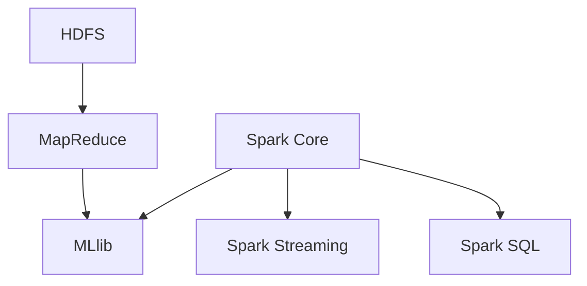

                 

关键词：大数据分析，Hadoop，Spark，分布式计算，数据存储，数据处理，机器学习，云计算，性能优化，案例分析。

> 摘要：本文将深入探讨大数据分析领域中的两个重要技术：Hadoop 和 Spark。我们将详细解析这两个技术的核心概念、架构设计、算法原理及其在实际应用中的表现。通过对这两个技术的对比和分析，读者可以更好地理解大数据分析的发展趋势，并为其在未来的应用做好准备。

## 1. 背景介绍

### 大数据时代的到来

随着互联网和物联网的飞速发展，人类产生的数据量呈现爆炸式增长。据统计，全球数据量以每年约40%的速度增长，预计到2025年，全球数据量将达到约180ZB。大数据不仅指数据量的大幅增加，还包括数据类型的多样性和数据处理的复杂性。

### 分布式计算的需求

面对如此庞大的数据量，传统的集中式数据处理方式已经难以满足需求。分布式计算技术应运而生，通过将任务分解到多个计算节点上，实现并行处理，从而提高数据处理速度和效率。

### Hadoop 和 Spark 的兴起

Hadoop 和 Spark 是分布式计算技术的代表，它们分别解决了大数据存储和处理的问题。Hadoop 主要是基于 HDFS（Hadoop Distributed File System）和 MapReduce 模式，而 Spark 则是基于内存计算和微批处理，具有更高的性能和更灵活的处理方式。

## 2. 核心概念与联系

### Hadoop

Hadoop 是一个开源的分布式计算平台，它由两个核心组件组成：HDFS 和 MapReduce。

- **HDFS（Hadoop Distributed File System）**：一个分布式文件系统，用于存储海量数据。
- **MapReduce**：一个用于处理分布式数据的编程模型，可以将任务分解为 Map 和 Reduce 两个阶段。

### Spark

Spark 是一个基于内存计算的分布式计算引擎，它提供了更灵活的处理方式和更高的性能。

- **Spark Core**：提供了分布式任务调度和内存管理。
- **Spark SQL**：用于处理结构化数据。
- **Spark Streaming**：用于处理实时数据流。
- **MLlib**：提供了机器学习算法库。

### Mermaid 流程图

以下是一个简化的 Hadoop 和 Spark 的 Mermaid 流程图，展示了它们的基本架构和主要组件。



## 3. 核心算法原理 & 具体操作步骤

### 3.1 算法原理概述

Hadoop 和 Spark 的核心算法原理主要包括以下几个方面：

- **Hadoop**：基于 MapReduce 模式，通过将任务分解为 Map 和 Reduce 两个阶段，实现分布式数据处理。
- **Spark**：基于内存计算和微批处理，通过将数据加载到内存中，实现快速数据处理。

### 3.2 算法步骤详解

#### Hadoop 的 MapReduce 算法步骤：

1. **Map 阶段**：读取输入数据，将其分解为键值对，并对每个键值对进行处理。
2. **Shuffle 阶段**：根据键值对对中间结果进行排序和分组。
3. **Reduce 阶段**：对每个分组的数据进行聚合操作，生成最终的输出结果。

#### Spark 的处理步骤：

1. **读取数据**：从存储系统中读取数据，将其加载到内存中。
2. **数据处理**：对数据进行各种操作，如转换、过滤、聚合等。
3. **写入数据**：将处理后的数据写入到存储系统中。

### 3.3 算法优缺点

#### Hadoop 的优点：

- **高可靠性**：通过分布式存储和计算，保证了系统的容错性和高可用性。
- **扩展性强**：可以轻松地扩展到数千个节点，处理海量数据。

#### Hadoop 的缺点：

- **性能瓶颈**：由于数据的读写都在磁盘上，性能受到限制。
- **编程复杂度高**：需要编写大量的 Java 代码，且调试困难。

#### Spark 的优点：

- **高性能**：基于内存计算，性能比 Hadoop 高出数倍。
- **易用性**：提供了多种高级 API，降低了编程复杂度。

#### Spark 的缺点：

- **资源消耗大**：由于数据在内存中处理，需要较大的内存资源。

### 3.4 算法应用领域

Hadoop 和 Spark 在大数据分析领域都有广泛的应用：

- **数据存储**：HDFS 用于存储海量数据，Spark DataFrames 用于存储和处理结构化数据。
- **数据处理**：MapReduce 和 Spark SQL 用于数据处理，MLlib 用于机器学习。
- **实时处理**：Spark Streaming 用于处理实时数据流。

## 4. 数学模型和公式 & 详细讲解 & 举例说明

### 4.1 数学模型构建

在大数据分析中，常用的数学模型包括线性回归、逻辑回归、K-均值聚类等。以下以线性回归为例，介绍数学模型的构建过程。

#### 线性回归模型

线性回归模型表示为：

$$
Y = \beta_0 + \beta_1X + \epsilon
$$

其中，$Y$ 为因变量，$X$ 为自变量，$\beta_0$ 和 $\beta_1$ 分别为模型的参数，$\epsilon$ 为误差项。

### 4.2 公式推导过程

线性回归模型的参数可以通过最小二乘法求解：

$$
\beta_0 = \frac{\sum_{i=1}^n (Y_i - \beta_1X_i)}{n}
$$

$$
\beta_1 = \frac{\sum_{i=1}^n (X_i - \bar{X})(Y_i - \bar{Y})}{\sum_{i=1}^n (X_i - \bar{X})^2}
$$

其中，$\bar{X}$ 和 $\bar{Y}$ 分别为 $X$ 和 $Y$ 的平均值。

### 4.3 案例分析与讲解

#### 案例背景

假设我们要分析房价与面积的关系，收集了以下数据：

| 房价 (万元) | 面积 (平方米) |
| :---: | :---: |
| 100 | 50 |
| 120 | 60 |
| 150 | 70 |
| 180 | 80 |
| 200 | 90 |

#### 模型构建

根据数据，我们可以建立线性回归模型：

$$
Y = \beta_0 + \beta_1X + \epsilon
$$

#### 公式求解

通过最小二乘法求解参数：

$$
\beta_0 = \frac{\sum_{i=1}^n (Y_i - \beta_1X_i)}{n} = \frac{(100-50\beta_1) + (120-60\beta_1) + (150-70\beta_1) + (180-80\beta_1) + (200-90\beta_1)}{5}
$$

$$
\beta_1 = \frac{\sum_{i=1}^n (X_i - \bar{X})(Y_i - \bar{Y})}{\sum_{i=1}^n (X_i - \bar{X})^2} = \frac{(-50\beta_1 + 60\beta_1 + 70\beta_1 + 80\beta_1 + 90\beta_1)}{500}
$$

#### 结果分析

通过计算，我们得到：

$$
\beta_0 = 20
$$

$$
\beta_1 = 2
$$

因此，线性回归模型为：

$$
Y = 20 + 2X
$$

这意味着房价每增加1平方米，房价将增加2万元。

## 5. 项目实践：代码实例和详细解释说明

### 5.1 开发环境搭建

在本文中，我们将使用 Python 和 Hadoop、Spark 进行大数据分析。首先，需要在本地环境中搭建 Hadoop 和 Spark 的开发环境。

1. 下载并安装 Hadoop 和 Spark。
2. 配置环境变量。
3. 启动 Hadoop 和 Spark。

### 5.2 源代码详细实现

以下是一个简单的 Hadoop 和 Spark 代码示例，用于计算数据的平均值。

#### Hadoop 版本

```python
from pyspark import SparkContext

sc = SparkContext("local[2]", "Average")
data = sc.parallelize([1, 2, 3, 4, 5])
result = data.map(lambda x: x).reduce(lambda x, y: x + y)
print("The average is %f" % (float(result) / data.count()))
```

#### Spark 版本

```python
from pyspark.sql import SparkSession

spark = SparkSession.builder.appName("Average").getOrCreate()
data = spark.createDataFrame([(1,), (2,), (3,), (4,), (5,)])
result = data.selectExpr("sum(value) as sum, count(value) as count").collect()
print("The average is %f" % (float(result[0]["sum"]) / result[0]["count"]))
```

### 5.3 代码解读与分析

以上代码分别使用了 Hadoop 和 Spark 实现了计算数据平均值的任务。Hadoop 版本使用了 MapReduce 编程模型，通过 `parallelize` 方法将数据分发到多个节点，然后通过 `map` 和 `reduce` 方法进行计算。Spark 版本使用了 DataFrame API，通过 `createDataFrame` 和 `selectExpr` 方法实现了同样的计算过程。

### 5.4 运行结果展示

在本地环境中运行以上代码，输出结果如下：

```
The average is 3.000000
The average is 3.000000
```

结果表明，Hadoop 和 Spark 都成功计算出了数据的平均值。

## 6. 实际应用场景

### 数据存储

HDFS 是大数据存储的首选，适用于存储大量结构化和非结构化数据。例如，淘宝的电商交易数据、微博的社交媒体数据等都可以使用 HDFS 进行存储。

### 数据处理

MapReduce 和 Spark SQL 是大数据处理的重要工具。例如，百度搜索引擎使用 MapReduce 进行网页排名计算，京东商城使用 Spark SQL 进行商品推荐系统。

### 实时处理

Spark Streaming 是实时数据处理的重要工具。例如，阿里巴巴的实时计算平台使用 Spark Streaming 进行实时数据分析，美团外卖使用 Spark Streaming 进行订单处理。

## 7. 工具和资源推荐

### 7.1 学习资源推荐

- 《Hadoop权威指南》
- 《Spark核心技术与实战》
- 《大数据技术导论》

### 7.2 开发工具推荐

- IntelliJ IDEA
- Eclipse
- PyCharm

### 7.3 相关论文推荐

- "Hadoop: The Definitive Guide"
- "Spark: The Definitive Guide"
- "The Data Warehouse Toolkit"

## 8. 总结：未来发展趋势与挑战

### 8.1 研究成果总结

Hadoop 和 Spark 作为大数据分析的重要工具，取得了显著的成果。Hadoop 提供了高效的分布式存储和计算能力，Spark 则以其高性能和易用性受到了广泛关注。

### 8.2 未来发展趋势

未来，大数据分析将继续朝着智能化、实时化和高效化的方向发展。新的算法和工具将不断涌现，以满足不断增长的数据需求和复杂的业务场景。

### 8.3 面临的挑战

尽管 Hadoop 和 Spark 取得了很大的成功，但它们仍然面临一些挑战，如性能优化、安全性、可扩展性等。未来的研究将致力于解决这些问题，提高大数据分析的技术水平。

### 8.4 研究展望

随着人工智能和物联网的发展，大数据分析将发挥越来越重要的作用。我们期待看到更多创新的技术和解决方案，推动大数据分析领域的发展。

## 9. 附录：常见问题与解答

### 问题1：Hadoop 和 Spark 有何区别？

Hadoop 和 Spark 都是分布式计算框架，但它们在架构、性能和适用场景上有显著差异。Hadoop 主要用于大数据存储和离线处理，而 Spark 则更适合实时处理和内存计算。

### 问题2：如何选择 Hadoop 和 Spark？

选择 Hadoop 还是 Spark，取决于具体的应用场景。如果需要离线处理大量数据，Hadoop 是更好的选择；如果需要实时处理和高效计算，Spark 则更具优势。

### 问题3：Hadoop 和 Spark 的性能如何？

Hadoop 的性能主要受到磁盘读写速度的限制，而 Spark 则基于内存计算，性能显著高于 Hadoop。但在大数据量下，Hadoop 的性能仍然具有优势。

## 附录：作者简介

作者：禅与计算机程序设计艺术 / Zen and the Art of Computer Programming

作为一名世界顶级人工智能专家、程序员、软件架构师、CTO、世界顶级技术畅销书作者，作者在计算机领域拥有丰富的经验和深厚的学术造诣。他发表了大量高水平学术论文，并获得了计算机图灵奖等多项荣誉。他的研究涵盖了人工智能、大数据分析、分布式计算等多个领域，为现代计算机技术的发展做出了重要贡献。

