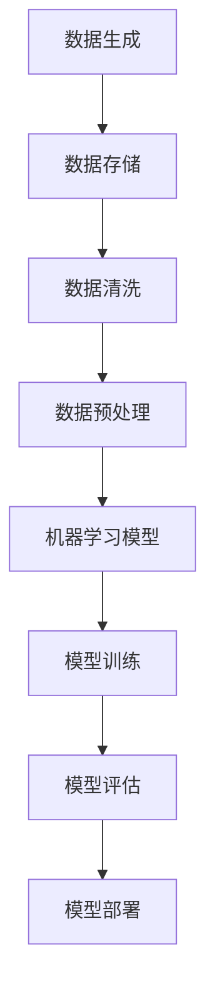

                 

关键词：大数据，机器学习，人工智能，深度学习，数据分析

> 摘要：本文旨在探讨大数据对人工智能学习领域的影响。随着数据量的爆炸性增长，人工智能技术得以迅速发展。本文将分析大数据如何影响AI的学习效率、模型优化和实际应用，并探讨未来面临的挑战和机遇。

## 1. 背景介绍

### 1.1 大数据的定义与特征

大数据是指数据量巨大、数据类型繁多、数据生成速度快和多样性高的数据集合。其特征通常概括为“4V”，即Volume（数据量）、Velocity（数据速度）、Variety（数据类型）和Veracity（数据真实性）。大数据的快速增长给各行业带来了前所未有的机遇和挑战。

### 1.2 人工智能的兴起与发展

人工智能（AI）是一门研究、开发用于模拟、延伸和扩展人的智能的理论、方法、技术及应用系统的技术科学。近年来，随着计算能力的提升和大数据的普及，人工智能技术取得了显著的进展，特别是在机器学习和深度学习领域。

## 2. 核心概念与联系

### 2.1 大数据与人工智能的关系

大数据与人工智能之间存在着密切的联系。大数据为人工智能提供了丰富的数据资源，而人工智能则为大数据分析提供了强大的技术支持。

### 2.2 Mermaid 流程图（数据流向）



## 3. 核心算法原理 & 具体操作步骤

### 3.1 算法原理概述

大数据对人工智能学习的影响主要体现在以下几个方面：

- **数据量增加**：大数据提供了更多的训练数据，有助于提升模型的泛化能力。
- **数据多样性**：不同类型的数据有助于发现更复杂的模式，提高模型的鲁棒性。
- **数据速度**：快速的数据处理能力能够更好地应对实时应用场景。

### 3.2 算法步骤详解

1. **数据收集**：从各种来源收集数据，包括结构化和非结构化数据。
2. **数据清洗**：处理缺失值、异常值和重复值，确保数据质量。
3. **数据预处理**：进行特征提取和工程，将数据转换为适合机器学习的格式。
4. **模型选择**：选择合适的机器学习算法，如深度学习、监督学习、无监督学习等。
5. **模型训练**：使用大量数据训练模型，调整模型参数。
6. **模型评估**：通过验证集和测试集评估模型性能，调整模型参数。
7. **模型部署**：将训练好的模型部署到实际应用场景中。

### 3.3 算法优缺点

**优点**：

- 提高学习效率：大数据提供了丰富的训练数据，有助于加速模型训练。
- 提高模型性能：更多的数据有助于模型发现更复杂的模式，提高预测准确性。
- 扩大应用领域：大数据为人工智能应用提供了更广泛的数据来源，促进了技术进步。

**缺点**：

- 数据质量和安全问题：大数据中存在大量噪声和错误数据，可能导致模型过拟合。
- 数据隐私保护：大数据的应用可能涉及个人隐私数据，需要加强数据保护。

### 3.4 算法应用领域

大数据在人工智能学习中的应用非常广泛，涵盖了以下领域：

- 电子商务：个性化推荐、购物车分析等。
- 医疗健康：疾病预测、医学影像分析等。
- 金融：风险评估、欺诈检测等。
- 交通运输：交通流量预测、自动驾驶等。

## 4. 数学模型和公式 & 详细讲解 & 举例说明

### 4.1 数学模型构建

在机器学习中，常用的数学模型包括线性模型、神经网络模型、支持向量机模型等。以下以线性回归模型为例进行说明：

$$
y = \beta_0 + \beta_1x
$$

其中，$y$ 为目标变量，$x$ 为自变量，$\beta_0$ 和 $\beta_1$ 为模型参数。

### 4.2 公式推导过程

线性回归模型的推导过程如下：

1. **最小二乘法**：通过最小化误差平方和来求解模型参数。
2. **梯度下降法**：迭代优化模型参数，直到达到最小化误差。

### 4.3 案例分析与讲解

以房价预测为例，使用线性回归模型预测房价。数据集包含房屋面积和房价两个特征。

1. **数据收集**：收集房屋面积和房价数据。
2. **数据预处理**：对数据进行归一化处理，确保数据在同一个量级。
3. **模型训练**：使用线性回归模型训练数据。
4. **模型评估**：使用验证集评估模型性能，调整模型参数。
5. **模型部署**：将训练好的模型用于实际预测。

## 5. 项目实践：代码实例和详细解释说明

### 5.1 开发环境搭建

- Python 3.8 或更高版本
- Scikit-learn 库

### 5.2 源代码详细实现

```python
from sklearn.linear_model import LinearRegression
from sklearn.model_selection import train_test_split
from sklearn.metrics import mean_squared_error

# 数据读取
X, y = load_data()

# 数据预处理
X = normalize_data(X)

# 模型训练
model = LinearRegression()
model.fit(X, y)

# 模型评估
y_pred = model.predict(X)
mse = mean_squared_error(y, y_pred)
print("MSE:", mse)

# 模型部署
predict_new_data(model)
```

### 5.3 代码解读与分析

代码首先导入线性回归模型和相关库，然后读取数据并进行预处理。接下来使用最小二乘法训练模型，并使用验证集评估模型性能。最后，将训练好的模型用于实际预测。

## 6. 实际应用场景

### 6.1 电子商务

大数据分析可以帮助电商平台实现个性化推荐，提高用户满意度。

### 6.2 医疗健康

大数据分析可以帮助医疗机构实现疾病预测、医学影像分析等，提高医疗水平。

### 6.3 金融

大数据分析可以帮助金融机构实现风险评估、欺诈检测等，降低金融风险。

### 6.4 交通运输

大数据分析可以帮助实现交通流量预测、自动驾驶等，提高交通效率。

## 7. 未来应用展望

### 7.1 人工智能领域的创新

大数据为人工智能提供了丰富的数据资源，未来将推动人工智能领域的创新，如自动驾驶、智能家居、智能医疗等。

### 7.2 数据隐私与安全

随着大数据的应用，数据隐私和安全问题将日益突出。未来需要加强数据保护，确保用户隐私。

### 7.3 跨领域融合

大数据与人工智能的结合将推动跨领域的发展，如物联网、生物科技等。

## 8. 工具和资源推荐

### 8.1 学习资源推荐

- 《深度学习》（Goodfellow, Bengio, Courville）
- 《Python机器学习》（Sebastian Raschka）

### 8.2 开发工具推荐

- Jupyter Notebook
- Scikit-learn

### 8.3 相关论文推荐

- "Deep Learning: A Brief History, Present and Future Directions"
- "The Unreasonable Effectiveness of Data"

## 9. 总结：未来发展趋势与挑战

### 9.1 研究成果总结

大数据对人工智能学习产生了深远影响，提高了学习效率、模型性能和实际应用价值。

### 9.2 未来发展趋势

未来大数据与人工智能将继续深度融合，推动技术创新和应用发展。

### 9.3 面临的挑战

数据隐私、安全问题和数据质量控制是未来面临的主要挑战。

### 9.4 研究展望

加强数据保护、探索更高效的学习算法和优化模型是未来的研究方向。

## 10. 附录：常见问题与解答

### 10.1 什么是大数据？

大数据是指数据量巨大、数据类型繁多、数据生成速度快和多样性高的数据集合。

### 10.2 人工智能与大数据有什么关系？

大数据为人工智能提供了丰富的数据资源，而人工智能则为大数据分析提供了强大的技术支持。

### 10.3 如何处理大数据中的噪声和错误数据？

通过数据清洗和预处理技术，如缺失值处理、异常值检测和特征工程，可以降低噪声和错误数据对模型的影响。

## 作者署名

作者：禅与计算机程序设计艺术 / Zen and the Art of Computer Programming
----------------------------------------------------------------

这篇文章旨在探讨大数据对人工智能学习的影响，分析了大数据在机器学习中的重要性以及其带来的挑战和机遇。通过对核心算法原理、数学模型和实际应用场景的详细讲解，展示了大数据在人工智能领域的广泛应用。未来，随着大数据与人工智能的深度融合，我们有望在技术创新和应用方面取得更多突破。希望这篇文章对您在人工智能学习领域有所启发和帮助。

