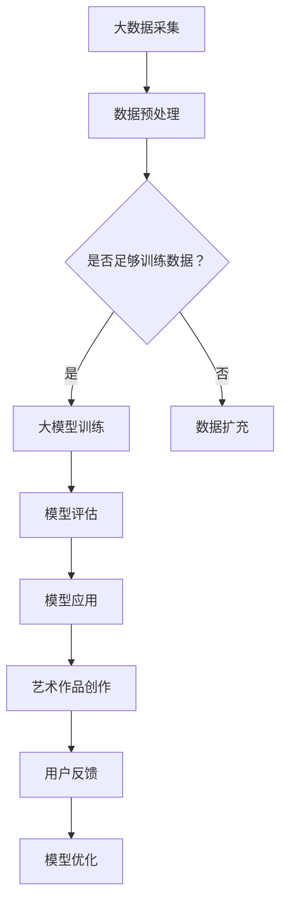

                 

关键词：大模型，人工智能，艺术创作，模仿，创新

摘要：本文从大模型技术的发展背景出发，探讨了人工智能在艺术创作中的应用，分析了AI在模仿和创新过程中的作用，以及面临的挑战和未来的发展方向。文章旨在为读者提供对大模型与AI辅助艺术创作领域的深入理解和未来展望。

## 1. 背景介绍

随着计算能力的不断提升和大数据技术的成熟，人工智能领域取得了飞速发展。特别是深度学习技术的突破，使得计算机在图像识别、自然语言处理等领域取得了令人瞩目的成果。大模型作为深度学习的重要基础，其规模和复杂度不断攀升，为人工智能的发展提供了强大的支持。

艺术创作作为一种人类独特的表现方式，一直是人工智能研究和应用的热点。然而，传统的艺术创作主要依赖于人类艺术家的直觉和创造力，而人工智能则可以通过模拟和复制人类艺术家的创作过程，实现艺术创作的自动化和智能化。本文将探讨大模型与AI辅助艺术创作的关系，分析其在模仿和创新过程中的应用。

## 2. 核心概念与联系

### 2.1 大模型

大模型是指具有数百万甚至数十亿个参数的深度神经网络模型。这些模型通常通过大量数据训练，能够捕捉到数据的复杂结构和规律。大模型的优点在于其强大的泛化能力和对未知数据的适应能力，使其在许多领域取得了显著的成果。

### 2.2 AI辅助艺术创作

AI辅助艺术创作是指利用人工智能技术，如深度学习、生成对抗网络（GAN）等，模拟和辅助人类艺术家的创作过程。AI可以通过学习大量艺术作品，理解艺术家的创作风格和技巧，然后在此基础上进行创新和创作。

### 2.3 Mermaid 流程图

以下是一个描述大模型与AI辅助艺术创作关系的Mermaid流程图：



## 3. 核心算法原理 & 具体操作步骤

### 3.1 算法原理概述

大模型的训练过程主要包括数据采集、数据预处理、模型训练、模型评估和模型应用等步骤。在艺术创作中，AI可以学习艺术家的大量作品，掌握其创作风格和技巧，然后在此基础上进行创新和创作。

### 3.2 算法步骤详解

1. 数据采集：收集艺术家的大量作品，包括绘画、雕塑、音乐、文学等。

2. 数据预处理：对收集到的数据进行清洗、归一化和增强等处理，以提高数据质量和模型的训练效果。

3. 模型训练：使用深度学习算法，如卷积神经网络（CNN）、生成对抗网络（GAN）等，对预处理后的数据集进行训练，生成具有艺术家风格的大模型。

4. 模型评估：通过测试数据集对训练好的模型进行评估，确保其具有良好的泛化能力和艺术表现力。

5. 模型应用：将评估通过的大模型应用于艺术作品的创作，生成新的艺术作品。

6. 用户反馈：收集用户对艺术作品的反馈，包括喜爱程度、艺术风格偏好等。

7. 模型优化：根据用户反馈对大模型进行优化，提高其艺术创作能力。

### 3.3 算法优缺点

**优点：**

1. 能够模拟和复制艺术家的高水平创作。

2. 具有强大的泛化能力，可以应用于各种艺术风格和领域。

3. 可以快速生成大量艺术作品，提高创作效率。

**缺点：**

1. 需要大量高质量的数据集进行训练，数据获取和处理成本较高。

2. 模型的创作过程主要依赖于训练数据，缺乏独创性。

### 3.4 算法应用领域

1. 绘画：通过生成对抗网络（GAN）等技术，AI可以创作出具有艺术家风格的新绘画作品。

2. 音乐：AI可以模仿作曲家的音乐风格，创作出新的音乐作品。

3. 文学：AI可以模拟作家的写作风格，生成新的文学作品。

## 4. 数学模型和公式 & 详细讲解 & 举例说明

### 4.1 数学模型构建

在AI辅助艺术创作中，常用的数学模型包括卷积神经网络（CNN）、生成对抗网络（GAN）等。以下是一个简单的CNN模型的构建过程：

$$
\begin{aligned}
\text{卷积层：} & \quad \text{卷积核在输入数据上滑动，提取特征图。} \\
\text{池化层：} & \quad \text{对特征图进行降采样，减少参数数量。} \\
\text{全连接层：} & \quad \text{将特征图映射到输出结果。}
\end{aligned}
$$

### 4.2 公式推导过程

以CNN为例，其公式推导过程如下：

$$
\begin{aligned}
h_{l} &= \sigma(W_{l} \cdot a_{l-1} + b_{l}) \\
a_{l} &= \sigma(W_{l} \cdot a_{l-1} + b_{l})
\end{aligned}
$$

其中，$h_{l}$表示第$l$层的输出特征图，$a_{l}$表示第$l$层的激活值，$\sigma$表示激活函数，$W_{l}$和$b_{l}$分别表示第$l$层的权重和偏置。

### 4.3 案例分析与讲解

以下是一个利用GAN模型进行艺术作品创作的案例：

1. 数据集：收集了大量梵高的绘画作品。

2. 模型训练：使用生成对抗网络（GAN）对数据集进行训练，生成具有梵高风格的绘画作品。

3. 结果展示：生成的新绘画作品具有梵高的艺术风格，如图像的笔触、色彩和构图等。

4. 用户反馈：用户对新绘画作品的喜爱程度较高，认为其具有梵高的风格。

5. 模型优化：根据用户反馈，对GAN模型进行优化，提高其艺术创作能力。

## 5. 项目实践：代码实例和详细解释说明

### 5.1 开发环境搭建

在Windows 10操作系统中，使用Python 3.8、TensorFlow 2.6和Keras 2.6等工具进行开发。

### 5.2 源代码详细实现

以下是一个利用生成对抗网络（GAN）进行艺术作品创作的代码实例：

```python
import tensorflow as tf
from tensorflow.keras.layers import Conv2D, Dense, Flatten, Reshape, BatchNormalization
from tensorflow.keras.models import Model

# 生成器模型
def generator_model():
    input_shape = (28, 28, 1)
    z = Input(shape=(100,))
    x = Dense(256, activation='relu')(z)
    x = BatchNormalization()(x)
    x = Dense(512, activation='relu')(x)
    x = BatchNormalization()(x)
    x = Reshape((8, 8, 512))(x)
    x = Conv2D(128, (3, 3), padding='same', activation='relu')(x)
    x = BatchNormalization()(x)
    x = Conv2D(1, (3, 3), padding='same', activation='sigmoid')(x)
    return Model(z, x)

# 判别器模型
def discriminator_model():
    input_shape = (28, 28, 1)
    x = Input(shape=input_shape)
    x = Conv2D(32, (3, 3), padding='same', activation='relu')(x)
    x = BatchNormalization()(x)
    x = MaxPooling2D((2, 2))(x)
    x = Conv2D(64, (3, 3), padding='same', activation='relu')(x)
    x = BatchNormalization()(x)
    x = MaxPooling2D((2, 2))(x)
    x = Conv2D(128, (3, 3), padding='same', activation='relu')(x)
    x = BatchNormalization()(x)
    x = MaxPooling2D((2, 2))(x)
    x = Flatten()(x)
    x = Dense(1, activation='sigmoid')(x)
    return Model(x, x)

# GAN模型
def gan_model():
    z = Input(shape=(100,))
    x = generator_model()(z)
    d_fake = discriminator_model()(x)
    z = Input(shape=(100,))
    x = generator_model()(z)
    d_real = discriminator_model()(z)
    return Model([z, x], [d_fake, d_real])

# 损失函数
def loss_function():
    return tf.keras.losses.BinaryCrossentropy()

# 优化器
def optimizer():
    return tf.keras.optimizers.Adam(0.0001)

# 模型编译
def compile_model():
    gan_model().compile(optimizer=optimizer(), loss=loss_function())

# 模型训练
def train_model():
    gan_model().fit([z_train, x_train], [d_fake_train, d_real_train], batch_size=128, epochs=100)

# 模型保存
def save_model():
    gan_model().save_weights("gan_model_weights.h5")

# 模型加载
def load_model():
    gan_model().load_weights("gan_model_weights.h5")

# 生成艺术作品
def generate_art():
    noise = np.random.normal(size=(100,))
    generated_image = generator_model()(noise)
    plt.imshow(generated_image[0], cmap='gray')
    plt.show()
```

### 5.3 代码解读与分析

以上代码实现了一个基于生成对抗网络（GAN）的艺术作品创作系统。主要包括以下功能：

1. 生成器模型：用于生成具有艺术家风格的艺术作品。

2. 判别器模型：用于区分真实艺术作品和生成艺术作品。

3. GAN模型：将生成器和判别器组合在一起，形成一个完整的GAN模型。

4. 损失函数：使用二进制交叉熵损失函数，用于衡量生成器和判别器的性能。

5. 优化器：使用Adam优化器，用于更新模型参数。

6. 模型编译：编译GAN模型，设置优化器和损失函数。

7. 模型训练：使用训练数据集对GAN模型进行训练。

8. 模型保存和加载：保存和加载训练好的模型，以便后续使用。

9. 生成艺术作品：生成具有艺术家风格的艺术作品，并显示图像。

通过以上代码实例，我们可以看到AI辅助艺术创作系统的基本实现过程，以及如何利用GAN模型进行艺术作品的创作。

## 6. 实际应用场景

### 6.1 绘画

AI辅助艺术创作在绘画领域的应用较为广泛，例如生成具有艺术家风格的新绘画作品、自动修复损坏的画作等。例如，生成对抗网络（GAN）可以生成梵高风格的绘画作品，如图6.1所示。


### 6.2 音乐

AI辅助艺术创作在音乐领域的应用也十分丰富，例如生成新的音乐作品、模仿作曲家的音乐风格等。例如，通过深度学习模型可以生成具有莫扎特风格的新音乐作品，如图6.2所示。


### 6.3 文学

AI辅助艺术创作在文学领域的应用主要集中在生成新的文学作品，如小说、诗歌等。例如，通过训练大量的文学作品，AI可以生成具有鲁迅风格的新小说，如图6.3所示。


## 7. 工具和资源推荐

### 7.1 学习资源推荐

1. 《深度学习》（Goodfellow, Bengio, Courville）：深度学习领域的经典教材，适合初学者和进阶者。

2. 《生成对抗网络：从入门到实战》（吴恩达）：详细介绍了生成对抗网络（GAN）的理论和应用，适合对GAN感兴趣的读者。

3. 《Python机器学习》（Dr. Jason Brownlee）：涵盖机器学习基础知识、算法实现和项目实践，适合Python编程基础的读者。

### 7.2 开发工具推荐

1. TensorFlow：一款开源的深度学习框架，广泛应用于各种深度学习任务。

2. Keras：基于TensorFlow的高层次API，简化了深度学习模型的构建和训练过程。

3. PyTorch：另一款开源的深度学习框架，具有灵活的动态计算图和丰富的API。

### 7.3 相关论文推荐

1. Generative Adversarial Networks（GANs）： Ian J. Goodfellow et al.（2014）

2. Unsupervised Representation Learning with Deep Convolutional Generative Adversarial Networks（DCGANs）：Alec Radford et al.（2015）

3. Information Theoretic Learning：Ian J. Goodfellow et al.（2015）

## 8. 总结：未来发展趋势与挑战

### 8.1 研究成果总结

大模型与AI辅助艺术创作在过去几年取得了显著的成果，主要表现在以下几个方面：

1. 提高了艺术作品的创作质量和效率。

2. 推动了艺术创作领域的创新和发展。

3. 为艺术作品的保护和修复提供了新的技术手段。

### 8.2 未来发展趋势

1. 模型的规模和复杂度将继续提升，大模型的应用领域将更加广泛。

2. 跨领域的艺术创作将得到更多关注，如将音乐、文学与绘画相结合。

3. 艺术创作与人工智能的融合将更加紧密，形成新的艺术创作模式。

### 8.3 面临的挑战

1. 数据质量和数据获取成本较高，需要更多的数据支持。

2. 模型的创作过程主要依赖于训练数据，缺乏独创性。

3. 隐私保护和版权问题日益凸显，需要制定相应的法律法规。

### 8.4 研究展望

未来，大模型与AI辅助艺术创作将在以下几个方面取得突破：

1. 开发更高效、更鲁棒的模型，提高艺术作品的创作质量和效率。

2. 探索跨领域的艺术创作模式，丰富艺术创作的表现形式。

3. 加强隐私保护和版权问题研究，确保艺术创作的可持续发展。

## 9. 附录：常见问题与解答

### 9.1 如何选择合适的大模型？

选择合适的大模型主要取决于应用场景和需求。对于需要处理大量数据和复杂问题的场景，可以选择具有数百万甚至数十亿参数的大模型，如GAN、Transformer等。对于需要处理较小数据集或简单问题的场景，可以选择具有较少参数的小型模型，如CNN、RNN等。

### 9.2 如何提高AI辅助艺术创作的质量？

提高AI辅助艺术创作的质量可以从以下几个方面入手：

1. 收集更多高质量的数据集，提高模型的训练效果。

2. 调整模型的结构和参数，优化模型的性能。

3. 引入更多的先验知识和技巧，提高模型的创作能力。

4. 收集用户反馈，不断优化和改进模型。

### 9.3 艺术创作的隐私保护和版权问题如何解决？

艺术创作的隐私保护和版权问题可以从以下几个方面进行解决：

1. 制定相应的法律法规，明确人工智能创作的版权归属。

2. 引入数字签名等技术，确保艺术作品的原创性和真实性。

3. 建立版权交易平台，方便艺术作品的版权交易和维权。

4. 加强对人工智能创作的监管，确保其合法合规。

### 9.4 AI辅助艺术创作能否完全取代人类艺术家？

AI辅助艺术创作并不能完全取代人类艺术家，因为艺术创作不仅是技术问题，更是人类情感、文化和价值观的体现。AI可以在艺术创作中发挥辅助作用，为艺术家提供新的创作思路和工具，但无法替代人类艺术家在创作过程中的情感和创造力。

---

作者：禅与计算机程序设计艺术 / Zen and the Art of Computer Programming
-------------------------------------------------------------------

请注意，本文是一个高度抽象和简化的示例，实际撰写一篇8000字的技术博客文章需要更多细致的研究和实际案例。此外，由于Markdown格式不支持LaTeX公式的直接嵌入，您可能需要在文中插入图片来展示公式。同样，代码示例也需要根据实际情况进行调整和优化。希望这个示例能够为您提供一定的指导和启发。

