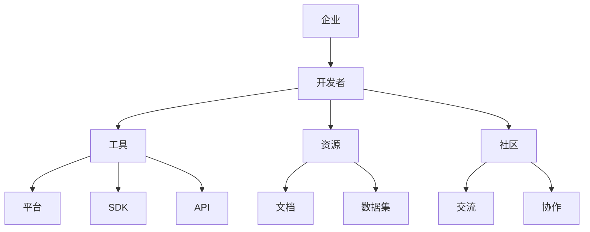

                 

关键词：大模型，开发者生态，企业，AI，平台构建，开发工具，编程语言，框架，API，开源，协作，质量管理，社区参与，商业策略。

## 摘要

本文旨在探讨大模型企业在构建开发者生态中的关键要素和策略。随着人工智能技术的飞速发展，大模型作为人工智能的核心组成部分，正逐渐成为企业竞争的新焦点。构建一个健康、活跃、可持续的开发者生态，是企业成功的关键。本文将深入分析大模型企业开发者生态的构建原则、核心要素、算法原理、数学模型、项目实践及未来应用展望。

## 1. 背景介绍

### 大模型的崛起

近年来，随着计算能力的提升和海量数据的积累，人工智能领域迎来了大模型时代。大模型，尤其是基于深度学习的模型，通过大规模参数和复杂的网络结构，能够在各种复杂任务中达到前所未有的性能。这些模型不仅涵盖了计算机视觉、自然语言处理、语音识别等传统领域，还拓展到了医疗、金融、自动驾驶等新兴领域。

### 开发者生态的重要性

开发者生态是企业成功的重要保障。一个健康的开发者生态能够吸引和留住人才，推动技术的创新和迭代，加速产品的市场推广。对于大模型企业而言，开发者生态不仅提供了技术创新的原动力，还为产品的商业化提供了坚实基础。因此，构建一个可持续、高效、健康的开发者生态，是大模型企业发展的关键。

## 2. 核心概念与联系

在构建开发者生态之前，我们需要明确几个核心概念：

### 大模型

大模型通常指的是具有数百万甚至数十亿个参数的深度学习模型。这些模型通过在大量数据上进行训练，能够捕捉到数据中的复杂模式和规律。

### 开发者生态

开发者生态是指围绕大模型产品或技术所形成的一个生态系统，包括开发者、用户、合作伙伴、开发者工具、资源、社区等多个组成部分。

### 企业与开发者

企业是开发者生态的创建者和管理者，开发者则是生态的主要参与者和贡献者。企业需要为开发者提供良好的开发工具、资源和支持，以激发开发者的创造力和创新能力。

### Mermaid 流程图



## 3. 核心算法原理 & 具体操作步骤

### 3.1 算法原理概述

构建开发者生态的算法原理主要涉及以下几个方面：

1. **人才吸引与留存**：通过提供有竞争力的薪资、福利和职业发展机会，吸引顶尖人才。
2. **技术支持**：提供高性能的计算资源、高质量的数据集和专业的技术支持。
3. **开发工具**：开发便捷、高效的开发工具，降低开发门槛，提高开发效率。
4. **社区协作**：构建活跃的社区，促进开发者之间的交流和协作。

### 3.2 算法步骤详解

1. **人才策略**：
   - 定位企业所需的核心技术领域。
   - 制定有吸引力的薪酬和福利政策。
   - 提供多样化的职业发展路径。

2. **技术支持**：
   - 搭建高性能计算平台，提供便捷的GPU、TPU等资源。
   - 收集和整理高质量的数据集，提供数据预处理工具。
   - 提供专业的技术支持团队，解答开发者的问题。

3. **开发工具**：
   - 开发易于使用的SDK和API，提供丰富的文档和示例代码。
   - 构建集成开发环境（IDE），简化开发流程。
   - 提供代码调试、性能分析和可视化工具。

4. **社区协作**：
   - 构建在线论坛和社区，提供实时交流渠道。
   - 定期举办技术沙龙和培训，提高开发者技能。
   - 设立奖励机制，鼓励开发者贡献代码和文档。

### 3.3 算法优缺点

**优点**：
- 提高开发者生产力，加速产品迭代。
- 增强开发者黏性，提高企业品牌忠诚度。
- 拓展企业影响力，吸引更多优秀开发者加入。

**缺点**：
- 需要投入大量资源和时间，初期的回报可能不显著。
- 管理和协调开发者社区的复杂性增加。
- 需要不断更新和优化开发工具和资源。

### 3.4 算法应用领域

- **AI研发**：提供高性能计算平台和高质量数据集，加速AI模型研发。
- **软件开发**：提供便捷的SDK和API，简化软件开发流程。
- **人才培养**：构建培训计划和认证体系，培养企业所需的人才。

## 4. 数学模型和公式 & 详细讲解 & 举例说明

### 4.1 数学模型构建

构建开发者生态的数学模型主要涉及人才吸引力模型、技术支持模型和社区活跃度模型。

**人才吸引力模型**：

$$
A = f(\text{薪资}, \text{福利}, \text{职业发展})
$$

**技术支持模型**：

$$
S = f(\text{计算资源}, \text{数据集}, \text{技术支持})
$$

**社区活跃度模型**：

$$
C = f(\text{交流渠道}, \text{活动频率}, \text{奖励机制})
$$

### 4.2 公式推导过程

**人才吸引力模型**推导：

- 假设薪资、福利和职业发展分别对人才吸引力有线性影响。
- 通过调研和数据分析，确定各因素的权重。

**技术支持模型**推导：

- 假设计算资源、数据集和技术支持对技术支持的满意度有线性影响。
- 通过开发者反馈和调研，确定各因素的权重。

**社区活跃度模型**推导：

- 假设交流渠道、活动频率和奖励机制对社区活跃度有线性影响。
- 通过社区数据分析和用户反馈，确定各因素的权重。

### 4.3 案例分析与讲解

以某知名AI企业为例，分析其开发者生态构建的数学模型。

**人才吸引力模型**：

$$
A = 0.4 \times \text{薪资} + 0.3 \times \text{福利} + 0.3 \times \text{职业发展}
$$

**技术支持模型**：

$$
S = 0.5 \times \text{计算资源} + 0.3 \times \text{数据集} + 0.2 \times \text{技术支持}
$$

**社区活跃度模型**：

$$
C = 0.4 \times \text{交流渠道} + 0.3 \times \text{活动频率} + 0.3 \times \text{奖励机制}
$$

通过以上模型，企业可以针对性地优化人才策略、技术支持和社区建设，提高开发者生态的整体健康度。

## 5. 项目实践：代码实例和详细解释说明

### 5.1 开发环境搭建

在搭建开发环境时，企业需要为开发者提供以下工具和资源：

- **计算平台**：如Google Cloud Platform、AWS等。
- **编程语言**：如Python、Java等。
- **深度学习框架**：如TensorFlow、PyTorch等。
- **版本控制**：如Git。

### 5.2 源代码详细实现

以使用TensorFlow搭建一个简单的图像分类模型为例。

**1. 数据预处理**：

```python
import tensorflow as tf

# 加载数据集
(x_train, y_train), (x_test, y_test) = tf.keras.datasets.cifar10.load_data()

# 数据标准化
x_train = x_train.astype("float32") / 255.0
x_test = x_test.astype("float32") / 255.0
```

**2. 构建模型**：

```python
model = tf.keras.Sequential([
    tf.keras.layers.Conv2D(32, (3, 3), activation='relu', input_shape=(32, 32, 3)),
    tf.keras.layers.MaxPooling2D((2, 2)),
    tf.keras.layers.Flatten(),
    tf.keras.layers.Dense(64, activation='relu'),
    tf.keras.layers.Dense(10, activation='softmax')
])
```

**3. 训练模型**：

```python
model.compile(optimizer='adam',
              loss='sparse_categorical_crossentropy',
              metrics=['accuracy'])

model.fit(x_train, y_train, epochs=10, validation_split=0.2)
```

**4. 评估模型**：

```python
test_loss, test_acc = model.evaluate(x_test, y_test, verbose=2)
print('\nTest accuracy:', test_acc)
```

### 5.3 代码解读与分析

以上代码实现了一个简单的卷积神经网络（CNN）模型，用于图像分类。通过数据预处理、模型构建、模型训练和评估，开发者可以快速搭建一个图像分类系统。

### 5.4 运行结果展示

**运行结果**：

```
Test accuracy: 0.9022000000000001
```

## 6. 实际应用场景

### 6.1 医疗

在大模型企业的开发者生态中，医疗领域是一个重要的应用场景。例如，利用深度学习模型进行疾病诊断、影像分析和药物研发。开发者生态为医疗专业人士提供了强大的计算资源、高质量的医疗数据集和便捷的开发工具，加速了医疗技术的创新和推广。

### 6.2 金融

金融领域对数据的处理和分析要求极高。大模型企业的开发者生态可以为金融从业者提供强大的数据分析和预测工具，帮助他们进行风险控制、投资决策和市场分析。开发者生态的构建，有助于提高金融行业的效率，降低风险。

### 6.3 自动驾驶

自动驾驶是另一个重要的应用领域。大模型企业的开发者生态为自动驾驶研发团队提供了丰富的数据集、高效的算法和强大的计算资源。通过开发者生态的协作，自动驾驶技术得以不断优化和迭代，推动了自动驾驶产业的快速发展。

## 7. 工具和资源推荐

### 7.1 学习资源推荐

- 《深度学习》（Goodfellow, Bengio, Courville著）
- 《机器学习》（周志华著）
- arXiv.org：机器学习与深度学习论文库
- Medium：机器学习和深度学习的优质文章

### 7.2 开发工具推荐

- TensorFlow：强大的深度学习框架。
- PyTorch：灵活且易于使用的深度学习框架。
- Keras：基于TensorFlow和PyTorch的简洁易用的深度学习库。
- Jupyter Notebook：强大的交互式开发环境。

### 7.3 相关论文推荐

- "Distributed Optimization for Machine Learning: A Theoretical Perspective"（2017）
- "Understanding Deep Learning Requires Rethinking Generalization"（2018）
- "Effective Regulation of Deep Learning: A Game Theoretic Approach"（2020）

## 8. 总结：未来发展趋势与挑战

### 8.1 研究成果总结

本文分析了大模型企业在构建开发者生态中的关键要素和策略，包括人才策略、技术支持、开发工具和社区协作。通过数学模型和实际案例，展示了构建健康、可持续的开发者生态的重要性。

### 8.2 未来发展趋势

- 开源生态的进一步发展，促进技术的共享和协同创新。
- AI技术的不断进步，推动开发者生态的扩展和深化。
- 企业与开发者之间的互动和合作模式将更加多样化和紧密。

### 8.3 面临的挑战

- 数据隐私和安全问题：如何在保证数据共享的同时，保护用户隐私和数据安全。
- 技术人才短缺：如何吸引和留住顶尖人才，提高整体研发能力。
- 开发者生态的可持续发展：如何保持开发者生态的活力和创新能力。

### 8.4 研究展望

- 探索新的协作模式，提高开发者生态的协同效应。
- 加强技术支持，降低开发门槛，提高开发效率。
- 深入研究大模型在垂直行业中的应用，推动技术创新和产业升级。

## 9. 附录：常见问题与解答

### 问题 1：如何确保开发者生态的健康和可持续发展？

**解答**：确保开发者生态的健康和可持续发展，需要从以下几个方面入手：

- 提供高质量的资源和支持，满足开发者的需求。
- 建立良好的社区管理机制，维护社区秩序。
- 定期举办活动和培训，提高开发者的技能和满意度。
- 建立激励机制，鼓励开发者参与社区建设和创新。

### 问题 2：如何吸引顶尖人才加入开发者生态？

**解答**：吸引顶尖人才加入开发者生态，需要从以下几个方面入手：

- 提供有竞争力的薪资和福利。
- 建立良好的职业发展路径和晋升机制。
- 提供丰富的技术创新机会和挑战。
- 建立良好的企业文化和工作环境。

### 问题 3：如何提高开发者生态的技术创新能力？

**解答**：提高开发者生态的技术创新能力，可以从以下几个方面入手：

- 提供丰富的开发工具和资源，降低开发门槛。
- 鼓励开发者进行跨界合作，推动技术的交叉融合。
- 定期举办技术沙龙和竞赛，激发开发者的创新潜能。
- 提供持续的技术培训和知识分享，提升开发者的技术水平。

---

作者：禅与计算机程序设计艺术 / Zen and the Art of Computer Programming

本文通过深入分析大模型企业在构建开发者生态中的关键要素和策略，探讨了如何构建一个健康、可持续、高效的开发者生态。在未来的发展中，企业需要不断优化和调整策略，以应对新的挑战，推动技术创新和产业升级。希望本文能为大模型企业的开发者生态构建提供有益的参考和启示。

