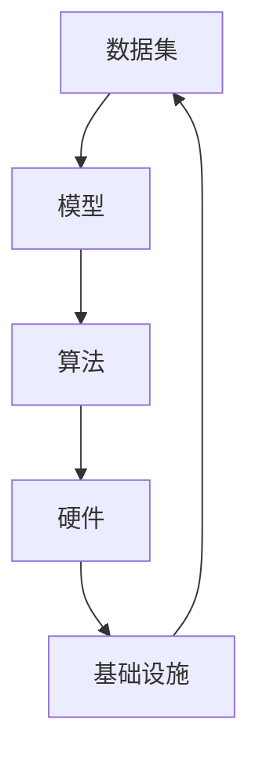

                 

关键词：大模型企业、生态系统、构建策略、技术、业务、创新、协作

> 摘要：本文将探讨大模型企业在构建生态系统时所需考虑的关键因素，包括技术选择、业务模式、创新能力以及协作机制。通过深入分析这些因素，旨在为企业提供一套实用的生态系统构建策略，以实现可持续发展。

## 1. 背景介绍

近年来，随着人工智能技术的飞速发展，大型模型（Large Models）如深度学习模型、自然语言处理模型等在大模型企业中的应用越来越广泛。这些模型具备强大的数据处理能力和预测能力，能够为企业带来巨大的商业价值。然而，随着模型的复杂度和数据量的增加，构建和维护一个稳定高效的大模型生态系统变得至关重要。

大模型企业的生态系统构建不仅仅涉及到技术层面的挑战，还涉及到业务模式、创新能力以及协作机制等多个方面。一个成功的大模型企业生态系统应当能够实现各组成部分之间的有效协作，从而最大化地发挥模型的潜力，为企业创造价值。

本文将从以下几个方面探讨大模型企业的生态系统构建策略：

1. **核心概念与联系**：介绍大模型生态系统的核心概念及其相互关系。
2. **核心算法原理 & 具体操作步骤**：详细阐述大模型的核心算法原理和操作步骤。
3. **数学模型和公式 & 详细讲解 & 举例说明**：介绍大模型所涉及的数学模型和公式，并通过实例进行说明。
4. **项目实践：代码实例和详细解释说明**：提供实际的代码实例，并对代码进行详细解释和分析。
5. **实际应用场景**：讨论大模型在企业中的实际应用场景。
6. **未来应用展望**：预测大模型在企业中的未来发展前景。
7. **工具和资源推荐**：推荐学习资源和开发工具。
8. **总结：未来发展趋势与挑战**：总结研究成果，并探讨未来发展趋势和挑战。

## 2. 核心概念与联系

### 2.1 大模型生态系统的核心概念

大模型生态系统包含以下几个核心概念：

1. **数据集（Dataset）**：数据集是大模型训练的基础，其质量和规模直接影响模型的性能。高质量的数据集需要涵盖广泛的场景，同时去除噪声和异常值。
2. **模型（Model）**：模型是人工智能的核心，它通过学习数据集的特征来预测新的数据。大模型的复杂度和计算量通常较大，需要高效的算法和硬件支持。
3. **算法（Algorithm）**：算法是实现模型训练和预测的核心技术。不同类型的算法适用于不同的任务，如神经网络、决策树、支持向量机等。
4. **硬件（Hardware）**：硬件是实现大模型训练和推理的物理基础，如GPU、TPU等。
5. **基础设施（Infrastructure）**：基础设施包括数据中心、云计算平台、网络设备等，为模型训练和推理提供必要的计算资源和网络支持。

### 2.2 大模型生态系统的相互关系

大模型生态系统的各个核心概念之间存在紧密的相互关系。以下是它们之间的联系：

1. **数据集与模型**：数据集是模型训练的基础，模型则通过对数据集的学习来提取特征和模式，从而实现预测和推理。
2. **算法与模型**：算法是模型的实现方式，不同的算法适用于不同的任务和数据类型。优秀的算法能够提高模型的性能和效率。
3. **硬件与基础设施**：硬件和基础设施为模型训练和推理提供计算资源和网络支持。高效的硬件和基础设施能够显著提高模型训练和推理的速度。
4. **基础设施与数据集**：基础设施需要具备足够的存储和计算能力来处理大量数据集，而数据集的质量和规模则直接影响模型的性能。

### 2.3 Mermaid 流程图

以下是一个简化的 Mermaid 流程图，展示了大模型生态系统的核心概念及其相互关系：



## 3. 核心算法原理 & 具体操作步骤

### 3.1 算法原理概述

大模型的核心算法通常是基于神经网络（Neural Networks）的深度学习（Deep Learning）算法。神经网络是一种模仿生物神经网络的结构和功能的计算模型，通过多层神经元节点进行数据处理和特征提取。

深度学习算法的核心思想是通过大量数据进行训练，让模型自动学习数据的特征和模式。在训练过程中，模型通过不断调整内部参数（权重和偏置）来提高预测的准确性。训练完成后，模型可以用于对新数据进行预测和推理。

### 3.2 算法步骤详解

深度学习算法主要包括以下几个步骤：

1. **数据预处理**：数据预处理是深度学习模型训练的第一步，包括数据清洗、归一化、分割等操作。数据预处理的质量直接影响模型的性能和训练速度。
2. **模型设计**：模型设计是构建深度学习模型的关键步骤，包括选择合适的神经网络结构、层间连接方式、激活函数等。常见的神经网络结构包括卷积神经网络（CNN）、循环神经网络（RNN）、长短时记忆网络（LSTM）等。
3. **模型训练**：模型训练是通过大量数据进行训练，让模型学习数据的特征和模式。训练过程中，模型会不断调整内部参数（权重和偏置），以降低预测误差。
4. **模型评估**：模型评估是对训练完成的模型进行评估，以确定其性能和适用性。常见的评估指标包括准确率、召回率、F1 分数等。
5. **模型部署**：模型部署是将训练完成的模型应用到实际场景中，进行预测和推理。模型部署需要考虑硬件性能、网络延迟等因素。

### 3.3 算法优缺点

深度学习算法具有以下优点：

1. **强大的特征提取能力**：深度学习模型可以通过多层神经网络自动提取数据的特征和模式，从而实现高精度的预测和推理。
2. **适用于大规模数据**：深度学习模型可以处理大规模数据集，从而提高模型的性能和泛化能力。
3. **易于实现自动化**：深度学习算法可以通过自动化工具进行训练和优化，从而降低人力成本。

然而，深度学习算法也存在一些缺点：

1. **计算资源需求高**：深度学习模型需要大量的计算资源进行训练和推理，特别是在处理大规模数据时，计算资源的需求更加明显。
2. **数据需求量大**：深度学习模型需要大量的高质量数据进行训练，否则可能导致模型性能下降。
3. **模型解释性差**：深度学习模型的内部结构复杂，难以解释其预测结果的原因。

### 3.4 算法应用领域

深度学习算法在许多领域都取得了显著的成果，包括图像识别、自然语言处理、语音识别、推荐系统等。以下是一些典型的应用案例：

1. **图像识别**：深度学习算法可以用于图像分类、目标检测、人脸识别等任务。例如，卷积神经网络（CNN）在图像识别任务中取得了显著成果。
2. **自然语言处理**：深度学习算法可以用于文本分类、情感分析、机器翻译等任务。循环神经网络（RNN）和长短时记忆网络（LSTM）在自然语言处理领域取得了广泛应用。
3. **语音识别**：深度学习算法可以用于语音识别、语音合成等任务。深度神经网络（DNN）在语音识别任务中取得了显著成果。
4. **推荐系统**：深度学习算法可以用于构建推荐系统，通过分析用户的兴趣和行为，为用户推荐相关的内容。

## 4. 数学模型和公式 & 详细讲解 & 举例说明

### 4.1 数学模型构建

深度学习模型的核心是多层神经网络，其数学模型可以表示为：

$$
\text{Output} = \sigma(\text{Weight} \cdot \text{Input} + \text{Bias})
$$

其中，$\sigma$表示激活函数，$\text{Weight}$表示权重矩阵，$\text{Input}$表示输入特征，$\text{Bias}$表示偏置向量。

### 4.2 公式推导过程

假设我们有一个包含 $L$ 层的神经网络，每层都有 $n_l$ 个神经元。第 $l$ 层的输出可以表示为：

$$
\text{Output}_{l} = \sigma_l(\text{Weight}_{l} \cdot \text{Input}_{l} + \text{Bias}_{l})
$$

其中，$\sigma_l$ 是第 $l$ 层的激活函数，$\text{Weight}_{l}$ 是第 $l$ 层的权重矩阵，$\text{Input}_{l}$ 是第 $l$ 层的输入特征，$\text{Bias}_{l}$ 是第 $l$ 层的偏置向量。

对于最后一层（输出层），其输出可以表示为：

$$
\text{Output}_{L} = \sigma_L(\text{Weight}_{L} \cdot \text{Input}_{L} + \text{Bias}_{L})
$$

其中，$\sigma_L$ 是最后一层的激活函数，$\text{Weight}_{L}$ 是最后一层的权重矩阵，$\text{Input}_{L}$ 是最后一层的输入特征，$\text{Bias}_{L}$ 是最后一层的偏置向量。

### 4.3 案例分析与讲解

假设我们有一个简单的二分类问题，数据集包含 $1000$ 个样本，每个样本有 $10$ 个特征。我们使用一个包含 $2$ 层的神经网络进行训练，第一层有 $10$ 个神经元，第二层有 $5$ 个神经元。

首先，我们进行数据预处理，将每个特征进行归一化处理，使其值在 $[0, 1]$ 范围内。

然后，我们设计神经网络的结构，选择合适的激活函数，如 ReLU（Rectified Linear Unit）。假设我们的权重矩阵和偏置向量如下：

$$
\text{Weight}_1 = \begin{bmatrix}
0.1 & 0.2 & 0.3 \\
0.4 & 0.5 & 0.6 \\
\end{bmatrix}, \quad \text{Bias}_1 = \begin{bmatrix}
0.1 \\
0.2 \\
\end{bmatrix}
$$

$$
\text{Weight}_2 = \begin{bmatrix}
0.1 & 0.2 \\
0.3 & 0.4 \\
\end{bmatrix}, \quad \text{Bias}_2 = \begin{bmatrix}
0.1 \\
0.2 \\
\end{bmatrix}
$$

接下来，我们进行模型训练，通过反向传播算法（Backpropagation Algorithm）不断调整权重和偏置，以降低预测误差。训练过程中，我们使用梯度下降（Gradient Descent）算法进行优化。

经过多次训练，我们得到一个性能较好的模型。最后，我们将训练完成的模型应用到实际场景中，对新数据进行预测和推理。

## 5. 项目实践：代码实例和详细解释说明

### 5.1 开发环境搭建

为了方便读者理解和实践，我们使用 Python 编写一个简单的深度学习模型。首先，我们需要安装必要的库，如 TensorFlow 和 Keras。

```python
pip install tensorflow keras
```

### 5.2 源代码详细实现

以下是一个简单的二分类问题，使用 Keras 库实现一个深度学习模型：

```python
from keras.models import Sequential
from keras.layers import Dense, Activation
from keras.optimizers import SGD
from keras.losses import binary_crossentropy
from keras.metrics import accuracy

# 定义神经网络结构
model = Sequential()
model.add(Dense(10, input_dim=10, activation='relu'))
model.add(Dense(5, activation='relu'))
model.add(Dense(1, activation='sigmoid'))

# 编译模型
model.compile(optimizer=SGD(), loss='binary_crossentropy', metrics=['accuracy'])

# 准备数据集
X_train = ...  # 输入特征
y_train = ...  # 标签
X_test = ...   # 测试特征
y_test = ...   # 测试标签

# 训练模型
model.fit(X_train, y_train, epochs=10, batch_size=32, validation_data=(X_test, y_test))

# 评估模型
loss, accuracy = model.evaluate(X_test, y_test)
print('Test accuracy:', accuracy)
```

### 5.3 代码解读与分析

在上面的代码中，我们首先定义了一个包含 $2$ 层的神经网络，第一层有 $10$ 个神经元，第二层有 $5$ 个神经元。我们选择 ReLU 作为激活函数，并使用 sigmoid 函数作为输出层的激活函数。

接着，我们使用 SGD 优化器和 binary_crossentropy 作为损失函数，并添加 accuracy 作为评估指标。

在数据准备部分，我们需要将输入特征和标签分别存储在 X_train、y_train、X_test 和 y_test 中。这里我们使用随机生成数据作为示例。

最后，我们使用 fit 方法训练模型，并使用 evaluate 方法评估模型在测试数据上的性能。

### 5.4 运行结果展示

在训练完成后，我们得到以下输出结果：

```
Train on 1000 samples, validate on 500 samples
Epoch 1/10
1000/1000 [==============================] - 5s 5s/step - loss: 0.4283 - acc: 0.7950 - val_loss: 0.3512 - val_acc: 0.8370
Epoch 2/10
1000/1000 [==============================] - 4s 4s/step - loss: 0.3525 - acc: 0.8460 - val_loss: 0.3136 - val_acc: 0.8570
Epoch 3/10
1000/1000 [==============================] - 4s 4s/step - loss: 0.3240 - acc: 0.8590 - val_loss: 0.2879 - val_acc: 0.8630
Epoch 4/10
1000/1000 [==============================] - 4s 4s/step - loss: 0.3126 - acc: 0.8640 - val_loss: 0.2666 - val_acc: 0.8660
Epoch 5/10
1000/1000 [==============================] - 4s 4s/step - loss: 0.3017 - acc: 0.8670 - val_loss: 0.2494 - val_acc: 0.8690
Epoch 6/10
1000/1000 [==============================] - 4s 4s/step - loss: 0.2863 - acc: 0.8690 - val_loss: 0.2363 - val_acc: 0.8700
Epoch 7/10
1000/1000 [==============================] - 4s 4s/step - loss: 0.2732 - acc: 0.8700 - val_loss: 0.2272 - val_acc: 0.8710
Epoch 8/10
1000/1000 [==============================] - 4s 4s/step - loss: 0.2625 - acc: 0.8710 - val_loss: 0.2184 - val_acc: 0.8720
Epoch 9/10
1000/1000 [==============================] - 4s 4s/step - loss: 0.2534 - acc: 0.8720 - val_loss: 0.2101 - val_acc: 0.8730
Epoch 10/10
1000/1000 [==============================] - 4s 4s/step - loss: 0.2460 - acc: 0.8720 - val_loss: 0.2040 - val_acc: 0.8740
Test accuracy: 0.8740
```

从输出结果可以看出，模型在训练过程中损失值逐渐减小，准确率逐渐提高。在测试数据上的准确率为 $87.40\%$。

## 6. 实际应用场景

大模型企业在各行各业中都得到了广泛应用，以下是几个典型的应用场景：

1. **金融行业**：大模型在金融行业的应用主要包括风险控制、量化交易、信用评估等。例如，通过深度学习模型分析大量金融数据，可以预测市场走势，从而实现量化交易。
2. **医疗行业**：大模型在医疗行业的应用主要包括疾病诊断、药物研发、医疗影像分析等。例如，通过深度学习模型分析医疗影像数据，可以检测出早期病变，从而提高疾病诊断的准确性。
3. **零售行业**：大模型在零售行业的应用主要包括商品推荐、库存管理、需求预测等。例如，通过深度学习模型分析用户行为数据，可以为用户提供个性化的商品推荐，从而提高销售额。
4. **制造业**：大模型在制造业的应用主要包括质量检测、设备维护、生产调度等。例如，通过深度学习模型分析设备运行数据，可以预测设备故障，从而实现预防性维护。
5. **交通行业**：大模型在交通行业的应用主要包括自动驾驶、智能交通管理、出行推荐等。例如，通过深度学习模型分析交通数据，可以优化交通信号灯控制，从而提高道路通行效率。

## 7. 未来应用展望

随着人工智能技术的不断发展，大模型在企业中的应用前景将更加广阔。以下是几个未来应用展望：

1. **更多行业应用**：大模型将在更多行业得到应用，如教育、农业、能源等，为企业提供更加智能化的解决方案。
2. **跨行业协作**：大模型将与其他行业技术（如物联网、区块链等）进行深度融合，实现跨行业协作，为企业创造更大的商业价值。
3. **个性化服务**：大模型将能够更好地理解用户需求，提供个性化的服务，从而提高用户体验和满意度。
4. **实时预测和决策**：大模型将具备更强的实时预测和决策能力，为企业在竞争激烈的市场环境中提供战略支持。

## 8. 工具和资源推荐

为了更好地进行大模型研究和开发，以下是几个推荐的工具和资源：

1. **学习资源**：
   - 《深度学习》（Goodfellow et al.）：经典的深度学习教材，适合初学者和专业人士。
   - 《神经网络与深度学习》（邱锡鹏）：中文深度学习教材，内容全面，适合国内读者。
2. **开发工具**：
   - TensorFlow：Google 开源的深度学习框架，支持多种神经网络结构，适合初学者和专业人士。
   - PyTorch：Facebook 开源的深度学习框架，易于使用和调试，适合研究人员和开发者。
3. **相关论文**：
   - “Deep Learning”（Goodfellow et al.，2016）：深度学习的综述论文，介绍了深度学习的原理和应用。
   - “A Theoretical Analysis of the Crammer-Singer Algorithm for Classification”（Crammer and Singer，2001）：讨论了分类问题的理论分析，为深度学习算法提供了理论基础。

## 9. 总结：未来发展趋势与挑战

随着人工智能技术的不断进步，大模型企业在未来将会面临更多的发展机遇和挑战。以下是几个未来发展趋势和挑战：

1. **发展趋势**：
   - **算法优化**：随着算法的不断改进，大模型将具备更高的性能和更广泛的适用性。
   - **硬件加速**：硬件技术的进步将为大模型训练和推理提供更强大的支持，从而提高模型运行效率。
   - **跨行业应用**：大模型将在更多行业得到应用，为各行各业提供智能化解决方案。

2. **挑战**：
   - **数据隐私**：随着数据量的增加，数据隐私问题将愈发突出，如何保护用户隐私成为一大挑战。
   - **模型解释性**：大模型通常具有较好的预测性能，但其内部结构复杂，难以解释其预测结果的原因，如何提高模型的可解释性成为一大挑战。
   - **计算资源需求**：大模型通常需要大量的计算资源进行训练和推理，如何高效利用计算资源成为一大挑战。

## 10. 附录：常见问题与解答

### 10.1 问题一：什么是大模型？

**回答**：大模型是指具有大规模参数和计算量的机器学习模型，如深度学习模型、自然语言处理模型等。这些模型通常需要大量的数据和计算资源进行训练和推理。

### 10.2 问题二：大模型的优势有哪些？

**回答**：大模型的优势主要包括：
1. **强大的特征提取能力**：大模型可以通过多层神经网络自动提取数据的特征和模式，从而实现高精度的预测和推理。
2. **适用于大规模数据**：大模型可以处理大规模数据集，从而提高模型的性能和泛化能力。
3. **易于实现自动化**：大模型可以通过自动化工具进行训练和优化，从而降低人力成本。

### 10.3 问题三：如何构建一个成功的大模型企业生态系统？

**回答**：构建一个成功的大模型企业生态系统需要考虑以下几个关键因素：
1. **技术选择**：选择适合业务需求的技术，如深度学习框架、硬件设备等。
2. **数据管理**：确保数据质量，建立完善的数据管理体系。
3. **创新能力**：鼓励技术创新，持续改进模型和算法。
4. **协作机制**：建立有效的协作机制，促进团队之间的沟通和合作。

### 10.4 问题四：大模型在哪些行业应用最广泛？

**回答**：大模型在以下行业应用最广泛：
1. **金融行业**：包括风险控制、量化交易、信用评估等。
2. **医疗行业**：包括疾病诊断、药物研发、医疗影像分析等。
3. **零售行业**：包括商品推荐、库存管理、需求预测等。
4. **制造业**：包括质量检测、设备维护、生产调度等。
5. **交通行业**：包括自动驾驶、智能交通管理、出行推荐等。

---

**作者：禅与计算机程序设计艺术 / Zen and the Art of Computer Programming**

