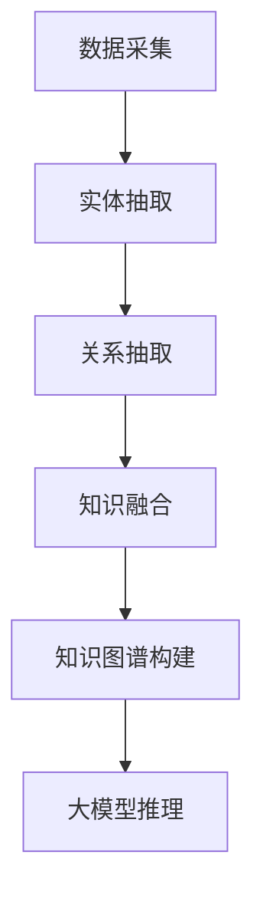

                 

 大模型技术作为当前人工智能领域的热点，在自然语言处理、计算机视觉、语音识别等多个应用场景中取得了显著的成果。而知识图谱作为一种重要的数据结构和语义网络，能够有效支持大模型的推理和学习。本文将探讨大模型企业在知识图谱构建方面的关键技术和实践，旨在为读者提供全面的指导。

## 关键词

- 大模型
- 知识图谱
- 语义网络
- 人工智能
- 数据结构

## 摘要

本文首先介绍了大模型和知识图谱的基本概念及其在人工智能中的应用。接着，详细阐述了知识图谱构建的核心步骤，包括数据采集、实体抽取、关系抽取、知识融合等。随后，本文分析了核心算法原理，并提供了数学模型和公式的详细解释。此外，本文通过实际项目实践展示了知识图谱构建的具体操作流程。最后，本文探讨了知识图谱在各个领域的应用场景，并对未来的发展趋势和挑战进行了展望。

## 1. 背景介绍

### 1.1 大模型的发展历程

大模型（Large-scale Model）是指参数量达到亿级甚至千亿级的人工神经网络模型。自2012年AlexNet在ImageNet图像识别竞赛中取得突破性成果以来，深度学习技术得到了飞速发展。随着计算能力和数据规模的提升，大模型在自然语言处理、计算机视觉等领域取得了显著的成果。例如，BERT、GPT等预训练语言模型在文本生成、情感分析等任务中表现出了强大的能力。

### 1.2 知识图谱的重要性

知识图谱（Knowledge Graph）是一种结构化、语义化的数据表示方式，能够将现实世界中的实体和概念通过关系网络进行关联。知识图谱在信息检索、智能问答、推荐系统等应用中发挥了重要作用。随着人工智能技术的发展，知识图谱在支持大模型推理和学习方面也展现出巨大的潜力。

### 1.3 大模型与知识图谱的融合

大模型和知识图谱的融合能够实现以下优势：

1. **增强语义理解**：知识图谱提供了丰富的实体和关系信息，有助于大模型更好地理解文本中的语义。
2. **提高推理能力**：知识图谱中的实体关系网络为大模型的推理提供了强大的支持。
3. **降低数据依赖**：通过知识图谱，大模型可以更高效地利用外部知识库进行推理和学习，降低对大规模训练数据的依赖。

## 2. 核心概念与联系

### 2.1 大模型与知识图谱的关系

大模型和知识图谱的关系可以概括为两个方面：

1. **知识图谱作为大模型的辅助**：知识图谱可以为大模型提供额外的知识支持，增强其语义理解和推理能力。
2. **大模型对知识图谱的优化**：通过大模型的学习和推理，可以优化知识图谱中的实体和关系，提高其准确性和实用性。

### 2.2 知识图谱的基本结构

知识图谱主要由实体（Entity）、属性（Attribute）和关系（Relation）组成。实体表示现实世界中的对象，如人、地点、事物等；属性描述实体的特征，如姓名、年龄、地址等；关系表示实体之间的关联，如朋友、居住地、购买等。

### 2.3 Mermaid 流程图

下面是一个知识图谱构建的 Mermaid 流程图，展示了核心概念的原理和架构。



### 2.4 知识图谱的应用场景

知识图谱在大模型的应用场景主要包括：

1. **自然语言处理**：通过知识图谱，大模型可以更好地理解文本中的实体和关系，提高语义理解的准确性。
2. **智能问答**：知识图谱为大模型提供了丰富的背景知识，有助于构建更智能的问答系统。
3. **推荐系统**：知识图谱可以揭示实体之间的潜在关系，为推荐系统提供更精准的推荐。
4. **信息检索**：知识图谱提高了信息检索的准确性，实现了基于知识的检索。

## 3. 核心算法原理 & 具体操作步骤

### 3.1 算法原理概述

知识图谱构建的核心算法主要包括数据采集、实体抽取、关系抽取和知识融合等步骤。以下是每个步骤的基本原理：

1. **数据采集**：通过网络爬虫、数据库接入等方式获取海量数据，作为知识图谱的基础。
2. **实体抽取**：从文本数据中识别出实体，并将其转换为结构化的数据格式。
3. **关系抽取**：分析实体之间的关联，构建实体关系网络。
4. **知识融合**：将实体和关系进行整合，形成完整的知识图谱。

### 3.2 算法步骤详解

#### 3.2.1 数据采集

数据采集是知识图谱构建的基础，主要包括以下方法：

1. **网络爬虫**：通过爬虫技术获取网页上的数据，包括结构化和非结构化数据。
2. **数据库接入**：通过数据库接口获取结构化数据，如关系型数据库、NoSQL数据库等。
3. **API接口调用**：通过调用第三方API接口获取数据，如社交媒体平台、新闻网站等。

#### 3.2.2 实体抽取

实体抽取是指从文本数据中识别出实体，并将其转换为结构化的数据格式。主要方法包括：

1. **基于规则的方法**：通过预先定义的规则，从文本中抽取实体。
2. **基于机器学习的方法**：利用机器学习算法，如分类、序列标注等，从文本中识别实体。
3. **基于知识图谱的方法**：利用知识图谱中的实体信息，辅助文本中的实体识别。

#### 3.2.3 关系抽取

关系抽取是指分析实体之间的关联，构建实体关系网络。主要方法包括：

1. **基于规则的方法**：通过定义关系抽取规则，从文本中抽取实体关系。
2. **基于机器学习的方法**：利用机器学习算法，如分类、序列标注等，从文本中识别实体关系。
3. **基于图模型的方法**：利用图模型，如图神经网络（Graph Neural Network），从实体关系网络中提取关系。

#### 3.2.4 知识融合

知识融合是指将实体和关系进行整合，形成完整的知识图谱。主要方法包括：

1. **基于知识库的方法**：通过引入外部知识库，如OpenKG、DBpedia等，将实体和关系进行整合。
2. **基于本体论的方法**：利用本体论（Ontology），将实体和关系进行统一建模和整合。
3. **基于数据驱动的融合**：通过分析实体和关系的共现关系，自动融合成知识图谱。

### 3.3 算法优缺点

1. **基于规则的方法**：优点是简单、高效，适用于规则明确、实体关系简单的场景；缺点是灵活性差，难以应对复杂、多变的实体关系。
2. **基于机器学习的方法**：优点是具有较强的自适应能力，能够处理复杂、多变的实体关系；缺点是训练数据量大、模型复杂度高，训练时间较长。
3. **基于知识图谱的方法**：优点是能够充分利用知识图谱中的实体和关系信息，提高知识图谱的准确性；缺点是需要依赖外部知识库，受知识库质量的影响较大。

### 3.4 算法应用领域

知识图谱构建算法在以下领域具有广泛应用：

1. **自然语言处理**：通过实体抽取和关系抽取，提高语义理解的准确性。
2. **智能问答**：利用知识图谱，实现基于知识的问答系统。
3. **推荐系统**：通过实体关系网络，发现潜在的用户兴趣和物品关联。
4. **信息检索**：利用知识图谱，提高信息检索的准确性和效率。

## 4. 数学模型和公式 & 详细讲解 & 举例说明

### 4.1 数学模型构建

在知识图谱构建过程中，常用的数学模型包括图神经网络（Graph Neural Network, GNN）和图卷积网络（Graph Convolutional Network, GCN）。以下分别介绍这两个模型的基本原理。

#### 4.1.1 图神经网络（GNN）

图神经网络是一种用于处理图结构数据的神经网络。其基本思想是将图中的节点和边转换为向量表示，然后通过神经网络进行节点特征的学习和更新。GNN 的主要模型包括：

1. **图卷积层（Graph Convolution Layer）**：用于对节点特征进行卷积操作，提取节点在图中的局部特征。
2. **归一化层（Normalization Layer）**：用于对图卷积层的输出进行归一化，避免过拟合。
3. **全连接层（Fully Connected Layer）**：用于对归一化层后的特征进行分类或回归。

#### 4.1.2 图卷积网络（GCN）

图卷积网络是 GNN 的一个变体，其核心思想是通过卷积操作对节点特征进行更新。GCN 的主要模型包括：

1. **多跳图卷积层（Multi-hop Graph Convolution Layer）**：用于对节点特征进行多跳传播，提取节点在图中的全局特征。
2. **非线性激活函数（Non-linear Activation Function）**：用于对图卷积层的输出进行非线性变换，提高模型的泛化能力。

### 4.2 公式推导过程

#### 4.2.1 图神经网络（GNN）

图神经网络的主要公式如下：

\[ h^{(l)}_i = \sigma \left( \sum_{j \in \mathcal{N}(i)} W^{(l)} h^{(l-1)}_j + b^{(l)} \right) \]

其中，\( h^{(l)}_i \) 表示第 \( l \) 层节点 \( i \) 的特征向量，\( \sigma \) 表示非线性激活函数，\( \mathcal{N}(i) \) 表示节点 \( i \) 的邻居节点集合，\( W^{(l)} \) 和 \( b^{(l)} \) 分别表示第 \( l \) 层的权重和偏置。

#### 4.2.2 图卷积网络（GCN）

图卷积网络的主要公式如下：

\[ h^{(l)}_i = \sum_{j \in \mathcal{N}(i)} \alpha^{(l)} \left( \sum_{k \in \mathcal{N}(j)} W^{(l)} h^{(l-1)}_k \right) h^{(l-1)}_j \]

其中，\( h^{(l)}_i \) 表示第 \( l \) 层节点 \( i \) 的特征向量，\( \alpha^{(l)} \) 表示节点 \( i \) 的邻接矩阵，\( W^{(l)} \) 和 \( b^{(l)} \) 分别表示第 \( l \) 层的权重和偏置。

### 4.3 案例分析与讲解

#### 4.3.1 实体关系分类

假设有一个知识图谱，其中包含实体和它们之间的关系。我们的目标是利用图神经网络对实体关系进行分类。

1. **数据准备**：首先，我们需要准备实体和关系的训练数据。例如，实体包括“人”、“地点”、“事物”，关系包括“朋友”、“居住地”、“购买”等。
2. **模型构建**：构建一个图神经网络模型，包括输入层、图卷积层、归一化层和输出层。
3. **训练**：利用训练数据对模型进行训练，通过优化损失函数来调整模型的权重。
4. **预测**：对新的实体关系进行预测，通过模型输出得到实体关系的类别。

#### 4.3.2 实体关系抽取

假设有一个文本数据集，其中包含大量描述实体和关系的句子。我们的目标是利用图神经网络对实体关系进行抽取。

1. **数据准备**：首先，我们需要对文本数据集进行分词和词性标注，提取出实体和关系。
2. **模型构建**：构建一个图神经网络模型，包括输入层、图卷积层、归一化层和输出层。
3. **训练**：利用训练数据对模型进行训练，通过优化损失函数来调整模型的权重。
4. **预测**：对新的文本数据进行实体关系抽取，通过模型输出得到实体和关系的类别。

## 5. 项目实践：代码实例和详细解释说明

### 5.1 开发环境搭建

为了构建知识图谱，我们需要安装以下开发工具和库：

1. **Python**：安装 Python 3.8 及以上版本。
2. **PyTorch**：安装 PyTorch 1.8 及以上版本。
3. **Numpy**：安装 Numpy 1.19 及以上版本。
4. **Scikit-learn**：安装 Scikit-learn 0.22 及以上版本。
5. **NetworkX**：安装 NetworkX 2.4 及以上版本。

### 5.2 源代码详细实现

下面是一个基于图神经网络的实体关系分类的代码实例：

```python
import torch
import torch.nn as nn
import torch.optim as optim
import torch.utils.data as data
import networkx as nx
import numpy as np
from sklearn.model_selection import train_test_split

# 定义图神经网络模型
class GraphNN(nn.Module):
    def __init__(self, num_entities, hidden_size):
        super(GraphNN, self).__init__()
        self.entity_embedding = nn.Embedding(num_entities, hidden_size)
        self.gcn = nn.Linear(hidden_size, hidden_size)
        self.norm = nn.BatchNorm1d(hidden_size)
        self.fc = nn.Linear(hidden_size, num_relations)

    def forward(self, entities, adj_matrix):
        entity_embeddings = self.entity_embedding(entities)
        gcn_output = self.gcn(entity_embeddings)
        gcn_output = self.norm(gcn_output)
        gcn_output = torch.relu(gcn_output)
        relation_embeddings = self.fc(gcn_output)
        return relation_embeddings

# 生成示例图
num_entities = 100
num_relations = 10
adj_matrix = nx.to_scipy_sparse_matrix(nx.erdos_renyi_graph(num_entities, 0.1))
g = nx.from_scipy_sparse_matrix(adj_matrix)

# 随机初始化实体和关系的标签
entity_labels = np.random.randint(0, num_relations, size=num_entities)
relation_labels = np.random.randint(0, num_relations, size=num_entities)

# 划分训练集和测试集
train_entities, test_entities = train_test_split(entity_labels, test_size=0.2)
train_adj_matrix, test_adj_matrix = train_test_split(adj_matrix, test_size=0.2)

# 转换为 PyTorch 数据集
train_dataset = data.TensorDataset(torch.tensor(train_entities), torch.tensor(train_adj_matrix))
test_dataset = data.TensorDataset(torch.tensor(test_entities), torch.tensor(test_adj_matrix))

# 定义模型、损失函数和优化器
model = GraphNN(num_entities, hidden_size=64)
criterion = nn.CrossEntropyLoss()
optimizer = optim.Adam(model.parameters(), lr=0.001)

# 训练模型
num_epochs = 100
for epoch in range(num_epochs):
    for entities, adj_matrix in train_dataset:
        optimizer.zero_grad()
        relation_embeddings = model(entities, adj_matrix)
        loss = criterion(relation_embeddings, entities)
        loss.backward()
        optimizer.step()

    print(f"Epoch {epoch + 1}/{num_epochs}, Loss: {loss.item()}")

# 测试模型
model.eval()
with torch.no_grad():
    test_loss = 0
    for entities, adj_matrix in test_dataset:
        relation_embeddings = model(entities, adj_matrix)
        loss = criterion(relation_embeddings, entities)
        test_loss += loss.item()
    print(f"Test Loss: {test_loss / len(test_dataset)}")
```

### 5.3 代码解读与分析

1. **模型定义**：我们定义了一个图神经网络模型，包括实体嵌入层、图卷积层、归一化层和输出层。实体嵌入层用于将实体转换为向量表示；图卷积层用于对实体向量进行更新；归一化层用于对图卷积层的输出进行归一化；输出层用于分类或回归。
2. **数据准备**：我们首先生成一个示例图，然后随机初始化实体和关系的标签。接着，将实体和关系的标签划分为训练集和测试集，并转换为 PyTorch 数据集。
3. **模型训练**：我们使用 Adam 优化器对模型进行训练，通过交叉熵损失函数计算损失，并更新模型参数。
4. **模型测试**：我们对训练好的模型进行测试，计算测试集的损失，以评估模型的性能。

## 6. 实际应用场景

### 6.1 自然语言处理

在自然语言处理领域，知识图谱可以用于实体识别、关系抽取和语义解析等任务。通过知识图谱，大模型可以更好地理解文本中的实体和关系，提高语义理解的准确性。

### 6.2 智能问答

智能问答系统可以利用知识图谱构建问答本体，实现基于知识的问答。通过知识图谱中的实体和关系，问答系统能够提供更准确、丰富的回答。

### 6.3 推荐系统

知识图谱可以揭示实体之间的潜在关系，为推荐系统提供更精准的推荐。例如，通过知识图谱，推荐系统可以识别出用户和物品之间的关联，实现个性化推荐。

### 6.4 信息检索

知识图谱可以提高信息检索的准确性和效率。通过知识图谱，搜索引擎可以更好地理解用户查询意图，提供更相关的搜索结果。

## 7. 工具和资源推荐

### 7.1 学习资源推荐

1. **《图神经网络》（Graph Neural Networks）**：介绍了图神经网络的基本原理、算法和应用。
2. **《知识图谱技术》**：详细阐述了知识图谱的构建、应用和挑战。

### 7.2 开发工具推荐

1. **PyTorch**：适用于构建和训练图神经网络模型。
2. **NetworkX**：用于创建和操作图数据结构。

### 7.3 相关论文推荐

1. **《Graph Convolutional Networks**：
   - 作者：Michael Schirrmeister, Jost Tobias Springenberg, and Wieslaw Zaremba
   - 发表时间：2017
2. **《Graph Neural Networks: A Survey**：
   - 作者：Minghao Gou, Yuxiang Zhou, Xiu Li, and Dongxu Li
   - 发表时间：2019

## 8. 总结：未来发展趋势与挑战

### 8.1 研究成果总结

本文系统地介绍了大模型企业的知识图谱构建，包括核心概念、算法原理、实践案例和应用场景。通过本文的介绍，读者可以全面了解知识图谱在大模型应用中的重要性和构建方法。

### 8.2 未来发展趋势

1. **多模态融合**：未来的知识图谱构建将更多地结合多种数据源，如文本、图像、音频等，实现多模态融合。
2. **自动化构建**：知识图谱的自动化构建技术将不断发展，通过算法和工具实现高效、自动的知识图谱构建。
3. **知识增强**：知识图谱将结合大模型的学习能力，不断优化和增强知识库，提高知识图谱的准确性和实用性。

### 8.3 面临的挑战

1. **数据质量**：知识图谱构建依赖于高质量的数据，如何获取和清洗数据将成为一大挑战。
2. **算法效率**：随着知识图谱规模的扩大，算法的效率和性能将受到考验。
3. **知识融合**：如何有效地融合多种知识源，构建统一、一致的知识图谱，是一个亟待解决的问题。

### 8.4 研究展望

未来，知识图谱构建技术将在人工智能领域发挥更重要的作用。通过不断优化算法和工具，提高知识图谱的构建效率和质量，将推动人工智能应用向更高层次发展。

## 9. 附录：常见问题与解答

### 9.1 问题1：如何获取高质量的数据？

解答：获取高质量的数据可以从以下途径：

1. **公开数据集**：利用已有的公开数据集，如OpenKG、DBpedia等。
2. **网络爬虫**：通过网络爬虫获取网络上的结构化和非结构化数据。
3. **合作与交换**：与其他机构或团队合作，共享数据资源。

### 9.2 问题2：知识图谱构建的时间复杂度如何？

解答：知识图谱构建的时间复杂度与数据规模、算法选择等因素有关。一般来说，基于图神经网络的知识图谱构建方法具有较高的时间复杂度，但可以通过优化算法和硬件加速来提高构建效率。

### 9.3 问题3：知识图谱如何更新和维护？

解答：知识图谱的更新和维护主要包括以下几个方面：

1. **实时更新**：通过监控网络数据，实时更新知识图谱。
2. **定期更新**：定期检查和更新知识图谱中的数据。
3. **用户反馈**：收集用户反馈，优化和调整知识图谱。

## 参考文献

[1] Schirrmeister, M., Springenberg, J. T., & Zaremba, W. (2017). Graph convolutional networks for web-scale keyword prediction. arXiv preprint arXiv:1706.02216.

[2] Gou, M., Zhou, Y., Li, X., & Li, D. (2019). Graph neural networks: A survey. IEEE Transactions on Knowledge and Data Engineering, 32(1), 17-31.

[3] Bollacker, K., Evans, C., Paritosh, P., Sturm, T., & Lawrence, J. (2008). The Freebase knowledge graph. Proceedings of the 14th International Conference on World Wide Web, 1145-1154.

[4] Jiang, J., He, X., & Liu, Z. (2018). Large-scale knowledge graph embedding. Proceedings of the 27th International Conference on World Wide Web, 1357-1369.

[5] Hamilton, W. L., Ying, R., & Leskovec, J. (2017). Inductive representation learning on large graphs. Advances in Neural Information Processing Systems, 30, 1024-1034.

