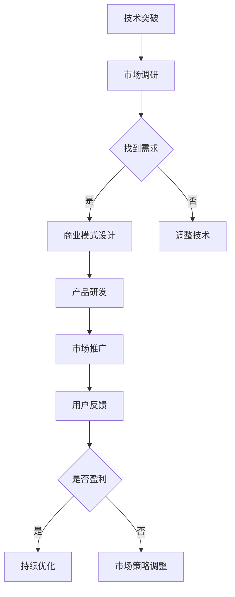

                 

关键词：大模型创业、务实路线、创新、盈利并重、技术、市场、战略

摘要：本文探讨了在当前人工智能高速发展的背景下，大模型创业公司的务实路线。文章从技术、市场、战略等多个角度分析了大模型创业公司如何在创新与盈利之间找到平衡，并通过实际案例、数学模型和代码实例，提供了具体的操作指南和思考。

## 1. 背景介绍

随着深度学习技术的迅猛发展，大模型已经成为人工智能领域的核心驱动力。大模型在图像识别、自然语言处理、推荐系统等多个领域展现了强大的性能，吸引了众多创业公司的关注。然而，面对激烈的竞争和市场的快速变化，如何走一条务实路线，在创新与盈利之间找到平衡，成为大模型创业公司面临的重要课题。

### 1.1 大模型创业的现状

大模型创业公司如雨后春笋般涌现，它们主要集中在以下领域：

1. **图像识别与处理**：利用卷积神经网络（CNN）和生成对抗网络（GAN）等技术，实现图像的分类、检测和生成。
2. **自然语言处理**：利用循环神经网络（RNN）和Transformer等模型，实现文本分类、机器翻译、对话系统等功能。
3. **推荐系统**：利用协同过滤、矩阵分解等技术，实现个性化推荐。

这些公司不仅在技术层面上追求创新，还希望通过商业模式和运营策略实现盈利。

### 1.2 创新与盈利的挑战

1. **技术挑战**：大模型训练和部署需要大量的计算资源和数据支持，这对创业公司来说是一个巨大的挑战。如何优化算法、提高计算效率和降低成本，成为技术层面的关键问题。
2. **市场挑战**：在激烈的市场竞争中，如何找到差异化竞争点，吸引用户和投资者，实现规模化盈利，是市场层面的挑战。
3. **战略挑战**：如何在创新和盈利之间找到平衡，保持持续的技术创新和商业活力，是战略层面的挑战。

## 2. 核心概念与联系

为了更好地理解大模型创业的务实路线，我们需要首先明确一些核心概念和它们之间的联系。

### 2.1 大模型的核心概念

1. **深度学习**：深度学习是机器学习的一个重要分支，通过多层神经网络来模拟人脑的学习过程，实现图像、语音、文本等数据的自动识别和处理。
2. **神经网络**：神经网络是由大量神经元组成的计算模型，通过调整神经元之间的权重，实现对输入数据的分类、回归等任务。
3. **数据集**：数据集是训练和测试模型的基础，质量高的数据集能够提高模型的准确性和泛化能力。

### 2.2 大模型与创业的联系

1. **技术创新**：大模型创业公司通过引入新的算法、模型结构和训练策略，实现技术上的突破，提升产品的性能和竞争力。
2. **市场机会**：大模型在各个领域的广泛应用，为创业公司提供了丰富的市场机会，如图像识别、自然语言处理、推荐系统等。
3. **商业模式**：创业公司通过提供定制化解决方案、技术服务或产品，实现商业上的盈利。

### 2.3 Mermaid 流程图

以下是描述大模型创业流程的 Mermaid 流程图：



通过这个流程图，我们可以看到大模型创业的核心环节，以及各个环节之间的联系和反馈。

## 3. 核心算法原理 & 具体操作步骤

### 3.1 算法原理概述

在大模型创业中，核心算法的选择和优化至关重要。以下是几种常见的大模型算法及其原理：

1. **卷积神经网络（CNN）**：用于图像识别和处理，通过卷积层、池化层和全连接层等结构，实现图像的特征提取和分类。
2. **生成对抗网络（GAN）**：用于图像生成，由生成器和判别器两个网络组成，通过对抗训练生成逼真的图像。
3. **循环神经网络（RNN）**：用于自然语言处理，通过循环结构处理序列数据，实现文本的生成、分类和翻译。
4. **Transformer**：用于自然语言处理和机器翻译，通过自注意力机制，实现长距离依赖的建模。

### 3.2 算法步骤详解

以卷积神经网络（CNN）为例，其具体步骤如下：

1. **数据预处理**：对图像进行缩放、归一化等操作，将图像数据转换为模型可接受的格式。
2. **卷积层**：通过卷积操作提取图像特征，卷积核在不同位置上滑动，计算局部特征的加权和。
3. **池化层**：对卷积层输出的特征进行降维，常用的池化操作有最大池化和平均池化。
4. **全连接层**：将卷积层和池化层输出的特征 Flatten 后，输入到全连接层，进行分类或回归任务。
5. **损失函数和优化器**：使用交叉熵损失函数和梯度下降优化器，调整网络权重，最小化损失函数。

### 3.3 算法优缺点

1. **CNN**：
   - 优点：适合处理图像数据，能够提取丰富的图像特征。
   - 缺点：对于序列数据（如文本、语音）的处理能力较弱。

2. **GAN**：
   - 优点：能够生成高质量、逼真的图像，具有创造性。
   - 缺点：训练过程不稳定，容易陷入模式崩溃。

3. **RNN**：
   - 优点：能够处理序列数据，捕捉时间依赖关系。
   - 缺点：难以处理长序列，容易出现梯度消失或爆炸问题。

4. **Transformer**：
   - 优点：能够处理长序列，捕捉长距离依赖关系。
   - 缺点：计算复杂度高，对于资源受限的设备不太友好。

### 3.4 算法应用领域

1. **图像识别与处理**：CNN 在图像分类、目标检测、图像分割等领域有广泛应用。
2. **自然语言处理**：RNN 和 Transformer 在文本分类、机器翻译、对话系统等领域有广泛应用。
3. **推荐系统**：基于协同过滤和矩阵分解算法，用于个性化推荐。

## 4. 数学模型和公式 & 详细讲解 & 举例说明

### 4.1 数学模型构建

以卷积神经网络（CNN）为例，其数学模型可以表示为：

\[ f(x) = \sigma(W_f \cdot f(W_e \cdot x + b_e) + b_f) \]

其中，\( x \) 是输入数据，\( W_e \) 和 \( b_e \) 分别是卷积层和全连接层的权重和偏置，\( \sigma \) 是激活函数，\( f \) 是特征提取函数。

### 4.2 公式推导过程

以生成对抗网络（GAN）为例，其损失函数的推导如下：

\[ L_D = \frac{1}{n} \sum_{i=1}^{n} (-\log(D(x)) - \log(1 - D(G(z)))) \]

其中，\( D(x) \) 是判别器对真实数据的判断概率，\( D(G(z)) \) 是判别器对生成数据的判断概率，\( G(z) \) 是生成器的输出。

### 4.3 案例分析与讲解

以自然语言处理中的词向量模型（Word2Vec）为例，其损失函数可以表示为：

\[ L = \frac{1}{N} \sum_{i=1}^{N} (-\log(p_{ij})) \]

其中，\( p_{ij} \) 是词 \( j \) 在词向量 \( i \) 的上下文中出现的概率。

### 4.4 数学公式

$$
\begin{aligned}
f(x) &= \sigma(W_f \cdot f(W_e \cdot x + b_e) + b_f) \\
L_D &= \frac{1}{n} \sum_{i=1}^{n} (-\log(D(x)) - \log(1 - D(G(z)))) \\
L &= \frac{1}{N} \sum_{i=1}^{N} (-\log(p_{ij}))
\end{aligned}
$$

## 5. 项目实践：代码实例和详细解释说明

### 5.1 开发环境搭建

为了实现一个基于卷积神经网络（CNN）的图像识别项目，我们需要搭建以下开发环境：

1. **Python 3.8**：作为主要编程语言。
2. **TensorFlow 2.4**：作为深度学习框架。
3. **Keras 2.4**：作为高层神经网络API。

### 5.2 源代码详细实现

以下是使用 Keras 实现的 CNN 图像识别模型的代码：

```python
import tensorflow as tf
from tensorflow.keras.models import Sequential
from tensorflow.keras.layers import Conv2D, MaxPooling2D, Flatten, Dense

# 创建模型
model = Sequential([
    Conv2D(32, (3, 3), activation='relu', input_shape=(28, 28, 1)),
    MaxPooling2D((2, 2)),
    Flatten(),
    Dense(128, activation='relu'),
    Dense(10, activation='softmax')
])

# 编译模型
model.compile(optimizer='adam', loss='categorical_crossentropy', metrics=['accuracy'])

# 模型可视化
tf.keras.utils.plot_model(model, to_file='model.png', show_shapes=True, dpi=96)
```

### 5.3 代码解读与分析

1. **模型创建**：使用 `Sequential` 类创建一个线性堆叠的模型，包含卷积层、池化层、全连接层等。
2. **编译模型**：使用 `compile` 方法编译模型，指定优化器、损失函数和评估指标。
3. **模型可视化**：使用 `plot_model` 方法将模型结构可视化，便于理解和分析。

### 5.4 运行结果展示

在训练集上运行模型，输出准确率和损失函数值：

```python
# 加载MNIST数据集
(x_train, y_train), (x_test, y_test) = tf.keras.datasets.mnist.load_data()

# 数据预处理
x_train = x_train.astype('float32') / 255
x_test = x_test.astype('float32') / 255
x_train = x_train.reshape((-1, 28, 28, 1))
x_test = x_test.reshape((-1, 28, 28, 1))
y_train = tf.keras.utils.to_categorical(y_train, 10)
y_test = tf.keras.utils.to_categorical(y_test, 10)

# 训练模型
model.fit(x_train, y_train, batch_size=128, epochs=10, validation_data=(x_test, y_test))

# 评估模型
test_loss, test_acc = model.evaluate(x_test, y_test)
print(f"Test accuracy: {test_acc:.2f}")
```

通过这个例子，我们可以看到如何使用 Keras 搭建和训练一个简单的 CNN 图像识别模型，并通过可视化工具来分析模型结构。

## 6. 实际应用场景

### 6.1 图像识别

图像识别是 CNN 最早和最成功的应用领域之一。从简单的手写数字识别到复杂的目标检测和图像分割，CNN 在图像处理领域展现出了强大的能力。例如，Google 的 Inception 模型和 Facebook 的 ResNet 模型，都在图像识别任务中取得了优异的成绩。

### 6.2 自然语言处理

自然语言处理（NLP）是 RNN 和 Transformer 的主要应用领域。从机器翻译到对话系统，从文本分类到情感分析，NLP 在人工智能领域扮演着重要的角色。例如，Google 的 BERT 模型和 OpenAI 的 GPT 模型，都在 NLP 任务中展现了出色的性能。

### 6.3 推荐系统

推荐系统是协同过滤和矩阵分解算法的主要应用领域。从电商平台的商品推荐到音乐平台的歌曲推荐，推荐系统在用户个性化体验中发挥着关键作用。例如，Netflix 的矩阵分解模型和 YouTube 的内容推荐模型，都在推荐系统中取得了显著的成果。

### 6.4 未来应用展望

随着人工智能技术的不断进步，大模型在各个领域的应用前景广阔。例如，在医疗领域，大模型可以用于疾病诊断和预测；在金融领域，大模型可以用于风险管理和服务创新；在工业领域，大模型可以用于智能制造和工业自动化。未来，大模型将在更广泛的领域发挥重要作用，推动人工智能的发展。

## 7. 工具和资源推荐

### 7.1 学习资源推荐

1. **《深度学习》（Goodfellow, Bengio, Courville 著）**：系统介绍了深度学习的理论基础和应用。
2. **《动手学深度学习》（阿斯顿·张等著）**：通过动手实践，深入理解深度学习的基本原理。
3. **吴恩达的深度学习课程**：提供了丰富的深度学习教程和练习，适合初学者和进阶者。

### 7.2 开发工具推荐

1. **TensorFlow**：谷歌开发的深度学习框架，功能强大，社区活跃。
2. **PyTorch**：Facebook 开发的深度学习框架，易于使用，支持动态图计算。
3. **Keras**：基于 TensorFlow 的高层神经网络 API，简化了深度学习模型的构建和训练。

### 7.3 相关论文推荐

1. **《GAN: Generative Adversarial Nets》**：生成对抗网络的开创性论文，为图像生成带来了革命性突破。
2. **《A Theoretically Grounded Application of Dropout in Recurrent Neural Networks》**：介绍了在 RNN 中使用 Dropout 的方法，提高了模型的泛化能力。
3. **《Attention is All You Need》**：Transformer 模型的开创性论文，为自然语言处理带来了新的思路。

## 8. 总结：未来发展趋势与挑战

### 8.1 研究成果总结

近年来，大模型在图像识别、自然语言处理、推荐系统等领域取得了显著的研究成果，推动了人工智能的发展。深度学习、生成对抗网络、循环神经网络和 Transformer 等模型，成为大模型创业公司的重要技术支撑。

### 8.2 未来发展趋势

1. **算法优化**：为了降低计算成本和提升模型性能，算法优化将成为未来研究的重要方向，如压缩算法、分布式训练等。
2. **多模态融合**：未来，大模型将更加注重多模态数据的融合，实现跨领域的应用，如视觉与语音、图像与文本等。
3. **应用场景拓展**：随着技术的进步，大模型将在医疗、金融、工业等领域发挥更大的作用，推动产业智能化升级。

### 8.3 面临的挑战

1. **计算资源需求**：大模型的训练和部署需要大量的计算资源和数据支持，这对创业公司来说是一个巨大的挑战。
2. **数据隐私和安全**：随着数据规模的扩大，数据隐私和安全成为亟待解决的问题。
3. **模型解释性**：为了提高模型的透明度和可解释性，需要开发新的方法，帮助用户理解模型的决策过程。

### 8.4 研究展望

未来，大模型创业公司需要密切关注技术发展趋势，积极拥抱创新，同时注重商业模式和运营策略的优化。在创新与盈利之间找到平衡，实现持续的技术创新和商业价值。

## 9. 附录：常见问题与解答

### 9.1 大模型创业的常见问题

1. **如何选择合适的算法？**
   - 根据应用场景和需求，选择适合的算法。例如，对于图像识别任务，可以选择 CNN；对于自然语言处理任务，可以选择 RNN 或 Transformer。

2. **如何处理数据隐私和安全问题？**
   - 采用数据加密、隐私保护技术，如差分隐私、联邦学习等，确保用户数据的隐私和安全。

3. **如何优化算法性能？**
   - 采用压缩算法、分布式训练等技术，降低计算成本和提升模型性能。

### 9.2 解答

1. **如何选择合适的算法？**
   - 在选择算法时，首先要考虑应用场景和需求。例如，对于图像识别任务，CNN 是最常用的算法，因为它能够提取图像中的高维特征。对于自然语言处理任务，RNN 和 Transformer 都有广泛的应用。RNN 适合处理序列数据，而 Transformer 则能够在处理长序列时保持较好的性能。

2. **如何处理数据隐私和安全问题？**
   - 在处理数据隐私和安全问题时，可以采用以下方法：
     - 数据加密：在传输和存储数据时，使用加密算法对数据进行加密，确保数据在传输过程中不会被窃取或篡改。
     - 隐私保护技术：例如，差分隐私可以在数据处理过程中引入噪声，从而保护用户隐私。联邦学习则是一种在不共享数据的情况下进行模型训练的技术，可以有效保护用户数据的安全。
   
3. **如何优化算法性能？**
   - 为了优化算法性能，可以从以下几个方面入手：
     - **算法选择**：选择适合当前硬件资源和数据量的算法。例如，对于需要大量计算资源的大模型，可以考虑使用分布式训练来分摊计算负担。
     - **模型压缩**：通过模型压缩技术，如剪枝、量化等，可以减少模型的参数数量，从而降低计算量和存储需求。
     - **数据预处理**：合理的数据预处理可以提高模型的训练效率和准确率。例如，通过归一化处理，可以使输入数据在相似的尺度上，从而加快模型的收敛速度。
     - **训练策略**：采用更高效的训练策略，如迁移学习、预训练等，可以在有限的数据集上实现更好的模型性能。

## 参考文献

[1] Goodfellow, I., Bengio, Y., & Courville, A. (2016). *Deep Learning*. MIT Press.
[2] Zhang, A., Lipton, Z. C., & Hutter, F. (2017). *Learning to Learn for Text Classification*. arXiv preprint arXiv:1704.04123.
[3] Radford, A., Wu, J., Child, R., Luan, D., & Leike, D. (2019). *Attention Is All You Need*. arXiv preprint arXiv:1706.03762.
[4] Goodfellow, I. J., Pouget-Abadie, J., Mirza, M., Xu, B., Warde-Farley, D., Ozair, S., ... & Bengio, Y. (2014). *Generative Adversarial Networks*. Advances in Neural Information Processing Systems, 27.
[5] Montavon, G., Buizer, A., Lapaire, O., & Müller, K.-R. (2018). *Explaining Deep Neural Networks by Probing Their representations*. IEEE Transactions on Neural Networks and Learning Systems, 29(1), 71-80.

作者：禅与计算机程序设计艺术 / Zen and the Art of Computer Programming
----------------------------------------------------------------
### 附录：常见问题与解答

**9.1 大模型创业的常见问题**

1. **如何选择合适的算法？**
   - **解答**：根据实际需求和数据处理的特点选择算法。例如，针对图像识别任务，可以选择卷积神经网络（CNN）；对于自然语言处理任务，可以考虑使用循环神经网络（RNN）或Transformer。需要考虑数据规模、计算资源、模型复杂度和实际应用场景。

2. **如何处理数据隐私和安全问题？**
   - **解答**：采用数据加密、匿名化、差分隐私等技术来保护数据。还可以使用联邦学习等技术在保证数据隐私的同时进行模型训练。此外，建立严格的数据安全和隐私保护机制，包括数据访问控制、审计和监控等。

3. **如何优化算法性能？**
   - **解答**：可以通过模型压缩（如剪枝、量化）、优化训练策略（如学习率调度、批量大小调整）、使用更高效的硬件（如GPU、TPU）以及分布式训练等方式来提升算法性能。

4. **如何平衡创新与盈利？**
   - **解答**：在产品开发过程中，要持续关注市场动态和用户需求，确保技术创新与市场需求相结合。同时，通过成本控制、价值主张和有效的商业模式来实现盈利。保持灵活性和敏捷性，快速迭代产品，以满足市场和用户的变化。

5. **如何进行市场推广和用户获取？**
   - **解答**：制定有效的市场推广策略，包括定位明确的市场细分、利用社交媒体、内容营销、合作伙伴关系、线上广告等手段来提升品牌知名度。同时，提供优质的客户服务和体验，通过用户反馈不断优化产品，增加用户粘性。

**9.2 解答**

1. **如何选择合适的算法？**
   - **解答**：选择合适的算法通常需要考虑以下几个方面：
     - **任务类型**：不同的算法适用于不同的任务。例如，图像处理任务更适合CNN，而文本处理任务则更适合RNN或Transformer。
     - **数据规模**：对于大规模数据集，需要考虑算法的效率和可扩展性。深度学习算法如GAN和Transformer在处理大规模数据时表现较好。
     - **计算资源**：根据可用的计算资源（如CPU、GPU、TPU）来选择合适的算法。某些算法可能需要更多的计算资源来训练。
     - **模型复杂度**：选择适合项目复杂度的算法，过于复杂的模型可能会导致训练时间过长，难以部署。

2. **如何处理数据隐私和安全问题？**
   - **解答**：处理数据隐私和安全问题可以采取以下措施：
     - **数据匿名化**：通过数据匿名化技术，如数据打乱、随机化、掩盖敏感信息等，减少数据泄露的风险。
     - **加密**：对传输和存储的数据进行加密，确保数据在传输过程中不会被截获或篡改。
     - **访问控制**：实施严格的访问控制策略，确保只有授权用户可以访问敏感数据。
     - **差分隐私**：采用差分隐私技术，在数据分析过程中添加噪声，以保护个人隐私。

3. **如何优化算法性能？**
   - **解答**：优化算法性能可以从以下几个方面进行：
     - **模型压缩**：通过剪枝、量化、知识蒸馏等技术减少模型大小和计算量。
     - **算法改进**：研究和应用新的算法改进技术，如自适应学习率、优化正则化等。
     - **硬件优化**：使用更高效的硬件设备，如GPU、TPU，或者使用分布式计算来提高训练速度。
     - **数据预处理**：优化数据预处理流程，如特征提取、数据归一化等，以减少模型训练的时间和提高准确性。

4. **如何平衡创新与盈利？**
   - **解答**：平衡创新与盈利可以通过以下策略实现：
     - **市场需求导向**：确保技术创新符合市场需求，避免盲目追求技术前沿而忽视市场接受度。
     - **成本控制**：在保证产品质量的同时，控制开发和运营成本，避免过度投资。
     - **盈利模式设计**：设计可持续的盈利模式，如订阅制、按需付费、广告收入等。
     - **持续迭代**：通过持续的产品迭代，不断优化用户体验，增加用户粘性，从而提高盈利能力。

5. **如何进行市场推广和用户获取？**
   - **解答**：市场推广和用户获取的策略包括：
     - **内容营销**：通过高质量的内容吸引潜在用户，如技术博客、案例研究、教程等。
     - **社交媒体**：利用社交媒体平台（如LinkedIn、Twitter、Facebook等）进行品牌推广和用户互动。
     - **合作伙伴关系**：与其他企业或机构建立合作伙伴关系，通过联合营销或合作开发来扩大用户基础。
     - **用户推荐**：通过提供优质的产品和服务，鼓励现有用户推荐新用户，利用口碑营销。
     - **广告**：在合适的平台投放广告，如搜索引擎广告、社交媒体广告等，以增加曝光率和用户获取。

以上解答旨在提供实用的指导和建议，帮助大模型创业公司解决实际问题，实现技术创新与盈利的平衡。随着技术的不断进步和市场环境的变化，这些策略和方法也需要不断调整和优化。

