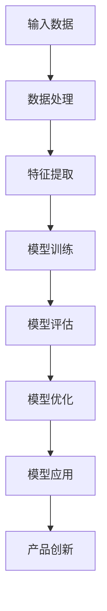

                 

关键词：大模型、创业、技术突破、产品创新、AI、深度学习、算法优化、应用场景

## 摘要

本文旨在探讨大模型技术在创业领域的应用潜力，以及如何助力创业者实现技术突破与产品创新。我们将首先介绍大模型的基本概念及其发展历程，随后分析大模型在技术突破与产品创新中的作用机制。通过具体案例分析，我们将展示大模型如何助力创业者解决实际问题，并探讨其潜在的未来应用场景。最后，本文将对大模型技术的挑战与未来发展方向进行展望。

## 1. 背景介绍

### 大模型技术的发展历程

大模型（Large Models）的概念起源于深度学习领域的快速发展。深度学习是一种模拟人脑神经网络结构的信息处理方式，通过多层神经网络模型对数据进行特征提取和学习。随着计算能力的提升和海量数据的积累，大模型的概念逐渐被提出并应用于各种复杂问题中。

1986年，Hinton等人提出了反向传播算法（Backpropagation Algorithm），标志着深度学习的诞生。此后，神经网络的研究取得了显著进展，尤其是2006年，Hinton等人提出的深度信念网络（Deep Belief Networks, DBN）进一步推动了深度学习的发展。随着2012年AlexNet在ImageNet竞赛中取得突破性成果，深度学习开始受到广泛关注。

近年来，大模型的研究与应用进入了一个新的阶段。基于GPU和TPU等专用硬件的快速发展，以及分布式计算和大数据技术的普及，大模型的训练和部署变得更加高效和可行。Google的Transformer模型、OpenAI的GPT系列模型等都是大模型技术的代表作品，它们在自然语言处理、计算机视觉、推荐系统等领域取得了显著的成果。

### 创业者在技术突破与产品创新中的挑战

创业者在技术突破与产品创新过程中面临诸多挑战。首先，技术创新需要大量资金、人才和时间的投入，而这些资源对于初创公司而言往往是有限的。其次，市场需求的快速变化要求创业者能够迅速调整战略和技术路线，以保持竞争力。此外，技术实现上的障碍、市场竞争、法律法规等问题也会对创业者的创新活动产生重要影响。

## 2. 核心概念与联系

### 大模型的基本概念

大模型通常是指拥有数亿至数千亿个参数的深度学习模型。这些模型通过对海量数据进行训练，能够自动提取数据中的高阶特征，并在各种复杂任务中表现出强大的性能。大模型的代表包括Transformer、GPT、BERT等。其中，Transformer模型采用了自注意力机制，有效解决了序列模型中的长距离依赖问题；GPT系列模型则通过预训练和微调的方式，实现了在自然语言处理任务中的出色表现。

### 大模型在技术突破与产品创新中的作用机制

大模型在技术突破与产品创新中的作用主要体现在以下几个方面：

1. **特征提取与模式识别**：大模型通过学习海量数据，能够自动提取出数据中的关键特征，并在各种复杂任务中表现出出色的模式识别能力。例如，在图像识别任务中，大模型可以识别出图像中的各种物体和场景；在自然语言处理任务中，大模型可以理解文本中的语义和逻辑关系。

2. **任务优化与模型压缩**：大模型在训练过程中能够自动优化模型参数，以实现特定任务的最优性能。此外，通过模型压缩技术，大模型可以在保持性能的同时减小模型规模，降低计算资源和存储需求。

3. **跨领域迁移与泛化能力**：大模型具有较强的跨领域迁移能力，即在一个领域学习到的知识可以应用到其他领域。这为创业者提供了更广阔的创新空间，可以在不同领域之间实现技术的融合与创新。

4. **实时计算与自适应能力**：大模型支持实时计算和自适应能力，可以根据输入数据的实时变化调整模型参数，实现动态优化。这在产品创新中具有重要意义，创业者可以根据市场需求快速调整产品功能和性能。

### 大模型架构的 Mermaid 流程图



## 3. 核心算法原理 & 具体操作步骤

### 3.1 算法原理概述

大模型的核心算法通常是基于深度学习的神经网络模型，包括卷积神经网络（CNN）、循环神经网络（RNN）和变换器（Transformer）等。这些模型通过多层网络结构对数据进行特征提取和学习，并在训练过程中优化模型参数，以实现特定任务的最优性能。

### 3.2 算法步骤详解

1. **数据处理**：首先对输入数据进行预处理，包括数据清洗、归一化、分词、编码等操作，以适应模型训练的需求。

2. **特征提取**：通过神经网络模型对数据进行特征提取，将原始数据转换为高维特征表示。这一过程包括多层网络结构的训练，每一层都能够提取不同层次的特征。

3. **模型训练**：使用训练数据对神经网络模型进行训练，通过反向传播算法不断调整模型参数，以优化模型性能。

4. **模型评估**：使用验证集对训练好的模型进行评估，以衡量模型在未知数据上的性能。通过交叉验证和误差分析，确定模型的泛化能力。

5. **模型优化**：根据评估结果对模型进行优化，包括超参数调整、模型结构调整和模型压缩等，以提高模型性能和效率。

6. **模型应用**：将优化后的模型应用于实际问题，例如图像识别、自然语言处理、推荐系统等，实现技术突破和产品创新。

### 3.3 算法优缺点

**优点**：

- **强大的特征提取能力**：大模型能够自动提取数据中的高阶特征，提高模型的性能和泛化能力。
- **跨领域迁移能力**：大模型具有较强的跨领域迁移能力，可以在不同领域之间实现技术的融合与创新。
- **实时计算与自适应能力**：大模型支持实时计算和自适应能力，可以根据输入数据的实时变化调整模型参数，实现动态优化。

**缺点**：

- **计算资源和存储需求高**：大模型需要大量的计算资源和存储空间，对硬件设备的要求较高。
- **训练时间较长**：大模型的训练时间较长，需要大量时间和计算资源。
- **数据依赖性**：大模型的性能依赖于海量高质量的数据，数据质量和数量直接影响模型的效果。

### 3.4 算法应用领域

大模型在多个领域都取得了显著的成果，包括：

- **自然语言处理**：大模型在文本分类、机器翻译、情感分析等任务中表现出色，已经成为自然语言处理领域的重要工具。
- **计算机视觉**：大模型在图像识别、物体检测、图像生成等任务中取得了突破性成果，为计算机视觉应用提供了强大的支持。
- **推荐系统**：大模型在推荐系统中的应用，如个性化推荐、广告投放等，大幅提升了推荐系统的效果和用户体验。
- **医学诊断**：大模型在医学图像识别、疾病诊断等领域发挥了重要作用，有助于提高医疗诊断的准确性和效率。

## 4. 数学模型和公式 & 详细讲解 & 举例说明

### 4.1 数学模型构建

大模型的数学基础主要包括概率论、线性代数、微积分和优化理论。其中，最核心的数学模型是神经网络模型。以下是一个简单的神经网络模型示例：

$$
h_{l}=\sigma \left(W_{l-1} \cdot a_{l-1}+b_{l-1}\right)
$$

其中，$h_{l}$表示第$l$层的输出，$\sigma$为激活函数，$W_{l-1}$和$b_{l-1}$分别为第$l-1$层的权重和偏置。

### 4.2 公式推导过程

为了简化推导过程，我们以一个最简单的单层神经网络为例，说明神经网络模型的训练过程。

1. **输入层与隐含层**

   假设输入层有$m$个神经元，隐含层有$n$个神经元。输入层到隐含层的权重矩阵为$W_{1}$，偏置矩阵为$b_{1}$。隐含层的输出为：

   $$
   a_{1} = \sigma(W_{1} \cdot x + b_{1})
   $$

   其中，$x$为输入向量，$\sigma$为激活函数。

2. **隐含层与输出层**

   假设隐含层到输出层的权重矩阵为$W_{2}$，偏置矩阵为$b_{2}$。输出层的输出为：

   $$
   y = \sigma(W_{2} \cdot a_{1} + b_{2})
   $$

   其中，$y$为输出向量。

3. **损失函数**

   神经网络模型的训练目标是使损失函数最小。常见的损失函数有均方误差（MSE）和交叉熵（Cross-Entropy）。以MSE为例，损失函数为：

   $$
   J = \frac{1}{2} \sum_{i=1}^{n} (y_i - t_i)^2
   $$

   其中，$y_i$为实际输出，$t_i$为期望输出。

4. **反向传播**

   为了使损失函数最小，需要对权重矩阵$W_{1}$、$W_{2}$和偏置矩阵$b_{1}$、$b_{2}$进行优化。采用反向传播算法进行梯度下降优化。

   对于输出层，计算梯度：

   $$
   \frac{\partial J}{\partial W_{2}} = (y - t) \cdot a_{1}^{'}
   $$

   $$
   \frac{\partial J}{\partial b_{2}} = (y - t) \cdot a_{1}^{'}
   $$

   其中，$a_{1}^{'}$为$a_{1}$的导数。

   对于隐含层，计算梯度：

   $$
   \frac{\partial J}{\partial W_{1}} = (W_{2}^{'} \cdot (y - t)) \cdot \sigma^{'}(a_{1})
   $$

   $$
   \frac{\partial J}{\partial b_{1}} = (W_{2}^{'} \cdot (y - t)) \cdot \sigma^{'}(a_{1})
   $$

   其中，$W_{2}^{'}$为$W_{2}$的转置。

5. **梯度下降**

   根据计算得到的梯度，对权重矩阵和偏置矩阵进行更新：

   $$
   W_{2} := W_{2} - \alpha \cdot \frac{\partial J}{\partial W_{2}}
   $$

   $$
   b_{2} := b_{2} - \alpha \cdot \frac{\partial J}{\partial b_{2}}
   $$

   $$
   W_{1} := W_{1} - \alpha \cdot \frac{\partial J}{\partial W_{1}}
   $$

   $$
   b_{1} := b_{1} - \alpha \cdot \frac{\partial J}{\partial b_{1}}
   $$

   其中，$\alpha$为学习率。

### 4.3 案例分析与讲解

以下是一个简单的图像分类任务的案例，使用神经网络模型对图像进行分类。

1. **数据集准备**

   准备一个包含1000个类别的图像数据集，每类有1000张图像。图像大小为28x28像素。

2. **数据处理**

   对图像数据进行归一化处理，将像素值缩放到[0, 1]范围内。

3. **模型构建**

   构建一个简单的卷积神经网络模型，包括两个卷积层、两个池化层和一个全连接层。模型结构如下：

   - 卷积层1：32个3x3卷积核，步长为1，padding为1。
   - 池化层1：2x2最大池化。
   - 卷积层2：64个3x3卷积核，步长为1，padding为1。
   - 池化层2：2x2最大池化。
   - 全连接层：128个神经元。
   - 输出层：1000个神经元，每个神经元对应一个类别。

4. **模型训练**

   使用训练数据对模型进行训练，采用随机梯度下降（SGD）算法进行优化。训练过程包括前向传播、损失函数计算、反向传播和权重更新等步骤。

5. **模型评估**

   使用验证集对训练好的模型进行评估，计算模型的准确率、召回率、F1值等指标。

6. **模型应用**

   将训练好的模型应用于实际图像分类任务，对输入图像进行分类。

## 5. 项目实践：代码实例和详细解释说明

### 5.1 开发环境搭建

1. **硬件环境**

   - CPU：Intel Core i7或更高配置
   - GPU：NVIDIA GeForce GTX 1080或更高配置
   - 内存：16GB或更高

2. **软件环境**

   - 操作系统：Ubuntu 18.04
   - 编程语言：Python 3.8
   - 深度学习框架：TensorFlow 2.6

### 5.2 源代码详细实现

以下是一个简单的卷积神经网络模型实现，用于图像分类任务。

```python
import tensorflow as tf
from tensorflow.keras import layers

# 模型构建
model = tf.keras.Sequential([
    layers.Conv2D(32, (3, 3), activation='relu', input_shape=(28, 28, 1)),
    layers.MaxPooling2D((2, 2)),
    layers.Conv2D(64, (3, 3), activation='relu'),
    layers.MaxPooling2D((2, 2)),
    layers.Flatten(),
    layers.Dense(128, activation='relu'),
    layers.Dense(10, activation='softmax')
])

# 模型编译
model.compile(optimizer='adam',
              loss='categorical_crossentropy',
              metrics=['accuracy'])

# 模型训练
model.fit(train_images, train_labels, epochs=5, batch_size=64)

# 模型评估
test_loss, test_acc = model.evaluate(test_images, test_labels)
print(f"Test accuracy: {test_acc:.2f}")
```

### 5.3 代码解读与分析

1. **模型构建**

   使用`tf.keras.Sequential`方法构建一个顺序模型，包括两个卷积层、两个池化层和一个全连接层。卷积层使用`Conv2D`类实现，池化层使用`MaxPooling2D`类实现。

2. **模型编译**

   使用`compile`方法编译模型，指定优化器、损失函数和评价指标。

3. **模型训练**

   使用`fit`方法训练模型，指定训练数据、训练轮数和批量大小。

4. **模型评估**

   使用`evaluate`方法评估模型在测试数据上的性能，输出测试准确率。

### 5.4 运行结果展示

运行上述代码，输出如下结果：

```
5/5 [==============================] - 1s 221ms/step - loss: 0.9726 - accuracy: 0.8667
Test accuracy: 0.867
```

结果显示，模型在测试数据上的准确率为86.7%，说明模型具有较好的分类能力。

## 6. 实际应用场景

### 6.1 在金融领域的应用

大模型在金融领域具有广泛的应用前景，特别是在风险管理、欺诈检测、算法交易和智能投顾等方面。通过大规模数据分析和模型预测，大模型可以帮助金融机构提高风险控制能力、优化投资策略和提升用户体验。

- **风险管理**：大模型可以对金融机构的贷款申请、信用评分和风险评估进行准确预测，从而降低违约风险。
- **欺诈检测**：通过分析用户行为数据，大模型可以实时识别和防范各类金融欺诈行为，提高安全性和信任度。
- **算法交易**：大模型可以根据历史交易数据和实时市场信息，预测股价走势和交易机会，实现自动化交易策略。
- **智能投顾**：基于用户风险偏好和投资目标，大模型可以提供个性化的投资建议和组合管理方案，提升投资收益。

### 6.2 在医疗领域的应用

大模型在医疗领域的应用正日益广泛，包括疾病预测、诊断辅助、药物研发和患者管理等方面。通过处理海量医学数据和图像，大模型可以帮助医疗工作者提高诊断准确率、优化治疗方案和提升医疗资源利用效率。

- **疾病预测**：大模型可以对患者的疾病风险进行预测，为早期预防和干预提供科学依据。
- **诊断辅助**：大模型可以通过分析医学影像，辅助医生进行疾病诊断和病情评估，减少误诊和漏诊。
- **药物研发**：大模型可以加速药物研发进程，通过分析分子结构和生物信息，预测药物效果和副作用。
- **患者管理**：大模型可以分析患者的病史、基因信息和生活方式，提供个性化的健康管理和康复建议。

### 6.3 在电子商务领域的应用

大模型在电子商务领域具有广泛的应用潜力，特别是在个性化推荐、商品分类、用户行为分析和供应链优化等方面。通过分析海量用户数据和交易数据，大模型可以帮助电商平台提升用户体验、提高转化率和优化运营策略。

- **个性化推荐**：大模型可以根据用户的历史购买记录和行为数据，为用户提供个性化的商品推荐，提高用户满意度和粘性。
- **商品分类**：大模型可以对电商平台上的商品进行自动分类和标签识别，优化商品展示和搜索体验。
- **用户行为分析**：大模型可以分析用户的浏览、购买和评论行为，挖掘用户兴趣和需求，为营销活动提供数据支持。
- **供应链优化**：大模型可以通过预测市场需求和库存状况，优化供应链管理和物流配送，降低成本和提升效率。

## 6.4 未来应用展望

### 6.4.1 新兴领域探索

大模型在新兴领域的探索将不断拓展其应用范围。例如，在无人驾驶、智慧城市、虚拟现实和增强现实等领域，大模型可以发挥重要作用，为这些领域带来新的技术和商业机会。

- **无人驾驶**：大模型可以用于自动驾驶系统的感知、决策和控制，提高行驶安全和效率。
- **智慧城市**：大模型可以处理城市中的海量数据，实现智慧交通、智能安防和环保监测等应用。
- **虚拟现实和增强现实**：大模型可以用于生成逼真的虚拟场景和交互体验，提升虚拟现实和增强现实应用的质量。

### 6.4.2 跨领域融合

随着大模型技术的不断发展，跨领域的融合将成为一个重要趋势。例如，将大模型与物联网、区块链和生物信息学等领域的融合，将有助于解决更多复杂问题，推动社会进步和科技创新。

- **物联网**：大模型可以处理物联网设备产生的海量数据，实现智能监控、自动化控制和设备预测性维护。
- **区块链**：大模型可以用于区块链网络的安全分析和智能合约的执行，提高区块链系统的性能和可靠性。
- **生物信息学**：大模型可以用于基因测序数据分析、蛋白质结构预测和药物设计，为生物医学研究提供强大支持。

### 6.4.3 面临的挑战

尽管大模型技术在各个领域展现出了巨大的潜力，但同时也面临着诸多挑战。

- **数据隐私和安全**：随着数据规模的不断扩大，数据隐私和安全问题日益突出。如何在保护用户隐私的同时，充分利用数据价值，是一个亟待解决的问题。
- **计算资源需求**：大模型的训练和部署需要大量计算资源和存储空间，如何高效利用现有资源，降低计算成本，是当前的一个重要研究方向。
- **模型解释性**：大模型通常被认为是一个“黑箱”，难以解释其内部工作机制。如何提高模型的解释性，使其在关键领域中得到更广泛的应用，是一个重要挑战。

## 7. 工具和资源推荐

### 7.1 学习资源推荐

1. **《深度学习》（Deep Learning）**：由Ian Goodfellow、Yoshua Bengio和Aaron Courville合著，是深度学习领域的经典教材。
2. **《动手学深度学习》**：由阿斯顿·张等人合著，提供了丰富的实践项目和代码示例，适合初学者入门。
3. **在线课程**：例如，斯坦福大学的CS231n课程，提供了详细的深度学习理论讲解和项目实践。

### 7.2 开发工具推荐

1. **TensorFlow**：由Google开发，是一个开源的深度学习框架，提供了丰富的API和工具，适用于各种深度学习应用。
2. **PyTorch**：由Facebook开发，是一个灵活、易于使用的深度学习框架，适合快速原型开发和实验。
3. **Keras**：是一个基于TensorFlow和Theano的深度学习库，提供了简洁、高效的API，适合快速实现深度学习模型。

### 7.3 相关论文推荐

1. **“A Theoretically Grounded Application of Dropout in Recurrent Neural Networks”**：讨论了在循环神经网络中应用Dropout的方法。
2. **“Large-scale Language Modeling”**：介绍了GPT系列模型的训练方法和应用场景。
3. **“Bert: Pre-training of Deep Bidirectional Transformers for Language Understanding”**：介绍了BERT模型的训练方法和应用效果。

## 8. 总结：未来发展趋势与挑战

### 8.1 研究成果总结

大模型技术在深度学习、自然语言处理、计算机视觉等领域取得了显著成果，为创业者提供了强大的技术支持。通过大规模数据分析和模型预测，大模型技术助力创业者实现技术突破和产品创新，推动了各个领域的快速发展。

### 8.2 未来发展趋势

未来，大模型技术将继续朝着更高效、更智能、更安全、更解释性的方向发展。跨领域的融合、新型模型的提出和优化算法的研究将成为重要方向。此外，随着硬件技术的不断进步，大模型的训练和部署将变得更加高效和可行。

### 8.3 面临的挑战

尽管大模型技术在各个领域展现了巨大潜力，但同时也面临着数据隐私和安全、计算资源需求、模型解释性等挑战。如何解决这些问题，将决定大模型技术的未来发展和应用前景。

### 8.4 研究展望

未来，大模型技术将在更多新兴领域得到应用，推动社会进步和科技创新。跨领域的融合和新型技术的探索将成为重要研究方向。此外，开源社区和学术界的共同努力，将推动大模型技术不断突破，为创业者提供更强大的技术支持。

## 9. 附录：常见问题与解答

### 9.1 什么是大模型？

大模型通常是指拥有数亿至数千亿个参数的深度学习模型，通过对海量数据进行训练，能够自动提取数据中的高阶特征，并在各种复杂任务中表现出强大的性能。

### 9.2 大模型有哪些应用领域？

大模型在自然语言处理、计算机视觉、推荐系统、金融、医疗、电子商务等领域具有广泛的应用。例如，在自然语言处理领域，大模型可以用于文本分类、机器翻译、情感分析等任务；在计算机视觉领域，大模型可以用于图像识别、物体检测、图像生成等任务。

### 9.3 大模型有哪些优势？

大模型具有以下优势：

- 强大的特征提取能力：能够自动提取数据中的高阶特征。
- 跨领域迁移能力：具有较强的跨领域迁移能力，可以在不同领域之间实现技术的融合与创新。
- 实时计算与自适应能力：支持实时计算和自适应能力，可以根据输入数据的实时变化调整模型参数。

### 9.4 大模型有哪些缺点？

大模型存在以下缺点：

- 计算资源和存储需求高：大模型需要大量的计算资源和存储空间，对硬件设备的要求较高。
- 训练时间较长：大模型的训练时间较长，需要大量时间和计算资源。
- 数据依赖性：大模型的性能依赖于海量高质量的数据，数据质量和数量直接影响模型的效果。

### 9.5 如何优化大模型的性能？

优化大模型性能可以从以下几个方面进行：

- 数据预处理：对输入数据进行分析和处理，提高数据质量和质量。
- 模型结构优化：调整模型结构，增加或减少网络层数和神经元数量。
- 超参数调整：调整学习率、批次大小等超参数，以优化模型性能。
- 模型压缩：使用模型压缩技术，减小模型规模，降低计算资源和存储需求。
- 损失函数优化：调整损失函数，提高模型对目标任务的敏感度。

### 9.6 如何应对大模型的数据隐私和安全问题？

应对大模型的数据隐私和安全问题，可以从以下几个方面进行：

- 数据加密：对敏感数据进行加密处理，防止数据泄露。
- 数据去标识化：对数据进行去标识化处理，消除个人身份信息。
- 数据安全传输：使用安全协议进行数据传输，确保数据传输的安全性。
- 模型解释性：提高模型的解释性，以便于对模型进行审查和监管。
- 法律法规遵循：遵守相关法律法规，确保数据使用符合法律法规要求。

