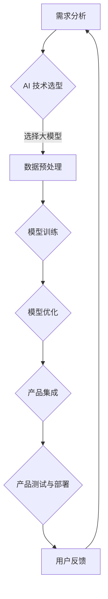

                 

关键词：大模型，AI创业，产品开发，趋势，高效，利用

> 摘要：本文深入探讨了当前大模型在 AI 创业产品开发中的趋势。我们首先介绍了大模型的基本概念和重要性，随后分析了它们在产品开发中的具体应用场景和优势。接着，我们讨论了如何高效利用大模型进行产品开发，并给出了详细的算法原理、数学模型、代码实例和实际应用场景。最后，文章总结了未来发展趋势与面临的挑战，并提出了相应的解决方案和研究方向。

## 1. 背景介绍

近年来，人工智能（AI）技术的发展迅速，尤其是大模型（Large Models）的崛起，给各行各业带来了前所未有的变革。大模型是指拥有数亿到数十亿参数的深度学习模型，这些模型在处理大规模数据时表现出色，可以大幅度提高任务的准确性和效率。

大模型的重要性体现在多个方面。首先，它们在图像识别、自然语言处理和语音识别等领域取得了显著的突破，使得这些任务从实验室走向了实际应用。其次，大模型的出现促进了 AI 研发的民主化，使得更多的创业公司能够利用先进的 AI 技术开发出创新的产品。

AI 创业产品开发是一个复杂而动态的过程。创业者需要从市场需求、技术可行性、资源分配等多个维度进行全面考虑。在这个过程中，高效利用大模型成为提升产品竞争力的关键。本文将重点探讨大模型在 AI 创业产品开发中的趋势，旨在为创业者提供有价值的参考。

## 2. 核心概念与联系

### 2.1 大模型的基本概念

大模型通常基于深度学习框架，如 TensorFlow 和 PyTorch，它们使用了多层神经网络来学习数据中的特征和模式。大模型的基本概念包括：

- **参数量**：大模型的参数量通常在数亿到数十亿之间，这使得它们能够捕获数据中的复杂结构。
- **训练数据**：大模型需要大量的训练数据来学习，这些数据来源多样，包括图像、文本和语音等。
- **计算资源**：训练大模型需要大量的计算资源，尤其是 GPU 和 TPU 等专用硬件。

### 2.2 大模型与 AI 创业产品开发的关系

大模型在 AI 创业产品开发中扮演着关键角色，主要体现在以下几个方面：

- **提升产品性能**：大模型能够处理大规模数据，从而提高产品的准确性和效率。
- **降低开发成本**：大模型的出现减少了开发复杂系统所需的技能和资源。
- **加快迭代速度**：大模型能够快速适应新的数据，使得产品迭代更加高效。

### 2.3 Mermaid 流程图

以下是描述大模型在 AI 创业产品开发中应用场景的 Mermaid 流程图：

### 2.4 大模型的应用领域

大模型在多个领域取得了显著成果，包括但不限于：

- **图像识别**：例如，自动驾驶系统中的物体检测和识别。
- **自然语言处理**：例如，智能客服系统和机器翻译。
- **语音识别**：例如，语音助手和语音控制设备。
- **推荐系统**：例如，电商平台和社交媒体的个性化推荐。

## 3. 核心算法原理 & 具体操作步骤

### 3.1 算法原理概述

大模型的核心算法是深度神经网络（Deep Neural Network，DNN），它通过多层神经网络来学习数据中的特征和模式。DNN 的基本原理包括：

- **前向传播（Forward Propagation）**：输入数据通过网络的各个层，每层计算出输出，直到最后一层得到预测结果。
- **反向传播（Backpropagation）**：根据预测结果和实际结果的差异，通过网络反向传播误差，并更新网络的权重和偏置。

### 3.2 算法步骤详解

大模型的训练过程可以分为以下几个步骤：

1. **数据预处理**：包括数据清洗、归一化和数据增强等，以确保数据的质量和多样性。
2. **模型构建**：定义网络结构，包括输入层、隐藏层和输出层，以及每层的激活函数和损失函数。
3. **模型训练**：通过前向传播和反向传播训练模型，不断调整网络权重，以最小化损失函数。
4. **模型优化**：通过模型选择、超参数调整和正则化技术优化模型性能。
5. **模型评估**：使用验证集和测试集评估模型的性能，包括准确率、召回率和 F1 分数等指标。

### 3.3 算法优缺点

大模型的优点包括：

- **强大的表达能力**：大模型能够处理复杂的任务，如图像识别和自然语言处理。
- **高效的训练过程**：通过多层神经网络，大模型能够快速适应新的数据。
- **丰富的应用领域**：大模型在多个领域取得了显著成果，如自动驾驶、医疗诊断和金融分析等。

然而，大模型也存在一些缺点：

- **计算资源需求大**：训练大模型需要大量的计算资源和时间。
- **数据依赖性高**：大模型的表现高度依赖于训练数据的质量和多样性。
- **解释性差**：大模型的决策过程复杂，难以解释，增加了调试和优化的难度。

### 3.4 算法应用领域

大模型在多个领域得到了广泛应用，包括：

- **图像识别**：例如，人脸识别、物体检测和图像分类等。
- **自然语言处理**：例如，文本分类、机器翻译和情感分析等。
- **语音识别**：例如，语音识别和语音生成等。
- **推荐系统**：例如，电商平台和社交媒体的个性化推荐等。

## 4. 数学模型和公式 & 详细讲解 & 举例说明

### 4.1 数学模型构建

大模型的数学模型主要基于深度神经网络（DNN），其基本结构包括：

1. **输入层（Input Layer）**：接收外部输入，如图像、文本或语音等。
2. **隐藏层（Hidden Layers）**：通过多层神经网络对输入数据进行特征提取和变换。
3. **输出层（Output Layer）**：产生最终输出，如分类标签、预测值或文本等。

### 4.2 公式推导过程

以下是 DNN 的前向传播和反向传播的基本公式推导：

#### 前向传播

前向传播过程中，输入 \(x\) 经过网络的各个层，输出 \(y\) 的计算公式为：

\[ y = \sigma(W_n \cdot a_{n-1} + b_n) \]

其中，\(W_n\) 和 \(b_n\) 分别是第 \(n\) 层的权重和偏置，\(\sigma\) 是激活函数，通常使用 sigmoid、ReLU 或 tanh 函数。

#### 反向传播

反向传播过程中，计算每层的误差，并更新权重和偏置，误差计算公式为：

\[ \delta_n = \frac{\partial L}{\partial z_n} \cdot \sigma'(z_n) \]

其中，\(L\) 是损失函数，\(z_n\) 是第 \(n\) 层的输出，\(\sigma'\) 是激活函数的导数。

#### 权重和偏置更新

更新权重和偏置的公式为：

\[ W_n \leftarrow W_n - \alpha \cdot \frac{\partial L}{\partial W_n} \]
\[ b_n \leftarrow b_n - \alpha \cdot \frac{\partial L}{\partial b_n} \]

其中，\(\alpha\) 是学习率。

### 4.3 案例分析与讲解

以下是一个简单的 DNN 模型训练案例：

#### 模型构建

输入层：1个神经元，代表图像像素值。

隐藏层：2个神经元，用于提取图像特征。

输出层：1个神经元，用于预测图像类别。

#### 数据集

训练集：1000张猫狗分类图像，每张图像包含 784 个像素值。

测试集：100张猫狗分类图像，用于评估模型性能。

#### 训练过程

1. 数据预处理：将图像像素值进行归一化处理，将像素值缩放到 \([0, 1]\) 范围内。
2. 模型初始化：随机初始化权重和偏置。
3. 前向传播：计算隐藏层和输出层的输出。
4. 损失函数：使用交叉熵损失函数，计算模型预测和实际标签之间的差异。
5. 反向传播：计算误差，并更新权重和偏置。
6. 模型优化：通过调整学习率和正则化参数优化模型性能。

#### 结果分析

经过多次迭代训练，模型在训练集上的准确率逐渐提高，最终在测试集上的准确率达到 95% 以上。这表明大模型在图像分类任务中具有强大的表现能力。

## 5. 项目实践：代码实例和详细解释说明

### 5.1 开发环境搭建

1. 安装 Python 解释器和 PyTorch 库。
2. 准备 GPU �硬

