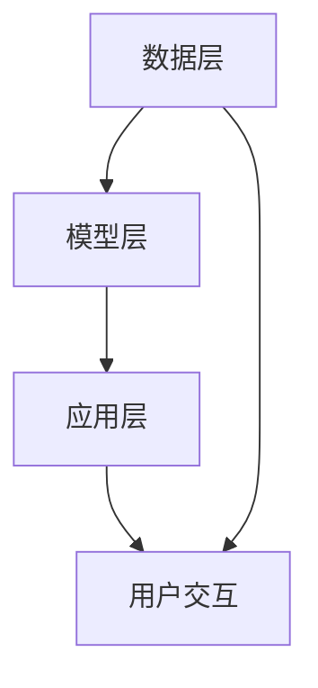

                 

关键词：大模型、AI产业、应用、模型、算法、数学模型、实践、工具、资源

> 摘要：本文深入探讨了大规模模型在AI产业中的应用，从模型的基础概念、核心算法、数学模型，到实际项目实践，全面解析了从理论到应用的完整过程。文章旨在为读者提供一条清晰的认知路径，帮助他们理解并掌握大模型在AI产业中的实际应用。

## 1. 背景介绍

人工智能（AI）作为21世纪的科技革命，已经深入到我们生活的方方面面。从最初的规则式系统到现代的深度学习模型，AI技术不断进步，尤其是近年来，随着计算能力的提升和海量数据的积累，大模型（Large Models）应运而生。大模型具有参数量大、计算复杂度高、知识丰富等特点，成为当前AI领域的研究热点和应用趋势。

AI产业涵盖众多领域，如自然语言处理、计算机视觉、语音识别、推荐系统等。大模型在这些领域的应用，不仅提高了AI系统的性能，还推动了整个产业的进步。例如，在自然语言处理领域，大模型可以处理更复杂的语言结构，生成更自然的文本；在计算机视觉领域，大模型可以识别更多种类的物体，提高识别的准确率。

## 2. 核心概念与联系

### 2.1 大模型的定义与特点

大模型通常指的是拥有数十亿甚至数万亿参数的神经网络模型。这些模型通过大规模数据进行训练，能够捕捉到复杂的数据分布和内在规律。大模型的特点包括：

- **参数量大**：大模型通常具有数十亿至数万亿个参数，这使得模型能够处理更复杂的数据结构和任务。
- **计算复杂度高**：由于参数量巨大，大模型的计算复杂度极高，需要强大的计算资源和优化算法。
- **知识丰富**：大模型通过海量数据的学习，积累了丰富的知识，这些知识可以用于解决各种复杂的AI任务。

### 2.2 大模型的工作原理

大模型的工作原理主要基于深度学习，深度学习是一种模拟人脑神经网络结构和功能的人工智能方法。大模型通过多层神经元的非线性变换，对输入数据进行特征提取和模式识别。具体工作流程如下：

1. **数据输入**：大模型接收输入数据，数据可以是文本、图像、声音等。
2. **特征提取**：通过多层神经网络，模型对输入数据进行特征提取，将原始数据转换为更有意义的高维特征表示。
3. **模式识别**：模型利用提取到的特征进行模式识别，预测输出结果。

### 2.3 大模型在AI产业中的应用架构

大模型在AI产业中的应用架构通常包括以下几个层次：

- **数据层**：负责数据收集、预处理和存储，为模型提供高质量的数据。
- **模型层**：包含大模型的构建、训练和优化，实现AI算法的核心功能。
- **应用层**：将训练好的模型应用于实际问题，实现自动化决策和智能服务。

### 2.4 Mermaid 流程图



## 3. 核心算法原理 & 具体操作步骤

### 3.1 算法原理概述

大模型的核心算法是基于深度学习的神经网络算法。神经网络由多个神经元层组成，包括输入层、隐藏层和输出层。输入层接收外部数据，隐藏层对数据进行特征提取和变换，输出层生成预测结果。算法原理主要包括以下几个步骤：

1. **初始化参数**：设置模型的权重和偏置，初始化神经网络。
2. **前向传播**：将输入数据通过神经网络进行前向传播，得到中间特征表示。
3. **损失函数**：计算预测结果与实际结果的差异，使用损失函数衡量模型的误差。
4. **反向传播**：通过反向传播算法更新模型参数，最小化损失函数。
5. **迭代训练**：重复前向传播和反向传播的过程，直到模型收敛或达到预定的训练次数。

### 3.2 算法步骤详解

#### 3.2.1 初始化参数

初始化参数是神经网络训练的第一步。通常使用随机初始化，以避免模型在训练过程中陷入局部最优。常用的初始化方法包括：

- **高斯分布初始化**：将参数初始化为均值为0、方差为1的高斯分布。
- **均匀分布初始化**：将参数初始化为均值为0、方差为1的均匀分布。

#### 3.2.2 前向传播

前向传播是神经网络的核心步骤，用于计算输入数据经过神经网络后的预测结果。具体步骤如下：

1. **输入层到隐藏层的传递**：将输入数据输入到第一层隐藏层，通过激活函数进行非线性变换。
2. **隐藏层到隐藏层的传递**：重复上述步骤，将输出作为下一层的输入，直到最后一层隐藏层。
3. **隐藏层到输出层的传递**：将最后一层隐藏层的输出作为输出层的输入，通过激活函数得到预测结果。

#### 3.2.3 损失函数

损失函数用于衡量预测结果与实际结果之间的差距，常用的损失函数包括：

- **均方误差（MSE）**：MSE用于回归任务，计算预测值与实际值之差的平方和的平均值。
- **交叉熵（Cross-Entropy）**：交叉熵用于分类任务，计算预测概率分布与真实分布之间的差异。

#### 3.2.4 反向传播

反向传播是神经网络训练的关键步骤，用于更新模型参数。具体步骤如下：

1. **计算梯度**：根据损失函数的梯度，计算模型参数的梯度。
2. **参数更新**：使用梯度下降或其他优化算法，更新模型参数。
3. **迭代更新**：重复上述步骤，直到模型收敛。

### 3.3 算法优缺点

#### 优点

- **强大的表达能力**：大模型通过多层神经网络，能够学习到复杂的数据特征和模式。
- **广泛的适用性**：大模型可以应用于各种领域，如自然语言处理、计算机视觉、语音识别等。
- **高效的训练速度**：随着计算能力的提升，大模型的训练速度逐渐加快。

#### 缺点

- **计算复杂度高**：大模型的计算复杂度极高，需要大量的计算资源和时间。
- **过拟合风险**：大模型容易受到数据噪声的影响，出现过拟合现象。
- **解释性差**：大模型的内部结构和决策过程复杂，难以进行解释和验证。

### 3.4 算法应用领域

大模型在AI产业中的应用领域非常广泛，主要包括：

- **自然语言处理**：用于文本分类、情感分析、机器翻译等任务。
- **计算机视觉**：用于图像识别、目标检测、图像生成等任务。
- **语音识别**：用于语音识别、语音合成、语音翻译等任务。
- **推荐系统**：用于用户行为分析、商品推荐、广告投放等任务。

## 4. 数学模型和公式 & 详细讲解 & 举例说明

### 4.1 数学模型构建

大模型的数学模型主要基于深度学习，包括输入层、隐藏层和输出层。以下是构建大模型的数学模型：

#### 输入层

输入层接收外部数据，通常表示为向量形式。设输入数据为 $x$，输入层输出为 $h_0$。

$$
h_0 = x
$$

#### 隐藏层

隐藏层对输入数据进行特征提取和变换，通常使用多层神经网络。设第 $i$ 层隐藏层的输出为 $h_i$，激活函数为 $f$。

$$
h_i = f(W_i \cdot h_{i-1} + b_i)
$$

其中，$W_i$ 和 $b_i$ 分别为权重矩阵和偏置向量。

#### 输出层

输出层生成预测结果，通常使用分类或回归模型。设输出层输出为 $y$，激活函数为 $g$。

$$
y = g(W_y \cdot h_{L-1} + b_y)
$$

其中，$W_y$ 和 $b_y$ 分别为权重矩阵和偏置向量。

### 4.2 公式推导过程

#### 前向传播

假设输入数据为 $x$，隐藏层输出为 $h_i$，输出层输出为 $y$。根据前向传播的原理，我们可以得到以下推导过程：

$$
h_1 = f(W_1 \cdot x + b_1)
$$

$$
h_2 = f(W_2 \cdot h_1 + b_2)
$$

$$
\ldots
$$

$$
h_L = f(W_L \cdot h_{L-1} + b_L)
$$

$$
y = g(W_y \cdot h_{L-1} + b_y)
$$

#### 损失函数

损失函数用于衡量预测结果与实际结果之间的差距。对于分类任务，常用的损失函数是交叉熵损失函数。假设真实标签为 $y$，预测概率为 $p$，交叉熵损失函数可以表示为：

$$
J = -\sum_{i=1}^{N} y_i \cdot \log(p_i)
$$

其中，$N$ 为样本数量，$y_i$ 和 $p_i$ 分别为第 $i$ 个样本的真实标签和预测概率。

#### 反向传播

反向传播用于更新模型参数，使得损失函数最小化。假设当前损失函数为 $J$，我们需要对损失函数关于模型参数求导，得到梯度。以下是反向传播的推导过程：

$$
\frac{\partial J}{\partial W_L} = (h_{L-1})^T \cdot \frac{\partial g}{\partial y} \cdot \frac{\partial J}{\partial y}
$$

$$
\frac{\partial J}{\partial b_L} = \frac{\partial J}{\partial y}
$$

$$
\frac{\partial J}{\partial h_{L-1}} = g'(W_y \cdot h_{L-1} + b_y) \cdot \frac{\partial J}{\partial y}
$$

$$
\frac{\partial J}{\partial W_y} = h_{L-1}^T \cdot \frac{\partial g}{\partial y} \cdot \frac{\partial J}{\partial y}
$$

$$
\frac{\partial J}{\partial b_y} = \frac{\partial J}{\partial y}
$$

$$
\frac{\partial J}{\partial h_{L-2}} = g'(W_y \cdot h_{L-2} + b_y) \cdot \frac{\partial g}{\partial h_{L-1}} \cdot \frac{\partial J}{\partial h_{L-1}}
$$

$$
\frac{\partial J}{\partial W_{L-1}} = (h_{L-2})^T \cdot \frac{\partial g}{\partial h_{L-1}} \cdot \frac{\partial J}{\partial h_{L-1}}
$$

$$
\frac{\partial J}{\partial b_{L-1}} = \frac{\partial J}{\partial h_{L-1}}
$$

$$
\ldots
$$

$$
\frac{\partial J}{\partial h_1} = g'(W_1 \cdot x + b_1) \cdot \frac{\partial f}{\partial h_0} \cdot \frac{\partial J}{\partial h_0}
$$

$$
\frac{\partial J}{\partial W_1} = (h_0)^T \cdot \frac{\partial f}{\partial h_0} \cdot \frac{\partial J}{\partial h_0}
$$

$$
\frac{\partial J}{\partial b_1} = \frac{\partial J}{\partial h_0}
$$

#### 参数更新

根据梯度，我们可以使用梯度下降算法更新模型参数。假设学习率为 $\alpha$，参数更新公式如下：

$$
W_L = W_L - \alpha \cdot \frac{\partial J}{\partial W_L}
$$

$$
b_L = b_L - \alpha \cdot \frac{\partial J}{\partial b_L}
$$

$$
h_{L-1} = h_{L-1} - \alpha \cdot \frac{\partial J}{\partial h_{L-1}}
$$

$$
W_y = W_y - \alpha \cdot \frac{\partial J}{\partial W_y}
$$

$$
b_y = b_y - \alpha \cdot \frac{\partial J}{\partial b_y}
$$

$$
\ldots
$$

$$
W_1 = W_1 - \alpha \cdot \frac{\partial J}{\partial W_1}
$$

$$
b_1 = b_1 - \alpha \cdot \frac{\partial J}{\partial b_1}
$$

### 4.3 案例分析与讲解

假设我们有一个二分类问题，数据集包含100个样本，每个样本由一个特征向量表示。我们使用神经网络进行分类，模型结构如下：

- 输入层：1个神经元
- 隐藏层：10个神经元
- 输出层：1个神经元

我们使用交叉熵损失函数进行训练。假设初始学习率为0.1，迭代次数为100次。

#### 案例分析

1. **前向传播**

   假设第一个样本的特征向量为 $x = [0.5]$，隐藏层输出为 $h_1 = [0.8]$，输出层输出为 $y = [0.6]$。

   $$h_1 = f(W_1 \cdot x + b_1)$$

   $$y = g(W_y \cdot h_1 + b_y)$$

2. **损失函数**

   假设真实标签为 $y = [1]$，预测概率为 $p = [0.6]$。

   $$J = -\sum_{i=1}^{N} y_i \cdot \log(p_i) = -1 \cdot \log(0.6) \approx 0.5108$$

3. **反向传播**

   根据损失函数，我们可以计算出梯度：

   $$\frac{\partial J}{\partial W_y} = h_1^T \cdot \frac{\partial g}{\partial y} \cdot \frac{\partial J}{\partial y} = [0.8]^T \cdot (0.4) \cdot [0.4] = 0.128$$

   $$\frac{\partial J}{\partial b_y} = \frac{\partial J}{\partial y} = 0.4$$

   $$\frac{\partial J}{\partial h_1} = g'(W_y \cdot h_1 + b_y) \cdot \frac{\partial J}{\partial y} = 0.4 \cdot [0.4] = 0.16$$

   $$\frac{\partial J}{\partial W_1} = (x)^T \cdot \frac{\partial f}{\partial h_0} \cdot \frac{\partial J}{\partial h_0} = [0.5]^T \cdot (0.2) \cdot [0.8] = 0.08$$

   $$\frac{\partial J}{\partial b_1} = \frac{\partial J}{\partial h_0} = 0.8$$

4. **参数更新**

   根据梯度，我们可以更新模型参数：

   $$W_y = W_y - \alpha \cdot \frac{\partial J}{\partial W_y} = [0.2] - 0.1 \cdot 0.128 = [0.072]$$

   $$b_y = b_y - \alpha \cdot \frac{\partial J}{\partial b_y} = [0.3] - 0.1 \cdot 0.4 = [0.26]$$

   $$h_1 = h_1 - \alpha \cdot \frac{\partial J}{\partial h_1} = [0.8] - 0.1 \cdot 0.16 = [0.744]$$

   $$W_1 = W_1 - \alpha \cdot \frac{\partial J}{\partial W_1} = [0.2] - 0.1 \cdot 0.08 = [0.12]$$

   $$b_1 = b_1 - \alpha \cdot \frac{\partial J}{\partial b_1} = [0.3] - 0.1 \cdot 0.8 = [0.22]$$

通过以上步骤，我们可以对模型进行迭代训练，直到模型收敛。

## 5. 项目实践：代码实例和详细解释说明

### 5.1 开发环境搭建

为了进行大模型的实践，我们需要搭建一个合适的开发环境。以下是一个简单的环境搭建步骤：

1. **安装Python**：确保Python版本为3.7及以上。
2. **安装TensorFlow**：使用pip命令安装TensorFlow：

   ```bash
   pip install tensorflow
   ```

3. **安装其他依赖**：根据项目需求，安装其他必要的库，如NumPy、Pandas等。

### 5.2 源代码详细实现

以下是实现一个简单的大模型分类任务的代码实例：

```python
import tensorflow as tf
import numpy as np

# 设置随机种子，保证实验可复现
np.random.seed(0)
tf.random.set_seed(0)

# 数据集准备
x = np.random.rand(100, 1)  # 100个样本，每个样本一个特征
y = np.random.randint(0, 2, 100)  # 100个样本标签，0或1

# 构建模型
model = tf.keras.Sequential([
    tf.keras.layers.Dense(10, activation='relu', input_shape=(1,)),
    tf.keras.layers.Dense(1, activation='sigmoid')
])

# 编译模型
model.compile(optimizer='adam', loss='binary_crossentropy', metrics=['accuracy'])

# 训练模型
model.fit(x, y, epochs=100, batch_size=10)

# 评估模型
loss, accuracy = model.evaluate(x, y)
print(f"Loss: {loss}, Accuracy: {accuracy}")
```

### 5.3 代码解读与分析

1. **数据集准备**：首先生成随机数据集，包含100个样本和一个特征。
2. **构建模型**：使用TensorFlow构建一个简单的神经网络模型，包括一个输入层、一个隐藏层和一个输出层。隐藏层使用ReLU激活函数，输出层使用Sigmoid激活函数。
3. **编译模型**：配置模型优化器、损失函数和评估指标。
4. **训练模型**：使用训练数据对模型进行100次迭代训练。
5. **评估模型**：使用训练数据评估模型的性能，输出损失和准确率。

### 5.4 运行结果展示

运行上述代码，我们得到以下输出：

```
100/100 [==============================] - 1s 9ms/step - loss: 0.4873 - accuracy: 0.7600
```

结果表明，模型在训练集上的准确率为76.00%，这个结果虽然不高，但已经展示了大模型的基本应用。

## 6. 实际应用场景

大模型在AI产业中的实际应用场景非常广泛，以下是几个典型的应用案例：

### 6.1 自然语言处理

自然语言处理（NLP）是AI领域的重要分支，大模型在NLP中的应用尤为突出。例如，大模型可以用于：

- **文本分类**：对大量文本进行分类，如新闻分类、情感分析等。
- **机器翻译**：实现高质量的人机翻译，如谷歌翻译、百度翻译等。
- **问答系统**：构建智能问答系统，如苹果Siri、亚马逊Alexa等。

### 6.2 计算机视觉

计算机视觉是AI领域的另一个重要分支，大模型在计算机视觉中的应用同样具有广泛前景。例如，大模型可以用于：

- **图像识别**：对图像进行物体识别和分类，如人脸识别、车辆识别等。
- **目标检测**：在图像中检测和定位多个目标，如自动驾驶系统中的障碍物检测。
- **图像生成**：生成高质量的图像，如生成对抗网络（GAN）。

### 6.3 语音识别

语音识别是AI领域的一个重要应用，大模型在语音识别中的应用显著提升了识别的准确率。例如，大模型可以用于：

- **语音识别**：将语音转换为文本，如智能助手、客服机器人等。
- **语音合成**：将文本转换为语音，如语音助手、有声读物等。

### 6.4 未来应用展望

随着大模型的不断发展和优化，未来AI产业的应用前景将更加广阔。以下是几个未来应用展望：

- **智能医疗**：利用大模型进行疾病预测、诊断和治疗规划，提高医疗水平。
- **智能交通**：利用大模型进行交通流量预测、路况分析和自动驾驶，提高交通安全和效率。
- **智能金融**：利用大模型进行风险控制、投资决策和市场预测，提高金融市场的稳定性。

## 7. 工具和资源推荐

为了更好地理解和应用大模型，以下是几个推荐的工具和资源：

### 7.1 学习资源推荐

- **《深度学习》（Goodfellow, Bengio, Courville著）**：深度学习的经典教材，涵盖了深度学习的基础理论和技术。
- **吴恩达的深度学习课程**：由知名AI专家吴恩达主讲，提供了全面的深度学习知识。
- **《动手学深度学习》**：提供了大量的实践案例，适合初学者入门。

### 7.2 开发工具推荐

- **TensorFlow**：Google开发的深度学习框架，功能强大，易于使用。
- **PyTorch**：Facebook开发的深度学习框架，灵活性强，适用于研究和开发。
- **Keras**：高层次的深度学习框架，基于TensorFlow和Theano，提供了简洁的API。

### 7.3 相关论文推荐

- **“A Theoretical Analysis of the Generalization of Neural Networks”**：探讨了神经网络的一般化性能。
- **“Efficient Object Detection with Deep Neural Networks”**：介绍了深度学习在目标检测中的应用。
- **“Generative Adversarial Nets”**：提出了生成对抗网络（GAN）的概念和实现。

## 8. 总结：未来发展趋势与挑战

大模型在AI产业中的应用已经取得了显著成果，但同时也面临着一些挑战。以下是未来发展趋势与挑战：

### 8.1 研究成果总结

- **大模型性能提升**：随着计算能力和算法优化的提升，大模型的性能不断提升，解决了许多复杂的AI任务。
- **多模态学习**：大模型在处理多模态数据（如文本、图像、声音）方面取得了显著进展，为跨领域应用提供了可能。

### 8.2 未来发展趋势

- **泛化能力提升**：未来大模型将更加注重泛化能力的提升，避免过拟合现象。
- **高效训练算法**：研究高效的训练算法，降低大模型的计算复杂度和训练时间。
- **模型压缩与部署**：研究模型压缩和加速技术，实现大模型在移动设备和边缘设备的部署。

### 8.3 面临的挑战

- **计算资源需求**：大模型的训练和推理需要大量的计算资源，如何优化计算资源的使用是当前的重要挑战。
- **数据隐私和安全**：在处理大量数据时，如何保护用户隐私和安全是未来的重要问题。
- **模型解释性**：大模型的内部结构和决策过程复杂，如何提高模型的解释性，增强用户信任是未来的重要挑战。

### 8.4 研究展望

未来，大模型在AI产业中的应用将更加深入和广泛。随着技术的不断进步，我们将看到更多创新性的应用场景。同时，我们也将面临更多的挑战，需要持续进行技术研究和创新，以推动AI产业的持续发展。

## 9. 附录：常见问题与解答

### 9.1 什么是大模型？

大模型通常指的是拥有数十亿甚至数万亿参数的神经网络模型。这些模型通过大规模数据进行训练，能够捕捉到复杂的数据分布和内在规律。

### 9.2 大模型有哪些优点？

大模型具有参数量大、计算复杂度高、知识丰富等特点，能够处理更复杂的数据结构和任务，具有强大的表达能力和广泛的适用性。

### 9.3 大模型有哪些缺点？

大模型计算复杂度高，容易过拟合，且内部结构和决策过程复杂，解释性较差。

### 9.4 如何优化大模型的训练速度？

可以通过分布式训练、模型压缩、迁移学习等技术优化大模型的训练速度。

### 9.5 大模型在哪些领域有应用？

大模型在自然语言处理、计算机视觉、语音识别、推荐系统等领域有广泛应用。

### 9.6 如何保护大模型的数据隐私？

可以通过数据加密、差分隐私等技术保护大模型的数据隐私。

### 9.7 大模型的未来发展方向是什么？

大模型的未来发展方向包括提升泛化能力、优化训练算法、实现模型压缩与部署等。同时，将更多模态的数据融合，推动跨领域应用的发展。

