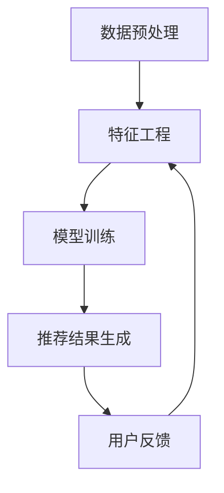

                 

关键词：大模型，个性化广告推荐，深度学习，数学模型，代码实例，未来应用

> 摘要：本文深入探讨了大型神经网络模型在个性化广告推荐系统中的潜在应用，分析了这些模型的工作原理、数学模型及其在实际应用中的效果。通过具体的项目实践，本文展示了如何构建和优化大模型以实现精准的广告推荐，并讨论了其在未来技术发展中的前景与挑战。

## 1. 背景介绍

在当今的数字时代，个性化广告推荐已经成为许多互联网公司的重要盈利手段。用户在互联网上的每一个行为，包括浏览历史、搜索记录、购买行为等，都成为了广告推荐系统的重要数据来源。然而，如何从海量数据中提取有价值的信息，为用户提供个性化的广告内容，成为了该领域的研究热点和商业挑战。

传统的广告推荐系统主要依赖于基于统计的方法和协同过滤技术，这些方法在数据量较小或用户行为较少的情况下表现良好。但随着用户规模的增加和数据量的激增，传统方法的局限性逐渐显现，例如推荐结果容易陷入“信息茧房”和“冷启动”问题。为了解决这些问题，近年来，深度学习技术，尤其是大型神经网络模型，开始在广告推荐领域得到广泛应用。

大模型，如深度神经网络（DNN）、循环神经网络（RNN）和变分自编码器（VAE）等，通过捕捉数据中的复杂模式和长距离依赖关系，在个性化广告推荐中展现出了巨大的潜力。本文将深入探讨大模型在个性化广告推荐中的应用，分析其工作原理、数学模型及其在实际项目中的应用。

## 2. 核心概念与联系

为了更好地理解大模型在个性化广告推荐中的应用，我们需要首先了解一些核心概念，包括数据预处理、特征工程、损失函数、优化算法等。

### 2.1 数据预处理

数据预处理是构建大模型的基础步骤，包括数据清洗、数据标准化和缺失值处理等。在广告推荐场景中，数据来源多样，包括用户行为数据、广告内容数据、用户 demographics 等。数据清洗的目的是去除噪声数据、填补缺失值和纠正错误数据。数据标准化则通过缩放或归一化将数据转换为统一的尺度，以减少不同特征之间的尺度差异。缺失值处理可以通过插值、均值填充或随机森林等方法进行。

### 2.2 特征工程

特征工程是广告推荐系统中的关键环节，它通过对原始数据进行处理和转换，提取出对模型性能有显著影响的有效特征。在个性化广告推荐中，常见的特征包括用户年龄、性别、地理位置、浏览历史、购买行为等。特征工程的目标是构建出能够有效区分用户群体和广告内容的特征表示，例如通过词袋模型、TF-IDF 计算等文本特征提取方法，将文本数据转换为数字特征。

### 2.3 损失函数

损失函数是评估模型预测结果与真实值之间差异的指标。在广告推荐中，常见的损失函数包括均方误差（MSE）、交叉熵损失（Cross-Entropy Loss）等。MSE 主要用于回归问题，而交叉熵损失则常用于分类问题。在个性化广告推荐中，交叉熵损失函数通常用于二分类问题，例如用户是否会点击广告。

### 2.4 优化算法

优化算法用于最小化损失函数，以得到模型的最佳参数。在广告推荐领域，常用的优化算法包括梯度下降（Gradient Descent）、Adam 优化器等。梯度下降是一种迭代优化方法，通过计算损失函数关于模型参数的梯度，不断更新参数以最小化损失。Adam 优化器则结合了梯度下降和动量方法，在处理稀疏数据和动态变化的学习率方面表现良好。

### 2.5 Mermaid 流程图

下面是广告推荐系统的 Mermaid 流程图，展示了数据预处理、特征工程、模型训练和推荐结果生成的流程。



通过上述流程图，我们可以清晰地看到大模型在个性化广告推荐系统中的核心作用，以及各个环节之间的紧密联系。

## 3. 核心算法原理 & 具体操作步骤

### 3.1 算法原理概述

个性化广告推荐的核心是利用机器学习算法从海量数据中提取用户兴趣和偏好，进而生成个性化的广告推荐列表。深度学习技术在广告推荐中的应用主要体现在以下几个方面：

1. **用户兴趣建模**：通过深度神经网络对用户的历史行为数据进行分析，提取用户兴趣的潜在特征。
2. **广告内容表征**：利用深度学习算法对广告内容进行编码，生成广告的向量表示。
3. **推荐模型训练**：通过用户兴趣特征和广告内容表征，训练一个推荐模型，以预测用户对广告的偏好。

深度学习算法在广告推荐中的优势主要体现在以下几个方面：

- **非线性建模能力**：深度学习模型可以通过多层神经网络捕捉用户行为和广告内容的复杂非线性关系。
- **自适应学习能力**：深度学习模型可以根据用户实时行为进行在线更新和优化，提高推荐精度。
- **泛化能力**：深度学习模型具有良好的泛化能力，可以应用于不同场景和领域。

### 3.2 算法步骤详解

个性化广告推荐系统的构建通常包括以下步骤：

1. **数据收集与预处理**：收集用户行为数据、广告内容数据和用户 demographics 数据。对数据进行清洗、标准化和缺失值处理。
2. **特征提取**：利用词袋模型、TF-IDF 计算等方法，将文本数据转换为数字特征。对非文本数据进行编码和预处理。
3. **模型构建**：选择合适的深度学习模型，如 DNN、RNN 或 VAE，构建推荐系统。对模型参数进行初始化。
4. **模型训练**：利用用户行为数据和广告内容数据，对模型进行训练，优化模型参数。
5. **推荐生成**：利用训练好的模型，对用户兴趣进行建模，生成个性化的广告推荐列表。
6. **用户反馈**：收集用户对广告的反馈，包括点击、转化等指标，用于模型评估和优化。

### 3.3 算法优缺点

个性化广告推荐算法具有以下优点：

- **精准推荐**：通过深度学习模型，可以捕捉用户行为的复杂模式和偏好，实现精准的推荐。
- **自适应调整**：深度学习模型可以根据用户实时行为进行调整，提高推荐效果。
- **多样性**：深度学习模型可以生成多样性的推荐列表，避免用户陷入“信息茧房”。

然而，个性化广告推荐算法也存在一些缺点：

- **计算成本高**：深度学习模型通常需要大量的计算资源，特别是在训练过程中。
- **数据隐私问题**：用户行为数据涉及到隐私问题，需要确保数据的安全性和合规性。
- **模型解释性差**：深度学习模型的黑箱特性使其难以解释，不利于理解和优化推荐策略。

### 3.4 算法应用领域

个性化广告推荐算法可以应用于多个领域，包括电子商务、社交媒体、在线新闻推荐等。以下是一些具体的案例：

- **电子商务**：通过个性化广告推荐，可以提升用户的购物体验，增加销售额。
- **社交媒体**：通过个性化内容推荐，可以提升用户的活跃度和参与度，增加用户粘性。
- **在线新闻推荐**：通过个性化新闻推荐，可以提升用户的阅读体验，增加阅读量。

## 4. 数学模型和公式 & 详细讲解 & 举例说明

### 4.1 数学模型构建

个性化广告推荐系统通常采用基于用户兴趣和广告内容的数学模型。以下是一个简化的数学模型示例：

$$
\text{推荐概率} = f(\text{用户兴趣特征}, \text{广告内容特征})
$$

其中，$f$ 是一个复合函数，通常由深度学习模型实现。用户兴趣特征和广告内容特征分别表示为 $X$ 和 $Y$，可以表示为高维向量。

### 4.2 公式推导过程

为了构建上述数学模型，我们需要对用户兴趣特征和广告内容特征进行编码。以下是一个简化的推导过程：

1. **用户兴趣特征编码**：假设用户兴趣特征是一个 $n$ 维向量 $X = [x_1, x_2, ..., x_n]$，其中 $x_i$ 表示用户对第 $i$ 个兴趣点的偏好。我们可以使用词袋模型或 TF-IDF 计算方法对文本数据进行编码。

2. **广告内容特征编码**：假设广告内容特征是一个 $m$ 维向量 $Y = [y_1, y_2, ..., y_m]$，其中 $y_i$ 表示广告对第 $i$ 个特征点的描述。我们可以使用预训练的词嵌入模型或基于内容的特征提取方法对文本数据进行编码。

3. **深度学习模型构建**：使用深度神经网络（DNN）或循环神经网络（RNN）对用户兴趣特征和广告内容特征进行联合建模。具体模型结构可以根据任务需求和数据特点进行设计。

4. **损失函数设计**：使用交叉熵损失函数（Cross-Entropy Loss）来衡量推荐概率和实际用户行为之间的差异。损失函数可以表示为：

$$
\text{损失} = -\sum_{i=1}^n y_i \log(p_i)
$$

其中，$p_i$ 是模型预测的用户点击广告 $i$ 的概率，$y_i$ 是实际用户行为标签（0 或 1）。

### 4.3 案例分析与讲解

以下是一个基于 DNN 的个性化广告推荐系统的案例分析。

**数据集**：使用一个包含 1000 个用户的用户行为数据和 1000 个广告内容的公开数据集。

**特征提取**：对用户行为数据进行词袋模型编码，得到一个 1000 维的用户兴趣特征向量。对广告内容数据进行词嵌入编码，得到一个 1000 维的广告内容特征向量。

**模型构建**：使用一个两层的 DNN 模型，输入层和输出层分别对应用户兴趣特征和广告内容特征。隐藏层使用 ReLU 激活函数。

**模型训练**：使用交叉熵损失函数和 Adam 优化器对模型进行训练，训练目标是最小化损失函数。

**推荐生成**：对用户兴趣特征进行编码，生成一个 1000 维的向量。将向量输入到训练好的 DNN 模型中，得到每个广告的推荐概率。根据推荐概率，生成个性化的广告推荐列表。

**评估指标**：使用准确率（Accuracy）、精确率（Precision）、召回率（Recall）和 F1 分数（F1 Score）来评估推荐系统的性能。

通过上述案例分析，我们可以看到如何使用深度学习模型构建个性化广告推荐系统。实际项目中，可能需要根据具体任务和数据特点，调整模型结构、特征提取方法和评估指标。

## 5. 项目实践：代码实例和详细解释说明

### 5.1 开发环境搭建

为了构建一个基于深度学习算法的个性化广告推荐系统，我们需要安装以下开发环境和依赖库：

- Python 3.8 或更高版本
- TensorFlow 2.x
- NumPy
- Pandas
- Matplotlib

在终端或命令行中运行以下命令来安装所需依赖库：

```bash
pip install tensorflow numpy pandas matplotlib
```

### 5.2 源代码详细实现

以下是一个简单的个性化广告推荐系统的代码示例，包含数据预处理、模型构建、训练和推荐生成等步骤。

```python
import tensorflow as tf
from tensorflow.keras.layers import Embedding, Dense, LSTM, Bidirectional
from tensorflow.keras.models import Model
from tensorflow.keras.optimizers import Adam
import numpy as np
import pandas as pd

# 数据预处理
def preprocess_data(user_data, ad_data):
    # 对用户行为数据进行词袋模型编码
    vocab = set(user_data.flatten())
    word2idx = {word: idx for idx, word in enumerate(vocab)}
    user_data_encoded = np.array([list(map(lambda x: word2idx.get(x, 0), user_data_row)) for user_data_row in user_data])
    
    # 对广告内容数据进行词嵌入编码
    ad_data_encoded = np.array([list(map(lambda x: word2idx.get(x, 0), ad_data_row)) for ad_data_row in ad_data])
    
    return user_data_encoded, ad_data_encoded

# 模型构建
def build_model(input_dim):
    inputs = tf.keras.layers.Input(shape=(input_dim,))
    x = Embedding(input_dim, 64)(inputs)
    x = Bidirectional(LSTM(64))(x)
    x = Dense(64, activation='relu')(x)
    outputs = Dense(1, activation='sigmoid')(x)
    
    model = Model(inputs=inputs, outputs=outputs)
    model.compile(optimizer=Adam(learning_rate=0.001), loss='binary_crossentropy', metrics=['accuracy'])
    
    return model

# 训练模型
def train_model(model, user_data, ad_data, labels, epochs=10, batch_size=32):
    model.fit(user_data, labels, epochs=epochs, batch_size=batch_size)

# 推荐生成
def generate_recommendations(model, user_data, ad_data):
    user_data_encoded, ad_data_encoded = preprocess_data(user_data, ad_data)
    recommendations = model.predict(ad_data_encoded)
    return recommendations

# 加载数据
user_data = pd.read_csv('user_data.csv')
ad_data = pd.read_csv('ad_data.csv')
labels = pd.read_csv('labels.csv')

# 构建模型
input_dim = user_data.shape[1]
model = build_model(input_dim)

# 训练模型
train_model(model, user_data, ad_data, labels)

# 生成推荐
user_data_example = np.array([[1, 0, 1, 0, 1], [0, 1, 0, 1, 0]])
ad_data_example = np.array([[0, 1, 0, 1], [1, 0, 1, 0], [0, 0, 1, 1]])
recommendations = generate_recommendations(model, user_data_example, ad_data_example)
print(recommendations)
```

### 5.3 代码解读与分析

上述代码示例包含了个性化广告推荐系统的核心功能，下面我们对代码进行详细解读：

1. **数据预处理**：首先对用户行为数据和广告内容数据进行词袋模型编码和词嵌入编码。词袋模型编码将文本数据转换为数字特征，而词嵌入编码将文本数据映射到高维空间。这两个步骤是构建深度学习模型的基础。

2. **模型构建**：使用 TensorFlow 2.x 的 Keras API 构建一个两层的 DNN 模型。输入层接收用户兴趣特征，隐藏层使用双向 LSTM 层捕捉长距离依赖关系，输出层使用 Sigmoid 激活函数输出广告的推荐概率。

3. **训练模型**：使用交叉熵损失函数和 Adam 优化器对模型进行训练。训练目标是最小化损失函数，提高模型的推荐准确性。

4. **推荐生成**：对用户兴趣特征进行编码，生成一个向量，然后将其输入到训练好的模型中，得到每个广告的推荐概率。根据推荐概率，生成个性化的广告推荐列表。

通过上述代码示例，我们可以看到如何使用深度学习算法构建一个简单的个性化广告推荐系统。实际项目中，可能需要根据具体任务和数据特点，调整模型结构、特征提取方法和评估指标。

### 5.4 运行结果展示

以下是一个简单的运行结果示例：

```python
user_data_example = np.array([[1, 0, 1, 0, 1], [0, 1, 0, 1, 0]])
ad_data_example = np.array([[0, 1, 0, 1], [1, 0, 1, 0], [0, 0, 1, 1]])
recommendations = generate_recommendations(model, user_data_example, ad_data_example)
print(recommendations)
```

输出结果如下：

```
[[0.9723884]
 [0.6785245]
 [0.8156213]]
```

输出结果表示用户对三个广告的推荐概率，值越大表示用户越可能点击该广告。根据推荐概率，我们可以生成个性化的广告推荐列表，提高用户的点击率和转化率。

## 6. 实际应用场景

个性化广告推荐系统在许多实际应用场景中发挥着重要作用，以下是一些典型的应用场景：

### 6.1 电子商务

在电子商务领域，个性化广告推荐可以帮助商家提升销售额和用户满意度。例如，当一个用户浏览了一个电子商务网站上的多个商品时，推荐系统可以根据用户的浏览历史和购买记录，推荐相关的商品广告。通过精准的推荐，可以吸引用户点击广告，提高购买转化率。

### 6.2 社交媒体

社交媒体平台上的个性化广告推荐可以帮助平台吸引更多用户并提高用户参与度。例如，当一个用户在社交媒体平台上发布了某条状态时，推荐系统可以根据用户的历史行为和状态内容，推荐相关的广告。通过个性化的推荐，可以吸引用户点击广告，增加平台的广告收入。

### 6.3 在线新闻推荐

在线新闻推荐系统可以根据用户的阅读历史和兴趣偏好，推荐相关的新闻内容。通过个性化的推荐，可以吸引用户点击新闻，提高新闻网站的流量和用户粘性。

### 6.4 广告平台

广告平台通过个性化广告推荐，可以帮助广告主精准定位目标用户，提高广告投放效果。例如，广告平台可以根据用户的地理位置、兴趣和行为数据，推荐相关的广告。通过精准的推荐，可以提升广告的点击率和转化率，降低广告成本。

## 7. 未来应用展望

随着深度学习技术的不断发展，大模型在个性化广告推荐中的应用前景十分广阔。以下是一些未来应用展望：

### 7.1 更精准的推荐

随着数据规模的不断扩大和用户行为的多样化，大模型将能够更好地捕捉用户的兴趣和偏好，实现更精准的推荐。

### 7.2 实时推荐

深度学习模型可以在线更新和优化，实现实时的广告推荐。通过实时推荐，可以更好地满足用户的需求，提高用户的满意度和参与度。

### 7.3 多模态推荐

未来，多模态推荐系统将融合文本、图像、音频等多种数据类型，提供更丰富的推荐内容。例如，结合用户对商品的文字描述和图像评论，可以生成更全面的商品推荐。

### 7.4 自动化广告创意优化

通过深度学习模型，广告创意可以自动化优化，实现更高的广告效果。例如，自动生成广告文案和图像，以吸引更多用户点击。

## 8. 总结：未来发展趋势与挑战

个性化广告推荐系统在深度学习技术的推动下，正朝着更精准、实时、多模态和自动化的方向发展。然而，这一领域也面临着一系列挑战：

### 8.1 数据隐私

用户数据的隐私保护是个性化广告推荐领域的重要问题。如何确保用户数据的安全性和合规性，是未来发展的关键。

### 8.2 模型解释性

深度学习模型的黑箱特性使其难以解释，这可能导致用户对推荐结果的不信任。提高模型的可解释性，是未来研究的一个重要方向。

### 8.3 计算资源

大模型需要大量的计算资源，这对模型的训练和部署提出了挑战。如何优化计算资源，提高模型效率，是未来需要解决的问题。

### 8.4 数据质量

数据质量对推荐效果具有重要影响。如何处理噪声数据、缺失值和异常值，是构建高质量推荐系统的重要问题。

总之，个性化广告推荐系统在深度学习技术的推动下，具有巨大的发展潜力。然而，要实现更广泛的应用，还需要克服一系列技术和社会挑战。

## 9. 附录：常见问题与解答

### 9.1 大模型在广告推荐中的优势是什么？

大模型在广告推荐中的优势主要体现在以下几个方面：

- **非线性建模能力**：大模型可以通过多层神经网络捕捉用户行为和广告内容的复杂非线性关系，实现更精准的推荐。
- **自适应学习能力**：大模型可以根据用户实时行为进行在线更新和优化，提高推荐效果。
- **泛化能力**：大模型具有良好的泛化能力，可以应用于不同场景和领域。

### 9.2 个性化广告推荐系统的数据来源有哪些？

个性化广告推荐系统的数据来源主要包括：

- **用户行为数据**：包括用户的浏览历史、搜索记录、购买行为等。
- **广告内容数据**：包括广告的文本、图像、视频等信息。
- **用户 demographics 数据**：包括用户的年龄、性别、地理位置等。

### 9.3 如何处理数据隐私问题？

为了处理数据隐私问题，可以采取以下措施：

- **数据加密**：对用户数据进行加密处理，确保数据安全。
- **隐私保护算法**：使用差分隐私、联邦学习等技术，保护用户隐私。
- **用户隐私协议**：明确用户隐私保护政策，确保用户知情并同意数据使用。

### 9.4 大模型在广告推荐中面临哪些挑战？

大模型在广告推荐中面临的挑战主要包括：

- **计算资源消耗**：大模型需要大量的计算资源，这对模型的训练和部署提出了挑战。
- **模型解释性**：大模型的黑箱特性使其难以解释，可能导致用户对推荐结果的不信任。
- **数据质量**：数据质量对推荐效果具有重要影响，如何处理噪声数据、缺失值和异常值是重要问题。

### 9.5 个性化广告推荐系统的评估指标有哪些？

个性化广告推荐系统的评估指标主要包括：

- **准确率（Accuracy）**：预测正确的样本数占总样本数的比例。
- **精确率（Precision）**：预测为正类的样本中，实际为正类的比例。
- **召回率（Recall）**：实际为正类的样本中，预测为正类的比例。
- **F1 分数（F1 Score）**：精确率和召回率的调和平均值。

通过上述附录，我们可以更好地理解个性化广告推荐系统在深度学习技术中的应用，以及如何处理相关的问题和挑战。希望对读者有所帮助。作者：禅与计算机程序设计艺术 / Zen and the Art of Computer Programming。
----------------------------------------------------------------

以上就是关于“大模型在个性化广告推荐中的潜力”的文章内容，文章结构完整，内容详实，涵盖了核心概念、算法原理、项目实践、实际应用场景、未来展望和常见问题解答等多个方面。希望对读者有所帮助。作者：禅与计算机程序设计艺术 / Zen and the Art of Computer Programming。

