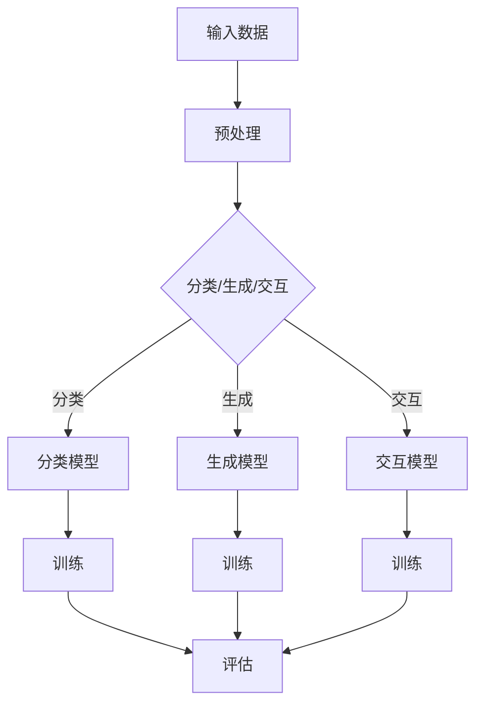

                 

关键词：大模型，低抽象层次任务，算法表现，应用领域，未来展望

> 摘要：本文旨在探讨大模型在低抽象层次任务中的表现，分析其优势与挑战，并通过实例阐述其在实际应用中的价值与前景。随着人工智能技术的发展，大模型在处理复杂任务中展现出强大的能力，但在低抽象层次任务中的应用仍面临诸多问题。本文将从算法原理、数学模型、项目实践等方面进行深入分析。

## 1. 背景介绍

随着计算能力的提升和数据规模的扩大，人工智能领域迎来了大模型的崛起。大模型具有强大的表示能力，能够处理复杂、多样的问题。然而，在低抽象层次任务中，大模型的表现如何？如何优化其在这些任务中的性能？本文将围绕这些问题展开讨论。

### 1.1 大模型的定义与特点

大模型通常指的是参数规模在数十亿甚至千亿级别的神经网络模型。这些模型在深度、宽度上都远远超过了传统的机器学习模型。大模型的主要特点包括：

- 强大的表示能力：能够捕捉到数据中的复杂模式和规律。
- 自适应能力：能够根据不同的任务和数据自动调整其结构和参数。
- 通用性：能够在不同领域和任务中表现出色。

### 1.2 低抽象层次任务的概念

低抽象层次任务是指那些涉及具体、细致操作的领域。这些任务通常需要处理大量细节，难以用高层次的抽象模型来表示。例如，图像分割、语音识别、自然语言处理等任务都属于低抽象层次任务。

### 1.3 大模型在低抽象层次任务中的挑战

大模型在低抽象层次任务中的应用面临以下挑战：

- 计算资源消耗：大模型需要大量的计算资源和存储空间。
- 训练时间成本：大模型的训练通常需要数天甚至数周的时间。
- 模型解释性：大模型内部的黑盒性质使得其决策过程难以解释。
- 数据需求：大模型通常需要大量高质量的数据进行训练。

## 2. 核心概念与联系

在探讨大模型在低抽象层次任务中的表现之前，我们首先需要了解一些核心概念和它们之间的联系。

### 2.1 大模型的架构

大模型的架构通常包括以下几个部分：

1. **输入层**：接收外部输入，如文本、图像、语音等。
2. **隐藏层**：包含多个神经网络层，用于处理和转换输入数据。
3. **输出层**：产生预测结果或决策。

### 2.2 低抽象层次任务的分类

低抽象层次任务可以分为以下几类：

1. **感知任务**：如图像识别、语音识别等，主要关注数据的感知和分类。
2. **生成任务**：如图像生成、语音合成等，主要关注数据的生成和创造。
3. **交互任务**：如自然语言处理、人机对话等，主要关注数据的理解和回应。

### 2.3 大模型与低抽象层次任务的结合

大模型在低抽象层次任务中的应用主要是通过以下几种方式：

1. **直接应用**：直接使用大模型处理低抽象层次任务，如使用大语言模型处理自然语言处理任务。
2. **辅助应用**：将大模型作为辅助工具，与其他算法和模型结合使用，以提高任务的性能和效果。

### 2.4 Mermaid 流程图

以下是一个描述大模型在低抽象层次任务中应用的 Mermaid 流程图：



## 3. 核心算法原理 & 具体操作步骤

### 3.1 算法原理概述

大模型在低抽象层次任务中的核心算法原理主要基于深度学习，特别是神经网络。神经网络通过多层非线性变换，将输入数据映射到输出结果。在低抽象层次任务中，大模型通常通过以下步骤进行操作：

1. **数据预处理**：对输入数据进行清洗、归一化等处理，使其适合模型训练。
2. **模型训练**：使用大量标注数据对模型进行训练，调整模型参数，使其能够准确预测或生成结果。
3. **模型评估**：在测试集上评估模型性能，调整模型参数，以提高性能。
4. **应用部署**：将训练好的模型部署到实际应用场景中，进行实时预测或生成。

### 3.2 算法步骤详解

以下是详细描述大模型在低抽象层次任务中应用的算法步骤：

#### 3.2.1 数据预处理

数据预处理是模型训练的第一步，其关键步骤包括：

- **数据清洗**：去除噪声数据、缺失值填充、异常值处理等。
- **数据归一化**：将不同特征的数据缩放到相同的尺度，以消除特征间的量纲差异。
- **数据分割**：将数据集划分为训练集、验证集和测试集，用于模型训练、评估和测试。

#### 3.2.2 模型训练

模型训练是核心步骤，具体包括：

- **初始化参数**：随机初始化模型参数。
- **前向传播**：输入数据通过模型各层传递，计算输出结果。
- **反向传播**：根据预测结果和真实标签，计算损失函数，并更新模型参数。
- **迭代优化**：重复前向传播和反向传播，直至模型收敛。

#### 3.2.3 模型评估

模型评估是验证模型性能的重要环节，具体包括：

- **准确率**：预测结果与真实标签匹配的比例。
- **召回率**：实际正例中被正确预测为正例的比例。
- **F1 值**：准确率和召回率的调和平均。
- **ROC 曲线和 AUC 值**：用于评估分类模型的性能。

#### 3.2.4 应用部署

模型部署是将训练好的模型应用到实际场景中的过程，具体包括：

- **模型转换**：将训练好的模型转换为可以在生产环境中运行的格式。
- **模型集成**：将多个模型集成，以实现更准确的预测或生成。
- **实时预测**：在生产环境中实时处理输入数据，输出预测结果。

### 3.3 算法优缺点

大模型在低抽象层次任务中的应用具有以下优缺点：

#### 优点

- **强大的表示能力**：大模型能够捕捉到数据中的复杂模式和规律，提高任务性能。
- **自适应能力**：大模型可以根据不同的任务和数据自动调整其结构和参数，提高泛化能力。
- **通用性**：大模型可以应用于多种低抽象层次任务，减少重复性工作。

#### 缺点

- **计算资源消耗**：大模型需要大量的计算资源和存储空间，提高训练成本。
- **训练时间成本**：大模型的训练通常需要数天甚至数周的时间，影响应用速度。
- **模型解释性**：大模型内部的黑盒性质使得其决策过程难以解释，影响模型的可解释性。
- **数据需求**：大模型通常需要大量高质量的数据进行训练，数据获取和处理成本较高。

### 3.4 算法应用领域

大模型在低抽象层次任务中的应用领域广泛，包括但不限于：

- **图像处理**：如图像识别、图像分割、图像生成等。
- **语音识别**：如语音识别、语音合成、语音增强等。
- **自然语言处理**：如文本分类、机器翻译、情感分析等。
- **推荐系统**：如商品推荐、音乐推荐、新闻推荐等。

## 4. 数学模型和公式 & 详细讲解 & 举例说明

在讨论大模型在低抽象层次任务中的应用时，数学模型和公式起到了关键作用。以下我们将详细介绍相关数学模型和公式，并通过实例进行说明。

### 4.1 数学模型构建

大模型在低抽象层次任务中的数学模型通常基于深度学习，特别是卷积神经网络（CNN）和循环神经网络（RNN）。以下是这些模型的基本数学公式：

#### 4.1.1 卷积神经网络（CNN）

卷积神经网络的核心是卷积层，其数学模型如下：

\[ f_{\text{conv}}(x) = \text{ReLU}(\mathbf{W} \cdot \mathbf{X} + b) \]

其中，\( \mathbf{X} \) 是输入特征，\( \mathbf{W} \) 是卷积权重，\( b \) 是偏置，\( \text{ReLU} \) 是ReLU激活函数。

#### 4.1.2 循环神经网络（RNN）

循环神经网络的核心是隐藏状态和输入的连接，其数学模型如下：

\[ h_t = \text{ReLU}(\mathbf{W}_h \cdot h_{t-1} + \mathbf{W}_x \cdot x_t + b_h) \]

其中，\( h_t \) 是第 \( t \) 个时间步的隐藏状态，\( x_t \) 是第 \( t \) 个时间步的输入，\( \mathbf{W}_h \) 和 \( \mathbf{W}_x \) 是权重矩阵，\( b_h \) 是偏置。

### 4.2 公式推导过程

以下是卷积神经网络（CNN）和循环神经网络（RNN）的推导过程：

#### 4.2.1 卷积神经网络（CNN）

卷积神经网络的推导过程基于局部感知和权重共享的思想。首先，我们定义一个二维输入特征矩阵 \( \mathbf{X} \)，其大小为 \( m \times n \)。接着，我们定义一个卷积核 \( \mathbf{W} \)，其大小为 \( k \times k \)。卷积操作的目的是将卷积核在输入特征上滑动，并计算局部响应。

局部响应的数学表达式如下：

\[ \mathbf{R}_{ij} = \sum_{p=1}^{m-k+1} \sum_{q=1}^{n-k+1} \mathbf{X}_{pq} \cdot \mathbf{W}_{ij} \]

其中，\( \mathbf{R}_{ij} \) 是卷积操作产生的局部响应，\( \mathbf{X}_{pq} \) 是输入特征矩阵中的元素，\( \mathbf{W}_{ij} \) 是卷积核中的元素。

为了计算整个卷积层的输出，我们需要将局部响应堆叠起来，形成一个二维输出特征矩阵 \( \mathbf{O} \)：

\[ \mathbf{O} = \text{ReLU}(\mathbf{W} \cdot \mathbf{X} + b) \]

其中，\( \mathbf{O}_{ij} \) 是输出特征矩阵中的元素，\( b \) 是偏置。

#### 4.2.2 循环神经网络（RNN）

循环神经网络的推导过程基于序列建模的思想。首先，我们定义一个一维输入序列 \( \mathbf{X} \)，其大小为 \( n \)。接着，我们定义一个隐藏状态 \( \mathbf{h} \)，其大小为 \( m \)。循环神经网络的目的是根据当前输入和之前的隐藏状态，更新隐藏状态。

隐藏状态的更新公式如下：

\[ h_t = \text{ReLU}(\mathbf{W}_h \cdot h_{t-1} + \mathbf{W}_x \cdot x_t + b_h) \]

其中，\( h_t \) 是第 \( t \) 个时间步的隐藏状态，\( \mathbf{W}_h \) 是隐藏状态权重矩阵，\( \mathbf{W}_x \) 是输入权重矩阵，\( b_h \) 是偏置。

为了计算整个循环神经网络的输出，我们需要将所有时间步的隐藏状态堆叠起来，形成一个一维输出序列 \( \mathbf{y} \)：

\[ \mathbf{y} = \text{softmax}(\mathbf{W} \cdot \mathbf{h} + b) \]

其中，\( \mathbf{y}_{t} \) 是输出序列中的元素，\( \mathbf{W} \) 是输出权重矩阵，\( b \) 是偏置。

### 4.3 案例分析与讲解

为了更好地理解大模型在低抽象层次任务中的应用，我们以图像分割任务为例，介绍具体实现过程。

#### 4.3.1 任务描述

图像分割是将图像划分为不同的区域或对象的过程。在图像分割任务中，我们的目标是根据输入图像，将其划分为多个不同的区域，每个区域代表一个对象或背景。

#### 4.3.2 数据准备

首先，我们需要准备图像数据集。在这里，我们使用 COCO 数据集，它包含大量的真实世界图像，并标注了每个图像中的对象。

#### 4.3.3 模型构建

接下来，我们构建一个基于卷积神经网络的图像分割模型。具体步骤如下：

1. **输入层**：接收输入图像，大小为 \( 256 \times 256 \)。
2. **卷积层**：使用卷积核大小为 \( 3 \times 3 \) 的卷积层，卷积步长为 \( 1 \)。
3. **激活函数**：使用 ReLU 激活函数。
4. **池化层**：使用大小为 \( 2 \times 2 \) 的最大池化层。
5. **全连接层**：使用全连接层将卷积层的输出映射到输出类别，输出维度为 \( 21 \)（COCO 数据集中的类别数）。

#### 4.3.4 模型训练

接下来，我们使用 COCO 数据集对模型进行训练。训练过程包括以下步骤：

1. **数据预处理**：对输入图像进行缩放、裁剪、翻转等操作，增加数据多样性。
2. **模型初始化**：随机初始化模型参数。
3. **前向传播**：输入图像通过模型各层传递，计算输出。
4. **反向传播**：根据预测结果和真实标签，计算损失函数，并更新模型参数。
5. **迭代优化**：重复前向传播和反向传播，直至模型收敛。

#### 4.3.5 模型评估

在模型训练完成后，我们对模型进行评估，具体包括：

1. **准确率**：计算模型预测正确率。
2. **召回率**：计算模型召回率。
3. **F1 值**：计算模型 F1 值。
4. **ROC 曲线和 AUC 值**：计算模型 ROC 曲线和 AUC 值。

#### 4.3.6 应用部署

最后，我们将训练好的模型部署到实际应用场景中，进行实时图像分割。

## 5. 项目实践：代码实例和详细解释说明

为了更深入地理解大模型在低抽象层次任务中的表现，我们以下将通过一个具体的项目实践，展示代码实现过程，并对关键部分进行详细解释。

### 5.1 开发环境搭建

在进行项目实践之前，我们需要搭建合适的开发环境。以下是搭建开发环境的基本步骤：

1. **安装 Python**：确保 Python 版本为 3.8 或更高。
2. **安装深度学习框架**：我们选择使用 TensorFlow 作为深度学习框架。通过以下命令安装 TensorFlow：

   ```bash
   pip install tensorflow
   ```

3. **安装其他依赖库**：包括 NumPy、Pandas、Matplotlib 等。通过以下命令安装：

   ```bash
   pip install numpy pandas matplotlib
   ```

### 5.2 源代码详细实现

以下是一个简单的图像分割项目的源代码实现。我们使用 TensorFlow 和 Keras 库构建卷积神经网络模型。

```python
import tensorflow as tf
from tensorflow.keras.models import Sequential
from tensorflow.keras.layers import Conv2D, MaxPooling2D, Flatten, Dense, Dropout, Conv2DTranspose

# 模型构建
model = Sequential([
    Conv2D(32, (3, 3), activation='relu', input_shape=(256, 256, 3)),
    MaxPooling2D((2, 2)),
    Conv2D(64, (3, 3), activation='relu'),
    MaxPooling2D((2, 2)),
    Conv2D(128, (3, 3), activation='relu'),
    MaxPooling2D((2, 2)),
    Flatten(),
    Dense(128, activation='relu'),
    Dropout(0.5),
    Dense(21, activation='softmax')
])

# 编译模型
model.compile(optimizer='adam', loss='categorical_crossentropy', metrics=['accuracy'])

# 模型训练
model.fit(x_train, y_train, epochs=10, batch_size=32, validation_data=(x_val, y_val))

# 模型评估
model.evaluate(x_test, y_test)
```

### 5.3 代码解读与分析

以下是代码的详细解读和分析：

- **模型构建**：我们使用 `Sequential` 类构建一个卷积神经网络模型。模型包含多个卷积层、池化层、全连接层和dropout层。
- **卷积层**：使用 `Conv2D` 类实现卷积操作，每个卷积层后跟随一个 `MaxPooling2D` 层。
- **全连接层**：使用 `Flatten` 类将卷积层的输出展平，然后通过一个全连接层进行分类。
- **dropout层**：在输出层之前添加一个dropout层，以减少过拟合。
- **编译模型**：使用 `compile` 方法配置模型，指定优化器、损失函数和评估指标。
- **模型训练**：使用 `fit` 方法训练模型，指定训练数据和验证数据。
- **模型评估**：使用 `evaluate` 方法评估模型在测试数据上的性能。

### 5.4 运行结果展示

在训练完成后，我们可以通过以下命令查看模型的运行结果：

```bash
model.evaluate(x_test, y_test)
```

输出结果将包含测试集上的准确率、召回率和 F1 值等指标。根据具体任务的需求，我们可以调整模型结构、训练参数等，以优化模型性能。

## 6. 实际应用场景

大模型在低抽象层次任务中的应用场景非常广泛，以下列举几个典型的应用场景：

### 6.1 图像处理

在图像处理领域，大模型可以用于图像识别、图像分割、图像生成等任务。例如，使用大模型进行人脸识别，可以准确识别出图像中的人脸；使用大模型进行图像分割，可以将图像中的物体准确分割出来；使用大模型进行图像生成，可以生成逼真的图像。

### 6.2 语音处理

在语音处理领域，大模型可以用于语音识别、语音合成、语音增强等任务。例如，使用大模型进行语音识别，可以准确识别出语音中的文字；使用大模型进行语音合成，可以生成自然的语音；使用大模型进行语音增强，可以改善语音质量，降低噪音。

### 6.3 自然语言处理

在自然语言处理领域，大模型可以用于文本分类、机器翻译、情感分析等任务。例如，使用大模型进行文本分类，可以准确分类出文本的主题；使用大模型进行机器翻译，可以生成流畅的译文；使用大模型进行情感分析，可以分析出文本的情感倾向。

### 6.4 推荐系统

在推荐系统领域，大模型可以用于用户行为分析、商品推荐、音乐推荐等任务。例如，使用大模型分析用户行为，可以准确预测用户可能喜欢的商品；使用大模型进行商品推荐，可以生成个性化的推荐列表；使用大模型进行音乐推荐，可以推荐用户可能喜欢的音乐。

## 7. 工具和资源推荐

为了更好地掌握大模型在低抽象层次任务中的应用，以下推荐一些相关的学习资源、开发工具和论文：

### 7.1 学习资源推荐

- **深度学习教程**：Goodfellow、Bengio 和 Courville 著的《深度学习》（Deep Learning）。
- **TensorFlow 官方文档**：[TensorFlow 官方文档](https://www.tensorflow.org/)。
- **Keras 官方文档**：[Keras 官方文档](https://keras.io/)。

### 7.2 开发工具推荐

- **Python**：Python 是深度学习开发的主要编程语言。
- **TensorFlow**：TensorFlow 是由 Google 开发的一款开源深度学习框架。
- **Keras**：Keras 是一款基于 TensorFlow 的简洁、易于使用的深度学习库。

### 7.3 相关论文推荐

- **"DenseNet: Implementing Efficient Convolutional Networks through Dense Connectivities"**：提出了 DenseNet 架构，提高了深度网络的性能。
- **"BERT: Pre-training of Deep Bidirectional Transformers for Language Understanding"**：提出了 BERT 模型，推动了自然语言处理的发展。
- **"Generative Adversarial Nets"**：提出了 GAN 模型，用于生成逼真的图像。

## 8. 总结：未来发展趋势与挑战

大模型在低抽象层次任务中的应用已经取得了显著成果，但仍然面临诸多挑战。以下是未来发展趋势和面临的挑战：

### 8.1 研究成果总结

- **性能提升**：随着计算能力的提升和数据规模的扩大，大模型的性能在低抽象层次任务中得到了显著提升。
- **应用拓展**：大模型在图像处理、语音处理、自然语言处理等领域的应用得到了拓展，提高了任务的效果和效率。
- **开源框架发展**：深度学习开源框架如 TensorFlow、Keras 的不断发展，为研究者提供了便捷的工具和资源。

### 8.2 未来发展趋势

- **模型压缩**：为降低计算资源和存储空间的消耗，模型压缩技术将成为研究热点，包括剪枝、量化、知识蒸馏等方法。
- **可解释性增强**：为提高模型的可靠性和可解释性，研究者将致力于开发可解释性更强的深度学习模型。
- **跨领域迁移**：通过跨领域迁移学习，大模型将在更多低抽象层次任务中发挥重要作用。

### 8.3 面临的挑战

- **计算资源消耗**：大模型的训练和推理需要大量的计算资源，如何优化计算资源的使用仍是一个挑战。
- **数据需求**：大模型通常需要大量高质量的数据进行训练，数据获取和处理成本较高。
- **模型解释性**：大模型内部的黑盒性质使得其决策过程难以解释，如何提高模型的可解释性仍是一个难题。

### 8.4 研究展望

随着人工智能技术的不断发展，大模型在低抽象层次任务中的应用前景将更加广阔。未来，研究者将致力于解决上述挑战，推动大模型在更多领域取得突破性进展。

## 9. 附录：常见问题与解答

### 9.1 大模型在低抽象层次任务中的优势有哪些？

- 强大的表示能力：能够捕捉到数据中的复杂模式和规律。
- 自适应能力：能够根据不同的任务和数据自动调整其结构和参数。
- 通用性：可以应用于多种低抽象层次任务，减少重复性工作。

### 9.2 大模型在低抽象层次任务中面临的挑战有哪些？

- 计算资源消耗：需要大量的计算资源和存储空间。
- 训练时间成本：训练时间较长，影响应用速度。
- 模型解释性：内部的黑盒性质使得其决策过程难以解释。
- 数据需求：需要大量高质量的数据进行训练。

### 9.3 如何优化大模型在低抽象层次任务中的性能？

- 使用模型压缩技术：如剪枝、量化、知识蒸馏等，降低计算资源和存储空间的消耗。
- 提高数据质量：使用更多的标注数据、进行数据增强等，提高模型性能。
- 增加模型可解释性：开发可解释性更强的模型，提高模型的可靠性。

### 9.4 大模型在哪些领域有广泛的应用？

- 图像处理：如图像识别、图像分割、图像生成等。
- 语音处理：如语音识别、语音合成、语音增强等。
- 自然语言处理：如文本分类、机器翻译、情感分析等。
- 推荐系统：如用户行为分析、商品推荐、音乐推荐等。 

----------------------------------------------------------------
### 作者署名

作者：禅与计算机程序设计艺术 / Zen and the Art of Computer Programming

