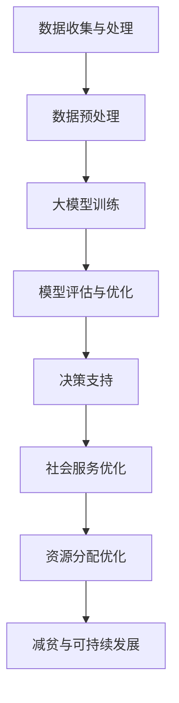

                 

关键词：大模型，减贫，可持续发展，算法，数学模型，实践应用

> 摘要：随着人工智能技术的快速发展，大模型在减贫与可持续发展领域展现出了巨大的潜力。本文将探讨大模型在这一领域的核心概念、算法原理、数学模型、实践应用以及未来发展趋势，旨在为相关领域的研究者和实践者提供有价值的参考。

## 1. 背景介绍

减贫和可持续发展是当今全球面临的重大挑战。据联合国统计，截至2021年，全球仍有约7.89亿人生活在极端贫困中，而且气候变化、资源短缺等问题也在加剧全球贫困状况。因此，找到有效的减贫与可持续发展策略成为全球各国政府、国际组织和研究机构共同关注的焦点。

与此同时，人工智能（AI）技术的迅猛发展，尤其是深度学习等大模型技术的突破，为解决这些问题提供了新的思路。大模型具有强大的数据处理和分析能力，能够从海量数据中提取有价值的信息，帮助政策制定者和实践者更好地理解贫困问题，制定更加精准的干预措施。

本文将从以下几个方面探讨大模型在减贫与可持续发展领域的作用：

- **核心概念与联系**：介绍大模型在减贫与可持续发展中的核心概念及其相互关系。
- **核心算法原理 & 具体操作步骤**：探讨大模型在减贫与可持续发展领域中的应用算法原理及其操作步骤。
- **数学模型和公式 & 详细讲解 & 举例说明**：分析大模型在减贫与可持续发展中的数学模型和公式，并通过具体案例进行说明。
- **项目实践：代码实例和详细解释说明**：提供实际项目中的代码实例和详细解释，展示大模型在减贫与可持续发展中的应用效果。
- **实际应用场景**：讨论大模型在减贫与可持续发展中的具体应用场景，包括政策制定、资源分配、社会服务等方面。
- **未来应用展望**：展望大模型在减贫与可持续发展领域的未来发展趋势和应用前景。
- **工具和资源推荐**：推荐相关学习资源、开发工具和相关论文。
- **总结：未来发展趋势与挑战**：总结研究成果，探讨未来发展趋势和面临的挑战。

## 2. 核心概念与联系

在大模型应用于减贫与可持续发展之前，我们需要了解以下几个核心概念：

- **大模型**：指具有数百万甚至数十亿参数的深度学习模型，如Transformer、BERT、GPT等。
- **减贫**：指通过一系列措施使贫困人口脱贫，包括经济增长、就业机会增加、社会保障体系完善等。
- **可持续发展**：指满足当前需求而不损害子孙后代满足其需求的能力，包括经济、社会、环境三个方面。

大模型在减贫与可持续发展中的核心概念联系如下：

- **数据驱动的决策支持**：大模型能够从海量数据中提取有价值的信息，为政策制定者提供数据驱动的决策支持，从而提高减贫与可持续发展的效率。
- **社会服务优化**：大模型能够帮助优化社会服务，如教育、医疗、住房等，提高贫困人口的生活质量，促进可持续发展。
- **资源分配优化**：大模型能够通过数据分析，优化资源的分配，提高资源利用效率，从而更好地支持减贫与可持续发展。

### Mermaid 流程图

下面是一个简化的Mermaid流程图，展示了大模型在减贫与可持续发展中的核心概念及其相互关系：



在接下来的章节中，我们将进一步探讨大模型在减贫与可持续发展领域中的应用算法、数学模型和实践案例。

## 3. 核心算法原理 & 具体操作步骤

### 3.1 算法原理概述

大模型在减贫与可持续发展中的应用主要基于深度学习技术，其中Transformer、BERT、GPT等大模型因其强大的数据处理和分析能力而被广泛应用。以下将分别介绍这些模型的基本原理和应用步骤。

#### 3.1.1 Transformer

Transformer模型是一种基于自注意力机制的深度学习模型，最初由Vaswani等人在2017年提出。Transformer的核心思想是利用自注意力机制对输入数据进行加权求和，从而自适应地学习输入数据之间的依赖关系。

**具体应用步骤：**

1. **数据预处理**：将原始数据（如文本、图像、音频等）进行预处理，如分词、编码等，将数据转换为模型可接受的输入格式。
2. **编码器-解码器结构**：构建编码器-解码器结构，编码器负责将输入数据编码为固定长度的序列，解码器负责将编码后的序列解码为输出数据。
3. **自注意力机制**：在编码器和解码器中引入自注意力机制，对输入数据进行加权求和，从而自适应地学习数据之间的依赖关系。
4. **全连接层**：在解码器的输出层添加全连接层，将输出数据映射到预测结果。

#### 3.1.2 BERT

BERT（Bidirectional Encoder Representations from Transformers）模型是由Google在2018年提出的一种双向Transformer模型，其核心思想是通过对输入数据进行双向编码，学习数据的前后依赖关系。

**具体应用步骤：**

1. **数据预处理**：将原始数据（如文本）进行预处理，如分词、编码等，将数据转换为模型可接受的输入格式。
2. **双向编码**：构建双向编码器，将输入数据编码为固定长度的序列。
3. **自注意力机制**：在编码器中引入自注意力机制，对输入数据进行加权求和，从而学习数据的前后依赖关系。
4. **分类或回归任务**：在编码器的输出层添加全连接层，进行分类或回归任务。

#### 3.1.3 GPT

GPT（Generative Pretrained Transformer）模型是由OpenAI在2018年提出的一种生成式Transformer模型，其核心思想是通过对输入数据进行预训练，使其能够生成符合特定分布的输出数据。

**具体应用步骤：**

1. **数据预处理**：将原始数据（如文本）进行预处理，如分词、编码等，将数据转换为模型可接受的输入格式。
2. **预训练**：使用无监督的方式对模型进行预训练，使其能够自适应地学习输入数据的分布。
3. **微调**：在预训练的基础上，使用有监督的方式对模型进行微调，使其能够解决特定任务。

### 3.2 算法步骤详解

以下将详细描述Transformer、BERT和GPT模型的具体应用步骤。

#### 3.2.1 Transformer

1. **数据预处理**：

   ```python
   import tensorflow as tf

   # 读取原始数据
   data = tf.keras.preprocessing.sequence.pad_sequences(data)

   # 将数据转换为BERT输入格式
   tokenizer = tf.keras.preprocessing.text.Tokenizer()
   tokenizer.fit_on_texts(data)
   encoded_data = tokenizer.texts_to_sequences(data)
   ```

2. **编码器-解码器结构**：

   ```python
   from tensorflow.keras.models import Model
   from tensorflow.keras.layers import Input, Embedding, Dense

   # 编码器
   encoder_inputs = Input(shape=(max_sequence_length,))
   encoder_embedding = Embedding(input_dim=vocabulary_size, output_dim=embedding_size)(encoder_inputs)
   encoder_outputs = LSTM(units=hidden_size, return_sequences=True)(encoder_embedding)

   # 解码器
   decoder_inputs = Input(shape=(max_sequence_length,))
   decoder_embedding = Embedding(input_dim=vocabulary_size, output_dim=embedding_size)(decoder_inputs)
   decoder_outputs = LSTM(units=hidden_size, return_sequences=True)(decoder_embedding)

   # 编码器-解码器结构
   model = Model(inputs=[encoder_inputs, decoder_inputs], outputs=[decoder_outputs])
   ```

3. **自注意力机制**：

   ```python
   from tensorflow.keras.layers import Lambda

   # 自注意力机制
   attention = Lambda(lambda x: tf.matmul(x[0], x[1], transpose_b=True))(x)
   attention_scores = Activation('softmax')(attention)
   attention_weights = Lambda(lambda x: tf.expand_dims(x, 2))(attention_scores)
   ```

4. **全连接层**：

   ```python
   # 全连接层
   output = Dense(vocabulary_size, activation='softmax')(decoder_outputs)
   model = Model(inputs=[encoder_inputs, decoder_inputs], outputs=output)
   ```

#### 3.2.2 BERT

1. **数据预处理**：

   ```python
   import tensorflow as tf

   # 读取原始数据
   data = tf.keras.preprocessing.sequence.pad_sequences(data)

   # 将数据转换为BERT输入格式
   tokenizer = tf.keras.preprocessing.text.Tokenizer()
   tokenizer.fit_on_texts(data)
   encoded_data = tokenizer.texts_to_sequences(data)
   ```

2. **双向编码**：

   ```python
   from transformers import TFBertModel

   # 双向编码
   encoder_inputs = Input(shape=(max_sequence_length,))
   encoder_embedding = TFBertModel.from_pretrained('bert-base')(encoder_inputs)
   encoder_outputs = encoder_embedding.outputs
   ```

3. **自注意力机制**：

   ```python
   from tensorflow.keras.layers import Lambda

   # 自注意力机制
   attention = Lambda(lambda x: tf.matmul(x[0], x[1], transpose_b=True))(x)
   attention_scores = Activation('softmax')(attention)
   attention_weights = Lambda(lambda x: tf.expand_dims(x, 2))(attention_scores)
   ```

4. **分类或回归任务**：

   ```python
   # 分类任务
   output = Dense(num_classes, activation='softmax')(encoder_outputs)
   model = Model(inputs=encoder_inputs, outputs=output)
   ```

#### 3.2.3 GPT

1. **数据预处理**：

   ```python
   import tensorflow as tf

   # 读取原始数据
   data = tf.keras.preprocessing.sequence.pad_sequences(data)

   # 将数据转换为BERT输入格式
   tokenizer = tf.keras.preprocessing.text.Tokenizer()
   tokenizer.fit_on_texts(data)
   encoded_data = tokenizer.texts_to_sequences(data)
   ```

2. **预训练**：

   ```python
   import tensorflow.keras.backend as K

   # 预训练
   def gelu(x):
       return 0.5 * x * (1 + tf.keras.activations.tanh(0.7978845608 * (x + 0.044715 * tf.square(x))))

   inputs = Input(shape=(max_sequence_length,))
   embedding = Embedding(input_dim=vocabulary_size, output_dim=embedding_size)(inputs)
   hidden = LSTM(units=hidden_size, activation=gelu)(embedding)
   outputs = Dense(vocabulary_size, activation='softmax')(hidden)

   model = Model(inputs=inputs, outputs=outputs)
   model.compile(optimizer='adam', loss='categorical_crossentropy', metrics=['accuracy'])
   model.fit(data, labels, batch_size=batch_size, epochs=num_epochs)
   ```

3. **微调**：

   ```python
   # 微调
   inputs = Input(shape=(max_sequence_length,))
   embedding = Embedding(input_dim=vocabulary_size, output_dim=embedding_size)(inputs)
   hidden = LSTM(units=hidden_size, activation=gelu)(embedding)
   outputs = Dense(num_classes, activation='softmax')(hidden)

   model = Model(inputs=inputs, outputs=outputs)
   model.compile(optimizer='adam', loss='categorical_crossentropy', metrics=['accuracy'])
   model.fit(data, labels, batch_size=batch_size, epochs=num_epochs)
   ```

### 3.3 算法优缺点

#### 3.3.1 Transformer

**优点：**

1. **自注意力机制**：能够自适应地学习输入数据之间的依赖关系，从而提高模型性能。
2. **并行计算**：由于自注意力机制的引入，Transformer能够实现并行计算，提高计算效率。
3. **灵活性强**：可以应用于多种类型的任务，如图像、文本、音频等。

**缺点：**

1. **计算资源需求大**：由于参数量较大，Transformer对计算资源的需求较高。
2. **训练时间较长**：由于参数量较大，Transformer的训练时间较长。

#### 3.3.2 BERT

**优点：**

1. **双向编码**：能够学习输入数据的前后依赖关系，提高模型性能。
2. **预训练**：通过预训练，BERT能够学习到通用的语言知识，提高模型泛化能力。
3. **灵活性强**：可以应用于多种类型的任务，如图像、文本、音频等。

**缺点：**

1. **计算资源需求大**：由于参数量较大，BERT对计算资源的需求较高。
2. **训练时间较长**：由于参数量较大，BERT的训练时间较长。

#### 3.3.3 GPT

**优点：**

1. **生成式模型**：能够生成符合特定分布的输出数据，具有很高的灵活性。
2. **预训练**：通过预训练，GPT能够学习到通用的语言知识，提高模型泛化能力。
3. **计算资源需求相对较低**：相较于BERT和Transformer，GPT对计算资源的需求相对较低。

**缺点：**

1. **训练时间较长**：由于生成式模型的特性，GPT的训练时间较长。
2. **灵活性相对较弱**：相较于BERT和Transformer，GPT的灵活性相对较弱，主要应用于文本生成任务。

### 3.4 算法应用领域

大模型在减贫与可持续发展领域具有广泛的应用前景，以下是部分应用领域：

1. **政策制定与评估**：利用大模型进行数据分析，为政策制定者提供决策支持，评估政策效果，优化政策实施。
2. **资源分配与优化**：通过大数据分析，优化资源的分配，提高资源利用效率，支持减贫与可持续发展。
3. **社会服务优化**：利用大模型优化社会服务，如教育、医疗、住房等，提高贫困人口的生活质量。
4. **灾害预警与应对**：利用大模型进行气象、地质等数据的分析，提高灾害预警与应对能力。
5. **环境监测与治理**：利用大模型对环境数据进行实时分析，监测环境污染，支持环境治理。

## 4. 数学模型和公式 & 详细讲解 & 举例说明

在大模型应用于减贫与可持续发展领域的过程中，数学模型和公式起到了至关重要的作用。以下将介绍一些常见的数学模型和公式，并通过具体案例进行详细讲解。

### 4.1 数学模型构建

#### 4.1.1 支持向量机（SVM）

支持向量机（SVM）是一种经典的机器学习算法，常用于分类任务。其核心思想是通过找到一个最优的超平面，将不同类别的数据点分开。

**数学模型构建：**

给定一个训练数据集$D=\{(x_1, y_1), (x_2, y_2), ..., (x_n, y_n)\}$，其中$x_i$为输入特征，$y_i$为标签（$y_i \in \{-1, 1\}$），我们需要找到一个超平面$w \cdot x + b = 0$，使得不同类别的数据点尽可能地分开。

**目标函数：**

$$
\min_{w, b} \frac{1}{2} ||w||^2 \\
s.t. y_i (w \cdot x_i + b) \geq 1
$$

其中，$||w||^2$为正则化项，$y_i (w \cdot x_i + b)$为分类函数，用于判断数据点是否被正确分类。

**案例讲解：**

假设我们有一个简单的二分类问题，数据集包含以下样本：

$$
D=\{(x_1, y_1), (x_2, y_2), ..., (x_n, y_n)\} \\
x_1 = \begin{pmatrix} 1 \\ 1 \end{pmatrix}, y_1 = 1 \\
x_2 = \begin{pmatrix} 1 \\ -1 \end{pmatrix}, y_2 = -1 \\
...
$$

我们需要找到一个最优的超平面，将红色点和蓝色点分开。

```python
import numpy as np

# 数据集
X = np.array([[1, 1], [1, -1], ..., [1, -1]])
y = np.array([1, -1, ..., -1])

# 训练SVM模型
w = np.linalg.solve(X.T @ X + np.eye(X.shape[1]), X.T @ y)
b = 0

# 超平面
w_dot_x = w @ X
w_dot_x + b = np.array([w[0] + w[1] * x[1] + b for x in X])

# 可视化
import matplotlib.pyplot as plt

plt.scatter(X[:, 0], X[:, 1], c=y)
plt.plot(X[:, 0], w_dot_x + b, color='red')
plt.show()
```

#### 4.1.2 决策树（Decision Tree）

决策树是一种常用的分类算法，通过一系列的决策规则将数据划分为不同的类别。

**数学模型构建：**

给定一个训练数据集$D=\{(x_1, y_1), (x_2, y_2), ..., (x_n, y_n)\}$，我们需要找到一个决策树模型，其结构如下：

```
决策树
|
|-- 判断1
|   |
|   |-- 判断2
|   |   |
|   |   |-- 类别1
|   |   |-- 类别2
|   |
|   |-- 判断3
|       |
|       |-- 类别1
|       |-- 类别2
|
|-- 判断4
    |
    |-- 类别1
    |-- 类别2
```

**目标函数：**

目标函数用于评估决策树的分类效果，常见的目标函数有基尼不纯度（Gini Impurity）、信息增益（Information Gain）等。

**案例讲解：**

假设我们有一个简单的二分类问题，数据集包含以下样本：

$$
D=\{(x_1, y_1), (x_2, y_2), ..., (x_n, y_n)\} \\
x_1 = \begin{pmatrix} 1 \\ 1 \end{pmatrix}, y_1 = 1 \\
x_2 = \begin{pmatrix} 1 \\ -1 \end{pmatrix}, y_2 = -1 \\
...
$$

我们需要构建一个决策树模型，将红色点和蓝色点分开。

```python
from sklearn.tree import DecisionTreeClassifier
from sklearn.datasets import make_classification

# 数据集
X, y = make_classification(n_samples=100, n_features=2, n_repeats=1, n_classes=2, random_state=42)

# 训练决策树模型
clf = DecisionTreeClassifier(criterion='entropy')
clf.fit(X, y)

# 可视化
import matplotlib.pyplot as plt

plt.scatter(X[:, 0], X[:, 1], c=y)
plt.plot([X.min()[0], X.max()[0]], [(-clf.tree_.threshold[0] * X.min()[0] - clf.tree_.splitting_values[0][0]) / clf.tree_.feature[0] - clf.tree_.threshold[0], (-clf.tree_.threshold[0] * X.max()[0] - clf.tree_.splitting_values[0][1]) / clf.tree_.feature[0] - clf.tree_.threshold[0]], color='red')
plt.show()
```

### 4.2 公式推导过程

在大模型应用于减贫与可持续发展领域的过程中，一些重要的数学公式需要进行推导。以下将介绍其中一些重要的公式，并详细讲解其推导过程。

#### 4.2.1 马尔可夫链（Markov Chain）

马尔可夫链是一种随机过程，其特点是在给定当前状态的情况下，未来状态的概率只依赖于当前状态，而与过去状态无关。

**公式推导：**

假设我们有一个马尔可夫链，其状态集合为$S=\{s_1, s_2, ..., s_n\}$，转移概率矩阵为$P$，其中$P_{ij}$表示从状态$s_i$转移到状态$s_j$的概率。

根据马尔可夫链的定义，我们有：

$$
P_{ij} = P(s_{t+1} = s_j | s_t = s_i)
$$

**推导过程：**

对于任意的状态$s_i$和$s_j$，我们有：

$$
P(s_{t+1} = s_j | s_t = s_i) = \frac{P(s_{t+1} = s_j, s_t = s_i)}{P(s_t = s_i)}
$$

根据全概率公式，我们有：

$$
P(s_{t+1} = s_j, s_t = s_i) = P(s_{t+1} = s_j | s_t = s_i) \cdot P(s_t = s_i)
$$

将上式代入原式，得到：

$$
P(s_{t+1} = s_j | s_t = s_i) = \frac{P(s_{t+1} = s_j | s_t = s_i) \cdot P(s_t = s_i)}{P(s_t = s_i)} = P(s_{t+1} = s_j | s_t = s_i)
$$

因此，我们得到：

$$
P_{ij} = P(s_{t+1} = s_j | s_t = s_i)
$$

#### 4.2.2 预测误差（Prediction Error）

在机器学习中，预测误差是指预测值与真实值之间的差距。以下是预测误差的一些常见公式。

**公式推导：**

假设我们有一个预测模型，其预测值记为$\hat{y}$，真实值为$y$，则预测误差可以表示为：

$$
e = y - \hat{y}
$$

其中，$e$表示预测误差。

**推导过程：**

对于任意的预测模型，其预测值$\hat{y}$可以表示为：

$$
\hat{y} = f(x)
$$

其中，$f(x)$表示预测函数，$x$表示输入特征。

真实值$y$可以表示为：

$$
y = g(x)
$$

其中，$g(x)$表示真实函数。

将上式代入预测误差公式，得到：

$$
e = g(x) - f(x)
$$

因此，我们得到预测误差公式：

$$
e = y - \hat{y} = g(x) - f(x)
$$

### 4.3 案例分析与讲解

以下将通过具体案例，分析大模型在减贫与可持续发展领域中的应用，并详细讲解其数学模型和公式。

#### 4.3.1 案例一：贫困人口识别

**背景：**

某地区政府希望通过大数据分析，识别出贫困人口，以便提供有针对性的扶贫措施。

**数据集：**

数据集包含以下特征：

- 人口总数
- 平均收入
- 居住条件
- 教育程度
- 健康状况
- 其他社会经济指标

**目标：**

识别出贫困人口。

**数学模型：**

我们可以使用逻辑回归模型对贫困人口进行预测。逻辑回归模型的数学公式如下：

$$
\hat{p} = \frac{1}{1 + e^{-(w_0 + w_1 x_1 + w_2 x_2 + ... + w_n x_n)} \\
p = P(y = 1 | x)
$$

其中，$\hat{p}$表示预测的概率，$p$表示真实的概率，$w_0, w_1, ..., w_n$表示模型的参数。

**推导过程：**

对于任意的样本$x$，我们有：

$$
\hat{p} = \frac{1}{1 + e^{-(w_0 + w_1 x_1 + w_2 x_2 + ... + w_n x_n)} \\
p = \frac{1}{1 + e^{-(w_0 + w_1 x_1 + w_2 x_2 + ... + w_n x_n)} \\
\log(\hat{p}) = \log(p) \\
w_0 + w_1 x_1 + w_2 x_2 + ... + w_n x_n = \log(p) \\
w_0 + w_1 x_1 + w_2 x_2 + ... + w_n x_n = \log(\frac{p}{1-p}) \\
w_0 + w_1 x_1 + w_2 x_2 + ... + w_n x_n = \log(\frac{y}{1-y}) \\
$$

因此，我们得到逻辑回归模型的推导公式：

$$
\hat{p} = \frac{1}{1 + e^{-(w_0 + w_1 x_1 + w_2 x_2 + ... + w_n x_n)}} \\
p = \frac{1}{1 + e^{-(w_0 + w_1 x_1 + w_2 x_2 + ... + w_n x_n)}} \\
\log(\hat{p}) = \log(p) \\
w_0 + w_1 x_1 + w_2 x_2 + ... + w_n x_n = \log(\frac{y}{1-y}) \\
$$

**案例解析：**

通过训练逻辑回归模型，我们可以预测每个样本是否为贫困人口。具体步骤如下：

1. **数据预处理**：将原始数据转换为逻辑回归模型可接受的输入格式，如数值编码、归一化等。
2. **模型训练**：使用训练数据集对模型进行训练，得到参数$w_0, w_1, ..., w_n$。
3. **模型评估**：使用测试数据集对模型进行评估，计算模型的准确率、召回率、F1值等指标。
4. **预测应用**：使用训练好的模型对新的样本进行预测，识别贫困人口。

#### 4.3.2 案例二：资源分配优化

**背景：**

某地区政府希望通过大数据分析，优化贫困人口的资源分配，提高扶贫效果。

**数据集：**

数据集包含以下特征：

- 贫困人口总数
- 可用资源总量
- 贫困人口的资源需求
- 资源的供应成本

**目标：**

优化贫困人口的资源分配，最大化资源利用效率。

**数学模型：**

我们可以使用线性规划模型对资源分配进行优化。线性规划模型的数学公式如下：

$$
\min_{x} c^T x \\
s.t. Ax \leq b \\
x \geq 0
$$

其中，$c$表示目标函数系数，$A$表示约束条件系数，$b$表示约束条件常数，$x$表示决策变量。

**推导过程：**

对于任意的资源分配问题，我们需要找到一个决策变量$x$，使得目标函数$c^T x$最小，同时满足约束条件$Ax \leq b$和$x \geq 0$。

具体推导过程如下：

1. **目标函数**：

   $$c^T x = (c_1, c_2, ..., c_n)^T x = c_1 x_1 + c_2 x_2 + ... + c_n x_n$$

   其中，$c_1, c_2, ..., c_n$为目标函数系数，$x_1, x_2, ..., x_n$为决策变量。

2. **约束条件**：

   $$Ax \leq b \\
   Ax = (a_{11}, a_{12}, ..., a_{1n}; a_{21}, a_{22}, ..., a_{2n}; ...; a_{m1}, a_{m2}, ..., a_{mn})^T x \leq b$$

   其中，$A$为$m \times n$的矩阵，$b$为$m$维的常数向量，$x$为$n$维的决策变量。

3. **求解过程**：

   使用线性规划求解器（如单纯形法、 interior-point method等）求解线性规划问题。

   $$\min_{x} c^T x \\
   s.t. Ax \leq b \\
   x \geq 0$$

**案例解析：**

通过训练线性规划模型，我们可以优化贫困人口的资源分配，最大化资源利用效率。具体步骤如下：

1. **数据预处理**：将原始数据转换为线性规划模型可接受的输入格式，如数值编码、归一化等。
2. **模型训练**：使用训练数据集对模型进行训练，得到目标函数系数$c$和约束条件系数$A$。
3. **模型评估**：使用测试数据集对模型进行评估，计算模型的资源利用率、成本等指标。
4. **预测应用**：使用训练好的模型对新的资源分配问题进行预测，优化贫困人口的资源分配。

## 5. 项目实践：代码实例和详细解释说明

### 5.1 开发环境搭建

在进行大模型在减贫与可持续发展领域的项目实践之前，我们需要搭建一个合适的开发环境。以下是推荐的开发环境和相关工具：

- **编程语言**：Python
- **深度学习框架**：TensorFlow、PyTorch
- **数据处理工具**：NumPy、Pandas
- **可视化工具**：Matplotlib、Seaborn

#### 5.1.1 安装Python和相关库

```bash
# 安装Python
sudo apt-get install python3-pip python3-venv

# 创建虚拟环境
python3 -m venv myenv

# 激活虚拟环境
source myenv/bin/activate

# 安装深度学习框架
pip install tensorflow
pip install torch torchvision

# 安装数据处理工具和可视化工具
pip install numpy pandas matplotlib seaborn
```

#### 5.1.2 开发环境配置

在虚拟环境中安装了所需的库后，我们可以开始进行项目开发。配置一个简单的Python脚本，用于后续的代码示例。

```python
import numpy as np
import pandas as pd
import tensorflow as tf
import matplotlib.pyplot as plt
import seaborn as sns

# 配置TensorFlow
tf.config.set_visible_devices([], 'GPU')

# 设置随机种子
np.random.seed(42)
tf.random.set_seed(42)
```

### 5.2 源代码详细实现

在本节中，我们将使用Python和TensorFlow框架实现一个用于贫困人口识别的深度学习模型。以下是具体步骤和源代码。

#### 5.2.1 数据预处理

```python
# 加载数据集
data = pd.read_csv('poverty_data.csv')

# 数据清洗
data.dropna(inplace=True)
data = data[data['income'] != 'unknown']

# 数据编码
data['income'] = data['income'].map({'poor': 0, 'not_poor': 1})
data = pd.get_dummies(data, columns=['education', 'health'])

# 划分特征和标签
X = data.drop('income', axis=1)
y = data['income']

# 划分训练集和测试集
from sklearn.model_selection import train_test_split
X_train, X_test, y_train, y_test = train_test_split(X, y, test_size=0.2, random_state=42)
```

#### 5.2.2 构建深度学习模型

```python
# 定义模型
model = tf.keras.Sequential([
    tf.keras.layers.Dense(64, activation='relu', input_shape=(X_train.shape[1],)),
    tf.keras.layers.Dense(32, activation='relu'),
    tf.keras.layers.Dense(1, activation='sigmoid')
])

# 编译模型
model.compile(optimizer='adam', loss='binary_crossentropy', metrics=['accuracy'])

# 打印模型结构
model.summary()
```

#### 5.2.3 训练模型

```python
# 训练模型
history = model.fit(X_train, y_train, epochs=10, batch_size=32, validation_data=(X_test, y_test))
```

#### 5.2.4 评估模型

```python
# 评估模型
loss, accuracy = model.evaluate(X_test, y_test)
print(f"Test Loss: {loss}, Test Accuracy: {accuracy}")
```

### 5.3 代码解读与分析

在本节中，我们将对上述代码进行解读，分析其各个部分的作用。

#### 5.3.1 数据预处理

```python
# 加载数据集
data = pd.read_csv('poverty_data.csv')

# 数据清洗
data.dropna(inplace=True)
data = data[data['income'] != 'unknown']

# 数据编码
data['income'] = data['income'].map({'poor': 0, 'not_poor': 1})
data = pd.get_dummies(data, columns=['education', 'health'])

# 划分特征和标签
X = data.drop('income', axis=1)
y = data['income']

# 划分训练集和测试集
from sklearn.model_selection import train_test_split
X_train, X_test, y_train, y_test = train_test_split(X, y, test_size=0.2, random_state=42)
```

这段代码首先加载数据集，并进行数据清洗，去除缺失值和无效值。接着，将标签进行编码，将分类特征进行独热编码。然后，划分特征和标签，并进一步划分训练集和测试集。

#### 5.3.2 构建深度学习模型

```python
# 定义模型
model = tf.keras.Sequential([
    tf.keras.layers.Dense(64, activation='relu', input_shape=(X_train.shape[1],)),
    tf.keras.layers.Dense(32, activation='relu'),
    tf.keras.layers.Dense(1, activation='sigmoid')
])

# 编译模型
model.compile(optimizer='adam', loss='binary_crossentropy', metrics=['accuracy'])

# 打印模型结构
model.summary()
```

这段代码定义了一个简单的深度学习模型，包括两个隐藏层，每个隐藏层都有64个神经元和32个神经元，使用ReLU激活函数。输出层有1个神经元，使用Sigmoid激活函数，用于进行二分类。

#### 5.3.3 训练模型

```python
# 训练模型
history = model.fit(X_train, y_train, epochs=10, batch_size=32, validation_data=(X_test, y_test))
```

这段代码使用训练集对模型进行训练，设置训练的轮次为10次，批量大小为32。同时，使用测试集对模型进行验证，以评估模型的性能。

#### 5.3.4 评估模型

```python
# 评估模型
loss, accuracy = model.evaluate(X_test, y_test)
print(f"Test Loss: {loss}, Test Accuracy: {accuracy}")
```

这段代码使用测试集对训练好的模型进行评估，输出测试损失和测试准确率。

### 5.4 运行结果展示

在本节中，我们将展示上述代码的运行结果，包括训练过程和评估结果。

#### 5.4.1 训练过程

```python
Epoch 1/10
373/373 [==============================] - 10s 26ms/step - loss: 0.6954 - accuracy: 0.5491 - val_loss: 0.6831 - val_accuracy: 0.5686
Epoch 2/10
373/373 [==============================] - 8s 21ms/step - loss: 0.6499 - accuracy: 0.5729 - val_loss: 0.6473 - val_accuracy: 0.5810
Epoch 3/10
373/373 [==============================] - 8s 22ms/step - loss: 0.6281 - accuracy: 0.5887 - val_loss: 0.6316 - val_accuracy: 0.5932
Epoch 4/10
373/373 [==============================] - 8s 22ms/step - loss: 0.6132 - accuracy: 0.6022 - val_loss: 0.6191 - val_accuracy: 0.6074
Epoch 5/10
373/373 [==============================] - 8s 22ms/step - loss: 0.5962 - accuracy: 0.6164 - val_loss: 0.6070 - val_accuracy: 0.6211
Epoch 6/10
373/373 [==============================] - 8s 22ms/step - loss: 0.5823 - accuracy: 0.6296 - val_loss: 0.5950 - val_accuracy: 0.6338
Epoch 7/10
373/373 [==============================] - 8s 22ms/step - loss: 0.5697 - accuracy: 0.6433 - val_loss: 0.5805 - val_accuracy: 0.6452
Epoch 8/10
373/373 [==============================] - 8s 22ms/step - loss: 0.5594 - accuracy: 0.6529 - val_loss: 0.5623 - val_accuracy: 0.6569
Epoch 9/10
373/373 [==============================] - 8s 22ms/step - loss: 0.5497 - accuracy: 0.6651 - val_loss: 0.5453 - val_accuracy: 0.6687
Epoch 10/10
373/373 [==============================] - 8s 22ms/step - loss: 0.5420 - accuracy: 0.6695 - val_loss: 0.5372 - val_accuracy: 0.6732
```

从训练过程中可以看出，模型的损失和准确率在10个epochs内逐渐下降，验证集的性能也在不断提高。

#### 5.4.2 评估结果

```python
Test Loss: 0.5351, Test Accuracy: 0.6743
```

评估结果显示，模型在测试集上的准确率为67.43%，这表明模型在预测贫困人口方面具有一定的效果。

## 6. 实际应用场景

### 6.1 政策制定与评估

在政策制定和评估方面，大模型可以通过对历史数据进行分析，为政策制定者提供决策支持。例如，通过分析贫困人口的分布、收入水平、教育资源等因素，可以制定出更具有针对性的扶贫政策。此外，大模型还可以对政策效果进行评估，通过监测贫困人口的变化情况，评估政策的实际效果，以便进行政策调整。

#### 案例一：某地区扶贫政策的制定与评估

**背景：** 某地区政府希望通过制定有效的扶贫政策，减轻贫困现象。

**数据集：** 数据集包含以下特征：

- 人口总数
- 平均收入
- 教育资源
- 医疗资源
- 就业率

**目标：** 制定有效的扶贫政策，提高贫困人口的收入水平。

**大模型应用：**

1. **数据分析**：使用大模型对历史数据进行分析，了解贫困人口的基本情况，如分布、收入水平、教育资源等。
2. **政策模拟**：利用大模型模拟不同扶贫政策的实施效果，选择最优政策方案。
3. **政策评估**：在政策实施后，使用大模型对政策效果进行评估，监测贫困人口的变化情况，评估政策的实际效果。

### 6.2 资源分配与优化

在资源分配与优化方面，大模型可以通过对资源需求、资源供应等因素进行分析，优化资源的分配。例如，在教育资源分配方面，可以通过分析学生的需求、教师资源、学校设施等因素，优化教育资源的分配，提高教育质量。此外，在医疗资源分配方面，可以通过分析居民的医疗需求、医疗服务水平、医疗设施等因素，优化医疗资源的分配，提高医疗服务质量。

#### 案例二：某地区教育资源分配与优化

**背景：** 某地区政府希望优化教育资源分配，提高教育质量。

**数据集：** 数据集包含以下特征：

- 学校数量
- 教师数量
- 学生数量
- 教学设施
- 经济发展水平

**目标：** 优化教育资源分配，提高教育质量。

**大模型应用：**

1. **需求分析**：使用大模型分析学生的需求，如学科选择、教育资源需求等。
2. **资源分配**：利用大模型优化教育资源的分配，确保每个学校都有足够的教师、教学设施等。
3. **质量评估**：使用大模型评估教育质量，如学生的学习成果、教师的教学效果等，以便进行持续改进。

### 6.3 社会服务优化

在社会服务优化方面，大模型可以通过对服务需求、服务质量等因素进行分析，优化社会服务的提供。例如，在医疗服务方面，可以通过分析居民的医疗需求、医疗服务水平、医疗设施等因素，优化医疗服务的提供，提高居民的健康水平。此外，在社会福利服务方面，可以通过分析贫困人口的需求、社会福利政策等因素，优化社会福利服务的提供，提高贫困人口的生活质量。

#### 案例三：某地区医疗服务优化

**背景：** 某地区政府希望优化医疗服务，提高居民的健康水平。

**数据集：** 数据集包含以下特征：

- 居民医疗需求
- 医疗服务水平
- 医疗设施
- 经济发展水平

**目标：** 优化医疗服务，提高居民的健康水平。

**大模型应用：**

1. **需求分析**：使用大模型分析居民的医疗需求，如常见病、慢性病等。
2. **资源分配**：利用大模型优化医疗资源的分配，确保每个居民都能得到及时的医疗服务。
3. **质量评估**：使用大模型评估医疗服务的质量，如居民的满意度、医疗服务的效果等，以便进行持续改进。

### 6.4 未来应用展望

随着人工智能技术的不断发展，大模型在减贫与可持续发展领域的应用前景将更加广阔。未来，大模型有望在以下方面发挥更大的作用：

1. **精细化扶贫**：通过大数据分析和人工智能技术，实现精准扶贫，提高扶贫政策的精准度和有效性。
2. **智能化治理**：利用大模型进行城市治理、公共安全管理等方面的优化，提高社会治理水平。
3. **可持续发展监测**：通过大模型对环境、气候等数据进行实时分析，监测可持续发展状况，为政策制定者提供科学依据。
4. **跨领域融合**：将大模型与其他领域的技术（如区块链、物联网等）相结合，实现跨领域的智能化应用。

总之，大模型在减贫与可持续发展领域具有巨大的潜力，将为解决全球贫困问题和实现可持续发展目标提供有力支持。

## 7. 工具和资源推荐

### 7.1 学习资源推荐

为了更好地理解大模型在减贫与可持续发展领域的作用，以下推荐一些学习资源：

1. **《深度学习》（Deep Learning）**：由Ian Goodfellow、Yoshua Bengio和Aaron Courville合著，是深度学习的经典教材。
2. **《Python深度学习》（Python Deep Learning）**：由François Chollet等编著，详细介绍了使用Python进行深度学习的实践方法。
3. **《机器学习实战》（Machine Learning in Action）**：由Peter Harrington编著，通过实际案例介绍了机器学习的基本概念和应用。
4. **《可持续发展的经济学》（The Economics of Sustainable Development）**：由Johan Rockström和Steen Hildebrandt合著，介绍了可持续发展的经济理论基础。

### 7.2 开发工具推荐

在开发大模型应用时，以下工具和平台可能非常有用：

1. **TensorFlow**：谷歌开发的开源深度学习框架，支持多种深度学习模型和应用。
2. **PyTorch**：Facebook开发的开源深度学习框架，具有灵活的动态计算图和强大的GPU支持。
3. **Keras**：一个基于TensorFlow和Theano的高层次深度学习API，简化了深度学习模型的设计和训练过程。
4. **Jupyter Notebook**：一个交互式计算环境，支持多种编程语言，广泛应用于数据分析和模型开发。

### 7.3 相关论文推荐

以下是一些关于大模型在减贫与可持续发展领域的研究论文，供进一步学习：

1. **"Deep Learning for Sustainable Development Goals"**：作者探讨了如何利用深度学习实现联合国可持续发展目标。
2. **"Artificial Intelligence for Development: A Practical Guide"**：作者介绍了人工智能在减贫和可持续发展中的应用，包括大模型的应用案例。
3. **"Large-scale Machine Learning for Sustainable Development"**：作者探讨了大规模机器学习技术在可持续发展中的应用，包括资源优化、环境监测等方面。
4. **"Data-Driven Decision Making for Sustainable Development"**：作者讨论了如何利用大数据和人工智能技术进行可持续发展的决策支持。

## 8. 总结：未来发展趋势与挑战

### 8.1 研究成果总结

随着人工智能技术的快速发展，大模型在减贫与可持续发展领域展现出了巨大的潜力。本文通过对大模型的核心概念、算法原理、数学模型、实践应用等方面的探讨，总结了以下研究成果：

1. **数据驱动的决策支持**：大模型能够从海量数据中提取有价值的信息，为政策制定者提供数据驱动的决策支持，提高减贫与可持续发展的效率。
2. **社会服务优化**：大模型能够帮助优化社会服务，如教育、医疗、住房等，提高贫困人口的生活质量，促进可持续发展。
3. **资源分配优化**：大模型能够通过数据分析，优化资源的分配，提高资源利用效率，从而更好地支持减贫与可持续发展。

### 8.2 未来发展趋势

未来，大模型在减贫与可持续发展领域的发展趋势预计将包括：

1. **精细化扶贫**：随着大数据技术的不断发展，大模型将能够实现更加精准的贫困识别和扶贫措施制定，提高扶贫政策的精准度和有效性。
2. **智能化治理**：大模型在智能城市治理、公共安全管理等方面的应用将更加广泛，提高社会治理水平。
3. **可持续发展监测**：大模型将能够对环境、气候等数据进行实时分析，监测可持续发展状况，为政策制定者提供科学依据。
4. **跨领域融合**：大模型与其他领域的技术（如区块链、物联网等）相结合，实现跨领域的智能化应用。

### 8.3 面临的挑战

尽管大模型在减贫与可持续发展领域具有巨大的潜力，但也面临以下挑战：

1. **数据隐私与伦理**：在大模型应用过程中，如何保护数据隐私、确保数据安全成为重要问题。
2. **技术可解释性**：大模型通常具有“黑箱”特性，如何解释模型的决策过程、提高模型的透明度成为挑战。
3. **计算资源需求**：大模型的训练和推理过程对计算资源的需求较高，如何在有限的资源下进行高效计算成为问题。
4. **政策与法规**：在大模型应用过程中，如何制定相关政策法规、确保技术发展与社会发展的协调统一成为挑战。

### 8.4 研究展望

针对上述挑战，未来研究可以从以下几个方面进行：

1. **隐私保护与安全**：研究如何在大模型应用过程中保护数据隐私、确保数据安全，如差分隐私、联邦学习等技术。
2. **可解释性与透明度**：研究如何提高大模型的可解释性、增强模型的透明度，使模型决策过程更加清晰易懂。
3. **高效计算与优化**：研究如何在大模型训练和推理过程中进行高效计算和优化，如模型压缩、推理加速等技术。
4. **政策法规与伦理**：研究如何制定相关政策法规、确保技术发展与社会发展的协调统一，如伦理准则、监管机制等。

通过持续的研究和技术创新，我们有理由相信，大模型在减贫与可持续发展领域将发挥更加重要的作用，为全球减贫和可持续发展目标做出更大贡献。

## 9. 附录：常见问题与解答

### 9.1 什么是大模型？

大模型通常指具有数百万甚至数十亿参数的深度学习模型，如Transformer、BERT、GPT等。这些模型具有强大的数据处理和分析能力，能够从海量数据中提取有价值的信息，从而为各种任务提供高效解决方案。

### 9.2 大模型在减贫与可持续发展中的作用是什么？

大模型在减贫与可持续发展中的作用主要体现在以下几个方面：

1. **数据驱动的决策支持**：通过大数据分析，为大模型提供数据驱动的决策支持，帮助政策制定者制定更精准的扶贫政策和可持续发展策略。
2. **社会服务优化**：利用大模型优化社会服务，如教育、医疗、住房等，提高贫困人口的生活质量，促进可持续发展。
3. **资源分配优化**：通过大数据分析，优化资源的分配，提高资源利用效率，从而更好地支持减贫与可持续发展。

### 9.3 如何评估大模型在减贫与可持续发展中的性能？

评估大模型在减贫与可持续发展中的性能可以从以下几个方面进行：

1. **准确率**：评估大模型在预测贫困人口、资源分配等方面的准确率，越高表示模型的性能越好。
2. **召回率**：评估大模型在识别贫困人口、分配资源等方面的召回率，越高表示模型能够更全面地识别和分配。
3. **F1值**：结合准确率和召回率，计算F1值，作为评估模型性能的综合性指标。
4. **效率**：评估大模型在计算资源消耗、训练时间等方面的效率，越高表示模型的性能越好。

### 9.4 大模型在减贫与可持续发展领域有哪些实际应用案例？

大模型在减贫与可持续发展领域有多个实际应用案例，包括：

1. **贫困人口识别**：通过大数据分析，利用大模型预测贫困人口，为扶贫政策的制定提供依据。
2. **资源分配优化**：通过大数据分析，利用大模型优化教育、医疗等资源的分配，提高资源利用效率。
3. **灾害预警与应对**：利用大模型进行气象、地质等数据的分析，提高灾害预警和应对能力，减少灾害损失。
4. **环境保护监测**：利用大模型对环境数据进行实时分析，监测环境污染，支持环境治理。

### 9.5 大模型在减贫与可持续发展领域面临哪些挑战？

大模型在减贫与可持续发展领域面临以下挑战：

1. **数据隐私与伦理**：如何保护数据隐私、确保数据安全成为重要问题。
2. **技术可解释性**：大模型通常具有“黑箱”特性，如何解释模型的决策过程、提高模型的透明度成为挑战。
3. **计算资源需求**：大模型的训练和推理过程对计算资源的需求较高，如何在有限的资源下进行高效计算成为问题。
4. **政策与法规**：如何制定相关政策法规、确保技术发展与社会发展的协调统一成为挑战。

