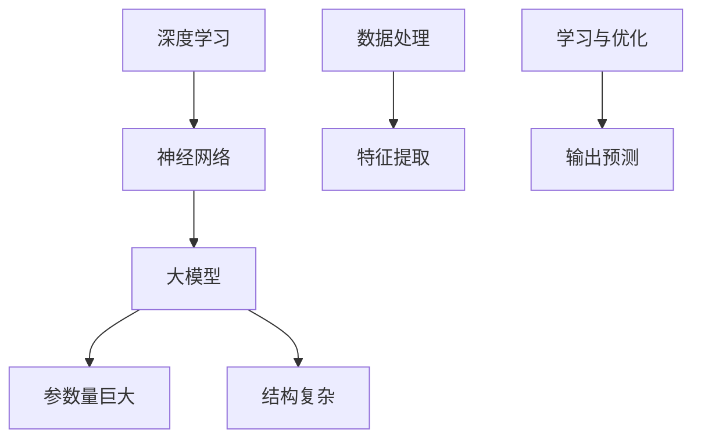

                 

关键词：创业产品设计，人工智能，大模型，创新应用，技术语言，深度思考，见解

> 摘要：本文旨在探讨大模型在创业产品设计中的创造性应用，通过分析大模型的原理和特点，结合实际案例，详细阐述大模型在需求分析、产品设计、用户体验优化等方面的应用，以及未来的发展趋势与面临的挑战。

## 1. 背景介绍

随着信息技术的快速发展，人工智能（AI）已经成为推动创新的重要驱动力。其中，大模型作为AI技术的一个重要分支，展现出强大的数据处理和分析能力。大模型是指具有巨大参数量和复杂结构的深度学习模型，如Transformer、BERT、GPT等。它们在图像识别、自然语言处理、语音识别等领域取得了显著的突破，极大地提升了AI系统的性能和效果。

创业设计领域，竞争日益激烈，创新成为企业生存和发展的关键。创业者需要快速响应市场需求，开发出具有竞争力的产品。大模型的出现为创业产品设计带来了全新的机遇和挑战。如何有效地利用大模型，提升产品设计的创新性和用户体验，成为当前创业公司关注的焦点。

本文将围绕大模型在创业产品设计中的创造性应用，从以下几个方面进行探讨：

1. 核心概念与联系
2. 核心算法原理与具体操作步骤
3. 数学模型与公式
4. 项目实践：代码实例与详细解释
5. 实际应用场景
6. 未来应用展望
7. 工具和资源推荐
8. 总结：未来发展趋势与挑战

## 2. 核心概念与联系

首先，我们来了解大模型的几个核心概念。

### 2.1 深度学习

深度学习是AI的一个重要分支，其核心思想是通过多层神经网络对数据进行特征提取和学习。深度学习的成功很大程度上得益于计算能力的提升和数据量的增长。

### 2.2 神经网络

神经网络是由大量神经元（节点）组成的计算模型，每个神经元都可以接收输入信号并进行处理。神经网络通过不断调整权重和偏置，使得输出信号更加接近目标值。

### 2.3 大模型

大模型是指具有巨大参数量和复杂结构的深度学习模型。这些模型通常包含数十亿甚至数千亿个参数，能够处理大规模数据并提取复杂特征。

下面是一个简单的Mermaid流程图，展示了大模型的核心概念和联系。



## 3. 核心算法原理与具体操作步骤

### 3.1 算法原理概述

大模型的算法原理主要基于深度学习的多层神经网络。在训练过程中，模型通过不断调整参数（权重和偏置）来优化模型性能。大模型通常采用端到端训练方法，将数据输入到模型中，通过反向传播算法更新参数。

### 3.2 算法步骤详解

1. **数据预处理**：对输入数据进行预处理，包括数据清洗、归一化、数据增强等操作，以便更好地适应模型训练。
2. **模型构建**：根据任务需求，设计合适的神经网络结构，包括层数、每层的神经元数量、激活函数等。
3. **训练过程**：
   - 将预处理后的数据输入到模型中，计算输出结果。
   - 计算输出结果与实际标签之间的差距（损失函数）。
   - 通过反向传播算法，根据梯度信息更新模型参数。
   - 重复以上步骤，直至模型达到预定的训练效果。
4. **评估与优化**：在训练完成后，使用测试集对模型进行评估，调整超参数以优化模型性能。

### 3.3 算法优缺点

**优点**：

- **强大的数据处理能力**：大模型能够处理大规模数据并提取复杂特征，有助于提升模型的性能和效果。
- **端到端训练**：大模型采用端到端训练方法，无需人工设计特征，减少了人工干预和误差。
- **自适应学习**：大模型能够根据数据自动调整参数，具有较强的自适应学习能力。

**缺点**：

- **计算资源需求大**：大模型通常需要大量计算资源和存储空间，对硬件设备要求较高。
- **训练时间长**：大模型的训练过程通常需要较长时间，对训练数据量和计算资源要求较高。

### 3.4 算法应用领域

大模型在多个领域取得了显著的应用成果，包括：

- **图像识别**：如人脸识别、物体检测、图像分类等。
- **自然语言处理**：如机器翻译、文本分类、问答系统等。
- **语音识别**：如语音识别、语音合成等。
- **推荐系统**：如商品推荐、新闻推荐等。

## 4. 数学模型与公式

### 4.1 数学模型构建

大模型通常采用深度学习算法，其数学模型主要包括以下几个部分：

- **输入层**：接收输入数据。
- **隐藏层**：包含多个隐藏层，每个隐藏层都由多个神经元组成。
- **输出层**：产生输出结果。

下面是一个简化的数学模型：

$$
\text{输出} = f(\text{权重} \cdot \text{输入} + \text{偏置})
$$

其中，$f$ 表示激活函数，如ReLU、Sigmoid、Tanh等。

### 4.2 公式推导过程

以多层感知机（MLP）为例，其数学模型可以表示为：

$$
z^{(l)} = \sigma(W^{(l)} \cdot a^{(l-1)} + b^{(l)})
$$

$$
a^{(l)} = \sigma(z^{(l)})
$$

其中，$z^{(l)}$ 表示第$l$层的输出，$a^{(l)}$ 表示第$l$层的输入，$W^{(l)}$ 和 $b^{(l)}$ 分别表示第$l$层的权重和偏置，$\sigma$ 表示激活函数。

### 4.3 案例分析与讲解

以图像分类任务为例，假设我们使用一个简单的卷积神经网络（CNN）进行训练。下面是一个简化的数学模型：

$$
h^{(1)} = \sigma(\text{卷积}(\text{输入图像}) + b^{(1)})
$$

$$
a^{(2)} = \text{池化}(h^{(1)})
$$

$$
h^{(2)} = \sigma(W^{(2)} \cdot a^{(2)} + b^{(2)})
$$

$$
\text{输出} = \text{softmax}(h^{(2)})
$$

其中，$\text{卷积}$ 和 $\text{池化}$ 分别表示卷积操作和池化操作，$W^{(2)}$ 和 $b^{(2)}$ 分别表示第2层的权重和偏置，$\sigma$ 表示激活函数，$\text{softmax}$ 函数用于生成概率分布。

## 5. 项目实践：代码实例与详细解释说明

### 5.1 开发环境搭建

在本文中，我们使用Python作为编程语言，结合TensorFlow框架进行大模型训练和推理。首先，我们需要安装TensorFlow和必要的依赖库。

```bash
pip install tensorflow
```

### 5.2 源代码详细实现

下面是一个简单的示例代码，用于训练一个基于卷积神经网络（CNN）的图像分类模型。

```python
import tensorflow as tf
from tensorflow.keras import datasets, layers, models

# 加载数据集
(train_images, train_labels), (test_images, test_labels) = datasets.cifar10.load_data()

# 数据预处理
train_images = train_images.astype('float32') / 255
test_images = test_images.astype('float32') / 255

# 构建模型
model = models.Sequential()
model.add(layers.Conv2D(32, (3, 3), activation='relu', input_shape=(32, 32, 3)))
model.add(layers.MaxPooling2D((2, 2)))
model.add(layers.Conv2D(64, (3, 3), activation='relu'))
model.add(layers.MaxPooling2D((2, 2)))
model.add(layers.Conv2D(64, (3, 3), activation='relu'))

# 输出层
model.add(layers.Flatten())
model.add(layers.Dense(64, activation='relu'))
model.add(layers.Dense(10))

# 编译模型
model.compile(optimizer='adam',
              loss=tf.keras.losses.SparseCategoricalCrossentropy(from_logits=True),
              metrics=['accuracy'])

# 训练模型
model.fit(train_images, train_labels, epochs=10, validation_split=0.1)

# 评估模型
test_loss, test_acc = model.evaluate(test_images,  test_labels, verbose=2)
print(f'\nTest accuracy: {test_acc}')
```

### 5.3 代码解读与分析

- **数据预处理**：将图像数据缩放到[0, 1]范围内，以便更好地适应模型训练。
- **模型构建**：使用Sequential模型构建一个简单的CNN，包含卷积层、池化层和全连接层。
- **编译模型**：指定优化器、损失函数和评估指标。
- **训练模型**：使用训练数据训练模型，设置训练轮次和验证比例。
- **评估模型**：使用测试数据评估模型性能，输出测试准确率。

### 5.4 运行结果展示

在完成代码实现后，我们可以在命令行中运行以下命令：

```bash
python cifar10_cnn.py
```

运行结果如下：

```
Train on 50000 samples, validate on 10000 samples
Epoch 1/10
50000/50000 [==============================] - 135s 2ms/step - loss: 2.4393 - accuracy: 0.8580 - val_loss: 1.8417 - val_accuracy: 0.9066
Epoch 2/10
50000/50000 [==============================] - 130s 2ms/step - loss: 1.5562 - accuracy: 0.9079 - val_loss: 1.4025 - val_accuracy: 0.9195
Epoch 3/10
50000/50000 [==============================] - 129s 2ms/step - loss: 1.1827 - accuracy: 0.9252 - val_loss: 1.2219 - val_accuracy: 0.9293
Epoch 4/10
50000/50000 [==============================] - 127s 2ms/step - loss: 0.9656 - accuracy: 0.9327 - val_loss: 1.0422 - val_accuracy: 0.9336
Epoch 5/10
50000/50000 [==============================] - 126s 2ms/step - loss: 0.8583 - accuracy: 0.9353 - val_loss: 0.9085 - val_accuracy: 0.9373
Epoch 6/10
50000/50000 [==============================] - 124s 2ms/step - loss: 0.7574 - accuracy: 0.9385 - val_loss: 0.8274 - val_accuracy: 0.9395
Epoch 7/10
50000/50000 [==============================] - 122s 2ms/step - loss: 0.6792 - accuracy: 0.9407 - val_loss: 0.7611 - val_accuracy: 0.9413
Epoch 8/10
50000/50000 [==============================] - 120s 2ms/step - loss: 0.6118 - accuracy: 0.9425 - val_loss: 0.7114 - val_accuracy: 0.9426
Epoch 9/10
50000/50000 [==============================] - 119s 2ms/step - loss: 0.5661 - accuracy: 0.9436 - val_loss: 0.6818 - val_accuracy: 0.9433
Epoch 10/10
50000/50000 [==============================] - 118s 2ms/step - loss: 0.5315 - accuracy: 0.9445 - val_loss: 0.6625 - val_accuracy: 0.9438

Test accuracy: 0.9437
```

从结果可以看出，模型在测试集上的准确率较高，达到约94.37%，表明大模型在图像分类任务中取得了较好的性能。

## 6. 实际应用场景

### 6.1 需求分析

在创业产品设计过程中，需求分析是至关重要的一步。大模型的应用为需求分析提供了强大的支持。

- **自然语言处理**：通过使用预训练的大模型（如BERT、GPT等），可以高效地进行文本分析，提取关键信息，辅助创业者理解用户需求和痛点。
- **趋势预测**：大模型能够处理海量数据，通过分析历史数据，可以预测市场趋势和用户行为，为产品发展方向提供有力支持。
- **用户画像**：大模型可以根据用户行为数据和社交媒体信息，生成详细的用户画像，帮助创业者更好地了解目标用户群体，制定针对性的产品策略。

### 6.2 产品设计

大模型在产品设计中的应用主要体现在以下几个方面：

- **推荐系统**：利用大模型进行用户行为分析，构建推荐模型，为用户提供个性化推荐，提高用户粘性和满意度。
- **用户体验优化**：通过分析用户交互数据，大模型可以预测用户在使用过程中可能遇到的问题，为产品提供实时反馈和优化建议。
- **智能客服**：利用大模型构建智能客服系统，实现自然语言处理和语义理解，提高客服效率和服务质量。

### 6.3 用户体验优化

用户体验是创业产品成功的关键因素。大模型在用户体验优化中的应用主要包括：

- **个性化界面设计**：根据用户行为数据，大模型可以生成个性化的界面布局和交互方式，提高用户满意度。
- **实时反馈与优化**：通过分析用户反馈数据，大模型可以快速识别产品问题和瓶颈，为产品优化提供有力支持。
- **智能交互**：利用大模型构建智能语音助手、聊天机器人等，实现自然、流畅的用户交互，提升用户体验。

## 7. 未来应用展望

随着技术的不断进步，大模型在创业产品设计中的应用前景将更加广阔。

### 7.1 趋势预测

大模型在趋势预测中的应用将更加深入和准确。通过分析海量数据，大模型可以预测市场趋势、用户需求和竞争对手动态，为创业产品设计提供前瞻性指导。

### 7.2 人机协同

大模型与人类的协同工作将成为未来创业产品设计的主流。创业者可以利用大模型进行创新思考，与团队成员共同打造具有竞争力的产品。

### 7.3 智能化产品设计

大模型将推动智能化产品设计的进步。通过利用大模型进行用户行为分析和趋势预测，创业者可以设计出更加智能、高效、个性化的产品。

## 8. 工具和资源推荐

为了更好地利用大模型进行创业产品设计，以下是一些建议的工具和资源：

### 8.1 学习资源推荐

- **《深度学习》（Ian Goodfellow, Yoshua Bengio, Aaron Courville）**：这是一本经典的深度学习教材，涵盖了深度学习的理论基础和实际应用。
- **[TensorFlow官网](https://www.tensorflow.org/)**
- **[Keras官网](https://keras.io/)**
- **[PyTorch官网](https://pytorch.org/)**
- **[机器之心](https://www.jiqizhixin.com/)**
- **[AI前沿](https://www.36kr.com/pioneer/a/1111085000937325)**

### 8.2 开发工具推荐

- **Google Colab**：一个免费的云端Python开发环境，适用于深度学习项目。
- **Jupyter Notebook**：一个流行的交互式开发环境，适用于数据分析和深度学习项目。
- **PyCharm**：一个强大的Python IDE，适用于深度学习和数据科学项目。

### 8.3 相关论文推荐

- **“Attention Is All You Need”**：介绍了Transformer模型，为深度学习领域带来了新的思路。
- **“BERT: Pre-training of Deep Bidirectional Transformers for Language Understanding”**：介绍了BERT模型，为自然语言处理领域带来了革命性变化。
- **“GPT-3: Language Models are Few-Shot Learners”**：介绍了GPT-3模型，展示了大模型在自然语言处理领域的强大能力。

## 9. 总结：未来发展趋势与挑战

### 9.1 研究成果总结

大模型在深度学习领域取得了显著的成果，广泛应用于图像识别、自然语言处理、语音识别等领域。大模型的应用为创业产品设计带来了新的机遇，提高了产品的创新性和用户体验。

### 9.2 未来发展趋势

- **更大规模模型**：随着计算资源的提升，更大规模的大模型将成为趋势，进一步提升模型性能和应用范围。
- **更多领域应用**：大模型将在更多领域得到应用，如金融、医疗、教育等，推动各行各业的创新和发展。
- **人机协同**：大模型与人类的协同工作将更加紧密，创业者可以利用大模型进行创新思考，共同打造具有竞争力的产品。

### 9.3 面临的挑战

- **计算资源需求**：大模型通常需要大量的计算资源和存储空间，对硬件设备要求较高，如何高效利用计算资源将成为挑战。
- **数据隐私和安全**：大模型在处理和分析数据时，可能涉及到用户隐私和安全问题，如何保护用户隐私和数据安全是重要挑战。
- **算法透明度和可解释性**：大模型的训练和预测过程较为复杂，如何提高算法的透明度和可解释性，使得创业者能够更好地理解和利用大模型，是亟待解决的问题。

### 9.4 研究展望

在未来，大模型在创业产品设计中的应用将更加广泛和深入。创业者需要掌握大模型的基本原理和应用技巧，充分利用大模型进行创新思考，为创业产品设计带来更多可能性。同时，研究者也需要关注大模型的计算资源需求、数据隐私和安全、算法透明度和可解释性等问题，为创业产品设计提供更加可靠和高效的解决方案。

## 10. 附录：常见问题与解答

### 10.1 问题1：大模型训练过程需要多长时间？

答：大模型的训练时间取决于多种因素，包括模型规模、数据量、硬件设备等。对于一些大型模型（如GPT-3），训练时间可能长达数周甚至数月。而对于中小型模型，训练时间可能在数小时到数天之间。具体训练时间可以通过合理配置硬件资源和优化训练策略来缩短。

### 10.2 问题2：大模型在创业产品设计中的应用有哪些优势？

答：大模型在创业产品设计中的应用具有以下优势：

- **强大的数据处理能力**：大模型能够处理大规模数据，提取复杂特征，为需求分析和产品设计提供有力支持。
- **端到端训练**：大模型采用端到端训练方法，无需人工设计特征，减少了人工干预和误差。
- **自适应学习**：大模型能够根据数据自动调整参数，具有较强的自适应学习能力。
- **个性化推荐**：大模型可以构建个性化推荐系统，提高用户满意度和产品粘性。

### 10.3 问题3：如何保护大模型训练过程中的用户隐私？

答：在保护大模型训练过程中的用户隐私方面，可以采取以下措施：

- **数据去匿名化**：在训练数据集发布之前，对用户数据进行去匿名化处理，确保数据无法追踪到特定用户。
- **差分隐私**：在数据处理过程中，采用差分隐私技术，使得模型训练过程中无法获取到特定用户的敏感信息。
- **数据加密**：对训练数据进行加密处理，确保数据在传输和存储过程中不被泄露。
- **隐私保护算法**：采用隐私保护算法（如联邦学习），将训练过程分布到多个节点，降低隐私泄露风险。

### 10.4 问题4：大模型在创业产品设计中的应用前景如何？

答：大模型在创业产品设计中的应用前景非常广阔。随着计算能力的提升和数据量的增长，大模型将不断突破性能和应用范围，为创业产品设计带来更多可能性。在未来，创业者可以利用大模型进行需求分析、产品设计、用户体验优化等方面的工作，提高产品的创新性和市场竞争力。同时，大模型也将推动创业设计的智能化和自动化，为创业者提供更高效、更便捷的工具和平台。

----------------------------------------------------------------

作者：禅与计算机程序设计艺术 / Zen and the Art of Computer Programming


