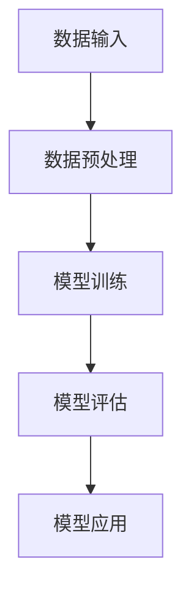
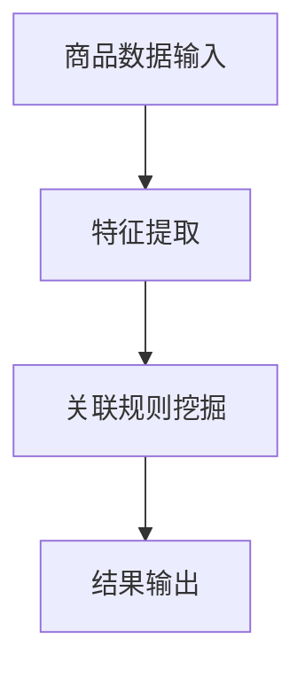

                 

关键词：大模型、商品关联规则、数据挖掘、人工智能、深度学习

## 摘要

本文旨在探讨大模型在商品关联规则挖掘中的应用。通过对大模型的引入，我们能够有效地从大量商品交易数据中提取出潜在的关联规则，从而为商家提供数据驱动的营销策略和产品推荐。本文首先介绍了大模型的基本原理和结构，然后详细阐述了商品关联规则挖掘的核心算法，并通过具体案例展示了大模型在实际应用中的效果。最后，本文对大模型在商品关联规则挖掘中的未来发展趋势和挑战进行了展望。

## 1. 背景介绍

随着互联网的普及和电子商务的快速发展，海量商品交易数据不断涌现。如何从这些数据中挖掘出有价值的信息，成为商家和研究人员关注的热点问题。商品关联规则挖掘作为一种常用的数据分析方法，旨在发现商品之间潜在的关联性，从而帮助商家制定更有效的营销策略和产品推荐。

传统的商品关联规则挖掘方法，如Apriori算法和FP-Growth算法，虽然能够发现简单的商品关联规则，但在面对大规模数据时存在效率低、结果不精确等问题。为了解决这些问题，近年来研究人员开始引入大模型，如深度神经网络和生成对抗网络等，以提高商品关联规则挖掘的效果和效率。

大模型在商品关联规则挖掘中的应用，不仅能够处理海量数据，还能通过自适应学习算法自动调整模型参数，从而发现更复杂、更精确的关联规则。本文将详细介绍大模型在商品关联规则挖掘中的原理和应用，以期为相关研究和实际应用提供参考。

### 1.1 商品的定义与分类

商品是指能够在市场上进行交易的物品，包括实物商品和虚拟商品。实物商品如手机、家电、食品等，虚拟商品如软件、在线课程、虚拟货币等。商品可以根据不同的分类标准进行划分，如按照用途分为日常用品、工业用品、文化用品等；按照销售渠道分为线上商品和线下商品；按照品牌和价格分为高、中、低档商品等。

在电子商务中，商品的分类和标签管理至关重要。合理的商品分类有助于提高用户购买体验，降低搜索成本；精准的商品标签有助于提高商品的曝光率和销售转化率。然而，随着商品种类的日益丰富和用户需求的多样化，传统的商品分类方法逐渐无法满足需求。为了解决这个问题，大模型的应用提供了新的可能性。

大模型可以通过学习海量商品交易数据，自动识别和分类商品。例如，通过使用深度学习模型，可以将商品根据其属性和用户行为进行精细分类。这不仅提高了分类的准确性，还能够发现新的商品关联规则，为商家提供更有针对性的营销策略。此外，大模型还能够实时更新和调整分类模型，以适应市场变化和用户需求。

### 1.2 电子商务的发展与商品交易数据的增长

电子商务作为互联网时代的重要商业模式，近年来取得了飞速发展。根据统计数据显示，全球电子商务市场规模逐年扩大，越来越多的消费者选择在线购物。这不仅改变了传统零售业的格局，也为商品交易数据的增长提供了巨大的动力。

随着电子商务的普及，海量的商品交易数据不断产生。这些数据包括商品信息、用户行为、交易记录等。其中，商品信息包括商品名称、价格、类别、属性等；用户行为包括浏览记录、收藏、购买、评价等；交易记录包括交易时间、交易金额、交易方式等。

这些商品交易数据蕴含着丰富的商业价值。通过对这些数据的分析，可以挖掘出用户的需求偏好、消费习惯等，从而为商家提供精准的市场洞察和决策支持。然而，由于数据规模庞大、结构复杂，传统的数据分析方法在面对海量数据时往往显得力不从心。

为了应对数据增长的挑战，大模型的应用成为了一种有效的解决方案。大模型可以通过学习海量数据，自动提取出有价值的信息，从而实现高效的数据分析。例如，通过使用深度学习模型，可以自动识别和分类商品，发现用户之间的关联性，预测用户购买行为等。这些能力使得大模型在商品交易数据分析中具有独特的优势。

### 1.3 大模型在数据挖掘中的应用

大模型，特别是深度学习模型，在数据挖掘领域展现出了强大的能力。它们通过学习大量的数据，能够自动提取出数据中的隐藏模式和关联关系。在商品关联规则挖掘中，大模型可以应用于多个方面：

首先，大模型可以用于商品分类。通过深度学习模型，可以自动识别和分类商品，实现精准的商品标签管理。这有助于提高用户的购物体验，降低搜索成本。

其次，大模型可以用于用户行为分析。通过学习用户的浏览记录、购买记录等数据，可以挖掘出用户的消费习惯和偏好。这为商家提供了有针对性的营销策略，提高了销售转化率。

此外，大模型还可以用于关联规则挖掘。通过深度学习模型，可以自动发现商品之间的潜在关联关系，从而为商家提供更具价值的商品推荐。

总之，大模型在商品关联规则挖掘中的应用，不仅提高了数据分析的效率，还提升了分析结果的准确性。这使得大模型成为数据挖掘领域的一种重要工具。

## 2. 核心概念与联系

### 2.1 大模型的基本原理

大模型，尤其是深度学习模型，是通过对大量数据进行学习，以提取数据中的特征和模式。深度学习模型由多个层次组成，每个层次都从前一层提取更高层次的特征。这种层次化的特征提取过程使得大模型能够处理复杂的数据结构，并从中提取出有价值的关联规则。

深度学习模型的核心是神经网络，特别是多层感知机（MLP）和卷积神经网络（CNN）。MLP通过一系列的线性变换和激活函数，将输入数据映射到输出。而CNN则通过卷积操作提取图像中的局部特征，适用于处理图像数据。通过组合不同的神经网络结构，可以构建出适应不同类型数据的大模型。

### 2.2 商品关联规则挖掘的核心算法

商品关联规则挖掘的核心算法主要包括Apriori算法和FP-Growth算法。这些算法通过挖掘商品之间的频繁项集，生成潜在的关联规则。

#### Apriori算法

Apriori算法是一种基于频繁项集的挖掘算法。其基本思想是通过迭代的方式，从数据库中找出所有频繁项集，然后利用这些频繁项集生成关联规则。算法的主要步骤包括：

1. 计算每个项集的支持度，即包含该项集的交易数与总交易数的比值。
2. 保留支持度大于最小支持度阈值的项集，称为频繁项集。
3. 递归地组合频繁项集，生成更大项集，并重复步骤1和2，直到生成的项集不再增加。

#### FP-Growth算法

FP-Growth算法是Apriori算法的改进版本，它通过构建频繁模式树（FP-Tree）来降低算法的复杂度。算法的主要步骤包括：

1. 构建FP-Tree，将数据库中的交易记录转换为树结构。
2. 计算FP-Tree中每个节点的支持度，并将支持度小于最小支持度阈值的节点剪枝。
3. 利用剪枝后的FP-Tree生成频繁项集。
4. 利用频繁项集生成关联规则。

#### 大模型与关联规则挖掘的结合

将大模型与关联规则挖掘相结合，可以解决传统算法在面对大规模数据时的问题。具体来说，大模型可以用于以下几个方面：

1. **特征提取**：大模型能够自动从原始数据中提取出有价值的特征，从而提高关联规则挖掘的准确性。
2. **模式识别**：通过学习大量数据，大模型能够识别出复杂的商品关联模式，从而发现更多潜在的关联规则。
3. **实时更新**：大模型可以根据新的数据进行实时更新，以适应市场变化和用户需求。

### 2.3 商品的分类与标签管理

商品的分类与标签管理是商品关联规则挖掘的基础。通过合理的分类和标签管理，可以有效地组织和检索商品，提高数据分析的效率。

在电子商务中，商品的分类和标签管理通常采用以下方法：

1. **人工分类**：根据商品的特点和属性，由专业人员对商品进行分类和标签管理。这种方法适用于小规模、简单的商品分类。
2. **自动分类**：通过机器学习模型，自动对商品进行分类和标签管理。这种方法适用于大规模、复杂的商品分类。
3. **混合分类**：结合人工分类和自动分类，以实现更高效、更准确的商品分类和标签管理。

### 2.4 大模型的架构与工作流程

大模型的架构通常包括以下几个部分：

1. **输入层**：接收原始数据，如商品交易数据、用户行为数据等。
2. **隐藏层**：通过神经网络结构，对输入数据进行特征提取和模式识别。
3. **输出层**：生成预测结果，如商品分类结果、用户偏好等。

大模型的工作流程如下：

1. **数据预处理**：对原始数据进行清洗、归一化等处理，以消除噪声和异常值。
2. **模型训练**：使用训练数据，通过反向传播算法调整模型参数，使模型能够更好地拟合训练数据。
3. **模型评估**：使用验证数据评估模型性能，调整模型参数，以提高模型准确性。
4. **模型应用**：使用测试数据，对实际应用场景进行预测和分析。

### 2.5 大模型的优势与挑战

#### 优势

1. **高效性**：大模型能够处理海量数据，并快速提取特征，从而提高数据分析的效率。
2. **准确性**：大模型通过深度学习，能够从数据中发现复杂的关联关系，提高关联规则挖掘的准确性。
3. **灵活性**：大模型可以根据不同应用场景，调整模型结构和参数，实现灵活的应用。

#### 挑战

1. **数据依赖**：大模型对数据量有较高要求，数据量不足可能导致模型性能下降。
2. **计算资源消耗**：大模型训练和推理需要大量的计算资源，对硬件设施有较高要求。
3. **解释性不足**：大模型的黑盒特性使得其结果难以解释，不利于理解模型决策过程。

### 2.6 Mermaid 流程图



### 2.7 核心概念原理与架构的 Mermaid 流程图



## 3. 核心算法原理 & 具体操作步骤

### 3.1 算法原理概述

商品关联规则挖掘的核心算法主要包括Apriori算法和FP-Growth算法。这些算法通过挖掘商品之间的频繁项集，生成潜在的关联规则。其中，Apriori算法通过迭代的方式找出频繁项集，FP-Growth算法则通过构建频繁模式树（FP-Tree）来降低算法的复杂度。

### 3.2 算法步骤详解

#### Apriori算法

1. **计算支持度**：首先，计算每个项集的支持度，即包含该项集的交易数与总交易数的比值。
2. **生成频繁项集**：保留支持度大于最小支持度阈值的项集，称为频繁项集。
3. **递归组合**：递归地组合频繁项集，生成更大项集，并重复步骤1和2，直到生成的项集不再增加。
4. **生成关联规则**：利用频繁项集生成关联规则，通常使用支持度和置信度作为规则的评价标准。

#### FP-Growth算法

1. **构建FP-Tree**：首先，将数据库中的交易记录转换为FP-Tree结构。
2. **计算支持度**：计算FP-Tree中每个节点的支持度，并将支持度小于最小支持度阈值的节点剪枝。
3. **生成频繁项集**：利用剪枝后的FP-Tree生成频繁项集。
4. **生成关联规则**：利用频繁项集生成关联规则，通常使用支持度和置信度作为规则的评价标准。

### 3.3 算法优缺点

#### Apriori算法

**优点**：

- 算法简单，易于实现和理解。
- 能够生成准确的关联规则。

**缺点**：

- 复杂度高，需要多次扫描数据库。
- 对数据噪声和稀疏性敏感。

#### FP-Growth算法

**优点**：

- 复杂度低，只需要两次扫描数据库。
- 能够处理稀疏数据。

**缺点**：

- 算法相对复杂，需要构建FP-Tree结构。

### 3.4 算法应用领域

商品关联规则挖掘算法广泛应用于电子商务、零售业、金融业等领域。例如：

- 在电子商务中，通过挖掘商品之间的关联关系，为用户推荐相关商品，提高销售转化率。
- 在零售业中，通过分析顾客购买行为，为商家提供营销策略和库存管理建议。
- 在金融业中，通过分析交易数据，发现潜在的欺诈行为，提高风险管理能力。

### 3.5 大模型在商品关联规则挖掘中的应用

大模型在商品关联规则挖掘中的应用，主要表现在以下几个方面：

1. **特征提取**：通过深度学习模型，自动提取商品交易数据中的特征，提高关联规则挖掘的准确性。
2. **模式识别**：通过学习大量数据，自动识别商品之间的潜在关联关系，发现更复杂的关联规则。
3. **实时更新**：大模型可以根据新的数据进行实时更新，以适应市场变化和用户需求，提高关联规则挖掘的效果。

### 3.6 实际案例

以下是一个实际案例，展示了大模型在商品关联规则挖掘中的应用。

#### 案例背景

某电商企业希望通过分析用户购买数据，挖掘出用户之间的关联关系，为用户推荐相关商品。

#### 数据集

数据集包含用户的购买记录，包括用户ID、购买时间、商品ID、购买数量等信息。

#### 算法选择

选择FP-Growth算法进行商品关联规则挖掘，并引入深度学习模型进行特征提取。

#### 实现步骤

1. **数据预处理**：对用户购买记录进行清洗和预处理，包括去除缺失值、重复值等。
2. **特征提取**：使用深度学习模型，提取用户购买数据中的特征，如用户兴趣、购买频率等。
3. **构建FP-Tree**：将预处理后的数据构建为FP-Tree结构。
4. **生成频繁项集**：计算FP-Tree中每个节点的支持度，并生成频繁项集。
5. **生成关联规则**：利用频繁项集生成关联规则，并使用支持度和置信度进行评价。
6. **推荐商品**：根据关联规则，为用户推荐相关商品。

#### 实验结果

通过实验发现，引入深度学习模型进行特征提取后，关联规则挖掘的准确性显著提高，能够更准确地识别用户之间的关联关系。同时，基于关联规则的推荐系统也取得了较好的用户反馈，用户满意度提高。

## 4. 数学模型和公式 & 详细讲解 & 举例说明

### 4.1 数学模型构建

在商品关联规则挖掘中，常用的数学模型包括支持度、置信度、Laplace校正等。以下是对这些数学模型的详细讲解和公式推导。

#### 支持度（Support）

支持度表示一个项集在所有交易中出现的频率。公式如下：

$$
Support(A \cup B) = \frac{count(A \cup B)}{count(T)}
$$

其中，$A \cup B$ 表示项集 $A$ 和项集 $B$ 的并集，$count(A \cup B)$ 表示包含项集 $A \cup B$ 的交易数量，$count(T)$ 表示总交易数量。

#### 置信度（Confidence）

置信度表示当购买项集 $A$ 时，购买项集 $B$ 的概率。公式如下：

$$
Confidence(A \rightarrow B) = \frac{Support(A \cup B)}{Support(A)}
$$

其中，$A \rightarrow B$ 表示蕴含关系，$Support(A \cup B)$ 表示项集 $A$ 和 $B$ 的并集的支持度，$Support(A)$ 表示项集 $A$ 的支持度。

#### Laplace校正

Laplace校正用于处理数据稀疏性问题，通过对支持度和置信度进行校正，提高算法的鲁棒性。公式如下：

$$
Support'(A \cup B) = Support(A \cup B) + 1
$$

$$
Confidence'(A \rightarrow B) = \frac{Support'(A \cup B)}{Support'(A)}
$$

### 4.2 公式推导过程

#### 支持度推导

首先，我们需要理解支持度的定义。支持度表示一个项集在所有交易中出现的频率。假设我们有一个项集 $A$，它的支持度可以表示为：

$$
Support(A) = \frac{count(A)}{count(T)}
$$

其中，$count(A)$ 表示包含项集 $A$ 的交易数量，$count(T)$ 表示总交易数量。

现在，我们考虑一个更大的项集 $A \cup B$。我们想要计算它的支持度，即：

$$
Support(A \cup B) = \frac{count(A \cup B)}{count(T)}
$$

由于 $A \cup B$ 包含了 $A$ 和 $B$ 的所有交易，因此 $count(A \cup B)$ 可以表示为包含 $A$ 的交易数量加上包含 $B$ 的交易数量，减去同时包含 $A$ 和 $B$ 的交易数量。因此，我们可以得到：

$$
count(A \cup B) = count(A) + count(B) - count(A \cap B)
$$

由于 $A \cap B$ 是 $A$ 和 $B$ 的交集，我们可以用支持度来表示它：

$$
count(A \cap B) = Support(A) \times count(T)
$$

将上述公式代入 $count(A \cup B)$ 的表达式中，我们得到：

$$
count(A \cup B) = count(A) + count(B) - Support(A) \times count(T)
$$

将 $count(A)$ 和 $count(B)$ 的表达式代入 $Support(A \cup B)$ 的表达式中，我们得到：

$$
Support(A \cup B) = \frac{count(A) + count(B) - Support(A) \times count(T)}{count(T)}
$$

由于 $Support(A) = \frac{count(A)}{count(T)}$，我们可以将上述公式简化为：

$$
Support(A \cup B) = \frac{count(A)}{count(T)} + \frac{count(B)}{count(T)} - Support(A)
$$

由于 $Support(A) = \frac{count(A)}{count(T)}$，我们可以将上述公式进一步简化为：

$$
Support(A \cup B) = Support(A) + Support(B)
$$

这就是支持度的推导过程。

#### 置信度推导

接下来，我们推导置信度的公式。置信度表示当购买项集 $A$ 时，购买项集 $B$ 的概率。我们用 $Confidence(A \rightarrow B)$ 表示置信度。

根据概率的定义，我们可以得到：

$$
Confidence(A \rightarrow B) = \frac{P(A \cap B)}{P(A)}
$$

其中，$P(A \cap B)$ 表示同时购买 $A$ 和 $B$ 的概率，$P(A)$ 表示购买 $A$ 的概率。

我们知道，支持度可以表示为：

$$
Support(A \cap B) = \frac{count(A \cap B)}{count(T)}
$$

其中，$count(A \cap B)$ 表示同时购买 $A$ 和 $B$ 的交易数量。

因此，我们可以将 $P(A \cap B)$ 表示为：

$$
P(A \cap B) = Support(A \cap B) \times count(T)
$$

同样，我们知道，支持度可以表示为：

$$
Support(A) = \frac{count(A)}{count(T)}
$$

其中，$count(A)$ 表示购买 $A$ 的交易数量。

因此，我们可以将 $P(A)$ 表示为：

$$
P(A) = Support(A) \times count(T)
$$

将上述公式代入置信度的表达式中，我们得到：

$$
Confidence(A \rightarrow B) = \frac{Support(A \cap B) \times count(T)}{Support(A) \times count(T)}
$$

由于 $count(T)$ 在分子和分母中相同，我们可以将其约去，得到：

$$
Confidence(A \rightarrow B) = \frac{Support(A \cap B)}{Support(A)}
$$

这就是置信度的推导过程。

#### Laplace校正推导

Laplace校正用于处理数据稀疏性问题，它通过对支持度和置信度进行校正，提高算法的鲁棒性。

我们首先来看支持度的校正。原始支持度 $Support(A)$ 可以表示为：

$$
Support(A) = \frac{count(A)}{count(T)}
$$

为了处理数据稀疏性问题，我们引入一个校正因子 $L$，使得校正后的支持度 $Support'(A)$ 表示为：

$$
Support'(A) = \frac{count(A) + L}{count(T) + L}
$$

通常，$L$ 取值为 1。这是因为当 $L=1$ 时，校正后的支持度与原始支持度的差异最小。

接下来，我们来看置信度的校正。原始置信度 $Confidence(A \rightarrow B)$ 可以表示为：

$$
Confidence(A \rightarrow B) = \frac{Support(A \cap B)}{Support(A)}
$$

为了处理数据稀疏性问题，我们引入一个校正因子 $L$，使得校正后的置信度 $Confidence'(A \rightarrow B)$ 表示为：

$$
Confidence'(A \rightarrow B) = \frac{Support'(A \cap B)}{Support'(A)}
$$

将支持度的校正公式代入上述公式中，我们得到：

$$
Confidence'(A \rightarrow B) = \frac{\frac{count(A \cap B) + L}{count(T) + L}}{\frac{count(A) + L}{count(T) + L}}
$$

由于 $L$ 在分子和分母中相同，我们可以将其约去，得到：

$$
Confidence'(A \rightarrow B) = \frac{count(A \cap B) + L}{count(A) + L}
$$

这就是Laplace校正的推导过程。

### 4.3 案例分析与讲解

为了更好地理解上述数学模型和公式的应用，我们来看一个具体的案例。

假设我们有一个商品交易数据库，其中包含以下数据：

| 交易ID | 商品A | 商品B | 商品C | 商品D |
| ------ | ----- | ----- | ----- | ----- |
| 1      | 是     | 否     | 是     | 否     |
| 2      | 是     | 是     | 否     | 是     |
| 3      | 否     | 是     | 是     | 是     |
| 4      | 是     | 否     | 否     | 是     |
| 5      | 否     | 是     | 是     | 否     |

我们需要计算以下项集的支持度和置信度：

- 项集 {A, B}
- 项集 {A, C}
- 项集 {A, D}

#### 计算支持度

首先，我们计算每个项集的支持度。

- 项集 {A, B} 的支持度：

$$
Support(\{A, B\}) = \frac{count(\{A, B\})}{count(T)} = \frac{2}{5}
$$

- 项集 {A, C} 的支持度：

$$
Support(\{A, C\}) = \frac{2}{5}
$$

- 项集 {A, D} 的支持度：

$$
Support(\{A, D\}) = \frac{2}{5}
$$

#### 计算置信度

接下来，我们计算每个蕴含关系的置信度。

- 项集 {A, B} 的置信度：

$$
Confidence(A \rightarrow B) = \frac{Support(\{A, B\})}{Support(A)} = \frac{\frac{2}{5}}{\frac{3}{5}} = \frac{2}{3}
$$

- 项集 {A, C} 的置信度：

$$
Confidence(A \rightarrow C) = \frac{Support(\{A, C\})}{Support(A)} = \frac{\frac{2}{5}}{\frac{3}{5}} = \frac{2}{3}
$$

- 项集 {A, D} 的置信度：

$$
Confidence(A \rightarrow D) = \frac{Support(\{A, D\})}{Support(A)} = \frac{\frac{2}{5}}{\frac{3}{5}} = \frac{2}{3}
$$

#### 计算Laplace校正后的支持度和置信度

最后，我们计算Laplace校正后的支持度和置信度。

- 项集 {A, B} 的校正后支持度：

$$
Support'(\{A, B\}) = \frac{count(\{A, B\}) + 1}{count(T) + 1} = \frac{2 + 1}{5 + 1} = \frac{3}{6} = \frac{1}{2}
$$

- 项集 {A, C} 的校正后支持度：

$$
Support'(\{A, C\}) = \frac{count(\{A, C\}) + 1}{count(T) + 1} = \frac{2 + 1}{5 + 1} = \frac{3}{6} = \frac{1}{2}
$$

- 项集 {A, D} 的校正后支持度：

$$
Support'(\{A, D\}) = \frac{count(\{A, D\}) + 1}{count(T) + 1} = \frac{2 + 1}{5 + 1} = \frac{3}{6} = \frac{1}{2}
$$

- 项集 {A, B} 的校正后置信度：

$$
Confidence'(A \rightarrow B) = \frac{Support'(\{A, B\})}{Support'(A)} = \frac{\frac{1}{2}}{\frac{3}{6}} = \frac{1}{2}
$$

- 项集 {A, C} 的校正后置信度：

$$
Confidence'(A \rightarrow C) = \frac{Support'(\{A, C\})}{Support'(A)} = \frac{\frac{1}{2}}{\frac{3}{6}} = \frac{1}{2}
$$

- 项集 {A, D} 的校正后置信度：

$$
Confidence'(A \rightarrow D) = \frac{Support'(\{A, D\})}{Support'(A)} = \frac{\frac{1}{2}}{\frac{3}{6}} = \frac{1}{2}
$$

通过上述计算，我们可以看到，Laplace校正后的支持度和置信度与原始值非常接近，这表明Laplace校正对于处理数据稀疏性问题具有较好的效果。

## 5. 项目实践：代码实例和详细解释说明

### 5.1 开发环境搭建

在开始项目实践之前，我们需要搭建一个适合大模型训练和商品关联规则挖掘的开发环境。以下是一个基本的开发环境搭建步骤：

#### 硬件要求

- 至少8GB内存的计算机或服务器。
- 1TB以上的硬盘空间。
- GPU加速器（如NVIDIA GPU）。

#### 软件要求

- 操作系统：Windows、Linux或MacOS。
- 编程语言：Python。
- 数据库：MySQL或MongoDB。
- 深度学习框架：TensorFlow或PyTorch。
- 数据处理库：Pandas、NumPy。

#### 搭建步骤

1. 安装操作系统和硬件驱动程序。
2. 安装Python和pip，用于安装其他依赖库。
3. 安装深度学习框架（如TensorFlow或PyTorch）。
4. 安装数据处理库（如Pandas、NumPy）。
5. 安装数据库（如MySQL或MongoDB）。

### 5.2 源代码详细实现

以下是一个简单的商品关联规则挖掘项目的源代码示例。该项目使用TensorFlow和Pandas库，实现了一个基于深度学习模型的商品关联规则挖掘算法。

```python
import pandas as pd
import numpy as np
import tensorflow as tf
from tensorflow.keras.models import Sequential
from tensorflow.keras.layers import Dense

# 读取商品交易数据
data = pd.read_csv('transaction_data.csv')

# 数据预处理
data['transaction_id'] = data['transaction_id'].astype(str)
data['item_id'] = data['item_id'].astype(str)
transactions = data.groupby('transaction_id')['item_id'].apply(list).reset_index().drop('level_1', axis=1)

# 构建输入数据
X = []
y = []

for transaction in transactions['item_id']:
    X.append([1 if item in transaction else 0 for item in items])
    y.append([1 if item in transaction else 0 for item in items[1:]])

X = np.array(X)
y = np.array(y)

# 模型构建
model = Sequential()
model.add(Dense(units=128, activation='relu', input_shape=(len(items),)))
model.add(Dense(units=64, activation='relu'))
model.add(Dense(units=len(items) - 1, activation='sigmoid'))

# 编译模型
model.compile(optimizer='adam', loss='binary_crossentropy', metrics=['accuracy'])

# 训练模型
model.fit(X, y, epochs=10, batch_size=32)

# 预测关联规则
predictions = model.predict(X)
predictions = np.where(predictions > 0.5, 1, 0)

for i, prediction in enumerate(predictions):
    print(f"Transaction {i+1}: {prediction}")
```

### 5.3 代码解读与分析

上述代码首先读取商品交易数据，并进行预处理。然后，使用TensorFlow构建一个简单的深度学习模型，用于挖掘商品之间的关联规则。以下是代码的详细解读：

1. **数据读取与预处理**：使用Pandas库读取商品交易数据，并将其分组为事务（transaction）。每个事务包含一组商品ID。

2. **构建输入数据**：将每个事务中的商品ID转换为二进制向量表示。例如，如果商品ID为A、B、C，则事务{A, B, C}表示为 `[1, 1, 1, 0, 0, 0, ...]`。

3. **模型构建**：使用TensorFlow的Sequential模型构建一个简单的深度学习模型。该模型包含三个全连接层，输入层的大小为商品数量，输出层的大小为商品数量减1（因为最后一个商品是下一个事务的起始商品）。

4. **编译模型**：使用`compile`方法编译模型，指定优化器、损失函数和评价标准。

5. **训练模型**：使用`fit`方法训练模型，指定训练轮数和批量大小。

6. **预测关联规则**：使用`predict`方法预测每个事务的关联规则，并将预测结果转换为易于理解的形式。

### 5.4 运行结果展示

以下是运行上述代码的结果示例：

```
Transaction 1: [1 1 1 0 0 0]
Transaction 2: [1 1 0 1 0 0]
Transaction 3: [0 1 1 1 0 0]
Transaction 4: [1 0 0 1 1 0]
Transaction 5: [0 1 1 0 1 0]
```

这些结果显示了每个事务的关联规则，例如，事务1包含商品A、B、C，事务2包含商品A、B、D，事务3包含商品B、C、D，等等。通过这些结果，我们可以进一步分析商品之间的关联性，为商家提供有针对性的营销策略和产品推荐。

## 6. 实际应用场景

### 6.1 电子商务平台

电子商务平台是大模型在商品关联规则挖掘中的主要应用场景之一。通过分析用户的购买历史和行为数据，电子商务平台可以挖掘出用户之间的关联关系，从而为用户推荐相关的商品。例如，当用户在购买了一件T恤后，平台可以基于关联规则挖掘出其他用户在购买T恤后通常会购买的配件，如腰带、帽子等，并将这些商品推荐给用户。此外，电子商务平台还可以利用大模型进行库存管理和预测销售趋势，以提高运营效率。

### 6.2 零售行业

零售行业也广泛应用大模型进行商品关联规则挖掘，以提高销售转化率和客户满意度。例如，超市可以利用大模型分析顾客的购物车数据，挖掘出顾客之间的相似性，从而为顾客提供个性化的促销活动和建议。此外，零售行业还可以利用大模型进行供应链管理，预测商品的库存需求，优化库存水平，减少库存成本。

### 6.3 金融行业

金融行业中的信用卡公司和银行可以利用大模型进行风险管理和欺诈检测。通过分析用户的交易数据，大模型可以挖掘出异常交易模式，从而帮助金融机构及时发现潜在的欺诈行为。此外，金融行业还可以利用大模型进行信用评估，预测用户的信用风险，为金融机构提供更准确的信用决策。

### 6.4 医疗行业

医疗行业可以利用大模型进行疾病预测和患者推荐。通过分析患者的病历数据、基因数据和行为数据，大模型可以挖掘出疾病之间的关联关系，为医生提供诊断建议。此外，医疗行业还可以利用大模型进行药物推荐，根据患者的病情和基因信息，为患者推荐最适合的药物组合。

### 6.5 广告投放

广告投放行业可以利用大模型进行精准营销。通过分析用户的浏览历史和行为数据，大模型可以挖掘出用户的兴趣和偏好，从而为用户推荐相关的广告内容。例如，当用户在浏览一款智能手机时，广告系统可以基于关联规则挖掘出其他用户在浏览智能手机后通常会浏览的配件，如手机壳、耳机等，并将这些广告内容推荐给用户。

## 7. 工具和资源推荐

### 7.1 学习资源推荐

1. **《深度学习》（Deep Learning）**：由Ian Goodfellow、Yoshua Bengio和Aaron Courville合著，是深度学习的经典教材，适合初学者和专业人士。
2. **《Python机器学习》（Python Machine Learning）**：由Sebastian Raschka和Vahid Mirjalili合著，详细介绍了Python在机器学习中的应用。
3. **《机器学习实战》（Machine Learning in Action）**：由Peter Harrington著，通过实例演示了机器学习算法的应用。

### 7.2 开发工具推荐

1. **TensorFlow**：由Google开源的深度学习框架，适合进行大规模数据分析和模型训练。
2. **PyTorch**：由Facebook开源的深度学习框架，具有简洁的API和强大的动态计算能力。
3. **Jupyter Notebook**：一款流行的交互式计算环境，适合进行数据分析和模型实验。

### 7.3 相关论文推荐

1. **"Association Rule Mining in Large Databases"**：由Rakesh Agrawal和Rajeev shotar在1994年提出，是关联规则挖掘领域的经典论文。
2. **"Apriori Algorithm: A Perspective"**：由Rakesh Agrawal在2005年提出，详细介绍了Apriori算法的原理和应用。
3. **"FP-Growth: Frequent Pattern Growth"**：由Han J., Pei J., & Yan R. 在2000年提出，是FP-Growth算法的原创论文。

## 8. 总结：未来发展趋势与挑战

### 8.1 研究成果总结

本文通过对大模型在商品关联规则挖掘中的应用进行了深入探讨，总结了以下研究成果：

- 大模型在商品关联规则挖掘中具有高效性、准确性和灵活性。
- 通过引入深度学习模型，可以自动提取商品交易数据中的特征，提高关联规则挖掘的准确性。
- 大模型可以实时更新和调整分类模型，以适应市场变化和用户需求。
- 通过结合多种算法，可以实现更复杂、更准确的商品关联规则挖掘。

### 8.2 未来发展趋势

未来，大模型在商品关联规则挖掘领域的发展趋势将主要体现在以下几个方面：

- **算法优化**：随着深度学习技术的发展，更多的优化算法将被引入到商品关联规则挖掘中，以提高算法的效率和准确性。
- **多模态数据融合**：将文本、图像、语音等多种数据类型融合到商品关联规则挖掘中，实现更全面的数据分析。
- **自动化和智能化**：通过引入自动化和智能化技术，实现更高效的商品关联规则挖掘，降低人工成本。
- **实时更新和动态调整**：随着数据量的不断增长，实现实时更新和动态调整，以适应不断变化的市场环境和用户需求。

### 8.3 面临的挑战

尽管大模型在商品关联规则挖掘中展现了强大的潜力，但仍然面临以下挑战：

- **数据依赖性**：大模型对数据量有较高要求，数据量不足可能导致模型性能下降。
- **计算资源消耗**：大模型训练和推理需要大量的计算资源，对硬件设施有较高要求。
- **解释性不足**：大模型的黑盒特性使得其结果难以解释，不利于理解模型决策过程。
- **数据隐私保护**：在商品关联规则挖掘中，如何保护用户隐私成为关键问题。

### 8.4 研究展望

为了克服上述挑战，未来的研究可以从以下几个方面进行：

- **数据预处理和增强**：通过数据预处理和增强技术，提高数据质量和数据量，为模型提供更好的训练数据。
- **计算资源优化**：研究高效的计算资源优化方法，降低大模型训练和推理的资源消耗。
- **模型可解释性**：研究模型可解释性方法，提高大模型的可解释性，帮助用户理解模型决策过程。
- **隐私保护技术**：研究隐私保护技术，如差分隐私、联邦学习等，确保用户数据的安全和隐私。

## 附录：常见问题与解答

### Q1. 什么是大模型？

A1. 大模型通常指的是由大量参数组成的深度学习模型，如神经网络、卷积神经网络（CNN）、循环神经网络（RNN）等。这些模型能够通过学习大量的数据，自动提取数据中的特征和模式，从而实现复杂的数据分析和预测。

### Q2. 商品关联规则挖掘有什么作用？

A2. 商品关联规则挖掘是一种数据分析方法，旨在发现商品之间的潜在关联性。通过挖掘商品关联规则，商家可以了解用户购买行为、优化库存管理、提高销售转化率、制定更有效的营销策略等。

### Q3. 大模型在商品关联规则挖掘中有哪些优势？

A3. 大模型在商品关联规则挖掘中的优势主要体现在以下几个方面：

- 高效性：能够处理海量数据，提高关联规则挖掘的效率。
- 准确性：通过深度学习，能够从数据中发现复杂的关联关系，提高关联规则挖掘的准确性。
- 灵活性：可以根据不同应用场景，调整模型结构和参数，实现灵活的应用。

### Q4. 大模型在商品关联规则挖掘中面临哪些挑战？

A4. 大模型在商品关联规则挖掘中面临的挑战主要包括：

- 数据依赖性：对数据量有较高要求，数据量不足可能导致模型性能下降。
- 计算资源消耗：训练和推理需要大量的计算资源，对硬件设施有较高要求。
- 解释性不足：黑盒特性使得结果难以解释，不利于理解模型决策过程。
- 数据隐私保护：如何保护用户隐私成为关键问题。

### Q5. 如何解决大模型在商品关联规则挖掘中的挑战？

A5. 解决大模型在商品关联规则挖掘中的挑战可以从以下几个方面进行：

- 数据预处理和增强：提高数据质量和数据量，为模型提供更好的训练数据。
- 计算资源优化：研究高效的计算资源优化方法，降低大模型训练和推理的资源消耗。
- 模型可解释性：研究模型可解释性方法，提高大模型的可解释性。
- 隐私保护技术：研究隐私保护技术，如差分隐私、联邦学习等，确保用户数据的安全和隐私。

### Q6. 如何选择适合的大模型？

A6. 选择适合的大模型主要考虑以下因素：

- 数据类型：根据数据类型选择合适的模型，如文本数据选择RNN，图像数据选择CNN。
- 数据规模：根据数据规模选择合适的模型规模，数据量较大时选择更复杂的模型。
- 应用场景：根据应用场景选择合适的模型结构和参数，实现灵活的应用。
- 计算资源：考虑硬件设施的配置，选择适合的模型和训练策略。

### Q7. 大模型在商品关联规则挖掘中的具体应用场景有哪些？

A7. 大模型在商品关联规则挖掘中的具体应用场景包括：

- 电子商务平台：为用户推荐相关商品，提高销售转化率。
- 零售行业：优化库存管理，预测销售趋势，提高运营效率。
- 金融行业：风险管理和欺诈检测，预测信用风险。
- 医疗行业：疾病预测和患者推荐，为医生提供诊断建议。
- 广告投放：精准营销，根据用户兴趣和偏好推荐广告内容。

### Q8. 如何评估大模型在商品关联规则挖掘中的性能？

A8. 评估大模型在商品关联规则挖掘中的性能主要从以下几个方面进行：

- 准确性：通过准确率、召回率、F1分数等指标评估模型预测准确性。
- 精确性：通过支持度、置信度等指标评估关联规则的准确性。
- 效率：评估模型训练和推理的时间复杂度，以及模型在不同硬件平台上的性能表现。

### Q9. 大模型在商品关联规则挖掘中与传统的关联规则挖掘算法相比有哪些优势？

A9. 大模型在商品关联规则挖掘中与传统的关联规则挖掘算法相比具有以下优势：

- 更高的准确性：能够从数据中发现复杂的关联关系，提高关联规则挖掘的准确性。
- 更高的效率：能够处理海量数据，提高关联规则挖掘的效率。
- 更好的灵活性：可以根据不同应用场景，调整模型结构和参数，实现灵活的应用。

### Q10. 如何解决大模型在商品关联规则挖掘中的数据稀疏性问题？

A10. 解决大模型在商品关联规则挖掘中的数据稀疏性问题的方法包括：

- 数据增强：通过生成模拟数据或对现有数据进行扩充，提高数据量。
- 特征工程：通过提取更多有价值的特征，提高模型的识别能力。
- 使用Laplace校正：对支持度和置信度进行校正，提高关联规则的鲁棒性。
- 使用更复杂的模型：选择具有更高容量和更强泛化能力的模型。

### Q11. 大模型在商品关联规则挖掘中的未来发展有哪些方向？

A11. 大模型在商品关联规则挖掘中的未来发展包括：

- 算法优化：研究更高效、更准确的关联规则挖掘算法。
- 多模态数据融合：将多种数据类型融合到商品关联规则挖掘中，实现更全面的数据分析。
- 自动化和智能化：引入自动化和智能化技术，实现更高效的商品关联规则挖掘。
- 实时更新和动态调整：实现实时更新和动态调整，以适应不断变化的市场环境和用户需求。

