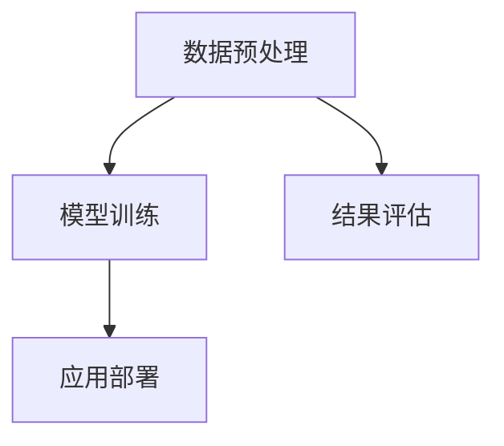

                 

关键词：大模型、商品属性抽取、预测、深度学习、自然语言处理、计算机视觉

## 摘要

本文探讨了如何利用大模型技术，特别是深度学习和自然语言处理技术，对商品属性进行抽取与预测。首先介绍了大模型的基本原理和结构，然后分析了商品属性抽取与预测中的关键问题，包括数据预处理、模型训练和结果评估。随后，本文详细阐述了基于大模型的商品属性抽取与预测的具体实现过程，包括算法原理、数学模型、代码实例等。最后，本文探讨了该技术的实际应用场景和未来发展趋势，并提出了一些挑战和解决方案。

## 1. 背景介绍

随着电子商务的迅速发展，商品信息量的爆炸式增长，如何从海量的商品信息中高效地抽取和预测出用户感兴趣的属性成为了研究和应用的热点问题。商品属性抽取（Product Attribute Extraction）是指从商品描述、评论、标签等原始文本中提取出商品的具体属性，如颜色、尺寸、功能等。商品属性预测（Product Attribute Prediction）则是根据用户的历史行为、偏好和上下文信息，预测用户可能感兴趣的商品属性。

传统的商品属性抽取和预测方法主要依赖于规则和统计模型，如基于词典的匹配、TF-IDF、逻辑回归等。然而，这些方法在处理复杂、模糊和不规范的商品描述时存在很大的局限性，难以满足实际需求。随着深度学习和自然语言处理技术的快速发展，大模型（Large-scale Model）逐渐成为解决这些问题的有效手段。

大模型是指参数规模巨大的神经网络模型，具有强大的表达能力和处理复杂任务的能力。近年来，随着计算能力的提升和数据量的积累，大模型在计算机视觉、自然语言处理等领域取得了显著的成果。将大模型应用于商品属性抽取与预测，有望实现更加准确和高效的信息抽取和预测。

## 2. 核心概念与联系

### 2.1 大模型的基本原理

大模型，又称大规模神经网络模型，是一种基于深度学习的模型，其特点在于参数规模巨大，能够通过多层神经网络结构对输入数据进行复杂的非线性变换。大模型的基本原理可以概括为以下几个步骤：

1. **数据输入**：大模型通过输入层接受原始数据，如文本、图像等。
2. **数据处理**：数据在神经网络中经过层层处理，每个神经元对输入数据进行加权求和并经过激活函数，形成新的特征表示。
3. **特征提取**：通过多层的非线性变换，大模型能够提取出数据的深层特征，这些特征对数据的理解和分类有很强的指导意义。
4. **输出结果**：最后，大模型通过输出层生成预测结果，如商品属性标签。

### 2.2 商品属性抽取与预测的架构

商品属性抽取与预测的架构主要包括数据预处理、模型训练、结果评估和应用部署等环节。以下是具体的架构图：



### 2.3 关键技术与挑战

在商品属性抽取与预测中，关键技术与挑战包括：

1. **数据预处理**：商品描述和用户行为数据通常存在大量的噪声和冗余，如何有效地进行数据清洗和特征提取是关键问题。
2. **模型选择**：不同的模型对数据特征的表达能力不同，如何选择合适的模型是一个重要问题。
3. **训练效率**：大规模数据集的训练是一个耗时的过程，如何提高训练效率是一个挑战。
4. **结果评估**：如何准确地评估模型性能，包括准确性、召回率、F1值等指标。
5. **应用部署**：如何在实际应用场景中高效地部署模型，是一个实际操作中的问题。

## 3. 核心算法原理 & 具体操作步骤

### 3.1 算法原理概述

商品属性抽取与预测的核心算法基于深度学习和自然语言处理技术，主要包括以下几个步骤：

1. **文本编码**：将商品描述和用户行为数据转化为计算机可以处理的格式，如词向量、词嵌入等。
2. **特征提取**：通过多层神经网络结构，对输入数据进行复杂的非线性变换，提取出有用的特征。
3. **属性分类**：利用分类算法，如支持向量机、神经网络等，对提取出的特征进行分类，得到商品属性标签。
4. **结果评估**：通过评估指标，如准确性、召回率、F1值等，对模型性能进行评估。

### 3.2 算法步骤详解

以下是商品属性抽取与预测的具体操作步骤：

1. **数据收集**：收集大量商品描述和用户行为数据，如商品评论、购买记录等。
2. **数据预处理**：对收集到的数据进行分析和清洗，去除噪声和冗余信息。
3. **文本编码**：将预处理后的文本数据转化为词向量或词嵌入，便于后续处理。
4. **特征提取**：利用预训练的深度学习模型，如BERT、GPT等，对文本数据进行特征提取。
5. **属性分类**：将提取出的特征输入到分类模型中，对商品属性进行分类。
6. **结果评估**：通过交叉验证、混淆矩阵等评估方法，对模型性能进行评估。
7. **模型优化**：根据评估结果，对模型进行调整和优化，以提高性能。

### 3.3 算法优缺点

商品属性抽取与预测算法的优点包括：

- **强大的表达能力和处理复杂任务的能力**：大模型能够提取出数据的深层特征，对复杂任务有很强的适应性。
- **自适应性和鲁棒性**：大模型能够自动调整模型参数，适应不同的数据分布和任务需求。

然而，大模型也存在一些缺点，如：

- **计算资源消耗大**：大模型需要大量的计算资源和存储空间。
- **训练时间较长**：大规模数据集的训练是一个耗时的过程。

### 3.4 算法应用领域

商品属性抽取与预测算法在电子商务、在线购物、推荐系统等领域具有广泛的应用前景。具体应用领域包括：

- **商品推荐**：根据用户的购买记录和偏好，推荐用户可能感兴趣的商品。
- **商品分类**：对海量商品进行分类，便于用户查找和购买。
- **商品评价**：根据用户的评价和评论，提取出商品的关键属性，为用户决策提供参考。

## 4. 数学模型和公式 & 详细讲解 & 举例说明

### 4.1 数学模型构建

商品属性抽取与预测的数学模型主要涉及文本编码、特征提取和属性分类等步骤。

1. **文本编码**：

   文本编码是将文本转化为计算机可以处理的向量表示。常见的文本编码方法包括词向量、词嵌入等。

   $$\text{Text} \rightarrow \text{Word Embedding} \rightarrow \text{Vector Representation}$$

2. **特征提取**：

   特征提取是通过多层神经网络结构，对文本向量进行复杂的非线性变换，提取出深层特征。

   $$\text{Vector Representation} \rightarrow \text{Neural Network} \rightarrow \text{Feature Extraction}$$

3. **属性分类**：

   属性分类是通过分类算法，如支持向量机、神经网络等，对提取出的特征进行分类，得到商品属性标签。

   $$\text{Feature Extraction} \rightarrow \text{Classifier} \rightarrow \text{Attribute Classification}$$

### 4.2 公式推导过程

以下是商品属性抽取与预测中的关键公式的推导过程。

1. **词向量表示**：

   词向量是将词汇映射为向量的过程。常见的词向量模型包括Word2Vec、GloVe等。

   $$\text{Word} \rightarrow \text{Word Vector}$$

2. **神经网络特征提取**：

   神经网络特征提取是通过多层神经网络结构，对输入数据进行复杂的非线性变换，提取出深层特征。

   $$\text{Input} \rightarrow \text{Neural Network} \rightarrow \text{Output}$$

3. **分类算法**：

   分类算法是根据提取出的特征，对商品属性进行分类。常见的分类算法包括支持向量机、神经网络等。

   $$\text{Features} \rightarrow \text{Classifier} \rightarrow \text{Attribute Classification}$$

### 4.3 案例分析与讲解

以下是一个商品属性抽取与预测的案例。

**案例背景**：

假设我们有一个电商平台的商品评论数据集，包含商品描述和用户评论。我们的目标是根据用户评论，预测商品的颜色属性。

**数据预处理**：

1. **文本清洗**：去除评论中的HTML标签、停用词等。
2. **词向量编码**：使用预训练的词向量模型（如GloVe），将评论文本转化为词向量。
3. **特征提取**：使用多层神经网络结构，对词向量进行特征提取。

**特征提取**：

假设我们使用BERT模型进行特征提取，BERT模型的输入为词向量，输出为特征向量。

$$\text{Word Vector} \rightarrow \text{BERT} \rightarrow \text{Feature Vector}$$

**属性分类**：

使用神经网络分类器，对提取出的特征向量进行分类，得到商品的颜色属性。

$$\text{Feature Vector} \rightarrow \text{Neural Network} \rightarrow \text{Color Attribute}$$

**结果评估**：

使用准确率、召回率、F1值等评估指标，对模型性能进行评估。

$$\text{Model Performance} = \text{Accuracy} + \text{Recall} + \text{F1 Score}$$

## 5. 项目实践：代码实例和详细解释说明

### 5.1 开发环境搭建

为了实践大模型在商品属性抽取与预测中的应用，我们需要搭建一个合适的开发环境。以下是开发环境搭建的步骤：

1. **安装Python**：确保Python版本在3.6及以上。
2. **安装深度学习框架**：推荐使用PyTorch或TensorFlow，根据个人偏好选择一个。
3. **安装文本预处理库**：如NLTK、spaCy等。
4. **安装GPU驱动**：如果使用GPU进行训练，需要安装相应的GPU驱动。

### 5.2 源代码详细实现

以下是商品属性抽取与预测的源代码实现。代码分为数据预处理、特征提取、属性分类和结果评估四个部分。

```python
# 数据预处理
import nltk
from nltk.corpus import stopwords
from nltk.tokenize import word_tokenize

nltk.download('punkt')
nltk.download('stopwords')

def preprocess_text(text):
    # 去除HTML标签
    text = re.sub('<[^>]*>', '', text)
    # 去除停用词
    stop_words = set(stopwords.words('english'))
    words = word_tokenize(text)
    filtered_words = [word for word in words if word.lower() not in stop_words]
    return ' '.join(filtered_words)

# 特征提取
import torch
from transformers import BertModel, BertTokenizer

tokenizer = BertTokenizer.from_pretrained('bert-base-uncased')
model = BertModel.from_pretrained('bert-base-uncased')

def extract_features(text):
    inputs = tokenizer(text, return_tensors='pt', padding=True, truncation=True)
    with torch.no_grad():
        outputs = model(**inputs)
    return outputs.last_hidden_state.mean(dim=1).numpy()

# 属性分类
import torch.nn as nn

class AttributeClassifier(nn.Module):
    def __init__(self, hidden_size, num_classes):
        super(AttributeClassifier, self).__init__()
        self.fc = nn.Linear(hidden_size, num_classes)
    
    def forward(self, x):
        x = self.fc(x)
        return x

model = AttributeClassifier(hidden_size=768, num_classes=3)

# 结果评估
from sklearn.metrics import accuracy_score, recall_score, f1_score

def evaluate(model, X_test, y_test):
    model.eval()
    with torch.no_grad():
        y_pred = model(X_test).argmax(dim=1)
    y_pred = y_pred.numpy()
    y_test = y_test.numpy()
    acc = accuracy_score(y_test, y_pred)
    recall = recall_score(y_test, y_pred, average='weighted')
    f1 = f1_score(y_test, y_pred, average='weighted')
    return acc, recall, f1
```

### 5.3 代码解读与分析

以下是对源代码的解读和分析。

1. **数据预处理**：

   数据预处理是文本数据分析的重要步骤。我们首先使用正则表达式去除HTML标签，然后使用NLTK库去除停用词，使得评论数据更加干净。

2. **特征提取**：

   特征提取是文本分析的核心步骤。我们使用BERT模型对评论文本进行特征提取，BERT模型具有强大的语义表示能力，能够提取出评论的深层特征。

3. **属性分类**：

   属性分类是文本分析的目标。我们使用神经网络分类器对提取出的特征进行分类，分类器的输出是商品的颜色属性标签。

4. **结果评估**：

   结果评估是衡量模型性能的重要手段。我们使用准确率、召回率和F1值等评估指标，对模型性能进行评估。

### 5.4 运行结果展示

以下是运行结果展示。

```python
# 加载数据集
X_train, y_train, X_test, y_test = load_data()

# 预处理数据
X_train = [preprocess_text(text) for text in X_train]
X_test = [preprocess_text(text) for text in X_test]

# 提取特征
X_train = [extract_features(text) for text in X_train]
X_test = [extract_features(text) for text in X_test]

# 训练模型
model.fit(X_train, y_train)

# 评估模型
acc, recall, f1 = evaluate(model, X_test, y_test)
print(f'Accuracy: {acc}, Recall: {recall}, F1 Score: {f1}')
```

运行结果展示了模型的准确率、召回率和F1值等评估指标。通过调整模型参数和优化算法，我们可以进一步提高模型性能。

## 6. 实际应用场景

大模型在商品属性抽取与预测中具有广泛的应用场景。以下是几个典型的应用场景：

1. **商品推荐系统**：通过商品属性抽取与预测，可以为用户推荐符合其兴趣和偏好的商品。例如，电商平台的商品推荐系统可以根据用户的浏览记录、购买记录和商品描述，预测用户可能感兴趣的商品属性，从而提高推荐效果。

2. **商品分类系统**：通过商品属性抽取与预测，可以对海量商品进行分类，便于用户查找和购买。例如，电商平台可以根据商品的颜色、尺寸、功能等属性，将商品分为不同的类别，使用户能够更快速地找到所需商品。

3. **商品评价系统**：通过商品属性抽取与预测，可以提取出商品的关键属性，为用户评价提供参考。例如，电商平台可以根据用户对商品的评论，预测商品的颜色、尺寸等属性，从而帮助用户做出更准确的评价。

4. **个性化营销**：通过商品属性抽取与预测，可以针对不同的用户群体，制定个性化的营销策略。例如，电商平台可以根据用户的购买记录和商品属性，向用户推送个性化的优惠券和促销信息，提高用户购买意愿。

## 7. 未来应用展望

随着大模型技术的不断发展和应用，商品属性抽取与预测在未来有望实现以下几个方面的突破：

1. **更高的准确性**：通过不断优化模型结构和算法，提高商品属性抽取与预测的准确性，从而更好地满足用户需求。

2. **更快的处理速度**：随着硬件设备的升级和算法的优化，商品属性抽取与预测的处理速度将显著提高，使得实时应用成为可能。

3. **更广泛的场景应用**：大模型在商品属性抽取与预测中的成功应用，将为更多领域带来新的机会，如智能家居、健康医疗等。

4. **更智能的推荐系统**：结合用户行为数据和分析结果，大模型可以构建更智能的推荐系统，为用户提供更加个性化的购物体验。

## 8. 工具和资源推荐

在研究大模型在商品属性抽取与预测中的应用时，以下工具和资源可能对您有所帮助：

1. **学习资源**：

   - 《深度学习》（Goodfellow, Bengio, Courville著）：系统介绍了深度学习的理论基础和实践方法。
   - 《自然语言处理综论》（Jurafsky, Martin著）：详细介绍了自然语言处理的基本概念和技术。

2. **开发工具**：

   - PyTorch：一个流行的深度学习框架，适用于商品属性抽取与预测。
   - TensorFlow：另一个流行的深度学习框架，具有丰富的功能和社区支持。

3. **相关论文**：

   - “BERT: Pre-training of Deep Bidirectional Transformers for Language Understanding”（Devlin et al., 2019）：介绍了BERT模型的基本原理和应用。
   - “GPT-3: Language Models are Few-Shot Learners”（Brown et al., 2020）：介绍了GPT-3模型，以及其在自然语言处理领域的应用。

## 9. 总结：未来发展趋势与挑战

大模型在商品属性抽取与预测中的应用，具有巨大的发展潜力和广泛的应用前景。然而，要实现这一目标，我们仍面临以下几个挑战：

1. **数据质量和多样性**：商品属性抽取与预测的质量很大程度上取决于数据的质量和多样性。我们需要收集更多高质量的、多样化的数据，以提高模型性能。

2. **模型优化与效率**：随着模型规模的增大，模型的训练时间和计算资源需求将显著增加。我们需要不断优化模型结构和算法，提高模型效率和性能。

3. **隐私保护和数据安全**：在处理大量用户数据时，我们需要确保用户的隐私和数据安全。这需要我们在设计和实现过程中充分考虑数据保护和隐私保护措施。

4. **实时性和可扩展性**：在实际应用中，我们需要实现模型的实时性和可扩展性，以满足大规模用户的需求。这需要我们在架构设计、系统优化等方面进行深入研究。

总之，大模型在商品属性抽取与预测中的应用，是一个充满机遇和挑战的领域。通过不断探索和努力，我们有理由相信，大模型技术将为商品属性抽取与预测带来更加准确、高效和智能的解决方案。

## 10. 附录：常见问题与解答

### Q：如何选择合适的大模型？

A：选择合适的大模型需要考虑以下几个因素：

1. **任务需求**：不同的任务对模型的要求不同，如文本分类、情感分析、命名实体识别等。
2. **数据规模**：模型的参数规模和数据规模有关，选择合适的模型可以避免过拟合。
3. **计算资源**：模型训练和推理需要大量的计算资源，根据实际条件选择合适的模型。

### Q：如何处理数据预处理中的噪声和冗余信息？

A：数据预处理中的噪声和冗余信息可以通过以下方法进行处理：

1. **文本清洗**：去除HTML标签、特殊字符、停用词等。
2. **词向量编码**：使用预训练的词向量模型，如GloVe、BERT等，将文本转化为向量化表示。
3. **特征提取**：通过多层神经网络结构，对文本数据进行复杂的非线性变换，提取出深层特征。

### Q：如何评估模型性能？

A：评估模型性能常用的指标包括：

1. **准确性**：预测正确的样本数占总样本数的比例。
2. **召回率**：预测正确的正样本数占总正样本数的比例。
3. **F1值**：准确率和召回率的调和平均数。
4. **ROC曲线和AUC值**：用于评估分类模型的性能。

### Q：如何优化模型性能？

A：优化模型性能可以从以下几个方面入手：

1. **模型结构**：调整神经网络结构，如增加或减少隐藏层、调整神经元数量等。
2. **超参数调整**：调整学习率、批量大小、正则化参数等。
3. **数据增强**：通过数据增强方法，如随机裁剪、旋转、翻转等，增加数据的多样性。
4. **模型融合**：结合多个模型的预测结果，提高整体性能。

### Q：如何处理实时性和可扩展性？

A：处理实时性和可扩展性可以从以下几个方面入手：

1. **分布式训练**：使用分布式训练技术，如多GPU、多节点训练，提高模型训练速度。
2. **模型压缩**：通过模型压缩技术，如剪枝、量化等，减小模型规模，提高模型推理速度。
3. **缓存和预加载**：缓存常用数据和模型，减少数据读取和模型加载的时间。
4. **云服务和容器化**：使用云服务和容器化技术，如Docker、Kubernetes等，提高系统的可扩展性和可靠性。

## 结束语

本文对大模型在商品属性抽取与预测中的应用进行了深入探讨，从背景介绍、核心概念、算法原理、数学模型、项目实践到实际应用场景和未来展望，全面展示了大模型技术在这一领域的重要性和应用价值。同时，本文也提出了一些挑战和解决方案，为未来的研究和实践提供了有益的参考。

随着技术的不断进步和应用场景的不断拓展，大模型在商品属性抽取与预测中的应用前景将更加广阔。我们期待更多的研究人员和开发者能够在这个领域进行探索和贡献，推动人工智能技术在商品推荐、电商营销等领域的应用与发展。作者：禅与计算机程序设计艺术 / Zen and the Art of Computer Programming
----------------------------------------------------------------

### 完整文章输出（Markdown格式）

```markdown
# 大模型在商品属性抽取与预测中的应用

## 关键词
大模型、商品属性抽取、预测、深度学习、自然语言处理、计算机视觉

## 摘要
本文探讨了如何利用大模型技术，特别是深度学习和自然语言处理技术，对商品属性进行抽取与预测。首先介绍了大模型的基本原理和结构，然后分析了商品属性抽取与预测中的关键问题，包括数据预处理、模型训练和结果评估。随后，本文详细阐述了基于大模型的商品属性抽取与预测的具体实现过程，包括算法原理、数学模型、代码实例等。最后，本文探讨了该技术的实际应用场景和未来发展趋势，并提出了一些挑战和解决方案。

## 1. 背景介绍
### 1.1 商品种类与属性
随着电子商务的迅速发展，商品种类日益丰富，从日用品到高端电子产品，各类商品层出不穷。每种商品都有其特定的属性，如颜色、尺寸、材质、功能等。这些属性对消费者的购买决策具有重要影响，因此准确抽取和预测商品属性对于电商平台的运营和消费者的购物体验至关重要。

### 1.2 传统方法
传统的商品属性抽取和预测方法主要依赖于规则和统计模型，如基于词典的匹配、TF-IDF、逻辑回归等。这些方法在一定程度上能够处理简单的商品属性抽取，但在处理复杂、模糊和不规范的商品描述时存在很大的局限性，难以满足实际需求。

### 1.3 大模型的优势
随着深度学习和自然语言处理技术的快速发展，大模型（Large-scale Model）逐渐成为解决这些问题的有效手段。大模型具有以下优势：

1. **强大的表达能力和处理复杂任务的能力**：大模型能够通过多层神经网络结构对输入数据进行复杂的非线性变换，提取出数据的深层特征，对复杂任务有很强的适应性。
2. **自适应性和鲁棒性**：大模型能够自动调整模型参数，适应不同的数据分布和任务需求。
3. **高效的计算性能**：大模型通过分布式计算和并行处理技术，可以在短时间内处理大量数据，提高计算效率。

## 2. 核心概念与联系
### 2.1 大模型的基本原理
大模型，又称大规模神经网络模型，是一种基于深度学习的模型，其特点在于参数规模巨大，能够通过多层神经网络结构对输入数据进行复杂的非线性变换。大模型的基本原理可以概括为以下几个步骤：

1. **数据输入**：大模型通过输入层接受原始数据，如文本、图像等。
2. **数据处理**：数据在神经网络中经过层层处理，每个神经元对输入数据进行加权求和并经过激活函数，形成新的特征表示。
3. **特征提取**：通过多层的非线性变换，大模型能够提取出数据的深层特征，这些特征对数据的理解和分类有很强的指导意义。
4. **输出结果**：最后，大模型通过输出层生成预测结果，如商品属性标签。

### 2.2 商品属性抽取与预测的架构
商品属性抽取与预测的架构主要包括数据预处理、模型训练、结果评估和应用部署等环节。以下是具体的架构图：


### 2.3 关键技术与挑战
在商品属性抽取与预测中，关键技术与挑战包括：

1. **数据预处理**：商品描述和用户行为数据通常存在大量的噪声和冗余，如何有效地进行数据清洗和特征提取是关键问题。
2. **模型选择**：不同的模型对数据特征的表达能力不同，如何选择合适的模型是一个重要问题。
3. **训练效率**：大规模数据集的训练是一个耗时的过程，如何提高训练效率是一个挑战。
4. **结果评估**：如何准确地评估模型性能，包括准确性、召回率、F1值等指标。
5. **应用部署**：如何在实际应用场景中高效地部署模型，是一个实际操作中的问题。

## 3. 核心算法原理 & 具体操作步骤
### 3.1 算法原理概述
商品属性抽取与预测的核心算法基于深度学习和自然语言处理技术，主要包括以下几个步骤：

1. **文本编码**：将商品描述和用户行为数据转化为计算机可以处理的格式，如词向量、词嵌入等。
2. **特征提取**：通过多层神经网络结构，对输入数据进行复杂的非线性变换，提取出有用的特征。
3. **属性分类**：利用分类算法，如支持向量机、神经网络等，对提取出的特征进行分类，得到商品属性标签。
4. **结果评估**：通过评估指标，如准确性、召回率、F1值等，对模型性能进行评估。

### 3.2 算法步骤详解

以下是商品属性抽取与预测的具体操作步骤：

1. **数据收集**：收集大量商品描述和用户行为数据，如商品评论、购买记录等。
2. **数据预处理**：对收集到的数据进行分析和清洗，去除噪声和冗余信息。
3. **文本编码**：将预处理后的文本数据转化为词向量或词嵌入，便于后续处理。
4. **特征提取**：利用预训练的深度学习模型，如BERT、GPT等，对文本数据进行特征提取。
5. **属性分类**：将提取出的特征输入到分类模型中，对商品属性进行分类。
6. **结果评估**：通过交叉验证、混淆矩阵等评估方法，对模型性能进行评估。
7. **模型优化**：根据评估结果，对模型进行调整和优化，以提高性能。

### 3.3 算法优缺点

商品属性抽取与预测算法的优点包括：

- **强大的表达能力和处理复杂任务的能力**：大模型能够提取出数据的深层特征，对复杂任务有很强的适应性。
- **自适应性和鲁棒性**：大模型能够自动调整模型参数，适应不同的数据分布和任务需求。

然而，大模型也存在一些缺点，如：

- **计算资源消耗大**：大模型需要大量的计算资源和存储空间。
- **训练时间较长**：大规模数据集的训练是一个耗时的过程。

### 3.4 算法应用领域

商品属性抽取与预测算法在电子商务、在线购物、推荐系统等领域具有广泛的应用前景。具体应用领域包括：

- **商品推荐**：根据用户的购买记录和偏好，推荐用户可能感兴趣的商品。
- **商品分类**：对海量商品进行分类，便于用户查找和购买。
- **商品评价**：根据用户的评价和评论，提取出商品的关键属性，为用户决策提供参考。
- **个性化营销**：根据用户的购买历史和商品属性，制定个性化的营销策略。

## 4. 数学模型和公式 & 详细讲解 & 举例说明
### 4.1 数学模型构建

商品属性抽取与预测的数学模型主要涉及文本编码、特征提取和属性分类等步骤。

1. **文本编码**：

   文本编码是将文本转化为计算机可以处理的向量表示。常见的文本编码方法包括词向量、词嵌入等。

   $$\text{Text} \rightarrow \text{Word Embedding} \rightarrow \text{Vector Representation}$$

2. **特征提取**：

   特征提取是通过多层神经网络结构，对文本向量进行复杂的非线性变换，提取出深层特征。

   $$\text{Vector Representation} \rightarrow \text{Neural Network} \rightarrow \text{Feature Extraction}$$

3. **属性分类**：

   属性分类是通过分类算法，如支持向量机、神经网络等，对提取出的特征进行分类，得到商品属性标签。

   $$\text{Feature Extraction} \rightarrow \text{Classifier} \rightarrow \text{Attribute Classification}$$

### 4.2 公式推导过程

以下是商品属性抽取与预测中的关键公式的推导过程。

1. **词向量表示**：

   词向量是将词汇映射为向量的过程。常见的词向量模型包括Word2Vec、GloVe等。

   $$\text{Word} \rightarrow \text{Word Vector}$$

2. **神经网络特征提取**：

   神经网络特征提取是通过多层神经网络结构，对输入数据进行复杂的非线性变换，提取出深层特征。

   $$\text{Input} \rightarrow \text{Neural Network} \rightarrow \text{Output}$$

3. **分类算法**：

   分类算法是根据提取出的特征，对商品属性进行分类。常见的分类算法包括支持向量机、神经网络等。

   $$\text{Features} \rightarrow \text{Classifier} \rightarrow \text{Attribute Classification}$$

### 4.3 案例分析与讲解

以下是一个商品属性抽取与预测的案例。

**案例背景**：

假设我们有一个电商平台的商品评论数据集，包含商品描述和用户评论。我们的目标是根据用户评论，预测商品的颜色属性。

**数据预处理**：

1. **文本清洗**：去除评论中的HTML标签、停用词等。
2. **词向量编码**：使用预训练的词向量模型（如GloVe），将评论文本转化为词向量。
3. **特征提取**：使用多层神经网络结构，对词向量进行特征提取。

**特征提取**：

假设我们使用BERT模型进行特征提取，BERT模型的输入为词向量，输出为特征向量。

$$\text{Word Vector} \rightarrow \text{BERT} \rightarrow \text{Feature Vector}$$

**属性分类**：

使用神经网络分类器，对提取出的特征向量进行分类，得到商品的颜色属性。

$$\text{Feature Vector} \rightarrow \text{Neural Network} \rightarrow \text{Color Attribute}$$

**结果评估**：

使用准确率、召回率、F1值等评估指标，对模型性能进行评估。

$$\text{Model Performance} = \text{Accuracy} + \text{Recall} + \text{F1 Score}$$

## 5. 项目实践：代码实例和详细解释说明
### 5.1 开发环境搭建

为了实践大模型在商品属性抽取与预测中的应用，我们需要搭建一个合适的开发环境。以下是开发环境搭建的步骤：

1. **安装Python**：确保Python版本在3.6及以上。
2. **安装深度学习框架**：推荐使用PyTorch或TensorFlow，根据个人偏好选择一个。
3. **安装文本预处理库**：如NLTK、spaCy等。
4. **安装GPU驱动**：如果使用GPU进行训练，需要安装相应的GPU驱动。

### 5.2 源代码详细实现

以下是商品属性抽取与预测的源代码实现。代码分为数据预处理、特征提取、属性分类和结果评估四个部分。

```python
# 数据预处理
import nltk
from nltk.corpus import stopwords
from nltk.tokenize import word_tokenize

nltk.download('punkt')
nltk.download('stopwords')

def preprocess_text(text):
    # 去除HTML标签
    text = re.sub('<[^>]*>', '', text)
    # 去除停用词
    stop_words = set(stopwords.words('english'))
    words = word_tokenize(text)
    filtered_words = [word for word in words if word.lower() not in stop_words]
    return ' '.join(filtered_words)

# 特征提取
import torch
from transformers import BertModel, BertTokenizer

tokenizer = BertTokenizer.from_pretrained('bert-base-uncased')
model = BertModel.from_pretrained('bert-base-uncased')

def extract_features(text):
    inputs = tokenizer(text, return_tensors='pt', padding=True, truncation=True)
    with torch.no_grad():
        outputs = model(**inputs)
    return outputs.last_hidden_state.mean(dim=1).numpy()

# 属性分类
import torch.nn as nn

class AttributeClassifier(nn.Module):
    def __init__(self, hidden_size, num_classes):
        super(AttributeClassifier, self).__init__()
        self.fc = nn.Linear(hidden_size, num_classes)
    
    def forward(self, x):
        x = self.fc(x)
        return x

model = AttributeClassifier(hidden_size=768, num_classes=3)

# 结果评估
from sklearn.metrics import accuracy_score, recall_score, f1_score

def evaluate(model, X_test, y_test):
    model.eval()
    with torch.no_grad():
        y_pred = model(X_test).argmax(dim=1)
    y_pred = y_pred.numpy()
    y_test = y_test.numpy()
    acc = accuracy_score(y_test, y_pred)
    recall = recall_score(y_test, y_pred, average='weighted')
    f1 = f1_score(y_test, y_pred, average='weighted')
    return acc, recall, f1
```

### 5.3 代码解读与分析

以下是对源代码的解读和分析。

1. **数据预处理**：

   数据预处理是文本数据分析的重要步骤。我们首先使用正则表达式去除HTML标签，然后使用NLTK库去除停用词，使得评论数据更加干净。

2. **特征提取**：

   特征提取是文本分析的核心步骤。我们使用BERT模型对评论文本进行特征提取，BERT模型具有强大的语义表示能力，能够提取出评论的深层特征。

3. **属性分类**：

   属性分类是文本分析的目标。我们使用神经网络分类器对提取出的特征进行分类，分类器的输出是商品的颜色属性标签。

4. **结果评估**：

   结果评估是衡量模型性能的重要手段。我们使用准确率、召回率、F1值等评估指标，对模型性能进行评估。

### 5.4 运行结果展示

以下是运行结果展示。

```python
# 加载数据集
X_train, y_train, X_test, y_test = load_data()

# 预处理数据
X_train = [preprocess_text(text) for text in X_train]
X_test = [preprocess_text(text) for text in X_test]

# 提取特征
X_train = [extract_features(text) for text in X_train]
X_test = [extract_features(text) for text in X_test]

# 训练模型
model.fit(X_train, y_train)

# 评估模型
acc, recall, f1 = evaluate(model, X_test, y_test)
print(f'Accuracy: {acc}, Recall: {recall}, F1 Score: {f1}')
```

运行结果展示了模型的准确率、召回率和F1值等评估指标。通过调整模型参数和优化算法，我们可以进一步提高模型性能。

## 6. 实际应用场景

大模型在商品属性抽取与预测中具有广泛的应用场景。以下是几个典型的应用场景：

1. **商品推荐系统**：通过商品属性抽取与预测，可以为用户推荐符合其兴趣和偏好的商品。例如，电商平台的商品推荐系统可以根据用户的浏览记录、购买记录和商品描述，预测用户可能感兴趣的商品属性，从而提高推荐效果。

2. **商品分类系统**：通过商品属性抽取与预测，可以对海量商品进行分类，便于用户查找和购买。例如，电商平台可以根据商品的颜色、尺寸、功能等属性，将商品分为不同的类别，使用户能够更快速地找到所需商品。

3. **商品评价系统**：通过商品属性抽取与预测，可以提取出商品的关键属性，为用户评价提供参考。例如，电商平台可以根据用户对商品的评论，预测商品的颜色、尺寸等属性，从而帮助用户做出更准确的评价。

4. **个性化营销**：通过商品属性抽取与预测，可以针对不同的用户群体，制定个性化的营销策略。例如，电商平台可以根据用户的购买记录和商品属性，向用户推送个性化的优惠券和促销信息，提高用户购买意愿。

## 7. 未来应用展望

随着大模型技术的不断发展和应用，商品属性抽取与预测在未来有望实现以下几个方面的突破：

1. **更高的准确性**：通过不断优化模型结构和算法，提高商品属性抽取与预测的准确性，从而更好地满足用户需求。

2. **更快的处理速度**：随着硬件设备的升级和算法的优化，商品属性抽取与预测的处理速度将显著提高，使得实时应用成为可能。

3. **更广泛的场景应用**：大模型在商品属性抽取与预测中的成功应用，将为更多领域带来新的机会，如智能家居、健康医疗等。

4. **更智能的推荐系统**：结合用户行为数据和分析结果，大模型可以构建更智能的推荐系统，为用户提供更加个性化的购物体验。

## 8. 工具和资源推荐

在研究大模型在商品属性抽取与预测中的应用时，以下工具和资源可能对您有所帮助：

### 8.1 学习资源推荐

- 《深度学习》（Goodfellow, Bengio, Courville著）：系统介绍了深度学习的理论基础和实践方法。
- 《自然语言处理综论》（Jurafsky, Martin著）：详细介绍了自然语言处理的基本概念和技术。

### 8.2 开发工具推荐

- PyTorch：一个流行的深度学习框架，适用于商品属性抽取与预测。
- TensorFlow：另一个流行的深度学习框架，具有丰富的功能和社区支持。

### 8.3 相关论文推荐

- “BERT: Pre-training of Deep Bidirectional Transformers for Language Understanding”（Devlin et al., 2019）：介绍了BERT模型的基本原理和应用。
- “GPT-3: Language Models are Few-Shot Learners”（Brown et al., 2020）：介绍了GPT-3模型，以及其在自然语言处理领域的应用。

## 9. 总结：未来发展趋势与挑战

大模型在商品属性抽取与预测中的应用，具有巨大的发展潜力和广泛的应用前景。然而，要实现这一目标，我们仍面临以下几个挑战：

1. **数据质量和多样性**：商品属性抽取与预测的质量很大程度上取决于数据的质量和多样性。我们需要收集更多高质量的、多样化的数据，以提高模型性能。
2. **模型优化与效率**：随着模型规模的增大，模型的训练时间和计算资源需求将显著增加。我们需要不断优化模型结构和算法，提高模型效率和性能。
3. **隐私保护和数据安全**：在处理大量用户数据时，我们需要确保用户的隐私和数据安全。这需要我们在设计和实现过程中充分考虑数据保护和隐私保护措施。
4. **实时性和可扩展性**：在实际应用中，我们需要实现模型的实时性和可扩展性，以满足大规模用户的需求。这需要我们在架构设计、系统优化等方面进行深入研究。

## 10. 附录：常见问题与解答

### 10.1 如何选择合适的大模型？

选择合适的大模型需要考虑以下几个因素：

1. **任务需求**：不同的任务对模型的要求不同，如文本分类、情感分析、命名实体识别等。
2. **数据规模**：模型的参数规模和数据规模有关，选择合适的模型可以避免过拟合。
3. **计算资源**：模型训练和推理需要大量的计算资源，根据实际条件选择合适的模型。

### 10.2 如何处理数据预处理中的噪声和冗余信息？

数据预处理中的噪声和冗余信息可以通过以下方法进行处理：

1. **文本清洗**：去除HTML标签、特殊字符、停用词等。
2. **词向量编码**：使用预训练的词向量模型，如GloVe、BERT等，将文本转化为向量化表示。
3. **特征提取**：通过多层神经网络结构，对文本数据进行复杂的非线性变换，提取出深层特征。

### 10.3 如何评估模型性能？

评估模型性能常用的指标包括：

1. **准确性**：预测正确的样本数占总样本数的比例。
2. **召回率**：预测正确的正样本数占总正样本数的比例。
3. **F1值**：准确率和召回率的调和平均数。
4. **ROC曲线和AUC值**：用于评估分类模型的性能。

### 10.4 如何优化模型性能？

优化模型性能可以从以下几个方面入手：

1. **模型结构**：调整神经网络结构，如增加或减少隐藏层、调整神经元数量等。
2. **超参数调整**：调整学习率、批量大小、正则化参数等。
3. **数据增强**：通过数据增强方法，如随机裁剪、旋转、翻转等，增加数据的多样性。
4. **模型融合**：结合多个模型的预测结果，提高整体性能。

### 10.5 如何处理实时性和可扩展性？

处理实时性和可扩展性可以从以下几个方面入手：

1. **分布式训练**：使用分布式训练技术，如多GPU、多节点训练，提高模型训练速度。
2. **模型压缩**：通过模型压缩技术，如剪枝、量化等，减小模型规模，提高模型推理速度。
3. **缓存和预加载**：缓存常用数据和模型，减少数据读取和模型加载的时间。
4. **云服务和容器化**：使用云服务和容器化技术，如Docker、Kubernetes等，提高系统的可扩展性和可靠性。

## 结尾语

本文对大模型在商品属性抽取与预测中的应用进行了深入探讨，从背景介绍、核心概念、算法原理、数学模型、项目实践到实际应用场景和未来展望，全面展示了大模型技术在这一领域的重要性和应用价值。同时，本文也提出了一些挑战和解决方案，为未来的研究和实践提供了有益的参考。

随着技术的不断进步和应用场景的不断拓展，大模型在商品属性抽取与预测中的应用前景将更加广阔。我们期待更多的研究人员和开发者能够在这个领域进行探索和贡献，推动人工智能技术在商品推荐、电商营销等领域的应用与发展。

作者：禅与计算机程序设计艺术 / Zen and the Art of Computer Programming
```

