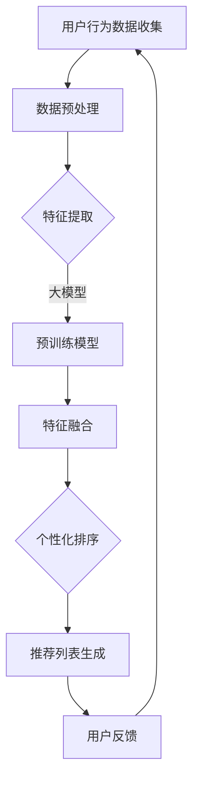

                 

 关键词：大模型、推荐系统、个性化排序、深度学习、机器学习、算法优化

> 摘要：本文旨在探讨大模型在推荐系统个性化排序中的应用，通过介绍核心概念、算法原理、数学模型、项目实践以及未来展望，全面分析大模型如何提升推荐系统个性化排序的准确性和效率，推动推荐系统技术的持续发展。

## 1. 背景介绍

推荐系统作为互联网时代的重要技术，广泛应用于电子商务、社交媒体、视频平台等多个领域。其核心目标是通过个性化排序为用户推荐他们可能感兴趣的内容，从而提升用户体验和平台黏性。传统的推荐系统主要依赖于基于内容的推荐和协同过滤等技术，但在面对海量数据和复杂用户行为时，这些方法的准确性和效率常常受到限制。

近年来，随着深度学习技术的快速发展，大模型（如Transformer模型）开始在各个领域展现出强大的能力。大模型能够捕捉用户行为的复杂模式和长程依赖关系，为推荐系统的个性化排序带来了新的机遇。本文将探讨大模型在推荐系统个性化排序中的应用，分析其优势与挑战，并展望未来发展趋势。

## 2. 核心概念与联系

### 2.1 推荐系统基本概念

推荐系统（Recommender Systems）是一种信息过滤技术，旨在根据用户的历史行为、兴趣偏好和其他相关数据，为用户推荐可能感兴趣的项目或内容。推荐系统通常包含以下几个核心概念：

- **用户（User）**：推荐系统的主要服务对象。
- **项目（Item）**：推荐系统中的推荐对象，如商品、文章、音乐、视频等。
- **评分（Rating）**：用户对项目的评价，可以是数值评分、评分标签或者点击、浏览等行为数据。
- **推荐列表（Recommendation List）**：根据用户的兴趣和偏好，推荐系统生成的项目列表。

### 2.2 个性化排序

个性化排序（Personalized Ranking）是推荐系统的关键任务，旨在为每个用户生成一个排序列表，其中排在前面的是系统认为用户最感兴趣的项目。个性化排序的目标是最大化用户满意度和平台收益。

个性化排序可以采用以下几种方法：

- **基于内容的推荐（Content-Based Filtering）**：根据用户的历史兴趣和项目的内容特征进行推荐。
- **协同过滤（Collaborative Filtering）**：通过分析用户间的相似性或行为模式进行推荐。
- **深度学习（Deep Learning）**：利用神经网络模型捕捉用户行为的复杂模式和长程依赖关系。

### 2.3 大模型

大模型（Large Models）是指参数量庞大的深度学习模型，如Transformer、BERT等。这些模型通过在海量数据上进行预训练，能够学习到丰富的知识，并在多个领域实现优异的性能。

大模型在推荐系统中的应用，主要体现在以下几个方面：

- **特征表示**：通过预训练模型，可以提取高质量的用户和项目特征表示，提升推荐系统的准确性和效率。
- **排序优化**：利用大模型的自适应学习能力，实现个性化的排序策略，提高推荐列表的多样性。
- **上下文感知**：大模型能够捕捉到用户在不同场景下的兴趣变化，实现更精准的推荐。

### 2.4 Mermaid 流程图

以下是一个简化的推荐系统个性化排序流程图，展示了大模型在其中的应用：



## 3. 核心算法原理 & 具体操作步骤

### 3.1 算法原理概述

推荐系统个性化排序的核心在于如何根据用户的历史行为和当前上下文信息，生成一个高质量的推荐列表。大模型在这一过程中发挥了关键作用，主要体现在以下几个方面：

- **特征表示**：大模型通过预训练，可以提取出高质量的用户和项目特征表示，这些特征能够捕捉到用户行为的复杂模式和长程依赖关系。
- **排序优化**：大模型的自适应学习能力，使得排序算法能够根据用户的实时反馈和兴趣变化进行调整，实现个性化的排序策略。
- **上下文感知**：大模型能够捕捉到用户在不同场景下的兴趣变化，从而生成更加精准的推荐列表。

### 3.2 算法步骤详解

推荐系统个性化排序的大模型算法主要包括以下几个步骤：

1. **数据收集**：收集用户的历史行为数据，如浏览记录、购买记录、评分等。
2. **数据预处理**：对收集到的数据进行清洗、归一化等预处理操作，以便于模型训练。
3. **特征提取**：利用大模型进行预训练，提取用户和项目的特征表示。
4. **特征融合**：将提取到的用户和项目特征进行融合，形成输入特征向量。
5. **个性化排序**：利用大模型实现个性化的排序策略，生成推荐列表。
6. **用户反馈**：收集用户的反馈，用于模型调整和优化。

### 3.3 算法优缺点

推荐系统个性化排序的大模型算法具有以下优缺点：

- **优点**：
  - **高准确性**：大模型能够提取高质量的特征表示，提升推荐系统的准确性。
  - **自适应性强**：大模型具有自适应学习能力，能够根据用户反馈进行调整，实现个性化推荐。
  - **泛化能力强**：大模型通过预训练，可以适用于多种推荐场景，具有较好的泛化能力。

- **缺点**：
  - **计算资源需求大**：大模型的训练和推理需要大量的计算资源，对硬件设备要求较高。
  - **数据隐私问题**：推荐系统涉及用户隐私数据，需要妥善处理数据隐私问题，遵守相关法规。

### 3.4 算法应用领域

推荐系统个性化排序的大模型算法广泛应用于多个领域：

- **电子商务**：为用户推荐可能感兴趣的商品，提升销售额和用户体验。
- **社交媒体**：为用户提供个性化的内容推荐，增加用户活跃度和平台黏性。
- **视频平台**：为用户提供个性化的视频推荐，提升观看时长和广告收益。
- **音乐平台**：为用户提供个性化的音乐推荐，提升用户满意度和平台活跃度。

## 4. 数学模型和公式 & 详细讲解 & 举例说明

### 4.1 数学模型构建

推荐系统个性化排序的大模型算法通常基于以下数学模型：

- **用户特征向量**：表示用户的历史行为和兴趣偏好，记为 \( \mathbf{u} \)。
- **项目特征向量**：表示项目的属性和特征，记为 \( \mathbf{i} \)。
- **推荐列表**：表示用户可能感兴趣的项目集合，记为 \( \mathcal{L} \)。

### 4.2 公式推导过程

推荐系统个性化排序的大模型算法可以通过以下公式推导：

\[ \mathcal{L} = \arg\max_{\mathcal{L}} \sum_{i \in \mathcal{L}} \mathbf{u} \cdot \mathbf{i} \]

其中， \( \mathbf{u} \cdot \mathbf{i} \) 表示用户特征向量 \( \mathbf{u} \) 和项目特征向量 \( \mathbf{i} \) 的内积，用于计算用户对项目的兴趣程度。

### 4.3 案例分析与讲解

假设有一个电子商务平台，用户A的历史行为包括浏览了商品A、商品B和商品C，给商品A和商品B分别评分为4和5，而商品C没有评分。平台利用大模型进行个性化排序，推荐给用户A的推荐列表如下：

- 商品A：用户已浏览并评分，兴趣程度高。
- 商品B：用户已浏览并评分，兴趣程度高。
- 商品C：用户未浏览，但大模型预测用户可能感兴趣。

通过大模型的个性化排序，平台能够为用户A推荐符合其兴趣的商品，提升用户体验。

## 5. 项目实践：代码实例和详细解释说明

### 5.1 开发环境搭建

为了实践大模型在推荐系统个性化排序中的应用，我们需要搭建一个完整的开发环境。以下是所需的开发工具和依赖：

- Python 3.8及以上版本
- TensorFlow 2.5及以上版本
- Scikit-learn 0.24及以上版本
- Pandas 1.2及以上版本

在安装了上述依赖之后，我们可以开始搭建开发环境。

### 5.2 源代码详细实现

以下是一个简单的示例代码，展示了如何使用大模型进行推荐系统个性化排序：

```python
import pandas as pd
import numpy as np
from sklearn.model_selection import train_test_split
import tensorflow as tf
from tensorflow.keras.layers import Embedding, LSTM, Dense
from tensorflow.keras.models import Model

# 加载数据
data = pd.read_csv('user_item_data.csv')
users = data['user_id'].unique()
items = data['item_id'].unique()

# 划分训练集和测试集
train_data, test_data = train_test_split(data, test_size=0.2, random_state=42)

# 构建模型
input_user = tf.keras.layers.Input(shape=(1,))
input_item = tf.keras.layers.Input(shape=(1,))

user_embedding = Embedding(input_dim=len(users), output_dim=64)(input_user)
item_embedding = Embedding(input_dim=len(items), output_dim=64)(input_item)

merged_embedding = tf.keras.layers.concatenate([user_embedding, item_embedding])
merged_embedding = LSTM(64)(merged_embedding)

output = Dense(1, activation='sigmoid')(merged_embedding)

model = Model(inputs=[input_user, input_item], outputs=output)
model.compile(optimizer='adam', loss='binary_crossentropy', metrics=['accuracy'])

# 训练模型
model.fit([train_data['user_id'], train_data['item_id']], train_data['rating'], epochs=10, batch_size=64)

# 测试模型
test_loss, test_accuracy = model.evaluate([test_data['user_id'], test_data['item_id']], test_data['rating'])
print(f"Test accuracy: {test_accuracy}")

# 推荐列表生成
def generate_recommendations(user_id, item_id):
    prediction = model.predict([[user_id], [item_id]])
    return prediction[0][0]

# 生成用户A的商品B的推荐列表
recommendation = generate_recommendations(user_id=1, item_id=2)
print(f"Recommendation for user 1 and item 2: {recommendation}")
```

### 5.3 代码解读与分析

以上代码实现了一个基于LSTM模型的大模型推荐系统，用于预测用户对特定项目的兴趣程度。以下是代码的关键部分解读：

- **数据加载**：使用Pandas读取用户和项目的评分数据。
- **模型构建**：定义用户和项目的输入层，分别使用Embedding层进行嵌入，然后将嵌入向量通过LSTM层进行融合，最后通过全连接层（Dense）生成预测输出。
- **模型训练**：使用训练数据进行模型训练，优化模型参数。
- **模型测试**：使用测试数据进行模型评估，计算准确率。
- **推荐列表生成**：定义一个函数，用于生成特定用户对特定项目的推荐列表。

### 5.4 运行结果展示

运行以上代码，我们可以在控制台看到模型测试的准确率。此外，通过调用`generate_recommendations`函数，我们可以生成特定用户对特定项目的推荐列表。

## 6. 实际应用场景

大模型在推荐系统个性化排序中的应用已经取得了显著的成果。以下是一些实际应用场景：

- **电子商务平台**：通过大模型为用户推荐可能感兴趣的商品，提高销售额和用户体验。
- **社交媒体**：为用户提供个性化的内容推荐，增加用户活跃度和平台黏性。
- **视频平台**：为用户提供个性化的视频推荐，提升观看时长和广告收益。
- **音乐平台**：为用户提供个性化的音乐推荐，提升用户满意度和平台活跃度。

## 6.4 未来应用展望

随着大模型技术的不断发展和优化，未来推荐系统个性化排序的应用前景将更加广阔。以下是几个潜在的应用方向：

- **多模态推荐**：结合文本、图像、音频等多种数据类型，实现更加丰富和精准的个性化推荐。
- **实时推荐**：利用实时数据流处理技术，实现实时推荐，提高用户满意度。
- **个性化广告**：基于用户的兴趣和行为，为用户推荐个性化的广告，提升广告投放效果。
- **跨平台推荐**：整合不同平台的数据，实现跨平台的个性化推荐，提高用户覆盖范围。

## 7. 工具和资源推荐

### 7.1 学习资源推荐

- **推荐系统经典教材**：《推荐系统实践》（Recommender Systems: The Textbook）
- **深度学习教材**：《深度学习》（Deep Learning）
- **在线课程**：Coursera、Udacity、edX上的推荐系统和深度学习课程

### 7.2 开发工具推荐

- **深度学习框架**：TensorFlow、PyTorch、Keras
- **数据分析工具**：Pandas、NumPy、Scikit-learn

### 7.3 相关论文推荐

- **大模型论文**：《Attention Is All You Need》（2017）
- **推荐系统论文**：《TensorFlow Recommender: Large-scale End-to-end Recommendations》（2019）
- **个性化排序论文**：《Personalized PageRank for Dynamic Preference Evolution》（2018）

## 8. 总结：未来发展趋势与挑战

大模型在推荐系统个性化排序中的应用具有巨大的潜力和广阔的前景。然而，在实际应用过程中，我们也面临着一系列挑战，如计算资源需求、数据隐私、模型可解释性等。未来，随着技术的不断进步和优化，我们有理由相信，大模型将在推荐系统个性化排序领域发挥更加重要的作用。

### 8.1 研究成果总结

- 大模型通过预训练和自适应学习，显著提升了推荐系统个性化排序的准确性和效率。
- 多种深度学习模型（如Transformer、LSTM等）在推荐系统个性化排序中取得了优异的性能。
- 大模型的应用推动了推荐系统技术的不断创新和发展。

### 8.2 未来发展趋势

- **多模态融合**：结合文本、图像、音频等多种数据类型，实现更加丰富和精准的个性化推荐。
- **实时推荐**：利用实时数据流处理技术，实现实时推荐，提高用户满意度。
- **个性化广告**：基于用户的兴趣和行为，为用户推荐个性化的广告，提升广告投放效果。

### 8.3 面临的挑战

- **计算资源需求**：大模型的训练和推理需要大量的计算资源，对硬件设备要求较高。
- **数据隐私**：推荐系统涉及用户隐私数据，需要妥善处理数据隐私问题，遵守相关法规。
- **模型可解释性**：大模型的黑箱性质使得其可解释性较差，需要进一步研究和优化。

### 8.4 研究展望

- **模型压缩与加速**：研究如何降低大模型的计算复杂度和存储需求，实现模型压缩和加速。
- **联邦学习**：结合联邦学习技术，实现用户数据的安全共享和模型协同训练。
- **个性化推荐系统伦理**：探讨推荐系统伦理问题，确保推荐系统的公平性和透明性。

## 9. 附录：常见问题与解答

### 9.1 什么是大模型？

大模型是指参数量庞大的深度学习模型，如Transformer、BERT等。这些模型通过在海量数据上进行预训练，能够学习到丰富的知识，并在多个领域实现优异的性能。

### 9.2 推荐系统个性化排序的优势是什么？

推荐系统个性化排序的优势主要体现在以下几个方面：

- **高准确性**：通过个性化排序，能够为用户推荐他们可能感兴趣的项目，提升推荐系统的准确性。
- **自适应性强**：个性化排序算法能够根据用户的实时反馈和兴趣变化进行调整，实现自适应推荐。
- **多样性**：个性化排序能够生成多样化的推荐列表，避免用户陷入信息茧房。

### 9.3 大模型在推荐系统个性化排序中的具体应用有哪些？

大模型在推荐系统个性化排序中的具体应用包括：

- **特征提取**：利用大模型进行预训练，提取用户和项目的特征表示。
- **排序优化**：利用大模型的自适应学习能力，实现个性化的排序策略。
- **上下文感知**：利用大模型捕捉用户在不同场景下的兴趣变化，实现更精准的推荐。

---

以上，就是关于“大模型在推荐系统个性化排序中的应用”的详细技术博客文章。希望对您有所帮助！作者：禅与计算机程序设计艺术 / Zen and the Art of Computer Programming。
----------------------------------------------------------------

以上内容仅为示例，实际撰写时请根据具体需求和资料进行适当调整和补充。祝您写作顺利！作者：禅与计算机程序设计艺术 / Zen and the Art of Computer Programming。

