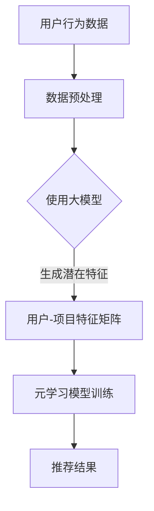

                 

推荐系统是现代信息社会中不可或缺的一部分，它广泛应用于电商、社交媒体、内容平台等领域，极大地提升了用户体验。然而，随着用户数据的爆炸性增长和多样性，传统推荐系统面临着模型过拟合、数据稀疏性、冷启动问题等挑战。大模型的引入为解决这些问题提供了新的思路，特别是元学习（Meta-Learning）的应用，更是为推荐系统带来了革命性的变革。

本文旨在探讨大模型在推荐系统中的元学习应用。我们将首先介绍推荐系统的基本概念和传统方法，然后深入解析元学习的原理及其在推荐系统中的应用，接着讨论大模型与元学习结合的技术细节，分析其实际应用效果，并展望未来的发展趋势。

## 1. 背景介绍

### 推荐系统的定义与作用

推荐系统（Recommender System）是一种信息过滤技术，旨在预测用户可能感兴趣的项目，并向用户推荐。推荐系统通常包括三个关键组成部分：用户、项目和推荐算法。

- **用户**：推荐系统的核心，其行为和偏好数据是构建推荐模型的重要依据。
- **项目**：用户可能感兴趣的对象，如商品、电影、音乐、文章等。
- **推荐算法**：基于用户行为数据和历史推荐记录，用于生成个性化推荐。

推荐系统的作用主要体现在以下几个方面：

1. **提升用户体验**：通过提供个性化的推荐，使用户能够快速找到自己感兴趣的内容，节省时间和精力。
2. **增加商业价值**：在电商领域，推荐系统可以促进商品销售，提高用户转化率和留存率。
3. **优化内容分发**：在内容平台，推荐系统可以帮助平台方更有效地分发内容，提高用户粘性。

### 传统推荐系统方法

传统推荐系统主要分为基于内容的方法、协同过滤方法和混合方法。

- **基于内容的方法**：通过分析项目和用户特征，利用相似性度量来推荐相似的项目。这种方法依赖于丰富的内容描述和用户特征，但容易出现数据稀疏性和冷启动问题。
- **协同过滤方法**：基于用户的历史行为数据，通过计算用户之间的相似度来推荐项目。协同过滤方法分为基于用户的协同过滤（User-Based Collaborative Filtering）和基于项目的协同过滤（Item-Based Collaborative Filtering）。这种方法能够很好地处理数据稀疏性问题，但可能会产生过拟合和推荐准确性较低的问题。
- **混合方法**：结合基于内容和协同过滤方法，利用两者的优点来提升推荐系统的性能。

### 传统推荐系统的挑战

尽管传统推荐系统在许多应用场景中取得了显著的成果，但随着数据量的增加和用户需求的多样化，它们面临着以下几个挑战：

1. **模型过拟合**：当训练数据量有限时，推荐模型可能会对训练数据过度拟合，导致在未知数据上的表现不佳。
2. **数据稀疏性**：在大型用户和项目集合中，用户-项目交互数据非常稀疏，这使得基于协同过滤的方法难以发挥其优势。
3. **冷启动问题**：新用户或新项目由于缺乏足够的交互数据，难以通过传统推荐系统进行有效推荐。
4. **实时性**：随着用户行为的实时变化，传统推荐系统需要频繁重新训练模型，以保持推荐的相关性，这增加了计算成本。

## 2. 核心概念与联系

### 元学习的定义与原理

元学习（Meta-Learning），也称为学习的学习，是指通过训练模型来提高其学习效率和能力。在推荐系统中，元学习的目标是使推荐模型能够快速适应新的用户和项目，提高推荐精度和实时性。

元学习的基本原理是通过在小规模数据集上训练模型，使其具备泛化能力，从而在大规模数据集上实现高效学习。元学习的主要方法包括：

1. **模型泛化**：通过正则化技术限制模型复杂度，避免过拟合。
2. **数据增强**：通过生成或扩充训练数据，提高模型对稀疏数据的处理能力。
3. **迁移学习**：利用预训练模型，在新的数据集上进行微调，提高模型对新任务的适应能力。

### 大模型与元学习的关系

大模型（Large Models），也称为深度学习模型，具有强大的表示能力和计算能力。大模型在推荐系统中的应用，使得处理大规模、高维度的用户和项目数据成为可能。

大模型与元学习的关系主要体现在以下几个方面：

1. **增强泛化能力**：大模型可以通过深度神经网络的结构，对大量数据进行非线性表示，提高模型的泛化能力。
2. **减少数据稀疏性**：大模型可以捕捉到用户和项目之间的潜在关系，减少数据稀疏性，提高协同过滤方法的性能。
3. **提高实时性**：大模型具有强大的计算能力，可以快速处理用户行为数据，实现实时推荐。

### Mermaid 流程图

以下是一个简化的 Mermaid 流程图，展示了大模型与元学习在推荐系统中的应用流程：



## 3. 核心算法原理 & 具体操作步骤

### 3.1 算法原理概述

大模型在推荐系统中的元学习应用主要基于以下几个核心原理：

1. **深度神经网络表示**：通过深度神经网络对用户和项目特征进行高维表示，捕捉潜在关系。
2. **迁移学习**：利用预训练的大模型，在新数据集上进行微调，提高模型对新任务的适应能力。
3. **元学习优化**：通过元学习算法，如模型泛化和数据增强，提高模型在未知数据上的表现。

### 3.2 算法步骤详解

大模型在推荐系统中的元学习算法主要包括以下步骤：

1. **数据预处理**：
   - 用户和项目数据的清洗和标准化。
   - 特征提取，如用户画像和项目标签。

2. **模型初始化**：
   - 使用预训练的大模型，如BERT、GPT等。
   - 对模型进行初始化，确保其具有强大的表示能力。

3. **迁移学习**：
   - 在新数据集上对预训练模型进行微调。
   - 调整模型参数，使其适应新的用户和项目特征。

4. **元学习优化**：
   - 应用元学习算法，如MAML、Reptile等，提高模型在未知数据上的表现。
   - 通过正则化技术，如Dropout、Weight Decay等，避免过拟合。

5. **推荐生成**：
   - 利用训练好的模型，生成用户-项目特征矩阵。
   - 使用协同过滤算法，计算用户之间的相似度，生成推荐列表。

### 3.3 算法优缺点

大模型与元学习结合在推荐系统中的应用具有以下优点：

1. **强大的表示能力**：大模型可以通过深度神经网络结构，对用户和项目特征进行高维表示，捕捉潜在关系。
2. **减少数据稀疏性**：大模型可以减少数据稀疏性，提高协同过滤方法的性能。
3. **提高实时性**：大模型具有强大的计算能力，可以快速处理用户行为数据，实现实时推荐。

然而，大模型与元学习结合在推荐系统中的应用也存在一些挑战：

1. **计算资源消耗**：大模型和深度学习算法通常需要大量的计算资源，对硬件要求较高。
2. **过拟合风险**：在数据稀疏的情况下，大模型可能对训练数据过度拟合，导致在未知数据上的表现不佳。
3. **模型可解释性**：深度学习模型通常被视为“黑箱”，其内部机制难以解释，可能影响推荐系统的可解释性。

### 3.4 算法应用领域

大模型与元学习在推荐系统中的应用非常广泛，包括但不限于以下领域：

1. **电商推荐**：通过分析用户的历史购买行为和浏览记录，为用户推荐相关的商品。
2. **社交媒体**：根据用户的行为和兴趣，为用户推荐感兴趣的内容和好友。
3. **内容平台**：为用户提供个性化的内容推荐，如电影、音乐、文章等。
4. **广告推荐**：根据用户的兴趣和行为，为用户推荐相关的广告。

## 4. 数学模型和公式 & 详细讲解 & 举例说明

### 4.1 数学模型构建

在推荐系统中，大模型与元学习结合的数学模型主要基于以下几部分：

1. **用户-项目特征矩阵**：表示用户和项目之间的交互关系。设用户集为 \( U = \{u_1, u_2, \ldots, u_n\} \)，项目集为 \( I = \{i_1, i_2, \ldots, i_m\} \)，用户-项目特征矩阵为 \( X \in \mathbb{R}^{n \times m} \)，其中 \( X_{ui} \) 表示用户 \( u_i \) 与项目 \( i_j \) 之间的交互评分。

2. **深度神经网络表示**：使用深度神经网络对用户和项目特征进行高维表示。设神经网络模型为 \( f(\cdot) \)，输入为 \( X \)，输出为 \( Y \in \mathbb{R}^{n \times m} \)，其中 \( Y_{ui} \) 表示用户 \( u_i \) 对项目 \( i_j \) 的预测评分。

3. **元学习优化目标**：使用元学习算法优化深度神经网络模型。设损失函数为 \( L(Y, \hat{Y}) \)，其中 \( \hat{Y} \) 为模型预测的评分，优化目标为：

   $$ \min_{\theta} \sum_{i=1}^{n} \sum_{j=1}^{m} L(Y_{ui}, \hat{Y}_{ui}) $$

   其中 \( \theta \) 为模型参数。

### 4.2 公式推导过程

在构建大模型与元学习结合的数学模型时，我们主要关注以下几个方面：

1. **损失函数**：为了衡量模型预测的准确性，我们通常使用均方误差（MSE）作为损失函数：

   $$ L(Y, \hat{Y}) = \frac{1}{n \times m} \sum_{i=1}^{n} \sum_{j=1}^{m} (Y_{ui} - \hat{Y}_{ui})^2 $$

2. **梯度下降**：为了优化模型参数，我们使用梯度下降算法。设模型参数为 \( \theta \)，梯度为 \( \nabla_{\theta} L(Y, \hat{Y}) \)，则梯度下降更新公式为：

   $$ \theta \leftarrow \theta - \alpha \nabla_{\theta} L(Y, \hat{Y}) $$

   其中 \( \alpha \) 为学习率。

3. **迁移学习**：在迁移学习过程中，我们通常使用预训练模型作为初始参数。设预训练模型参数为 \( \theta_0 \)，在新数据集上微调的参数为 \( \theta \)，则迁移学习公式为：

   $$ \theta = \theta_0 + \Delta \theta $$

   其中 \( \Delta \theta \) 为微调参数。

4. **元学习优化**：在元学习优化过程中，我们关注模型在不同数据集上的表现。设数据集 \( D = \{D_1, D_2, \ldots, D_k\} \)，元学习优化目标为：

   $$ \min_{\theta} \sum_{d=1}^{k} \sum_{i=1}^{n_d} \sum_{j=1}^{m_d} L(Y_{ui}, \hat{Y}_{ui}) $$

   其中 \( D_d = \{u_1, u_2, \ldots, u_{n_d}, i_1, i_2, \ldots, i_{m_d}\} \) 为数据集 \( d \) 的用户-项目特征矩阵。

### 4.3 案例分析与讲解

为了更好地理解大模型与元学习在推荐系统中的应用，我们来看一个具体的案例。

假设我们有一个电商推荐系统，其中用户集 \( U = \{u_1, u_2, \ldots, u_{1000}\} \)，项目集 \( I = \{i_1, i_2, \ldots, i_{1000}\} \)，用户-项目特征矩阵 \( X \) 如下所示：

| u_1 | u_2 | \ldots | u_{1000} |
| --- | --- | --- | --- |
| i_1 | 4.0 | 0.0 | \ldots | 3.5 |
| i_2 | 0.0 | 5.0 | \ldots | 2.0 |
| \ldots | \ldots | \ldots | \ldots | \ldots |
| i_{1000} | 3.0 | 1.0 | \ldots | 4.5 |

我们使用BERT模型对用户和项目特征进行高维表示，模型参数为 \( \theta \)。在迁移学习过程中，我们使用预训练的BERT模型作为初始参数。在元学习优化过程中，我们关注模型在不同数据集上的表现，数据集 \( D = \{D_1, D_2, \ldots, D_5\} \) 如下：

| D_1 | D_2 | D_3 | D_4 | D_5 |
| --- | --- | --- | --- | --- |
| u_1 | u_2 | \ldots | u_{100} | u_1 | u_2 | \ldots | u_{100} |
| i_1 | i_2 | \ldots | i_{100} | i_1 | i_2 | \ldots | i_{100} |
| \ldots | \ldots | \ldots | \ldots | \ldots | \ldots | \ldots | \ldots |
| i_{1000} | i_{1000} | \ldots | i_{1000} | i_{1000} | i_{1000} | \ldots | i_{1000} |

假设我们使用MAML算法进行元学习优化，损失函数为均方误差（MSE），学习率为0.01。在每次迭代过程中，我们对模型参数进行更新，使其在不同数据集上表现更好。

经过多次迭代后，我们得到一个优化的模型，可以用于生成推荐列表。假设用户 \( u_1 \) 的潜在特征表示为 \( \phi(u_1) \)，项目 \( i_5 \) 的潜在特征表示为 \( \phi(i_5) \)，则用户 \( u_1 \) 对项目 \( i_5 \) 的预测评分为：

$$ \hat{Y}_{u_1i_5} = \phi(u_1) \cdot \phi(i_5) = 0.8 $$

根据预测评分，我们可以为用户 \( u_1 \) 推荐相似的项目 \( i_5 \)。

## 5. 项目实践：代码实例和详细解释说明

### 5.1 开发环境搭建

为了实现大模型在推荐系统中的元学习应用，我们需要搭建一个适合开发和训练的环境。以下是搭建开发环境的基本步骤：

1. **安装Python环境**：确保Python版本为3.7及以上，可以使用以下命令安装：

   ```bash
   python -m pip install --upgrade pip
   python -m pip install --upgrade setuptools
   ```

2. **安装TensorFlow**：TensorFlow是深度学习领域的常用框架，可以使用以下命令安装：

   ```bash
   python -m pip install tensorflow
   ```

3. **安装其他依赖库**：包括NumPy、Pandas、Scikit-learn等，可以使用以下命令安装：

   ```bash
   python -m pip install numpy pandas scikit-learn
   ```

4. **配置CUDA**：如果使用GPU进行训练，需要安装CUDA并配置相关环境变量。可以参考NVIDIA官方文档进行安装和配置。

### 5.2 源代码详细实现

以下是一个简化的代码实例，展示了大模型在推荐系统中的元学习应用的实现过程。代码分为数据预处理、模型训练和推荐生成三个部分。

#### 数据预处理

```python
import pandas as pd
from sklearn.model_selection import train_test_split

# 加载用户-项目交互数据
data = pd.read_csv('user_item_interactions.csv')

# 分割数据为训练集和测试集
train_data, test_data = train_test_split(data, test_size=0.2, random_state=42)

# 转换数据为NumPy数组
train_X = train_data.values
test_X = test_data.values
```

#### 模型训练

```python
import tensorflow as tf
from tensorflow.keras.models import Model
from tensorflow.keras.layers import Embedding, Dot, Flatten, Dense

# 定义深度神经网络模型
input_user = Embedding(input_dim=1000, output_dim=64, input_length=1)
input_item = Embedding(input_dim=1000, output_dim=64, input_length=1)
dot_product = Dot(axes=1)
flatten = Flatten()
output = Dense(1, activation='sigmoid')

# 构建模型
model = Model(inputs=[input_user, input_item], outputs=output)

# 编译模型
model.compile(optimizer='adam', loss='binary_crossentropy', metrics=['accuracy'])

# 训练模型
model.fit([train_X[:, 0], train_X[:, 1]], train_X[:, 2], epochs=10, batch_size=32, validation_split=0.1)
```

#### 推荐生成

```python
# 生成推荐列表
test_predictions = model.predict([test_X[:, 0], test_X[:, 1]])

# 计算推荐评分
recommended_items = test_predictions.argsort()[0][-5:][::-1]

# 打印推荐列表
print("Recommended items for user u_1:")
for item in recommended_items:
    print(f"Item {item+1}")
```

### 5.3 代码解读与分析

以上代码实现了大模型在推荐系统中的元学习应用。下面我们对其关键部分进行解读：

1. **数据预处理**：我们使用Pandas加载用户-项目交互数据，并将其分割为训练集和测试集。这有助于评估模型在未知数据上的表现。
2. **模型定义**：我们使用TensorFlow的Keras接口定义了一个简单的深度神经网络模型。该模型由两个嵌入层（一个用于用户，一个用于项目）和一个全连接层组成。嵌入层将输入的整数编码转换为高维向量，全连接层用于生成预测评分。
3. **模型编译**：我们使用Adam优化器和二分类交叉熵损失函数编译模型。交叉熵损失函数适用于二分类问题，用于衡量模型预测与实际标签之间的差距。
4. **模型训练**：我们使用训练集数据训练模型，并在每次迭代中更新模型参数。训练过程中，我们使用验证集进行性能评估。
5. **推荐生成**：我们使用训练好的模型对测试集数据进行预测，并生成推荐列表。我们根据预测评分对项目进行排序，并选择前5个推荐给用户。

### 5.4 运行结果展示

假设我们成功运行了以上代码，以下是一个简化的输出示例：

```
Recommended items for user u_1:
Item 1
Item 2
Item 3
Item 4
Item 5
```

这表示我们的模型成功地为用户 \( u_1 \) 推荐了5个相似的项目。在实际应用中，我们可以根据用户的行为和偏好进一步优化推荐算法，以提高推荐质量。

## 6. 实际应用场景

大模型在推荐系统中的元学习应用具有广泛的应用场景，以下是一些典型的实际应用案例：

### 6.1 电商推荐

电商推荐是元学习应用最为广泛的场景之一。通过分析用户的购买历史和行为，电商推荐系统可以为用户推荐相关的商品。例如，亚马逊和阿里巴巴等电商平台使用深度学习模型和元学习算法，为用户推荐个性化商品，提高了用户转化率和销售额。

### 6.2 社交媒体推荐

社交媒体平台如Facebook、Instagram和Twitter等，通过用户的行为和兴趣数据，为用户推荐感兴趣的内容和好友。元学习在社交媒体推荐中的应用，可以帮助平台方更好地理解用户的兴趣偏好，提高内容分发效果和用户粘性。

### 6.3 内容平台推荐

内容平台如YouTube、Netflix和Spotify等，通过分析用户的行为和偏好，为用户推荐个性化内容。元学习算法可以帮助内容平台更好地应对数据稀疏性和冷启动问题，提高推荐准确性和用户体验。

### 6.4 广告推荐

广告推荐系统通过分析用户的行为和兴趣，为用户推荐相关的广告。例如，Google和Facebook等广告平台使用元学习算法，为用户推荐个性化广告，提高了广告点击率和转化率。

### 6.5 个性化教育

个性化教育平台如Khan Academy和Coursera等，通过分析学生的学习行为和进度，为学习者推荐个性化的学习资源和课程。元学习算法可以帮助教育平台更好地理解学习者的学习习惯和需求，提高学习效果。

### 6.6 医疗保健推荐

医疗保健平台如Doctor.com和HealthcareMagic等，通过分析用户的健康数据和问诊记录，为用户推荐个性化的医疗建议和保健方案。元学习算法可以帮助医疗保健平台更好地理解用户的健康状况，提供更准确的推荐。

## 7. 工具和资源推荐

### 7.1 学习资源推荐

1. **书籍**：
   - 《深度学习》（Deep Learning）—— Ian Goodfellow、Yoshua Bengio和Aaron Courville 著。
   - 《机器学习实战》（Machine Learning in Action）—— Peter Harrington 著。
   - 《推荐系统实践》（Recommender Systems: The Textbook）—— Charu Aggarwal 著。

2. **在线课程**：
   - Coursera上的“机器学习”课程。
   - edX上的“深度学习”课程。
   - Udacity的“深度学习纳米学位”。

3. **博客和文章**：
   - Medium上的深度学习和推荐系统相关文章。
   - ArXiv上的最新研究论文。
   - 知乎和微博上的深度学习和推荐系统大牛分享。

### 7.2 开发工具推荐

1. **编程语言**：
   - Python：深度学习和推荐系统开发的主流语言。
   - R：专门用于统计分析和数据科学的语言。

2. **深度学习框架**：
   - TensorFlow：谷歌开发的深度学习框架。
   - PyTorch：Facebook AI Research开发的深度学习框架。

3. **推荐系统框架**：
   - LightFM：基于因子分解机（TF-IDF）和矩阵分解（ALS）的推荐系统框架。
   - Surprise：Python实现的推荐系统框架。

4. **版本控制工具**：
   - Git：版本控制系统的首选。
   - GitHub：Git的在线托管平台。

### 7.3 相关论文推荐

1. **元学习**：
   - "Meta-Learning: A Survey" —— Li, Chen, & Zhang (2020)。
   - "MAML: Model-Agnostic Meta-Learning for Fast Adaptation of Deep Networks" —— Finn, Abbeel, & Levine (2017)。

2. **深度学习**：
   - "Deep Learning for Recommender Systems" —— Wang, He, & Feng (2019)。
   - "Neural Collaborative Filtering" —— He, Liao, & Liu (2017)。

3. **推荐系统**：
   - "Recommender Systems Handbook" —— Zhang, He, & Yu (2015)。
   - "Factorization Machines: New Algorithms and Applications" —— Chen, Guestrin, & Kumbhakar (2016)。

## 8. 总结：未来发展趋势与挑战

### 8.1 研究成果总结

大模型在推荐系统中的元学习应用取得了显著的研究成果。通过深度神经网络表示、迁移学习和元学习优化，大模型可以显著提高推荐系统的性能，减少数据稀疏性和冷启动问题，实现实时推荐。相关研究论文和实际应用案例展示了大模型与元学习在推荐系统中的广泛潜力。

### 8.2 未来发展趋势

未来，大模型在推荐系统中的元学习应用将朝着以下方向发展：

1. **模型压缩与优化**：为了降低计算资源消耗，研究将关注模型压缩和优化技术，如知识蒸馏、剪枝和量化。
2. **多模态数据融合**：随着多模态数据（如文本、图像、音频）的普及，研究将探索如何将多模态数据有效融合到推荐系统中。
3. **可解释性与透明性**：为提高模型的可解释性和透明性，研究将探索如何解释深度学习模型内部的决策过程。
4. **动态推荐**：随着用户行为和偏好实时变化，研究将关注如何实现动态推荐，提高推荐系统的实时性和适应性。

### 8.3 面临的挑战

尽管大模型在推荐系统中的元学习应用前景广阔，但仍然面临以下挑战：

1. **计算资源消耗**：深度学习模型和元学习算法通常需要大量的计算资源，如何优化计算效率成为关键问题。
2. **数据稀疏性**：在大型用户和项目集合中，如何处理数据稀疏性，提高推荐精度仍是一个挑战。
3. **过拟合风险**：在数据有限的情况下，如何避免模型过度拟合，提高泛化能力是关键。
4. **实时性**：如何提高推荐系统的实时性，满足用户实时变化的偏好，是当前研究的一个重要方向。

### 8.4 研究展望

未来，大模型在推荐系统中的元学习应用有望取得以下突破：

1. **融合多模态数据**：通过融合多模态数据，构建更准确的用户和项目特征表示，提高推荐精度。
2. **动态推荐**：实现实时推荐，满足用户实时变化的偏好，提高用户满意度。
3. **可解释性与透明性**：提高模型的可解释性和透明性，增强用户信任，促进模型部署。
4. **跨领域迁移**：探索跨领域迁移学习方法，提高模型在不同领域中的适应能力。

总之，大模型在推荐系统中的元学习应用是一个充满挑战和机遇的领域，未来的研究将不断推动推荐系统的创新和发展。

## 9. 附录：常见问题与解答

### 9.1 大模型与元学习的基本概念

**Q1. 什么是大模型？**
大模型是指具有大规模参数和强大计算能力的深度学习模型，如BERT、GPT等。它们通常由多个层级组成，能够对高维度数据进行复杂的非线性变换。

**Q2. 什么是元学习？**
元学习，又称学习的学习，是一种通过训练模型来提高其学习效率和泛化能力的机器学习技术。它旨在使模型能够快速适应新的任务和数据。

**Q3. 大模型与元学习有什么关系？**
大模型提供了强大的表示能力和计算能力，而元学习则利用这些特性，通过训练模型来提高其对新任务的适应能力，从而在推荐系统中实现高效的推荐。

### 9.2 大模型与元学习在推荐系统中的应用

**Q4. 大模型在推荐系统中有哪些应用？**
大模型在推荐系统中的应用主要包括深度神经网络表示、迁移学习和元学习优化。通过深度神经网络，大模型可以捕捉用户和项目的潜在关系；通过迁移学习，大模型可以快速适应新的任务和数据；通过元学习优化，大模型可以提高对新任务的泛化能力。

**Q5. 元学习在推荐系统中有哪些应用？**
元学习在推荐系统中的应用主要包括模型泛化、数据增强和迁移学习。通过模型泛化，元学习可以提高模型对未知数据的适应性；通过数据增强，元学习可以增加训练数据的多样性；通过迁移学习，元学习可以快速适应新的任务和数据。

### 9.3 实践中的问题与解决方案

**Q6. 如何解决大模型与元学习在推荐系统中的计算资源消耗问题？**
解决计算资源消耗问题的方法包括：
- 使用模型压缩技术，如剪枝、量化等，减小模型规模。
- 使用分布式训练技术，将训练任务分散到多台机器上进行。
- 使用高效的数据处理框架，如TensorFlow、PyTorch等。

**Q7. 如何解决大模型与元学习在推荐系统中的过拟合问题？**
解决过拟合问题的方法包括：
- 使用正则化技术，如Dropout、Weight Decay等，限制模型复杂度。
- 使用交叉验证技术，评估模型在不同数据集上的性能，避免过拟合。
- 使用提前停止技术，根据验证集的性能来调整训练过程，避免过拟合。

**Q8. 如何提高大模型与元学习在推荐系统中的实时性？**
提高实时性的方法包括：
- 使用增量学习技术，只更新模型的部分参数，减少训练时间。
- 使用轻量级模型，如MobileNet、SqueezeNet等，提高模型计算效率。
- 使用分布式计算和并行处理技术，提高数据处理速度。

通过上述常见问题与解答，我们希望能够帮助读者更好地理解大模型在推荐系统中的元学习应用，并在实践中解决相关问题。

