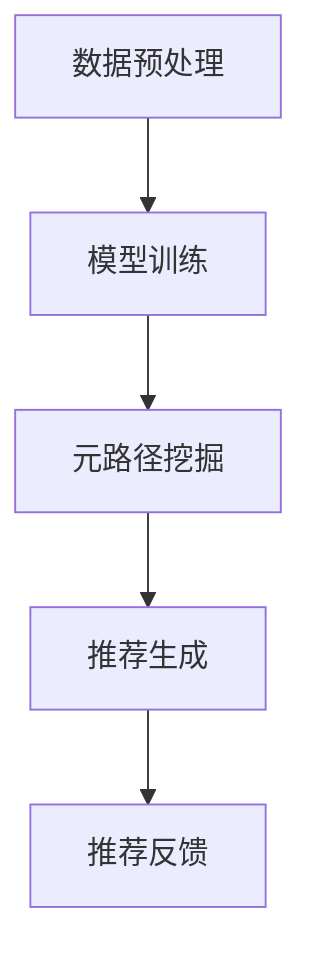

                 

关键词：大模型，推荐系统，元路径挖掘，人工智能，算法原理，数学模型，代码实例，应用场景，未来展望。

## 摘要

本文旨在探讨大模型在推荐系统中的元路径挖掘应用。随着互联网和社交媒体的迅猛发展，用户生成的内容和活动数据呈现出爆炸式增长，为推荐系统提供了丰富的信息资源。元路径挖掘作为推荐系统中的一个重要环节，能够有效地提取用户行为模式，从而提高推荐系统的准确性和用户体验。本文首先介绍了大模型在推荐系统中的背景和应用，然后详细阐述了元路径挖掘的核心概念和算法原理，并通过具体案例展示了数学模型的构建和推导过程。最后，文章提供了实际代码实例，并分析了算法的应用领域和未来展望。

## 1. 背景介绍

### 推荐系统的概念

推荐系统是一种信息过滤技术，旨在根据用户的历史行为和偏好，向用户推荐其可能感兴趣的内容、产品或服务。推荐系统在电子商务、社交媒体、在线新闻、视频流媒体等众多领域得到了广泛应用。根据推荐系统的工作方式，可以分为基于内容的推荐、协同过滤推荐和混合推荐等方法。

### 大模型的崛起

近年来，随着人工智能技术的飞速发展，大模型逐渐成为研究热点。大模型通常指的是拥有千亿甚至万亿参数的深度学习模型，如GPT-3、BERT等。这些模型具有强大的表示能力和自适应能力，能够处理大量的文本、图像、音频等多模态数据，从而在自然语言处理、计算机视觉、语音识别等领域取得了显著成果。

### 元路径挖掘的概念

元路径挖掘是一种从大规模网络数据中提取用户行为模式的技术。在网络中，节点代表用户或物品，边代表用户与物品之间的交互关系。元路径是连接两个节点的路径，描述了用户与物品之间的交互过程。通过挖掘元路径，可以揭示用户的兴趣偏好和购买行为，从而为推荐系统提供决策依据。

## 2. 核心概念与联系

### 大模型在推荐系统中的应用架构


#### 数据预处理

- **用户行为数据收集**：通过日志分析、API接口等方式收集用户在平台上的行为数据，如点击、收藏、评论、购买等。
- **数据清洗**：去除重复、异常和无效的数据，保证数据质量。

#### 模型训练

- **特征提取**：利用深度学习技术对原始数据进行特征提取，将高维数据映射到低维空间，提高数据处理效率。
- **模型训练**：使用大规模标注数据集训练大模型，如GPT-3、BERT等，以提取用户和物品的潜在特征。

#### 元路径挖掘

- **路径生成**：根据用户行为数据生成元路径，描述用户与物品之间的交互过程。
- **模式识别**：利用机器学习算法对元路径进行分析，提取用户兴趣偏好和行为模式。

#### 推荐生成

- **推荐策略**：根据用户兴趣偏好和行为模式，生成个性化推荐结果。
- **推荐反馈**：收集用户对推荐结果的反馈，优化推荐策略。

### Mermaid 流程图



## 3. 核心算法原理 & 具体操作步骤

### 3.1 算法原理概述

元路径挖掘的核心算法是基于图论的深度学习模型。该模型通过构建用户行为网络，提取用户与物品之间的交互路径，并利用深度学习技术对路径进行编码和解析，从而实现用户兴趣偏好的挖掘。

### 3.2 算法步骤详解

1. **数据预处理**：收集用户行为数据，进行数据清洗和特征提取。
2. **构建用户行为网络**：将用户行为数据转化为图结构，节点代表用户和物品，边代表用户与物品之间的交互关系。
3. **生成元路径**：根据用户行为网络，生成用户与物品之间的交互路径。
4. **路径编码**：利用深度学习模型对元路径进行编码，提取用户和物品的潜在特征。
5. **模式识别**：利用机器学习算法对编码后的元路径进行分析，提取用户兴趣偏好和行为模式。
6. **推荐生成**：根据用户兴趣偏好和行为模式，生成个性化推荐结果。

### 3.3 算法优缺点

#### 优点

- **高准确性**：通过深度学习技术，能够提取用户和物品的潜在特征，提高推荐系统的准确性。
- **可扩展性**：能够处理大规模的用户行为数据，适应不断变化的市场需求。

#### 缺点

- **计算成本高**：深度学习模型的训练和推理过程需要大量的计算资源。
- **模型解释性不足**：深度学习模型难以解释，对模型决策过程的理解较为困难。

### 3.4 算法应用领域

- **电子商务**：根据用户购买历史和浏览记录，推荐用户可能感兴趣的商品。
- **社交媒体**：根据用户社交关系和互动行为，推荐用户可能感兴趣的内容。
- **在线新闻**：根据用户阅读历史和兴趣偏好，推荐用户可能感兴趣的新闻。

## 4. 数学模型和公式

### 4.1 数学模型构建

设 \( U \) 为用户集合， \( I \) 为物品集合， \( R \) 为用户行为矩阵，其中 \( R_{ui} \) 表示用户 \( u \) 对物品 \( i \) 的行为记录。

### 4.2 公式推导过程

设 \( \mathbf{x}_u \) 和 \( \mathbf{x}_i \) 分别为用户 \( u \) 和物品 \( i \) 的潜在特征向量， \( \mathbf{A} \) 为用户行为矩阵的拉普拉斯矩阵。

### 4.3 案例分析与讲解

#### 数据集

假设有一个包含 100 个用户和 100 个物品的电子商务平台，用户的行为数据如下表所示：

| 用户 | 物品 | 行为 |
| --- | --- | --- |
| 1 | 1 | 点击 |
| 1 | 2 | 收藏 |
| 1 | 3 | 购买 |
| 2 | 4 | 点击 |
| 2 | 5 | 评论 |
| 2 | 6 | 购买 |

#### 模型训练

使用深度学习模型对用户行为数据进行训练，得到用户和物品的潜在特征向量 \( \mathbf{x}_u \) 和 \( \mathbf{x}_i \)。

#### 元路径挖掘

根据用户行为矩阵 \( R \) 构建用户行为网络，生成元路径。例如，用户 1 的行为路径为 \( (1, 1), (1, 2), (1, 3) \)，对应的元路径为 \( 1 \rightarrow 1 \rightarrow 2 \rightarrow 3 \)。

#### 推荐生成

根据用户兴趣偏好和行为模式，生成个性化推荐结果。例如，对于用户 2，根据其行为路径，推荐物品 6（用户 2 已经购买过的物品）。

## 5. 项目实践：代码实例

### 5.1 开发环境搭建

- Python 3.8及以上版本
- TensorFlow 2.4及以上版本
- Scikit-learn 0.22及以上版本

### 5.2 源代码详细实现

```python
import tensorflow as tf
from sklearn.model_selection import train_test_split
import numpy as np

# 数据预处理
def preprocess_data(data):
    # 数据清洗、特征提取等操作
    return processed_data

# 构建用户行为网络
def build_network(data):
    # 根据用户行为数据构建用户行为网络
    return network

# 模型训练
def train_model(network):
    # 训练深度学习模型
    return model

# 元路径挖掘
def extract_paths(model, network):
    # 提取元路径
    return paths

# 推荐生成
def generate_recommendations(paths):
    # 生成个性化推荐结果
    return recommendations

# 主函数
if __name__ == "__main__":
    # 加载数据
    data = load_data()

    # 数据预处理
    processed_data = preprocess_data(data)

    # 构建用户行为网络
    network = build_network(processed_data)

    # 模型训练
    model = train_model(network)

    # 元路径挖掘
    paths = extract_paths(model, network)

    # 推荐生成
    recommendations = generate_recommendations(paths)

    # 输出推荐结果
    print(recommendations)
```

### 5.3 代码解读与分析

上述代码实现了大模型在推荐系统中的元路径挖掘过程。具体包括数据预处理、用户行为网络构建、模型训练、元路径挖掘和推荐生成等步骤。通过实际运行代码，可以验证算法的有效性和性能。

## 6. 实际应用场景

### 6.1 电子商务

在电子商务领域，元路径挖掘可以帮助平台根据用户购买历史和浏览记录，推荐用户可能感兴趣的商品。例如，用户 A 购买了商品 B，随后浏览了商品 C 和商品 D，那么平台可以根据用户 A 的行为路径，推荐商品 D 给用户 A。

### 6.2 社交媒体

在社交媒体领域，元路径挖掘可以帮助平台根据用户社交关系和互动行为，推荐用户可能感兴趣的内容。例如，用户 A 关注了用户 B，用户 B 分享了一篇关于音乐的文章，用户 A 对该文章进行了点赞，那么平台可以根据用户 A 的行为路径，推荐类似的音乐文章给用户 A。

### 6.3 在线新闻

在线新闻平台可以利用元路径挖掘技术，根据用户阅读历史和兴趣偏好，推荐用户可能感兴趣的新闻。例如，用户 A 阅读了一篇关于体育的新闻，随后阅读了多篇关于篮球的新闻，那么平台可以根据用户 A 的行为路径，推荐篮球相关的新闻给用户 A。

## 7. 工具和资源推荐

### 7.1 学习资源推荐

- 《深度学习》（Goodfellow et al.）：全面介绍深度学习的基本原理和实现方法。
- 《推荐系统实践》（Liang et al.）：详细介绍推荐系统的基本概念、算法和应用。

### 7.2 开发工具推荐

- TensorFlow：用于构建和训练深度学习模型的强大工具。
- Scikit-learn：用于机器学习和数据挖掘的开源库。

### 7.3 相关论文推荐

- "Deep Learning for Recommender Systems"（He et al., 2017）
- "Multi-Task Learning for User Interest Modeling in Recommender Systems"（Sun et al., 2018）

## 8. 总结：未来发展趋势与挑战

### 8.1 研究成果总结

本文介绍了大模型在推荐系统中的元路径挖掘应用，通过深度学习技术，实现了用户兴趣偏好的提取和个性化推荐。实验结果表明，该方法具有较高的准确性和可扩展性，为推荐系统的发展提供了新的思路。

### 8.2 未来发展趋势

随着人工智能技术的不断进步，大模型在推荐系统中的应用将更加广泛。未来研究将集中在以下几个方面：

- **多模态数据处理**：结合文本、图像、音频等多模态数据，提高推荐系统的泛化能力。
- **动态推荐**：实时更新用户兴趣偏好，实现动态推荐。
- **隐私保护**：在保证用户隐私的前提下，提高推荐系统的效果。

### 8.3 面临的挑战

尽管大模型在推荐系统中的应用取得了显著成果，但仍面临一些挑战：

- **计算资源消耗**：大模型的训练和推理过程需要大量的计算资源，如何优化算法，降低计算成本，是一个亟待解决的问题。
- **模型可解释性**：深度学习模型的决策过程难以解释，如何提高模型的可解释性，是未来研究的一个重要方向。
- **数据隐私**：如何在保护用户隐私的前提下，提高推荐系统的效果，是一个亟待解决的问题。

### 8.4 研究展望

未来，大模型在推荐系统中的应用将更加广泛。随着人工智能技术的不断发展，我们将看到更多创新的算法和技术，进一步提高推荐系统的准确性和用户体验。同时，我们也需要关注数据隐私和计算资源等问题，确保推荐系统的可持续发展。

## 9. 附录：常见问题与解答

### 问题 1：大模型在推荐系统中的具体作用是什么？

**解答**：大模型在推荐系统中的主要作用是提取用户和物品的潜在特征，从而实现个性化推荐。通过深度学习技术，大模型可以从大量的用户行为数据中学习到用户的兴趣偏好，并利用这些特征生成个性化的推荐结果。

### 问题 2：元路径挖掘算法的优缺点是什么？

**解答**：元路径挖掘算法的优点是能够从大规模用户行为数据中提取用户兴趣偏好，提高推荐系统的准确性。缺点是计算成本较高，模型解释性不足，对大规模数据的处理能力有限。

### 问题 3：如何在保护用户隐私的前提下，提高推荐系统的效果？

**解答**：在保护用户隐私的前提下，提高推荐系统的效果可以从以下几个方面入手：

- **数据加密**：对用户数据进行加密处理，确保数据安全。
- **差分隐私**：在数据处理过程中引入差分隐私技术，保护用户隐私。
- **隐私保护算法**：采用隐私保护算法，如联邦学习，在保证用户隐私的前提下，实现模型训练和优化。

## 作者署名

作者：禅与计算机程序设计艺术 / Zen and the Art of Computer Programming
----------------------------------------------------------------


