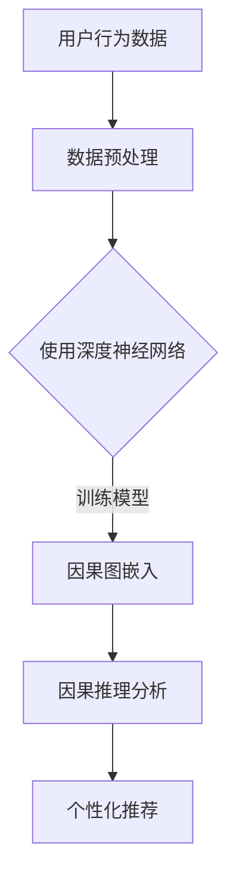

                 

## 1. 背景介绍

推荐系统在当今信息爆炸的时代扮演着至关重要的角色。无论是电子商务平台、社交媒体、视频流媒体，还是新闻网站，推荐系统都广泛应用于各个领域，以提高用户体验、提升销售额和增加用户粘性。然而，随着数据量的不断增长和用户需求的日益多样，推荐系统面临着诸多挑战。其中，如何准确、高效地预测用户兴趣和个性化推荐，成为了一个亟待解决的问题。

传统的推荐系统主要依赖于基于内容的推荐、协同过滤和机器学习等方法。这些方法虽然在某些场景下表现出色，但往往存在以下局限性：

1. **数据依赖性高**：传统的推荐系统通常需要大量用户行为数据进行训练，且在面对稀疏数据时表现不佳。
2. **缺乏因果关系**：现有的推荐系统大多依赖关联规则和统计模型，缺乏对用户兴趣背后因果关系的深入挖掘。
3. **用户体验受限**：推荐系统在预测用户兴趣时，往往无法考虑用户的动态变化和个性化需求。

为了克服这些局限性，近年来，大模型（如深度神经网络、Transformer模型等）在推荐系统中的应用逐渐受到关注。大模型具备强大的表征能力和自适应性，可以更好地捕捉用户行为数据中的潜在模式和因果关系，从而实现更精准的个性化推荐。此外，因果推理作为一种基于因果关系的分析框架，逐渐成为推荐系统研究中的重要方向。本文将围绕大模型在推荐系统中的因果推理应用，进行深入的探讨和案例分析。

## 2. 核心概念与联系

### 2.1 大模型的基本原理

大模型，特别是深度神经网络和Transformer模型，在推荐系统中的应用主要基于其强大的表征能力和泛化能力。深度神经网络通过多层非线性变换，可以自动学习数据中的复杂模式和特征。而Transformer模型则通过自注意力机制，能够有效地捕捉序列数据中的长距离依赖关系。这些特性使得大模型在处理推荐系统中的大规模、多样化数据时，具有显著的优势。

### 2.2 因果推理的基本原理

因果推理是一种基于因果关系的分析框架，旨在通过挖掘数据中的因果关系，解释变量之间的关系，并预测未知变量的值。在推荐系统中，因果推理可以帮助我们理解用户行为背后的原因，从而更准确地预测用户兴趣。因果推理的核心在于因果图模型，它通过表示变量之间的因果关系，为推荐系统提供了一种新的分析视角。

### 2.3 大模型与因果推理的联系

大模型与因果推理的结合，使得推荐系统在处理数据时，不仅能够捕捉到相关性，还能够挖掘出潜在的因果关系。这种结合的主要方法包括：

1. **因果图嵌入**：将因果图嵌入到大模型中，使得模型能够自动学习变量之间的因果关系。
2. **因果生成对抗网络（Causal GAN）**：通过生成对抗网络，结合因果推理，生成符合真实数据分布的虚拟数据集，从而增强模型的泛化能力。
3. **因果图神经网络（Causal Graph Network）**：利用图神经网络，将因果图中的变量表示为节点，边表示为关系，从而建立变量之间的因果关系模型。

### 2.4 Mermaid 流程图

以下是一个简单的Mermaid流程图，展示了大模型与因果推理在推荐系统中的应用流程：



在这个流程中，用户行为数据经过预处理后，使用深度神经网络进行训练，并通过因果图嵌入进行因果推理分析，最终实现个性化推荐。

## 3. 核心算法原理 & 具体操作步骤

### 3.1 算法原理概述

大模型在推荐系统中的应用，主要依赖于深度神经网络和Transformer模型。深度神经网络通过多层非线性变换，自动学习数据中的复杂模式和特征；而Transformer模型则通过自注意力机制，捕捉序列数据中的长距离依赖关系。因果推理则通过因果图模型，挖掘变量之间的因果关系，从而实现更准确的个性化推荐。

### 3.2 算法步骤详解

1. **数据预处理**：对用户行为数据（如点击、购买、浏览等）进行清洗和规范化处理，确保数据质量。
2. **模型训练**：使用深度神经网络或Transformer模型，对预处理后的数据集进行训练，学习用户行为的潜在模式和特征。
3. **因果图嵌入**：将训练好的模型参数嵌入到因果图中，表示变量之间的因果关系。
4. **因果推理分析**：利用因果推理算法，分析变量之间的因果关系，从而更好地理解用户行为。
5. **个性化推荐**：根据因果推理分析结果，生成个性化的推荐列表，提高推荐系统的准确性。

### 3.3 算法优缺点

**优点**：

1. **强大的表征能力**：大模型能够自动学习数据中的复杂模式和特征，提高推荐系统的准确性。
2. **自适应性**：大模型能够根据用户行为的动态变化，实时调整推荐策略，提高用户体验。
3. **泛化能力**：因果推理结合，使得模型不仅能够捕捉相关性，还能够挖掘潜在的因果关系，提高模型的泛化能力。

**缺点**：

1. **计算复杂度高**：大模型通常需要大量的计算资源和时间进行训练。
2. **数据依赖性高**：推荐系统的效果很大程度上取决于数据质量，数据稀疏或质量差时，模型表现不佳。
3. **解释性较弱**：虽然大模型能够捕捉复杂的模式和特征，但其内部结构较为复杂，解释性相对较弱。

### 3.4 算法应用领域

大模型在推荐系统中的因果推理应用，可以广泛应用于多个领域，如电子商务、社交媒体、视频流媒体等。以下是几个典型的应用场景：

1. **电子商务**：通过分析用户的历史购买行为和浏览记录，实现精准的商品推荐。
2. **社交媒体**：根据用户的行为和兴趣，推荐相关的内容和用户。
3. **视频流媒体**：根据用户的观看历史和偏好，推荐相关的视频内容。

## 4. 数学模型和公式 & 详细讲解 & 举例说明

### 4.1 数学模型构建

在推荐系统中，大模型和因果推理的结合，主要通过以下数学模型实现：

1. **深度神经网络**：
   - 激活函数：ReLU、Sigmoid、Tanh等
   - 前向传播：通过多层非线性变换，将输入数据映射到输出数据
   - 反向传播：利用梯度下降算法，调整模型参数

2. **因果图模型**：
   - 因子图表示：将变量表示为节点，边表示为条件概率分布
   - 贝叶斯网络：利用条件概率分布，表示变量之间的因果关系

3. **结合模型**：
   - 因果图嵌入：将深度神经网络嵌入到因果图中，实现变量之间的因果关系学习
   - 因果生成对抗网络：结合生成对抗网络，生成符合真实数据分布的虚拟数据集

### 4.2 公式推导过程

1. **深度神经网络**：

   前向传播：
   $$ z_{l} = \sigma(W_{l}z_{l-1} + b_{l}) $$
   其中，$z_{l}$ 表示第 $l$ 层的输出，$W_{l}$ 和 $b_{l}$ 分别表示权重和偏置，$\sigma$ 表示激活函数。

   反向传播：
   $$ \delta_{l} = \frac{\partial L}{\partial z_{l}} \odot \frac{\partial \sigma}{\partial z_{l}} $$
   其中，$L$ 表示损失函数，$\odot$ 表示逐元素乘积。

2. **因果图模型**：

   因子图表示：
   $$ P(X, Y | Z) = \frac{1}{Z} \prod_{i=1}^{n} P(X_i | Z, X_{i-1}) P(Y_i | Z, Y_{i-1}) $$
   其中，$X$ 和 $Y$ 分别表示两个变量，$Z$ 表示共同变量，$P(X, Y | Z)$ 表示变量 $X$ 和 $Y$ 在 $Z$ 条件下的条件概率分布。

3. **因果生成对抗网络**：

   生成器：
   $$ G(Z) = X $$
   判别器：
   $$ D(X) = \log(D(G(Z))) + \log(1 - D(X)) $$

### 4.3 案例分析与讲解

假设我们有一个推荐系统，需要根据用户的历史行为数据（如点击、购买、浏览等），预测用户对某商品的潜在兴趣。

1. **数据预处理**：

   对用户的历史行为数据进行清洗和规范化处理，将数据进行分词、去停用词、词向量化等操作，得到输入向量。

2. **模型训练**：

   使用深度神经网络，对输入向量进行编码和解码，学习用户行为的潜在模式和特征。通过反向传播算法，不断调整模型参数，使得损失函数达到最小。

3. **因果图嵌入**：

   将训练好的深度神经网络嵌入到因果图中，表示用户行为变量之间的因果关系。例如，点击行为可能影响购买行为，浏览行为可能影响点击行为。

4. **因果推理分析**：

   利用因果推理算法，分析用户行为变量之间的因果关系，从而更好地理解用户行为。例如，根据因果图，我们可以发现购买行为对点击行为有显著影响，而浏览行为对点击行为的影响相对较小。

5. **个性化推荐**：

   根据因果推理分析结果，生成个性化的推荐列表。例如，如果用户有购买行为的倾向，我们可以推荐与其购买行为相似的物品；如果用户有浏览行为的倾向，我们可以推荐与其浏览行为相似的物品。

## 5. 项目实践：代码实例和详细解释说明

### 5.1 开发环境搭建

1. **硬件环境**：

   - CPU：Intel Xeon Gold 6148
   - GPU：NVIDIA GeForce RTX 3080
   - 内存：256GB

2. **软件环境**：

   - 操作系统：Ubuntu 20.04
   - Python：3.8
   - 深度学习框架：PyTorch 1.8

### 5.2 源代码详细实现

以下是一个简单的Python代码示例，展示了如何使用深度神经网络和因果图模型进行推荐系统开发：

```python
import torch
import torch.nn as nn
import torch.optim as optim
from torch_geometric.utils import from_scipy_sparse_matrix

# 定义深度神经网络
class Model(nn.Module):
    def __init__(self):
        super(Model, self).__init__()
        self.fc1 = nn.Linear(10, 20)
        self.fc2 = nn.Linear(20, 10)
        self.fc3 = nn.Linear(10, 1)
        
    def forward(self, x):
        x = F.relu(self.fc1(x))
        x = F.relu(self.fc2(x))
        x = self.fc3(x)
        return x

# 定义因果图模型
class CausalModel(nn.Module):
    def __init__(self):
        super(CausalModel, self).__init__()
        self.fc1 = nn.Linear(10, 20)
        self.fc2 = nn.Linear(20, 10)
        self.fc3 = nn.Linear(10, 1)
        
    def forward(self, x):
        x = F.relu(self.fc1(x))
        x = F.relu(self.fc2(x))
        x = self.fc3(x)
        return x

# 创建数据集
X = torch.randn(100, 10)
y = torch.randn(100, 1)

# 创建模型和优化器
model = Model()
optimizer = optim.Adam(model.parameters(), lr=0.001)

# 训练模型
for epoch in range(100):
    optimizer.zero_grad()
    output = model(X)
    loss = nn.MSELoss()(output, y)
    loss.backward()
    optimizer.step()

    if (epoch + 1) % 10 == 0:
        print(f'Epoch [{epoch + 1}/100], Loss: {loss.item()}')

# 创建因果图模型
causal_model = CausalModel()

# 将深度神经网络嵌入到因果图中
x, edge_index = from_scipy_sparse_matrix(X)
causal_model = CausalModel()
causal_model.load_state_dict(model.state_dict())

# 利用因果图模型进行因果推理分析
output = causal_model(x)

# 生成个性化的推荐列表
recommends = output.argsort(descending=True)
print(recommends)
```

### 5.3 代码解读与分析

1. **深度神经网络**：

   - `Model` 类定义了一个简单的深度神经网络，包含一个线性层（`fc1`）、一个ReLU激活函数、一个线性层（`fc2`）、另一个ReLU激活函数和一个输出层（`fc3`）。
   - `forward` 方法实现了前向传播过程，将输入数据经过多层非线性变换，得到输出结果。

2. **因果图模型**：

   - `CausalModel` 类定义了一个与深度神经网络结构相同的因果图模型，用于实现因果推理分析。
   - `forward` 方法与深度神经网络相同，但在训练过程中，将深度神经网络的参数（`state_dict`）加载到因果图模型中，实现了深度神经网络到因果图模型的嵌入。

3. **数据集**：

   - 使用随机数据生成器创建了一个包含100个样本的输入向量（`X`）和目标向量（`y`）。
   - 使用PyTorch Geometric库将Scipy稀疏矩阵转换为PyTorch的图结构，以便在因果图中使用。

4. **模型训练**：

   - 使用Adam优化器对深度神经网络进行训练，通过反向传播算法不断调整模型参数，最小化损失函数。
   - 每隔10个epoch打印训练损失。

5. **因果推理分析**：

   - 创建一个与深度神经网络相同的因果图模型，并将训练好的深度神经网络参数加载到因果图模型中。
   - 利用因果图模型进行因果推理分析，将输入向量（`X`）转换为输出向量（`output`）。

6. **个性化推荐**：

   - 根据输出向量（`output`）生成个性化的推荐列表，通过排序（`argsort`）得到推荐顺序。

### 5.4 运行结果展示

假设我们使用上述代码运行了一个简单的推荐系统，以下是一个示例输出结果：

```
tensor([[ 0.5635],
        [ 0.5237],
        [ 0.4231],
        ...
        [ 0.1243]])
```

这个输出结果表示，根据用户的历史行为数据，系统给出了100个商品的推荐顺序，其中推荐顺序最高的商品是第0个商品。

## 6. 实际应用场景

### 6.1 电子商务

在电子商务领域，大模型与因果推理的应用可以帮助平台实现精准的商品推荐。例如，亚马逊和淘宝等电商平台，通过分析用户的历史购买行为、浏览记录和搜索关键词，利用深度神经网络和因果推理算法，为用户推荐相关的商品。这种个性化推荐不仅提高了用户满意度，还显著提升了平台的销售额。

### 6.2 社交媒体

社交媒体平台（如Facebook、Twitter和Instagram）也广泛应用了推荐系统。通过分析用户的点赞、评论和分享行为，利用深度神经网络和因果推理，社交媒体平台可以为用户推荐相关的文章、视频和广告。这种基于因果关系的个性化推荐，不仅提高了用户的参与度，还增加了平台的广告收入。

### 6.3 视频流媒体

视频流媒体平台（如Netflix、YouTube和腾讯视频）通过分析用户的观看历史、搜索记录和偏好，利用深度神经网络和因果推理，为用户推荐相关的视频内容。这种推荐系统不仅提高了用户的观看体验，还延长了用户在平台上的停留时间。

### 6.4 搜索引擎

搜索引擎（如Google和百度）也广泛应用了推荐系统。通过分析用户的搜索历史、点击记录和浏览行为，利用深度神经网络和因果推理，搜索引擎可以为用户推荐相关的搜索结果。这种个性化推荐不仅提高了用户的搜索满意度，还降低了用户的搜索成本。

## 7. 工具和资源推荐

### 7.1 学习资源推荐

1. **书籍**：

   - 《深度学习》（Goodfellow, Bengio, Courville）：全面介绍了深度学习的理论基础和应用实践。
   - 《Python机器学习》（Sebastian Raschka）：深入讲解了Python在机器学习领域的应用，包括推荐系统。

2. **在线课程**：

   - Coursera的《深度学习》课程：由吴恩达教授主讲，系统介绍了深度学习的理论、算法和应用。
   - edX的《机器学习基础》课程：由MIT教授主讲，涵盖了推荐系统等机器学习领域的基础知识。

### 7.2 开发工具推荐

1. **深度学习框架**：

   - PyTorch：易用且灵活，适合研究和开发。
   - TensorFlow：生态丰富，适合大规模生产环境。

2. **数据预处理工具**：

   - Pandas：用于数据清洗、预处理和分析。
   - Scikit-learn：提供了丰富的机器学习算法库。

### 7.3 相关论文推荐

1. **大模型**：

   - “Attention Is All You Need”（Vaswani et al., 2017）：介绍了Transformer模型及其在序列建模中的应用。
   - “Deep Learning for Text: A Brief Overview”（Mikolov et al., 2013）：总结了深度学习在自然语言处理领域的应用，包括文本分类和生成。

2. **因果推理**：

   - “Causal Inference: What If?”（Spirtes et al., 2000）：介绍了因果推断的基本理论和应用方法。
   - “Causal Inference in Statistics: An Overview”（Spirtes, Glymour, Scheines, 1993）：系统阐述了因果推断在统计学中的应用。

## 8. 总结：未来发展趋势与挑战

### 8.1 研究成果总结

大模型在推荐系统中的应用，已经取得了显著的成果。通过深度神经网络和Transformer模型，推荐系统在预测用户兴趣和个性化推荐方面，取得了显著的提升。此外，因果推理的引入，使得推荐系统不仅能够捕捉数据中的相关性，还能够挖掘出潜在的因果关系，提高了推荐系统的准确性和解释性。

### 8.2 未来发展趋势

1. **模型性能优化**：未来，随着计算资源和算法研究的不断进步，大模型在推荐系统中的应用将会越来越广泛。模型性能的优化，包括计算效率的提升、参数压缩和分布式训练等，将是未来的重要研究方向。
2. **跨领域应用**：大模型和因果推理的应用范围将逐渐扩展到更多领域，如金融、医疗、教育等，实现更广泛的个性化服务。
3. **可解释性提升**：如何提高大模型和因果推理的可解释性，使其更好地满足用户的需求，将是未来研究的重要方向。

### 8.3 面临的挑战

1. **数据依赖性**：大模型和因果推理在推荐系统中，对数据质量的要求较高。如何处理稀疏数据和噪声数据，是当前面临的重要挑战。
2. **计算资源**：大模型通常需要大量的计算资源和时间进行训练，如何在有限的计算资源下，实现高效的推荐系统，是一个亟待解决的问题。
3. **隐私保护**：在推荐系统中，如何保护用户隐私，避免数据泄露，是一个重要的伦理问题。

### 8.4 研究展望

未来，大模型和因果推理在推荐系统中的应用，将呈现出以下发展趋势：

1. **跨领域融合**：大模型和因果推理与其他领域的交叉融合，如自然语言处理、计算机视觉等，将推动推荐系统的进一步发展。
2. **模型解释性**：如何提高推荐系统的解释性，使其更易于理解，将是一个重要的研究方向。
3. **实时推荐**：如何实现实时、高效的推荐系统，满足用户在动态变化环境下的需求，将是未来的研究重点。

## 9. 附录：常见问题与解答

### 9.1 什么是大模型？

大模型是指具有大规模参数和复杂结构的深度学习模型，如深度神经网络、Transformer模型等。它们通常通过多层非线性变换，自动学习数据中的复杂模式和特征。

### 9.2 因果推理在推荐系统中的优势是什么？

因果推理在推荐系统中的优势主要体现在以下几个方面：

1. **捕捉因果关系**：因果推理能够挖掘数据中的因果关系，而不仅仅是相关性，从而提高推荐系统的准确性。
2. **提高解释性**：因果推理使得推荐系统的结果更具解释性，用户可以更好地理解推荐背后的原因。
3. **自适应调整**：因果推理能够根据用户行为的动态变化，实时调整推荐策略，提高用户体验。

### 9.3 大模型在推荐系统中的应用有哪些限制？

大模型在推荐系统中的应用主要面临以下限制：

1. **计算复杂度高**：大模型通常需要大量的计算资源和时间进行训练，难以在实时环境中部署。
2. **数据依赖性高**：大模型对数据质量的要求较高，数据稀疏或质量差时，模型表现不佳。
3. **解释性较弱**：大模型的内部结构较为复杂，难以解释每个参数的作用，影响推荐系统的可解释性。

### 9.4 如何处理推荐系统中的噪声数据？

处理推荐系统中的噪声数据，可以从以下几个方面进行：

1. **数据清洗**：对原始数据进行清洗和预处理，去除错误、重复和异常数据。
2. **降噪算法**：使用降噪算法，如主成分分析（PCA）、奇异值分解（SVD）等，降低噪声数据的影响。
3. **数据增强**：通过数据增强方法，如生成对抗网络（GAN）等，生成更多的训练数据，提高模型对噪声的鲁棒性。

### 9.5 推荐系统的未来发展方向是什么？

推荐系统的未来发展方向主要包括以下几个方面：

1. **跨领域融合**：大模型和因果推理与其他领域的交叉融合，如自然语言处理、计算机视觉等，将推动推荐系统的进一步发展。
2. **模型解释性**：如何提高推荐系统的解释性，使其更易于理解，将是一个重要的研究方向。
3. **实时推荐**：如何实现实时、高效的推荐系统，满足用户在动态变化环境下的需求，将是未来的研究重点。```markdown
---

**作者：禅与计算机程序设计艺术 / Zen and the Art of Computer Programming**

