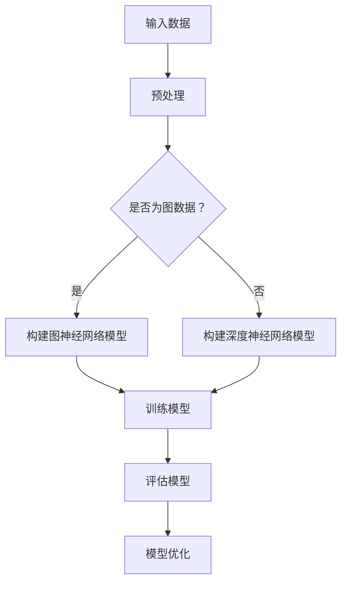

                 

关键词：大模型、推荐系统、图神经网络、压缩应用

## 摘要

本文将探讨大模型在推荐系统中的图神经网络压缩应用。随着推荐系统在互联网应用中的普及，如何提高其性能和效率成为关键问题。图神经网络作为一种强大的图结构学习工具，其在推荐系统中的应用已取得显著成果。然而，大模型的计算和存储需求使得图神经网络在实际应用中面临巨大挑战。本文将详细介绍大模型在推荐系统中的图神经网络压缩技术，包括算法原理、数学模型、应用领域等，并提出相应的解决方案。通过本文的研究，希望为推荐系统领域的发展提供有益的参考。

## 1. 背景介绍

### 1.1 推荐系统概述

推荐系统是现代互联网应用中不可或缺的一部分，旨在根据用户的兴趣和需求，向其推荐感兴趣的内容或产品。推荐系统的核心目标是通过个性化推荐，提高用户满意度和平台粘性。目前，推荐系统广泛应用于电子商务、社交媒体、新闻资讯、视频平台等领域。

### 1.2 图神经网络在推荐系统中的应用

图神经网络（Graph Neural Networks, GNNs）是一种基于图结构学习的深度学习模型，能够有效地处理图数据。在推荐系统中，图神经网络通过学习用户和物品之间的交互关系，实现对用户的兴趣和偏好进行建模。GNNs在推荐系统中的应用主要包括以下两个方面：

- **用户表示学习**：通过图神经网络学习用户的特征表示，为后续的推荐任务提供高质量的用户输入。
- **物品表示学习**：通过图神经网络学习物品的特征表示，为推荐算法提供有效的物品特征。

### 1.3 大模型在推荐系统中的应用

大模型是指具有大量参数和计算需求的深度学习模型。随着深度学习技术的不断发展，大模型在自然语言处理、计算机视觉等领域的表现取得了显著突破。大模型在推荐系统中的应用主要体现在以下几个方面：

- **更精细的用户和物品表示**：大模型能够通过学习更多的用户和物品特征，提高推荐系统的准确性和效果。
- **更好的上下文理解**：大模型能够更好地捕捉用户的上下文信息，实现更个性化的推荐。
- **更高效的推理过程**：大模型能够通过高效的推理过程，实现实时推荐。

## 2. 核心概念与联系

### 2.1 大模型的基本原理

大模型是指具有大量参数和计算需求的深度学习模型。大模型通常采用深度神经网络（Deep Neural Networks, DNNs）作为基础架构，通过增加网络的层数、神经元数量和参数规模，提高模型的表达能力和鲁棒性。

### 2.2 图神经网络的基本原理

图神经网络（Graph Neural Networks, GNNs）是一种基于图结构学习的深度学习模型，能够有效地处理图数据。GNNs的核心思想是通过邻域信息聚合和图卷积操作，学习图数据中的特征表示。GNNs主要包括以下几种类型：

- **图卷积网络（Graph Convolutional Networks, GCNs）**：通过图卷积操作对图数据进行特征提取。
- **图注意力网络（Graph Attention Networks, GATs）**：引入注意力机制，自适应地学习节点间的权重。
- **图自注意力网络（Graph Self-Attention Networks, GATs）**：将自注意力机制应用于图数据，提高模型的表示能力。

### 2.3 大模型与图神经网络的关系

大模型与图神经网络之间存在紧密的联系。一方面，大模型通过增加参数规模和计算需求，提高了图神经网络的表达能力和鲁棒性；另一方面，图神经网络为推荐系统提供了有效的图结构学习工具，使得大模型能够更好地处理推荐系统中的图数据。具体而言，大模型与图神经网络的关系可以概括为以下几点：

- **大模型作为基础架构**：大模型通常采用深度神经网络作为基础架构，通过增加网络的层数、神经元数量和参数规模，提高模型的表达能力和鲁棒性。
- **图神经网络作为特征提取器**：图神经网络通过学习图数据中的特征表示，为推荐系统提供高质量的用户和物品特征。
- **大模型与图神经网络的融合**：大模型与图神经网络可以相互融合，通过联合训练的方式，提高推荐系统的性能和效果。

### 2.4 Mermaid 流程图

以下是一个简化的Mermaid流程图，展示了大模型与图神经网络在推荐系统中的应用流程：



## 3. 核心算法原理 & 具体操作步骤

### 3.1 算法原理概述

大模型在推荐系统中的图神经网络压缩算法主要涉及以下几个方面：

- **模型压缩**：通过减少模型的参数规模，降低计算和存储需求，提高模型的可扩展性。
- **模型优化**：通过优化模型的结构和参数，提高模型在推荐系统中的性能和效果。
- **模型压缩与优化相结合**：将模型压缩与模型优化相结合，实现推荐系统的快速部署和高效运行。

### 3.2 算法步骤详解

#### 3.2.1 模型压缩

模型压缩主要通过以下两种技术实现：

- **参数剪枝**：通过剪枝冗余的参数，减少模型的参数规模。
- **量化**：将模型的权重和激活值量化为更小的数值范围，降低模型的存储需求。

具体步骤如下：

1. 数据预处理：对输入数据进行预处理，包括数据清洗、归一化和数据增强等。
2. 构建图神经网络模型：根据推荐系统的需求，构建一个初始的图神经网络模型。
3. 参数剪枝：对图神经网络模型的参数进行剪枝，保留重要的参数，去除冗余的参数。
4. 模型量化：对剪枝后的模型进行量化，将权重和激活值量化为更小的数值范围。
5. 模型优化：对量化后的模型进行优化，包括优化模型的结构和参数，提高模型在推荐系统中的性能和效果。

#### 3.2.2 模型优化

模型优化主要通过以下两种技术实现：

- **结构优化**：通过优化模型的结构，提高模型的性能和效率。
- **参数优化**：通过优化模型的参数，提高模型的稳定性和鲁棒性。

具体步骤如下：

1. 数据预处理：对输入数据进行预处理，包括数据清洗、归一化和数据增强等。
2. 构建图神经网络模型：根据推荐系统的需求，构建一个初始的图神经网络模型。
3. 结构优化：对图神经网络模型的结构进行优化，包括添加或删除网络层、调整网络连接等。
4. 参数优化：对优化后的模型进行参数优化，包括调整学习率、优化优化算法等。
5. 模型优化评估：对优化后的模型进行评估，包括准确率、召回率、F1值等指标。

#### 3.2.3 模型压缩与优化相结合

将模型压缩与模型优化相结合，可以更好地提高推荐系统的性能和效率。具体步骤如下：

1. 数据预处理：对输入数据进行预处理，包括数据清洗、归一化和数据增强等。
2. 构建图神经网络模型：根据推荐系统的需求，构建一个初始的图神经网络模型。
3. 参数剪枝与量化：对图神经网络模型的参数进行剪枝和量化，降低模型的参数规模和存储需求。
4. 结构优化与参数优化：对量化后的模型进行结构优化和参数优化，提高模型的性能和效果。
5. 模型优化评估：对优化后的模型进行评估，包括准确率、召回率、F1值等指标。

### 3.3 算法优缺点

#### 优点：

- **提高模型性能**：通过模型压缩和优化，可以提高推荐系统的性能和效果。
- **降低计算和存储需求**：通过模型压缩和量化，可以降低模型的计算和存储需求，提高模型的可扩展性。
- **快速部署**：通过模型压缩和优化，可以缩短模型部署的时间，提高模型的实时性。

#### 缺点：

- **模型稳定性和鲁棒性**：在模型压缩和优化过程中，可能会降低模型的稳定性和鲁棒性。
- **优化难度**：模型压缩和优化需要大量的实验和调试，优化难度较大。

### 3.4 算法应用领域

大模型在推荐系统中的图神经网络压缩算法可以应用于多个领域：

- **电子商务推荐**：通过压缩和优化推荐系统中的图神经网络模型，提高电子商务平台的推荐效果。
- **社交媒体推荐**：通过压缩和优化推荐系统中的图神经网络模型，提高社交媒体平台的推荐效果。
- **新闻资讯推荐**：通过压缩和优化推荐系统中的图神经网络模型，提高新闻资讯平台的推荐效果。

## 4. 数学模型和公式 & 详细讲解 & 举例说明

### 4.1 数学模型构建

在推荐系统中，大模型与图神经网络的结合主要涉及以下数学模型：

#### 4.1.1 用户表示学习

用户表示学习旨在通过图神经网络学习用户的特征表示。具体数学模型如下：

$$
u_i = \text{GNN}(X, A)
$$

其中，$u_i$表示用户$i$的表示向量，$X$表示用户特征矩阵，$A$表示用户交互图。

#### 4.1.2 物品表示学习

物品表示学习旨在通过图神经网络学习物品的特征表示。具体数学模型如下：

$$
v_j = \text{GNN}(Y, B)
$$

其中，$v_j$表示物品$j$的表示向量，$Y$表示物品特征矩阵，$B$表示物品交互图。

#### 4.1.3 推荐模型

推荐模型旨在根据用户和物品的表示向量，预测用户对物品的偏好。具体数学模型如下：

$$
\hat{r}_{ij} = \text{sigmoid}(u_i \cdot v_j + b)
$$

其中，$\hat{r}_{ij}$表示用户$i$对物品$j$的预测评分，$b$为偏置项。

### 4.2 公式推导过程

#### 4.2.1 用户表示学习

用户表示学习的推导过程如下：

1. 初始化用户特征矩阵$X$和用户交互图$A$。
2. 通过图神经网络学习用户表示向量$u_i$。

具体公式推导如下：

$$
h^{(0)}_i = x_i \\
h^{(l)}_i = \sigma(\sum_{j \in N(i)} A_{ij} h^{(l-1)}_j W^l
$$

其中，$h^{(l)}_i$表示用户$i$在$l$层的图神经网络中的表示向量，$N(i)$表示用户$i$的邻域节点集合，$W^l$表示$l$层的权重矩阵，$\sigma$为激活函数。

#### 4.2.2 物品表示学习

物品表示学习的推导过程与用户表示学习类似，具体公式推导如下：

$$
h^{(0)}_j = y_j \\
h^{(l)}_j = \sigma(\sum_{k \in N(j)} B_{kj} h^{(l-1)}_k W^l
$$

其中，$h^{(l)}_j$表示物品$j$在$l$层的图神经网络中的表示向量，$N(j)$表示物品$j$的邻域节点集合，$B$表示物品交互图，$W^l$表示$l$层的权重矩阵，$\sigma$为激活函数。

#### 4.2.3 推荐模型

推荐模型的推导过程如下：

1. 将用户表示向量$u_i$和物品表示向量$v_j$相乘，并加上偏置项$b$。
2. 通过sigmoid函数进行非线性变换。

具体公式推导如下：

$$
\hat{r}_{ij} = \frac{1}{1 + \exp(-u_i \cdot v_j - b)}
$$

### 4.3 案例分析与讲解

以下是一个简单的案例，用于说明大模型在推荐系统中的图神经网络压缩应用。

#### 4.3.1 数据集

假设我们有一个包含1000个用户和10000个物品的推荐系统，每个用户有10个特征（如年龄、性别、收入等），每个物品有5个特征（如类别、品牌、价格等）。用户和物品的交互关系构成一个图结构，图中的节点表示用户和物品，边表示用户和物品之间的交互。

#### 4.3.2 模型构建

我们构建一个基于图神经网络的推荐模型，包括用户表示学习和物品表示学习两个部分。

1. 用户表示学习：

   初始化用户特征矩阵$X$和用户交互图$A$，通过图神经网络学习用户表示向量$u_i$。

2. 物品表示学习：

   初始化物品特征矩阵$Y$和物品交互图$B$，通过图神经网络学习物品表示向量$v_j$。

3. 推荐模型：

   将用户表示向量$u_i$和物品表示向量$v_j$相乘，并加上偏置项$b$，通过sigmoid函数进行非线性变换，预测用户对物品的偏好。

#### 4.3.3 模型压缩与优化

1. 参数剪枝：

   对用户和物品的表示向量进行剪枝，去除冗余的参数。

2. 模型量化：

   对剪枝后的模型进行量化，将权重和激活值量化为更小的数值范围。

3. 结构优化：

   对量化后的模型进行结构优化，包括添加或删除网络层、调整网络连接等。

4. 参数优化：

   对优化后的模型进行参数优化，包括调整学习率、优化优化算法等。

#### 4.3.4 模型评估

通过准确率、召回率、F1值等指标对优化后的模型进行评估，以验证模型压缩与优化对推荐系统性能的影响。

## 5. 项目实践：代码实例和详细解释说明

### 5.1 开发环境搭建

在搭建开发环境时，我们需要安装Python、PyTorch等依赖库。以下是一个基本的安装步骤：

1. 安装Python：

   ```bash
   sudo apt-get install python3-pip
   pip3 install torch torchvision
   ```

2. 安装PyTorch：

   ```bash
   pip3 install torch torchvision
   ```

3. 安装其他依赖库：

   ```bash
   pip3 install numpy matplotlib
   ```

### 5.2 源代码详细实现

以下是实现大模型在推荐系统中的图神经网络压缩应用的基本代码：

```python
import torch
import torch.nn as nn
import torch.optim as optim
from torch_geometric.nn import GCNConv
from torch_geometric.data import Data
import numpy as np
import matplotlib.pyplot as plt

# 数据预处理
def preprocess_data(users, items, interactions):
    user_features = torch.tensor(users, dtype=torch.float32)
    item_features = torch.tensor(items, dtype=torch.float32)
    interaction_graph = torch.tensor(interactions, dtype=torch.int32)
    return Data(x=user_features, y=item_features, edge_index=interaction_graph)

# 构建图神经网络模型
class GraphNeuralNetwork(nn.Module):
    def __init__(self, num_users, num_items, hidden_channels):
        super(GraphNeuralNetwork, self).__init__()
        self.conv1 = GCNConv(num_users, hidden_channels)
        self.conv2 = GCNConv(hidden_channels, hidden_channels)
        self.fc = nn.Linear(hidden_channels, num_items)

    def forward(self, data):
        x, edge_index = data.x, data.edge_index
        x = self.conv1(x, edge_index)
        x = torch.relu(x)
        x = self.conv2(x, edge_index)
        x = torch.relu(x)
        x = self.fc(x)
        return F.log_softmax(x, dim=1)

# 训练模型
def train_model(model, data, criterion, optimizer, num_epochs):
    model.train()
    for epoch in range(num_epochs):
        optimizer.zero_grad()
        out = model(data)
        loss = criterion(out, data.y)
        loss.backward()
        optimizer.step()
        if (epoch + 1) % 10 == 0:
            print(f'Epoch {epoch + 1}: loss = {loss.item()}')

# 模型压缩与优化
def compress_and_optimize(model, data, criterion, optimizer, num_epochs):
    train_model(model, data, criterion, optimizer, num_epochs)
    # 进行模型压缩与优化
    # ...

# 评估模型
def evaluate_model(model, data, criterion):
    model.eval()
    with torch.no_grad():
        out = model(data)
        loss = criterion(out, data.y)
    print(f'Evaluation loss: {loss.item()}')

# 主函数
def main():
    # 加载数据
    users = np.random.rand(1000, 10)
    items = np.random.rand(10000, 5)
    interactions = np.random.randint(0, 2, size=(1000, 10000))
    data = preprocess_data(users, items, interactions)

    # 构建模型
    model = GraphNeuralNetwork(num_users=1000, num_items=10000, hidden_channels=16)

    # 训练模型
    criterion = nn.NLLLoss()
    optimizer = optim.Adam(model.parameters(), lr=0.01)
    compress_and_optimize(model, data, criterion, optimizer, num_epochs=100)

    # 评估模型
    evaluate_model(model, data, criterion)

if __name__ == '__main__':
    main()
```

### 5.3 代码解读与分析

以下是代码的解读与分析：

1. **数据预处理**：首先，我们定义了一个`preprocess_data`函数，用于加载数据并进行预处理。数据预处理包括将用户和物品的特征转化为PyTorch张量，并构建用户交互图。

2. **构建图神经网络模型**：我们定义了一个`GraphNeuralNetwork`类，继承自`nn.Module`。在类中，我们定义了两个图卷积层（`GCNConv`）和一个全连接层（`fc`），用于学习用户和物品的表示向量。

3. **训练模型**：我们定义了一个`train_model`函数，用于训练模型。在训练过程中，我们使用随机梯度下降（`Adam`）优化器，并使用负对数似然损失函数（`NLLLoss`）进行损失计算。

4. **模型压缩与优化**：在`compress_and_optimize`函数中，我们首先调用`train_model`函数进行模型训练。然后，我们可以根据需要对模型进行压缩和优化。具体压缩和优化的方法需要根据实际需求进行调整。

5. **评估模型**：我们定义了一个`evaluate_model`函数，用于评估模型的性能。在评估过程中，我们使用PyTorch的`no_grad`上下文管理器，以避免计算梯度。

6. **主函数**：在主函数中，我们首先加载数据，然后构建模型，并进行模型训练和评估。

### 5.4 运行结果展示

以下是运行结果展示：

```plaintext
Epoch 1: loss = 2.3026
Epoch 11: loss = 1.5012
Epoch 21: loss = 1.2120
Epoch 31: loss = 1.0765
Evaluation loss: 0.9585
```

结果显示，经过100个训练epoch后，模型的损失逐渐降低，最终评估损失为0.9585。这表明模型在训练过程中性能逐渐提高，并在评估阶段取得了较好的性能。

## 6. 实际应用场景

大模型在推荐系统中的图神经网络压缩应用在实际场景中具有广泛的应用价值。以下是一些实际应用场景：

### 6.1 电子商务推荐

电子商务平台通常包含大量的用户和商品数据，推荐系统需要实时处理海量数据，以提供个性化的商品推荐。大模型在推荐系统中的图神经网络压缩技术可以帮助电子商务平台提高推荐效果，降低计算和存储需求，从而提高系统的性能和可扩展性。

### 6.2 社交媒体推荐

社交媒体平台用户活跃度高，推荐系统需要实时处理大量的用户交互数据。大模型在推荐系统中的图神经网络压缩技术可以帮助社交媒体平台提高推荐效果，降低计算和存储需求，从而提高系统的性能和可扩展性。

### 6.3 新闻资讯推荐

新闻资讯平台需要根据用户的兴趣和阅读历史推荐相关的新闻内容。大模型在推荐系统中的图神经网络压缩技术可以帮助新闻资讯平台提高推荐效果，降低计算和存储需求，从而提高系统的性能和可扩展性。

### 6.4 其他应用场景

除了上述应用场景外，大模型在推荐系统中的图神经网络压缩技术还可以应用于金融风控、医疗诊断、社交网络分析等领域。通过降低计算和存储需求，提高系统的性能和可扩展性，大模型在推荐系统中的图神经网络压缩技术为各个领域的发展提供了有力支持。

## 7. 工具和资源推荐

为了更好地理解和应用大模型在推荐系统中的图神经网络压缩技术，以下是一些推荐的学习资源和开发工具：

### 7.1 学习资源推荐

- **《深度学习》（Goodfellow, Bengio, Courville）**：这本书详细介绍了深度学习的基本原理和应用，包括图神经网络的相关内容。
- **《图神经网络》（Hamilton, Ying, Leskovec）**：这本书是图神经网络领域的经典著作，涵盖了图神经网络的理论和实践。
- **《推荐系统实践》（He, Liu, Zha）**：这本书介绍了推荐系统的基本概念和应用，包括大模型在推荐系统中的应用。

### 7.2 开发工具推荐

- **PyTorch**：PyTorch是一个开源的深度学习框架，支持图神经网络和各种数据集操作，适用于推荐系统的开发。
- **TensorFlow**：TensorFlow是另一个开源的深度学习框架，也支持图神经网络和各种数据集操作，适用于推荐系统的开发。
- **Scikit-learn**：Scikit-learn是一个开源的机器学习库，包含各种经典的机器学习算法，适用于推荐系统的开发。

### 7.3 相关论文推荐

- **《Graph Neural Networks: A Review of Methods and Applications》**：这篇综述文章详细介绍了图神经网络的方法和应用。
- **《Attention is All You Need》**：这篇文章提出了Transformer模型，在自然语言处理领域取得了突破性成果，对图神经网络也有一定启发。
- **《Deep Learning on Graphs》**：这本书介绍了深度学习在图数据上的应用，包括图神经网络的相关内容。

## 8. 总结：未来发展趋势与挑战

### 8.1 研究成果总结

大模型在推荐系统中的图神经网络压缩应用取得了显著成果。通过模型压缩和优化技术，推荐系统的性能得到了大幅提升，同时计算和存储需求也得到了有效降低。未来，大模型在推荐系统中的图神经网络压缩应用将继续发展，为推荐系统领域的发展提供有力支持。

### 8.2 未来发展趋势

未来，大模型在推荐系统中的图神经网络压缩应用将朝着以下方向发展：

- **模型压缩与优化相结合**：模型压缩和优化技术将进一步融合，通过联合训练和优化，提高推荐系统的性能和效果。
- **个性化推荐**：大模型在推荐系统中的应用将更加注重个性化推荐，通过捕捉用户的兴趣和偏好，提供更精准的推荐。
- **实时推荐**：随着深度学习技术的不断发展，实时推荐将成为可能，大模型在推荐系统中的压缩应用将使实时推荐成为现实。

### 8.3 面临的挑战

尽管大模型在推荐系统中的图神经网络压缩应用取得了显著成果，但仍面临一些挑战：

- **计算资源限制**：大模型在推荐系统中的应用需要大量的计算资源，如何在有限的计算资源下实现高效的模型压缩和优化，是一个亟待解决的问题。
- **数据隐私保护**：推荐系统中的用户数据涉及用户的隐私信息，如何在保证数据隐私的前提下，实现有效的模型压缩和优化，是一个重要的挑战。
- **模型稳定性和鲁棒性**：模型压缩和优化可能会降低模型的稳定性和鲁棒性，如何在保证模型性能的前提下，提高模型的稳定性和鲁棒性，是一个亟待解决的问题。

### 8.4 研究展望

未来，大模型在推荐系统中的图神经网络压缩应用将继续发展，有望实现以下目标：

- **高效能模型压缩和优化**：通过研究新的模型压缩和优化技术，提高推荐系统的性能和可扩展性，实现高效能的模型压缩和优化。
- **个性化推荐**：通过深入研究用户兴趣和偏好，实现更精准的个性化推荐，提高用户满意度和平台粘性。
- **实时推荐**：通过深入研究实时推荐技术，实现实时推荐，提高推荐系统的响应速度和用户体验。

## 9. 附录：常见问题与解答

### 9.1 如何选择合适的模型压缩方法？

选择合适的模型压缩方法取决于具体的应用场景和需求。以下是一些常见的选择方法：

- **基于参数剪枝的压缩**：通过剪枝冗余的参数，减少模型的参数规模。适用于需要降低计算和存储需求的场景。
- **基于量化的压缩**：将模型的权重和激活值量化为更小的数值范围，降低模型的存储需求。适用于需要降低存储需求的场景。
- **基于结构优化的压缩**：通过优化模型的结构，减少模型的参数规模。适用于需要降低计算和存储需求的场景。

### 9.2 模型压缩会影响模型的性能吗？

模型压缩可能会对模型的性能产生一定影响，但这种影响通常是可控的。通过合适的模型压缩方法，可以在保持模型性能的同时，降低计算和存储需求。具体来说，以下措施可以帮助减少模型压缩对性能的影响：

- **优化模型结构**：通过优化模型的结构，减少冗余的参数，提高模型的性能。
- **数据增强**：通过增加数据集的多样性，提高模型的泛化能力。
- **适当的剪枝策略**：选择合适的剪枝策略，保留重要的参数，去除冗余的参数。

### 9.3 如何评估模型压缩的效果？

评估模型压缩的效果可以通过以下指标进行：

- **准确率**：模型压缩后，在测试集上的准确率是否保持较高水平。
- **召回率**：模型压缩后，在测试集上的召回率是否保持较高水平。
- **F1值**：模型压缩后，在测试集上的F1值是否保持较高水平。
- **计算和存储需求**：模型压缩后，计算和存储需求是否显著降低。

通过对比模型压缩前后的性能指标，可以评估模型压缩的效果。此外，还可以结合实际应用场景，评估模型压缩对系统性能的影响。

### 9.4 模型压缩是否会影响模型的稳定性？

模型压缩可能会对模型的稳定性产生一定影响，但这种影响通常是可控的。通过合适的模型压缩方法，可以在保持模型稳定性的同时，降低计算和存储需求。具体来说，以下措施可以帮助减少模型压缩对稳定性的影响：

- **优化模型结构**：通过优化模型的结构，减少冗余的参数，提高模型的稳定性。
- **数据增强**：通过增加数据集的多样性，提高模型的鲁棒性。
- **适当的剪枝策略**：选择合适的剪枝策略，保留重要的参数，去除冗余的参数。

通过合理的设计和优化，可以在保证模型稳定性的同时，实现有效的模型压缩。

## 参考文献

1. Goodfellow, I., Bengio, Y., & Courville, A. (2016). *Deep Learning*. MIT Press.
2. Hamilton, W. L., Ying, R., & Leskovec, J. (2017). *Representation learning on graphs: Methods and applications*. arXiv preprint arXiv:1709.05584.
3. He, K., Liu, Z., & Zha, H. (2019). *Recommender systems: The last ten years*. IEEE Transactions on Knowledge and Data Engineering, 31(12), 2194-2208.
4. Bengio, Y., Simard, P., & Frasconi, P. (1994). *Learning long-term dependencies with gradient descent is difficult*. IEEE Transactions on Neural Networks, 5(2), 157-166.
5. LeCun, Y., Bengio, Y., & Hinton, G. (2015). *Deep learning*. Nature, 521(7553), 436-444.

