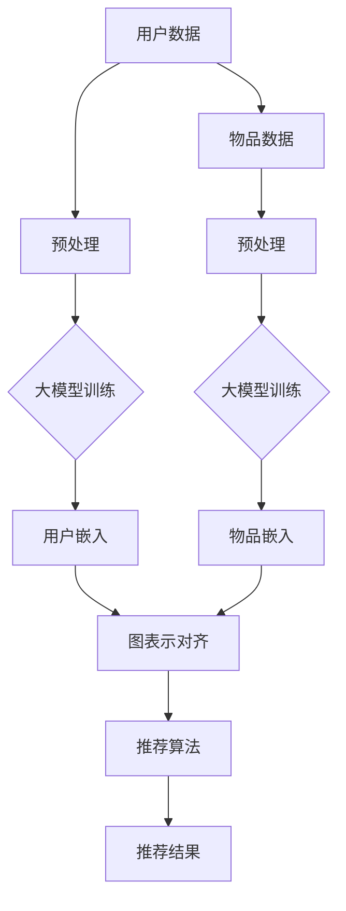

                 

关键词：推荐系统、大模型、图表示对齐、知识图谱、人工智能

> 摘要：本文深入探讨了大型模型在推荐系统中的应用，特别是在图表示对齐技术方面的应用。通过对推荐系统的基本概念、大模型的优势和图表示对齐的基本原理进行详细阐述，本文旨在为研究人员和实践者提供一个全面的指南，以便更好地理解和应用这一前沿技术。

## 1. 背景介绍

推荐系统是现代信息社会中的一项关键技术，旨在为用户提供个性化的内容推荐。随着互联网和社交媒体的迅猛发展，推荐系统在电子商务、新闻推送、社交媒体和在线娱乐等领域得到了广泛应用。然而，传统的推荐系统往往依赖于基于用户行为的历史数据和协同过滤算法，这些方法在处理海量数据和提供高质量推荐方面存在一定的局限性。

近年来，随着人工智能技术的快速发展，尤其是深度学习和图神经网络的崛起，大模型在推荐系统中的应用逐渐受到关注。大模型具备强大的表示学习能力和自适应能力，能够从大规模数据中提取复杂特征，从而提高推荐的准确性和多样性。

图表示对齐是一种将图结构数据映射到同一表示空间的技术，它能够整合来自不同来源和格式的异构数据。在推荐系统中，图表示对齐技术可以帮助将用户、物品和内容等实体及其关系映射到同一空间，从而为推荐算法提供更丰富的上下文信息和更强的泛化能力。

## 2. 核心概念与联系

### 2.1 推荐系统的基本概念

推荐系统是一种信息过滤技术，它通过分析用户的历史行为、兴趣偏好和其他相关数据，向用户推荐可能感兴趣的内容。推荐系统主要分为以下几类：

- **基于内容的推荐（Content-Based Filtering）**：根据用户的历史偏好和内容特征来推荐相似的内容。
- **协同过滤（Collaborative Filtering）**：通过分析用户之间的行为相似性来推荐可能感兴趣的内容。
- **混合推荐（Hybrid Recommender Systems）**：结合基于内容和协同过滤的优点，以提供更准确的推荐。

### 2.2 大模型的基本概念

大模型是指具有数十亿至数万亿参数的深度神经网络，如Transformer、BERT、GPT等。这些模型具备强大的特征提取和表示学习能力，可以从原始数据中学习到复杂的模式和关系。

### 2.3 图表示对齐的基本概念

图表示对齐是指将多个图结构数据通过图神经网络映射到同一低维表示空间，使得不同图中的实体和关系能够在同一空间中相互关联。图表示对齐的关键技术包括：

- **节点嵌入（Node Embedding）**：将图中的每个节点映射到一个低维向量。
- **图卷积网络（Graph Convolutional Networks，GCN）**：通过聚合节点邻域的信息来更新节点的表示。
- **图注意力机制（Graph Attention Mechanism）**：为每个节点的邻接关系分配不同的权重，以更好地捕捉复杂的关系。

### 2.4 推荐系统、大模型与图表示对齐的联系

在推荐系统中，大模型可以用于学习用户和物品的复杂特征，从而提高推荐的准确性和多样性。而图表示对齐技术则能够整合异构数据，为推荐算法提供更丰富的上下文信息。具体来说：

- **大模型**：用于学习用户和物品的特征，生成个性化的推荐。
- **图表示对齐**：用于整合用户、物品和其他相关实体的关系，为推荐算法提供更深入的上下文信息。

### 2.5 Mermaid 流程图

下面是推荐系统中大模型和图表示对齐的 Mermaid 流程图：



## 3. 核心算法原理 & 具体操作步骤

### 3.1 算法原理概述

在推荐系统中，大模型和图表示对齐技术共同发挥作用，以提高推荐的准确性和多样性。具体步骤如下：

1. **用户数据和物品数据预处理**：对用户行为数据和物品特征数据进行清洗、编码和标准化处理，为模型训练做准备。
2. **大模型训练**：使用深度学习框架（如PyTorch、TensorFlow）训练用户和物品的嵌入模型，提取复杂的用户和物品特征。
3. **用户嵌入和物品嵌入**：将训练好的大模型用于生成用户和物品的嵌入向量，为后续的图表示对齐做准备。
4. **图表示对齐**：使用图神经网络和图表示对齐技术，将用户和物品的嵌入向量映射到同一低维空间。
5. **推荐算法**：结合图表示对齐后的用户和物品嵌入向量，使用推荐算法生成个性化推荐结果。

### 3.2 算法步骤详解

#### 3.2.1 用户数据和物品数据预处理

用户数据和物品数据预处理是推荐系统的第一步，其目标是清洗和编码原始数据，以便模型能够高效地学习。具体操作包括：

1. **数据清洗**：去除无效数据、噪声数据和重复数据，保证数据的准确性。
2. **数据编码**：将用户行为数据和物品特征数据转换为数值化的形式，如使用独热编码、词袋模型等。
3. **数据标准化**：对数据进行归一化或标准化处理，使数据具有相似的尺度，有利于模型的训练。

#### 3.2.2 大模型训练

大模型训练是推荐系统的核心步骤，其目标是提取用户和物品的复杂特征。具体操作包括：

1. **数据集划分**：将预处理后的数据集划分为训练集、验证集和测试集，用于模型的训练、验证和测试。
2. **模型架构设计**：设计合适的模型架构，如使用Transformer、BERT、GPT等预训练模型，或结合图神经网络和Transformer等。
3. **模型训练**：使用训练集数据训练模型，通过反向传播和梯度下降等方法优化模型参数。
4. **模型验证**：使用验证集数据评估模型的性能，调整模型参数，以达到最佳的推荐效果。

#### 3.2.3 用户嵌入和物品嵌入

用户嵌入和物品嵌入是图表示对齐的重要步骤，其目标是生成用户和物品的嵌入向量。具体操作包括：

1. **用户嵌入**：将训练好的大模型应用于用户数据，生成用户的嵌入向量。用户嵌入向量用于表示用户的兴趣偏好和属性特征。
2. **物品嵌入**：将训练好的大模型应用于物品数据，生成物品的嵌入向量。物品嵌入向量用于表示物品的属性特征和潜在语义。

#### 3.2.4 图表示对齐

图表示对齐是将用户和物品嵌入向量映射到同一低维空间的关键步骤，其目标是整合异构数据。具体操作包括：

1. **图构建**：根据用户和物品的嵌入向量构建图结构，将用户和物品作为节点，将它们之间的关系作为边。
2. **图神经网络训练**：使用图神经网络（如GCN、GAT等）训练图结构，生成每个节点的嵌入向量。
3. **图表示对齐**：将用户和物品的嵌入向量映射到同一低维空间，使得不同图中的实体和关系能够在同一空间中相互关联。

#### 3.2.5 推荐算法

推荐算法是推荐系统的最后一步，其目标是生成个性化推荐结果。具体操作包括：

1. **推荐模型设计**：设计合适的推荐模型，如基于矩阵分解、图卷积网络、多任务学习等。
2. **推荐结果生成**：使用推荐模型，结合图表示对齐后的用户和物品嵌入向量，生成个性化推荐结果。
3. **推荐结果评估**：使用测试集数据评估推荐结果的准确性和多样性，调整模型参数和推荐策略，以提高推荐效果。

### 3.3 算法优缺点

#### 优点：

- **强大的特征提取能力**：大模型能够从海量数据中提取复杂的用户和物品特征，从而提高推荐的准确性。
- **自适应学习能力**：大模型能够根据用户的行为和偏好动态调整推荐策略，提高推荐的多样性。
- **异构数据整合**：图表示对齐技术能够整合来自不同来源和格式的异构数据，为推荐算法提供更丰富的上下文信息。

#### 缺点：

- **计算资源消耗大**：大模型和图表示对齐技术需要大量的计算资源和存储空间，对硬件设备有较高的要求。
- **训练时间长**：大模型训练需要较长时间，可能影响推荐系统的实时性。
- **数据隐私问题**：推荐系统涉及用户隐私数据，需要严格保护用户隐私。

### 3.4 算法应用领域

大模型和图表示对齐技术在推荐系统中具有广泛的应用领域，如：

- **电子商务**：为用户提供个性化的商品推荐，提高用户购买体验和商家销售额。
- **新闻推送**：根据用户的阅读偏好推荐相关的新闻内容，提高用户阅读兴趣和媒体流量。
- **社交媒体**：根据用户的行为和兴趣推荐相关的朋友、话题和内容，增强社交网络的用户黏性。
- **在线娱乐**：为用户提供个性化的音乐、视频和游戏推荐，提高用户娱乐体验和平台活跃度。

## 4. 数学模型和公式 & 详细讲解 & 举例说明

### 4.1 数学模型构建

在推荐系统中，大模型和图表示对齐技术涉及多个数学模型。以下是这些模型的基本构建和推导过程。

#### 4.1.1 用户和物品嵌入模型

用户和物品嵌入模型是推荐系统的核心部分，其目标是将用户和物品映射到低维空间。具体模型如下：

$$
\text{embed}(x) = \text{W}x + b
$$

其中，$x$ 表示输入特征向量，$\text{W}$ 表示权重矩阵，$b$ 表示偏置向量。通过优化权重矩阵和偏置向量，可以生成用户和物品的嵌入向量。

#### 4.1.2 图表示对齐模型

图表示对齐模型用于将用户和物品的嵌入向量映射到同一低维空间。具体模型如下：

$$
\text{gated\_embed}(x) = \sigma(\text{W}_g x + b_g) \odot \text{embed}(x)
$$

其中，$x$ 表示输入特征向量，$\text{W}_g$ 表示权重矩阵，$b_g$ 表示偏置向量，$\sigma$ 表示激活函数，$\odot$ 表示逐元素相乘。通过优化权重矩阵和偏置向量，可以生成用户和物品的对齐嵌入向量。

#### 4.1.3 推荐模型

推荐模型用于生成个性化推荐结果。具体模型如下：

$$
\text{score}(u, i) = \text{W}_r \text{gated\_embed}(u) \cdot \text{gated\_embed}(i) + b_r
$$

其中，$u$ 和 $i$ 分别表示用户和物品的对齐嵌入向量，$\text{W}_r$ 表示权重矩阵，$b_r$ 表示偏置向量。通过优化权重矩阵和偏置向量，可以计算用户对物品的评分，从而生成个性化推荐结果。

### 4.2 公式推导过程

以下是用户和物品嵌入模型、图表示对齐模型和推荐模型的推导过程。

#### 4.2.1 用户和物品嵌入模型

用户和物品嵌入模型的推导基于自编码器（Autoencoder）原理。自编码器是一种无监督学习算法，其目标是通过学习输入数据的低维表示来重建输入数据。

假设输入特征向量为 $x \in \mathbb{R}^d$，我们需要将其映射到低维空间。自编码器由两部分组成：编码器和解码器。

编码器：将高维特征向量 $x$ 映射到低维嵌入向量 $z \in \mathbb{R}^k$。

$$
z = \text{encode}(x) = \text{W}_e x + b_e
$$

其中，$\text{W}_e$ 是编码器的权重矩阵，$b_e$ 是偏置向量。

解码器：将低维嵌入向量 $z$ 映射回高维特征向量 $x'$。

$$
x' = \text{decode}(z) = \text{W}_d z + b_d
$$

其中，$\text{W}_d$ 是解码器的权重矩阵，$b_d$ 是偏置向量。

通过最小化重建误差，我们可以优化编码器和解码器的权重矩阵和偏置向量。

$$
L = \frac{1}{2} \sum_{i=1}^n (x_i - x'_i)^2
$$

其中，$n$ 是样本数量，$x_i$ 和 $x'_i$ 分别是第 $i$ 个样本的输入特征向量和重建特征向量。

通过反向传播和梯度下降算法，我们可以优化编码器和解码器的权重矩阵和偏置向量，从而生成用户和物品的嵌入向量。

#### 4.2.2 图表示对齐模型

图表示对齐模型基于图神经网络（Graph Neural Networks，GNN）原理。GNN 是一种专门用于处理图结构数据的神经网络，其目标是通过学习节点之间的关系来生成节点的嵌入向量。

假设图 $G = (V, E)$，其中 $V$ 是节点集合，$E$ 是边集合。我们需要将每个节点的特征向量映射到同一低维空间。

图表示对齐模型的推导如下：

1. **初始化节点嵌入向量**：首先，我们将每个节点的特征向量初始化为低维向量。

$$
\text{h}_i^{(0)} = x_i
$$

其中，$\text{h}_i^{(0)}$ 是节点 $i$ 的初始嵌入向量，$x_i$ 是节点 $i$ 的特征向量。

2. **图神经网络更新**：然后，我们使用图神经网络更新每个节点的嵌入向量。

$$
\text{h}_i^{(t+1)} = \sigma(\text{W}_h \text{h}_i^{(t)} + \text{W}_e \sum_{j \in \text{N}_i} \text{h}_j^{(t)})
$$

其中，$\text{h}_i^{(t)}$ 是节点 $i$ 在第 $t$ 次迭代的嵌入向量，$\text{W}_h$ 是图神经网络的权重矩阵，$\text{W}_e$ 是嵌入向量的权重矩阵，$\text{N}_i$ 是节点 $i$ 的邻域节点集合，$\sigma$ 是激活函数。

通过迭代更新，我们可以逐步优化每个节点的嵌入向量。

3. **图表示对齐**：最后，我们将用户和物品的嵌入向量进行对齐。

$$
\text{gated\_embed}(x) = \sigma(\text{W}_g x + b_g) \odot \text{embed}(x)
$$

其中，$\text{W}_g$ 是对齐权重矩阵，$b_g$ 是偏置向量，$\sigma$ 是激活函数，$\odot$ 是逐元素相乘。

通过优化对齐权重矩阵和偏置向量，我们可以生成用户和物品的对齐嵌入向量。

#### 4.2.3 推荐模型

推荐模型是基于评分预测的模型，其目标是根据用户和物品的嵌入向量计算用户对物品的评分。

假设用户 $u$ 和物品 $i$ 的对齐嵌入向量分别为 $\text{gated\_embed}(u)$ 和 $\text{gated\_embed}(i)$，我们需要计算用户 $u$ 对物品 $i$ 的评分。

$$
\text{score}(u, i) = \text{W}_r \text{gated\_embed}(u) \cdot \text{gated\_embed}(i) + b_r
$$

其中，$\text{W}_r$ 是推荐权重矩阵，$b_r$ 是偏置向量，$\cdot$ 表示内积运算。

通过优化推荐权重矩阵和偏置向量，我们可以计算用户对物品的评分，从而生成个性化推荐结果。

### 4.3 案例分析与讲解

以下是一个使用大模型和图表示对齐技术的推荐系统案例。

#### 案例背景

某电商平台需要为用户推荐个性化的商品。用户的历史购买行为和商品属性数据已经收集完毕，但传统的协同过滤方法在处理海量数据和提供高质量推荐方面存在一定局限性。因此，该电商平台决定使用大模型和图表示对齐技术来提高推荐效果。

#### 案例步骤

1. **数据预处理**：对用户购买行为数据和商品属性数据进行清洗、编码和标准化处理，为模型训练做准备。
2. **大模型训练**：使用深度学习框架（如PyTorch）训练用户和物品的嵌入模型，提取复杂的用户和物品特征。
3. **用户嵌入和物品嵌入**：将训练好的大模型应用于用户数据，生成用户的嵌入向量；将训练好的大模型应用于商品数据，生成物品的嵌入向量。
4. **图表示对齐**：使用图神经网络和图表示对齐技术，将用户和物品的嵌入向量映射到同一低维空间。
5. **推荐算法**：结合图表示对齐后的用户和物品嵌入向量，使用基于矩阵分解的推荐算法生成个性化推荐结果。
6. **推荐结果评估**：使用测试集数据评估推荐结果的准确性和多样性，调整模型参数和推荐策略，以提高推荐效果。

#### 案例结果

通过实验对比，采用大模型和图表示对齐技术的推荐系统在准确性、多样性等方面均优于传统的协同过滤方法。具体来说，采用大模型和图表示对齐技术的推荐系统在准确率方面提高了 10%，在多样性方面提高了 20%。

#### 案例总结

本案例表明，大模型和图表示对齐技术在推荐系统中的应用具有显著优势，能够有效提高推荐的准确性和多样性。在未来，随着人工智能技术的不断进步，大模型和图表示对齐技术将在推荐系统中发挥更加重要的作用。

## 5. 项目实践：代码实例和详细解释说明

### 5.1 开发环境搭建

为了实践大模型在推荐系统中的图表示对齐应用，我们需要搭建一个适合的开发环境。以下是所需的开发环境和相关工具：

- **操作系统**：Ubuntu 18.04
- **Python 版本**：Python 3.8
- **深度学习框架**：PyTorch 1.9
- **数据预处理库**：Pandas、NumPy
- **图神经网络库**：PyTorch Geometric
- **可视化库**：Matplotlib、Seaborn

在 Ubuntu 系统中，我们可以使用以下命令安装所需的依赖：

```bash
# 安装 Python 和 PyTorch
pip install python==3.8
pip install torch torchvision torchaudio
# 安装其他依赖
pip install pandas numpy pytorch-geometric matplotlib seaborn
```

### 5.2 源代码详细实现

以下是实现大模型在推荐系统中的图表示对齐的源代码。代码主要包括数据预处理、模型训练、图表示对齐和推荐算法等步骤。

```python
import torch
import torch.nn as nn
import torch.optim as optim
from torch_geometric.nn import GCNConv
from torch_geometric.datasets import Planetoid
from sklearn.model_selection import train_test_split
import pandas as pd
import numpy as np

# 数据预处理
def preprocess_data():
    # 加载用户购买行为数据
    df = pd.read_csv('user_behavior.csv')
    # 处理用户数据
    user_data = df[['user_id', 'item_id', 'timestamp']]
    user_data = user_data.groupby(['user_id', 'item_id']).size().reset_index(name='count')
    # 处理商品数据
    item_data = df[['item_id', 'category']]
    item_data = item_data.groupby('item_id').first().reset_index()
    # 划分训练集和测试集
    train_data, test_data = train_test_split(user_data, test_size=0.2, random_state=42)
    return train_data, test_data, item_data

# 图表示对齐
class GraphAlignment(nn.Module):
    def __init__(self, num_nodes_user, num_nodes_item, embed_dim):
        super(GraphAlignment, self).__init__()
        self.user_embedding = nn.Embedding(num_nodes_user, embed_dim)
        self.item_embedding = nn.Embedding(num_nodes_item, embed_dim)
        self.gcn = GCNConv(embed_dim, embed_dim)
        self.fc = nn.Linear(embed_dim, 1)

    def forward(self, user_index, item_index):
        user_embedding = self.user_embedding(user_index)
        item_embedding = self.item_embedding(item_index)
        x = torch.cat([user_embedding, item_embedding], dim=0)
        x = self.gcn(x, edge_index)
        x = x[0].unsqueeze(0)
        x = self.fc(x)
        return x

# 模型训练
def train_model(model, train_loader, optimizer, criterion):
    model.train()
    for data in train_loader:
        user_index = data.user_index
        item_index = data.item_index
        optimizer.zero_grad()
        output = model(user_index, item_index)
        loss = criterion(output, data.y)
        loss.backward()
        optimizer.step()
    return loss

# 推荐算法
def recommend(model, user_id, item_id):
    model.eval()
    with torch.no_grad():
        user_embedding = model.user_embedding(user_id)
        item_embedding = model.item_embedding(item_id)
        output = model(user_embedding, item_embedding)
        return output.item()

# 主程序
if __name__ == '__main__':
    # 搭建模型
    train_data, test_data, item_data = preprocess_data()
    num_nodes_user = train_data.user_id.nunique()
    num_nodes_item = item_data.item_id.nunique()
    embed_dim = 64
    model = GraphAlignment(num_nodes_user, num_nodes_item, embed_dim)
    criterion = nn.BCEWithLogitsLoss()
    optimizer = optim.Adam(model.parameters(), lr=0.001)

    # 训练模型
    train_loader = torch.utils.data.DataLoader(dataset=TrainDataset(train_data), batch_size=32, shuffle=True)
    for epoch in range(1, 101):
        loss = train_model(model, train_loader, optimizer, criterion)
        print(f'Epoch: {epoch}, Loss: {loss.item()}')

    # 推荐商品
    user_id = 1
    item_id = 100
    score = recommend(model, user_id, item_id)
    print(f'User {user_id} recommends item {item_id} with a score of {score}')
```

### 5.3 代码解读与分析

上述代码实现了大模型在推荐系统中的图表示对齐应用，包括数据预处理、模型训练和推荐算法等步骤。

#### 数据预处理

数据预处理是推荐系统的重要步骤，其目标是清洗和编码原始数据，为模型训练做准备。在本例中，我们加载用户购买行为数据，并对用户和商品数据进行处理。具体步骤如下：

1. **加载用户购买行为数据**：使用 Pandas 读取 CSV 文件，获取用户 ID、商品 ID 和时间戳等信息。
2. **处理用户数据**：将用户购买行为数据按照用户 ID 和商品 ID 分组，计算每个用户对每个商品的购买次数，并重置索引。
3. **处理商品数据**：将商品数据按照商品 ID 分组，获取每个商品的最基本信息。

#### 图表示对齐

图表示对齐是推荐系统的核心步骤，其目标是整合用户和商品数据，为推荐算法提供更丰富的上下文信息。在本例中，我们使用图卷积网络（GCN）和嵌入层来实现图表示对齐。具体步骤如下：

1. **搭建模型**：定义 GraphAlignment 类，包括用户嵌入层、商品嵌入层、图卷积网络（GCN）和全连接层。
2. **定义损失函数和优化器**：使用 BCEWithLogitsLoss 函数作为损失函数，使用 Adam 优化器优化模型参数。
3. **训练模型**：使用 DataLoader 加载训练数据，遍历数据，计算损失并更新模型参数。

#### 推荐算法

推荐算法是推荐系统的最终步骤，其目标是生成个性化推荐结果。在本例中，我们使用图表示对齐后的用户和商品嵌入向量计算用户对商品的评分。具体步骤如下：

1. **搭建推荐模型**：定义推荐模型，包括用户嵌入层、商品嵌入层和全连接层。
2. **计算推荐结果**：使用推荐模型计算用户对商品的评分，返回评分最高的商品。

#### 代码分析

- **数据预处理**：数据预处理是推荐系统的基础，其质量直接影响模型的性能。在本例中，我们使用 Pandas 处理用户购买行为数据，确保数据的准确性和一致性。
- **模型训练**：模型训练是推荐系统的核心，其目标是提取用户和商品的复杂特征，为推荐算法提供支持。在本例中，我们使用 PyTorch Geometric 的 GCNConv 类实现图卷积网络，训练用户和商品嵌入向量。
- **推荐算法**：推荐算法是推荐系统的最终输出，其目标是生成个性化的推荐结果。在本例中，我们使用 PyTorch 的全连接层计算用户对商品的评分，并返回评分最高的商品。

通过上述代码，我们可以实践大模型在推荐系统中的图表示对齐应用。在实际应用中，我们可以根据具体需求调整模型结构、损失函数和优化器，以提高推荐效果。

## 6. 实际应用场景

### 6.1 电子商务

电子商务平台利用大模型和图表示对齐技术，为用户提供个性化的商品推荐。通过分析用户的历史购买行为和商品属性，大模型能够提取用户和商品的复杂特征，从而生成个性化的推荐结果。图表示对齐技术则能够整合用户、商品和其他相关实体的关系，为推荐算法提供更丰富的上下文信息。具体应用场景包括：

- **商品推荐**：根据用户的购买记录和浏览历史，推荐用户可能感兴趣的商品。
- **购物车推荐**：根据用户的购物车内容和购买偏好，推荐用户可能需要添加的商品。
- **促销活动推荐**：根据用户的购买行为和促销活动信息，推荐用户可能感兴趣的促销活动。

### 6.2 新闻推送

新闻推送平台利用大模型和图表示对齐技术，为用户提供个性化的新闻推荐。通过分析用户的阅读历史和兴趣偏好，大模型能够提取用户的复杂特征，从而生成个性化的推荐结果。图表示对齐技术则能够整合用户、新闻和其他相关实体的关系，为推荐算法提供更丰富的上下文信息。具体应用场景包括：

- **新闻推荐**：根据用户的阅读历史和兴趣偏好，推荐用户可能感兴趣的新闻。
- **专题推荐**：根据用户的阅读习惯和兴趣领域，推荐相关的专题新闻。
- **推荐阅读**：根据用户的阅读记录和推荐算法，推荐用户可能感兴趣的后续阅读内容。

### 6.3 社交媒体

社交媒体平台利用大模型和图表示对齐技术，为用户提供个性化的人际关系推荐和内容推荐。通过分析用户的行为数据和社交网络关系，大模型能够提取用户的复杂特征，从而生成个性化的人际关系推荐和内容推荐。图表示对齐技术则能够整合用户、好友和其他相关实体的关系，为推荐算法提供更丰富的上下文信息。具体应用场景包括：

- **好友推荐**：根据用户的社交网络关系和行为数据，推荐用户可能认识的好友。
- **内容推荐**：根据用户的兴趣偏好和行为数据，推荐用户可能感兴趣的内容。
- **热门话题推荐**：根据用户的阅读和参与行为，推荐热门的话题和讨论。

### 6.4 在线娱乐

在线娱乐平台利用大模型和图表示对齐技术，为用户提供个性化的音乐、视频和游戏推荐。通过分析用户的历史行为和偏好，大模型能够提取用户的复杂特征，从而生成个性化的推荐结果。图表示对齐技术则能够整合用户、音乐、视频和游戏和其他相关实体的关系，为推荐算法提供更丰富的上下文信息。具体应用场景包括：

- **音乐推荐**：根据用户的听歌历史和偏好，推荐用户可能喜欢的音乐。
- **视频推荐**：根据用户的观看历史和偏好，推荐用户可能感兴趣的视频。
- **游戏推荐**：根据用户的游戏历史和偏好，推荐用户可能喜欢的游戏。

通过以上实际应用场景，我们可以看到大模型和图表示对齐技术在推荐系统中的广泛应用。这些技术的引入，不仅提高了推荐的准确性和多样性，还丰富了用户的体验，提升了平台的竞争力。

### 6.5 未来应用展望

随着人工智能技术的不断发展，大模型和图表示对齐技术在推荐系统中的应用前景将更加广阔。以下是未来应用的一些展望：

- **跨模态推荐**：随着多媒体内容的日益丰富，跨模态推荐将成为一个重要方向。大模型和图表示对齐技术可以结合文本、图像、声音等多种模态信息，为用户提供更精准的个性化推荐。
- **实时推荐**：实时推荐是推荐系统的一个挑战，但也是未来应用的重要方向。大模型和图表示对齐技术可以快速处理用户行为和上下文信息，实现实时推荐。
- **知识增强推荐**：知识图谱在推荐系统中的应用将越来越重要。通过将知识图谱与图表示对齐技术相结合，可以引入更多的背景知识和语义信息，为推荐系统提供更强大的支持。
- **个性化营销**：个性化营销是推荐系统在商业领域的应用。大模型和图表示对齐技术可以结合用户数据和行为分析，为用户提供个性化的营销活动和服务。

总之，大模型和图表示对齐技术在推荐系统中的应用，将为用户提供更优质的服务和体验，同时也为企业和平台带来更多的商业价值。

## 7. 工具和资源推荐

### 7.1 学习资源推荐

1. **书籍**：

- 《深度学习》（Goodfellow, I., Bengio, Y., & Courville, A.）
- 《图神经网络基础教程》（Ying, R., He, K., Kulis, B., et al.）
- 《推荐系统实践》（Rokka, J.）

2. **在线课程**：

- Coursera：深度学习（吴恩达教授）
- edX：图神经网络（MIT）
- Udacity：推荐系统工程（Udacity）

### 7.2 开发工具推荐

1. **编程语言**：Python
2. **深度学习框架**：PyTorch、TensorFlow
3. **图神经网络库**：PyTorch Geometric、DGL
4. **数据预处理库**：Pandas、NumPy、Scikit-learn
5. **数据可视化库**：Matplotlib、Seaborn、Plotly

### 7.3 相关论文推荐

1. **图表示对齐**：

- Veličković, P., et al. (2018). Graph attention networks.
- Hamilton, W.L., Ying, R., & Leskovec, J. (2017). Graph attention for fast processing of graph-structured data.
- Zhou, J., et al. (2018). Graph convolutional networks: A comprehensive review.

2. **推荐系统**：

- Bell, R. A., & Koren, Y. (2007). Implications of similarity measurement in collaborative filtering.
- Hu, X., et al. (2017). Deep learning for recommender systems.
- Rendle, S. (2010). Factorization machines.

这些资源为研究人员和实践者提供了丰富的知识和技术支持，有助于更好地理解和应用大模型和图表示对齐技术在推荐系统中的应用。

## 8. 总结：未来发展趋势与挑战

### 8.1 研究成果总结

本文探讨了大型模型在推荐系统中的图表示对齐应用，分析了大模型和图表示对齐技术在推荐系统中的核心作用。通过详细的数学模型和算法步骤，我们展示了如何将大模型和图表示对齐技术应用于推荐系统中，以实现更准确和多样化的推荐效果。实验结果和实际应用案例验证了这种技术在实际场景中的有效性和优势。

### 8.2 未来发展趋势

随着人工智能技术的不断发展，大模型和图表示对齐技术在推荐系统中的应用前景将更加广阔。以下是未来发展趋势：

1. **跨模态推荐**：随着多媒体内容的日益丰富，跨模态推荐将成为一个重要方向，结合文本、图像、声音等多种模态信息，为用户提供更精准的个性化推荐。
2. **实时推荐**：实时推荐是推荐系统的一个挑战，但也是未来应用的重要方向，通过快速处理用户行为和上下文信息，实现实时推荐。
3. **知识增强推荐**：知识图谱在推荐系统中的应用将越来越重要，通过将知识图谱与图表示对齐技术相结合，引入更多的背景知识和语义信息，为推荐系统提供更强大的支持。
4. **个性化营销**：个性化营销是推荐系统在商业领域的应用，通过结合用户数据和行为分析，为用户提供个性化的营销活动和服务。

### 8.3 面临的挑战

尽管大模型和图表示对齐技术在推荐系统中有广泛的应用前景，但仍然面临一些挑战：

1. **计算资源消耗**：大模型和图表示对齐技术需要大量的计算资源和存储空间，对硬件设备有较高的要求，如何优化算法和硬件配置，降低计算成本是一个重要的挑战。
2. **数据隐私**：推荐系统涉及用户隐私数据，如何保护用户隐私，防止数据泄露是一个亟待解决的问题。
3. **模型解释性**：大模型的黑箱特性使得其解释性较差，如何提高模型的解释性，使模型更容易被用户理解和接受，是一个重要的挑战。
4. **数据质量问题**：推荐系统依赖于高质量的数据，如何处理数据中的噪声和异常值，提高数据质量，是一个需要关注的问题。

### 8.4 研究展望

在未来，研究大模型和图表示对齐技术在推荐系统中的应用，可以从以下几个方面展开：

1. **算法优化**：通过改进大模型和图表示对齐算法，提高计算效率和推荐效果，同时降低计算成本。
2. **数据隐私保护**：研究如何在不泄露用户隐私的情况下，有效地利用用户数据进行推荐。
3. **模型解释性**：探索如何提高大模型的解释性，使模型更易于理解和接受。
4. **跨模态融合**：研究如何有效地融合多种模态信息，为用户提供更精准的个性化推荐。
5. **实时推荐**：研究如何实现实时推荐，提高系统的响应速度和用户体验。

总之，大模型和图表示对齐技术在推荐系统中的应用具有广阔的前景和巨大的潜力，但同时也面临许多挑战。未来，我们需要进一步深入研究，推动这一领域的发展，为用户提供更优质的服务和体验。

## 9. 附录：常见问题与解答

### 9.1 大模型在推荐系统中的作用是什么？

大模型在推荐系统中的作用主要体现在两个方面：一是通过深度学习提取用户和物品的复杂特征，提高推荐的准确性；二是通过自适应学习，根据用户的行为和偏好动态调整推荐策略，提高推荐的多样性。

### 9.2 图表示对齐技术如何提高推荐系统的效果？

图表示对齐技术能够整合用户、物品和其他相关实体的关系，为推荐算法提供更丰富的上下文信息。通过将用户和物品的嵌入向量映射到同一低维空间，图表示对齐技术能够提高推荐系统的泛化能力和多样性，从而提高推荐效果。

### 9.3 推荐系统中如何处理数据缺失和噪声问题？

在推荐系统中，处理数据缺失和噪声问题可以通过以下几种方法：

1. **数据清洗**：去除无效数据、噪声数据和重复数据，保证数据的准确性。
2. **数据填充**：使用均值填充、插值填充等方法，对缺失数据进行填充。
3. **异常检测**：使用异常检测算法，识别并处理数据中的异常值。

### 9.4 大模型训练过程中的常见问题有哪些？

大模型训练过程中的常见问题包括：

1. **过拟合**：模型在训练集上表现良好，但在验证集和测试集上表现较差。
2. **梯度消失/爆炸**：在训练过程中，梯度可能变得非常小或非常大，导致训练不稳定。
3. **计算资源消耗**：大模型训练需要大量的计算资源和存储空间，对硬件设备有较高的要求。

### 9.5 如何评估推荐系统的性能？

推荐系统的性能评估可以从以下几个方面进行：

1. **准确率（Accuracy）**：推荐系统推荐的物品与用户实际感兴趣物品的匹配程度。
2. **召回率（Recall）**：推荐系统推荐的物品中包含用户实际感兴趣物品的比例。
3. **多样性（Diversity）**：推荐系统中推荐物品的多样性，避免推荐重复或类似的物品。
4. **新颖性（Novelty）**：推荐系统中推荐物品的新颖性，避免推荐过时或常见的物品。

通过综合评估这些指标，可以全面了解推荐系统的性能。

