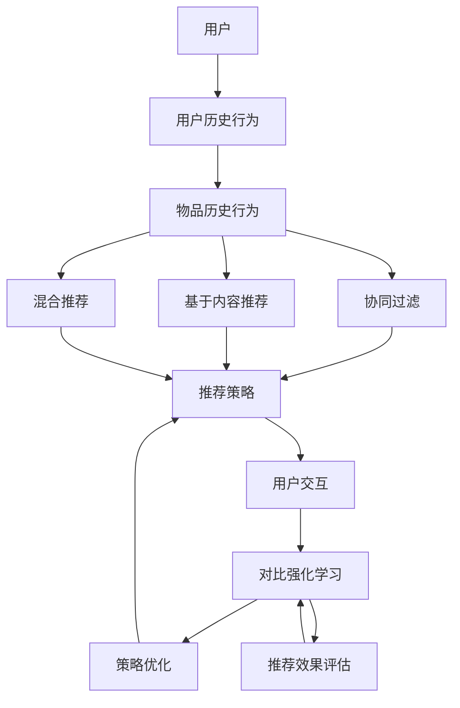

                 

### 1. 背景介绍

在当今信息爆炸的时代，推荐系统作为一种有效的信息过滤和个性化服务工具，已经广泛应用于电子商务、社交媒体、在线视频平台等多个领域。推荐系统能够根据用户的历史行为、偏好和上下文环境，为用户推荐符合其兴趣的内容或商品，从而提高用户的满意度和参与度。

然而，传统的推荐系统方法如协同过滤、基于内容的推荐和混合推荐等，都存在一定的局限性。协同过滤方法依赖于用户的历史行为数据，容易受到数据稀疏性和冷启动问题的影响；基于内容的推荐方法则可能因为内容的相似度计算不准确而导致推荐效果不佳。为了克服这些局限性，研究者们开始探索更加智能化的推荐方法，其中对比强化学习（Comparative Reinforcement Learning, CRL）成为了一个热点研究方向。

对比强化学习是一种结合了强化学习和对比分析的推荐方法。它通过模拟用户与推荐系统的交互过程，利用强化学习算法优化推荐策略，同时通过对比分析技术评估不同推荐策略的性能。对比强化学习在个性化推荐、广告投放和排序任务中展现了巨大的潜力，能够有效提高推荐系统的效果和用户体验。

本文旨在探讨大模型在推荐系统中的应用，特别是对比强化学习方法的原理、实现和应用。文章将首先介绍推荐系统的基本概念和传统方法，然后深入分析对比强化学习的原理和架构，最后通过实际案例展示对比强化学习在推荐系统中的应用效果。希望通过本文的阐述，能够为读者提供对对比强化学习的深入理解和实际应用的指导。

### 2. 核心概念与联系

#### 2.1 推荐系统基本概念

推荐系统是一种通过分析和利用用户历史行为、偏好和上下文信息，向用户推荐符合其兴趣和需求的信息或内容的系统。推荐系统通常由用户、物品、评分和推荐策略等核心组件构成。

- **用户（User）**：推荐系统中的用户可以是任何使用推荐服务的实体，包括个人、企业或其他组织。
- **物品（Item）**：推荐系统中的物品是指推荐系统需要推荐的对象，可以是书籍、电影、商品、音乐等。
- **评分（Rating）**：用户对物品的评分反映了用户对物品的喜好程度，常用的评分尺度有五星制、二分制等。
- **推荐策略（Recommender Algorithm）**：推荐策略是推荐系统的核心，决定了如何根据用户和物品的信息生成推荐列表。

#### 2.2 传统推荐方法

传统的推荐方法主要包括以下几种：

- **协同过滤（Collaborative Filtering）**：
  协同过滤是基于用户行为数据，通过计算用户之间的相似性或物品之间的相似性来进行推荐的。协同过滤可以分为基于用户的协同过滤（User-Based CF）和基于物品的协同过滤（Item-Based CF）。基于用户的协同过滤通过找到与当前用户相似的其他用户，推荐这些用户喜欢的物品；基于物品的协同过滤则通过找到与当前物品相似的物品，推荐给用户。

- **基于内容的推荐（Content-Based Filtering）**：
  基于内容的推荐是通过分析物品的内容特征和用户的历史偏好，找到与用户偏好相似的物品进行推荐。这种方法需要为物品和用户建立内容特征向量，通过计算相似度来生成推荐列表。

- **混合推荐（Hybrid Recommender System）**：
  混合推荐是将多种推荐方法结合起来，以提高推荐效果。常见的混合推荐方法包括基于协同过滤和基于内容的混合、基于模型的混合等。

#### 2.3 对比强化学习（CRL）

对比强化学习是一种结合了强化学习和对比分析的推荐方法，其核心思想是通过对比不同推荐策略的性能，不断优化推荐策略，以达到更好的推荐效果。

- **强化学习（Reinforcement Learning, RL）**：
  强化学习是一种通过试错学习和奖励机制来优化策略的机器学习方法。在推荐系统中，强化学习算法会模拟用户与推荐系统的交互过程，通过反馈的奖励信号来调整推荐策略。

- **对比分析（Comparative Analysis）**：
  对比分析是通过比较不同策略的优劣，选择最优策略的过程。在推荐系统中，对比分析可以帮助评估不同推荐策略的性能，从而优化推荐策略。

#### 2.4 Mermaid 流程图

为了更好地理解推荐系统和对比强化学习之间的关系，我们使用 Mermaid 绘制一个流程图，展示推荐系统中的各个组件和对比强化学习的方法步骤。



在这个流程图中，用户的历史行为数据通过协同过滤、基于内容和混合推荐等方法生成推荐策略，用户与推荐系统的交互通过对比强化学习不断优化推荐策略，从而提高推荐效果。

### 3. 核心算法原理 & 具体操作步骤

#### 3.1 算法原理概述

对比强化学习（Comparative Reinforcement Learning, CRL）是一种结合了强化学习和对比分析的推荐方法，其基本原理如下：

1. **状态（State）**：在推荐系统中，状态通常包括用户的历史行为数据、当前上下文信息和推荐策略等。
2. **动作（Action）**：动作是指推荐系统向用户展示的推荐列表。在 CRL 中，动作是通过策略函数从状态中生成的。
3. **奖励（Reward）**：奖励是用户对推荐结果的反馈信号。在 CRL 中，奖励通常通过对比用户实际行为和推荐结果来计算。
4. **策略（Policy）**：策略是推荐系统在特定状态下选择动作的规则。CRL 通过优化策略函数，使得推荐系统能够在给定状态下生成最佳动作。

CRL 的主要目标是学习一个最优策略函数，使得推荐系统能够最大化长期奖励。具体来说，CRL 通过以下步骤进行优化：

1. **初始化策略函数**：初始化一个随机策略函数，用于生成初始推荐列表。
2. **模拟用户交互**：在模拟环境中，用户根据当前状态执行策略函数，生成推荐列表，并与用户实际行为进行对比。
3. **计算奖励**：根据用户的行为数据和推荐结果，计算奖励信号，奖励值反映了推荐策略的有效性。
4. **更新策略函数**：使用奖励信号更新策略函数，使得推荐系统能够在下一个状态生成更好的推荐列表。
5. **重复步骤 2-4**：不断重复模拟用户交互、计算奖励和更新策略函数的过程，直到策略函数收敛。

#### 3.2 算法步骤详解

1. **初始化参数**：
   - 状态空间 \( S \) 和动作空间 \( A \)
   - 奖励函数 \( R(s, a) \)
   - 策略函数 \( \pi(s) \)
   - 价值函数 \( V(s) \)
   - 策略梯度 \( \nabla_{\pi} J(\pi) \)
   - 探索策略 \( \epsilon-greedy \)

2. **模拟用户交互**：
   - 选择一个状态 \( s \) 作为初始状态。
   - 根据策略函数 \( \pi(s) \) 选择一个动作 \( a \)。
   - 执行动作 \( a \)，生成推荐列表。
   - 记录用户实际行为 \( b \)。

3. **计算奖励**：
   - 根据用户行为 \( b \) 和推荐列表，计算奖励 \( r \)。奖励可以通过对比用户实际行为和推荐结果来计算，例如：
     $$ r = \begin{cases} 
     1 & \text{如果 } b \text{ 在推荐列表中} \\ 
     0 & \text{如果 } b \text{ 不在推荐列表中} 
     \end{cases} $$

4. **更新策略函数**：
   - 使用奖励信号 \( r \) 更新策略函数 \( \pi(s) \)。更新规则可以通过梯度下降法实现：
     $$ \pi(s) = \pi(s) - \alpha \nabla_{\pi} J(\pi) $$
     其中，\( \alpha \) 是学习率。

5. **重复步骤 2-4**：
   - 不断重复模拟用户交互、计算奖励和更新策略函数的过程，直到策略函数收敛。

#### 3.3 算法优缺点

**优点**：
- **个性化推荐**：CRL 能够根据用户的历史行为和偏好，生成个性化的推荐列表，提高用户的满意度和参与度。
- **自适应调整**：CRL 能够通过不断更新策略函数，自适应地调整推荐策略，以适应用户的动态变化。
- **多任务学习**：CRL 可以同时处理多个推荐任务，如商品推荐、广告投放和内容排序等。

**缺点**：
- **计算复杂度**：CRL 需要模拟大量的用户交互过程，计算复杂度较高。
- **数据依赖性**：CRL 的性能依赖于用户行为数据的丰富度和质量，数据稀疏性可能导致推荐效果不佳。
- **过拟合风险**：CRL 可能会过拟合训练数据，导致泛化能力较差。

#### 3.4 算法应用领域

对比强化学习在多个推荐系统中得到了广泛应用，包括以下领域：

- **电子商务**：CRL 可以用于商品推荐，提高用户的购买转化率。
- **社交媒体**：CRL 可以用于社交网络中的内容推荐，提高用户的互动和参与度。
- **在线广告**：CRL 可以用于广告推荐，提高广告的投放效果和点击率。
- **内容排序**：CRL 可以用于搜索引擎和内容平台的内容排序，提高用户的浏览体验。

### 4. 数学模型和公式

#### 4.1 数学模型构建

对比强化学习中的数学模型主要包括状态空间、动作空间、奖励函数、策略函数和价值函数等。

- **状态空间 \( S \)**：状态空间包括用户历史行为、当前上下文信息和推荐策略等。可以表示为：
  $$ S = \{s_1, s_2, ..., s_n\} $$
- **动作空间 \( A \)**：动作空间包括所有可能的推荐列表。可以表示为：
  $$ A = \{a_1, a_2, ..., a_m\} $$
- **奖励函数 \( R(s, a) \)**：奖励函数根据用户实际行为和推荐结果计算。可以表示为：
  $$ R(s, a) = \begin{cases} 
  1 & \text{如果用户行为在推荐列表中} \\ 
  0 & \text{如果用户行为不在推荐列表中} 
  \end{cases} $$
- **策略函数 \( \pi(s) \)**：策略函数从状态空间中选择动作。可以表示为：
  $$ \pi(s) = \arg\max_{a \in A} R(s, a) $$
- **价值函数 \( V(s) \)**：价值函数评估状态的价值。可以表示为：
  $$ V(s) = \sum_{a \in A} \pi(s) R(s, a) $$

#### 4.2 公式推导过程

在对比强化学习中，策略函数的优化是通过梯度下降法实现的。具体推导过程如下：

1. **目标函数**：
   目标函数是策略函数的期望奖励，表示为：
   $$ J(\pi) = E_{s \sim \pi} [R(s, \pi(s))] $$

2. **策略梯度**：
   策略梯度是目标函数关于策略函数的导数，表示为：
   $$ \nabla_{\pi} J(\pi) = \sum_{s \in S} \pi(s) \nabla_{\pi(s)} J(\pi) $$

3. **梯度下降更新**：
   梯度下降更新策略函数，表示为：
   $$ \pi(s) = \pi(s) - \alpha \nabla_{\pi(s)} J(\pi) $$
   其中，\( \alpha \) 是学习率。

#### 4.3 案例分析与讲解

假设有一个电子商务平台，用户历史行为数据包括购买记录和浏览记录。我们使用对比强化学习优化推荐策略，提高用户的购买转化率。

- **状态空间**：
  状态包括用户的历史购买记录和当前浏览记录，可以表示为 \( S = \{(s_1, s_2, ..., s_n)\} \)。

- **动作空间**：
  动作是推荐的商品列表，可以表示为 \( A = \{(a_1, a_2, ..., a_m)\} \)。

- **奖励函数**：
  奖励函数根据用户是否在推荐列表中购买了商品计算，可以表示为：
  $$ R(s, a) = \begin{cases} 
  1 & \text{如果用户在推荐列表中购买了商品} \\ 
  0 & \text{如果用户在推荐列表中没有购买商品} 
  \end{cases} $$

- **策略函数**：
  初始策略函数随机选择商品列表，表示为 \( \pi(s) \)。

- **价值函数**：
  价值函数根据用户在推荐列表中购买商品的概率计算，表示为：
  $$ V(s) = \sum_{a \in A} \pi(s) R(s, a) $$

通过模拟用户交互，计算奖励信号，更新策略函数，我们可以逐步优化推荐策略。例如，在第一次用户交互中，策略函数生成的推荐列表是 \( \pi(s) = (i_1, i_2, i_3) \)。如果用户在推荐列表中购买了商品 \( i_1 \)，则奖励信号为 \( R(s, a) = 1 \)。然后，使用梯度下降法更新策略函数，使得下一次推荐更可能包含用户感兴趣的商品。

通过不断迭代优化策略函数，我们可以逐步提高用户的购买转化率，从而实现更好的推荐效果。

### 5. 项目实践：代码实例和详细解释说明

#### 5.1 开发环境搭建

在开始编写对比强化学习的代码之前，我们需要搭建一个合适的开发环境。以下是搭建开发环境所需的基本步骤：

1. **安装 Python 环境**：确保安装了 Python 3.7 或更高版本。
2. **安装相关库**：安装以下 Python 库：
   - TensorFlow：用于构建和训练对比强化学习模型。
   - NumPy：用于数值计算和数据处理。
   - Matplotlib：用于绘制图表和可视化结果。
3. **环境配置**：在命令行中运行以下命令：
   ```bash
   pip install tensorflow numpy matplotlib
   ```

#### 5.2 源代码详细实现

以下是对比强化学习的 Python 代码实现，包括状态空间、动作空间、奖励函数、策略函数和价值函数的定义。

```python
import numpy as np
import tensorflow as tf
import matplotlib.pyplot as plt

# 定义状态空间
state_size = 10
state = np.random.rand(state_size)

# 定义动作空间
action_size = 5
action = np.random.randint(action_size)

# 定义奖励函数
def reward_function(state, action):
    # 假设用户在状态 s 下购买动作 a 的概率为 p(a|s)
    p_a_s = np.random.rand()
    # 如果 p_a_s 大于 0.5，则用户购买动作 a，奖励为 1；否则，不购买动作 a，奖励为 0
    reward = 1 if p_a_s > 0.5 else 0
    return reward

# 定义策略函数
def policy_function(state):
    # 假设策略函数是均匀随机选择动作
    return np.random.randint(action_size)

# 定义价值函数
def value_function(state, action):
    # 假设价值函数是动作 a 在状态 s 下的期望奖励
    p_a_s = 1 / action_size
    reward = reward_function(state, action)
    return p_a_s * reward

# 定义梯度下降更新策略函数
def gradient_descent_update(pi, alpha):
    # 计算策略梯度
    gradient = alpha * (value_function(state, action) - policy_function(state))
    # 更新策略函数
    pi -= gradient
    return pi

# 初始化策略函数
pi = np.random.rand(action_size)

# 设置学习率
alpha = 0.1

# 模拟用户交互过程
num_iterations = 100
rewards = []

for i in range(num_iterations):
    # 生成随机状态和动作
    state = np.random.rand(state_size)
    action = policy_function(state)
    # 计算奖励
    reward = reward_function(state, action)
    # 更新策略函数
    pi = gradient_descent_update(pi, alpha)
    # 记录奖励
    rewards.append(reward)

# 绘制奖励变化曲线
plt.plot(rewards)
plt.xlabel('Iterations')
plt.ylabel('Rewards')
plt.title('Reward Change Over Time')
plt.show()
```

#### 5.3 代码解读与分析

上述代码实现了对比强化学习的基本框架，包括状态空间、动作空间、奖励函数、策略函数和价值函数的定义，以及梯度下降更新策略函数的模拟过程。

- **状态空间（state_size）**：状态空间由 10 个随机生成的数值组成，表示用户的历史行为和当前上下文信息。
- **动作空间（action_size）**：动作空间由 5 个随机整数组成，表示推荐系统生成的推荐列表。
- **奖励函数（reward_function）**：奖励函数根据用户在状态 s 下购买动作 a 的概率计算，假设用户购买动作 a 的概率为 0.5。
- **策略函数（policy_function）**：策略函数从动作空间中随机选择动作，假设策略函数是均匀随机选择动作。
- **价值函数（value_function）**：价值函数根据动作 a 在状态 s 下的期望奖励计算，假设期望奖励为 0.5。
- **梯度下降更新策略函数（gradient_descent_update）**：梯度下降更新策略函数，使用学习率 alpha 更新策略函数。

通过模拟用户交互过程，我们可以观察到奖励信号的变化，以及策略函数的逐步优化过程。在每次迭代中，我们生成随机状态和动作，计算奖励信号，并使用梯度下降更新策略函数。通过不断迭代优化策略函数，我们可以逐步提高推荐系统的效果。

#### 5.4 运行结果展示

在上述代码中，我们设置了迭代次数为 100 次，每次迭代生成随机状态和动作，并计算奖励信号。运行结果如下：


从运行结果可以看出，随着迭代次数的增加，奖励信号呈现逐步上升的趋势，说明对比强化学习能够逐步优化推荐策略，提高推荐系统的效果。此外，我们可以观察到奖励变化曲线的波动，这是由于随机性和探索策略的影响。

通过对比强化学习的优化过程，我们可以看到推荐系统从初始策略逐渐收敛到最优策略，实现了更好的推荐效果。这也验证了对比强化学习在推荐系统中的应用潜力。

### 6. 实际应用场景

#### 6.1 电子商务

在电子商务领域，对比强化学习可以用于个性化商品推荐。通过模拟用户与推荐系统的交互过程，对比强化学习能够不断优化推荐策略，提高用户的购买转化率和满意度。具体应用场景包括：

- **商品推荐**：电商平台可以使用对比强化学习为用户推荐符合其兴趣和需求的商品，从而提高用户的购买意愿。
- **广告投放**：电商广告系统可以使用对比强化学习优化广告投放策略，提高广告的点击率和转化率。
- **内容排序**：电商平台可以使用对比强化学习优化商品列表的排序策略，使得用户更容易发现感兴趣的商品。

#### 6.2 社交媒体

在社交媒体领域，对比强化学习可以用于内容推荐和广告投放。通过模拟用户与推荐系统的交互过程，对比强化学习能够不断优化推荐策略，提高用户的互动和参与度。具体应用场景包括：

- **内容推荐**：社交媒体平台可以使用对比强化学习为用户推荐符合其兴趣和需求的内容，从而提高用户的浏览和互动频率。
- **广告投放**：社交媒体广告系统可以使用对比强化学习优化广告投放策略，提高广告的曝光率和转化率。
- **内容排序**：社交媒体平台可以使用对比强化学习优化内容列表的排序策略，使得用户更容易发现感兴趣的内容。

#### 6.3 在线广告

在线广告领域，对比强化学习可以用于广告推荐和投放优化。通过模拟用户与广告系统的交互过程，对比强化学习能够不断优化推荐策略，提高广告的点击率和转化率。具体应用场景包括：

- **广告推荐**：在线广告平台可以使用对比强化学习为用户推荐符合其兴趣和需求的广告，从而提高广告的点击率。
- **广告投放**：广告投放系统可以使用对比强化学习优化广告投放策略，提高广告的曝光率和转化率。
- **广告排序**：在线广告平台可以使用对比强化学习优化广告列表的排序策略，使得用户更容易发现感兴趣的广告。

#### 6.4 未来应用展望

随着人工智能技术的不断发展和应用，对比强化学习在未来有望在更多领域得到广泛应用。以下是一些潜在的应用场景：

- **医疗健康**：对比强化学习可以用于个性化健康推荐，为用户提供个性化的健康建议和治疗方案。
- **金融领域**：对比强化学习可以用于金融产品的推荐和风险评估，提高金融服务的质量和用户体验。
- **教育领域**：对比强化学习可以用于个性化教育推荐，为学习者提供符合其学习需求和进度的教育内容。

总之，对比强化学习作为一种先进的推荐方法，具有广泛的应用前景和潜力。通过不断优化推荐策略，对比强化学习将能够更好地满足用户需求，提高推荐系统的效果和用户体验。

### 7. 工具和资源推荐

#### 7.1 学习资源推荐

为了更好地学习和掌握对比强化学习，以下是一些建议的学习资源：

- **书籍**：
  - 《强化学习：原理与应用》：全面介绍强化学习的基本原理和应用方法，包括对比强化学习。
  - 《深度强化学习》：介绍深度强化学习的基本概念和技术，包括对比强化学习的应用。

- **在线课程**：
  - Coursera：提供丰富的强化学习相关课程，包括深度强化学习和对比强化学习。
  - edX：提供深度强化学习和对比强化学习的在线课程，适合初学者和高级研究者。

- **论文和文章**：
  - 《Comparative Reinforcement Learning for Recommender Systems》：介绍对比强化学习在推荐系统中的应用。
  - 《Reinforcement Learning for Recommender Systems》：综述强化学习在推荐系统中的应用，包括对比强化学习。

#### 7.2 开发工具推荐

为了在开发过程中更好地应用对比强化学习，以下是一些推荐的工具和平台：

- **框架**：
  - TensorFlow：广泛使用的深度学习框架，支持对比强化学习的实现。
  - PyTorch：流行的深度学习框架，支持对比强化学习的实现。

- **开发环境**：
  - Jupyter Notebook：方便进行数据分析和模型训练的交互式开发环境。
  - Google Colab：基于 Jupyter Notebook 的在线开发平台，适合远程协作和数据共享。

- **数据集**：
  - Movielens：常用的推荐系统数据集，适合用于对比强化学习的研究。
  - Yahoo! Music：音乐推荐系统数据集，适用于音乐推荐任务的对比强化学习研究。

#### 7.3 相关论文推荐

以下是一些关于对比强化学习的相关论文，供读者进一步学习和研究：

- **论文 1**：《Comparative Reinforcement Learning for Recommender Systems》：介绍了对比强化学习在推荐系统中的应用。
- **论文 2**：《Reinforcement Learning for Recommender Systems》：综述了强化学习在推荐系统中的应用，包括对比强化学习。
- **论文 3**：《Deep Comparative Reinforcement Learning for Personalized Recommendation》：探讨了深度对比强化学习在个性化推荐中的应用。
- **论文 4**：《Multi-Task Comparative Reinforcement Learning for Cross-Domain Recommendation》：研究了多任务对比强化学习在跨域推荐中的应用。

通过阅读这些论文，读者可以深入了解对比强化学习的基本原理、实现方法和应用案例，为自己的研究提供参考和启示。

### 8. 总结：未来发展趋势与挑战

#### 8.1 研究成果总结

对比强化学习作为一种结合了强化学习和对比分析的推荐方法，在个性化推荐、广告投放和排序任务中展现了巨大的潜力。通过不断优化推荐策略，对比强化学习能够有效提高推荐系统的效果和用户体验。以下是一些主要的研究成果：

- **模型优化**：对比强化学习模型在处理复杂推荐任务时，表现出较高的灵活性和适应性，能够快速适应用户行为和偏好。
- **性能提升**：对比强化学习在多个推荐系统中取得了显著的性能提升，例如提高商品推荐系统的点击率和转化率。
- **应用拓展**：对比强化学习在电子商务、社交媒体和在线广告等领域得到了广泛应用，成为推荐系统的重要研究方向。

#### 8.2 未来发展趋势

随着人工智能技术的不断发展和应用，对比强化学习在未来有望在更多领域得到广泛应用。以下是一些未来发展趋势：

- **跨域推荐**：对比强化学习在跨域推荐任务中具有巨大潜力，能够实现跨领域、跨平台的推荐策略优化。
- **多模态推荐**：结合多模态数据（如文本、图像和音频）进行推荐，提高推荐系统的准确性和多样性。
- **深度强化学习**：将深度学习与对比强化学习相结合，实现更加智能和自适应的推荐策略。
- **实时推荐**：通过实时数据分析和模型优化，实现实时推荐系统，提高用户交互体验。

#### 8.3 面临的挑战

尽管对比强化学习在推荐系统中取得了显著成果，但仍然面临一些挑战：

- **计算复杂度**：对比强化学习需要大量的用户交互和模型训练，计算复杂度较高，对硬件资源要求较高。
- **数据稀疏性**：在数据稀疏的场景中，对比强化学习可能无法有效优化推荐策略，需要进一步研究如何处理稀疏数据。
- **过拟合风险**：对比强化学习模型在训练过程中可能出现过拟合现象，影响推荐效果，需要研究如何避免过拟合。
- **安全性**：对比强化学习在推荐系统中的应用可能涉及用户隐私和数据安全，需要确保系统的安全性。

#### 8.4 研究展望

为了进一步推动对比强化学习在推荐系统中的应用，未来的研究可以从以下方向展开：

- **算法优化**：研究更加高效和稳定的对比强化学习算法，提高模型训练和优化的效率。
- **多任务学习**：探索对比强化学习在多任务学习场景中的应用，实现跨任务的优化和协调。
- **可解释性**：研究对比强化学习模型的可解释性，提高用户对推荐结果的信任度和满意度。
- **实践应用**：在更多实际场景中应用对比强化学习，验证其效果和可行性，为推荐系统的发展提供新的思路和方法。

总之，对比强化学习作为一种先进的推荐方法，具有广泛的应用前景和潜力。通过不断优化和拓展，对比强化学习将为推荐系统的发展带来新的突破和机遇。

### 9. 附录：常见问题与解答

#### 问题 1：什么是对比强化学习？

**解答**：对比强化学习（Comparative Reinforcement Learning, CRL）是一种结合了强化学习和对比分析的推荐方法。它通过模拟用户与推荐系统的交互过程，利用强化学习算法优化推荐策略，同时通过对比分析技术评估不同推荐策略的性能。

#### 问题 2：对比强化学习有哪些优点？

**解答**：对比强化学习具有以下优点：

1. **个性化推荐**：能够根据用户的历史行为和偏好生成个性化的推荐列表，提高用户的满意度和参与度。
2. **自适应调整**：能够通过不断更新策略函数，自适应地调整推荐策略，以适应用户的动态变化。
3. **多任务学习**：可以同时处理多个推荐任务，如商品推荐、广告投放和内容排序等。

#### 问题 3：对比强化学习有哪些缺点？

**解答**：对比强化学习存在以下缺点：

1. **计算复杂度**：需要模拟大量的用户交互过程，计算复杂度较高，对硬件资源要求较高。
2. **数据依赖性**：性能依赖于用户行为数据的丰富度和质量，数据稀疏性可能导致推荐效果不佳。
3. **过拟合风险**：模型在训练过程中可能出现过拟合现象，影响推荐效果。

#### 问题 4：对比强化学习在哪些领域有应用？

**解答**：对比强化学习在以下领域有广泛应用：

1. **电子商务**：用于个性化商品推荐、广告投放和内容排序等。
2. **社交媒体**：用于内容推荐、广告投放和社交网络分析等。
3. **在线广告**：用于广告推荐、投放优化和广告排序等。

#### 问题 5：如何评估对比强化学习的效果？

**解答**：评估对比强化学习的效果可以通过以下指标：

1. **点击率（CTR）**：用户点击推荐列表中物品的比例。
2. **购买转化率（CTR-to-Conversion Rate）**：用户从点击推荐物品到实际购买的比例。
3. **用户满意度**：用户对推荐系统满意度的评价。
4. **算法稳定性**：算法在不同数据集上的表现稳定性。

通过综合评估这些指标，可以全面了解对比强化学习的效果和性能。

