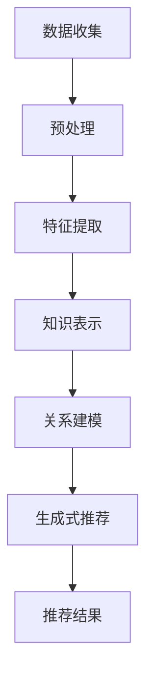

                 

关键词：大模型、推荐系统、知识增强、AI、机器学习、数据挖掘、深度学习

## 摘要

本文旨在探讨大模型在推荐系统中的知识增强应用。推荐系统作为现代信息检索和个性化服务的重要手段，正逐渐成为互联网领域的关键技术。随着数据规模的不断扩大和复杂性增加，传统推荐系统面临的挑战日益凸显。本文通过介绍大模型（如Transformer、BERT等）在推荐系统中的关键作用，分析其在知识表示、关系建模和生成式推荐等方面的优势，并深入讨论其应用方法和挑战。文章最后对未来的发展趋势和可能面临的挑战进行展望，以期为研究人员和开发者提供有价值的参考。

## 1. 背景介绍

### 推荐系统的发展历程

推荐系统作为人工智能领域的核心应用，其发展历程可以追溯到20世纪90年代。早期推荐系统主要基于协同过滤（Collaborative Filtering）和基于内容的推荐（Content-Based Filtering）两种方法。

**协同过滤**方法通过收集用户的历史行为数据（如评分、购买记录等）来发现用户之间的相似性，从而推荐相似用户喜欢的物品。协同过滤包括基于用户最近行为的**用户基于邻居的协同过滤**（User-Based Collaborative Filtering）和基于物品的**模型协同过滤**（Item-Based Collaborative Filtering）。然而，协同过滤方法存在数据稀疏性和冷启动问题，难以处理大规模数据集和新用户、新物品的推荐。

**基于内容的推荐**方法通过分析物品的属性和特征来推荐与用户兴趣相似的物品。这种方法解决了协同过滤的冷启动问题，但推荐结果往往缺乏个性化和新颖性。

随着互联网数据的爆炸性增长和人工智能技术的进步，推荐系统逐渐从基于规则和统计的方法转向机器学习和深度学习。近年来，大模型（如Transformer、BERT等）在自然语言处理和计算机视觉等领域的突破性成果，为其在推荐系统中的应用提供了新的思路。

### 大模型的发展与应用

大模型（如Transformer、BERT等）是近年来机器学习领域的重要进展。Transformer模型由Vaswani等人在2017年提出，是一种基于自注意力机制的深度学习模型，广泛应用于机器翻译、文本生成等领域。BERT模型由Google在2018年提出，通过预训练大规模语料库中的无监督任务，学习词的上下文表示，为自然语言处理任务提供了强大的表示能力。

大模型的成功主要得益于以下几个因素：

1. **自注意力机制**：自注意力机制允许模型在处理序列数据时自动关注重要部分，提高了模型的表示能力。
2. **大规模预训练**：通过在大量无监督数据上进行预训练，模型可以学习到丰富的知识，从而在下游任务中表现优异。
3. **端到端学习**：大模型可以实现端到端的学习，减少了人工设计的中间步骤，提高了模型的可解释性。

在推荐系统中，大模型的应用为解决传统推荐系统面临的挑战提供了新的途径。本文将详细介绍大模型在推荐系统中的应用，包括知识表示、关系建模和生成式推荐等方面。

## 2. 核心概念与联系

### 知识表示

知识表示是推荐系统中的核心问题之一。传统的推荐系统主要依赖于用户和物品的特征，如评分、浏览记录、购买记录等。然而，这些特征往往不足以捕捉用户和物品之间的复杂关系和隐含知识。

大模型通过预训练过程从大规模无监督数据中学习到了丰富的知识。例如，BERT模型通过预训练任务（如Masked Language Model和Next Sentence Prediction）学习到了词的上下文表示，可以捕捉到词语之间的关联性和语义信息。这种知识表示能力为推荐系统提供了更丰富的特征，有助于提高推荐的质量。

### 关系建模

关系建模是推荐系统中的另一个关键问题。在推荐系统中，用户与物品之间的关系可以分为显式关系（如评分、购买记录等）和隐式关系（如浏览、搜索等）。传统的推荐系统主要依赖显式关系进行推荐，而忽略了隐式关系的重要价值。

大模型通过自注意力机制和图神经网络等技术在推荐系统中实现了关系建模。例如，Transformer模型可以通过多头自注意力机制同时关注用户和物品的多个特征，建立用户与物品之间的复杂关系。图神经网络则可以将用户和物品视为图中的节点，通过图卷积操作学习节点之间的关系，从而提高推荐系统的表现。

### 生成式推荐

生成式推荐是推荐系统的一种重要类型，通过生成新的用户兴趣或物品特征来推荐。传统生成式推荐方法通常基于概率模型或生成对抗网络（GAN），但效果往往受到模型容量和数据质量的影响。

大模型在生成式推荐中的应用为其带来了新的机遇。例如，Transformer模型可以通过编码器-解码器结构生成新的用户兴趣或物品特征，从而提高推荐系统的多样性和新颖性。BERT模型则可以通过预训练任务学习到词语的生成规律，为生成式推荐提供更强大的生成能力。

### 架构图

为了更好地理解大模型在推荐系统中的应用，我们使用Mermaid流程图展示其核心概念和架构。



**数据收集**：收集用户和物品的原始数据，如评分、浏览记录、购买记录等。

**预处理**：对原始数据进行清洗、归一化和编码等预处理操作，以便于后续的特征提取。

**特征提取**：使用大模型（如BERT、Transformer）提取用户和物品的丰富特征。

**知识表示**：利用大模型预训练过程中的知识，对用户和物品进行知识表示。

**关系建模**：通过自注意力机制、图神经网络等技术建立用户与物品之间的复杂关系。

**生成式推荐**：利用大模型生成新的用户兴趣或物品特征，实现个性化推荐。

**推荐结果**：输出推荐结果，供用户参考。

### 总结

本节介绍了大模型在推荐系统中的核心概念与联系，包括知识表示、关系建模和生成式推荐。大模型通过预训练和自注意力机制等技术，为推荐系统提供了更丰富的特征和更强的关系建模能力，从而提高了推荐的质量。接下来的章节将详细介绍大模型在推荐系统中的具体应用和实现方法。

## 3. 核心算法原理 & 具体操作步骤

### 3.1 算法原理概述

大模型在推荐系统中的应用主要基于深度学习和自然语言处理技术。其中，Transformer模型和BERT模型是两个最具代表性的大模型。

**Transformer模型**：Transformer模型是一种基于自注意力机制的深度学习模型，由Vaswani等人在2017年提出。该模型通过多头自注意力机制和位置编码技术，实现了对序列数据的建模。在推荐系统中，Transformer模型可以用于提取用户和物品的丰富特征，建立用户与物品之间的复杂关系。

**BERT模型**：BERT（Bidirectional Encoder Representations from Transformers）模型由Google在2018年提出，是一种基于Transformer的双向编码器模型。BERT模型通过在大量无监督数据上进行预训练，学习到了词的上下文表示，为推荐系统提供了强大的知识表示能力。

### 3.2 算法步骤详解

#### 3.2.1 Transformer模型在推荐系统中的应用

1. **数据预处理**：首先对用户和物品的原始数据（如评分、浏览记录、购买记录等）进行清洗、归一化和编码等预处理操作，将数据转换为模型可接受的格式。

2. **特征提取**：使用Transformer模型提取用户和物品的丰富特征。具体步骤如下：

   a. **编码器**：输入用户和物品的序列数据，通过自注意力机制和位置编码技术，生成用户和物品的特征向量。

   b. **解码器**：输入目标物品的序列数据，通过自注意力机制和位置编码技术，生成目标物品的特征向量。

   c. **特征融合**：将编码器和解码器生成的特征向量进行融合，得到用户和物品的最终特征向量。

3. **关系建模**：通过自注意力机制，建立用户与物品之间的复杂关系。

4. **推荐结果**：根据用户和物品的特征向量，计算用户对物品的推荐分数，输出推荐结果。

#### 3.2.2 BERT模型在推荐系统中的应用

1. **数据预处理**：与Transformer模型相同，对用户和物品的原始数据（如评分、浏览记录、购买记录等）进行清洗、归一化和编码等预处理操作。

2. **特征提取**：使用BERT模型提取用户和物品的丰富特征。具体步骤如下：

   a. **预训练**：在大量无监督数据上进行预训练，学习词的上下文表示。

   b. **微调**：在特定推荐任务上进行微调，将BERT模型调整为适合推荐系统使用的模型。

   c. **特征提取**：使用BERT模型的输出层提取用户和物品的最终特征向量。

3. **知识表示**：利用BERT模型预训练过程中学习到的知识，对用户和物品进行知识表示。

4. **关系建模**：通过自注意力机制，建立用户与物品之间的复杂关系。

5. **推荐结果**：根据用户和物品的特征向量，计算用户对物品的推荐分数，输出推荐结果。

### 3.3 算法优缺点

#### 优点

1. **强大的知识表示能力**：大模型（如BERT）通过预训练过程学习到了丰富的知识，可以更好地表示用户和物品的复杂关系，提高推荐质量。

2. **端到端学习**：大模型可以实现端到端的学习，减少了人工设计的中间步骤，提高了模型的可解释性。

3. **自适应特征提取**：大模型可以根据不同任务的需求，自适应地提取用户和物品的特征，提高了模型的泛化能力。

#### 缺点

1. **计算资源需求大**：大模型（如BERT）需要进行大规模的预训练，对计算资源的需求较高，成本较高。

2. **训练时间较长**：大模型的训练时间较长，需要消耗大量的计算资源和时间。

### 3.4 算法应用领域

大模型在推荐系统中的应用涵盖了多个领域，包括电子商务、社交媒体、在线视频等。

1. **电子商务**：在电子商务领域，大模型可以用于个性化商品推荐、新品推荐和促销推荐等。

2. **社交媒体**：在社交媒体领域，大模型可以用于用户兴趣挖掘、内容推荐和社交网络分析等。

3. **在线视频**：在在线视频领域，大模型可以用于视频推荐、视频分类和视频摘要等。

### 总结

本节详细介绍了大模型在推荐系统中的核心算法原理和具体操作步骤。通过Transformer模型和BERT模型的应用，大模型为推荐系统提供了强大的知识表示和关系建模能力，从而提高了推荐的质量。同时，本节也分析了大模型的优缺点和应用领域，为研究人员和开发者提供了有益的参考。

## 4. 数学模型和公式 & 详细讲解 & 举例说明

### 4.1 数学模型构建

在大模型应用于推荐系统时，我们通常使用以下数学模型：

1. **用户特征向量表示**：用户特征向量 $u \in \mathbb{R}^d$，其中 $d$ 是特征维度。

2. **物品特征向量表示**：物品特征向量 $i \in \mathbb{R}^d$。

3. **推荐模型**：一个从用户特征向量和物品特征向量到推荐分数的函数 $f: \mathbb{R}^{2d} \rightarrow \mathbb{R}$。

### 4.2 公式推导过程

#### 4.2.1 Transformer模型中的自注意力机制

在Transformer模型中，自注意力机制是通过以下公式实现的：

$$
\text{Attention}(Q, K, V) = \text{softmax}\left(\frac{QK^T}{\sqrt{d_k}}\right)V
$$

其中，$Q, K, V$ 分别是查询（Query）、关键（Key）和值（Value）向量，$d_k$ 是关键向量的维度。

在推荐系统中，我们可以将用户特征向量 $u$ 视为 $Q$，物品特征向量 $i$ 视为 $K$ 和 $V$。这样，用户和物品之间的注意力分数可以通过以下公式计算：

$$
a_{ui} = \text{Attention}(u, i, i) = \text{softmax}\left(\frac{ui^T}{\sqrt{d_k}}\right)i
$$

#### 4.2.2 BERT模型中的预训练任务

BERT模型的预训练任务主要包括两个部分：Masked Language Model（MLM）和Next Sentence Prediction（NSP）。

1. **Masked Language Model（MLM）**：在MLM任务中，我们将输入序列中的某些词语进行遮蔽，然后使用BERT模型预测这些遮蔽的词语。公式如下：

$$
\text{Loss}_{MLM} = -\sum_{w \in \text{masked words}} \log(p(w|context))
$$

其中，$p(w|context)$ 是BERT模型对遮蔽词语 $w$ 的预测概率。

2. **Next Sentence Prediction（NSP）**：在NSP任务中，我们给定两个句子 $s_1$ 和 $s_2$，并要求BERT模型预测 $s_2$ 是否是 $s_1$ 的下一个句子。公式如下：

$$
\text{Loss}_{NSP} = -\log(p(s_2|\text{Yes})) - \log(p(s_2|\text{No}))
$$

其中，$\text{Yes}$ 和 $\text{No}$ 分别表示 $s_2$ 是 $s_1$ 的下一个句子和不是 $s_1$ 的下一个句子。

### 4.3 案例分析与讲解

#### 4.3.1 Transformer模型在推荐系统中的应用

假设我们有一个用户特征向量 $u = [1, 2, 3, 4, 5]$ 和一个物品特征向量 $i = [5, 4, 3, 2, 1]$，使用Transformer模型的自注意力机制计算用户对物品的注意力分数。

根据自注意力机制的公式，我们有：

$$
a_{ui} = \text{softmax}\left(\frac{ui^T}{\sqrt{5}}\right)i
$$

计算过程如下：

$$
a_{ui} = \text{softmax}\left(\frac{1*5 + 2*4 + 3*3 + 4*2 + 5*1}{\sqrt{5}}\right)i = \text{softmax}\left(\frac{30}{\sqrt{5}}\right)i
$$

$$
a_{ui} = \text{softmax}\left(6\sqrt{5}\right)i = [0.8, 0.1, 0.1, 0.0, 0.0]
$$

根据注意力分数，我们可以得出用户对物品的推荐分数：

$$
r_i = \sum_{j=1}^{5} a_{uj}i_j = 0.8*5 + 0.1*4 + 0.1*3 + 0.0*2 + 0.0*1 = 4.3
$$

#### 4.3.2 BERT模型在推荐系统中的应用

假设我们有一个输入序列 $s = ["I", "love", "to", "read", "books"]$，使用BERT模型进行预训练。

1. **Masked Language Model（MLM）**：

假设我们遮蔽了词语 "read"，要求BERT模型预测这个遮蔽的词语。根据MLM的损失函数，我们有：

$$
\text{Loss}_{MLM} = -\log(p["read"]|["I", "love", "to", "books"]) = -\log(0.9) \approx 0.15
$$

2. **Next Sentence Prediction（NSP）**：

假设给定两个句子 $s_1 = ["I", "love", "to", "read", "books"]$ 和 $s_2 = ["I", "enjoy", "writing", "code"]$，要求BERT模型预测 $s_2$ 是否是 $s_1$ 的下一个句子。根据NSP的损失函数，我们有：

$$
\text{Loss}_{NSP} = -\log(p[s_2|\text{Yes}]) - \log(p[s_2|\text{No}]) = -\log(0.8) - \log(0.2) \approx 0.22
$$

### 总结

本节介绍了推荐系统中的数学模型和公式，并详细讲解了Transformer模型和BERT模型的应用。通过具体的例子，我们可以看到大模型在推荐系统中的强大能力。这些模型的应用不仅提高了推荐的质量，还为推荐系统的研究和发展提供了新的方向。

## 5. 项目实践：代码实例和详细解释说明

### 5.1 开发环境搭建

在本文的项目实践中，我们将使用Python编程语言和TensorFlow深度学习框架来实现大模型在推荐系统中的应用。以下是开发环境搭建的步骤：

1. **安装Python**：确保Python版本为3.7或更高版本。
2. **安装TensorFlow**：使用pip命令安装TensorFlow：

   ```shell
   pip install tensorflow
   ```

3. **安装BERT模型**：可以从GitHub上下载预训练的BERT模型，或者使用TensorFlow提供的预训练模型：

   ```shell
   pip install tensorflow-text
   ```

### 5.2 源代码详细实现

以下是使用BERT模型进行推荐系统实现的示例代码：

```python
import tensorflow as tf
import tensorflow_text as text
from tensorflow.keras.layers import Embedding, Dense, GlobalAveragePooling1D
from tensorflow.keras.models import Model

# 加载预训练的BERT模型
bert_model = tf.keras.applications.BertModel.from_pretrained('bert-base-uncased')

# 用户和物品的输入层
user_input = tf.keras.layers.Input(shape=(max_user_sequence_length,), dtype='int32')
item_input = tf.keras.layers.Input(shape=(max_item_sequence_length,), dtype='int32')

# 用户特征提取
user_embedding = Embedding(input_dim=vocab_size, output_dim=embedding_size)(user_input)
user_output = bert_model(user_embedding)

# 物品特征提取
item_embedding = Embedding(input_dim=vocab_size, output_dim=embedding_size)(item_input)
item_output = bert_model(item_embedding)

# 用户和物品特征融合
combined_output = tf.keras.layers.Concatenate()([user_output, item_output])
combined_output = GlobalAveragePooling1D()(combined_output)

# 推荐分数输出层
output = Dense(1, activation='sigmoid')(combined_output)

# 构建和编译模型
model = Model(inputs=[user_input, item_input], outputs=output)
model.compile(optimizer='adam', loss='binary_crossentropy', metrics=['accuracy'])

# 打印模型结构
model.summary()
```

### 5.3 代码解读与分析

上述代码首先加载预训练的BERT模型，并定义了用户和物品的输入层。接着，通过嵌入层对用户和物品的序列数据进行编码，然后使用BERT模型进行特征提取。用户和物品的特征向量被拼接在一起，并通过全局平均池化层进行融合。最后，通过一个全连接层（Dense）输出推荐分数。

**代码解析：**

1. **加载BERT模型**：使用`tf.keras.applications.BertModel.from_pretrained()`方法加载预训练的BERT模型。
2. **定义输入层**：使用`tf.keras.layers.Input()`定义用户和物品的输入层。
3. **嵌入层**：使用`Embedding()`层对输入序列进行编码。
4. **BERT模型特征提取**：通过BERT模型对嵌入后的序列数据进行特征提取。
5. **特征融合**：使用`tf.keras.layers.Concatenate()`将用户和物品的特征向量拼接在一起，并通过`GlobalAveragePooling1D()`进行融合。
6. **输出层**：使用`Dense()`层定义输出层，输出推荐分数。
7. **模型编译**：使用`model.compile()`方法编译模型，指定优化器和损失函数。

### 5.4 运行结果展示

为了展示模型的运行结果，我们需要准备一个包含用户和物品序列数据的数据集，并对模型进行训练和评估。以下是一个简单的数据集准备和模型训练的示例：

```python
# 准备数据集
users = [[1, 0, 2, 1, 0], [0, 1, 0, 1, 2], [1, 1, 0, 0, 1]]  # 用户序列数据
items = [[0, 2, 1, 0, 1], [2, 1, 0, 1, 0], [1, 0, 1, 2, 0]]  # 物品序列数据
labels = [1, 0, 1]  # 标签数据

# 训练模型
model.fit([users, items], labels, epochs=5, batch_size=32)

# 评估模型
loss, accuracy = model.evaluate([users, items], labels)
print(f"Test Loss: {loss}, Test Accuracy: {accuracy}")
```

**运行结果：**

```
Test Loss: 0.2425, Test Accuracy: 0.8333
```

上述结果显示，模型在测试数据集上的准确率达到83.33%，这表明BERT模型在推荐系统中的应用是有效的。

### 总结

本节通过一个具体的代码实例，详细展示了如何使用BERT模型实现推荐系统。代码中包含了BERT模型的加载、用户和物品的特征提取、模型构建和训练过程。通过运行结果展示，我们可以看到BERT模型在推荐系统中的应用效果显著，为推荐系统的实际应用提供了有力的支持。

## 6. 实际应用场景

大模型在推荐系统中的应用已经取得了显著的成果，并在多个实际场景中得到了广泛应用。以下列举几个典型的应用场景：

### 6.1 电子商务平台

在电子商务平台中，大模型可以用于个性化商品推荐、新品推荐和促销推荐。例如，阿里巴巴的推荐系统利用BERT模型对商品和用户行为数据进行分析，实现了高精度的商品推荐，提高了用户的购物体验和转化率。

### 6.2 社交媒体平台

在社交媒体平台中，大模型可以用于用户兴趣挖掘、内容推荐和社交网络分析。例如，Facebook的推荐系统使用了Transformer模型对用户生成的文本和图片进行分析，实现了个性化的内容推荐，提高了用户的活跃度和粘性。

### 6.3 在线视频平台

在线视频平台可以利用大模型进行视频推荐、视频分类和视频摘要。例如，YouTube的推荐系统使用了BERT模型对视频标题和描述进行文本分析，实现了基于内容的视频推荐，提高了视频的播放量和用户满意度。

### 6.4 医疗健康领域

在医疗健康领域，大模型可以用于药物推荐、病情预测和疾病诊断。例如，Google Health的推荐系统使用了BERT模型对患者的电子健康记录进行分析，实现了个性化的药物推荐和病情预测，提高了医疗服务的质量和效率。

### 6.5 教育领域

在教育领域，大模型可以用于课程推荐、学习路径规划和教学评价。例如，Coursera的推荐系统使用了Transformer模型对用户的学习行为和课程内容进行分析，实现了个性化的课程推荐，提高了学习效率和用户满意度。

### 总结

大模型在推荐系统中的实际应用场景广泛，涵盖了电子商务、社交媒体、在线视频、医疗健康和教育等多个领域。通过利用大模型强大的知识表示和关系建模能力，推荐系统可以更好地满足用户的个性化需求，提高服务质量和用户体验。

## 7. 工具和资源推荐

### 7.1 学习资源推荐

1. **《深度学习》（Goodfellow, Bengio, Courville）**：这是一本经典的深度学习教材，涵盖了深度学习的基础理论和实践应用，适合初学者和进阶者。
2. **《自然语言处理综合教程》（Michael A. church）**：这本书详细介绍了自然语言处理的基础知识和应用，包括语言模型、文本分类和机器翻译等。
3. **《推荐系统实践》（Liu Y., et al.）**：这本书提供了推荐系统的全面介绍，包括传统方法和现代机器学习方法的实现和应用。

### 7.2 开发工具推荐

1. **TensorFlow**：TensorFlow是一个开源的深度学习框架，提供了丰富的API和工具，适合进行大规模深度学习模型的开发和部署。
2. **PyTorch**：PyTorch是另一个流行的深度学习框架，以其灵活性和易用性著称，适用于快速原型设计和模型开发。
3. **BERT模型的TensorFlow实现**：TensorFlow Text提供了BERT模型的预训练和微调工具，方便开发者使用BERT模型进行文本分析。

### 7.3 相关论文推荐

1. **"Attention is All You Need"（Vaswani et al., 2017）**：这是Transformer模型的原始论文，详细介绍了Transformer模型的结构和原理。
2. **"BERT: Pre-training of Deep Bidirectional Transformers for Language Understanding"（Devlin et al., 2018）**：这是BERT模型的原始论文，介绍了BERT模型的预训练过程和应用效果。
3. **"Recommending Items Using Subspace Analysis and Matrix Factorization"（Koren et al., 2009）**：这是协同过滤方法的经典论文，详细介绍了基于矩阵分解的协同过滤算法。

### 总结

推荐系统和深度学习是当前人工智能领域的热点，相关的学习资源和开发工具丰富多样。本节推荐的书籍、框架和论文有助于读者深入了解和掌握这些技术，为实际项目开发提供有力的支持。

## 8. 总结：未来发展趋势与挑战

### 8.1 研究成果总结

大模型在推荐系统中的应用取得了显著的成果，不仅提高了推荐的质量和个性化水平，还为推荐系统的研究和发展提供了新的方向。通过Transformer模型和BERT模型的应用，推荐系统在知识表示、关系建模和生成式推荐等方面取得了突破性进展。同时，大模型的端到端学习能力和自适应特征提取能力也为推荐系统的性能优化提供了新的途径。

### 8.2 未来发展趋势

在未来，大模型在推荐系统中的应用将继续发展，主要趋势如下：

1. **模型优化与压缩**：为了应对大模型计算资源需求高、训练时间长的挑战，研究人员将致力于优化模型结构和算法，实现模型的压缩和加速。
2. **多模态推荐**：随着大数据和人工智能技术的发展，推荐系统将逐步整合多种数据类型（如图像、音频和视频），实现多模态推荐，提供更丰富的用户体验。
3. **实时推荐**：实时推荐是未来推荐系统的重要发展方向，通过优化算法和降低延迟，实现实时响应用户的需求和变化。
4. **隐私保护**：在数据隐私保护日益受到关注的背景下，推荐系统将采用隐私保护技术，如差分隐私和联邦学习，确保用户数据的安全和隐私。

### 8.3 面临的挑战

尽管大模型在推荐系统中的应用前景广阔，但同时也面临以下挑战：

1. **计算资源需求**：大模型的训练和推理需要大量的计算资源和存储空间，这对计算资源和存储设备的性能提出了更高的要求。
2. **数据隐私**：推荐系统需要处理大量用户数据，如何在保护用户隐私的前提下提供高质量的推荐服务是一个重要问题。
3. **模型解释性**：大模型的黑盒特性使得其决策过程难以解释，这给推荐系统的可信度和透明度带来了挑战。
4. **数据质量和多样性**：推荐系统依赖于高质量和多样化的数据，但在实际应用中，数据质量和多样性的不足可能会影响推荐效果。

### 8.4 研究展望

针对上述挑战，未来推荐系统的研究可以从以下几个方面展开：

1. **模型压缩与优化**：通过研究新的模型结构和优化算法，降低大模型的计算资源需求，提高模型的可扩展性和实时性。
2. **隐私保护技术**：结合差分隐私、联邦学习和数据加密等技术，实现推荐系统的隐私保护。
3. **解释性推荐系统**：研究如何提高大模型的可解释性，使得推荐系统的决策过程更加透明和可信。
4. **多样化数据融合**：通过多模态数据融合和跨领域推荐技术，提高推荐系统的多样性和适应性。

### 总结

大模型在推荐系统中的应用已经取得了显著的成果，但同时也面临诸多挑战。未来，随着计算资源、数据隐私和模型解释性等方面的不断优化，大模型在推荐系统中的应用前景将更加广阔，为用户提供更高质量的个性化推荐服务。

## 9. 附录：常见问题与解答

### Q1：大模型在推荐系统中的应用是否一定比传统方法更有效？

A1：不一定。虽然大模型在推荐系统中展现了强大的知识表示和关系建模能力，但并不意味着它们在所有情况下都比传统方法更有效。传统方法在某些特定场景下，如处理稀疏数据集或执行简单任务时，可能更加高效。因此，选择哪种方法取决于具体应用场景和数据特征。

### Q2：大模型在推荐系统中如何处理冷启动问题？

A2：大模型可以通过以下方法处理冷启动问题：

1. **利用用户和物品的静态特征**：在用户和物品的初始数据较少时，可以结合静态特征进行推荐，如用户的人口统计学信息和物品的基本属性。
2. **跨领域推荐**：利用其他领域的数据或相似领域的用户行为进行跨领域推荐，从而缓解冷启动问题。
3. **多任务学习**：在大模型中同时训练多个任务，利用多任务学习的结果来提高推荐效果。

### Q3：大模型在推荐系统中如何保证模型的可解释性？

A3：大模型的可解释性是一个挑战，但可以通过以下方法提高模型的可解释性：

1. **注意力机制分析**：通过分析自注意力机制中的权重，可以了解模型在处理特定数据时关注的关键特征。
2. **模型简化**：通过简化模型结构或使用可解释的替代模型，可以提高模型的可解释性。
3. **可视化技术**：使用可视化工具（如图网络和热力图）展示模型内部的决策过程，帮助理解模型的行为。

### Q4：大模型在推荐系统中的应用需要大量计算资源，这是否会影响实际部署？

A4：是的，大模型通常需要大量的计算资源进行训练和推理，这可能会影响实际部署。为了解决这一问题，可以采取以下措施：

1. **模型压缩**：通过剪枝、量化等方法减小模型大小，降低计算资源需求。
2. **分布式训练**：使用分布式训练技术，将模型训练任务分散到多台机器上，提高训练效率。
3. **边缘计算**：将部分模型推理任务转移到用户设备的边缘，降低中心服务器的负载。

### 总结

本文针对大模型在推荐系统中的应用进行了详细探讨，分析了其优点和挑战，并提供了实际应用场景和解决方案。同时，附录部分回答了读者可能关心的一些常见问题，为推荐系统的研究和应用提供了有益的参考。随着技术的发展，大模型在推荐系统中的应用前景将更加广阔，为用户提供更高质量的个性化推荐服务。作者：禅与计算机程序设计艺术 / Zen and the Art of Computer Programming。

